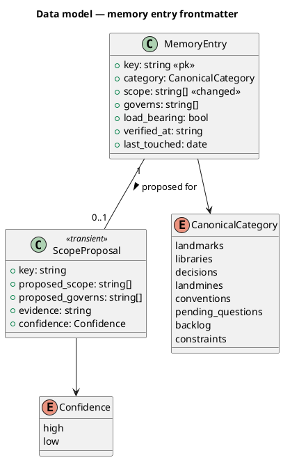
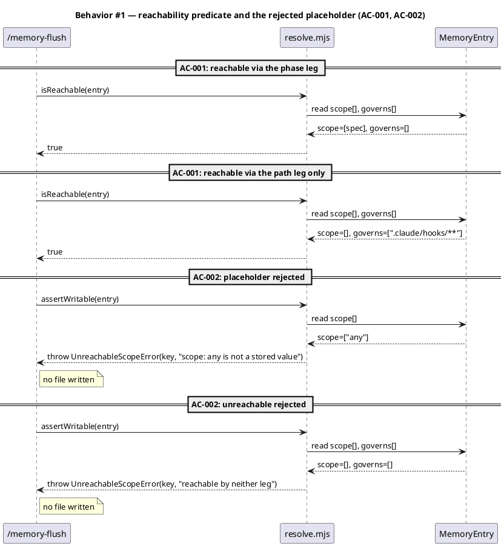
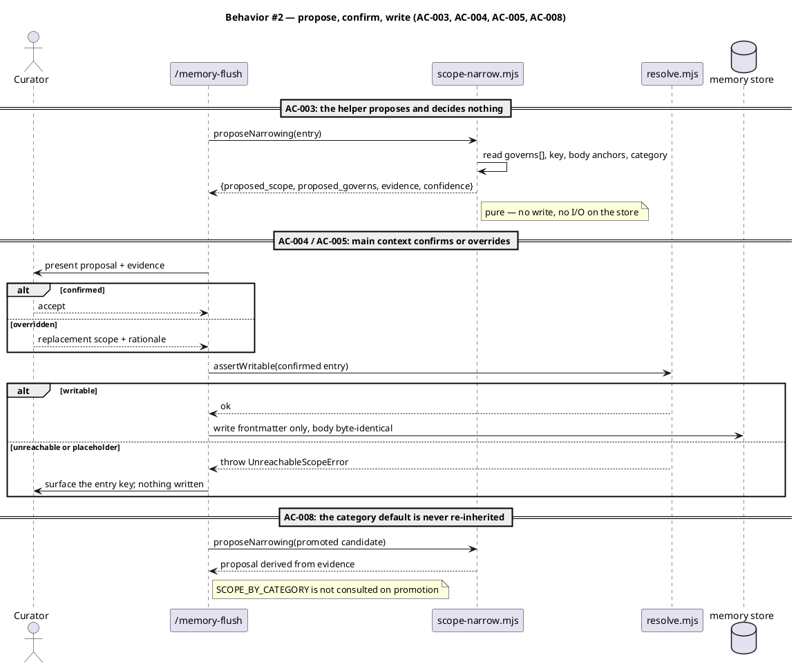
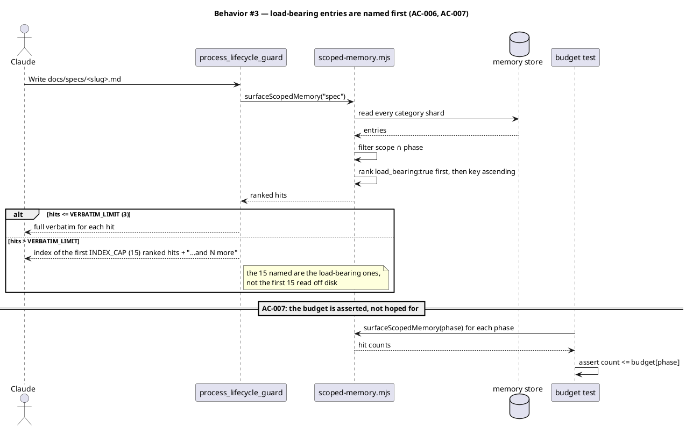
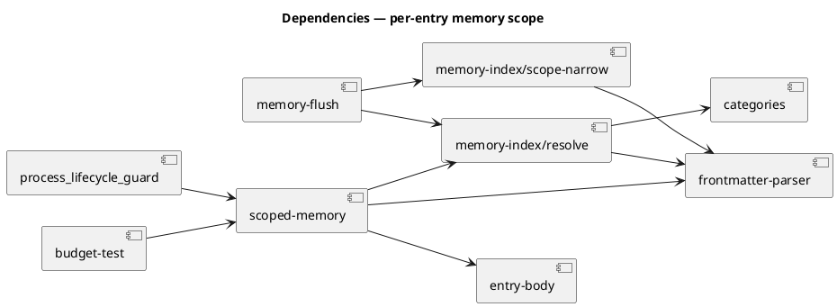

# Per-entry memory scope — narrow the phase leg and close the `any` hole

## Context

| Input | Path |
|---|---|
| Intake | *(none — `spec-entry` track; `intake` is excepted)* |
| BRD *(if any)* | *(none)* |
| Scout *(if any)* | *(none — `scout` is excepted)* |
| Research *(if any)* | *(none — `research` is excepted)* |
| Roadmap item | `docs/roadmap-execution-plan.md` Epic 6 T8 |
| Backlog entry | `.claude/memory/backlog/scope-backfill-coarse-refine-per-entry-2902.md` |

**Write set**: `.claude/hooks/lib/scoped-memory.mjs`, `.claude/hooks/process_lifecycle_guard.mjs`, `.claude/skills/memory-index/scope-narrow.mjs`, `.claude/skills/memory-index/resolve.mjs`, `.claude/skills/memory-flush/*.mjs`, `.claude/memory/**/*.md`, `tests/**` — touches `.claude/hooks/**`, a `security.sensitive_globs` path, so the full C4 set applies.

## Goal

A phase-scoped memory surface names the facts that matter for that phase, and no entry is reachable by neither the phase leg nor the path leg.

## Non-goals

- Lowering `INDEX_CAP` (15) in `process_lifecycle_guard.mjs`. A smaller cap hides the volume; it does not reduce it.
- Changing the path-keyed leg that Epic 7 slice C built (`governs:`, `load_bearing:`). This spec consumes it; it does not alter its semantics.
- Relevance-filtering the phase leg by a workflow's declared write surface. That is a third mechanism, named under Open questions.
- Re-running the flat-to-sharded migration. The store is already sharded; `SCOPE_BY_CATEGORY` is addressed as a *write-time* default, not by re-migrating.

## Measured starting state

Taken at HEAD `2bf79ef` via `surfaceScopedMemory()` and `grep` over `.claude/memory/*/`.

| Phase | Hits today | Named in the 15-line index |
|---|---:|---:|
| `scout` | 145 | 15 |
| `spec` | 107 | 15 |
| `security` | 62 | 15 |
| `research` | 15 | 15 |
| `intake` | 1 | verbatim |

Scope-value population, 305 entries total:

| Value | N | Origin |
|---|---:|---|
| `[scout]` | 87 (all landmarks) | `SCOPE_BY_CATEGORY.landmarks` |
| `[scout, spec, tdd, security, integrate]` | 49 (all landmines) | `SCOPE_BY_CATEGORY.landmines` |
| `any` | 47 | `resolve.mjs → backfillScopeAny` (P2) |
| curated (57 distinct shapes) | 122 | authored per entry |

## Decisions

Recorded per CLAUDE.md Article XI.12 — decided in main context, reviewed at gate A. `owner: engineer` unless marked otherwise.

### D1 — `scope: any` is eliminated, not honored *(owner: engineer)*

`backfillScopeAny` (`resolve.mjs:146`) stamps `scope: any` on entries with no reachable scope. `.claude/memory/README.md:112` states the purpose: "Migrated facts carrying no scope are backfilled to it, **so no fact is unreachable**." `memory-flush/SKILL.md:208` repeats the claim.

The reader does not honor it. `scoped-memory.mjs:19` is `asArray(entry.fields.scope).includes(phase)`, and `['any'].includes('spec')` is `false`. No branch anywhere in the read path special-cases the string. **All 47 `any` entries surface at zero phases** — including the T8 backlog entry that specifies this work. The repair built to end unreachability is what produces it.

Two ways out, and the wildcard is the wrong one:

- **Honor `any` as a wildcard.** Restores the documented intent literally. Takes `spec` from 107 to 154 hits and `scout` from 145 to 192. Nobody authored those 47 entries meaning "surface at every phase" — a backfill default became a claim about relevance. Rejected.
- **Eliminate `any`.** It was always a placeholder for "not yet scoped". Replace the concept with a reachability *predicate* over the two legs that already exist (D2), so the placeholder has nothing left to stand in for.

Chosen: eliminate.

### D2 — Reachability is a predicate over both legs, not a scope value *(owner: engineer)*

An entry is reachable when **either** holds:

- its `scope:` intersects the known phase set (phase leg), **or**
- its `governs:` list is non-empty (path leg, from Epic 7 slice C).

This is what makes D1 safe. An entry with `scope: []` and a populated `governs:` is fully reachable — it surfaces when the code it governs is edited. Under the old single-leg check that same entry read as unreachable and got stamped `any`, which made it reachable by nothing.

`hasReachableScope` (a frontmatter-line check) is replaced by `isReachable(entry)` (an entry-level predicate reading both fields).

### D3 — Narrowing mechanism: derive a proposal, confirm in main context *(owner: engineer)*

The fork the user deferred to this spec. The three candidates and why none stands alone:

| Candidate | Reach | Rejected because |
|---|---|---|
| (a) bulk hand re-curation of all 136 | complete | 136 judgment calls in one diff is unreviewable; the reviewer cannot check the rule was applied consistently |
| (b) lazy narrowing as `/memory-flush` re-verifies | partial, slow | 206 of 305 entries are already stale (≥30 commits). The entries nobody re-verifies are exactly the coarse ones, so it never converges; the measured noise persists for months |
| (c) derive mechanically from `governs:` | 58 of 305 | 78 of the 136 targets carry no `governs:`, so the mechanism is silent on the majority of the problem |

Chosen: **hybrid.** A pure helper proposes a narrowing from evidence already on disk and reports its confidence; main context confirms or overrides per entry (Article II — the helper decides nothing). The proposal makes a 49-row hand pass reviewable, because the reviewer checks the *rule* against the evidence column rather than re-deriving 49 judgments.

### D4 — Landmark re-homing is deferred, and why *(owner: engineer)*

87 of the 136 coarse entries are landmarks at `scope: [scout]`. The tempting move is to drop them off the phase leg entirely and let `governs:` carry them — a landmark *is* a path, so the anchor is often derivable from the entry's own `key:`.

It does not work yet. The path leg fires on **writing** a governed source file. Scout **reads** the code and writes only `docs/scout/<slug>.md`, which no landmark governs. Re-homing the 87 would leave the scout phase with no landmark surfacing at all — a regression traded for a volume win. What would replace it is a relevance filter over the workflow's declared write surface, and that is a third mechanism this spec does not build.

Landmarks are therefore handled by **ranking** (AC-006) in this cycle, not re-homing. `deferred: risk` — recorded on the AC row per CLAUDE.md VI.4.

## Design

### C4 — structural kinds by reference

The standing structural shape is already modelled in the corpus; this spec is a diff against it.

```
@ref element:scoped-memory
```

### Data model — class diagram

The entry frontmatter contract. `<<changed>>` marks fields whose *semantics* this spec alters; the on-disk field names are unchanged.



#### Migration DDL

The store is flat files, not a database. The equivalent forward/reverse operations over frontmatter:

```sql
-- forward: no entry may carry the placeholder, and every entry must be reachable
-- 1. UPDATE entries SET scope = <curated> WHERE scope = 'any';
-- 2. UPDATE entries SET scope = <narrowed> WHERE category = 'landmines'
--      AND scope = '[scout, spec, tdd, security, integrate]';
-- 3. ASSERT NOT EXISTS (SELECT 1 FROM entries WHERE scope = 'any');
-- 4. ASSERT NOT EXISTS (SELECT 1 FROM entries
--      WHERE cardinality(scope) = 0 AND cardinality(governs) = 0);

-- reverse: git revert of the entry diff. The store is version-controlled flat
-- files, so the reverse migration is `git revert <sha>` — there is no
-- irreversible transform and no data outside the commit.
```

### Behavior — sequence per AC







### Dependencies — graph



### Contracts

| Kind | Name | Input | Output | Errors | Idempotent |
|---|---|---|---|---|---|
| Function | `isReachable(entry)` | `{fields: {scope, governs}}` | `boolean` | none — total over any entry shape | yes (pure) |
| Function | `assertWritable(entry)` | entry | `void` | `UnreachableScopeError(key, reason)` on `scope: any`, or on empty scope with empty `governs` | yes (pure) |
| Function | `proposeNarrowing(entry)` | entry | `{key, proposed_scope[], proposed_governs[], evidence, confidence}` | none — returns `confidence: "low"` with empty proposals when evidence is absent | yes (pure) |
| Function | `surfaceScopedMemory(phase, {rootDir})` | phase name, root | ranked hit array | none — returns `[]` on an unmigrated or absent store | yes |
| CLI | `node .claude/skills/memory-index/scope-narrow.mjs report` | — | proposal table on stdout, exit 0 | exit 1 on an unreadable store | yes (read-only) |
| CLI | `node .claude/skills/memory-index/scope-narrow.mjs check` | — | exit 0 clean; exit 1 with the offending keys | exit 1 on any unreachable or `any` entry | yes (read-only) |

`backfillScopeAny` is **removed**, not deprecated. It is the mechanism that produced the defect, and leaving a working call site invites the next bulk import to re-create all 47.

### Libraries and versions

No third-party library is added or upgraded. Every module in the write set imports from the Node standard library (`node:fs`, `node:path`) and from in-repo helpers, so CLAUDE.md VI.5 does not apply.

| Library@version | Purpose | Key APIs | Confirmed against current docs |
|---|---|---|---|
| *(none — Node stdlib and in-repo helpers only)* | — | — | n/a |

### Alternatives considered

| Alt | Summary | Rejected because |
|---|---|---|
| A | Honor `any` as a phase wildcard | Takes `spec` 107→154 and `scout` 145→192. Converts a backfill placeholder into a relevance claim nobody authored (D1) |
| B | Lower `INDEX_CAP` from 15 | Hides the volume rather than reducing it; a shorter list of the wrong facts is not an improvement. Named as a non-goal |
| C | Bulk hand re-curation of all 136 in one diff | Unreviewable at that volume — the reviewer cannot verify a consistent rule was applied (D3) |
| D | Lazy narrowing on re-verify only | 206 of 305 entries are stale; the coarse ones are exactly the un-re-verified ones, so it never converges (D3) |
| E | Derive scope purely from `governs:` | Only 58 of 305 entries carry `governs:`; silent on 78 of the 136 targets (D3) |
| F | Re-home all 87 landmarks to the path leg | Scout writes `docs/scout/<slug>.md`, which no landmark governs — scout would lose landmark surfacing entirely (D4) |

## Design calls

- *(none)* — the write set does not intersect `project.json → tdd.ui_globs`.

## System delta

| Verb | Element | Anchor | Concept | Kind |
|---|---|---|---|---|
| change | scoped-memory | `.claude/hooks/lib/scoped-memory.mjs` | memory-model | class |
| change | memory-index-resolve | `.claude/skills/memory-index/resolve.mjs` | memory-model | class |
| change | memory-index-helpers | `.claude/skills/memory-index/*.mjs` | memory-model | class |
| change | memory-flush-helpers | `.claude/skills/memory-flush/*.mjs` | memory-model | sequence |
| change | surfacing-triggers | `.claude/hooks/process_lifecycle_guard.mjs` | memory-model | sequence |

`.claude/memory/**` carries no delta row — it is data, and it falls outside `memory.architecture_map.governed_surface`.

## Acceptance criteria

| ID | Criterion (given / when / then) | Kind | Upstream AC | Sequence |
|---|---|---|---|---|
| AC-001 | given an entry, when `isReachable(entry)` runs, then it returns true iff `scope:` intersects the known phase set OR `governs:` is non-empty; an entry with `scope: []` and one `governs:` glob returns true | behavior | T8; backlog `-2902` | §Behavior #1 |
| AC-002 | given an entry carrying `scope: any`, or one with both an empty scope and an empty `governs:`, when `/memory-flush` promotes or re-verifies it, then `assertWritable` throws `UnreachableScopeError` naming the entry key, and no file is written | error-mapping | T8 | §Behavior #1 |
| AC-003 | given any entry, when `proposeNarrowing(entry)` runs, then it returns `{proposed_scope, proposed_governs, evidence, confidence}` without reading or writing the store beyond the entry passed in, and returns `confidence: "low"` with empty proposals when no evidence resolves | behavior | T8 (D3 hybrid) | §Behavior #2 |
| AC-004 | given the 47 entries carrying `scope: any`, when the curation pass completes, then each carries either a non-empty phase scope or a non-empty `governs:`, and `scope-narrow.mjs check` exits 0 | behavior | backlog `-2902` | §Behavior #2 |
| AC-005 | given the 49 landmines carrying `[scout, spec, tdd, security, integrate]`, when the curation pass completes, then none carries that exact five-phase value, and each narrowed scope is a strict subset of it | behavior | backlog `-2902` | §Behavior #2 |
| AC-006 | given a phase whose hit count exceeds `VERBATIM_LIMIT`, when the guard renders the index, then hits are ordered `load_bearing: true` first and key-ascending within each group, so the `INDEX_CAP` names load-bearing entries before incidental ones | behavior | T8 (D4 — replaces landmark re-homing) | §Behavior #3 |
| AC-007 | given the store after this cycle, when the budget test runs, then `surfaceScopedMemory` returns at most 65 hits for `spec`, 30 for `security`, and 20 for `research`; `scout` is asserted at its measured value and not regressed | preflight | T8 outcome | §Behavior #3 |
| AC-008 | given a candidate promoted by `/memory-flush`, when its frontmatter is written, then its `scope:` derives from `proposeNarrowing` evidence and never from `SCOPE_BY_CATEGORY`; a promotion whose scope equals its category default with no evidence row is rejected | behavior | T8 | §Behavior #2 |
| AC-009 | given the 87 landmarks at `scope: [scout]`, when this cycle ships, then their phase scope is unchanged — `deferred: risk` (D4: re-homing would remove landmark surfacing from scout entirely, and the relevance filter that would replace it is out of scope) | behavior | T8 (partial) | §Behavior #3 |
| AC-010 | given `.claude/memory/README.md:112` and `.claude/skills/memory-flush/SKILL.md:208`, when this cycle ships, then neither claims `scope: any` makes a fact reachable, and both describe the two-leg reachability predicate | behavior | D1 (doc/code contradiction) | §Behavior #1 |

`scout` is excluded from the AC-007 budget by AC-009's deferral: 87 of its 145 hits are the landmarks D4 leaves in place. Asserting a scout budget this cycle would either force the deferred re-homing or record a number the design does not move.

## Test plan

| Category | Scenario | Expected | Covers |
|---|---|---|---|
| Golden path | entry with `scope: [spec]`, empty `governs:` | `isReachable` true | AC-001 |
| Golden path | entry with `scope: []`, `governs: [".claude/hooks/**"]` | `isReachable` true | AC-001 |
| Golden path | `proposeNarrowing` on an entry with a resolvable `governs:` glob | proposal non-empty, `confidence: "high"`, evidence names the glob | AC-003 |
| Golden path | phase with 20 hits, 4 load-bearing | first 4 index rows are the load-bearing entries | AC-006 |
| Input boundary | entry with no `scope:` key at all | `isReachable` false; `assertWritable` throws | AC-001, AC-002 |
| Input boundary | entry with `scope: []` and `governs: []` | `assertWritable` throws naming the key | AC-002 |
| Input boundary | `proposeNarrowing` on an entry with no `governs:`, no path-shaped key, no body anchor | `confidence: "low"`, empty proposals, no throw | AC-003 |
| Input boundary | phase with exactly `VERBATIM_LIMIT` (3) hits | verbatim mode, ranking not applied to output shape | AC-006 |
| Input boundary | phase with exactly `INDEX_CAP` (15) hits | no "…and N more" suffix | AC-006 |
| Contract violation | entry carrying `scope: any` | `assertWritable` throws `UnreachableScopeError`; message contains the entry key and the string `any` | AC-002 |
| Contract violation | promotion whose scope equals `SCOPE_BY_CATEGORY[category]` with no evidence row | rejected | AC-008 |
| Contract violation | `proposeNarrowing` attempts a store write | test fails — the helper is asserted pure by passing a frozen entry and an unwritable root | AC-003 |
| Concurrency / ordering | two entries with equal `load_bearing` and keys `a-…` / `b-…` | deterministic key-ascending order across repeated calls | AC-006 |
| Failure mode | store directory absent | `surfaceScopedMemory` returns `[]`, no throw (unchanged) | AC-006 |
| Failure mode | one shard has malformed frontmatter | that shard is skipped, remaining hits still returned, no throw | AC-006 |
| Store invariant | `scope-narrow.mjs check` over the whole store | exit 0; zero entries carrying `any`; zero unreachable | AC-004 |
| Store invariant | no landmine carries the exact five-phase default | assertion over `.claude/memory/landmines/` | AC-005 |
| Store invariant | measured hit counts per phase | `spec` ≤ 65, `security` ≤ 30, `research` ≤ 20 | AC-007 |
| Regression trap | the 87 landmarks at `scope: [scout]` | count unchanged at 87 — the deferral is asserted, not assumed | AC-009 |
| Regression trap | `backfillScopeAny` is not importable from `resolve.mjs` | named export absent | AC-002 |
| Regression trap | path leg (`governs:`) hit counts | unchanged from the pre-change measurement | AC-001 |
| Regression trap | entry body bytes after a scope rewrite | byte-identical; only frontmatter differs | AC-004, AC-005 |
| Docs | README and memory-flush SKILL.md reachability claims | neither states `any` confers reachability | AC-010 |

## Observability

| Signal | Name | Shape | Purpose |
|---|---|---|---|
| Log | `scope_narrow_check` | fields: `unreachable_count`, `placeholder_count`, `offending_keys[]` | CI gate readout from `scope-narrow.mjs check` |
| Metric | `scoped_memory_hits` | gauge per phase, labels: `phase` | the AC-007 budget is read from this; regression is visible as a rising gauge |
| Metric | `scope_proposal_confidence` | counter, labels: `confidence` | how much of the curation the helper actually carried vs. hand judgment |
| Alarm | `phase_budget_exceeded` | `scoped_memory_hits{phase} > budget[phase]`, evaluated in the test suite | fails `verify`; no paging target — this repository has no runtime service |

## Rollout

### Prerequisites

| # | Prerequisite | enforced-by |
|---|---|---|
| 1 | No entry in the store carries `scope: any` or is reachable by neither leg before the reader change lands | AC-002 |
| 2 | Per-phase hit counts sit within the stated budgets after curation | AC-007 |

- **Feature flag**: *(none)*. The change is a data curation plus a reader ranking; a flag would have to gate the store's own contents, which git already versions. Reverting is `git revert`, which is why AC-002's guard is a hard error rather than a flagged one.
- **Migration order**: 1 add `isReachable` / `assertWritable` / `proposeNarrowing` (no call sites) → 2 curate the 47 `any` entries → 3 curate the 49 landmines → 4 remove `backfillScopeAny` and wire `assertWritable` into `/memory-flush` → 5 land the reader ranking → 6 update README + memory-flush SKILL.md.

  Step 4 lands after steps 2–3 deliberately: wiring the hard error while `any` entries are still on disk would make `/memory-flush` refuse the very entries the curation pass needs to rewrite.
- **Canary**: *(none)* — no runtime service and no staged consumer surface. Every shipped consumer reads `memory.architecture_map.enabled: false` by default, so the path leg is inert on a fresh install and this change reaches only this repository until a consumer opts in.

## Rollback

- **Kill-switch**: `git revert <sha>`. The store is version-controlled flat files; the reader change and the entry diff land in the same commit, so one revert restores both together.
- **Signal to roll back**: `scope-narrow.mjs check` exits non-zero on a clean checkout, or the AC-007 budget assertion fails in `verify`. Both are evaluated in the test suite, so a bad landing is visible within one `verify` run rather than on a time window.

## Archive plan

- Defaults *(automatic)*: spec, spec-rendered/, spec approval, security report.
- Extras *(list any non-default files)*:
  - *(none)*

## Open questions

- **Does the scout phase leg earn its keep at all?** 87 of its 145 hits are landmarks that D4 leaves in place, and the ranking in AC-006 helps only as `load_bearing:` adoption grows (30 of 305 entries today). The mechanism that would actually fix scout is a relevance filter over the workflow's declared write surface, which this spec names as a non-goal. Approving this spec accepts that scout's volume is unchanged this cycle.
- **Is `confidence: "high"` trustworthy enough to skip confirmation?** AC-003 requires the helper to report confidence, but every proposal still routes through main-context confirmation. If high-confidence proposals prove reliable across the 49-entry landmine pass, a later cycle could auto-apply them. Deciding that now would be speculation ahead of the evidence (VI.4).
- **Does `process_lifecycle_guard.mjs:115` need splitting?** The phase leg and path leg are mutually exclusive per write: a phase-artifact path takes the phase branch and never evaluates `governs:`. This spec does not change that. It matters for D4 — if the legs composed, re-homing landmarks would be cheaper. Out of scope here; recorded so the next cycle does not rediscover it.
