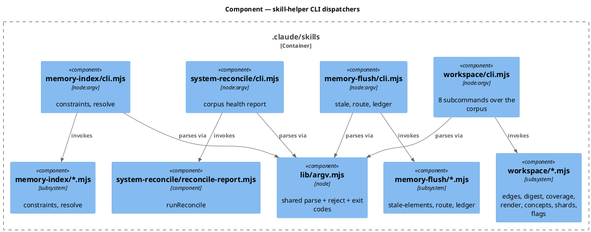
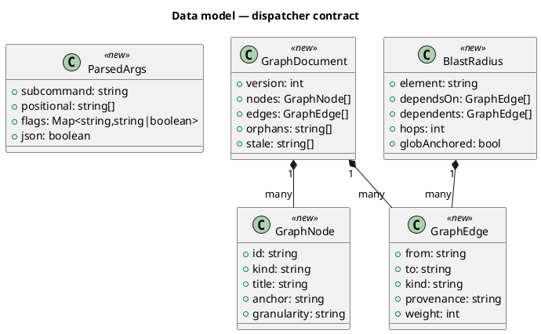
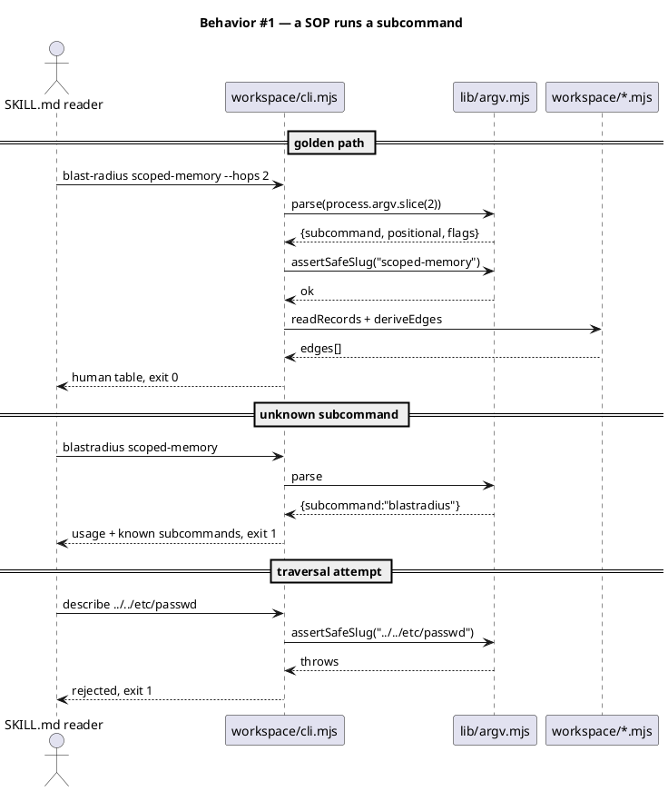
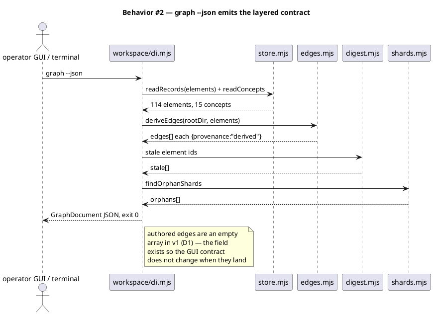
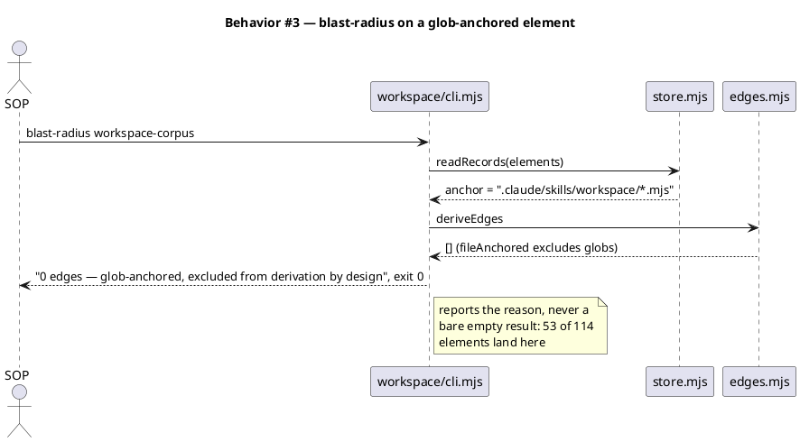
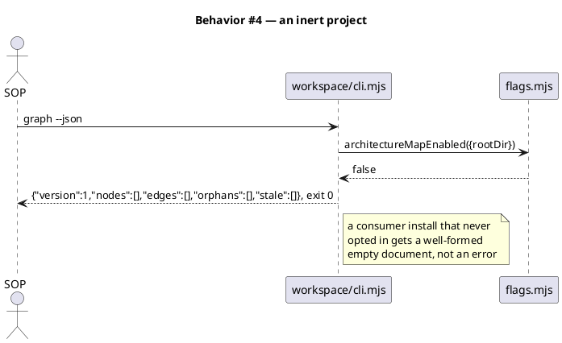
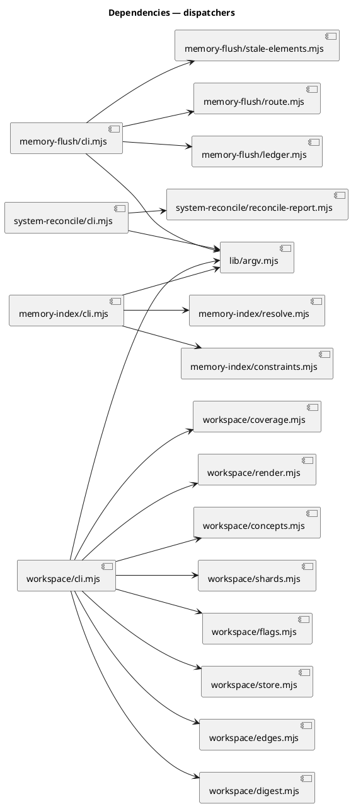

# Skill-helper CLI dispatchers

## Context

| Input | Path |
|---|---|
| Intake | *(excepted — `spec-entry` track)* |
| BRD *(if any)* | *(none)* |
| Scout *(if any)* | *(excepted — evidence gathered in the triage conversation)* |
| Research *(if any)* | *(excepted — `pattern-copy`, 39 in-repo precedents)* |

**Write set**: `.claude/skills/lib/argv.mjs`, `.claude/skills/workspace/cli.mjs`, `.claude/skills/memory-flush/cli.mjs`, `.claude/skills/system-reconcile/cli.mjs`, `.claude/skills/memory-index/cli.mjs`, `.claude/schemas/graph-document.v1.json`, `.claude/skills/*/SKILL.md`, `.claude/skills/code-browser/SKILL.md`, `docs/system/README.md`, `tests/**` — non-architectural profile (reduced diagram set).

## Goal

The corpus, flush, reconcile and memory-index helpers carry a `process.argv` front door, and every SOP call site those four dispatchers cover cites the command instead of teaching an inline `node -e` import.

## Non-goals

- **No new query logic.** Every function the dispatchers expose already exists, is tested, and is governed. This adds an Orchestration layer over an existing Domain layer; a subcommand that would need new derivation logic is out of scope.
- **No diagram improvement.** `view` is a front door to `composeView`/`generateView` exactly as they behave today. Relations, `Boundary` grouping, and level descent are deferred — a separate decision, recorded in `## Decisions`.
- **No element bodies.** Harvesting prose from archived specs is a follow-on workflow (backlog `operator-gui-over-the-corpus`).
- **No operator GUI.** This spec ships the `graph --json` contract the GUI will read; the GUI itself is separate.
- **No `scout` dispatcher.** `.claude/skills/scout/` contains no `.mjs` helper. Its 4 `node -e` blocks call `workspace/` modules, so scout changes as a consumer only.
- **No edge derivation for glob-anchored elements.** 53 of 114 elements return zero edges by design (`edges.mjs → fileAnchored`). `blast-radius` reports that explicitly rather than silently returning empty; fixing it is separate work.
- **Not every inline-import call site.** Enumerated at the implement tick: **31 sites across 14 target skill directories**. The four dispatchers specified here cover **12**. The remaining 19 need ~7 further `workspace` subcommands (`delta`, `placement`, `digest`, `reconcile`, `annotations`, `sync`, `shards`) and ~8 dispatchers that do not exist (`power`, `document`, `harness`, `commit-planner`, `org-dispatch`, `sprint-plan`, `sprint-planner`, plus `hooks/lib/common`). That is roughly triple this change and rides no part of this contract, so it is a follow-on (backlog `finish-the-dispatcher-sweep`), not silently-dropped scope. This spec's Goal originally read "every skill-helper library", which its own Contracts table never delivered; the ACs above are narrowed to what is built.

## Decisions

Captured from the human via `AskUserQuestion` during triage. Where the human chose against the recommendation, the human's pick is canonical.

| # | Decision | Owner | Rationale |
|---|---|---|---|
| D1 | The graph is **layered**: derived edges are witnessed, authored links are not, and the two are distinguishable in output. | user | Matches the corpus's own rule — "the map routes; the code witnesses". Costs no schema: `edges.mjs → edge()` already stamps `provenance: 'derived'`, so the layer is an existing field surfaced, not a new one invented. The authored layer ships empty. |
| D2 | Element bodies are **harvested from archived specs**, not generated from source. | user | Reviewed prose over generated prose. Scope is the 14 elements carrying `source_spec:` (12% of 114); the other 100 defer to the GUI-layer build. |
| D3 | `graph --json` ships **now**, in this workflow. | user | One contract serves the future GUI and the present blast-radius query. Building it later would mean guessing the shape twice. |
| D4 | One dispatcher **per skill directory**, not one global dispatcher. | engineer | `spec-shippability-review` scans baseline-owned skill dirs at top level and flags imports of modules absent from the consumer manifest. A cross-skill dispatcher would import across skill boundaries and trip that check. Per-directory also keeps each file independently manifest-hashed under Article XII. |
| D5 | The file is named `cli.mjs`, not `query.mjs`. | engineer | `memory-flush`'s hand-invoked operations include `ledger.recordCuration`, which writes. Naming the dispatcher `query` would misdescribe half its subcommands. |
| D6 | Human-readable output is the default; `--json` is opt-in per subcommand. | engineer | The primary reader today is a person reading a SOP result in a terminal. A machine consumer asks for JSON explicitly, so the default stays legible and the contract stays stable for the GUI. |
| D7 | The `graph --json` shape is pinned as a JSON Schema at `.claude/schemas/graph-document.v1.json`, and the emitter is tested against it. | user | A cross-codebase contract the operator GUI reads deserves a machine-checkable artifact, not a class diagram in a spec the GUI's authors will never open. Follows the one in-repo precedent (`workflow-track.v1.json`, draft 2020-12, `<thing>.v<N>.json`). The test DRIVES its assertions from the schema file, so the two cannot drift. |
| D8 | The schema carries a `targetKind` discriminator on every edge. | engineer | 46 of the 124 live edges target a `project.json` key rather than an element. `scanConfigKeys` targets the key deliberately — nothing anchors `project.json`, and inventing an element for it would put a file in the model no maintainer would ever open. Without the discriminator, a consumer building an adjacency list renders 46 dangling edges. |
| D9 | `view --render` accepts `--jar <path>`. | engineer | The Contracts table already pins "exit 2, jar absent" as an error condition; without a flag there is no way to exercise it that does not mutate the tree. Mirrors `generateView`'s existing `{jarPath}` option. Added here rather than left as an undocumented implementation detail. |

**On D2, one measured caveat the human accepted.** Spec-harvest starts at 12% coverage and grows forward only. 96 archived specs exist; 3 carry a `## System delta` section (required only from 2026-08-07), 0 carry a write-set table, and the same-commit join fails — tested against `architecture-map`, whose spec was archived in a later docs commit than the code it describes. Fuzzy commit-subject attribution was rejected: a wrong `source_spec` yields a confidently wrong body, and the digest witnesses the anchor rather than the attribution, so nothing would catch it.

## Design

Diagrams are the contract. Prose covers only what a diagram cannot say.

The standing structural model is referenced rather than redrawn:

```
@ref element:workspace-corpus
```

### C4 — Component

Four dispatchers, each a thin Orchestration layer over the Domain modules already present in its own skill directory. No dispatcher imports across a skill boundary (D4).



### Data model — class diagram

No persisted entity is added. The shapes below are the dispatcher's in-memory contract; `GraphDocument` is the one the future operator GUI reads.



#### Migration DDL

*(none)* — no datastore. The corpus is plain files with a derived index (constraint `zero-runtime-dependencies`).

### Behavior — sequence per AC









### State — core entity

*(none)* — every subcommand is a single-shot read (or, for `memory-flush ledger`, an append). No entity carries a lifecycle.

### Dependencies — graph



Acyclic: every edge runs Orchestration → Foundation or Orchestration → Domain. No Domain module imports a dispatcher.

### Contracts

Every subcommand is pinned here because the dispatcher count reaches the swarm threshold and because 16 SOP files cite these strings.

| Kind | Name | Input | Output | Errors | Idempotent |
|---|---|---|---|---|---|
| CLI | `workspace/cli.mjs describe <element-id>` | element id | record fields, shard kind, owning concepts, digest state | 1 unknown flag/id shape, 2 not found | yes |
| CLI | `workspace/cli.mjs blast-radius <element-id> [--hops N]` | element id, hops (default 1, max 5) | dependsOn / dependents edge lists; glob note when anchored by glob | 1 bad id, 2 not found | yes |
| CLI | `workspace/cli.mjs concept <concept-id>` | concept id | members, internal edges, crossing edges, rolled weight | 1 bad id, 2 not found | yes |
| CLI | `workspace/cli.mjs coverage` | — | uncovered governed-surface paths | 1 no governed surface declared | yes |
| CLI | `workspace/cli.mjs stale` | — | elements whose anchor digest drifted | — | yes |
| CLI | `workspace/cli.mjs constraints-for <path>` | repo-relative path | matching `governs:` constraints, plus `rests_on` when the path resolves to an element | 1 traversal reject | yes |
| CLI | `workspace/cli.mjs view <concept-id> [--render] [--jar <path>]` | concept id, optional jar path | composed PlantUML source; `--render` writes SVG to stdout | 1 bad id, 2 jar absent under `--render` | yes |
| CLI | `workspace/cli.mjs graph [--json]` | — | `GraphDocument` (v1) | — | yes |
| CLI | `workspace/cli.mjs flags` | — | the three architecture-map flag states | — | yes |
| CLI | `memory-flush/cli.mjs stale-elements` | — | stale element list | — | yes |
| CLI | `memory-flush/cli.mjs route <candidates-json>` | candidate array | `{suggested_bucket, weight, evidence}` per candidate | 1 malformed JSON | yes |
| CLI | `memory-flush/cli.mjs ledger --key <k> --disposition <d>` | key, `promoted\|discarded` | append confirmation | 1 bad disposition | no (appends) |
| CLI | `system-reconcile/cli.mjs report` | — | the seven-check health report | — | yes |
| CLI | `memory-index/cli.mjs constraint --key <k> --state <bool> --governs <globs>` | constraint fields | write confirmation | 1 bad state value | yes |
| CLI | `memory-index/cli.mjs assert-writable <entry-json>` | entry object | ok, or the refusal reason | 1 malformed JSON, 2 not writable | yes |

**Shared conventions.** Every dispatcher accepts `--spec-dir` (default `docs/system`) and `--root` (default `process.cwd()`). Exit codes are uniform: `0` success, `1` usage or validation error, `2` requested thing not found. `--json` is accepted by every read subcommand and emits the shape named in the class diagram.

### Libraries and versions

| Library@version | Purpose | Key APIs | Confirmed against current docs |
|---|---|---|---|
| `node@>=18.17.0` (builtin) | argv parsing, fs, path | `process.argv`, `node:fs`, `node:path` | yes — engines pin in `package.json`; no third-party API involved |

No third-party library is added. Constraint `zero-runtime-dependencies` holds (`state: true`), so `node:util`'s `parseArgs` is the only parsing option considered, and it is a builtin.

### Alternatives considered

| Alt | Summary | Rejected because |
|---|---|---|
| A | One global dispatcher at `.claude/skills/lib/cli.mjs` routing to every skill | Imports across skill boundaries, which `spec-shippability-review` flags as consumer-missing modules; also collapses four independently-hashed manifest entries into one (Article XII). |
| B | Add `process.argv` blocks to each of the 14 existing modules | 14 entry points instead of 4, each duplicating parse/reject/exit-code logic, and it puts Orchestration concerns inside Domain modules (Article VI.6). |
| C | Leave SOPs as-is and document the `node -e` idiom better | Does not remove the cost. The measured waste is authoring the block, not reading it — the same blast-radius query was hand-written twice in one session. |
| D | Ship `--json` on `graph` only | The GUI is one consumer; CI and the SOPs are others. Uniform `--json` on read subcommands costs one shared helper. |

## Design calls

*(none)* — the write set intersects no path in `project.json → tdd.ui_globs`.

## System delta

Every new file falls inside an element's existing glob anchor, so the model already routes to it and coverage stays total:

- `.claude/skills/workspace/cli.mjs` → `workspace-corpus` (`.claude/skills/workspace/*.mjs`)
- `.claude/skills/memory-flush/cli.mjs` → `memory-flush-helpers` (`.claude/skills/memory-flush/*.mjs`)
- `.claude/skills/system-reconcile/cli.mjs` → `system-reconcile-report` (`.claude/skills/system-reconcile/*.mjs`)
- `.claude/skills/memory-index/cli.mjs` → `memory-index-helpers` (`.claude/skills/memory-index/*.mjs`)

A glob-anchored element names a family rather than a file, so it carries no anchor digest to re-stamp and reconciliation reports it as moved rather than stale. The SOP rewrites touch `.md` files, which fall outside `governed_surface.codeExtensions`.

One row does change the model. `.claude/schemas/` is a governed-surface root whose only existing member, `workflow-track-schema`, carries a FILE anchor rather than a glob — so a second schema file is an uncovered governed path until it has its own element. Coverage is total by rule, and `*(none)*` here would have been the "I did not think about it" the section exists to prevent.

| Verb | Element | Anchor | Concept | Kind |
|---|---|---|---|---|
| add | graph-document-schema | `.claude/schemas/graph-document.v1.json` | project-config | c4_component |

## Acceptance criteria

| ID | Criterion (given / when / then) | Kind | Upstream AC | Sequence |
|---|---|---|---|---|
| AC-001 | given a valid element id, when `workspace/cli.mjs describe <id>` runs, then it prints the record fields, shard kind, owning concepts and digest state, exit 0 | behavior | triage request | §Behavior #1 |
| AC-002 | given a valid file-anchored element id, when `blast-radius <id>` runs, then it prints dependsOn and dependents derived from `deriveEdges`, exit 0 | behavior | triage request | §Behavior #1 |
| AC-003 | given a glob-anchored element id, when `blast-radius <id>` runs, then it prints zero edges AND the stated reason that glob anchors are excluded from derivation, exit 0 | behavior | triage request | §Behavior #3 |
| AC-004 | given an id containing a traversal segment, when any subcommand receives it, then it is rejected before any path is constructed, exit 1, and no file is read | error-mapping | triage request | §Behavior #1 |
| AC-005 | given an unknown subcommand, when the dispatcher runs, then it prints usage listing every known subcommand, exit 1 | error-mapping | triage request | §Behavior #1 |
| AC-006 | given the corpus, when `graph --json` runs, then it emits a `GraphDocument` whose every edge carries a `provenance` field and whose `authored` edge set is empty, exit 0 | behavior | triage request | §Behavior #2 |
| AC-007 | given `memory.architecture_map.enabled` is not true, when `graph --json` runs, then it emits a well-formed empty document, exit 0, and reads no corpus file | preflight | triage request | §Behavior #4 |
| AC-008 | given a concept id, when `view <id>` runs, then it prints the same composed PlantUML source `composeView` returns for that concept's members | behavior | triage request | §Behavior #2 |
| AC-009 | given `--render` and an absent jar, when `view <id> --render` runs, then it exits 2 naming the missing jar and issues no network call | error-mapping | triage request | §Behavior #2 |
| AC-010 | given a repo-relative path, when `constraints-for <path>` runs, then it prints every constraint whose `governs:` globs match, and names which source answered | behavior | triage request | §Behavior #1 |
| AC-011 | given each of the 4 dispatchers, when `--help` runs, then it lists its subcommands with one-line descriptions, exit 0 | behavior | triage request | §Behavior #1 |
| AC-012 | given a shipped SKILL.md call site whose target module HAS a dispatcher subcommand, when the work lands, then that site cites the command and no `node -e "import(` remains for it | behavior | triage request | §Behavior #1 |
| AC-013 | given `docs/system/README.md`, when the work lands, then it no longer presents the inline-import form as the corpus's interface and cites a dispatcher command for every query a subcommand covers | behavior | triage request | §Behavior #1 |
| AC-014 | given `code-browser`, when a navigation question arises, then `scout/SKILL.md` and at least one additional routing surface name it as the first attempt before grep | behavior | triage request | §Behavior #1 |
| AC-015 | given the template build, when `scripts/build-template.sh` runs, then all 4 new dispatchers appear in `obj/template/.claude/manifest.json` and `audit-baseline` exits 0 | smoke | triage request | §Behavior #1 |
| AC-016 | given `.claude/schemas/graph-document.v1.json`, when `graph --json` output is checked against it, then every `required` key is present, every `enum`-constrained field holds a declared value, and every `id` matches the declared `pattern` — with the assertions read FROM the schema file so emitter and contract cannot drift | behavior | triage request | §Behavior #2 |
| AC-017 | given an edge whose target is a `project.json` key rather than an element, when `graph --json` emits it, then `targetKind` is `config-key` and its `to` value is absent from `nodes[]` | behavior | triage request | §Behavior #2 |

## Test plan

| Category | Scenario | Expected | Covers |
|---|---|---|---|
| Golden path | `describe scoped-memory` | record fields, shard kind `c4_component`, concept `memory-model`, digest state | AC-001 |
| Golden path | `blast-radius scoped-memory` | 2 dependsOn (`frontmatter-parser`, `entry-body-lib`), 1 dependent (`surfacing-triggers`) | AC-002 |
| Golden path | `graph --json` | valid `GraphDocument`, 114+15 nodes, every edge carries `provenance` | AC-006 |
| Golden path | `view consent-gates` | byte-equal to `composeView(specDir, {elements, title})` for the same concept | AC-008 |
| Input boundary | `blast-radius workspace-corpus` (glob-anchored) | zero edges plus the stated exclusion reason, exit 0 | AC-003 |
| Input boundary | `blast-radius <id> --hops 0` and `--hops 99` | 0 clamps to 1; 99 rejected at the max of 5, exit 1 | AC-002 |
| Input boundary | element id at max length, unicode, empty string | rejected, exit 1 | AC-004 |
| Contract violation | `describe ../../etc/passwd`, `describe a/../../b` | rejected before path construction, exit 1, zero reads | AC-004 |
| Contract violation | `--spec-dir` pointing outside the repo | rejected, exit 1 | AC-004 |
| Contract violation | unknown subcommand, misspelled subcommand | usage listing all subcommands, exit 1 | AC-005 |
| Contract violation | `memory-flush/cli.mjs ledger --disposition bogus` | rejected, exit 1, ledger unchanged | AC-005 |
| Failure mode | `view <id> --render` with jar absent | exit 2 naming the jar, no network call | AC-009 |
| Failure mode | `architecture_map.enabled` false | empty well-formed document, exit 0, no corpus read | AC-007 |
| Failure mode | corpus directory absent entirely | empty document, exit 0 | AC-007 |
| Concurrency / ordering | two `graph --json` runs over an unchanged tree | byte-identical output | AC-006 |
| Regression trap | every existing `workspace/` export still importable as a library | unchanged | AC-001 |
| Regression trap | grep for `node -e "import(` across shipped SKILL.md | zero hits | AC-012 |
| Regression trap | `docs/system/README.md` inline-import examples | zero hits | AC-013 |
| Regression trap | `audit-baseline` after `scripts/build-template.sh` | exit 0, 4 new manifest entries | AC-015 |
| Contract violation | `graph --json` output walked against the schema's own `required` / `enum` / `pattern` declarations | every constraint holds; the schema file is the sole source of the assertions | AC-016 |
| Input boundary | a `config`-kind edge in `graph --json` | `targetKind: "config-key"`, and its `to` resolves to no node | AC-017 |
| Regression trap | every `element`-targetKind edge in `graph --json` | both endpoints resolve to a node id | AC-017 |

## Observability

| Signal | Name | Shape | Purpose |
|---|---|---|---|
| Exit code | dispatcher exit | `0` ok, `1` usage/validation, `2` not found | the SOP's and CI's only branch signal |
| Stderr | rejection reason | one line naming the rejected input and the rule | makes a REJECT diagnosable without a stack trace |
| Stdout | `--json` payload | the class-diagram shapes | machine contract for the future GUI |

No metric or alarm: these are single-shot CLI invocations in a developer tree, not a running service.

## Rollout

### Prerequisites

| # | Prerequisite | enforced-by |
|---|---|---|
| 1 | Every dispatcher is present in `obj/template/.claude/manifest.json` before a consumer SOP cites it | AC-015 |
| 2 | A project that never opted into the architecture map still gets a well-formed response from every read subcommand | AC-007 |
| 3 | No subcommand constructs a path from unvalidated input | AC-004 |

- **Feature flag**: none. The dispatchers are inert without call sites, and the corpus subcommands already respect `memory.architecture_map.enabled` through `flags.mjs`.
- **Migration order**: 1 dispatchers + tests → 2 SOP rewrites → 3 `docs/system/README.md` → 4 `scripts/build-template.sh` → 5 `audit-baseline`.
- **Canary**: none — a developer-tree CLI with no runtime surface.

## Rollback

- **Kill-switch**: `git revert` of the landing commit. The dispatchers add no state and no flag; the Domain modules they call are untouched, so a revert restores the prior SOPs with no data migration.
- **Signal to roll back**: `audit-baseline` exits non-zero, or any SOP cites a command that exits 1 on a clean tree. Both surface on the next workflow that runs the affected phase.

## Archive plan

- Defaults *(automatic)*: spec, spec approval, security report.
- Extras *(list any non-default files)*:
  - *(none)*

## Open questions

- *(none)* — D1–D6 close every fork this spec depends on. The deferred items (diagram relations, element bodies, glob-element edges, the GUI) are recorded as non-goals and carried in the backlog candidate `operator-gui-over-the-corpus`, not as blockers here.
