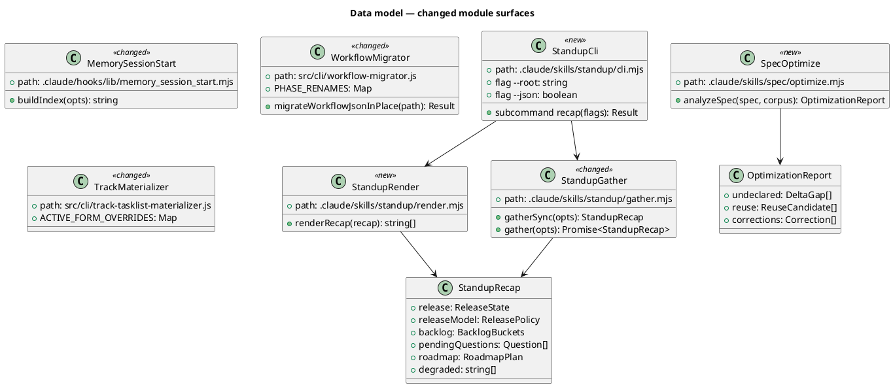
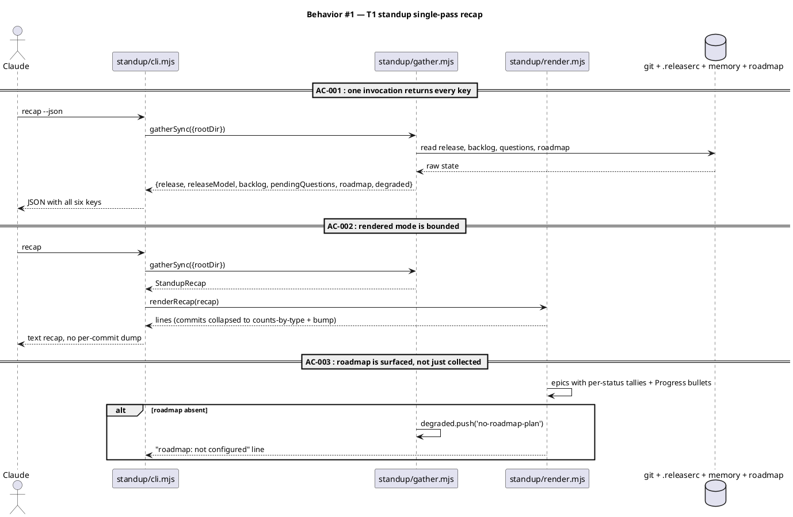
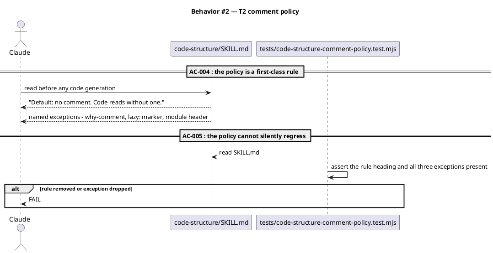
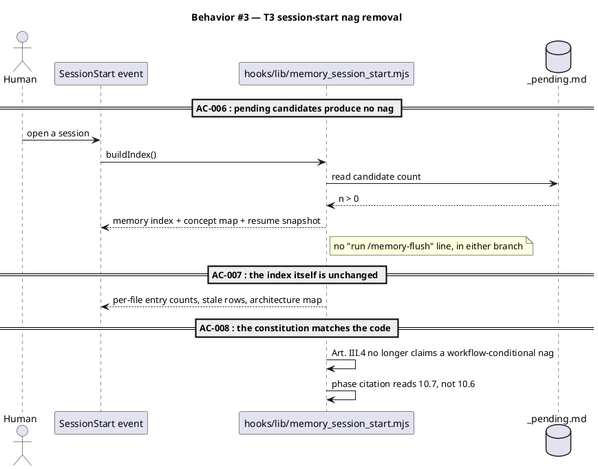
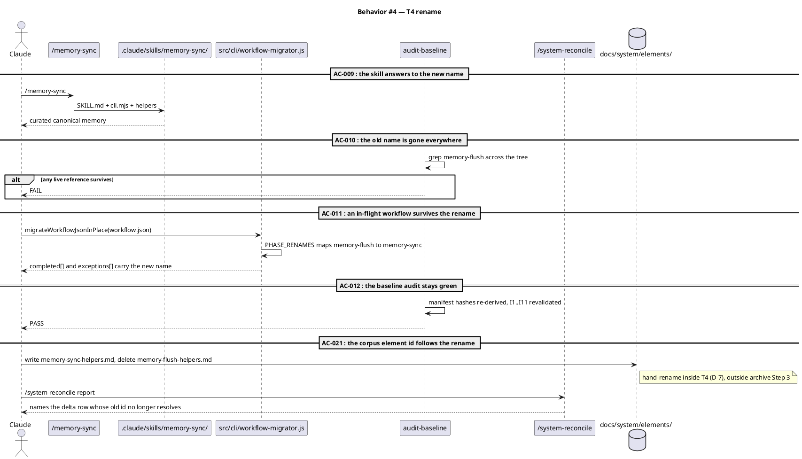
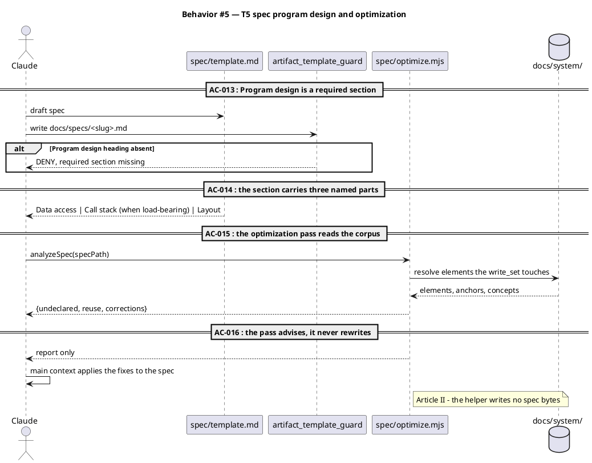
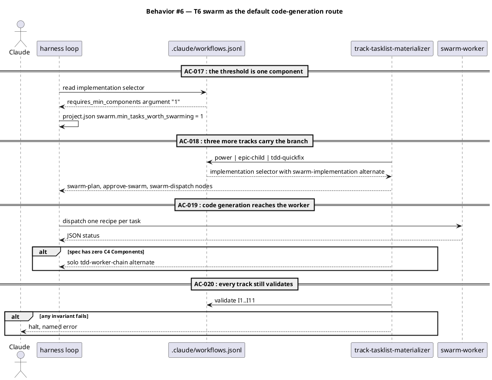
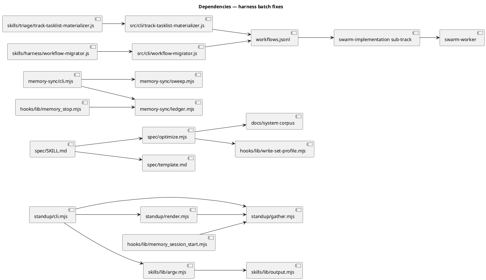

# Harness batch fixes — six tickets, one landing

## Context

| Input | Path |
|---|---|
| Intake | *(excepted — `power` track enters at spec)* |
| BRD *(if any)* | *(none)* |
| Scout *(if any)* | *(excepted)* |
| Research *(if any)* | *(excepted)* |
| Tickets | `.claude/state/workflow.json` → `tickets[]` (T1..T6) |

**Write set**: `.claude/skills/standup/**`, `.claude/skills/code-structure/SKILL.md`, `.claude/skills/memory-flush/**`, `.claude/skills/memory-sync/**`, `.claude/skills/spec/**`, `.claude/skills/harness/SKILL.md`, `.claude/skills/swarm-plan/SKILL.md`, `.claude/skills/triage/**`, `.claude/commands/**`, `.claude/hooks/lib/memory_session_start.mjs`, `.claude/workflows.jsonl`, `.claude/project.json`, `.claude/memory/**`, `CLAUDE.md`, `.claude/CONSTITUTION.md`, `docs/init/seed.md`, `src/cli/**`, `src/CLAUDE.template.md`, `src/seed.template.md`, `src/project.template.json`, `obj/template/**`, `tests/**`

This write set touches `.claude/hooks/**` and `.claude/commands/**`, both in `project.json → security.sensitive_globs`. `resolveProfile` therefore returns the **full** diagram profile regardless of the non-architectural globs; the three C4 kinds are satisfied by the resolvable element reference below (`spec_diagram_presence_guard.mjs:100`), and the behavioural kinds are drawn.

## Goal

Six harness surfaces land in one cycle: standup answers in one call, `code-structure` defaults to no comment, the session-start memory nag is gone, `memory-flush` is named `memory-sync`, `/spec` carries a program-design section and a corpus-diffing optimization pass, and swarm dispatch becomes the default code-generation route on every track that generates code.

## Non-goals

- **`memory-sync` does not gain corpus-writing behaviour.** `/archive` Step 3 stays the sole writer of `docs/system/` (`archive/SKILL.md:81`). The rename is a rename.
- **No back-compat alias for `/memory-flush`.** The old name is retired, not shadowed (see D-3 for how the in-flight workflow survives).
- **No mechanical comment linter.** T2 is a stated policy in `code-structure/SKILL.md` plus a governance test that the policy is present. Detecting a what-comment mechanically is a research problem, not this ticket.
- **`swarm.isolation` is not flipped.** It stays `shared` (D-1, decided by the engineer at gate A). T6 widens *where* swarm dispatches, not *how* workers are isolated.
- **No new subagent.** T6 widens where the existing `swarm-worker` is dispatched; it adds nothing to the one-subagent count (Art. II).

## Decisions

Routine engineering choices decided in main context and recorded for gate-A review (Art. XI.12). D-1 and D-2 are load-bearing and carry a recommendation the reviewer should accept or overturn.

| # | Decision | Owner | Choice | Rationale |
|---|---|---|---|---|
| D-1 | Does T6 also flip `swarm.isolation` from `shared` to `worktree`? | **human, at gate A** | **No — `swarm.isolation` stays `shared`** | Claude recommended flipping to `worktree`; the engineer overruled it at gate A and the engineer's call is canonical. Recorded consequence, not a re-argument: with swarm as the default route and isolation `shared`, every dispatched `swarm-worker` writes into the primary tree, so `swarm_boundary_guard`'s `write_set` enforcement is the **only** barrier against two workers touching one file — there is no filesystem backstop and no merge-audit checkpoint, which `seed.md:445` describes as isolation the swarm contract assumes. This is a deliberate, recorded acceptance; see Rollback for the detection signal. |
| D-2 | Does the swarm branch land on `tdd-quickfix`? | engineer | **Recommend yes, as the human asked** | Widening was chosen explicitly over the narrow option. The cost is honest and stated: Gate B (`/approve-swarm`) becomes a new human stop on the shortest track. The `requires_min_components` predicate still gates the branch, so a quickfix whose spec has no C4 Components falls through to the solo alternate and never reaches Gate B. |
| D-3 | How does the in-flight workflow survive its own rename? | engineer | Extend the existing phase remap in `src/cli/workflow-migrator.js` with `memory-flush → memory-sync`, and let this workflow's own Phase 10.7 run as `/memory-sync` | The migrator already remaps `completed[]` phase names for the pre-§18 shape and is idempotent. Reusing it costs one map entry. The alternative — a transitional alias skill — leaves two names live and contradicts the rename's point. |
| D-4 | Is `Program design` a required `##` section or a `###` under `## Design`? | engineer | Required `##` section, added to `project.json → artifacts.required_sections.spec` | The human asked for spec to "also add program design". A `###` subsection is advisory and gets skipped; `artifact_template_guard` reads `required_sections.spec` and denies a spec that omits a required heading. Only new spec writes are affected — archived specs are never re-written. |
| D-5 | Where does the optimization pass live? | engineer | `.claude/skills/spec/optimize.mjs`, advisory report only | Article II: the helper gathers and reports; main context reads the report and edits the spec. A helper that rewrites the spec would move a written decision into a script. |
| D-6 | Does T2 change `code-structure/oracle.mjs`? | engineer | No — `SKILL.md` only | The request is "must list that we add comment ONLY when necessary". That is policy text. `oracle.mjs` runs the code-review phase and has no comment dimension; adding one is out of scope (VI.4). |
| D-7 | How does the corpus element id follow T4's rename, given the delta vocabulary has no `move` verb? | **human, at gate A** | **Hand-rename the element file inside T4's diff** | Claude recommended accepting the id residue and filing a follow-up; the engineer chose the direct rename. T4 therefore writes `docs/system/elements/memory-sync-helpers.md` and deletes `memory-flush-helpers.md` as part of its own diff, while the `## System delta` row declares the anchor move as a single `change` row (the delta vocabulary has no `move` verb, so a rename is an anchor change on one element). Recorded consequence: this is a `docs/system/` write outside `/archive` Step 3, which `archive/SKILL.md:81` names the corpus's sole writer. AC-021 makes the resulting `/system-reconcile` report an explicit, checked outcome rather than a surprise. |

## Design

Diagrams are the contract. Prose only for what a diagram cannot say.

### Structural kinds — referenced, not redrawn

The standing shape of every surface this spec touches is already modelled in the corpus. One resolvable reference satisfies C4 Context, Container, and Component:

```
@ref element:harness-helpers
```

### Data model — class diagram

The module surfaces this spec creates or changes. `<<new>>` marks a file that does not exist yet; `<<changed>>` marks an existing file whose exported surface moves.



There is no database in this change, so there is no migration DDL. The `<<changed>>` rows above are file-surface changes, not schema changes.

#### Migration DDL

```sql
-- No relational schema is touched by this spec.
-- forward: none
-- reverse: none
```

### Behavior — sequence per ticket

Each sequence carries its ticket's ACs as `==` dividers. The AC table below points at these anchors.

#### §Behavior #1 — T1, standup answers in one call



#### §Behavior #2 — T2, no-comment default



#### §Behavior #3 — T3, the nag is deleted



#### §Behavior #4 — T4, memory-flush becomes memory-sync



#### §Behavior #5 — T5, program design and the optimization pass



#### §Behavior #6 — T6, swarm by default



### State — core entity *(only if stateful)*

No new state machine. The workflow-track state machine is unchanged in shape by this spec: T6 adds a selector node to three existing tracks, and the selector node type, its alternates, and its predicate vocabulary all already exist.

### Dependencies — graph



The two mirror edges are build-time, not runtime: `scripts/build-template.sh` Stage 0b copies `src/cli/*.js` to its `.claude/skills/` mirror byte-for-byte, guarded by `tests/vendored-mirror-bytes.test.mjs`. Editing a mirror directly is reverted by the next build.

### Program design

#### Data access

| Reader | Source | Access path | Written by |
|---|---|---|---|
| `standup/gather.mjs` | git tags, `.releaserc.json`, `CHANGELOG.md`, memory files, `docs/roadmap-execution-plan.md` | `execFileSync` + `readFileSync`, fail-soft to `degraded[]` | nothing — read-only |
| `standup/cli.mjs` | `gather.mjs` return value | in-process call | stdout only |
| `hooks/lib/memory_session_start.mjs` | `_pending.md`, memory index, `workflow.json`, `gather.mjs` | `readFileSync` + `existsSync` | nothing — emits context |
| `spec/optimize.mjs` | drafted spec bytes, `docs/system/elements/*.md`, `docs/system/concepts/*.md`, `project.json → memory.architecture_map.governed_surface` | `readFileSync` + glob | nothing — returns a report |
| `memory-sync/*` | `_pending.md`, canonical memory shards, `_discard-ledger.md` | unchanged from `memory-flush` | canonical shards, `_pending.md` reset |
| `src/cli/workflow-migrator.js` | `.claude/state/workflow.json` | read-modify-write in place | `workflow.json` |
| materializer | `.claude/workflows.jsonl` | `readFileSync` + JSONL parse | nothing — emits TaskList JSON |

`docs/system/` has exactly one writer in a workflow and this spec does not change it: `/archive` Step 3. `spec/optimize.mjs` reads the corpus and never writes it.

#### Call stack

Load-bearing for two paths only.

**Standup, one pass:**

```
/standup (SKILL.md)
  └─ node .claude/skills/standup/cli.mjs recap [--json] [--root <dir>]
       └─ dispatch()                        skills/lib/argv.mjs
            └─ recap.run({flags, root})     standup/cli.mjs
                 ├─ gatherSync({rootDir})   standup/gather.mjs
                 │    ├─ collectRelease / collectReleaseModel
                 │    ├─ collectBacklog / collectPendingQuestions
                 │    └─ collectRoadmap
                 └─ renderRecap(recap)      standup/render.mjs   [text mode only]
                      └─ emit()             skills/lib/output.mjs
```

**Spec optimization pass:**

```
/spec Step 6.5
  └─ node .claude/skills/spec/optimize.mjs report --slug <slug>
       └─ analyzeSpec(specBytes, corpusDir, governedSurface)
            ├─ extractWriteSet(spec)          hooks/lib/write-set-profile.mjs  [reused]
            ├─ parseSystemDelta(spec)
            ├─ resolveElements(corpusDir)     anchors globbed against write_set
            └─ diff → {undeclared, reuse, corrections}
  └─ main context reads the report and edits docs/specs/<slug>.md
```

The remaining tickets are single-frame edits with no call stack worth drawing.

#### Layout

```
.claude/skills/standup/
  SKILL.md          changed — documents all six keys, points at cli.mjs
  cli.mjs           new     — front door, dispatch() over one `recap` subcommand
  render.mjs        new     — pure renderer, StandupRecap → lines
  gather.mjs        unchanged surface — still the collector

.claude/skills/code-structure/
  SKILL.md          changed — no-comment default promoted to a top-level rule

.claude/skills/memory-sync/          renamed from memory-flush/
  SKILL.md  cli.mjs  ledger.mjs  route.mjs  shape.mjs
  sweep.mjs  stale-elements.mjs  next-q-id.mjs  tests/

.claude/skills/spec/
  SKILL.md          changed — Step 6.5 invokes the optimization pass
  template.md       changed — `## Program design` section added
  optimize.mjs      new     — corpus diff, advisory report

.claude/hooks/lib/
  memory_session_start.mjs   changed — pendingCount nag block deleted

.claude/commands/
  memory-sync.md    renamed from memory-flush.md

src/cli/
  workflow-migrator.js             changed — PHASE_RENAMES gains memory-flush→memory-sync
  track-tasklist-materializer.js   changed — ACTIVE_FORM_OVERRIDES key renamed

.claude/workflows.jsonl            changed — node rename on 8 tracks; swarm selector on 3
.claude/project.json               changed — min_tasks_worth_swarming, required_sections.spec
```

### Contracts

| Kind | Name | Input | Output | Errors | Idempotent |
|---|---|---|---|---|---|
| CLI | `standup/cli.mjs recap` | `--root <dir>`, `--json` | text recap, or `StandupRecap` JSON under `--json` | exit 1 usage; never throws on missing sources — they land in `degraded[]` | yes (read-only) |
| Function | `renderRecap(recap)` | `StandupRecap` | `string[]` — one line per row, commits collapsed to counts-by-type | throws `TypeError` on a non-object | yes (pure) |
| Function | `gatherSync({rootDir, now})` | `{rootDir: string}` | `StandupRecap` with all six keys | never throws; degrades | yes |
| CLI | `spec/optimize.mjs report` | `--slug <slug>`, `--root <dir>`, `--json` | `OptimizationReport` | exit 1 on a missing spec; exit 1 on a slug failing `/^[a-z0-9][a-z0-9-]*$/` | yes (read-only) |
| Function | `analyzeSpec(spec, corpus, governedSurface)` | spec bytes, corpus dir, glob roster | `{undeclared[], reuse[], corrections[]}` | throws on an unreadable corpus dir | yes (pure over its inputs) |
| CLI | `memory-sync/cli.mjs` | unchanged from `memory-flush/cli.mjs` | unchanged | unchanged | unchanged |
| Data | `PHASE_RENAMES` | `workflow.json → completed[]`, `exceptions[]` | same arrays with `memory-flush` mapped to `memory-sync` | none — an unmapped phase passes through | yes |
| Node | `workflows.jsonl` `implementation` selector | track record | `swarm-implementation` sub-track, or `tdd-worker-chain` | I1..I11 validation failure halts triage | yes |

### Libraries and versions

| Library@version | Purpose | Key APIs | Confirmed against current docs |
|---|---|---|---|
| `node:util` (Node 22 LTS, stdlib) | argv parsing in `cli.mjs` | `parseArgs({args, options, strict, allowPositionals})` | yes — already in use at `.claude/skills/lib/argv.mjs:44`, in-repo witness |
| `node:fs` (Node 22 LTS, stdlib) | corpus + spec reads | `readFileSync`, `existsSync` | yes — in-repo witness |
| `node:child_process` (Node 22 LTS, stdlib) | git state in `gather.mjs` | `execFileSync` | yes — in-repo witness, unchanged by this spec |

No third-party library is added. Every API above is Node stdlib already exercised in this repository, so the current-docs rule (VI.5) is satisfied by an in-repo witness rather than a `context7` lookup.

### Alternatives considered

| Alt | Summary | Rejected because |
|---|---|---|
| A | Keep `/memory-flush` as a thin alias pointing at `memory-sync` | Two live names is exactly the drift the rename removes, and VI.2 forbids leaving retired code behind. D-3's migrator entry solves the in-flight problem without a second name. |
| B | Put the standup renderer inside `gather.mjs` | `gather.mjs` is the collector with a documented clock-free deterministic core. Rendering is a different abstraction level; folding it in breaks the layer model (VI.6). |
| C | Make `spec/optimize.mjs` rewrite the spec directly | Article II — a script that edits the spec moves a written decision out of main context. The report-then-edit split keeps judgment where it belongs. |
| D | Lower `min_tasks_worth_swarming` only, leave `workflows.jsonl` alone | The selector's `requires_min_components` argument is the literal `"3"` in the track file; the config knob does not reach it. Config-only would be a no-op for the selector path. |
| E | Add a mechanical what-comment detector for T2 | No reliable oracle distinguishes a what-comment from a why-comment. A high-false-positive gate on every code write is worse than the stated policy. |

## Design calls

This write set does not intersect `project.json → tdd.ui_globs` — no `site-src/**`, no component or template files, no `.css`/`.njk`/`.html`.

- *(none)*

## System delta

| Verb | Element | Anchor | Concept | Kind |
|---|---|---|---|---|
| change | standup-helper | `.claude/skills/standup/*.mjs` | planning-release | c4_component |
| change | memory-hook-libs | `.claude/hooks/lib/memory_*.mjs` | memory-model | c4_component |
| change | memory-sync-helpers | `.claude/skills/memory-sync/*.mjs` | memory-model | c4_component |
| change | spec-helpers | `.claude/skills/spec/*.mjs` | review-fanout | c4_component |
| change | track-tasklist-materializer | `.claude/skills/triage/track-tasklist-materializer.js` | workflow-tracks | c4_component |

`code-structure/SKILL.md`, `CLAUDE.md`, `seed.md`, and `.claude/workflows.jsonl` produce no rows: prose files and `.jsonl` fall outside `memory.architecture_map.governed_surface`, whose `codeExtensions` are `.mjs`, `.js`, `.json`, `.yml`.

**Why T4's rename is one `change` row and not `remove` + `add`.** The `add` verb means "a governed file already on disk that the model does not yet anchor" — `spec-lint`'s `anchorDefects` matches an `add` anchor against files that exist (`lint.mjs:258`). It does not mean "a file this spec will create". A rename therefore cannot be expressed as `remove` + `add` at spec time, because the destination does not exist when the row is checked. The row above is the only form the linter accepts.

**The element id is renamed by hand inside T4's diff** (D-7). T4 writes `docs/system/elements/memory-sync-helpers.md` carrying the same `kind`, `title`, and the new anchor, and deletes `memory-flush-helpers.md`. Two consequences are recorded rather than hidden:

1. This is a `docs/system/` write that does not come from `/archive` Step 3, which `archive/SKILL.md:81` names the corpus's sole writer on the primary tree. The invariant is knowingly relaxed for this one rename.
2. The `## System delta` row names the **new** id. At first drafting only the old id resolved, so the row had to name it and a residue was expected; the hand-rename creates `memory-sync-helpers` as part of T4's own diff, so by the time the row is re-checked the new id resolves and the residue is gone. **`/system-reconcile` was never going to report that residue** — it walks corpus-internal anchors (element → shard → concept) and never opens a spec's System delta table. Delta rows are checked by `spec-lint` before the landing and by `/archive` Step 3's delta verification at the landing. AC-021 asserts what `/system-reconcile` *does* answer: the hand-rename left the corpus structurally clean.

## Acceptance criteria

| ID | Criterion (given / when / then) | Kind | Upstream AC | Sequence |
|---|---|---|---|---|
| AC-001 | given a configured repo, when `node .claude/skills/standup/cli.mjs recap --json` runs once, then stdout parses to an object carrying all six keys `release`, `releaseModel`, `backlog`, `pendingQuestions`, `roadmap`, `degraded` | behavior | T1 | §Behavior #1 |
| AC-002 | given 49 unreleased commits, when `recap` runs without `--json`, then the output collapses them to counts-by-type plus the aggregate bump and emits no per-commit line | behavior | T1 | §Behavior #1 |
| AC-003 | given `docs/roadmap-execution-plan.md` with 3 epics, when `recap` runs, then each epic appears with its status and per-task tallies; given the file is absent, then `degraded` contains `no-roadmap-plan` and the output says the roadmap is not configured | behavior | T1 | §Behavior #1 |
| AC-004 | given `code-structure/SKILL.md`, when a reader opens it, then a top-level rule states that the default is no comment and that code must read without one | behavior | T2 | §Behavior #2 |
| AC-005 | given the comment-policy test, when `SKILL.md` loses the rule heading or any of the three named exceptions, then the test fails | behavior | T2 | §Behavior #2 |
| AC-006 | given `_pending.md` holds n>0 candidates, when the SessionStart hook builds the index, then the output contains no `/memory-flush` or `/memory-sync` prompt in either the active-workflow or no-workflow branch | behavior | T3 | §Behavior #3 |
| AC-007 | given the same session start, when the index is built, then the per-file entry counts, stale rows, architecture-map section and resume snapshot are byte-identical to the pre-change output minus the nag lines | behavior | T3 | §Behavior #3 |
| AC-008 | given `CLAUDE.md` Art. III.4, when it is read, then it no longer claims a workflow-conditional debt nag, and every phase citation for memory flushing reads 10.7 | behavior | T3 | §Behavior #3 |
| AC-009 | given the rename has landed, when the user runs `/memory-sync`, then the skill at `.claude/skills/memory-sync/` executes and curates canonical memory exactly as `memory-flush` did | behavior | T4 | §Behavior #4 |
| AC-010 | given the landed tree, when the repository is searched for `memory-flush` or `memory_flush`, then zero live references remain outside `docs/archive/**`, `CHANGELOG.md`, and git history | behavior | T4 | §Behavior #4 |
| AC-011 | given a `workflow.json` whose `completed[]` or `exceptions[]` carries `memory-flush`, when `migrateWorkflowJsonInPlace` runs, then those entries read `memory-sync` and re-running the migrator changes nothing | preflight | T4 | §Behavior #4 |
| AC-012 | given the rename and the T6 track edits have landed, when `audit-baseline` and `seed-tasklist.mjs --validate-only` run, then both exit 0 | preflight | T4, T6 | §Behavior #4 |
| AC-013 | given a spec draft with no `## Program design` heading, when it is written to `docs/specs/`, then `artifact_template_guard` denies the write naming the missing section | behavior | T5 | §Behavior #5 |
| AC-014 | given `spec/template.md`, when an author opens it, then `## Program design` carries three named parts — Data access, Call stack (marked as required only when load-bearing), and Layout | behavior | T5 | §Behavior #5 |
| AC-015 | given a drafted spec and a seeded corpus, when `optimize.mjs report --slug <slug>` runs, then it returns `undeclared` for every corpus element the write_set touches without a System delta row, `reuse` for every existing element whose anchor overlaps the write_set, and `corrections` for every delta row whose element does not resolve | behavior | T5 | §Behavior #5 |
| AC-016 | given the same invocation, when it completes, then `docs/specs/<slug>.md` is byte-identical to its pre-invocation content | behavior | T5 | §Behavior #5 |
| AC-017 | given `project.json` and `.claude/workflows.jsonl` after T6, when both are read, then `swarm.min_tasks_worth_swarming` is `1` and every `requires_min_components` predicate argument is `"1"` | behavior | T6 | §Behavior #6 |
| AC-018 | given the `power`, `epic-child`, and `tdd-quickfix` tracks, when each is parsed, then each carries an `implementation` selector whose alternates are `swarm-implementation` and `tdd-worker-chain`, both `sub_track` shaped | behavior | T6 | §Behavior #6 |
| AC-019 | given an approved spec with at least one C4 Component on any of those three tracks, when the materializer resolves the selector, then it emits `swarm-plan`, `approve-swarm`, and `swarm-dispatch` nodes; given a spec with zero C4 Components, then it emits the solo `tdd-worker-chain` nodes instead | behavior | T6 | §Behavior #6 |
| AC-020 | given all 11 tracks after the T6 edits, when `seed-tasklist.mjs --validate-only` runs, then every track satisfies I1..I11 and the helper exits 0 | preflight | T6 | §Behavior #6 |
| AC-021 | given T4 has landed, when `docs/system/elements/` is listed, then `memory-sync-helpers.md` exists carrying the same `kind` and `title` with anchor `.claude/skills/memory-sync/*.mjs`, `memory-flush-helpers.md` is absent, and `/system-reconcile report` returns an empty `dangling`, `duplicateAnchors`, `orphanShards` and `missingKind` — the hand-rename introduces no structural corpus defect. `stale` is deliberately unconstrained: an anchor-digest goes stale whenever the interface behind it moves, which is what any code-touching workflow does, and `/archive` Step 3 re-stamps it | behavior | T4 | §Behavior #4 |

## Test plan

| Category | Scenario | Expected | Covers |
|---|---|---|---|
| Golden path | `cli.mjs recap --json` on this repo | object with all six keys, none undefined | AC-001 |
| Golden path | `renderRecap` over a fixture with 49 commits | counts-by-type + bump line; zero per-commit lines | AC-002 |
| Golden path | `renderRecap` over a fixture roadmap with 3 epics | 3 epic rows with status + tallies | AC-003 |
| Golden path | `/memory-sync` end to end on a seeded `_pending.md` | candidates promoted, `_pending.md` reset | AC-009 |
| Golden path | `optimize.mjs report` on a spec with a complete System delta | `undeclared` empty, `reuse` names the touched elements | AC-015 |
| Input boundary | `recap` on a repo with no tags, no roadmap, empty memory | every missing source named in `degraded[]`, exit 0 | AC-001, AC-003 |
| Input boundary | `renderRecap` with zero unreleased commits | "no unreleased commits" line, no bump row | AC-002 |
| Input boundary | `optimize.mjs --slug ../etc/passwd` | exit 1, slug rejected before any path is built | AC-015 |
| Input boundary | `migrateWorkflowJsonInPlace` on a `completed[]` already reading `memory-sync` | unchanged, exit 0 | AC-011 |
| Contract violation | spec write with `## Program design` absent | `artifact_template_guard` denies, names the section | AC-013 |
| Contract violation | `renderRecap(null)` | `TypeError`, not a silent empty render | AC-002 |
| Contract violation | a `workflows.jsonl` selector whose alternates mix `skill` and `sub_track` | I10 fails, validator exits non-zero with a named error | AC-018, AC-020 |
| Concurrency / ordering | swarm branch on `tdd-quickfix` with 2 tasks in one wave | wave write_sets pairwise disjoint before dispatch | AC-019 |
| Failure mode | `optimize.mjs` with `docs/system/` absent | named error, exit 1; `/spec` continues without the pass | AC-015 |
| Failure mode | SessionStart with `_pending.md` unreadable | index still emits, no nag, no throw | AC-006, AC-007 |
| Regression trap | full suite after the rename | green; no test references the old skill path | AC-010 |
| Regression trap | `audit-baseline` after the rename | PASS — manifest hashes re-derived, both citations intact | AC-012 |
| Regression trap | `code-structure/SKILL.md` comment policy present | rule + three exceptions found | AC-005 |
| Regression trap | `gatherSync` output shape before/after T1 | six keys unchanged; `cli.mjs` adds a caller, not a field | AC-001 |
| Regression trap | Art. III.4 text vs hook behaviour | no nag claimed, no nag emitted, phase reads 10.7 | AC-008 |
| Regression trap | `vendored-mirror-bytes.test.mjs` after T4 and T6 | mirrors byte-equal to `src/cli/` sources | AC-012 |
| Regression trap | `/system-reconcile report` after the hand-rename | empty `dangling`, `duplicateAnchors`, `orphanShards`, `missingKind`; `stale` unconstrained | AC-021 |
| Failure mode | swarm dispatch on `shared` isolation, two tasks in one wave with overlapping `write_set` | `swarm_boundary_guard` denies the second write; no silent overwrite | AC-019 |

## Observability

| Signal | Name | Shape | Purpose |
|---|---|---|---|
| Log | `harness/<slug>.log` | `<ts> entered <phase>` / `completed <phase>` | phase trail, unchanged |
| Log | `degraded[]` in `StandupRecap` | string markers, e.g. `no-roadmap-plan`, `no-release-model` | names which source was missing rather than rendering a silent blank |
| Log | `optimize.mjs` report body | `{undeclared[], reuse[], corrections[]}` | the spec author sees what the corpus already holds |
| Metric | `audit-baseline` exit code | 0 PASS / 1 FAIL | the rename's drift gate in CI |
| Alarm | `seed-tasklist.mjs --validate-only` non-zero | I1..I11 violation, named track + node | a malformed track halts triage rather than materializing a broken DAG |

## Rollout

### Prerequisites

| # | Prerequisite | enforced-by |
|---|---|---|
| 1 | `audit-baseline` exits 0 after the rename — manifest hashes re-derived and both Article XII citations intact | AC-012 |
| 2 | All 11 tracks in `.claude/workflows.jsonl` satisfy I1..I11 after the swarm-branch edits | AC-020 |
| 3 | An in-flight `workflow.json` carrying the `memory-flush` phase name migrates to `memory-sync` before Phase 10.7 runs | AC-011 |

- **Feature flag**: none. T1, T2, T3, T4, and T5 are unconditional. T6 rides the existing `requires_min_components` predicate, which already gates the swarm branch on component count — a spec with zero Components never reaches it.
- **Migration order**: 1 T2 and T3 (isolated edits) → 2 T1 and T5 (new helpers, no rename dependency) → 3 T6 (track edits, validated) → 4 T4 (rename last, so every prior ticket's tests are already green under the old name and the rename sweep is the only variable in the final diff).
- **Canary**: none — this is a single-repo governance change with no deploy surface. The suite plus `audit-baseline` plus track validation is the gate.

## Rollback

- **Kill-switch**: `git revert` of the batch's commits, in reverse order. T6 alone can be rolled back by restoring `requires_min_components` to `"3"` and `swarm.min_tasks_worth_swarming` to `3` without touching the other five tickets — the selector falls back to the solo alternate on the next materialization.
- **Signal to roll back**: `audit-baseline` exits non-zero, or `seed-tasklist.mjs --validate-only` exits non-zero, or the suite goes red. All three are checked at Phase 9 (`/integrate`) before any commit, so a bad landing is caught pre-commit rather than within 5 minutes of it.
- **Signal specific to D-1's accepted risk**: a `swarm_boundary_guard` denial during any post-landing `swarm-dispatch` wave, or a wave whose merge produces a file neither task declared in its `write_set`. Either means two workers collided in the shared tree. The remedy is a one-line config change — set `swarm.isolation: "worktree"` — not a revert of T6.

## Archive plan

- Defaults *(automatic)*: spec, spec-rendered/, spec approval, security reports (six, one per ticket), swarm plan + approval if the T6 branch is exercised on this workflow.
- Extras *(list any non-default files)*:
  - *(none)*

## Open questions

Nothing here blocks approval. Every question raised during drafting is settled; the four entries below are the settled outcomes, kept visible so the reviewer sees at gate A what was accepted and on whose authority.

- **D-1 is settled: `swarm.isolation` stays `shared`.** The engineer overruled the recommendation to flip it to `worktree`. Accepted consequence: swarm becomes the default code-generation route on four tracks while every worker writes into the primary tree, leaving `swarm_boundary_guard` as the sole collision barrier. Detection signal and the one-line remedy are in Rollback.
- **D-2 is settled: the swarm branch lands on `tdd-quickfix`.** Gate B (`/approve-swarm`) becomes a new human stop on the shortest track. Recorded so it is visible now rather than discovered in the next quickfix.
- **D-7 is settled: the corpus element id is hand-renamed inside T4.** This writes `docs/system/` outside `/archive` Step 3, the declared sole writer. AC-021 checks the resulting `/system-reconcile` report so the relaxation is measured, not assumed.
- **AC-021 was amended after implementation.** As first approved it required the reconcile report to name *exactly one* dangling reference. That was wrong about the tool: `/system-reconcile` never reads a spec's System delta table, so it reports zero. The AC now asserts the true and stronger claim — no structural corpus defect of any kind. Re-approved at gate A on the corrected text.
- **T4's scope includes 40 historical memory entries.** Those entries record sessions that actually ran `/memory-flush`; renaming them edits the record of what was run. The engineer chose the full 155-file sweep with these included.
