# Read front doors — one JSON contract per mechanical read

## Context

| Input | Path |
|---|---|
| Intake | *(excepted — `power` track enters at spec)* |
| BRD *(if any)* | *(none)* |
| Scout *(if any)* | *(excepted — the in-session inventory below is the scouting record)* |
| Research *(if any)* | *(excepted)* |

**Write set**: `.claude/skills/roadmap/**`, `.claude/skills/standup/*.mjs`, `.claude/skills/lib/argv.mjs`, `.claude/skills/memory-sync/cli.mjs`, `.claude/skills/memory-index/cli.mjs`, `.claude/skills/document/cli.mjs`, `.claude/skills/harness/cli.mjs`, `.claude/skills/harness/checker-fanout.mjs`, `.claude/skills/harness/checkers/*.mjs`, `.claude/skills/audit-baseline/cli.mjs`, `.claude/skills/audit-baseline/audit.mjs`, `.claude/skills/spec/cli.mjs`, `.claude/skills/spec-lint/lint.mjs`, `.claude/skills/workspace/coverage.mjs`, `.claude/skills/memory-sync/sweep.mjs`, `.claude/skills/document/document-gate.mjs`, `.claude/skills/harness/rightsize-gate.mjs`, `tests/**` — non-architectural profile.

**Why five helpers are in the write set.** A `cli.mjs` verb has to call something, and a verb can only delegate to an entry point that *returns data*. Five fold targets fail that test today:

| Helper | What it exposes | Why a verb cannot use it |
|---|---|---|
| `sweep.mjs` | private `main(argv)` | returns an exit code, not a report |
| `document-gate.mjs` | private `main()` | returns an exit code, not a verdict |
| `audit.mjs` | no exports; script-shaped | nothing importable at all |
| `coverage.mjs` | `underGovernedRoot`/`isCode`/`isExcluded` module-private | no surface predicate to call |
| `rightsize-gate.mjs` | `export async function main(argv, deps)` | **exports a `main`, but it writes its JSON to `process.stdout` itself and returns an exit code.** Its `deps` hooks are `{exec, project, rootDir, workflow}` — no output injection — and `collectMeasure` is unexported, so composing from the exported primitives means re-implementing it. |

`rightsize-gate.mjs` is the instructive one: exporting something *named* `main` is not the same as exposing a callable entry, and this spec asserted the opposite for one revision before implementation caught it.

The alternative — re-implementing each helper's logic inside its `cli.mjs` — is the duplication `code-structure`'s reuse-before-create rule exists to prevent, and AC-014 forbids it explicitly.

One fold target needs no change: `memory-index/scope-narrow.mjs` is composable from its exported `proposeNarrowing` / `applyNarrowing`.

### Batch tickets

| Ticket | Scope |
|---|---|
| T1 | `roadmap/cli.mjs` (`tasks`/`epics`/`next`); extract the roadmap parser out of `standup/gather.mjs` |
| T2 | Fold four orphan helpers into their existing CLIs as verbs |
| T3 | `audit-baseline/cli.mjs report` |
| T4 | `spec/cli.mjs review` + the two missing checker adapters |
| T5 | `harness/cli.mjs state` |
| T6 | `memory-index/cli.mjs query` |
| T7 | `spec-lint` resolves an `add` anchor against the declared governed surface, not a disk walk |

## Goal

Every mechanical read this repo performs is reachable as `node .claude/skills/<skill>/cli.mjs <verb> --json`, so a caller — main context or the future operator GUI — gets a parsed record instead of re-deriving one from Markdown.

## Non-goals

- The operator GUI itself. Backlog `operator-gui-over-the-corpus` owns that; this spec only widens the contract surface it will read.
- Moving the ~25 remaining direct-helper invocations that are **write**-shaped or single-caller. This batch covers read-shaped, repeatedly-fetched surfaces only.
- Deleting any direct-helper entry point. Every helper keeps its `import.meta.url` main-guard; a verb is an addition, never a move.
- A shared JSON schema per verb. Only `graph-document.v1.json` is pinned today; pinning nine more is a separate decision.

## Design

Diagrams are the contract. Prose is only for things a diagram cannot say.

The standing structural model already holds the dispatcher layer: `@ref element:skill-probe-lib`. That reference says what exists. The component diagram below is drawn rather than referenced because this spec **changes** that shape — it adds a parser module and a ninth dispatcher, and a bare reference would assert "unchanged", which is false.

### C4 — Component (changed containers only)

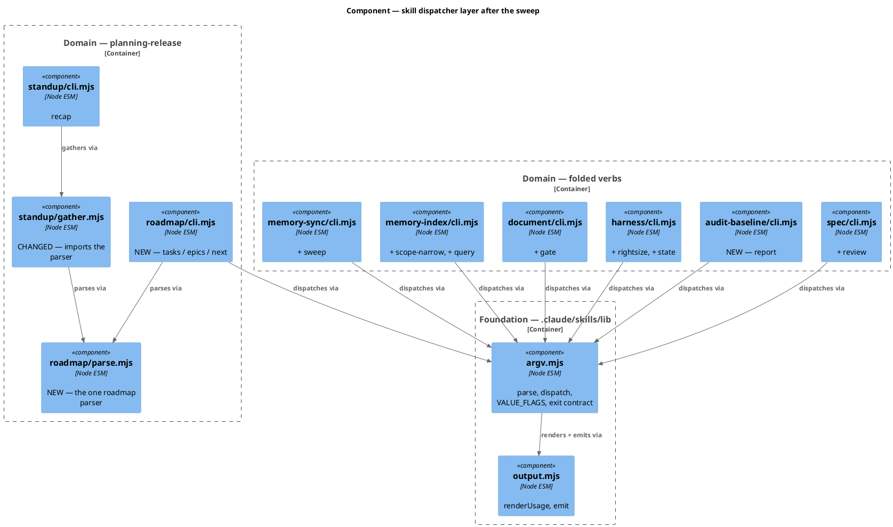

### Data model — class diagram

The records the roadmap parser emits. `RoadmapPlan` is what `parseRoadmap()` returns; `standup` projects it down to today's tally shape, and `roadmap/cli.mjs` exposes it whole.

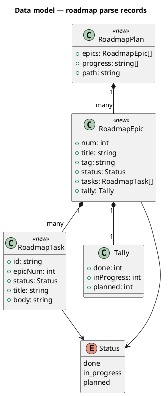

#### Migration DDL

*(no datastore — the roadmap is a Markdown file and the records are in-memory. No DDL.)*

### Behavior — sequence per AC

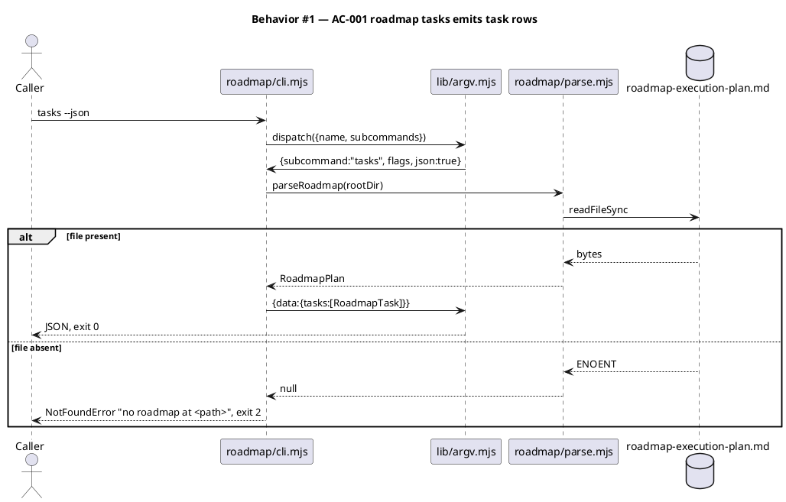

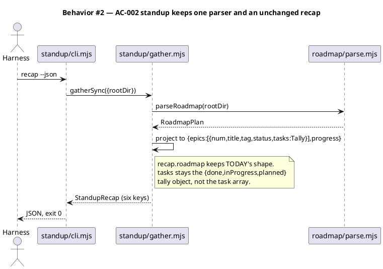

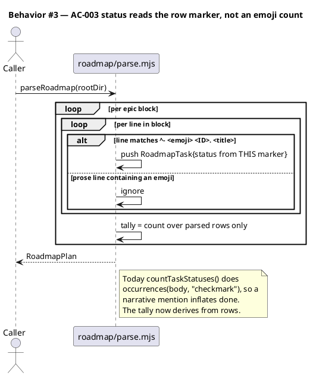

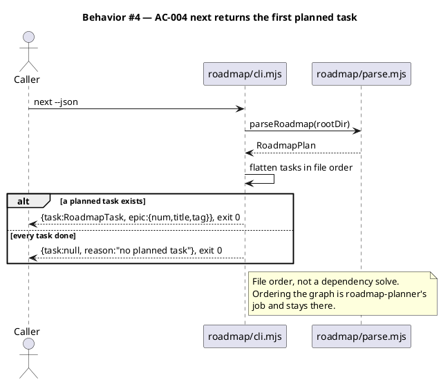

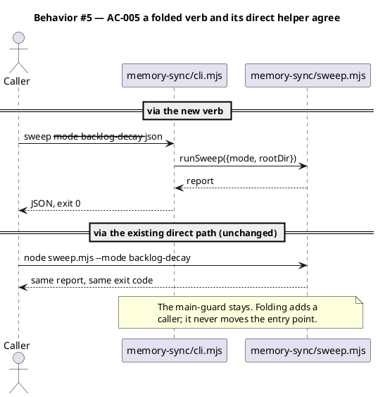

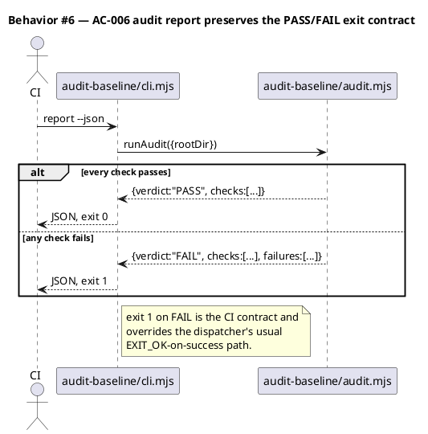

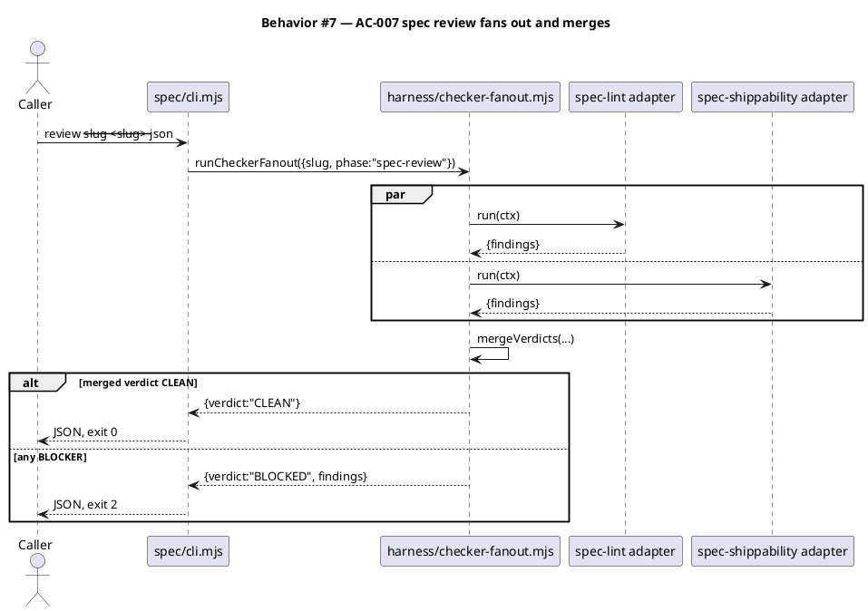

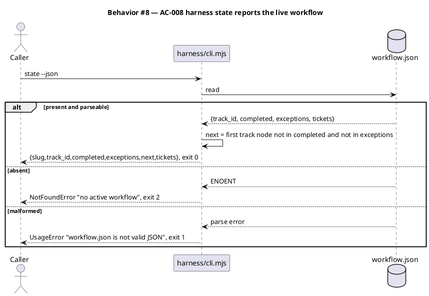

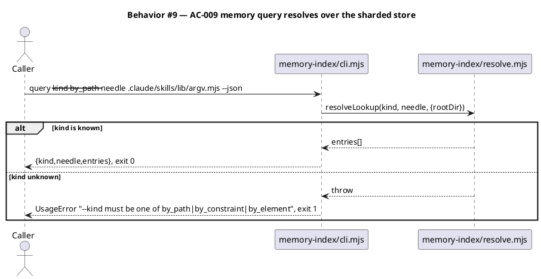

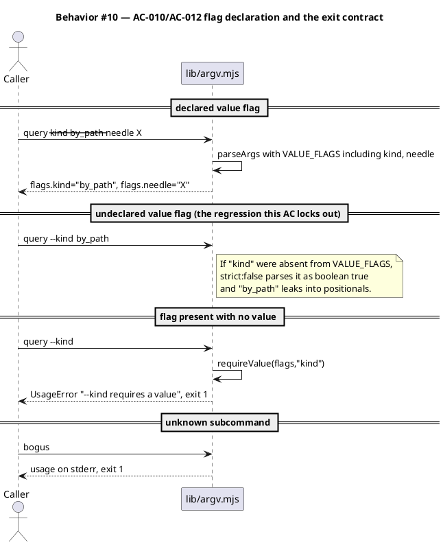

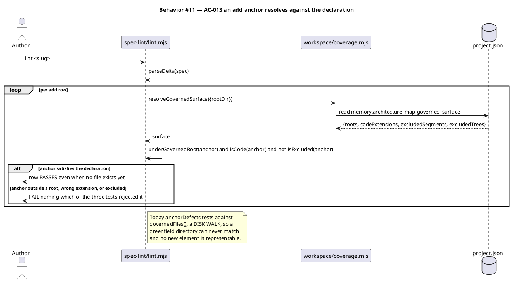

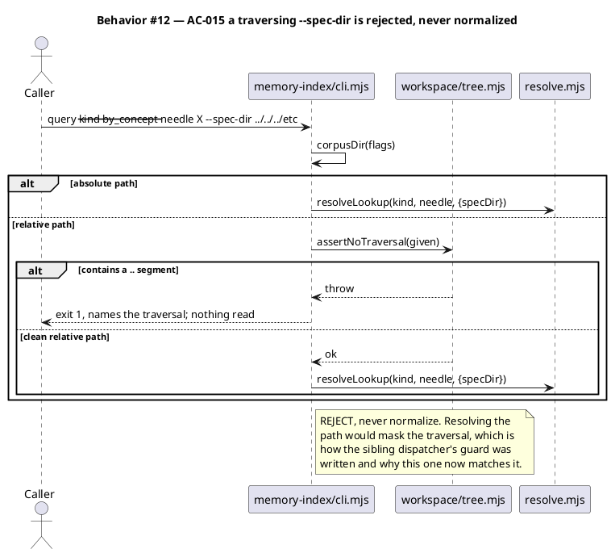

### State — core entity *(only if stateful)*

*(omitted — every verb in this batch is a stateless read over files on disk. No entity has a lifecycle.)*

### Dependencies — graph

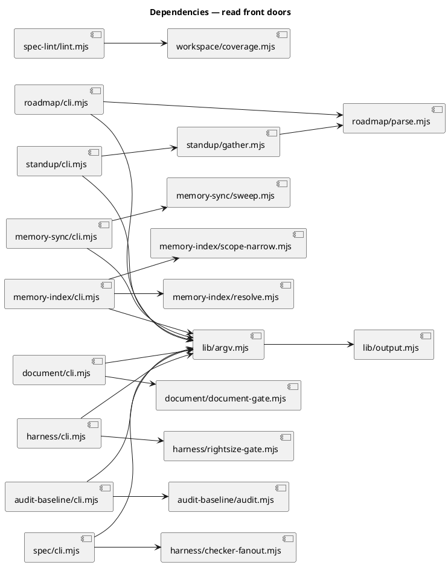

Acyclic. `roadmap/parse.mjs` is the only new fan-in node: two readers, no back-edge.

### Contracts

| Kind | Name | Input | Output | Errors | Idempotent |
|---|---|---|---|---|---|
| CLI | `roadmap/cli.mjs tasks` | `[--epic N] [--status S] [--json]` | `{tasks:[RoadmapTask]}` | 1 usage, 2 no roadmap | yes (read-only) |
| CLI | `roadmap/cli.mjs epics` | `[--json]` | `{epics:[RoadmapEpic]}` | 1, 2 | yes |
| CLI | `roadmap/cli.mjs next` | `[--json]` | `{task, epic}` or `{task:null,reason}` | 1, 2 | yes |
| Module | `parseRoadmap(rootDir)` | `rootDir: string` | `RoadmapPlan \| null` | never throws | yes |
| Module | `roadmapPathFor(rootDir)` | `rootDir: string` | `string` | never throws | yes |
| CLI | `memory-sync/cli.mjs sweep` | `--mode backlog-decay\|stamp-closure [--json]` | sweep report | 1 usage | no (stamp-closure writes) |
| CLI | `memory-index/cli.mjs scope-narrow` | `report\|check [--json]` | narrowing proposal | 1 usage | yes for `report` |
| CLI | `memory-index/cli.mjs query` | `--kind K --needle N [--spec-dir D] [--json]` | `{kind,needle,entries[],concepts[]}` | 1 usage, 1 traversal | yes |
| CLI | `document/cli.mjs gate` | `--slug S [--touched P] [--json]` | `{required,missing,ok}` | 1 usage | yes |
| CLI | `harness/cli.mjs rightsize` | `baseline\|check --slug S [--json]` | `{skip,keep,advisories,measured}` | fail-open, exit 0 | `baseline` yes |
| CLI | `harness/cli.mjs state` | `[--json]` | `{slug,track_id,completed,exceptions,next,tickets}` | 1 malformed, 2 absent | yes |
| CLI | `audit-baseline/cli.mjs report` | `[--json]` | `{verdict,checks,failures}` | exit 1 on FAIL | yes |
| CLI | `spec/cli.mjs review` | `--slug S [--json]` | merged verdict | 2 on BLOCKED | yes |
| Module | `anchorDefects(row, surface)` | delta row + resolved surface | `string[]` defects | never throws | yes |
| Module | `anchorInGovernedSurface(anchor, {rootDir})` | anchor path/glob | `boolean` | throws if surface undeclared | yes |
| Module | `runSweep({mode, rootDir})` | mode + root | sweep report | named error on bad mode | `stamp-closure` writes |
| Module | `runGate({slug, paths, rootDir})` | slug + touched paths | `{required, missing, ok}` | never throws | yes |
| Module | `runAudit({rootDir})` | root | `{verdict, checks, failures}` | never throws | yes |
| Module | `runRightsize({sub, rootDir, deps})` | `baseline` or `check` + root | `{skip, keep, advisories, measured}` | fail-open to the empty decision | `baseline` yes |

Every row above is `--json`-capable via the shared dispatcher; the flag is declared once in `lib/argv.mjs`, not per skill.

### Libraries and versions

| Library@version | Purpose | Key APIs | Confirmed against current docs |
|---|---|---|---|
| Node.js `node:util` (Node 20 LTS) | argv parsing already in use | `parseArgs({args, options, strict, allowPositionals})` | yes — already the shipped call in `lib/argv.mjs:43` |
| Node.js `node:fs` | file reads | `readFileSync`, `existsSync` | yes — already in use |

No new third-party dependency. The baseline is zero-runtime-dep and this batch keeps it there.

### Alternatives considered

| Alt | Summary | Rejected because |
|---|---|---|
| A | Leave the roadmap parse in `gather.mjs` and have `roadmap/cli.mjs` import `gatherSync` | Pulls git, `.releaserc`, `CHANGELOG` and the memory store into a roadmap read. `next` would shell out to git for nothing. |
| B | Duplicate a task-row parser in `roadmap/cli.mjs` | Two parsers of one Markdown format drift. The tally and the rows would disagree the first time the file's shape changes. |
| C | Move the four orphan helpers' logic into their `cli.mjs` and delete the helper entry points | Breaks ~11 documented SKILL.md invocations and the hook call sites in one commit. Additive folding costs nothing and keeps both paths green. |
| D | Pin a JSON schema per verb, as `graph-document.v1.json` does | Nine schemas is a bigger decision than this batch. `graph` earned one because the GUI already consumes it. Deferred, untagged — it is out of scope, not deferred scope. |
| E | Work around T7 by creating `.claude/skills/roadmap/` with a placeholder so the disk walk matches | Scaffold written to satisfy a checker is exactly what Article VI.1/VI.4 forbids, and it would leave the defect live for the next greenfield element. |
| F | Work around T7 by anchoring `roadmap-cli` to an existing directory | The anchor would then lie about where the code lives, and `archive`'s delta verification would report the real path as unclaimed. |
| H | Re-implement each helper's logic inside its `cli.mjs` so no helper file needs changing | Keeps the write set narrow at the cost of four duplicated implementations that drift from the originals — the failure reuse-before-create forbids. A named export is the smaller change and leaves one implementation. |
| G | Register the two new T4 checkers by importing their skills directly in `checker-fanout.mjs`, as lines 10–15 do | Neither target exports an oracle-shaped `run*Oracle(content) → {findings}`: `spec-lint` exports `checkSystemDelta`/`checkApiSurfacePinned` and `spec-shippability-review` exports granular collectors. Composition is required, and `harness/checkers/` is where the two existing composed adapters already live. |

## Program design

### Data access

| Reader | Source | Access path | Written by |
|---|---|---|---|
| `roadmap/parse.mjs` | `project.json → roadmap.path` (default `docs/roadmap-execution-plan.md`) | `readFileSync` | `roadmap-sync` (Phase 10.6) |
| `roadmap/parse.mjs` | `.claude/project.json` | `readFileSync` for `roadmap.path` | `/init-project` |
| `standup/gather.mjs` | same roadmap file | in-process call to `parseRoadmap` | as above |
| `harness/cli.mjs state` | `.claude/state/workflow.json` | `readFileSync` | `/triage`, `harness` loop, `/commit` |
| `harness/cli.mjs state` | `.claude/workflows.jsonl` | `readFileSync` for the track DAG | `/init-project` |
| `memory-index/cli.mjs query` | `.claude/memory/**` sharded store | `resolveLookup` | `/memory-sync` |
| `audit-baseline/cli.mjs` | `obj/template/.claude/manifest.json`, disk | `runAudit` | `scripts/build-template.sh` |
| `spec/cli.mjs review` | `docs/specs/<slug>.md`, `docs/intake/<slug>.md` | `runCheckerFanout` | `/spec`, `/intake` |

One writer per source. `parseRoadmap` gains a second **reader** and no second writer.

### Call stack

Load-bearing for T1 only — the parser extraction changes who calls whom across a skill boundary.

```
node .claude/skills/roadmap/cli.mjs tasks --json
  └─ dispatch()                       lib/argv.mjs
       ├─ parse()                     lib/argv.mjs   (VALUE_FLAGS must carry epic, status)
       └─ subcommands.tasks.run()     roadmap/cli.mjs
            └─ parseRoadmap()         roadmap/parse.mjs
                 ├─ roadmapPathFor()  roadmap/parse.mjs  (reads project.json)
                 └─ readFileSync      IO boundary
```

The other five tickets are single-frame verb additions on an existing dispatcher; no call stack worth drawing.

### Layout

```
.claude/skills/roadmap/
  cli.mjs                 new       — tasks / epics / next dispatcher
  parse.mjs               new       — the one roadmap parser; exports parseRoadmap, roadmapPathFor
.claude/skills/standup/
  gather.mjs              changed   — collectRoadmap delegates to parse.mjs; local parser deleted
  cli.mjs                 unchanged surface — listed because its recap output is regression-locked
.claude/skills/lib/
  argv.mjs                changed   — VALUE_FLAGS gains epic, status, needle, mode, touched-through
.claude/skills/memory-sync/
  cli.mjs                 changed   — + sweep verb
  sweep.mjs               changed   — export runSweep({mode, rootDir}); main-guard retained
.claude/skills/memory-index/
  cli.mjs                 changed   — + scope-narrow, + query verbs
  scope-narrow.mjs        unchanged surface — verbs compose proposeNarrowing / applyNarrowing
.claude/skills/document/
  cli.mjs                 changed   — + gate verb
  document-gate.mjs       changed   — export runGate({slug, paths}); main-guard retained
.claude/skills/harness/
  cli.mjs                 changed   — + rightsize, + state verbs
  rightsize-gate.mjs      changed   — export runRightsize({sub, rootDir}); main prints and exits as before
.claude/skills/workspace/
  coverage.mjs            changed   — export anchorInGovernedSurface(anchor, {rootDir})
  checker-fanout.mjs      changed   — registry gains spec-lint, spec-shippability adapters
  checkers/spec-lint.mjs        new — composes checkSystemDelta + checkApiSurfacePinned into {findings}
  checkers/spec-shippability.mjs new — composes runDevTreeAndUnshippedChecks into {findings}
.claude/skills/audit-baseline/
  cli.mjs                 new       — report dispatcher over audit.mjs
  audit.mjs               changed   — export runAudit({rootDir}); script entry retained
.claude/skills/spec/
  cli.mjs                 changed   — + review verb
.claude/skills/spec-lint/
  lint.mjs                changed   — anchorDefects tests the declaration, not the disk walk
tests/
  roadmap-parse.test.mjs        new — T1 parser + tally-from-rows
  roadmap-cli.test.mjs          new — T1 three verbs, exit codes
  standup-roadmap-parity.test.mjs new — T1 recap regression lock
  folded-verbs.test.mjs         new — T2 verb/helper agreement, both paths
  audit-baseline-cli.test.mjs   new — T3 exit contract
  spec-review-verb.test.mjs     new — T4 fanout + two adapters
  harness-state-verb.test.mjs   new — T5
  memory-query-verb.test.mjs    new — T6
  argv-value-flags.test.mjs     new — AC-010 declaration lock
  delta-anchor-greenfield.test.mjs new — T7 greenfield add row resolves
```

## Design calls

The write set does not intersect `project.json → tdd.ui_globs` — no `site-src/**`, no component or template files. No UI surface is produced.

- *(none)*

## System delta

| Verb | Element | Anchor | Concept | Kind |
|---|---|---|---|---|
| add | roadmap-cli | `.claude/skills/roadmap/*.mjs` | planning-release | c4_component |
| change | standup-helper | `.claude/skills/standup/*.mjs` | planning-release | c4_component |
| change | skill-probe-lib | `.claude/skills/lib/*.mjs` | guard-substrate | c4_component |
| change | memory-sync-helpers | `.claude/skills/memory-sync/*.mjs` | memory-model | c4_component |
| change | memory-index-helpers | `.claude/skills/memory-index/*.mjs` | memory-model | c4_component |
| change | document-helpers | `.claude/skills/document/*.mjs` | docs-pipeline | c4_component |
| change | harness-helpers | `.claude/skills/harness/*.mjs` | harness-loop | c4_component |
| change | harness-checkers | `.claude/skills/harness/checkers/*.mjs` | harness-loop | c4_component |
| change | audit-baseline-helpers | `.claude/skills/audit-baseline/*.mjs` | constitution-chain | c4_component |
| change | spec-helpers | `.claude/skills/spec/*.mjs` | review-fanout | c4_component |
| change | spec-review-helpers | `.claude/skills/spec-*/*.mjs` | review-fanout | c4_component |
| change | workspace-corpus | `.claude/skills/workspace/*.mjs` | memory-model | c4_component |

## Acceptance criteria

| ID | Criterion (given / when / then) | Kind | Upstream AC | Sequence |
|---|---|---|---|---|
| AC-001 | given the roadmap file, when `roadmap/cli.mjs tasks --json` runs, then it emits one `RoadmapTask` per status-marked row with `id`, `epicNum`, `status`, `title`, `body`; `--epic N` and `--status S` filter the set | behavior | T1 | §Behavior #1 |
| AC-002 | given the same repo state, when `standup/cli.mjs recap --json` runs before and after the extraction, then the `roadmap` key is byte-identical, and `gather.mjs` contains no roadmap-parsing function | behavior | T1 | §Behavior #2 |
| AC-003 | given an epic body whose prose contains a status emoji outside a task row, when the plan is parsed, then that emoji does not change the epic's tally, and the tally equals the count of parsed rows by status | behavior | T1 | §Behavior #3 |
| AC-004 | given a plan with ≥1 planned task, when `roadmap/cli.mjs next --json` runs, then it returns the first planned task in file order with its epic; given none, it returns `{task:null, reason}` and exit 0 | behavior | T1 | §Behavior #4 |
| AC-005 | given each of the four folded helpers, when the new verb and the direct `node <helper>.mjs` path run on identical input, then both emit the same payload and the same exit code; a helper that gained a named export retains its main-guard so the direct path is unbroken | behavior | T2 | §Behavior #5 |
| AC-014 | given `sweep.mjs`, `document-gate.mjs`, `audit.mjs`, `coverage.mjs` and `rightsize-gate.mjs`, when each is imported as a module, then it exposes the named export its caller needs (`runSweep`, `runGate`, `runAudit`, `anchorInGovernedSurface`, `runRightsize`) and no caller re-implements that logic locally | behavior | T2, T3, T5, T7 | §Behavior #5 |
| AC-006 | given a passing baseline, when `audit-baseline/cli.mjs report --json` runs, then it emits `verdict:"PASS"` and exits 0; given any failing check, it emits `verdict:"FAIL"`, lists failures, and exits 1 | behavior | T3 | §Behavior #6 |
| AC-007 | given a drafted spec, when `spec/cli.mjs review --slug S --json` runs, then `checker-fanout` fans out the spec-review checkers including the new `spec-lint` and `spec-shippability` adapters and emits one merged verdict; a BLOCKER exits 2 | behavior | T4 | §Behavior #7 |
| AC-008 | given a live `workflow.json`, when `harness/cli.mjs state --json` runs, then it emits `slug`, `track_id`, `completed`, `exceptions`, `tickets`, and `next` (the first track node neither completed nor excepted); absent file exits 2; malformed JSON exits 1 | behavior | T5 | §Behavior #8 |
| AC-009 | given the sharded memory store, when `memory-index/cli.mjs query --kind K --needle N --json` runs, then `entries` is **always an array** and `concepts` is **always an array**, for every one of the four kinds and whether or not a corpus layer resolves; the text path never reports "(no entries)" when the lookup resolved members; an unknown `--kind` exits 1 naming the legal kinds | behavior | T6 | §Behavior #9 |
| AC-015 | given a `--spec-dir` containing a `..` segment, when `memory-index/cli.mjs query` runs, then it exits 1 naming the traversal and reads nothing — rejected, never normalized — matching the guard `memory-sync/cli.mjs` already applies to the same flag | preflight | T6 | §Behavior #12 |
| AC-010 | given every value-taking flag introduced by this batch, when `lib/argv.mjs` is loaded, then each appears in `VALUE_FLAGS`; a test enumerates the batch's flags and fails on any omission | preflight | T1–T6 | §Behavior #10 |
| AC-011 | given every verb added by this batch, when it runs with `--json`, then stdout parses as JSON and the process writes nothing else to stdout | preflight | T1–T6 | §Behavior #10 |
| AC-012 | given a flag supplied with no value, an unknown subcommand, or a missing target file, when any new verb runs, then the exit code is 1 for usage, 1 for unknown subcommand, and 2 for not-found, per the shared contract | error-mapping | T1–T6 | §Behavior #10 |
| AC-013 | given an `add` delta row whose anchor is inside a declared governed root, carries a declared code extension, and is not excluded, when `spec-lint` checks it, then the row passes even though no file matches it on disk; an anchor failing any of the three tests fails and the message names which | preflight | T7 | §Behavior #11 |

No row defers spec-committed scope; the `## Non-goals` exclusions are out of scope, not deferred.

**T7 is a scope addition made during drafting, not an approved-batch item.** It exists because `spec-lint`'s `add`-row check makes this spec's own `roadmap-cli` row unrepresentable. Gate A is the decision point: approving this spec approves the seventh ticket.

## Test plan

| Category | Scenario | Expected | Covers |
|---|---|---|---|
| Golden path | `tasks --json` on the live plan | 41 tasks across 7 epics, T11 present and `planned` | AC-001 |
| Golden path | `epics --json` | 7 epics; Epic 6 `in_progress` with tally 10/0/1 | AC-001 |
| Golden path | `next --json` | Epic 6 T11 | AC-004 |
| Golden path | `state --json` on this workflow | `track_id:"power"`, `next:"spec"` before completion | AC-008 |
| Golden path | `query --kind by_path --needle .claude/skills/lib/argv.mjs` | the entries governing that path | AC-009 |
| Regression trap | `recap --json` roadmap key, fixture repo, pre- vs post-extraction | byte-identical | AC-002 |
| Regression trap | `gather.mjs` source contains no `countTaskStatuses`/`parseEpicHeading` | absent | AC-002 |
| Regression trap | four folded verbs vs their direct helper paths | same payload, same exit | AC-005 |
| Regression trap | each changed helper invoked directly after gaining its export | main-guard still fires; behaviour unchanged | AC-005 |
| Golden path | import each changed helper as a module | the named export is present and callable | AC-014 |
| Contract violation | grep each new `cli.mjs` verb for re-implemented helper logic | absent — the verb delegates | AC-014 |
| Regression trap | the four existing dispatchers' behaviour and exit codes | unchanged | AC-012 |
| Input boundary | epic body with a status emoji in narrative prose | tally unchanged; no phantom task | AC-003 |
| Input boundary | plan with zero planned tasks | `{task:null}`, exit 0 | AC-004 |
| Input boundary | empty roadmap file; heading-only file | `epics:[]`, exit 0 — parse never throws | AC-001 |
| Input boundary | `--epic 99` (no such epic) | `{tasks:[]}`, exit 0 | AC-001 |
| Contract violation | `--kind` with no value | exit 1, `--kind requires a value` | AC-012 |
| Contract violation | `--kind bogus` | exit 1, message names the legal kinds | AC-009 |
| Contract violation | `query --spec-dir ../../../etc` | exit 1 naming the traversal; nothing read | AC-015 |
| Contract violation | both dispatchers accepting `--spec-dir` refuse the same traversal | exit 1 from each | AC-015 |
| Input boundary | `query` over all four kinds with a non-matching needle | `entries` and `concepts` both arrays every time | AC-009 |
| Regression trap | `by_concept` against the live corpus | resolves members; text path does not say "(no entries)" | AC-009 |
| Failure mode | `checker-fanout` loaded where `spec-shippability-review` is pruned | fan-out imports cleanly; adapter fails open | AC-007 |
| Contract violation | unknown subcommand on each new dispatcher | usage on stderr, exit 1 | AC-012 |
| Contract violation | every batch flag ∈ `VALUE_FLAGS` | enumerated, no omission | AC-010 |
| Contract violation | every new verb with `--json` | stdout parses; nothing else on stdout | AC-011 |
| Failure mode | roadmap file absent | exit 2, named error, no stack trace | AC-001 |
| Failure mode | `workflow.json` absent / malformed | exit 2 / exit 1 respectively | AC-008 |
| Failure mode | `audit report` with a seeded drift | `verdict:"FAIL"`, exit 1 | AC-006 |
| Failure mode | `spec review` on a spec with a seeded BLOCKER | merged `BLOCKED`, exit 2 | AC-007 |
| Failure mode | `spec review` with the corpus absent | fail-open, exit 0, skip marker | AC-007 |
| Golden path | `add` row anchoring a directory absent from disk but inside a governed root | row passes | AC-013 |
| Input boundary | `add` anchor with an undeclared extension (`.txt`) | FAIL naming the extension test | AC-013 |
| Input boundary | `add` anchor under an `excludedTrees` path | FAIL naming the exclusion test | AC-013 |
| Contract violation | `add` anchor outside every declared root (`docs/foo.mjs`) | FAIL naming the root test | AC-013 |
| Regression trap | this spec's own nine delta rows | `system_delta` PASS | AC-013 |

## Observability

| Signal | Name | Shape | Purpose |
|---|---|---|---|
| Log | dispatcher usage error | stderr line + exit 1 | the caller sees which flag was wrong |
| Log | `audit report` failure list | `failures[]` in the JSON body | CI reads the reason without re-running |
| Metric | *(none)* | — | these are short-lived CLI reads; no counter has a consumer |

No alarm. A CLI read has no SLO; the exit code is the signal.

## Rollout

### Prerequisites

| # | Prerequisite | enforced-by |
|---|---|---|
| 1 | Every value-taking flag this batch introduces is declared in `lib/argv.mjs → VALUE_FLAGS` before any verb ships | AC-010 |
| 2 | Every new verb emits parseable JSON under `--json` and writes nothing else to stdout | AC-011 |
| 3 | Usage, unknown-subcommand and not-found exits match the shared contract on every new verb | AC-012 |
| 4 | `spec-lint` resolves this spec's own `add` row before T1 creates the directory, so the batch can pass its own gate | AC-013 |
| 5 | Every dispatcher that forwards `--spec-dir` to a path read guards it with `assertNoTraversal` — no dispatcher accepts the flag unguarded | AC-015 |

- **Feature flag**: *(none)* — additive read-only verbs behind no flag. A verb nobody calls costs nothing, and gating a read behind a flag would give the GUI a contract that can vanish.
- **Migration order**: 1 T7 (`spec-lint` anchor fix) — it gates nothing at runtime but must land for the batch's own delta row to lint → 2 `roadmap/parse.mjs` + its tests → 3 repoint `gather.mjs` and prove recap parity → 4 `roadmap/cli.mjs` → 5 the five folding tickets in any order (independent) → 6 full suite.
- **Canary**: not applicable — no deploy surface. `/integrate` running the full suite green is the gate.

## Rollback

- **Kill-switch**: `git revert` of the ticket's commit. The six tickets land as six ordered commits under the `power` split, so any one reverts alone. T1 is the only ticket with an ordering constraint: revert `roadmap/cli.mjs` before `roadmap/parse.mjs`.
- **Signal to roll back**: `standup/cli.mjs recap --json` no longer emitting all six recap keys, or `audit-baseline` exiting non-zero on a clean tree. Both surface on the next session-start hook run — under five minutes of a bad landing.

## Archive plan

- Defaults *(automatic)*: intake, brd, scout, research, spec, spec-rendered/, spec approval, swarm plan + approval (if used), security reports (concatenated).
- Extras *(list any non-default files)*:
  - *(none)*

## Open questions

Three drafting corrections are folded into the spec above rather than left open. Two need no decision; the third does.

- **Resolved.** T4 covers the two missing checker adapters (`spec-lint`, `spec-shippability`), not five — the other three are already in `DEFAULT_CHECKER_REGISTRY`.
- **Resolved.** `lib/argv.mjs` joins the write set: an undeclared value flag parses as boolean `true` under `strict: false` and silently drops its value.
- **Needs a decision at gate A.** T7 widens the approved batch from six tickets to seven. Approving this spec approves that widening; rejecting it means the `roadmap-cli` delta row cannot lint and T1 must instead anchor its element to an existing directory (alternative F, which makes the anchor lie).
