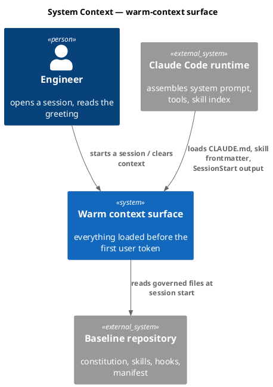
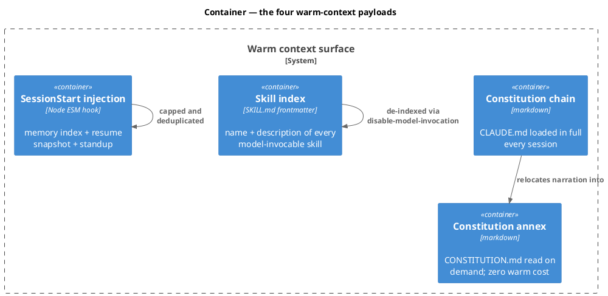
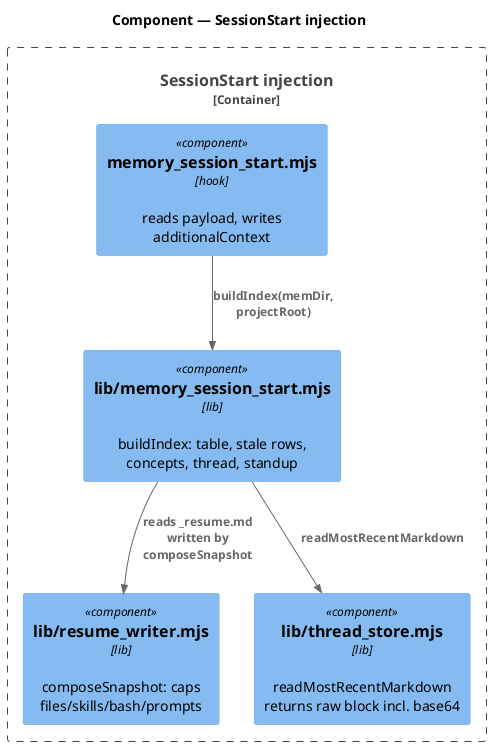
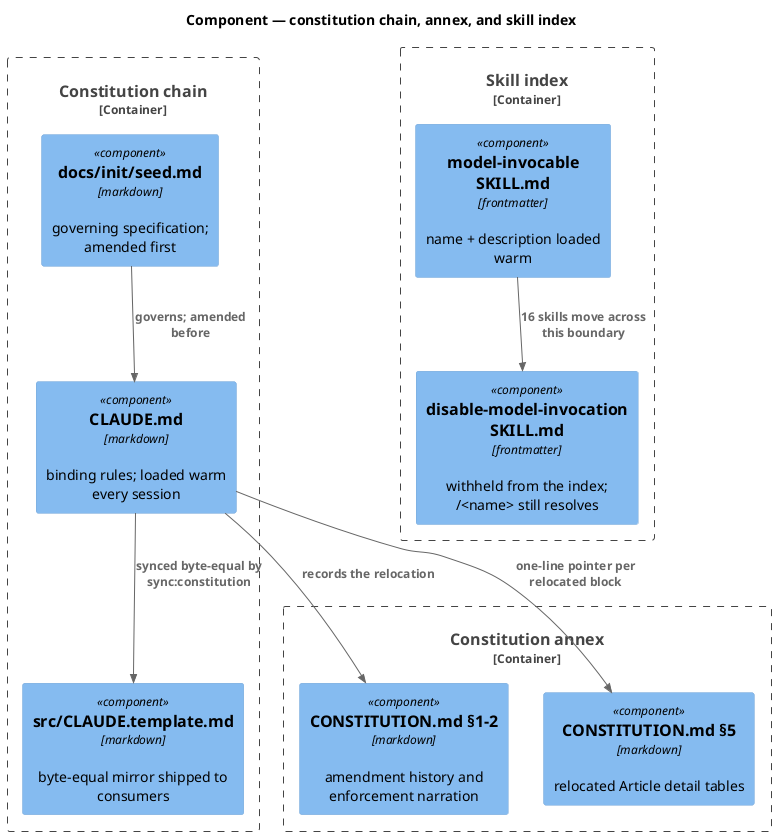
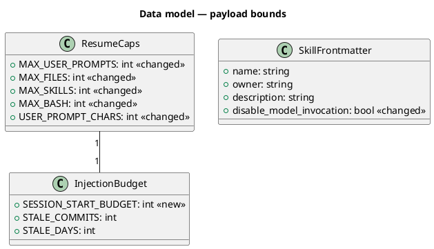
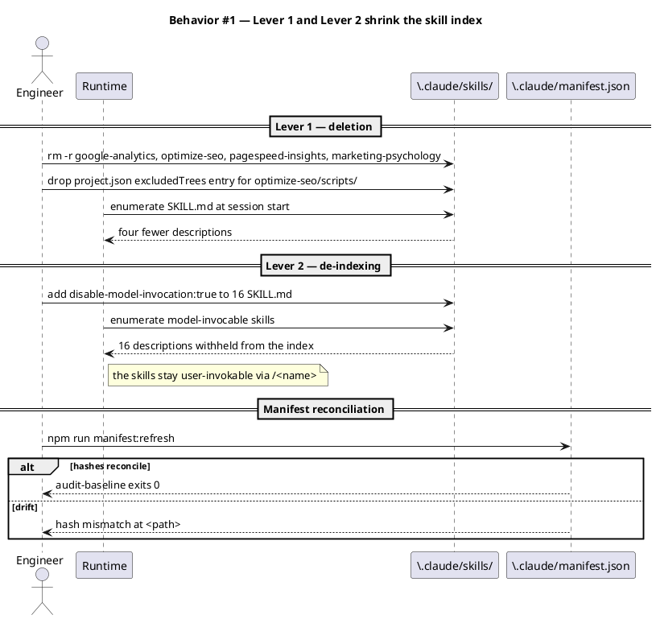
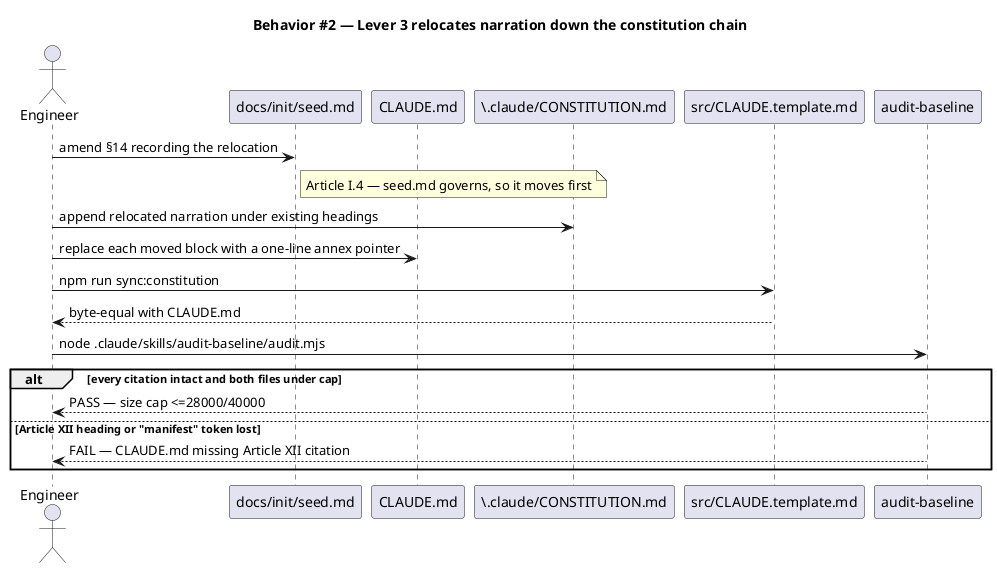
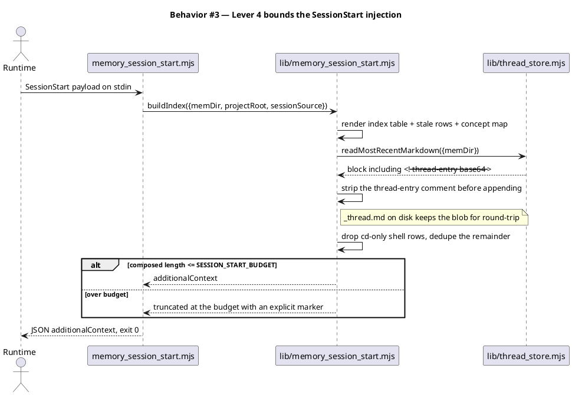
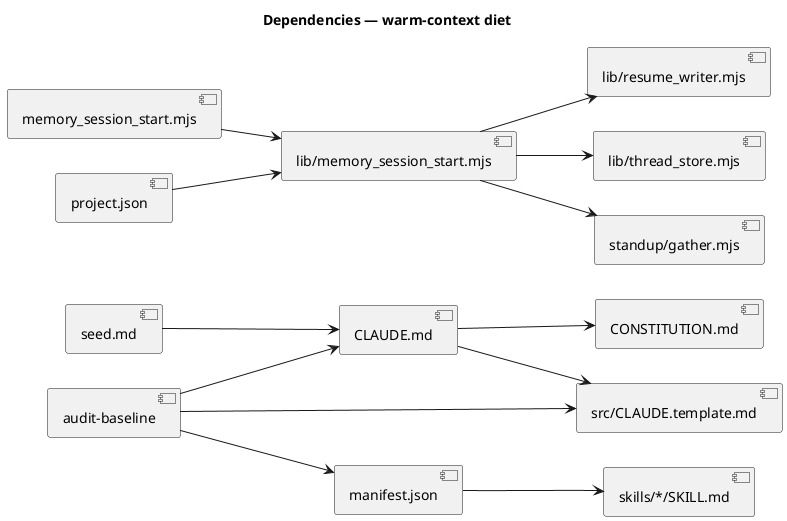

# Warm-context diet — cut the always-loaded token floor

## Context

| Input | Path |
|---|---|
| Intake | *(excepted — `spec-entry` track)* |
| BRD *(if any)* | *(none)* |
| Scout *(if any)* | *(excepted)* |
| Research *(if any)* | *(excepted)* |
| Approved plan | `.config/plans/this-is-minimum-token-warm-manatee.md` |

**Write set**: `.claude/skills/google-analytics/`, `.claude/skills/optimize-seo/`, `.claude/skills/pagespeed-insights/`, `.claude/skills/marketing-psychology/`, `.claude/skills/brd/SKILL.md`, `.claude/skills/claude-automation-recommender/SKILL.md`, `.claude/skills/commit-planner/SKILL.md`, `.claude/skills/companion/SKILL.md`, `.claude/skills/gitignore/SKILL.md`, `.claude/skills/org-dispatch/SKILL.md`, `.claude/skills/rca/SKILL.md`, `.claude/skills/retrospective/SKILL.md`, `.claude/skills/roadmap-planner/SKILL.md`, `.claude/skills/spec-sync/SKILL.md`, `.claude/skills/sprint-oracle/SKILL.md`, `.claude/skills/sprint-plan/SKILL.md`, `.claude/skills/sprint-planner/SKILL.md`, `.claude/skills/standup/SKILL.md`, `.claude/skills/system-reconcile/SKILL.md`, `.claude/skills/upgrade-project/SKILL.md`, `.claude/hooks/lib/memory_session_start.mjs`, `.claude/hooks/lib/resume_writer.mjs`, `.claude/project.json`, `.claude/CONSTITUTION.md`, `docs/init/seed.md`, `src/seed.template.md`, `tests/warm-context-diet.test.mjs` — plus the two un-slashed roots `CLAUDE.md` and `src/CLAUDE.template.md`.

The sixteen SKILL.md paths are named individually rather than globbed: Lever 2 touches exactly these files, and a `.claude/skills/*/SKILL.md` glob would claim every skill element in the corpus. A write set that overstates its surface is how a spec passes review while the delta it declares is wrong.

The write set touches `.claude/hooks/**`, which is a `security.sensitive_globs` path, so `resolveProfile` returns the **full** six-kind diagram set. All six are drawn below; no `@ref` shorthand is used.

### Measured baseline

Every session starts at 45.1k tokens before the user types. Measured on `60c5aeb`:

| Category | Tokens | Owner | Addressable |
|---|---:|---|---|
| Memory files (`CLAUDE.md`, 38,998 chars) | 15.4k | this repo | yes |
| Skills (frontmatter index, 32,153 enabled chars) | 11.9k | ~10.0k this repo | yes |
| System tools | 9.1k | Claude Code | no |
| System prompt | 5.0k | runtime + output style | no |
| Messages (SessionStart injection, 7,617 chars) | 3.6k | this repo | yes |
| Custom agents | 138 | this repo | no |

MCP tool schemas (58.7k) are already deferred and cost nothing warm.

## Goal

The warm baseline loads at or below **36k tokens** with every binding rule, every guard, and every workflow-reachable skill still in force.

## Non-goals

- Lowering `audit-baseline`'s `CLAUDE_CHAR_CAP`. The cap stays 40,000; this spec buys headroom under it, not a new ceiling.
- Deleting or weakening any Article. Article VI ships byte-identical.
- Pruning `owner: baseline` skills from the manifest. The baseline count stays 58 minus nothing — the four deletions are all `owner: user`.
- Touching MCP server registration, the output style, or the subagent.
- Re-tuning `_thread.md`'s on-disk format. The base64 round-trip stays; only the *injected* copy is stripped.

## Design

Diagrams are the contract.

### C4 — System context



### C4 — Container



### C4 — Component (changed containers only)

All four containers change, so all four carry a boundary.





### Data model — tuning constants

The change is entirely one of bounds. Both classes are module-level constants, not persisted entities, so there is no migration DDL.



#### Migration DDL

```sql
-- No database. The "migration" is a constant swap, stated here for symmetry.
-- forward:  MAX_FILES 24 -> 8, MAX_SKILLS 10 -> 5, MAX_BASH 10 -> 5,
--           MAX_USER_PROMPTS 6 -> 4, USER_PROMPT_CHARS 800 -> 400,
--           literal 9000 -> SESSION_START_BUDGET = 4096
-- reverse:  restore the values recorded in the comment at resume_writer.mjs:21
```

### Behavior — sequence per AC







### State — core entity *(only if stateful)*

No non-trivial state machine. The change alters bounds on a stateless render path; `_resume.md` and `_thread.md` lifecycles are untouched.

### Dependencies — graph



### Contracts

| Kind | Name | Input | Output | Errors | Idempotent |
|---|---|---|---|---|---|
| Hook | `memory_session_start.mjs` | SessionStart JSON on stdin | `additionalContext` JSON ≤ `SESSION_START_BUDGET` chars, exit 0 | never non-zero; index failure writes stderr and emits nothing | yes |
| Function | `buildIndex({memDir, projectRoot, sessionSource})` | dirs + source string | composed markdown string | returns `''` on unreadable memory dir | yes |
| Function | `composeSnapshot({transcript, projectDir, trigger})` | transcript path + dirs | `_resume.md` body | throws on unreadable transcript; caller catches | yes |
| Frontmatter | `disable-model-invocation` | `true` | skill withheld from the model-invocable index; `/<name>` still works | absent key means model-invocable | yes |
| CLI | `npm run sync:constitution` | none | `src/CLAUDE.template.md` byte-equal to `CLAUDE.md` | exits non-zero if source missing | yes |
| CLI | `npm run manifest:refresh` | none | `manifest.files` sha256 restamped | exits non-zero on unreadable skill | yes |

### Libraries and versions

| Library@version | Purpose | Key APIs | Confirmed against current docs |
|---|---|---|---|
| `node:fs` (Node 22 LTS stdlib) | read/write governed files | `readFileSync`, `writeFileSync`, `existsSync` | yes — stdlib, no third-party surface |
| `node:test` (Node 22 LTS stdlib) | the enforcement tests | `describe`, `it`, `assert` | yes — matches the existing `tests/*.test.mjs` idiom |

No third-party library is added, so the Article VI.5 current-docs rule has no external surface to verify.

### Alternatives considered

| Alt | Summary | Rejected because |
|---|---|---|
| A | Lower `CLAUDE_CHAR_CAP` to 28,000 and let the audit force the trim | Turns a one-time relocation into a standing constraint on every future amendment. The cap is a safety rail, not a budget. |
| B | Delete the 16 user-only skills instead of de-indexing them | They are reachable, useful, and mostly `owner: baseline`. Deleting them breaks the manifest, the seed §5 breakdown, and every count claim, to buy the same tokens a frontmatter flag buys. |
| C | Move Article VI to the annex — it is the single largest remaining block | Those are the non-negotiable engineering rules. A rule the model cannot see is a rule it will violate. Warm cost is the point. |
| D | Split into four separate workflows, one per lever | Four gate-A approvals and four commits for one coherent goal. The levers share a single verification (`/context` after `/clear`). |

## Program design

### Data access

| Reader | Source | Access path | Written by |
|---|---|---|---|
| Claude Code runtime | `CLAUDE.md` | full file read at session start | this spec's Lever 3 edit; nothing at runtime |
| Claude Code runtime | `.claude/skills/*/SKILL.md` frontmatter | directory enumeration at session start | this spec's Lever 2 edit; nothing at runtime |
| `lib/memory_session_start.mjs` | `.claude/memory/*` shards | `readFileSync` via `readShardedCategory` | `/memory-sync` |
| `lib/memory_session_start.mjs` | `.claude/memory/_thread.md` | `thread_store.readMostRecentMarkdown` | `thread_store.appendEntry` |
| `lib/memory_session_start.mjs` | `.claude/memory/_resume.md` | `readFileSync` | `lib/resume_writer.writeSnapshot` |
| `lib/memory_session_start.mjs` | `docs/system/concepts/` | `renderConceptMap` | `/spec-sync`, `/system-reconcile` |
| `checks/constitution.mjs` | `CLAUDE.md`, `src/CLAUDE.template.md` | `ctx.readText` | this spec's Lever 3 edit |
| `checks/skill-ownership.mjs` | `manifest.owners.skills` + on-disk SKILL.md | sha256 re-derivation | `npm run manifest:refresh` |

`_thread.md` keeps exactly one writer (`thread_store.appendEntry`). Lever 4 strips the base64 comment in the **consumer** (`lib/memory_session_start.mjs`), never at the source, so the round-trip that `thread_store` owns is unaffected.

### Call stack

Load-bearing for Lever 4 — the budget decision is three frames below the hook, and the base64 leak enters from a sibling module a maintainer would otherwise have to rediscover.

```
memory_session_start.mjs (SessionStart hook)
  └─ buildIndex()                      lib/memory_session_start.mjs
       ├─ readShardedCategory()        lib/memory_session_start.mjs   — index table + stale rows
       ├─ renderConceptMap()           lib/memory_session_start.mjs   — architecture concepts
       ├─ readFileSync(_resume.md)     ← written by lib/resume_writer.composeSnapshot
       ├─ readMostRecentMarkdown()     lib/thread_store.mjs           — LEAKS the base64 comment
       ├─ readWorkingThread()          lib/thread_store.mjs
       └─ renderStandupSection()       skills/standup/gather.mjs
```

### Layout

```
.claude/skills/
  google-analytics/            deleted   — website skill, no baseline coupling
  optimize-seo/                deleted   — invokes five skills absent from this repo
  pagespeed-insights/          deleted   — reached only by optimize-seo
  marketing-psychology/        deleted   — self-contained website skill
  <16 user-only>/SKILL.md      changed   — frontmatter gains disable-model-invocation: true
.claude/hooks/lib/
  memory_session_start.mjs     changed   — SESSION_START_BUDGET constant; strip thread-entry blob
  resume_writer.mjs            changed   — five caps lowered; cd-only rows dropped and deduped
  thread_store.mjs             unchanged surface — listed because it is the blob's origin
.claude/
  project.json                 changed   — drop the optimize-seo/scripts excludedTrees entry
  CONSTITUTION.md              changed   — receives the relocated narration
CLAUDE.md                      changed   — narration replaced by annex pointers; <= 28000 chars
src/CLAUDE.template.md         changed   — regenerated byte-equal by sync:constitution
docs/init/seed.md              changed   — §14 amendment recording the relocation
src/seed.template.md           changed   — seed mirror
tests/
  warm-context-diet.test.mjs   new       — the enforcement suite for AC-004/006/008..012
```

## Design calls

- *(none)* — the write set intersects no path in `project.json → tdd.ui_globs`.

## System delta

| Verb | Element | Anchor | Concept | Kind |
|---|---|---|---|---|
| change | memory-hook-libs | `.claude/hooks/lib/memory_*.mjs` | memory-model | c4_component |
| change | resume-libs | `.claude/hooks/lib/resume_*.mjs` | memory-model | c4_component |

**The advisory optimize pass reports 112 `undeclared` and 114 `reuse` findings against this spec. All of them are false positives, and `corrections` is 0.** `optimize.mjs → overlapsWriteSet` compares *directory prefixes*, not paths: `directoryPrefix('.claude/project.json')` returns `.claude/`, which prefix-matches every element in the corpus, and `.claude/hooks/lib/resume_writer.mjs` returns `.claude/hooks/lib/`, which matches all thirty sibling libraries. Dropping the two `.claude/`-root paths from the write set takes the count from 112 to 68; the residue is the sibling-directory collapse. The write set is not narrowed to silence this — it is accurate, and a pass that cannot distinguish siblings in one directory is the thing to fix. Recorded for the backlog at `/memory-sync`; the pass is advisory and blocks nothing.

The four deleted skills are `owner: user` markdown with no governed-surface anchor (`codeExtensions` covers `.mjs`/`.js`/`.json`/`.yml`, and `optimize-seo/scripts/` is already an `excludedTrees` entry), so no element retires. `CLAUDE.md`, `.claude/CONSTITUTION.md`, and `src/*.template.md` fall outside `governed_surface` — the `src-templates` element anchors `src/*.json`, not markdown — so Lever 3 moves no element.

## Acceptance criteria

| ID | Criterion (given / when / then) | Kind | Upstream AC | Sequence |
|---|---|---|---|---|
| AC-001 | given the four website skill directories exist, when Lever 1 lands, then none of `google-analytics`, `optimize-seo`, `pagespeed-insights`, `marketing-psychology` resolves under `.claude/skills/` | behavior | plan Lever 1 | §Behavior #1 |
| AC-002 | given `project.json` lists `.claude/skills/optimize-seo/scripts/` in `excludedTrees`, when Lever 1 lands, then that entry is absent and the remaining `excludedTrees` entries are unchanged | behavior | plan Lever 1 | §Behavior #1 |
| AC-003 | given the 16 named user-only skills, when Lever 2 lands, then each SKILL.md frontmatter contains `disable-model-invocation: true` and every other skill's frontmatter is byte-unchanged | behavior | plan Lever 2 | §Behavior #1 |
| AC-004 | given all four levers have landed and `npm run manifest:refresh` has run, when `node .claude/skills/audit-baseline/audit.mjs` runs, then it exits 0 with no `hash mismatch` and no `baseline skill missing` row | preflight | plan sequencing step 5 | §Behavior #1 |
| AC-005 | given `CLAUDE.md` is 38,998 chars, when Lever 3 lands, then it is at most 28,000 chars | behavior | plan Lever 3 | §Behavior #2 |
| AC-006 | given Lever 3 edits `CLAUDE.md`, when `npm run sync:constitution` runs, then `src/CLAUDE.template.md` is byte-equal to `CLAUDE.md` and carries no derived-header banner | preflight | plan Lever 3 | §Behavior #2 |
| AC-007 | given the twelve Article headings and the Article VI body, when Lever 3 lands, then every `## Article <I..XII>` heading is still present and the Article VI body is byte-identical to its pre-change bytes | behavior | plan Lever 3 "never touch" | §Behavior #2 |
| AC-008 | given the repository's live memory and state, when the SessionStart hook runs, then its stdout is at most 4,096 characters | behavior | plan Lever 4 | §Behavior #3 |
| AC-009 | given `_thread.md` holds a `<!-- thread-entry` base64 comment, when the hook composes its output, then the substring `thread-entry` is absent from stdout and still present on disk in `_thread.md` | behavior | plan Lever 4 | §Behavior #3 |
| AC-010 | given a transcript whose last ten shell commands are the identical `cd <root>`, when `composeSnapshot` renders, then the shell-command section emits no `cd`-only row and no duplicate row | behavior | plan Lever 4 | §Behavior #3 |
| AC-011 | given any SessionStart payload including a malformed one, when the hook runs, then it exits 0 and stdout is either empty or parses as JSON carrying `hookSpecificOutput` | smoke | plan Lever 4 | §Behavior #3 |
| AC-012 | given the audit's citation checks, when all levers have landed, then `CLAUDE.md` still contains `## Article XII` and the token `manifest`, and `docs/init/seed.md` still contains `## §17` and `manifest` | preflight | Article XII.4 | §Behavior #2 |

No row defers spec-committed scope, so no `deferred:` tag applies.

## Test plan

Every row lands in `tests/warm-context-diet.test.mjs` unless named otherwise.

| Category | Scenario | Expected | Covers |
|---|---|---|---|
| Golden path | assert the four skill directories are absent | all four `existsSync` false | AC-001 |
| Golden path | parse `project.json`, read `excludedTrees` | no entry matches `optimize-seo` | AC-002 |
| Golden path | read each of the 16 SKILL.md frontmatter blocks | every one has `disable-model-invocation: true` | AC-003 |
| Golden path | `statSync('CLAUDE.md').size` and char length | ≤ 28,000 chars | AC-005 |
| Golden path | compare `CLAUDE.md` and `src/CLAUDE.template.md` bytes | strictly equal | AC-006 |
| Golden path | grep the twelve Article headings | all twelve present | AC-007 |
| Golden path | spawn the hook with a valid payload, measure stdout | ≤ 4,096 chars | AC-008 |
| Contract violation | assert `thread-entry` absent from hook stdout, present in `_thread.md` | both hold | AC-009 |
| Input boundary | `composeSnapshot` over a fixture transcript of ten identical `cd` commands | zero shell rows emitted | AC-010 |
| Input boundary | `composeSnapshot` over a fixture with 40 file writes | at most 8 in-flight rows | AC-008 |
| Failure mode | spawn the hook with `{}`, with malformed JSON, and with an absent memory dir | exit 0 each time; stdout empty or valid JSON | AC-011 |
| Contract violation | grep `## Article XII` + `manifest` in CLAUDE.md; `## §17` + `manifest` in seed.md | all four present | AC-012 |
| Regression trap | run `node .claude/skills/audit-baseline/audit.mjs` | exit 0 | AC-004 |
| Regression trap | existing `tests/document-routing-gate.test.mjs` | unchanged pass — `copywriting` survives Lever 1 | AC-001 |
| Regression trap | full `npm test` | no pre-existing test regresses | all |

## Observability

| Signal | Name | Shape | Purpose |
|---|---|---|---|
| Log | `memory_session_start: emitted memory index` | existing `logLine` call, unchanged | confirms the hook still reaches its terminal write |
| Log | `memory_session_start: index build failed: <msg>` | existing stderr write, unchanged | surfaces a build failure without breaking session start |
| Metric | `/context` warm total | manual reading after `/clear` | the acceptance measurement; no automated collector exists or is added |

No metric backend exists in this repository, so an alarm row would be fiction. The `/context` reading is the observability surface and it is human-run.

## Rollout

### Prerequisites

| # | Prerequisite | enforced-by |
|---|---|---|
| 1 | The manifest is restamped after every content edit, so no baseline skill reports hash drift | AC-004 |
| 2 | `CLAUDE.md` and its `src/` mirror stay byte-equal, so the audit's mirror check holds | AC-006 |
| 3 | The SessionStart hook never fails a session start, whatever payload it receives | AC-011 |
| 4 | The audit's constitutional citation checks still find Article XII and seed §17 | AC-012 |

- **Feature flag**: none. Every lever is a content edit with no runtime branch; a flag would be dead config the moment it landed, which Article VI.4 forbids.
- **Migration order**: 1 Lever 1 (delete + `project.json`) → 2 Lever 4 (hook trim + tests) → 3 Lever 3 (`seed.md` → `CLAUDE.md` → `sync:constitution`) → 4 Lever 2 (frontmatter flags) → 5 `npm run manifest:refresh`.
- **Canary**: none available — this is a local repository overlay with no deployment surface. The `/clear` then `/context` reading is the verification.

## Rollback

- **Kill-switch**: `git revert <commit>`. Every lever is a tracked content change in one commit; no state file, no consent token, and no generated artifact outlives the revert. Re-run `npm run manifest:refresh` afterwards to restamp.
- **Signal to roll back**: `node .claude/skills/audit-baseline/audit.mjs` exits non-zero, or `npm test` regresses, or the SessionStart hook exits non-zero on a real session start. All three are observable within one session — the audit and the suite run in `/integrate`, and a hook failure surfaces at the next session start.

## Archive plan

- Defaults *(automatic)*: spec, spec-rendered/, spec approval, security report.
- Extras *(list any non-default files)*:
  - `.config/plans/this-is-minimum-token-warm-manatee.md` — the approved plan this spec derives from. Advisory: it lives outside the workflow directories, so `/archive` will not discover it by slug.

## Open questions

- *(none)* — the three judgment calls the plan raised (`audit-baseline`, `whatsnew`, `technical-tutorials`) were resolved by leaving all three model-invocable, and that decision is recorded in the AC-003 list of sixteen.
