# Consumer-install defects — seven fixes and the gate that should have caught them

## Context

| Input | Path |
|---|---|
| Intake | *(excepted — `spec-entry` track; the defect report in `workflow.json → request` is the intake record)* |
| BRD *(if any)* | *(none)* |
| Scout *(if any)* | *(excepted — the in-session reproduction below is the scouting record)* |
| Research *(if any)* | *(excepted — every fix has a named in-repo precedent)* |

**Write set**: `.claude/commands/init-project.md`, `.claude/commands/init-project-doctor.md`, `docs/init/seed.md`, `src/seed.template.md`, `src/agents/swarm-worker.template.md`, `.claude/skills/audit-baseline/checks/project-json.mjs`, `.claude/skills/audit-baseline/memory-shape.mjs`, `.claude/skills/audit-baseline/expected-baseline.mjs`, `src/memory/constraints.template.md`, `CLAUDE.md`, `src/CLAUDE.template.md`, `.claude/skills/standup/render.mjs`, `.claude/skills/spec-shippability-review/scan-shipped-skills.mjs`, `.claude/skills/spec-shippability-review/analyzer.mjs`, `scripts/build-template.sh`, `tests/**` — full diagram profile, because `.claude/commands/**` and `scripts/**` fall outside `artifacts.diagram_profiles → non-architectural`.

**Amended twice after the first gate-A approval.**

The scenario pass found two blockers the original spec did not cover: D4 as scoped would not actually have caught D1 (pattern coverage, not just root coverage), and the swarm-worker template had already drifted from its rendered output. D6 and D7 are that amendment; `analyzer.mjs` and `src/agents/swarm-worker.template.md` joined the write set with them.

The implement pass then found that excluding the `constraints/` shard dir leaves nothing in its place, because two lists in this repo disagree about how many memory categories exist. D9 is that amendment, and the human directed that `constraints` ship as a full category rather than be declared project-local. It adds four files: `src/memory/constraints.template.md`, `.claude/skills/audit-baseline/expected-baseline.mjs`, and the byte-equal pair `CLAUDE.md` + `src/CLAUDE.template.md`.

### Where the report came from

A downstream user installed this baseline and ran `/init-project`. Step 8's audit exited 1. Five defects came out of that session and the follow-up reading. Every one is reproduced in this repo, not taken on report.

| # | Defect | Evidence in this repo |
|---|---|---|
| D1 | The `swarm-worker` re-render step reads `src/agents/swarm-worker.template.md`, which ships only in the dev repo | `.claude/commands/init-project.md:119`; `docs/init/seed.md:191`, `:661`; `src/seed.template.md:191`, `:661`; `obj/template/src` does not exist |
| D2 | `audit-baseline` reads `src/project.template.json` unconditionally, so config parity FAILs on every consumer install | `checks/project-json.mjs:53` has no gate; its sibling `checks/src-templates-a.mjs:11` gates on `ctx.skipSrc` |
| D3 | `/standup` prints `Epic undefined` for every roadmap row | `standup/render.mjs:73` reads `epic.number`; `standup/gather.mjs:189` emits `num`. `cli.mjs recap` printed `done Epic undefined:` for all seven epics |
| D4 | The shippability scanner never walks `.claude/commands/`, so D1's `src/` reference shipped unseen | `scan-shipped-skills.mjs:28` sets one root: `obj/template/.claude/skills` |
| D5 | The shipped template carries a mixed memory store plus two leaked dev-repo facts | `scripts/build-template.sh:150-156` excludes seven shard dirs and omits `memory/constraints/`; `checkMemoryShape('obj/template/.claude/memory')` returns `categories: 1` |
| D6 | `src/agents/swarm-worker.template.md` has drifted from its rendered output, and nothing tests render parity | Rendering the template and diffing against `.claude/agents/swarm-worker.md` shows two divergences: the template lacks the line-31 concurrency instruction, and its line 61 still names `swarm_merge.sh` where the real helper is `swarm_merge.mjs` |
| D7 | The shippability gate that exists to catch exactly D1 ran, passed, and shipped it | The gate is wired at `scripts/build-template.sh:203`. It missed D1 on two independent axes — see the table below |
| D9 | `constraints` is a real memory category in one oracle and absent from the other, so no `constraints.md` ships and the count surfaces still say seven | `memory-index/categories.mjs → CANONICAL` holds 8 ids including `constraints`; `audit-baseline/expected-baseline.mjs → EXPECTED_MEMORY_FILES` holds 7 categories and omits it; `src/memory/` carries 7 category stub templates and no `constraints.template.md`; `CLAUDE.md:278` and `src/CLAUDE.template.md:278` both read "7 memory files" |
| D8 | D1 is not alone. Seven more dev-only path references ship inside `.claude/commands/`, six of them in `/init-project-doctor` | Scanning shipped commands for a bare dev-only path yields 8 hits and no false positives: `init-project-doctor.md` names `src/.claude/workflows.template.jsonl` (×2), `src/seed.template.md` (×2), `src/CLAUDE.template.md`, `src/cli/workflows-validator.js`; `init-project.md` names `src/agents/swarm-worker.template.md` (D1) and `src/cli/install.js` |

### D7 — why the gate that exists for this missed it

`scan-shipped-skills.mjs` is not advisory. It is a build-time gate that aborts the build on a BLOCKER before the manifest is stamped. It ran on the build that shipped D1.

It missed on two axes, each a hardcoded list:

| Axis | Mechanism | Why D1 passed |
|---|---|---|
| **Roots** | `scan-shipped-skills.mjs:28` sets one root, `obj/template/.claude/skills` | `.claude/commands/` is shipped and never walked. Nor is `.claude/agents/`. |
| **Patterns** | `analyzer.mjs:21-26` holds four `RUNTIME_INVOCATION_PATTERNS` | `collectMarkdownCode` **does** collect D1's inline backtick as a chunk. The pattern gate then discards it: all four forms require `import`/`require`, a `node`/`bash`/`sh` prefix, or a leading `./`. A bare `src/…` in backticks matches none. |

Measured on the real file: `runDevTreeAndUnshippedChecks` over `.claude/commands/init-project.md` yields 169 chunks and **zero** `DEV_TREE_RUNTIME_REF` findings. `isDevOnlyPath('src/agents/swarm-worker.template.md')` returns `true` — nothing ever asks it.

Closing one axis alone leaves D1 shippable, which is why the two are fixed and tested apart.

### The failure modes

D2 and D3 are ordinary seam defects: one missing gate, one wrong field name.

D1, D4 and D5 are one failure mode wearing three faces — **a hardcoded list that drifted from the oracle it was copied from**:

| Face | The list | The oracle it should derive from | How it drifted |
|---|---|---|---|
| D4 | one scan root, inlined at `scan-shipped-skills.mjs:28` | the set of shipped surfaces that can carry a runtime path | `.claude/commands/` was never added |
| D5 | seven `--exclude='memory/<cat>/'` lines in `build-template.sh` | `memory-index/categories.mjs → CANONICAL` | `constraints` became the eighth category; the exclude list stayed at seven |
| D7 | four syntactic forms in `analyzer.mjs:21-26` | "a dev-only path in a shipped file is suspect", which `isDevOnlyPath` already decides | the prefix requirement made detection opt-in per syntax; prose references were never a form |
| D9 | seven category ids in `expected-baseline.mjs:34` | the same `CANONICAL` | `constraints` became the eighth category; the audit's expected set stayed at seven, so the two oracles now disagree about what a complete store is |
| D1 | — | — | D4's and D7's blind spots together are what let D1 reach a consumer install |

#### D9 — what "ship the eighth category" actually costs

The exclude fix alone already makes the audit pass: with `constraints/` excluded and `_discard-ledger.md` excluded, the shipped store is flat with exactly the seven files `EXPECTED_MEMORY_FILES` names. Stopping there would be green and wrong — the baseline would ship a store its own category oracle calls incomplete, and the disagreement would sit waiting for the next reader.

Shipping the eighth category costs four files, measured rather than estimated:

| File | Change |
|---|---|
| `src/memory/constraints.template.md` | new pristine stub; Stage 2 already globs `src/memory/*.template.md`, so no build-script change |
| `expected-baseline.mjs` | `EXPECTED_MEMORY_FILES` derives from `CANONICAL` plus the three trails; `CANONICAL_MEMORY_FILES` derives from it in turn |
| `derive-counts.mjs` | `CANONICAL_MEMORY` imports the oracle — it was a **third** independent copy of the list, still at seven |
| `CLAUDE.md`, `src/CLAUDE.template.md` | orientation line "7 memory files" → "8"; byte-equal pair, both move together |

**Corrected during implementation.** This section first claimed `deriveCounts().memoryFiles` would follow from the `expected-baseline.mjs` change "for free". It does not. `derive-counts.mjs:12` held its own hardcoded seven-entry list, so `memoryFiles` counted 7 against a roster of 8 and `test_when_deriveCounts_then_matches_disk` failed even though every category was present on disk. That is a **sixth** instance of this batch's failure mode, found by the full suite rather than by reading, and it needed its own one-line import. The row above records the fix; this note records that the original claim was wrong, because an archived spec asserting a false "for free" is exactly the kind of restated-instead-of-derived belief the batch exists to remove.

Nothing else moves. `README.md` carries no memory count, `docsite-drift.mjs` checks hooks/workflows/skills/mcp and not memory, and `tests/template-payload.test.mjs` allows `.claude/` broadly with a `minCount: 6` floor that an eighth stub satisfies. The public site needs no edit either: `site-src/_data/roster.cjs` imports the category list from `audit-baseline/checks/memory.mjs`, which re-exports the same oracle, so the Memory page renders eight categories without a source change.

`_discard-ledger.md` is excluded from the payload in the same change. It is a dev-repo ledger of discarded memory candidates, the same class as `_pending` / `_resume` / `_thread`, which were already excluded; it was simply missed, and the flat branch would report it as an unexpected file.

D6 is the same shape one level up: `seed.md:191` calls the template "the worker's canonical body", but the rendered file is what ships and it has moved ahead. A claim of parity with nothing asserting it is a hardcoded list of one.

The fix in every case is to stop restating the oracle. For D7 that means the roots and the patterns both stop being enumerations that a maintainer must remember to extend:

- **Roots** keep an explicit descriptor list, but a test asserts it is *complete* against the shipped tree: every top-level `.claude/<dir>` that ships either has a descriptor or an explicit exemption carrying a reason. A new shipped surface therefore fails the suite instead of going quietly unscanned.
- **Patterns** gain one form that is not syntax-gated, scoped to shipped commands: a bare dev-only path anywhere in a `.claude/commands/*.md`. `isDevOnlyPath` is the oracle; the new form simply asks it.

#### Why the new pattern is scoped to commands, and not applied tree-wide

This was measured rather than assumed. Applying a bare-dev-path rule across the whole shipped tree yields **74 hits in 22 files** — 28 in `.claude/CONSTITUTION.md` alone. Those are overwhelmingly *descriptive*: governance prose stating where a file lives is not an instruction to read it at runtime. At BLOCKER severity that aborts every build on mostly-false findings; at ADVISORY it blocks nothing and D1 ships again.

Restricting the same rule to `.claude/commands/**` yields **8 hits and no false positives**. The reason is categorical, not statistical: a command file is a recipe Claude executes, so a dev-only path inside one is an instruction to read a file the consumer does not have. The same string inside a SKILL.md paragraph or the constitution is a statement about the repository. Commands get the strict rule; everything else keeps the existing syntax-gated patterns.

D8 is what that measurement surfaced: those 8 hits are 8 real defects, not 1. Six live in `/init-project-doctor`, which is therefore as broken on a consumer install as `/init-project` was.

D5's oracle already carries a warning about exactly this. `audit-baseline/memory-shape.mjs:9-11` says its own category list is imported "rather than re-listed" because a local copy "left one entry behind turns a correctly-registered store into an audit FAIL". The build script is the local copy that comment predicted.

## Goal

A fresh consumer install passes `audit-baseline` with exit 0, runs `/init-project` and `/init-project-doctor` without either command reaching for a path the install does not have, and prints real epic numbers in `/standup` — and the build gate that let these ship now fails on the next one of its kind instead of passing it.

## Non-goals

- Shipping `src/agents/swarm-worker.template.md` into the consumer tree. The user chose the in-place rewrite; a second copy of the worker body in every install is the alternative this spec rejects.
- Changing what `checkMemoryShape` or `checks/memory.mjs` consider a valid store. D5 is a build-output defect; the detector is correct and stays untouched.
- Migrating an already-installed mixed store. `memory-index/migrate.mjs` already does that and is the documented path for installs that predate this fix.
- Adding an `--skip-hash-check` affordance to any workflow. The flag exists for local diagnosis; the fix for downstream hash drift is landing this spec upstream.
- Retiring `src/agents/swarm-worker.template.md`. D6 refreshes it to match the rendered output and adds the parity test that would have caught the drift; the template stays the dev-repo canonical body.
- Broadening `governed_surface` to cover `scripts/`. `build-template.sh` stays outside the corpus.
- Applying the bare-dev-path rule outside `.claude/commands/**`. Measured at 74 hits in 22 files tree-wide, overwhelmingly descriptive prose. Widening it is a separate decision with its own triage cost.
- Fixing the 74 tree-wide hits, or the `.claude/CONSTITUTION.md` mention of the worker template. Neither is a runtime read.
- Reworking the analyzer's severity model, finding taxonomy, or report schema. D7 adds one pattern and one completeness assertion; it does not redesign the scanner.
- Making the scanner walk anything outside the shipped tree.

## Design

Diagrams are the contract. Prose is only for things a diagram cannot say.

The standing model already holds the four components this spec changes: `@ref element:audit-baseline-checks`, `@ref element:standup-helper`, `@ref element:spec-review-helpers`, `@ref element:consent-commands`. Those references say what exists. The C4 diagrams below are drawn rather than referenced because this spec **changes** the shape of two of them — the scanner gains a root descriptor and the build gains a derived exclude list.

### C4 — System context

Who interacts with the baseline, and which shapes it has to satisfy at once.

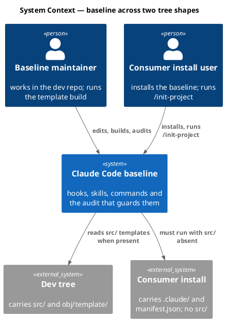

### C4 — Container

The units this spec touches and what flows between them.

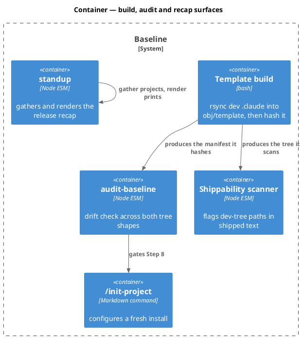

### C4 — Component (changed containers only)

The scanner and the build both gain a derived list. Everything else is a field or gate fix.

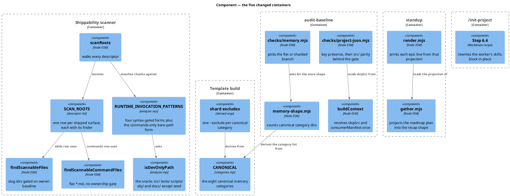

### Data model — class diagram

No database. These are the two in-memory shapes the derived oracles introduce, plus the recap projection whose field name D3 corrects.

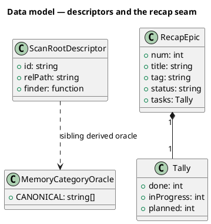

#### Migration DDL

```sql
-- No database in this system. Nothing here is persisted, so there is no
-- forward or reverse DDL and no field carries a <<new>> / <<changed>>
-- stereotype: a stereotype with no ALTER behind it would be a false signal.
```

No field is marked `<<changed>>` for the same reason. `RecapEpic.num` is an in-process projection key that `gather.mjs` already emits correctly; D3 corrects the reader, and the seam is asserted by the contract test in the Test plan rather than by a schema marker. `ScanRootDescriptor` is new code, not a new persisted entity.

### Behavior — sequence per AC

One sequence per acceptance criterion, grouped by defect with `==` dividers where a defect carries more than one criterion.

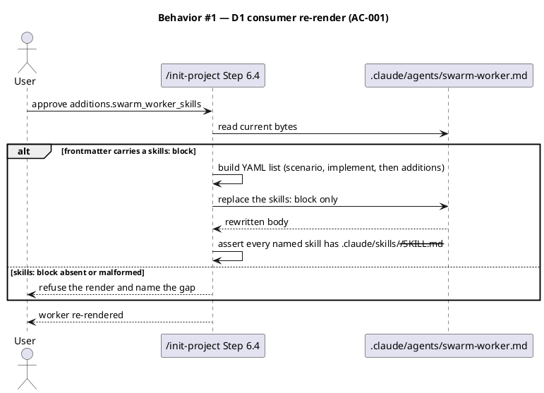

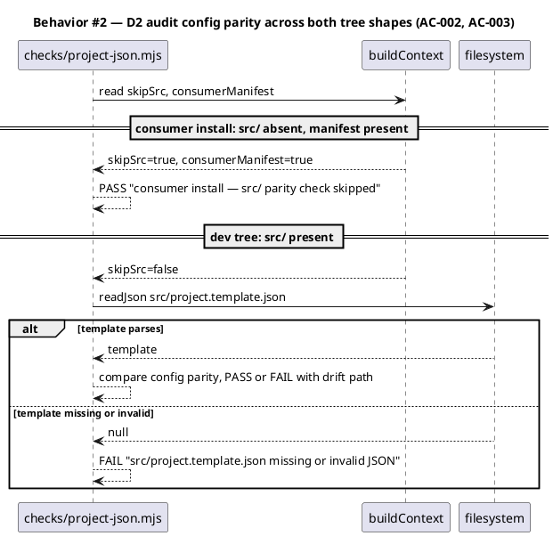

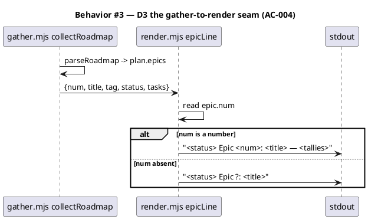

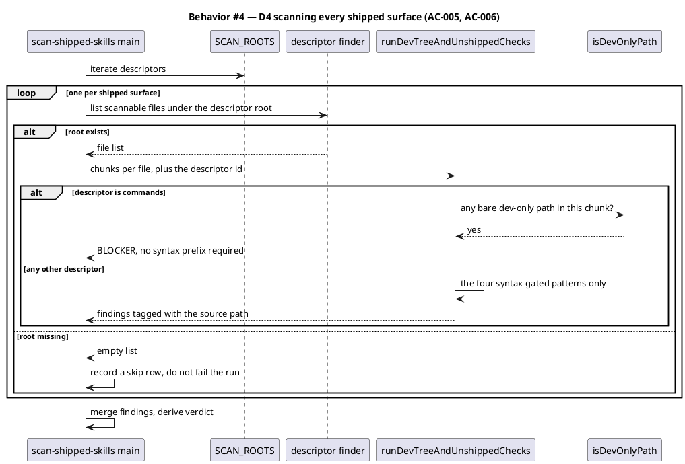

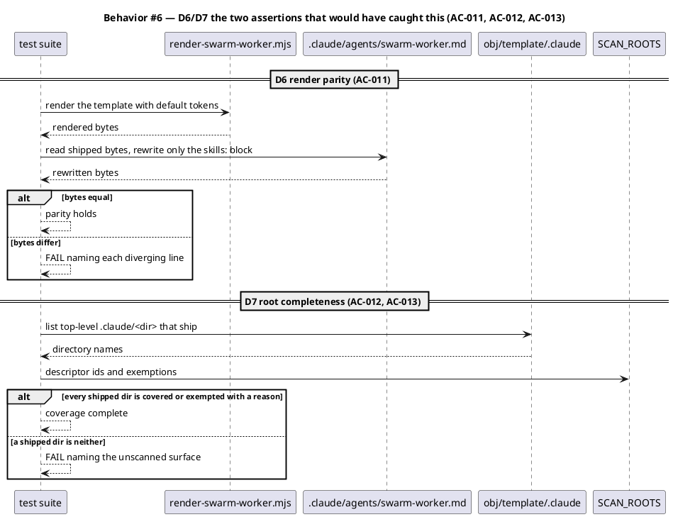

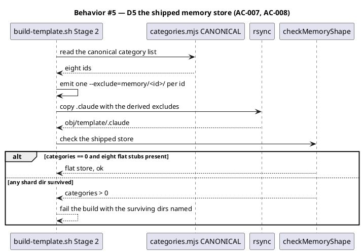

### State — core entity *(only if stateful)*

No non-trivial state machine. The audit verdict is a pure function of tree shape and disk contents; the scanner verdict is a pure function of its findings. The heading is kept so the choice is explicit.

### Dependencies — graph

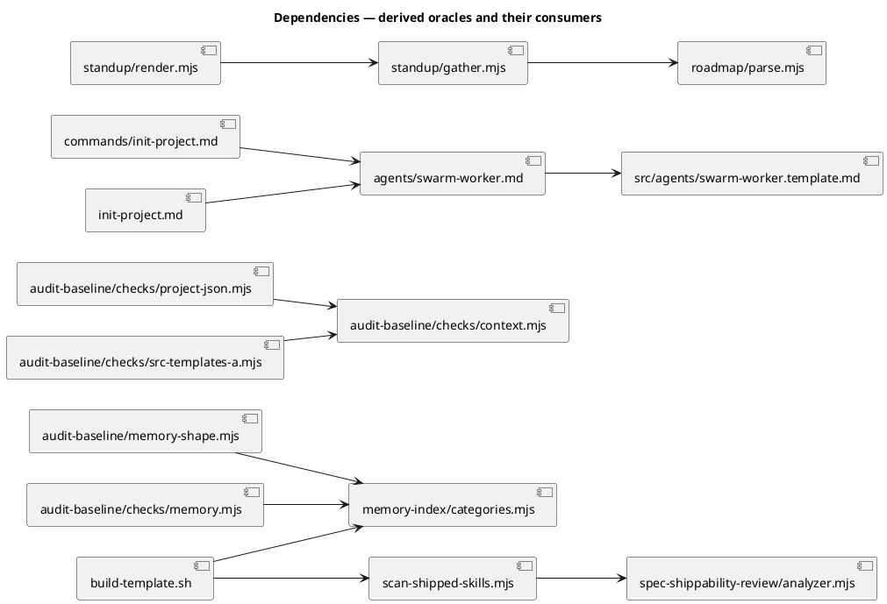

### Contracts

| Kind | Name | Input | Output | Errors | Idempotent |
|---|---|---|---|---|---|
| Function | `checkMemoryShape(memRoot)` | absolute memory dir | `{ok, categories, trails, missing}` | none — missing dirs are data | yes |
| Function | `epicLine(epic)` | `{num, title, tag, status, tasks}` | one recap line | absent `num` renders `Epic ?` | yes |
| Data | `SCAN_ROOTS` | — | `ScanRootDescriptor[]` | — | yes (frozen) |
| Function | `findScannableCommandFiles(root)` | commands dir | absolute `*.md` paths | missing root returns `[]` | yes |
| CLI | `scan-shipped-skills.mjs [--root <dir>]` | optional root override | report + exit 0/1/3 | exit 3 on a missing explicit root | yes |
| Shell | `build-template.sh` | dev tree | `obj/template/` + manifest | non-zero when a shard dir survives | yes |
| Check row | `project.json <-> template: config parity` | `ctx` | PASS/FAIL row | — | yes |
| Function | `runDevTreeAndUnshippedChecks(chunks, manifest, sourcePath, opts)` | `opts.strictDevPaths` opts a descriptor into the unprefixed form | findings array | — | yes |
| Data | `RUNTIME_INVOCATION_PATTERNS` | — | four syntax-gated forms, unchanged for non-command surfaces | — | yes (frozen) |

`runDevTreeAndUnshippedChecks` gains a fourth parameter rather than a fifth global pattern, because the strict form must apply per descriptor. Existing three-argument callers keep today's behavior — the parameter defaults to off, so no non-command surface changes verdict.

`--root` keeps its current meaning: it overrides the **skills** root, so existing callers and the `spec-shippability-review` adapter are unaffected. An explicit `--root` that does not exist still exits 3; a `SCAN_ROOTS` descriptor whose root is absent records a skip row instead, because a consumer tree legitimately lacks `obj/template/`.

### Libraries and versions

No third-party dependency is added or used. This repo is zero-runtime-dependency by constraint (`.claude/memory/constraints/zero-runtime-dependencies.md`), and every module here imports Node builtins only.

| Library@version | Purpose | Key APIs | Confirmed against current docs |
|---|---|---|---|
| `node@22 (builtin)` | file and path IO in the changed modules | `node:fs` `existsSync`/`statSync`/`readFileSync`, `node:fs/promises` `readdir`/`readFile`, `node:path` `join`/`resolve`/`relative` | yes — builtin, pinned by the repo's engines field |

### Alternatives considered

| Alt | Summary | Rejected because |
|---|---|---|
| A | Ship `swarm-worker.template.md` into the install and keep token substitution | Puts two copies of the worker body in every consumer tree. The user chose the in-place rewrite; render output is byte-identical either way. |
| B | Fix D5 by adding one more `--exclude='memory/constraints/'` line | Repairs this instance and leaves the failure mode. The ninth category would break it again — which is the drift `memory-shape.mjs:9-11` already warns about. |
| C | Fix D2 by making `readJson` tolerate a missing file | The sibling check already established `ctx.skipSrc` as the idiom. A tolerant reader would also mask a genuinely missing template in the dev tree, turning a real FAIL into a silent PASS. |
| D | Amend `seed.md` to sanction the D2 gate as an Article VIII change | Article VIII binds the 26 files under `.claude/hooks/`. `checks/project-json.mjs` is a skill file. The downstream session made this attribution; it does not hold. |
| E | Give D3's `render.mjs` a `epic.number ?? epic.num` fallback | Accepts both spellings forever and hides which one `gather` actually emits. The seam needs one name and a test that crosses it. |
| F | Apply the bare-dev-path pattern tree-wide at BLOCKER | Measured: 74 hits in 22 files, 28 in the constitution alone, nearly all descriptive prose. The build would abort on false findings until every one was rewritten. |
| G | Apply it tree-wide at ADVISORY instead | An advisory does not gate, so D1 ships again. The gate's whole value is that it aborts the build. |
| H | Detect the read verb ("Read the template at `…`") instead of scoping by surface | Measured at 2 tree-wide hits — it would catch D1 and miss the other 7 in D8, because they are phrased as bare references rather than imperatives. Scoping by surface is categorical; matching English is a guess. |
| I | Retire the swarm-worker template and make the rendered file canonical | Tempting, since the rendered file is the one that ships. But `/init-project` still needs a token form to substitute stack skills into, and the parity test makes drift loud. Retiring it trades a tested invariant for an untested one. |
| K | Leave `constraints` unshipped and correct AC-007 to assert the audit's seven | Cheapest — the audit is already green with seven. Rejected by the human: the baseline would ship a store its own category oracle calls incomplete, leaving two lists disagreeing for the next reader to trip over. That is the defect this batch exists to remove, not a state to settle in. |
| L | Ship `constraints.md` but leave `EXPECTED_MEMORY_FILES` hardcoded at seven | The flat branch flags any file outside its expected set, so the new stub would be reported `unexpected` — shipping the category would break the audit it is meant to satisfy. |
| J | Fix D8's 7 extra command references in a follow-up ticket | They are the same defect, in the same two files, found by the same scan. Leaving `/init-project-doctor` broken for consumers while shipping "consumer installs are fixed" would be the worse outcome. |

## Program design

### Data access

| Reader | Source | Access path | Written by |
|---|---|---|---|
| `build-template.sh` | `memory-index/categories.mjs → CANONICAL` | `node -e` one-shot read at build time | nothing — the oracle is source |
| `audit-baseline/memory-shape.mjs` | same oracle | static `import` | nothing — read-only |
| `checks/project-json.mjs` | `ctx.skipSrc`, `ctx.consumerManifest` | in-process `ctx` field read | `buildContext` |
| `checks/project-json.mjs` | `src/project.template.json` | `ctx.readJson`, dev tree only | the maintainer |
| `scan-shipped-skills.mjs` | `SCAN_ROOTS` | module-local frozen array | nothing — frozen at load |
| `analyzer.mjs` | `DEV_ONLY_PREFIXES` via `isDevOnlyPath` | in-process predicate call | nothing — the oracle both pattern paths ask |
| test suite | shipped `.claude/` top-level dirs | `readdir` over the built tree | `build-template.sh` |
| `standup/render.mjs` | `collectRoadmap` projection | in-process call argument | `standup/gather.mjs` |
| `/init-project` Step 6.4 | `.claude/agents/swarm-worker.md` | Read then Edit of the `skills:` block | `/init-project` itself |

`build-template.sh` reading the oracle through `node -e` is the load-bearing choice here: bash cannot import an ESM module, and duplicating the eight ids into the shell script is the exact defect being fixed.

### Call stack

```
scripts/build-template.sh (Stage 2)
  └─ node -e "import categories.mjs"        memory-index/categories.mjs
       └─ rsync --exclude per category      (derived argv)

node .claude/skills/spec-shippability-review/scan-shipped-skills.mjs
  └─ main(argv)
       └─ scanRoots(SCAN_ROOTS, manifest)
            ├─ findScannableFiles(skills)        owner: baseline gate
            ├─ findScannableCommandFiles(cmds)   flat *.md, no gate
            └─ runDevTreeAndUnshippedChecks      analyzer.mjs (IO boundary)
```

### Layout

```
.claude/commands/
  init-project.md                             changed   — Step 6.4 becomes an in-place skills: block rewrite; the src/cli/install.js reference in 5a goes too (D8)
  init-project-doctor.md                      changed   — six dev-only path references removed; the command must work on a consumer install (D8)
docs/init/
  seed.md                                     changed   — §4.2 and §13 Step 4/6.4 drop the consumer re-render-from-src claim
src/
  seed.template.md                            changed   — same edit; the mirror stays byte-equal
.claude/skills/audit-baseline/checks/
  project-json.mjs                            changed   — ctx.skipSrc gate around the template read
.claude/skills/audit-baseline/
  memory-shape.mjs                            changed   — header comment says eight, not seven
.claude/skills/standup/
  render.mjs                                  changed   — epicLine reads epic.num
  gather.mjs                                  unchanged surface — the emitter is already correct; listed because the contract test binds both ends
.claude/skills/spec-shippability-review/
  scan-shipped-skills.mjs                     changed   — SCAN_ROOTS descriptors + scanRoots + the commands finder
  analyzer.mjs                                changed   — opt-in strict dev-path form for command surfaces (D7)
src/agents/
  swarm-worker.template.md                    changed   — refreshed to match the rendered worker: swarm_merge.mjs, plus the line-31 concurrency instruction (D6)
src/memory/
  constraints.template.md                     new       — the eighth canonical category's pristine stub (D9)
.claude/skills/audit-baseline/
  expected-baseline.mjs                       changed   — EXPECTED_MEMORY_FILES derives from CANONICAL plus the three trails (D9)
  derive-counts.mjs                           changed   — CANONICAL_MEMORY imports the oracle; was a third copy stuck at seven (D9)
CLAUDE.md                                     changed   — orientation line: 7 memory files becomes 8 (D9)
src/CLAUDE.template.md                        changed   — same edit; the pair stays byte-equal (Article XII.4)
scripts/
  build-template.sh                           changed   — shard excludes derive from CANONICAL
tests/
  standup-render.test.mjs                     changed   — fixtures move to the shape gather emits
  standup-gather-render-contract.test.mjs     new       — pipes gather output into render; the seam test
  audit-consumer-install.test.mjs             new       — config parity and memory shape on a consumer-shaped tree
  shipped-commands-scan.test.mjs              new       — commands root, the strict dev-path form, and worker render parity
  build-template-memory-excludes.test.mjs     new       — derived excludes cover every canonical category
  shipped-scan-coverage.test.mjs              new       — every shipped .claude/<dir> is scanned or exempted with a reason (D7)
```

## Design calls

- *(none)*

The write set touches no path in `project.json → tdd.ui_globs`. No UI surface changes.

## System delta

| Verb | Element | Anchor | Concept | Kind |
|---|---|---|---|---|
| change | audit-baseline-checks | `.claude/skills/audit-baseline/checks/*.mjs` | constitution-chain | c4_component |
| change | audit-baseline-helpers | `.claude/skills/audit-baseline/*.mjs` | constitution-chain | c4_component |
| change | standup-helper | `.claude/skills/standup/*.mjs` | planning-release | c4_component |
| change | spec-review-helpers | `.claude/skills/spec-*/*.mjs` | review-fanout | c4_component |
| change | consent-commands | `.claude/commands/*.md` | consent-gates | c4_component |

`scripts/build-template.sh` carries no row: `scripts/` is not among `memory.architecture_map.governed_surface.roots`, so the corpus does not anchor it. `docs/init/seed.md` and `src/seed.template.md` carry no row either — `docs/` is ungoverned, and `src/*.template.md` is outside `src-templates`' `src/*.json` anchor.

## Acceptance criteria

| ID | Criterion (given / when / then) | Kind | Upstream AC | Sequence |
|---|---|---|---|---|
| AC-001 | given a consumer install with no `src/`, when `/init-project` Step 6.4 re-renders the worker with `additions.swarm_worker_skills`, then it rewrites only the `skills:` block of `.claude/agents/swarm-worker.md` and the result is byte-identical to substituting `{{SKILLS}}` in `src/agents/swarm-worker.template.md` with the same list | behavior | D1 | §Behavior #1 |
| AC-002 | given `src/` is absent and `.claude/manifest.json` is present, when the audit runs, then `project.json <-> template: config parity` reports PASS with the reason `consumer install (manifest present, src/ absent) — src/ checks skipped` and the run's `fails` count is 0 | behavior | D2 | §Behavior #2 |
| AC-003 | given `src/` is present but `src/project.template.json` is missing or unparseable, when the audit runs, then config parity still reports FAIL — the gate narrows by tree shape, never by file absence | behavior | D2 | §Behavior #2 |
| AC-004 | given a roadmap with epics numbered 1..N, when `standup/gather.mjs` output is passed to `standup/render.mjs`, then each rendered line carries its epic number and the string `undefined` appears nowhere in the recap | behavior | D3 | §Behavior #3 |
| AC-005 | given a shipped tree whose `.claude/commands/*.md` contains a runtime read of a path under `src/`, when the shippability scanner runs, then it reports a finding naming that command file | behavior | D4 | §Behavior #4 |
| AC-006 | given a `SCAN_ROOTS` descriptor whose root does not exist on disk, when the scanner runs, then it records a skip row for that descriptor and still returns the findings from every existing root | behavior | D4 | §Behavior #4 |
| AC-007 | given the dev tree's memory store is fully sharded, when `scripts/build-template.sh` runs, then `checkMemoryShape('obj/template/.claude/memory')` returns `categories: 0`, all eight canonical `<category>.md` stubs are present, and no file under `obj/template/.claude/memory/` carries a dev-repo fact body | behavior | D5 | §Behavior #5 |
| AC-008 | given a ninth category is appended to `memory-index/categories.mjs → CANONICAL`, when the build runs, then its shard directory is excluded too, with no edit to `scripts/build-template.sh` | behavior | D5 | §Behavior #5 |
| AC-009 | given the full change is applied and `npm run build` has regenerated `obj/template/.claude/manifest.json`, when `node .claude/skills/audit-baseline/audit.mjs` runs on the dev tree, then it exits 0 with no `hash mismatch` row | preflight | D2, D5 | §Behavior #2 |
| AC-010 | given a fixture tree shaped like a consumer install (`.claude/` and `.claude/manifest.json` present, `src/` and `obj/` absent), when the audit runs against it, then it exits 0 | smoke | D2, D5 | §Behavior #2 |
| AC-011 | given the swarm-worker template and the rendered worker, when the template is rendered with default tokens and the rendered worker's `skills:` block is rewritten with the same list, then the two byte-streams are identical | behavior | D6 | §Behavior #6 |
| AC-012 | given the built shipped tree, when the scanner's descriptor coverage is checked, then every top-level `.claude/<dir>` present in that tree either has a `SCAN_ROOTS` descriptor or an exemption carrying a written reason | behavior | D7 | §Behavior #6 |
| AC-013 | given a shipped `.claude/commands/*.md` naming a dev-only path with no `import`, no `node`/`bash` prefix and no leading `./`, when the scanner runs, then it emits a BLOCKER for that file | behavior | D7 | §Behavior #4 |
| AC-014 | given the same bare dev-only path inside a shipped SKILL.md or `.claude/CONSTITUTION.md`, when the scanner runs, then no new finding is emitted — the strict form applies to command surfaces only | behavior | D7 | §Behavior #4 |
| AC-015 | given the shipped tree after this change, when the scanner runs over `.claude/commands/**`, then it reports zero BLOCKERs — all 8 measured dev-only references are gone | smoke | D1, D8 | §Behavior #4 |
| AC-016 | given a category id is appended to `CANONICAL`, when the audit builds its expected memory roster, then that id is expected too, with no edit to `expected-baseline.mjs` | behavior | D9 | §Behavior #5 |
| AC-017 | given the built shipped tree, when its memory directory is listed, then `_discard-ledger.md` is absent — a dev-repo ledger of the same class as the three continuity trails | behavior | D9 | §Behavior #5 |
| AC-018 | given `EXPECTED_MEMORY_FILES` now derives 8 categories, when the derived-count surfaces are checked, then `CLAUDE.md` and its byte-equal mirror both read "8 memory files" | behavior | D9 | §Behavior #5 |

## Test plan

| Category | Scenario | Expected | Covers |
|---|---|---|---|
| Golden path | render a gather-produced recap for a 3-epic roadmap | each line carries its epic number; no `undefined` | AC-004 |
| Golden path | audit a fixture consumer tree | exit 0; config parity PASS with the consumer reason | AC-002, AC-010 |
| Golden path | build the template from a fully sharded dev store | `categories: 0`; eight flat stubs; no dev-repo fact bodies | AC-007 |
| Golden path | rewrite the worker's `skills:` block with two extra skills | output equals the token-substituted template render | AC-001 |
| Contract violation | dev tree with `src/project.template.json` deleted | config parity FAIL, not PASS | AC-003 |
| Contract violation | a command file containing `` `src/agents/swarm-worker.template.md` `` as a runtime read | scanner finding names the command file | AC-005 |
| Contract violation | worker file whose frontmatter has no `skills:` block | Step 6.4 refuses and names the gap | AC-001 |
| Input boundary | append a synthetic ninth category to `CANONICAL` | the derived exclude list covers it, build script untouched | AC-008 |
| Input boundary | append a synthetic ninth category to `CANONICAL` | the audit's expected memory roster covers it, `expected-baseline.mjs` untouched | AC-016 |
| Golden path | list the built shipped memory directory | 8 flat category stubs, 3 trails, no `_discard-ledger.md` | AC-007, AC-017 |
| Regression trap | the orientation count claim in the constitution and its mirror | both read 8, and stay byte-equal | AC-018 |
| Input boundary | `SCAN_ROOTS` descriptor pointing at a non-existent dir | skip row; findings from the surviving root still returned | AC-006 |
| Input boundary | roadmap epic with `num: 0` | renders `Epic 0`, not `Epic ?` — zero is a number, not absence | AC-004 |
| Failure mode | a shard dir survives the rsync | build exits non-zero and names the surviving dir | AC-007 |
| Concurrency / ordering | none — every changed path is a synchronous read or a single-writer build step | n/a | — |
| Regression trap | `--root <dir>` still overrides only the skills root | existing callers and the `spec-shippability-review` adapter unchanged | AC-006 |
| Golden path | render the template, rewrite the shipped worker's skills block, compare bytes | identical | AC-011 |
| Golden path | scan the shipped commands after the fix | zero BLOCKERs | AC-015 |
| Contract violation | a command naming `src/foo.mjs` with no prefix and no fence | BLOCKER naming that command | AC-013 |
| Regression trap | the same bare path inside a shipped SKILL.md | no new finding — the 74 tree-wide hits stay quiet | AC-014 |
| Regression trap | a new top-level dir added to the shipped tree with no descriptor | suite FAILs naming the unscanned surface | AC-012 |
| Regression trap | existing three-argument `runDevTreeAndUnshippedChecks` callers | verdicts unchanged | AC-014 |
| Regression trap | `src/agents/swarm-worker.template.md` render-parity in the dev repo | asserted, not assumed | AC-001, AC-011 |
| Regression trap | full suite plus `audit-baseline` after the manifest rebuild | green, no hash mismatch | AC-009 |

## Observability

| Signal | Name | Shape | Purpose |
|---|---|---|---|
| Log | audit check row | `project.json <-> template: config parity  PASS  consumer install …` | shows which branch the gate took, so a PASS is never ambiguous |
| Log | scanner skip row | `scan-shipped-skills: skipped <descriptor id> (missing <root>)` | a silently-unscanned surface is what caused D4; the skip must be visible |
| Log | scanner coverage line | `scan-shipped-skills: <n> descriptor(s), <m> exempt` | makes the gate's own reach auditable in build output, which is what nobody could see before |
| Log | build exclude echo | `build-template: excluding <n> canonical memory shard dirs` | proves the derived count matches `CANONICAL.length` in build output |
| Metric | `fails` / `warns` in the audit tail | counters | the exit-0 gate CI reads |
| Alarm | CI job failure on `audit-baseline` exit 1 | exit code, per push | blocks a release that re-breaks either tree shape |

## Rollout

### Prerequisites

| # | Prerequisite | enforced-by |
|---|---|---|
| 1 | `obj/template/.claude/manifest.json` is regenerated so every changed baseline-owned file hashes clean | AC-009 |
| 2 | A consumer-shaped tree passes the audit with exit 0 before release | AC-010 |
| 3 | The shipped commands carry no dev-only path reference, verified by the widened gate itself rather than by review | AC-015 |

- **Feature flag**: none. Four of five fixes correct a defect with no valid prior behavior to preserve, and a flag would keep the broken branch reachable. D1's amendment changes documented instructions, which a flag cannot gate.
- **Migration order**: 1 code + seed edits → 2 `npm run build` regenerates `obj/template/` and the manifest → 3 full suite → 4 `audit-baseline` on both tree shapes → 5 commit.
- **Canary**: none available — the baseline ships as a package, not a service. AC-010's fixture tree is the stand-in: it exercises the consumer shape in CI on every push.

## Rollback

- **Kill-switch**: `git revert` of the landing commit, then `npm run build` to restore the prior `obj/template/` and manifest. No flag, no data migration, nothing stateful to unwind.
- **Signal to roll back**: `audit-baseline` exits non-zero on the dev tree, or the shippability scanner's verdict turns BLOCKED on a file this spec did not touch. Both surface inside one CI run of the landing commit, well under 5 minutes.

## Archive plan

- Defaults *(automatic)*: spec, spec-rendered/, spec approval, security report (if `/security` runs).
- Extras *(list any non-default files)*:
  - *(none)*

## Open questions

- *(none. D1's render approach and D4's inclusion were settled before triage. The amendment's three forks — pattern scope, whether to retire the template, and whether D8's extra references land here — are recorded as rejected alternatives F–J with the measurements behind each.)*
