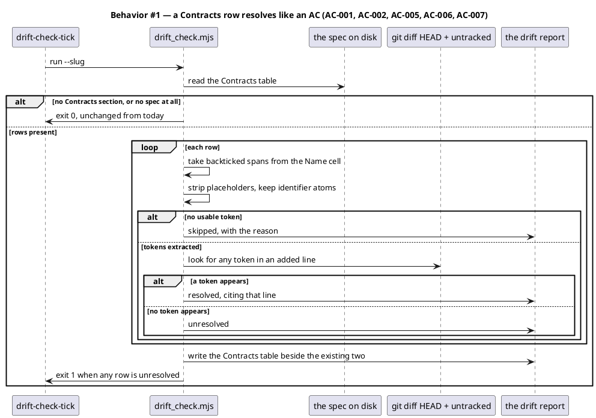
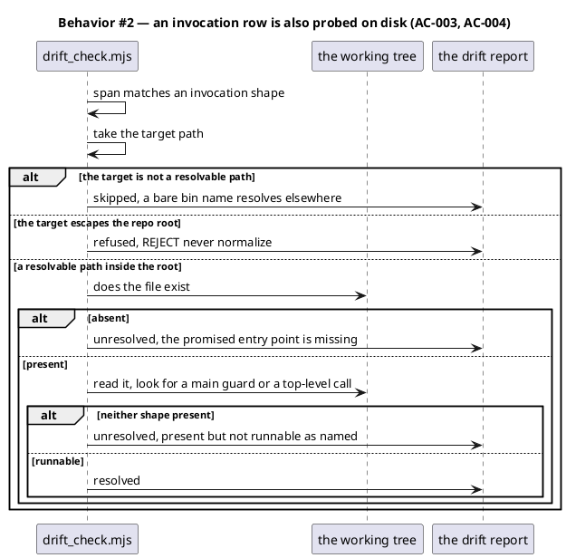
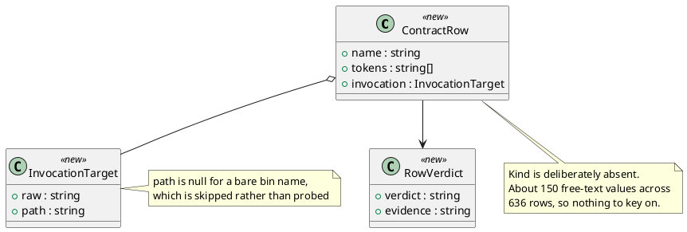
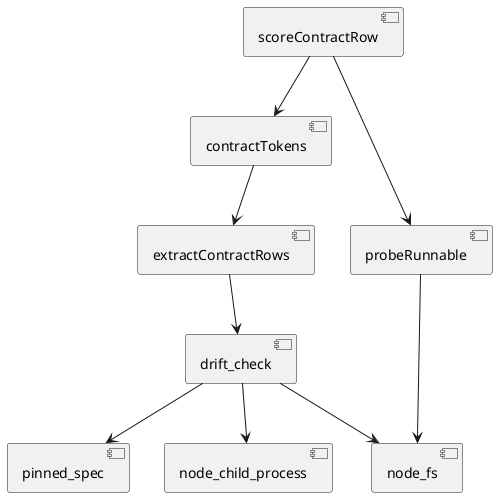

# Contracts rows resolve at drift-check

## Context

| Input | Path |
|---|---|
| Intake | *(excepted — `spec-entry` track; the defect record lives in `workflow.json → request`)* |
| BRD *(if any)* | *(none)* |
| Scout *(if any)* | *(excepted — the corpus measurements below are the scouting record)* |
| Research *(if any)* | *(excepted)* |

**Write set**: `.claude/skills/tdd/drift_check.mjs`, `tests/**` — non-architectural profile; every path matches `artifacts.diagram_profiles → non-architectural`.

A spec's `## Contracts` table is a set of promises and nothing reads it. `spec-lint` runs five checks (`plantuml_syntax`, `diagram_presence`, `ac_traceability`, `design_calls`, `system_delta`) and none touches the table. `drift_check` scores AC ids only. So a spec can commit to a function or a CLI that never ships and every machine gate stays green.

Demonstrated at `be0a351`. Its Contracts table pinned `node .claude/skills/workspace/restore-degraded-shards.mjs [--dry-run]`. That CLI did not exist, and the address contradicted the house `workspace/cli.mjs` front-door convention. `spec-lint` returned PASS on all five checks across **three** separate approvals of that spec. `drift_check` could not see it — no AC named the CLI. It was caught by `/integrate` reading the table against disk by hand, at the last phase before commit. CLAUDE.md VI.4's two-sided rule says YAGNI never authorizes deferring spec-committed scope, and no AC row carried a `deferred:` tag.

## Goal

A Contracts row is a promise that resolves against the landed diff by the end of TDD, exactly as an AC does. A spec that promises something the work never built fails drift-check instead of reaching commit.

## Non-goals

- **Checking a row's *address* against convention.** `be0a351`'s row named a real module at the wrong address. No diff scan and no disk probe can know that `workspace/cli.mjs` was the house front door; that judgement stayed with `/integrate` and stays there.
- **Catching a surface that shipped without being promised.** The check is one-directional: it finds a Contracts row with nothing behind it, never an export the table forgot to name. This spec's own first draft shipped `sweepArchivedSpecs` unpinned and the new check could not have flagged it — `/simplify`'s reuse-before-create pass and human review remain the only cover for that direction.
- **Constraining the `Kind` column.** D2 measures it as unusable and routes around it. Making it an enum is a migration across 102 archived specs and is not attempted here.
- **Executing a promised entry point.** The probe in D4 is static. Running a CLI to see whether it runs has side effects and would hang on anything interactive.
- **Absorbing `spec-lint`'s `add`-row tolerance problem.** D6 records why.

## Decisions

### D1 — enforcement lives at drift-check, not spec-lint

**Chosen.** A Contracts row resolves against the landed diff at the `drift-check-tick`, alongside AC ids.

A Contracts table describes what the work **will** build. At spec time none of it exists, so an existence assertion there fails every spec at authoring — which is why the naive "add a `contracts` check to spec-lint" cannot work. The obligation is structurally identical to an AC's: promised at Phase 4, owed by the end of Phase 6.

**This supersedes backlog `spec-contracts-rows-are-never-checked-against-reality`**, which proposed exactly that spec-lint check. That entry is the origin of this ticket and its proposed shape is wrong; recorded here so the two records do not contradict each other.

### D2 — resolution keys off the Name cell and never reads Kind

**Chosen.** The `Kind` column is never read.

**Measured across 636 rows in 102 of 104 specs** (`docs/archive/**/spec.md` + `docs/specs/*.md`). `Kind` is free text with ~150 distinct values:

| Value | Rows | Value | Rows |
|---|---:|---|---:|
| `CLI` | 126 | `Config` | 20 |
| `Function` | 72 | `Skill` | 18 |
| `Module` | 51 | `Hook` | 16 |
| `Fn` | 31 | `Node API` | 12 |
| `fn` | 30 | *(~140 more)* | 1–9 each |
| `File` | 29 | | |

`Function`, `Fn`, `fn`, `fn (export)`, `Hook fn` and `Helper` are one concept spelled six ways. The tail holds `GA4 event (auto)`, `Maker (workflow agent)`, `Spec table row`, and a backticked template path used *as* a Kind. There is no enum to switch on.

A checker keyed to `Kind` would be aimed at an axis with no schema — the failure this repo has now recorded seven times ([[a-checker-aimed-one-axis-off-passes-loudly]]).

### D3 — the token comes from backticked spans in the Name cell

**Chosen.** Extract every backticked span; strip bracketed placeholders; keep the identifier-shaped atoms.

**607 of 636 Name cells (95%) contain a backtick**, and the backticked span is where the machine-readable identifier lives. The rest of the cell is prose — measured examples include a call signature followed by "in `memory_stop.sh` heredoc", and another followed by an italic aside about an unchanged signature.

Stripping `<…>`, `[…]`, `{…}` and `(…)` is load-bearing: nothing in a diff will ever contain the literal placeholder text, and a call's argument list is not part of its name.

Measured yield over the full corpus:

| Outcome | Rows |
|---|---:|
| ≥ 1 token extracted | 598 |
| backtick present, no usable token | 9 |
| no backtick at all | 29 |

**Multiple rows may reduce to one token, and that is accepted.** Seven `npx create-baseline` rows differing only by flag all yield `create-baseline`, so one added line resolves all seven. Per-flag precision is lost. That is the under-reporting lean of D5 applied at the extractor.

### D4 — an invocation-shaped row is also probed for runnability on disk

**Chosen.** When a row's span is an invocation (`node <path> …`, `npx <bin> …`, `bash <path> …`, or a script path followed by a subcommand), the resolver additionally asserts the named path exists and is runnable as a main.

**This decision exists because the diff scan alone does not catch the motivating defect, and that was measured rather than assumed.** The original wrong row reduces to one token, the module path `.claude/skills/workspace/restore-degraded-shards.mjs`. That path matches **9 added lines** in `be0a351` — a test file holds it as a string constant, written at the scenario tick long before the CLI question arose. The row resolves. Green. A token match cannot distinguish *the module exists* from *the module is invocable*.

Runnability is detected statically, by the two shapes this repo actually uses. Measured over 345 modules under `.claude/` and `scripts/`:

| Shape | Modules |
|---|---:|
| main guard (`import.meta.url ===`, `process.argv[1]`, `require.main === module`) | 58 |
| top-level `dispatch(` / `main(` / `run(` | 24 |
| both | 0 |
| neither — a library | 263 |

The two shapes are disjoint, so their union is the detector. Validated on four controls:

| Target | Verdict | Expected |
|---|---|---|
| `restore-degraded-shards.mjs` (the wrong row's target) | NOT RUNNABLE | catches the defect |
| `workspace/cli.mjs` (the corrected row's target) | runnable | no false positive |
| `hooks/git_commit_guard.mjs` | runnable | no false positive |
| `workspace/shards.mjs` (a library) | NOT RUNNABLE | never probed — not invocation-shaped |

120 of 636 rows (19%) are invocation-shaped and reach this probe. A target that is not a resolvable path — a bare bin name resolved through `package.json → bin` — is **skipped**, not failed, per D5.

### D5 — the design under-reports, deliberately

**Chosen.** Every ambiguity resolves toward silence. A row that cannot be checked gets its own `skipped` verdict and never contributes to the exit code.

`drift_check` gates every spec-track workflow's TDD phase. A missed promise costs one review cycle. A false positive halts a workflow that has done nothing wrong, on the oracle every spec track passes through. The two costs are not symmetric.

Concretely, `skipped` (never `unresolved`) covers: a row with no backticked span; a row whose span yields no usable token; an invocation whose target is not a resolvable path. The report names each so "nobody promised anything checkable" and "a promise was broken" can never be read as the same thing.

### D7 — the corpus sweep excludes epic specs, and counts what it excluded

**Chosen.** `sweepArchivedSpecs` skips any archived spec carrying a `## Slice` heading and returns `epicsSkipped` alongside its results.

**Discovered at implementation, not designed.** The sweep failed on its first live run with 8 unresolved rows out of 516 — every one of them from `docs/archive/2026-08-07/system-spec-delta/spec.md`, which carries six slice headings.

That is not a resolver false positive. The `epic` track has no implementation phases: its commit carries the sliced spec and nothing else, and each slice's promises land later in its own `epic-child` commit. Scoring an epic against its own landing commit measures the track's shape rather than the resolver. Confirmed by counting slice headings, not inferred from the offender names.

| | rows | unresolved | epics excluded |
|---|---:|---:|---:|
| before | 516 | 8 (1.6%) | 0 |
| after | 483 | 0 | 5 |

**The exclusion is counted rather than dropped.** A sweep that silently skipped five specs would read as "everything passed" while covering less every time an epic lands — the silent-cap failure this repo has a standing rule against. AC-010 pins the count against the live number of sliced specs, so the exclusion is derived and cannot widen unnoticed.

### D6 — this ticket does not absorb the `add`-row tolerance problem

**Chosen.** Backlog `spec-lint-add-row-check-requires-the-file-to-exist` stays open and separate.

The retrospective note that the two "want solving together" was wrong on inspection. That entry is about `spec-lint`'s `system_delta` check calling `governedFiles()` and mis-reporting an `add` row whose file does not exist yet. Its home is `spec-lint`, its data is the System delta table, and its fix is a message and a tolerance — no shared code, no shared table, no shared phase with this ticket. Bundling them would put two unrelated changes behind one approval.

## Design

Diagrams are the contract. Prose is only for what a diagram cannot say.

### Structure

`@ref element:tdd-helpers`

### Behavior





### Data model



No migration DDL. These records live only for the duration of one `drift_check` run and are never persisted; the report is the only output.

### State — core entity *(only if stateful)*

No state machine. Resolution is a pure function of the spec text, the diff and the working tree. The heading is kept so the choice is visible.

### Dependencies — graph



## Program design

### Layout

```
.claude/skills/tdd/
  drift_check.mjs                     changed   — extractContractRows + contractTokens + probeRunnable + scoreContractRow
tests/
  drift-check-contracts.test.mjs      new       — extraction, scoring, the probe, and the corpus-wide false-positive guard
```

### Contracts

| Kind | Name | Input | Output | Errors | Idempotent |
|---|---|---|---|---|---|
| Function | `extractContractRows(specText)` | a spec's full text | one record per Contracts row, carrying name, tokens and any invocation target; empty when the section is absent | never throws; a malformed table yields an empty list | yes |
| Function | `contractTokens(nameCell)` | the raw Name cell | the identifier atoms from its backticked spans, placeholders stripped | never throws; no backtick yields an empty list | yes |
| Function | `probeRunnable(rootDir, relPath)` | the repo root and a repo-relative path from a Contracts row | one of runnable, absent, not-runnable, or refused | throws on nothing; a path escaping `rootDir` reads refused, an unreadable file reads not-runnable | yes |
| Function | `scoreContractRow(row, diffAdded, rootDir)` | one row, the added lines, the repo root | a verdict of resolved, unresolved or skipped, plus its evidence | never throws | yes |
| Function | `sweepArchivedSpecs(rootDir)` | the repo root | `{rows, epicsSkipped, unresolved}`, or `{skipped: 'no archive', rows: 0, unresolved: []}` when the tree carries no archive | never throws; an unreadable spec is skipped, not fatal | yes |

`probeRunnable` reads the file and never executes it. Running a promised entry point to see whether it runs has side effects, and an interactive one would hang the gate.

**The probe's path comes from authored spec content, so it is confined to the repo.** A Contracts row is written by whoever writes the spec, and a row naming `../../../../etc/passwd` would otherwise have the probe open it and report one bit about its contents. The path is resolved against `rootDir` and anything escaping it reads `refused` — REJECT, never normalize, matching `assertNoTraversal` in `workspace/tree.mjs`. `refused` is reported like `skipped` and never contributes to the exit code, because a malformed row is an authoring error rather than a broken promise.

### Libraries and versions

| Library | Version | Why |
|---|---|---|
| *(none — `node:fs` and `node:child_process` only)* | — | `drift_check.mjs` takes no dependency today and takes none here |

## Design calls

- *(none)*

The write set touches no path in `project.json → tdd.ui_globs`.

## System delta

| Verb | Element | Anchor | Concept | Kind |
|---|---|---|---|---|
| change | tdd-helpers | `.claude/skills/tdd/*.mjs` | tdd-verification | c4_component |

`tests/` is excluded by `excludedSegments`, so it carries no row.

**The optimization pass reports `spec-review-helpers` as undeclared; it is a false positive and no row is added.** That element anchors `.claude/skills/spec-*/*.mjs`, and neither write_set path matches it — verified by testing both paths against the glob rather than reading the advisory. The spec discusses `spec-lint` at length because D1 explains why enforcement does *not* live there, and the pass appears to be reading those prose mentions as touches. Declaring a delta row for an element this work never opens would be a false entry in the standing model, which is worse than an unactioned advisory.

## Acceptance criteria

| ID | Criterion (given / when / then) | Kind | Upstream AC | Sequence |
|---|---|---|---|---|
| AC-001 | given a Contracts row whose Name cell holds a backticked identifier, when a token from it appears in an added diff line, then the row is reported resolved citing that line | behavior | D3 | §Behavior #1 |
| AC-002 | given a Contracts row whose tokens appear in no added line, when drift-check runs, then the row is unresolved and the exit status is 1 | behavior | D3 | §Behavior #1 |
| AC-003 | given a row whose span is an invocation and the target exists but declares neither a main guard nor a top-level call, when drift-check runs, then the row is unresolved and names the path as present but not runnable | behavior | D4 | §Behavior #2 |
| AC-004 | given a row whose span is an invocation and the target declares a main guard or a top-level call, when drift-check runs, then the probe reports resolved | behavior | D4 | §Behavior #2 |
| AC-005 | given a row with no backticked span, or one yielding no usable token, or an invocation whose target is not a resolvable path, when drift-check runs, then the row is skipped and the exit status is unaffected | behavior | D5 | §Behavior #1 |
| AC-009 | given an invocation row whose target escapes the repo root, when the probe runs, then it reads refused without opening the file, and the exit status is unaffected | behavior | D4 | §Behavior #2 |
| AC-006 | given a spec with no Contracts section, or a chore-track workflow with no spec, when drift-check runs, then it exits 0 exactly as today | regression | D5 | §Behavior #1 |
| AC-007 | given the report, when it is written, then a Contracts table names every row with its verdict and evidence, and the existing AC and Design-calls tables keep their shape | behavior | D1 | §Behavior #1 |
| AC-008 | given every non-epic archived spec the tree carries, when each one's Contracts rows are scored against the commit that landed it, then no row reports unresolved, and the sweep skips with a named reason when no archive is present | preflight | D5 | §Behavior #1 |
| AC-010 | given the corpus sweep, when it excludes epic specs, then it reports how many it excluded, and that count equals the number of archived specs carrying a `## Slice` heading | preflight | D7 | §Behavior #1 |

## Test plan

| Category | Scenario | Expected | Covers |
|---|---|---|---|
| Golden path | a token appears in an added line | resolved, citing that line | AC-001 |
| Golden path | an invocation target with a top-level dispatch call | resolved | AC-004 |
| Failure mode | a token appears nowhere | unresolved, exit 1 | AC-002 |
| Failure mode | an invocation target present but library-shaped | unresolved, names it not runnable | AC-003 |
| Failure mode | an invocation target absent from disk | unresolved, names it missing | AC-003 |
| Input boundary | a Name cell with no backtick | skipped | AC-005 |
| Input boundary | a span that is only a placeholder | skipped | AC-005 |
| Input boundary | a bare bin name rather than a path | skipped, not probed | AC-005 |
| Contract violation | an invocation target escaping the repo root | refused before any read, exit unaffected | AC-009 |
| Regression trap | a spec with no Contracts section | exit 0 | AC-006 |
| Regression trap | a chore-track run with no spec | exit 0, no spec skipped | AC-006 |
| Regression trap | AC and Design-calls tables after the change | shape unchanged | AC-007 |
| Regression trap | every non-epic archived spec scored against its own landing commit | zero false unresolved | AC-008 |
| Regression trap | a tree with no `docs/archive/` | the sweep skips with a named reason, never fails | AC-008 |
| Regression trap | the epic-exclusion count against the live count of sliced specs | equal, so the exclusion cannot widen unnoticed | AC-010 |

## Observability

| Signal | Name | Shape | Purpose |
|---|---|---|---|
| Report | contracts row verdict | resolved / unresolved / skipped, plus evidence | makes a broken promise auditable against the diff rather than trusted |
| Report | skipped reason | no token, or bare bin name | separates unenforceable from unbroken, so silence is legible |
| Metric | unresolved contract rows | integer, asserted zero by AC-008 over whatever the archive holds | the number that was structurally invisible until now |

## Rollout

### Prerequisites

| # | Prerequisite | enforced-by |
|---|---|---|
| 1 | Zero false unresolved across every non-epic archived spec the tree carries | AC-008 |
| 2 | The epic exclusion is reported and matches the live count of sliced specs | AC-010 |

- **Feature flag**: none. The check adds a report section and can only add unresolved rows, which the exit code already gates.
- **Migration order**: 1 extraction, 2 diff scoring, 3 the disk probe, 4 the report section, 5 the corpus-wide false-positive sweep.
- **Canary**: this ticket's own drift tick. The spec carries four Contracts rows, and the new code scores them during this workflow's own Phase 6 — the dogfood run happens before `/simplify` and a false positive there is visible immediately.

  It is deliberately NOT a Prerequisite row. A prerequisite must name an AC that enforces it, and an AC resolves only when its id appears in an added diff line; an observation about the tool's own run at a later phase can never satisfy that. The previous cycle wrote exactly such a row as `AC-008`, `drift_check` reported it unresolved, and it was moved to Rollout. Recording the reason here so the next author does not re-file it as an AC.

## Rollback

- **Kill-switch**: `git revert` of the landing commit. The change is additive to one module and one report section; nothing else reads the new verdicts.
- **Signal to roll back**: a workflow yields at drift-check on a Contracts row that is demonstrably built. One false positive is the rollback trigger, because the whole design is weighted against producing any.

## Archive plan

- Defaults *(automatic)*: spec, spec-rendered/, spec approval, security report if `/security` runs.
- Extras *(list any non-default files)*:
  - *(none)*

## Open questions

- **Should a deliberately-deferred Contracts row carry a tag?** The AC table has `deferred: dependency|risk|cost|human-directed` (CLAUDE.md VI.4). No Contracts row in 636 has ever needed one, and inventing an escape hatch before a real case exists is speculation the spec would have to justify. Left unbuilt: an author who genuinely must defer a row can delete it and record the reason in the AC table, which is already enforced. Revisit at the first real instance.
