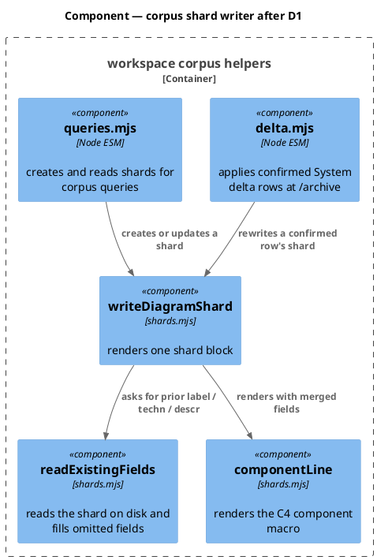
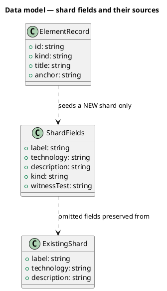
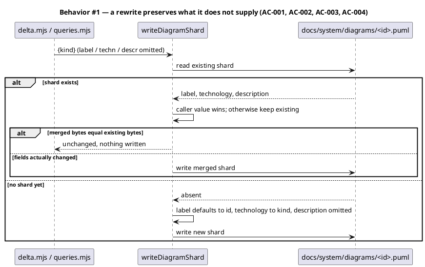
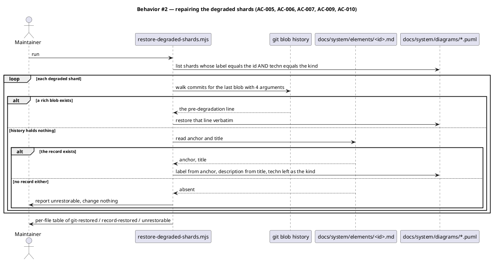
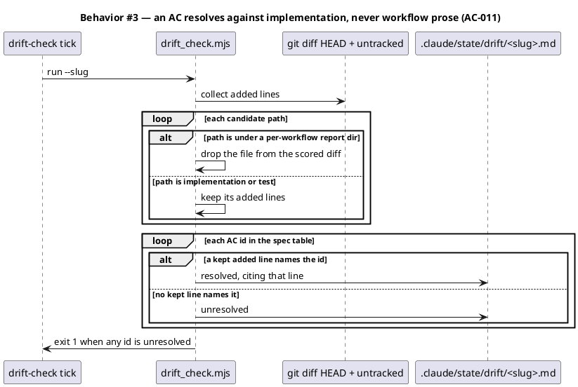
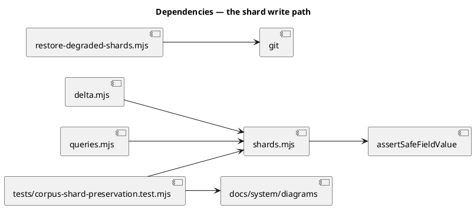

# Diagram shard rewrite loses anchor, techn and title

## Context

| Input | Path |
|---|---|
| Intake | *(excepted — `spec-entry` track; the defect record lives in `workflow.json → request`)* |
| BRD *(if any)* | *(none)* |
| Scout *(if any)* | *(excepted — the reproduction below is the scouting record)* |
| Research *(if any)* | *(excepted)* |

**Write set**: `.claude/skills/workspace/shards.mjs`, `.claude/skills/workspace/delta.mjs`, `.claude/skills/workspace/queries.mjs`, `.claude/skills/tdd/drift_check.mjs`, `docs/system/diagrams/*.puml`, `tests/**` — non-architectural profile; every path matches `artifacts.diagram_profiles → non-architectural`.

### The defect

`writeDiagramShard` renders a C4 component line from three optional fields. `componentLine` (`shards.mjs:76`) builds `[section, label, technology]` and appends `description` only when it is non-null. Both callers under-supply:

| Caller | Passes | Omits |
|---|---|---|
| `delta.mjs:256` — the `/archive` delta-apply path | `kind`, `rootDir` | `label`, `technology`, `description` |
| `queries.mjs:327` | `kind`, `label`, `rootDir` | `technology`, `description` |

With nothing supplied, `label` falls back to the element id and `technology` defaults to `kind`, so a rewrite collapses the line:

```
- Component(audit_baseline_checks, ".claude/skills/audit-baseline/checks/*.mjs", "subsystem", "Per-surface baseline audit checks")
+ Component(audit_baseline_checks, "audit-baseline-checks", "c4_component")
```

Three facts are destroyed per rewrite: the **anchor path**, the C4 **techn** value, and the human **title**.

### Scale, and why it went unnoticed

| Measure | Count |
|---|---|
| Diagrams in `docs/system/diagrams/` | 116 |
| Still carrying the rich four-argument form | 85 |
| Degraded, committed | 17 |
| Degraded, uncommitted (the live reproduction) | 2 |

It is not a schema migration — the rich form is the majority and the degraded set has no other property in common. It is not a one-off either: commit `0d8e776` (2026-08-09) degraded `audit-baseline-helpers.puml` and `document-helpers.puml` through the same path, one workflow earlier. Each affected workflow silently converts the diagrams of whichever elements its `## System delta` happened to name, so the damage accretes a few files at a time and never announces itself.

`workspace-corpus.puml` is among the 17. The element that anchors the buggy writer has been degraded by the bug.

### What is recoverable, and from where

This is the fact that decides the repair, so it was verified rather than assumed:

```
$ git show 0d8e776^:docs/system/diagrams/audit-baseline-helpers.puml
Component(audit_baseline_helpers, ".claude/skills/audit-baseline/*.mjs", "subsystem", "Baseline drift audit")
```

Git history returns the pre-degradation line intact, `"subsystem"` included. That matters because the element records under `docs/system/elements/` carry only `id`, `kind`, `title` and `anchor` — they can restore the label and the description but **not** the techn. `shards.mjs:68-74` records why: 51 shards declare `subsystem` in the techn slot while their element record reads `kind: component`, and "that distinction exists nowhere else on disk." A restore driven from element records would quietly rewrite techn to the kind on every one of them, which is the same data loss committed a second time under the banner of a repair.

## Goal

A shard rewrite preserves every field the shard already carried, the 17 committed degradations are restored from git history, and a regression to the three-argument form fails the suite instead of accumulating.

## Non-goals

- Changing the C4 rendering itself, the `!startsub`/`!endsub` block shape, or the `' @kind` / `' @witness` annotation lines.
- Reworking `verifyAndApplyDelta`'s verification semantics. Which rows are confirmed is correct; only what the writer does with a confirmed row is wrong.
- Backfilling techn for shards that never had one. The repair restores what was destroyed, and adds nothing.
- Touching the two `queries.mjs` behaviours beyond the field pass-through — its `label` argument stays caller-supplied.
- Retiring the `technology` default. Decision D3 keeps it and explains why.

## Decisions

Recorded here rather than asked at the gate: these are engineering calls with a defensible answer, and the reviewer reads them at gate A alongside the ACs (`owner: engineer`).

### D1 — the writer preserves; the callers stay thin

**Chosen.** `writeDiagramShard` reads the existing shard before writing. For any of `label` / `technology` / `description` the caller does not supply, it keeps the value already on disk. A rewrite that would produce bytes identical to the existing shard writes nothing.

**Rejected: make both callers pass all three.** It fixes today's two callers and leaves the trap armed for the third. The failure mode is silent — an omitted argument still produces a valid shard — so the next caller inherits the same defect. Putting preservation in the writer means a caller can only ever *add* information.

**Rejected: refuse to write when fields are missing.** Correct in principle, but `queries.mjs` legitimately creates *new* shards where there is nothing to preserve. A hard refusal would need a separate create path, which is more surface for no gain.

### D2 — git history first; element records only where there is nothing to destroy

**Chosen.** Restore from the last commit whose blob carries the rich form. Where a degraded shard has **no** rich blob anywhere in history — it was committed already-degraded, so git holds nothing — fall back to its element record: label takes the record's `anchor`, description takes its `title`, and **techn is left as the kind**.

**Rejected: element records as the primary source.** They can reach label and description but not techn, so driving every restore from them would rewrite `subsystem` to the kind on the 51 shards that carry it. The blast radius is worse than the damage.

**Amended during implementation.** The rejection above was written as a blanket rule, and that was too broad. It protects a techn value that already exists; a shard that was never rich has none, so the record is strictly *additive* there — it supplies an anchor and a title where the file has neither, and leaves the techn slot exactly as found. Three shards are in that state (`graph-document-schema`, `memory-sync-helpers`, `roadmap-cli`, one commit each), and all three have a record carrying both fields. Without this fallback AC-006 and AC-007 contradict each other: one says leave them, the other says none may remain.

The ordering stays load-bearing. Git is tried first for every candidate, and the record is reached only after history is exhausted — so a shard with any rich blob is never restored from a source that cannot carry its techn.

### D4 — a candidate is matched by fingerprint, not by argument count

**Chosen.** A shard is degraded when its label equals the element id **and** its techn equals its kind — the two slots the writer falls back to. Three arguments alone is not the signal.

**Discovered at implementation, not designed.** The first detector matched the argument count and produced 24 candidates. Two of them, `pinned-spec-lib` (`"Pinned spec resolver"`) and `system-reconcile-report` (`".claude/skills/system-reconcile/*.mjs"`), carry real labels and simply have no description — which is precisely what D3 says a legitimately-new shard looks like. Counting arguments would have reported healthy shards as damaged, and a repair report nobody can trust is a repair nobody runs.

### D5 — an AC resolves against implementation and test, never against workflow prose

**Chosen.** `drift_check`'s `EXCLUDED_DIFF_PREFIXES` grows from three entries to ten, covering every per-workflow REPORT directory: `docs/{specs,archive,intake,scout,research,brief,security,rca,audits}/` and `.claude/state/`.

**Found by this ticket's own drift tick.** AC-001 and AC-006 came back `resolved`, citing added lines in `docs/audits/swarm-first-production-run-2026-08-09.md` — an untracked report from an earlier session that merely discusses those ids. Both ACs do have real coverage, so the verdicts were right by accident; a third AC with no coverage at all would have passed identically.

The module already states the rule it failed to enforce: "An AC id resolves only when it appears in an IMPLEMENTATION or TEST added-line." The existing three exclusions were added one incident at a time — spec prose, then archived specs, then the checker's own report. This generalizes rather than adding a fourth: a directory holding reports *about* workflows is never the implementation *of* one. `docs/{system,references,runbooks}/` stay scored, because those can legitimately be a docs ticket's deliverable.

The narrower fix — excluding only `docs/audits/` — was rejected. It leaves `docs/rca/`, `docs/security/` and the four upstream artifact directories as live false-evidence sources, and each would surface as its own incident later.

### D3 — `technology` keeps defaulting to `kind`

**Chosen.** Leave the default. With D1 in place the default only applies when creating a genuinely new shard, where there is no prior value to preserve and `kind` is the honest answer.

The default is what made the loss silent, so removing it is tempting. But the loss came from *rewrites*, and D1 removes rewrites from the default's reach entirely. Making it throw would break new-shard creation for a fault that no longer exists there.

## Design

Diagrams are the contract. Prose is only for things a diagram cannot say.

The standing model already holds the writer: `@ref element:workspace-corpus`. The component diagram below is drawn rather than referenced because this spec changes that component's internals — it adds a read-before-write step the element does not currently describe.

### C4 — Component (changed containers only)



### Data model — class diagram



#### Migration DDL

```sql
-- No database. The repair rewrites 17 files under docs/system/diagrams/;
-- every restored byte comes from a git blob, so there is no forward or
-- reverse DDL and no field is reconstructed.
```

`ElementRecord` seeds only a new shard, and deliberately carries no `technology`: it has none to give, which is exactly why D2 rejects it as a repair source.

### Behavior — sequence per AC







### State — core entity *(only if stateful)*

No state machine. A shard is a pure function of its fields, and the repair is a one-shot transformation over files. The heading is kept so the choice is visible.

### Dependencies — graph



### Contracts

| Kind | Name | Input | Output | Errors | Idempotent |
|---|---|---|---|---|---|
| Function | `writeDiagramShard(dir, id, opts)` | `opts` may omit `label` / `technology` / `description` | the shard path, or a no-write signal when bytes are unchanged | throws on a missing `kind`, or a `"` in any field | yes — second call writes nothing |
| Function | `readExistingFields(dir, id)` | corpus dir + element id | `{label, technology, description}` or `null` when absent | never throws; an unparseable shard returns `null` | yes |
| Function | `restoreDegradedShards({rootDir, specDir, dryRun})` | `specDir` defaults to `<rootDir>/docs/system` | `{restored: [{path, content, sha}], recordRestored: [{path, content}], unrestorable: [path]}` | never throws; a git failure degrades to the record path | yes — a restored shard is no longer a candidate |
| CLI | `node .claude/skills/workspace/cli.mjs restore-shards [--dry-run] [--root] [--spec-dir]` | — | per-file table of git-restored / record-restored / unrestorable | `EXIT_NOT_FOUND` when any file is unrestorable; `--all` and any positional refused | yes — a restored shard is no longer degraded |

`readExistingFields` returning `null` on an unparseable shard is deliberate: preservation is best-effort, and a shard nobody can parse must not block a legitimate write.

**The CLI row was re-pointed at `/integrate` (D6).** It originally pinned a standalone `node .claude/skills/workspace/restore-degraded-shards.mjs`, and that address was wrong: `cli.mjs` is the corpus front door, and its own comment on the three existing writers states the rule — they "sit beside the reads rather than in a separate dispatcher because they answer about the same corpus; what separates them is the W-1..W-5 contract they run through, not their address." A repair answers about the same corpus. Landing it as a subcommand also subjects it to the shared writer contract automatically: it joins `WRITE_PATHS` in `tests/cli-writer-contract.test.mjs`, so W-2 (the flag gate precedes the write) and W-3 (one invocation writes one thing) bind it without a line of bespoke test code. `specDir` was added to the function signature so `--spec-dir` is honoured rather than silently ignored, which is what lets the shared table drive it at all.

### Libraries and versions

No third-party dependency is added. This repo is zero-runtime-dependency by constraint (`.claude/memory/constraints/zero-runtime-dependencies.md`).

| Library@version | Purpose | Key APIs | Confirmed against current docs |
|---|---|---|---|
| `node@22 (builtin)` | file IO and the git subprocess | `node:fs` `readFileSync`/`writeFileSync`/`existsSync`, `node:child_process` `execFileSync` | yes — builtin, pinned by the repo's engines field |

### Alternatives considered

| Alt | Summary | Rejected because |
|---|---|---|
| A | Fix the two callers; leave the writer alone | Leaves the trap armed for the third caller, and the failure is silent |
| B | Repair from element records | Cannot reach techn; would destroy the `subsystem` value on 51 shards |
| C | Make `technology` throw when omitted | Breaks legitimate new-shard creation for a fault D1 already removes |
| D | Hand-restore the 17 | 17 files of hand-copied macro arguments, unreviewable and unrepeatable |
| E | Leave the 17 and fix only forward | The corpus keeps 17 elements with no anchor and no title, and nothing would ever restore them |

## Program design

### Data access

| Reader | Source | Access path | Written by |
|---|---|---|---|
| `writeDiagramShard` | the existing `<id>.puml` | `readFileSync` via `readExistingFields` | itself |
| `restore-degraded-shards.mjs` | git blob history | `execFileSync('git', ['log'/'show'])` | nothing — read-only on history |
| `tests/corpus-shard-preservation.test.mjs` | `docs/system/diagrams/*.puml` | `readdirSync` + `readFileSync` | the writer and the repair |

### Call stack

```
verifyAndApplyDelta                       delta.mjs
  └─ writeDiagramShard(dir, id, {kind})   shards.mjs
       ├─ readExistingFields              shards.mjs   (new)
       ├─ requireKind / quotedArgument    shards.mjs
       └─ componentLine                   shards.mjs   (IO boundary: writeFileSync)
```

### Layout

```
.claude/skills/workspace/
  shards.mjs                          changed   — readExistingFields + merge + no-op-on-identical
  delta.mjs                           unchanged surface — listed because its call site is the reproduction
  queries.mjs                         unchanged surface — its omissions are now preserved by the writer
  restore-degraded-shards.mjs         new       — one-shot repair driven from git history
  queries.mjs                         changed   — `restoreShards` handler (the 4th corpus writer)
  cli.mjs                             changed   — `restore-shards` subcommand wired
docs/system/diagrams/
  <17 files>                          changed   — restored from their last rich blob
  audit-baseline-checks.puml          changed   — the live reproduction, restored
  consent-commands.puml               changed   — the live reproduction, restored
.claude/skills/tdd/
  drift_check.mjs                     changed   — EXCLUDED_DIFF_PREFIXES covers every per-workflow report dir
tests/
  corpus-shard-preservation.test.mjs  new       — preservation, no-op, and the corpus-wide regression assertion
  restore-degraded-shards.test.mjs    new       — git-first restore, record fallback, unrestorable, fingerprint
  drift-check-working-tree-diff.test.mjs  changed — an AC id in workflow prose no longer resolves
  cli-writer-contract.test.mjs        changed   — restore-shards joins WRITE_PATHS; 3 front-door cases
```

`delta.mjs` and `queries.mjs` appear with no change because D1 puts preservation in the writer. Listing them makes that deliberate rather than an omission a reviewer has to infer.

## Design calls

- *(none)*

The write set touches no path in `project.json → tdd.ui_globs`.

## System delta

| Verb | Element | Anchor | Concept | Kind |
|---|---|---|---|---|
| change | workspace-corpus | `.claude/skills/workspace/*.mjs` | memory-model | c4_component |
| change | tdd-helpers | `.claude/skills/tdd/*.mjs` | tdd-verification | c4_component |

`docs/system/diagrams/` carries no row: `docs/` is not among `memory.architecture_map.governed_surface.roots`, so the diagrams are the model's own witnesses rather than governed surface. `tests/` is excluded by `excludedSegments`.

## Acceptance criteria

| ID | Criterion (given / when / then) | Kind | Upstream AC | Sequence |
|---|---|---|---|---|
| AC-001 | given a shard carrying label, techn and description, when a caller rewrites it supplying only `kind`, then all three survive unchanged | behavior | D1 | §Behavior #1 |
| AC-002 | given a caller supplies a field explicitly, when the shard already holds a different value, then the caller's value wins | behavior | D1 | §Behavior #1 |
| AC-003 | given a rewrite whose merged bytes equal the existing shard, when the writer runs, then it writes nothing and reports unchanged | behavior | D1 | §Behavior #1 |
| AC-004 | given no shard exists for an element, when a caller creates one supplying only `kind`, then label defaults to the id and techn to the kind, exactly as today | behavior | D3 | §Behavior #1 |
| AC-005 | given the 17 committed-degraded shards, when the repair runs, then each is byte-identical to its last rich blob in git history | behavior | D2 | §Behavior #2 |
| AC-006 | given a degraded shard with no rich blob anywhere in history but an element record, when the repair runs, then label takes the record's anchor, description takes its title, techn is left as the kind, and the row is reported as record-restored rather than git-restored | behavior | D2 | §Behavior #2 |
| AC-009 | given a degraded shard with neither a rich blob nor an element record, when the repair runs, then the file is left byte-identical and reported unrestorable | behavior | D2 | §Behavior #2 |
| AC-010 | given a three-argument shard whose label is not the element id or whose techn is not the kind, when the repair runs, then it is not a candidate and is left untouched | behavior | D4 | §Behavior #2 |
| AC-007 | given the corpus after the repair, when the suite runs, then zero shards under `docs/system/diagrams/` match the three-argument form | preflight | D2 | §Behavior #2 |
| AC-011 | given an AC id appears only in an added line under a per-workflow report directory, when drift-check scores the diff, then that id is reported unresolved | behavior | D5 | §Behavior #3 |

**The end-to-end proof is a Rollout verification step, not an AC.** `/archive` on this ticket rewrites `workspace-corpus.puml` through the exact path that caused the defect, against the very element that anchors the writer — the strongest evidence this spec can produce. It was originally written as AC-008, and that was the wrong table: `/archive` is Phase 10.5 and the AC table is checked at the end of Phase 6, so no diff line can ever reference an event three phases downstream. `drift_check` correctly reported it unresolved, and no test could have resolved it without gaming the oracle. It now lives in `## Rollout` under Prerequisites, where a step verified after the code lands belongs.

## Test plan

| Category | Scenario | Expected | Covers |
|---|---|---|---|
| Golden path | rewrite a rich shard supplying only `kind` | label, techn, description unchanged | AC-001 |
| Golden path | run the repair over the corpus | 17 restored, each matching its rich blob | AC-005 |
| Input boundary | caller supplies a description where the shard has none | description added | AC-002 |
| Input boundary | caller supplies a value identical to the existing one | no write | AC-003 |
| Contract violation | write a shard for an element with no existing file | defaults applied, as today | AC-004 |
| Contract violation | shard on disk is unparseable | preservation returns null, write proceeds | AC-001 |
| Failure mode | degraded shard whose history holds no rich blob, but has an element record | label from anchor, description from title, techn unchanged | AC-006 |
| Failure mode | degraded shard with neither history nor record | reported unrestorable, file untouched | AC-009 |
| Regression trap | a three-argument shard carrying a real label | not a candidate, untouched | AC-010 |
| Regression trap | scan every shard for the three-argument form | zero matches | AC-007 |
| Regression trap | `queries.mjs` new-shard creation | unchanged behaviour | AC-004 |
| Regression trap | a field containing a double quote | still rejected, never normalized | AC-002 |
| Failure mode | an AC id present only in an added line under `docs/audits/` | reported unresolved | AC-011 |
| Regression trap | an AC id present in an added implementation or test line | still resolves | AC-011 |

## Observability

| Signal | Name | Shape | Purpose |
|---|---|---|---|
| Log | repair per-file row | `restored <id> from <sha>` / `unrestorable <id>` | makes the restore auditable against history rather than trusted |
| Log | writer no-op | `shard <id> unchanged` | shows a rewrite declined to write, which is the new normal path |
| Metric | degraded-shard count | integer, asserted zero by AC-007 | the number that silently grew from 0 to 19 |

## Rollout

### Prerequisites

| # | Prerequisite | enforced-by |
|---|---|---|
| 1 | Zero shards match the three-argument form after the repair | AC-007 |
| 2 | This workflow's own `/archive` rewrites `workspace-corpus.puml` and it still reads `Component(workspace_corpus, ".claude/skills/workspace/*.mjs", "subsystem", "Architecture map corpus engine")` | manual check after `/archive`, before `/commit` |

- **Feature flag**: none. The old behaviour destroys data on every rewrite; there is nothing to keep reachable.
- **Migration order**: 1 writer fix → 2 repair the 17 → 3 restore the 2 reproductions → 4 suite → 5 commit.
- **Canary**: none available. Prerequisite 2 is the stand-in — this ticket's own archive step runs the repaired path against the writer's own element, so a regression surfaces before the commit rather than in the next workflow.

## Rollback

- **Kill-switch**: `git revert` of the landing commit. The repair only rewrites files whose prior content is in history, so a revert restores the degraded-but-committed state exactly.
- **Signal to roll back**: the suite's degraded-shard count assertion fails, or `/archive` on the next workflow degrades a shard again. Both surface within one workflow.

## Archive plan

- Defaults *(automatic)*: spec, spec-rendered/, spec approval, security report if `/security` runs.
- Extras *(list any non-default files)*:
  - *(none)*

## Open questions

- *(none. The repair source was the one genuinely open question and it was settled by verifying that `git show 0d8e776^:…` returns the pre-degradation line intact; D2 records the result.)*
