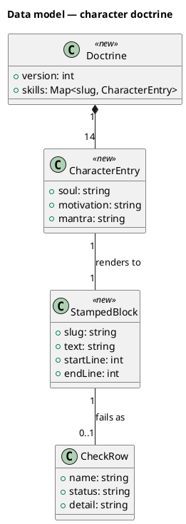
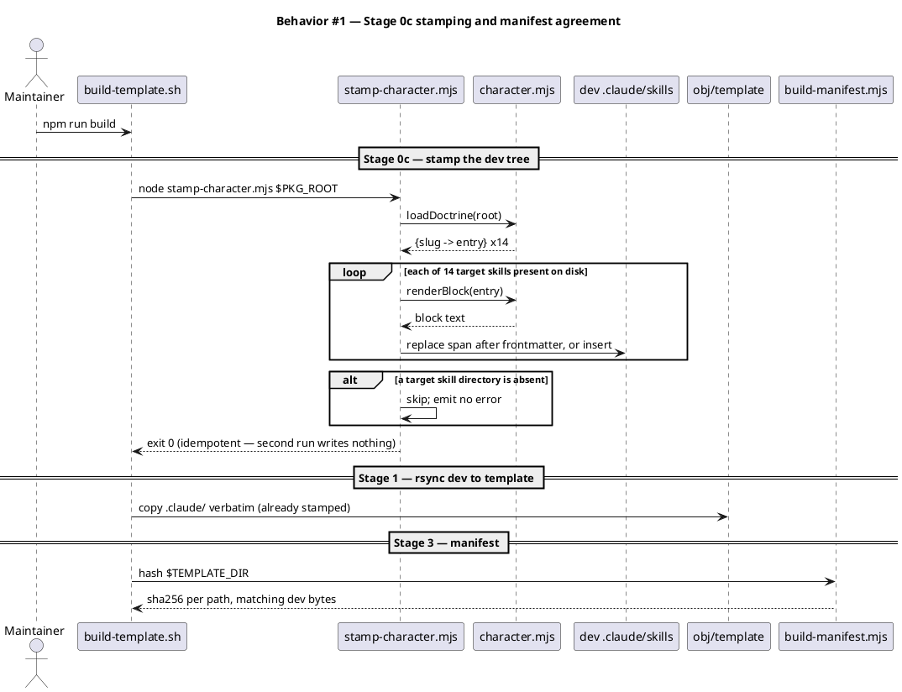
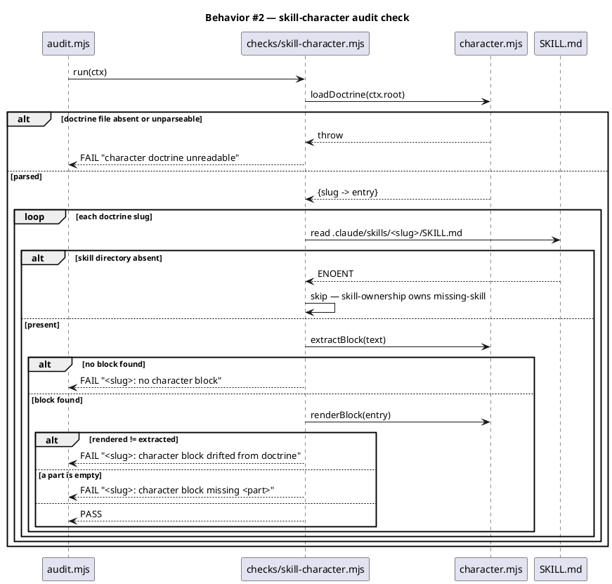
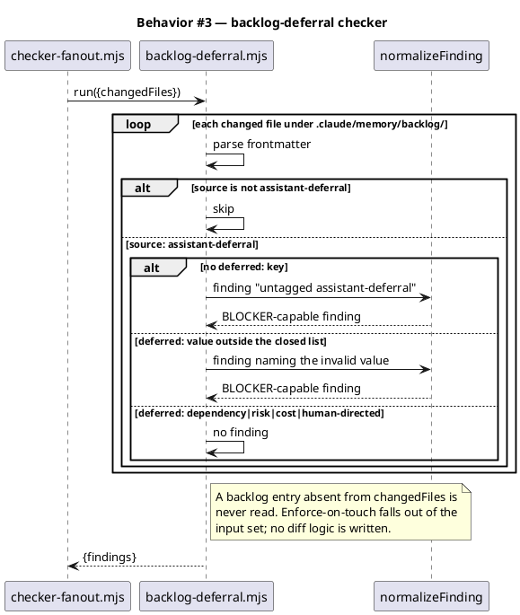
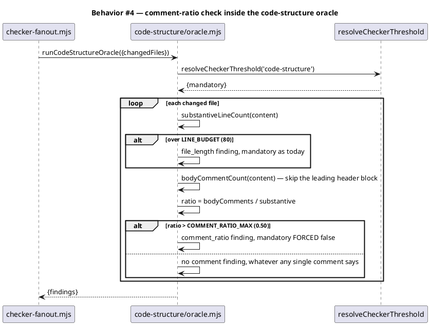
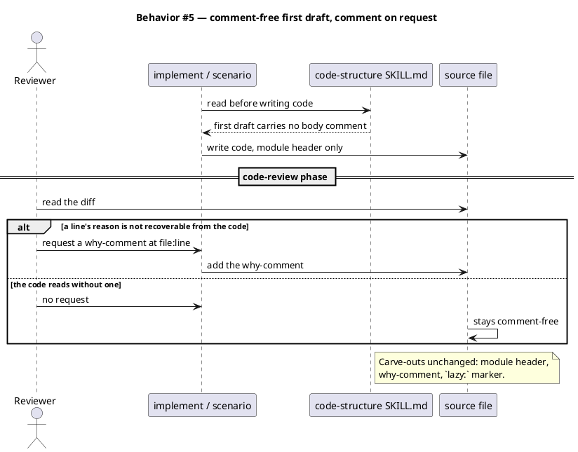
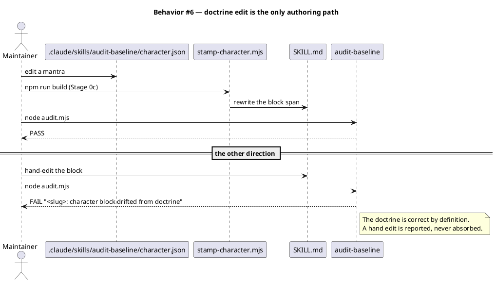
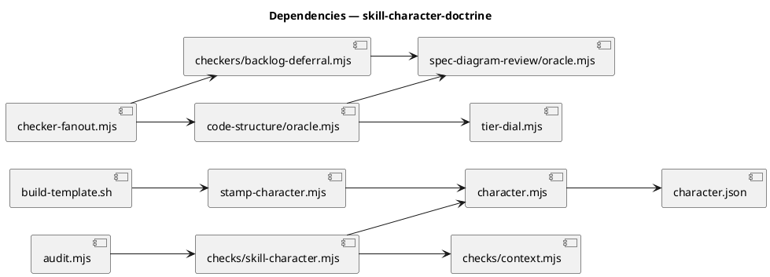

# Skill character doctrine — stamped blocks, a deferral tag, and a comment-ratio measure

## Context

| Input | Path |
|---|---|
| Intake | `docs/intake/skill-character-doctrine.md` |
| BRD *(if any)* | *(none)* |
| Scout *(if any)* | `docs/scout/skill-character-doctrine.md` |
| Research *(if any)* | `docs/research/skill-character-doctrine.md` |

**Write set**: `.claude/skills/audit-baseline/character.json`, `.claude/skills/audit-baseline/character.mjs`, `.claude/skills/audit-baseline/checks/skill-character.mjs`, `.claude/skills/audit-baseline/audit.mjs`, `.claude/skills/harness/checkers/backlog-deferral.mjs`, `.claude/skills/harness/checker-fanout.mjs`, `.claude/skills/code-structure/oracle.mjs`, `.claude/skills/code-structure/SKILL.md`, `.claude/skills/brainstorm/SKILL.md`, `.claude/skills/intake/SKILL.md`, `.claude/skills/spec/SKILL.md`, `.claude/skills/spec-shippability-review/SKILL.md`, `.claude/skills/spec-traceability-review/SKILL.md`, `.claude/skills/spec-diagram-review/SKILL.md`, `.claude/skills/spec-rollout-enforceability-review/SKILL.md`, `.claude/skills/scenario/SKILL.md`, `.claude/skills/implement/SKILL.md`, `.claude/skills/tdd/SKILL.md`, `.claude/skills/simplify/SKILL.md`, `.claude/skills/integrate/SKILL.md`, `.claude/skills/security/SKILL.md`, `.claude/memory/README.md`, `scripts/stamp-character.mjs`, `scripts/build-template.sh`, `tests/**`

The fourteen stamped targets are named individually rather than globbed. A `.claude/skills/*/SKILL.md` wildcard would declare a touch on all 62 skills, which the corpus optimizer correctly reads as 102 undeclared elements. The doctrine's key set and this list are the same fourteen slugs, and `character-doctrine-audit.test.mjs` asserts they agree.

## Goal

Fourteen heavy-lifting skills carry a machine-verified character block rendered from one doctrine file; an untagged assistant deferral is a BLOCKER on any backlog entry the diff touches; a comment-heavy file is measured and reported; and `code-structure` directs a comment-free first draft.

## Non-goals

- No skill's SOP behaviour changes except `code-structure`'s comment sequencing.
- No `owner:` frontmatter value changes on any skill (intake D-4).
- No mechanical classification of an individual comment as what- or why-comment (intake D-5, upholding D-6 of `docs/archive/2026-08-09/harness-batch-fixes/spec.md`).
- No repair of the existing comment corpus (intake D-3).
- No backfill of the 57 pre-existing backlog entries.
- No new hook. The deferral check rides the existing checker registry.

## Decisions

Routine engineering choices decided in main context and recorded for review (Art. XI.12). Intake decisions D-1 through D-6 are upstream and binding; these five are this spec's own.

| # | Decision | Owner | Choice | Rationale |
|---|---|---|---|---|
| S-1 | Doctrine file format and location | engineer | `.claude/skills/audit-baseline/character.json`, JSON, rendered to Markdown at stamp time | Research 1A. AC-1 makes the doctrine the *definition of the target set*, so its failure mode must be loud: malformed JSON throws, a malformed Markdown heading would silently shrink the set and pass. `.claude/` ships via Stage 1's rsync, so a consumer's `audit-baseline` can read it. |
| S-2 | Insertion point for the stamped block | engineer | Immediately after the frontmatter's closing `---`, before the first body line | The 14 targets span 40–298 lines and share no trailing anchor (scout). The frontmatter fence is the only structure all 14 already have. |
| S-3 | One renderer, two callers | engineer | `character.mjs` exports `renderBlock`; `scripts/stamp-character.mjs` writes, `checks/skill-character.mjs` verifies | A verifier holding its own copy of the render rule is a verifier that drifts from the writer. The projection-written-first idiom already used by `checker-fanout.persistVerdict`. |
| S-4 | Comment-ratio line counter | engineer | New `bodyCommentCount` in `code-structure/oracle.mjs`; `substantiveLineCount` untouched | Research measurement: excluding the leading module header moves p50 from 0.244 to 0.098. The header is a sanctioned carve-out (`tests/code-structure-comment-policy.test.mjs:27`), so counting it inverts the check against the repo's own convention. `substantiveLineCount` also strips the numerator, so it cannot be reused (AC-17). |
| S-5 | `scripts/build-template.sh`'s own ratio | engineer | Grandfathered | It measures 1.176 all-comment and this spec edits it. Intake D-3 grandfathers the corpus under enforce-on-touch; AC-22's backlog entry is where the repair is recorded. |

## Design

Diagrams are the contract. Prose is only for things a diagram cannot say.

### Structural kinds — referenced, not redrawn

The standing shape of every surface this spec touches is already modelled in the corpus. One resolvable reference satisfies C4 Context, Container, and Component:

@ref element:audit-baseline-helpers

### Data model — class diagram

No database and no DDL: the doctrine is a file, and the stamped block is a span of text inside another file. The entities below are in-memory shapes.



#### Migration DDL

```sql
-- forward: none. This change introduces no database table and no column.
-- reverse: none.
```

### Behavior — sequences

#### §Behavior #1 — the build stamps the dev tree before the shipped copy is taken



#### §Behavior #2 — the audit verifies presence, completeness, and drift



#### §Behavior #3 — an untagged deferral blocks, on touch only



#### §Behavior #4 — the comment ratio is measured body-only and reported advisory



#### §Behavior #5 — the SOP orders the comment after the review



#### §Behavior #6 — the doctrine round-trips without hand-editing a SKILL.md



### State — core entity *(only if stateful)*

Omitted deliberately: nothing here has a non-trivial state machine. A character block is present or absent, and a backlog entry's `deferred:` value is valid or not — both are predicates, not lifecycles.

### Dependencies — graph



Acyclic. `spec-diagram-review/oracle.mjs` is a shared leaf — it exports `normalizeFinding` and is already depended on by `code-structure/oracle.mjs:7`.

### Contracts

Every new surface is pinned, per the swarm-bound rule (D7).

| Kind | Name | Input | Output | Errors | Idempotent |
|---|---|---|---|---|---|
| Function | `loadDoctrine(rootDir)` | absolute repo root | `{version:int, skills:{[slug]:{soul,motivation,mantra}}}` | throws on absent or unparseable file | yes (pure read) |
| Function | `renderBlock(entry)` | one `CharacterEntry` | block text, `## Character` heading plus three bolded bullets, trailing newline | throws when any of the three parts is absent or blank | yes (pure) |
| Function | `extractBlock(skillMdText)` | full `SKILL.md` text | `{text, startLine, endLine}` or `null` when absent | never throws | yes (pure) |
| Function | `stampSkill(skillMdText, blockText)` | current text, rendered block | text with the block replacing an existing span, or inserted after the frontmatter's closing `---` | throws when no frontmatter fence is found | yes — stamping twice yields identical bytes |
| Check | `.claude/skills/audit-baseline/checks/skill-character.mjs` | audit `ctx` (`root`, `readSkillOwner`, `loadManifest`) | `[[name, status, detail], …]` | never throws; an unreadable doctrine is one FAIL row | yes (read-only) |
| Checker | `.claude/skills/harness/checkers/backlog-deferral.mjs` | `[{path, content}]` | `{findings: […]}` | never throws; an unparseable entry is one finding | yes (read-only) |
| Function | `bodyCommentCount(content)` | file text | integer count of comment lines after the leading header block | never throws | yes (pure) |
| CLI | `node scripts/stamp-character.mjs <root>` | repo root | exit 0; writes changed `SKILL.md` files; prints one line per file changed | exit 1 on an unwritable target, a doctrine entry failing `renderBlock`, or a target `stampSkill` rejects — the CLI catches and rethrows naming the path | yes |

`stampSkill` takes text, not a path, so it cannot name the offending file itself. The CLI is the only layer holding both, and it is where the path is attached to the error. Widening the signature with a label argument would push a reporting concern into a pure function for no gain.

### Libraries and versions

| Library@version | Purpose | Key APIs | Confirmed against current docs |
|---|---|---|---|
| *(none)* | No third-party dependency is added or used. Every module cited is in-repo and was read at its current state on disk. | — | n/a — VI.5 governs third-party APIs |

### Alternatives considered

| Alt | Summary | Rejected because |
|---|---|---|
| Markdown doctrine (research 1B) | `.claude/character.md`, sections extracted verbatim | A malformed heading silently shrinks the target set and passes. When a file *defines* what must be checked, silent-shrink is the wrong failure mode. |
| Standalone stamper (research 2B) | `npm run character:stamp`, build only verifies | Makes drift the normal state between a doctrine edit and the next manual run, and contradicts AC-5's "when the build completes". |
| Deferral as a PreToolUse hook (research 3B) | Block the Write on an untagged entry | Adds a 27th hook against a roster the constitution enumerates at 26 (Art. VIII), forcing a `seed.md` §4.1 amendment for a check the fan-out carries free. |
| Annotate `spec-shippability-review` `owner: baseline` | The original intake AC-6 | Ships a dev-only maintainer tool that reads `obj/template/...`, and forces a 56 → 62 count cascade needing a genesis amendment first. Replaced by intake D-4. |

## Program design

### Data access

| Reader | Source | Access path | Written by |
|---|---|---|---|
| `character.mjs` | `.claude/skills/audit-baseline/character.json` | `readFileSync` + `JSON.parse` | the maintainer, by hand — no program writes it |
| `checks/skill-character.mjs` | `.claude/skills/<slug>/SKILL.md` | `readFileSync` via `character.mjs → extractBlock` | `scripts/stamp-character.mjs`, sole writer |
| `scripts/stamp-character.mjs` | `.claude/skills/<slug>/SKILL.md` | `readFileSync` then `writeFileSync` | itself — the one writer |
| `checkers/backlog-deferral.mjs` | `ctx.changedFiles[]` | in-process array, no filesystem read | the fan-out's caller |
| `code-structure/oracle.mjs` | `ctx.changedFiles[]` | in-process array | the fan-out's caller |
| `scripts/build-manifest.mjs` | `obj/template/**` | `readFileSync` + sha256 | unchanged by this spec |

The single-writer property is the load-bearing row: `stamp-character.mjs` is the only writer to a stamped span, and the audit only ever reads. A second writer would make the drift check unable to say which side is right.

### Call stack

Load-bearing — the stamping path crosses from a shell build stage into node, and the check path enters through a registry that holds no logic.

```
npm run build
  └─ scripts/build-template.sh                    Stage 0c, before Stage 1's rsync
       └─ node scripts/stamp-character.mjs        walks the doctrine's slugs
            ├─ loadDoctrine(root)                 .claude/skills/audit-baseline/character.mjs
            ├─ renderBlock(entry)                 same module — the one render rule
            └─ stampSkill(text, block)            writeFileSync to the DEV tree

node .claude/skills/audit-baseline/audit.mjs
  └─ CHECKS[] registry                            audit.mjs:60, holds no logic
       └─ checks/skill-character.mjs run(ctx)
            ├─ loadDoctrine(ctx.root)             same module the stamper used
            ├─ extractBlock(skillText)            span lookup
            └─ renderBlock(entry)                 compare — drift is a byte diff
```

### Layout

```
.claude/
  character.json                                   new       — the doctrine; 14 entries, source of truth
  skills/audit-baseline/
    character.mjs                                  new       — loadDoctrine / renderBlock / extractBlock / stampSkill
    checks/skill-character.mjs                     new       — the audit check; run(ctx) -> rows
    audit.mjs                                      changed   — one import, one CHECKS[] entry
  skills/harness/
    checkers/backlog-deferral.mjs                  new       — the deferral checker
    checker-fanout.mjs                             changed   — one DEFAULT_CHECKER_REGISTRY entry
  skills/code-structure/
    oracle.mjs                                     changed   — bodyCommentCount + comment_ratio check
    SKILL.md                                       changed   — comment-free first draft; block stamped
  skills/{13 other targets}/SKILL.md               changed   — block stamped by the build
  memory/README.md                                changed   — deferred: field row in the reader table
scripts/
  stamp-character.mjs                              new       — the writer; dev-only, does not ship
  build-template.sh                                changed   — Stage 0c invocation before Stage 1
tests/
  character-doctrine-render.test.mjs               new       — render, extract, stamp, idempotence
  character-doctrine-audit.test.mjs                new       — the audit check's rows
  character-doctrine-build.test.mjs                new       — Stage 0c ordering, manifest agreement, dev-only skills stay unshipped
  stamp-character.test.mjs                         new       — skip-absent, write-only-changed, idempotence, rethrow-with-path
  backlog-deferral-checker.test.mjs                new       — the four reasons, invalid, untouched
  code-structure-comment-ratio.test.mjs            new       — ratio, header exclusion, advisory severity
  code-structure-comment-sop.test.mjs              new       — the SOP's comment sequencing and preserved carve-outs
  code-structure-comment-policy.test.mjs           unchanged surface — AC-020 requires it still pass untouched
```

## Design calls

*(none)* — the write set intersects no glob in `project.json → tdd.ui_globs`. There is no rendered surface in this change: every artifact is a source module, a Markdown document, or a JSON file. `spec_design_calls_guard` does not fire, and `/tdd` Step 6 has no row to serialize. The heading is present because `artifacts.required_sections.spec` requires it, and the explicit `*(none)*` distinguishes "considered, no UI" from "forgot to look".

## System delta

| Verb | Element | Anchor | Concept | Kind |
|---|---|---|---|---|
| add | character-doctrine | `.claude/skills/audit-baseline/character.json` | constitution-chain | class |
| change | audit-baseline-helpers | `.claude/skills/audit-baseline/*.mjs` | constitution-chain | c4_component |
| change | audit-baseline-checks | `.claude/skills/audit-baseline/checks/*.mjs` | constitution-chain | c4_component |
| change | harness-checkers | `.claude/skills/harness/checkers/*.mjs` | review-fanout | c4_component |
| change | harness-helpers | `.claude/skills/harness/*.mjs` | harness-loop | c4_component |
| change | code-structure-oracle | `.claude/skills/code-structure/oracle.mjs` | review-fanout | c4_component |

Only one `add` row. `character.mjs` lands inside `audit-baseline-helpers`'s existing `*.mjs` anchor, `checks/skill-character.mjs` inside `audit-baseline-checks`, and `checkers/backlog-deferral.mjs` inside `harness-checkers` — all three are `change` rows against elements that already model those directories. The `optimize` pass named each of them as a reuse candidate, and extending an element rather than adding one alongside it is `code-structure`'s reuse-before-create rule applied to the model.

The doctrine JSON is the exception: no element anchors it, it falls inside `governed_surface` (`.claude/skills/` root, `.json` extension, no excluded segment), and it is the file that defines the target set — so it earns an element of its own rather than hiding inside the module that reads it.

**Eight `undeclared` findings are deliberately not acted on.** `optimize` reports `brainstorm-helpers`, `spec-helpers`, `spec-review-helpers`, `tdd-helpers`, `simplify-helpers`, `security-helper`, `design-judge`, and `workflow-migrator`. Each governs `*.mjs` inside a skill directory where this spec edits only `SKILL.md`. `optimize.mjs:96-110` overlaps by *directory prefix* in both directions, so `.claude/skills/brainstorm/SKILL.md` and `.claude/skills/brainstorm/*.mjs` reduce to the same prefix and register as a touch. Adding `change` rows for modules this spec never opens would put a false delta in the model, which is worse than an advisory finding left standing. The pass is advisory by contract and blocks nothing.

## Acceptance criteria

| ID | Criterion (given / when / then) | Kind | Upstream AC | Sequence |
|---|---|---|---|---|
| AC-001 | given `.claude/skills/audit-baseline/character.json` listing 14 slugs, when the audit check runs, then its target set equals those slugs and no `owner:` value is read | behavior | intake AC-1 | §Behavior #2 |
| AC-002 | given a target skill whose `SKILL.md` has no character block, when `audit-baseline` runs, then it exits non-zero naming that skill | behavior | intake AC-2 | §Behavior #2 |
| AC-003 | given a character block missing Soul, Motivation, or Mantra, when `audit-baseline` runs, then it exits non-zero naming the skill and the missing part | behavior | intake AC-3 | §Behavior #2 |
| AC-004 | given a stamped block whose text differs from its doctrine entry, when `audit-baseline` runs, then it exits non-zero naming the skill and treats the doctrine as correct | behavior | intake AC-4 | §Behavior #2, §Behavior #6 |
| AC-005 | given a clean checkout, when `npm run build` completes, then all 14 dev-tree `SKILL.md` files carry a block byte-identical to `renderBlock` of their entry, and the manifest sha256 for each shipped target matches the dev bytes | smoke | intake AC-5 | §Behavior #1 |
| AC-006 | given a skill absent from the doctrine, when `audit-baseline` runs, then the character check neither requires nor reports a block for it | behavior | intake AC-6 | §Behavior #2 |
| AC-007 | given a doctrine entry whose skill directory is absent, when `audit-baseline` runs, then the character check emits no row for it | behavior | intake AC-7 | §Behavior #2 |
| AC-008 | given `spec-shippability-review` after the build, then its `SKILL.md` carries a block, its frontmatter still has no `owner:` line, and `obj/template/.claude/skills/spec-shippability-review` does not exist | smoke | intake AC-8 | §Behavior #1 |
| AC-009 | given a changed backlog entry with `source: assistant-deferral` and no `deferred:` key, when the checker runs, then it emits a BLOCKER naming the entry key | behavior | intake AC-9 | §Behavior #3 |
| AC-010 | given a changed entry with `deferred:` set to `dependency`, `risk`, `cost`, or `human-directed`, when the checker runs, then it emits no finding | behavior | intake AC-10 | §Behavior #3 |
| AC-011 | given a changed entry with `deferred:` set outside those four, when the checker runs, then it emits a BLOCKER naming the entry key and the invalid value | behavior | intake AC-11 | §Behavior #3 |
| AC-012 | given an entry with `source: assistant-deferral` and no `deferred:` key that is absent from `changedFiles`, when the checker runs, then it emits no finding | behavior | intake AC-12 | §Behavior #3 |
| AC-013 | given a changed file whose body-comment-to-substantive ratio exceeds 0.50, when the oracle runs, then it emits a finding naming the measured ratio and the threshold | behavior | intake AC-13 | §Behavior #4 |
| AC-014 | given a changed file whose ratio is at or under 0.50, when the oracle runs, then it emits no comment finding regardless of any comment's wording | behavior | intake AC-14 | §Behavior #4 |
| AC-015 | given the AC-013 finding, when the oracle runs, then that finding carries `mandatory: false` for every value `resolveCheckerThreshold('code-structure')` can return | behavior | intake AC-15 | §Behavior #4 |
| AC-016 | given the oracle after this change, when its checks are enumerated, then none classifies an individual comment as what-comment or why-comment | behavior | intake AC-16 | §Behavior #4 |
| AC-017 | given the pre-existing `file_length` check, when the oracle runs, then its findings keep their current shape, 80-line threshold, and mandatory behaviour, and the ratio check calls `bodyCommentCount` rather than `substantiveLineCount` | behavior | intake AC-17 | §Behavior #4 |
| AC-018 | given `code-structure/SKILL.md` after this change, when a reader follows the SOP, then it directs a first draft carrying no body comments | behavior | intake AC-18 | §Behavior #5 |
| AC-019 | given the same SOP, then it names a review-phase request as the sanctioned trigger for adding a comment, and retains the module-header, why-comment, and `lazy:` carve-outs | behavior | intake AC-19 | §Behavior #5 |
| AC-020 | given `tests/code-structure-comment-policy.test.mjs` unmodified, when the suite runs, then both existing assertions pass | behavior | intake AC-20 | §Behavior #5 |
| AC-021 | given the research memo, then it records the measured corpus ratio and the AC-013 threshold derives from it | behavior | intake AC-21 | §Behavior #4 |
| AC-022 | given the corpus repair this spec does not perform, when `/memory-sync` runs, then a backlog entry names it with `source: assistant-deferral` and `deferred: cost` | behavior | intake AC-22 | §Behavior #3 |
| AC-023 | given `CLAUDE.md` and `src/CLAUDE.template.md` after this change, when `audit-baseline` runs, then they are byte-equal and each under 40,000 characters | behavior | intake AC-23 | §Behavior #2 |
| AC-024 | given every stamped `SKILL.md` that ships, when `scan-shipped-skills.mjs` runs, then it reports no BLOCKER introduced by a character block | smoke | intake AC-24 | §Behavior #1 |
| AC-025 | given a `SKILL.md` already carrying a current block, when `stamp-character.mjs` runs again, then the file bytes are unchanged | behavior | intake AC-5 | §Behavior #1 |

## Test plan

| Category | Scenario | Expected | Covers |
|---|---|---|---|
| Golden path | doctrine with 14 entries, all skills present and stamped | audit PASS, zero rows | AC-001, AC-002 |
| Golden path | build from clean, then `git diff` | empty; dev and template bytes identical | AC-005, AC-025 |
| Golden path | changed entry tagged `deferred: risk` | no finding | AC-010 |
| Golden path | file at ratio 0.49 | no comment finding | AC-014 |
| Input boundary | doctrine entry with `mantra: ""` | `renderBlock` throws; audit FAILs naming the part | AC-003 |
| Input boundary | `SKILL.md` with no frontmatter fence | `stampSkill` throws, naming the file | AC-005 |
| Input boundary | file with exactly 0 substantive lines | no divide-by-zero; no finding | AC-013 |
| Input boundary | file whose every line is the module header | body-comment count 0; no finding | AC-013, AC-017 |
| Input boundary | `deferred:` with unicode or trailing whitespace | normalized then matched against the closed list | AC-011 |
| Contract violation | doctrine file absent | one FAIL row, audit exits non-zero, no throw escapes | AC-001 |
| Contract violation | doctrine file with malformed JSON | one FAIL row, no throw escapes | AC-001 |
| Contract violation | hand-edited block text | FAIL naming drift; doctrine treated as correct | AC-004 |
| Contract violation | `deferred: YAGNI` | BLOCKER naming the invalid value | AC-011 |
| Contract violation | backlog entry with unparseable frontmatter | one finding, no throw | AC-009 |
| Concurrency / ordering | stamp runs, then Stage 1 rsync, then manifest | manifest hash equals dev-tree hash for all 14 | AC-005 |
| Concurrency / ordering | audit invoked with `--skip-hash-check` | character check still runs; only the sha256 re-hash is suppressed | AC-005 |
| Failure mode | doctrine slug whose skill directory was deleted | no character row; `skill-ownership` owns the missing-skill FAIL | AC-007 |
| Failure mode | `SKILL.md` read-only on disk | `stamp-character.mjs` exits 1 naming the path | AC-005 |
| Failure mode | `changedFiles` empty | both checkers return `{findings: []}` | AC-012 |
| Regression trap | `file_length` on an 81-substantive-line file | unchanged finding shape, threshold, and mandatory value | AC-017 |
| Regression trap | `substantiveLineCount` called directly | identical output to before this change | AC-017 |
| Regression trap | severity dial set to every tier | `comment_ratio` mandatory stays false at all of them | AC-015 |
| Regression trap | `tests/code-structure-comment-policy.test.mjs` | passes unmodified | AC-020 |
| Regression trap | `spec-shippability-review` after build | still unannotated, still unshipped | AC-008 |
| Regression trap | oracle exports enumerated | no what-comment/why-comment classifier present | AC-016 |
| Regression trap | `scan-shipped-skills.mjs` over the stamped tree | no new BLOCKER | AC-024 |
| Regression trap | `CLAUDE.md` vs `src/CLAUDE.template.md` | byte-equal, under 40,000 chars | AC-023 |

## Observability

| Signal | Name | Shape | Purpose |
|---|---|---|---|
| Log | `stamp-character: <path> updated` | one stdout line per file changed | makes a build-time source mutation visible rather than silent |
| Log | `skill ownership: <slug>` / `skill character: <slug>` | audit table row, `PASS`/`FAIL` + detail | the audit's existing reporting surface, unchanged in shape |
| Metric | *(none)* | — | this is a build-and-review-time check with no runtime service to instrument |
| Alarm | *(none)* | — | the audit's non-zero exit is the alarm; CI is the page target |

## Rollout

### Prerequisites

| # | Prerequisite | enforced-by |
|---|---|---|
| 1 | The build stamps the dev tree before Stage 1's rsync, so manifest hashes match dev-tree bytes | AC-005 |
| 2 | `spec-shippability-review` stays unannotated and unshipped after the change | AC-008 |
| 3 | Every stamped `SKILL.md` that ships passes the shipped-prose scanner | AC-024 |

- **Feature flag**: none. The audit check and the two checkers are structural, and a flag would create a state in which the doctrine and the stamped blocks may legally disagree — which is the drift this spec exists to remove.
- **Migration order**: 1 write `.claude/skills/audit-baseline/character.json` → 2 land `character.mjs` + `stamp-character.mjs` → 3 wire Stage 0c and run the build → 4 land the audit check → 5 land the two checkers.
- **Canary**: none applicable. Step 4 is the canary in effect: the audit check goes live against a tree already stamped by step 3, so a mismatch surfaces before anything else depends on it.

## Rollback

- **Kill-switch**: remove the `checks/skill-character.mjs` entry from `audit.mjs`'s `CHECKS[]` and the two registry entries from `DEFAULT_CHECKER_REGISTRY`. The stamped blocks are inert Markdown and can stay; nothing reads them at runtime.
- **Signal to roll back**: `audit-baseline` FAILs on a tree where `git status` is clean and `npm run build` has just run. That combination means the stamper and the checker disagree about the same bytes, which no maintainer action can resolve. It surfaces on the first build after landing, well inside 5 minutes.

## Archive plan

- Defaults *(automatic)*: intake, scout, research, spec, spec-rendered/, spec approval, security reports.
- Extras *(list any non-default files)*:
  - *(none)*

## Open questions

None. Intake decisions D-1 through D-6 and spec decisions S-1 through S-5 cover every fork this design reached.
