# Standup remote freshness — name the stale release picture

## Context

| Input | Path |
|---|---|
| Intake | *(none — `spec-entry` track; `intake` is in `workflow.json → exceptions`)* |
| BRD *(if any)* | *(none)* |
| Scout *(if any)* | *(none — `scout` excepted)* |
| Research *(if any)* | *(none — `research` excepted)* |

**Write set**: `.claude/skills/standup/gather.mjs`, `.claude/skills/standup/cli.mjs`, `.claude/skills/standup/render.mjs`, `.claude/skills/standup/SKILL.md`, `tests/standup-remote-freshness.test.mjs` — matches the `non-architectural` diagram profile (`project.json → artifacts.diagram_profiles`), so the reduced set applies: `c4_component`, `class`, `sequence`, `dependency_graph`.

The standing shape is already modelled: `@ref element:standup-helper` (concept `planning-release`, anchor `.claude/skills/standup/*.mjs`).

### The observed failure

On 2026-08-13 `/standup` reported *"Shipped v0.21.0 · unreleased 70 commits · next bump minor"*. At that moment `v0.22.0` was already tagged, published to npm, and released on GitHub (workflow run `31579112543`, 2026-08-12T08:38Z). The clone had not fetched since before the release, so `git describe --tags --abbrev=0` returned the stale local tag and `git rev-list @{upstream}...HEAD` compared against a stale `origin/main`. Nothing in `degraded[]` named the staleness, so a shipped release read as an unshipped 70-commit pile and the operator opened an investigation into a release stall that had not happened.

## Goal

`/standup` either proves its release figures against the remote or states plainly that it did not, so a stale local ref can never be read as an authoritative release picture — and the backlog buckets it prints report the entries that are actually there.

## Non-goals

- **No auto-fetch.** The probe reads; it never mutates a ref, a tag, or the object store. A recap that silently fetched would change the tree state a subsequent `git status` reports.
- **No network on the default path.** `memory_session_start` calls `gatherSync` on every session start; a mandatory round-trip there would tax every session to serve an occasional question.
- **No change to** `collectReleaseModel`, `collectBacklog`, `collectPendingQuestions`, `collectRoadmap`, or the release-model-aware recommendation reasoning (which stays in main context per Article II).
- **No change to the rendered bucket labels.** AC-009 fixes the `picked-up` lookup, but the displayed label stays `picked-up` — `SKILL.md:16` and `:37` document that spelling as the contract, and renaming the display to `pickedUp` would fix a silent wrong number by breaking a documented one.

## Decisions

Recorded per Article XI.12 — these were decided in main context and are reviewed here rather than asked. `codesign_mode` is `false` on this workflow, so no codesign capture ran.

| # | Decision | Owner | Rationale |
|---|---|---|---|
| D1 | The probe is opt-in behind `--remote`, not default-on | engineer | `memory_session_start` (`.claude/hooks/lib/memory_session_start.mjs:249`) calls `gatherSync` synchronously on every session start. A default-on probe puts a network round-trip in the session-start path, where a hung DNS lookup would stall every session to answer a question the operator asked at most a few times a day. |
| D2 | The default path keeps the SKILL.md deterministic-core guarantee | engineer | Every existing caller — the session-start hook, `roadmap-sync/tests/sync.test.mjs`, `sprint-planner` — depends on identical-input-identical-output. Making the core non-deterministic to fix a reporting gap would break the property that makes those callers testable. |
| D3 | The default path must nevertheless carry a caveat line | engineer | Opt-in detection alone leaves the default path exactly as misleading as it is today. The caveat is what makes the un-probed number self-describing, and it costs nothing — no network, no clock. This is the half of the fix that serves the operator who does *not* know to pass `--remote`. |
| D4 | Probe failure is fail-open with a distinct marker | engineer | `/standup` is documented to degrade rather than throw, and an offline laptop is the ordinary case, not an error. A distinct marker (`remote-probe-failed`, not `stale-remote-refs`) keeps "I checked and you are stale" separable from "I could not check" — collapsing them would let a flaky network read as a stale tree. |
| D5 | Freshness nests under `release.remote`; no seventh top-level key | engineer | `tests/standup-cli-recap.test.mjs:71` asserts `gatherSync` returns *exactly* the six documented keys. That assertion is a deliberate contract, not an accident, so the new data nests inside the existing `release` object (whose key set no test pins) and the markers ride in `degraded[]`. |
| D6 | `execFileSync` with `shell: false` (the default) and an args array | engineer | `git ls-remote` output is remote-controlled text. With `shell: false` no ref name is ever interpolated into a command line, which removes the injection surface structurally rather than by escaping. Confirmed against current Node docs (see **Libraries and versions**). |
| D7 | `killSignal: 'SIGKILL'` on the probe, not the `SIGTERM` default | engineer | Node's own docs state that on timeout `execFileSync` "waits for the process to exit even after sending a kill signal. If the child process ignores the termination signal, the parent process will continue to wait indefinitely." A `git` blocked on a TCP connect that ignores `SIGTERM` would hang the recap forever, which is precisely the fail-open promise D4 makes. `SIGKILL` is not catchable, so the timeout is a real bound. |
| D8 | Tag comparison rejects any tag not matching a strict semver pattern | engineer | The remote decides what its refs are named. Trusting `ls-remote`'s output ordering, or comparing arbitrary strings, lets a remote with a `refs/tags/zzz` decide our "newest release". Parse to `{major,minor,patch}` and compare numerically; anything unparseable is discarded before comparison. |
| D9 | The `picked-up` bucket fix maps display label to data key; it does not rename either side | human-directed | Two spellings exist and both are load-bearing: `gather.mjs` emits the camelCase key `pickedUp`, and `SKILL.md:16`/`:37` document the hyphenated `picked-up` as the user-visible bucket name. Renaming the key breaks `tests/memory-readers-sharded.test.mjs:105` and `tests/standup-gather.test.mjs:167`, which read `recap.backlog.pickedUp`; renaming the label breaks the documented output contract. The renderer therefore iterates explicit `[label, key]` pairs, which is the only variant that leaves both contracts intact. |
| D10 | The AC-009 fix must also rebuild the render test's backlog fixture from `gatherSync` output | engineer | `tests/standup-render.test.mjs:32` hand-writes `{ open: [], 'picked-up': [], dropped: [] }` — the renderer's *wrong* shape. That fixture is why the defect survived: the test agreed with the bug instead of with the producer. Fixing the renderer while leaving a fixture that asserts the old shape would leave the regression undefended. This is the repo's standing anti-drift rule (memory `anti-drift-tests-compare-against-the-live-oracle-b4d2`) applied to its own recap. |
| D11 | The head comparison reports **four** outcomes, and "not comparable" is never folded into "matched" | human-directed | Measured on a tagless trunk-based fixture, 2026-08-13: a branch with **no upstream** rendered `Remote check: local refs match origin.` Nothing was compared — `compareHead` returned `sha: null` because there was no tracking ref, and `null` already meant "matched" to its caller. That is a verification claim for a comparison that never ran, which is the exact failure this spec exists to remove; the first draft fixed it for the probe-failure case and missed it for the nothing-to-compare case. The outcomes are `diverged` / `matched` / `unreachable` / `not-comparable` (no upstream, or detached HEAD), carried on `release.remote.headState` so the renderer can tell them apart. `not-comparable` is **neither** stale **nor** a probe failure: nothing broke, there is simply no remote-tracking branch to compare against. |
| D12 | The staleness remedy names `git fetch --tags` only when a remote **tag** drove the finding | human-directed | On a repository with no tags at all, the stale line still read `Run \`git fetch --tags\``. The command is harmless there (it fetches branches too) but it names an object the reader does not have, which reads as a tool that has not understood the repo. When `remoteTag` is null the staleness came from the branch head, so the remedy is plain `git fetch`. |

## Design

Diagrams are the contract.

### C4 — Component (changed container only)

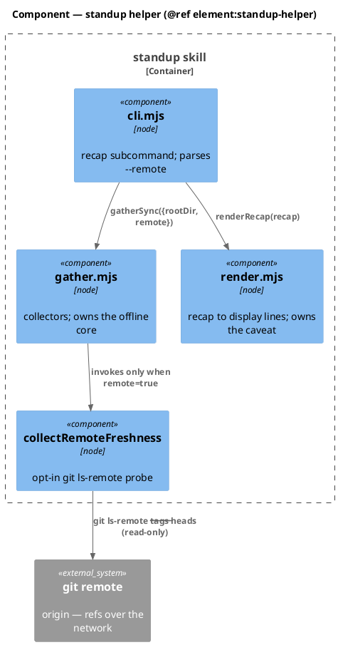

### Data model — class diagram

`RemoteFreshness` is the only new shape. It hangs off the existing `Release` object; `StandupRecap`'s six top-level keys are unchanged (D5).

The stereotypes are deliberately absent. `<<new>>` binds a field to a matching `ALTER` in the Migration DDL (`spec-diagram-review`'s `class_ddl_consistency` rule), and there is no table behind any of these shapes. What this change adds is stated in the note instead, where it cannot imply a migration that does not exist.

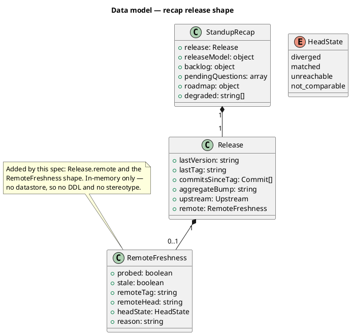

#### Migration DDL

*(none — no datastore. `RemoteFreshness` is an in-memory projection; `release.remote` is `null` on the default path and the recap is rebuilt from git and disk on every call.)*

### Behavior — sequence per AC

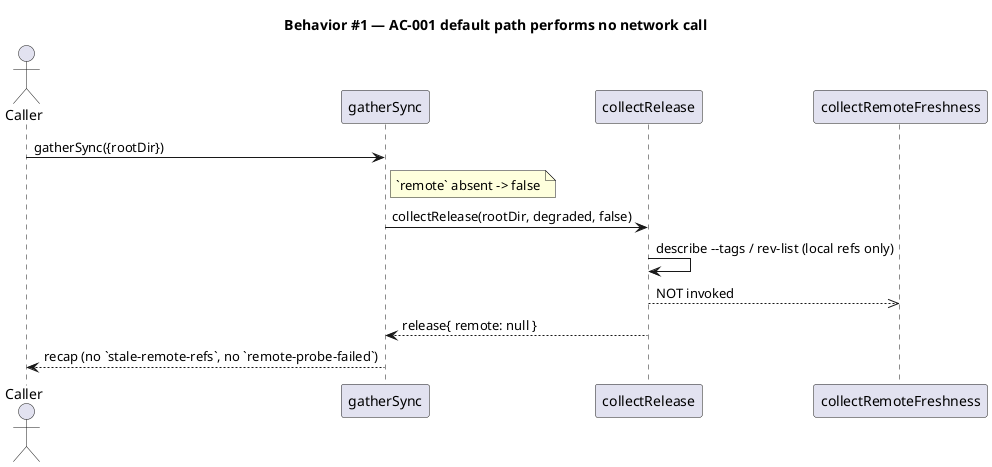

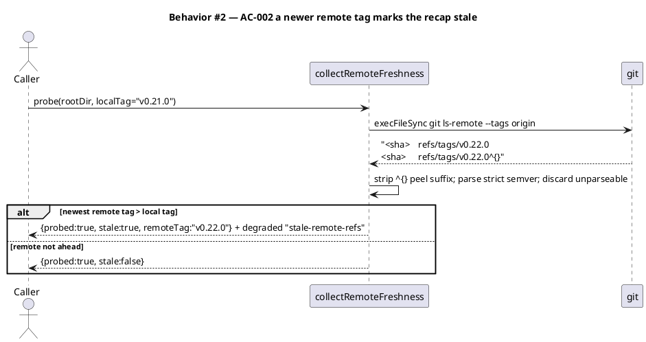

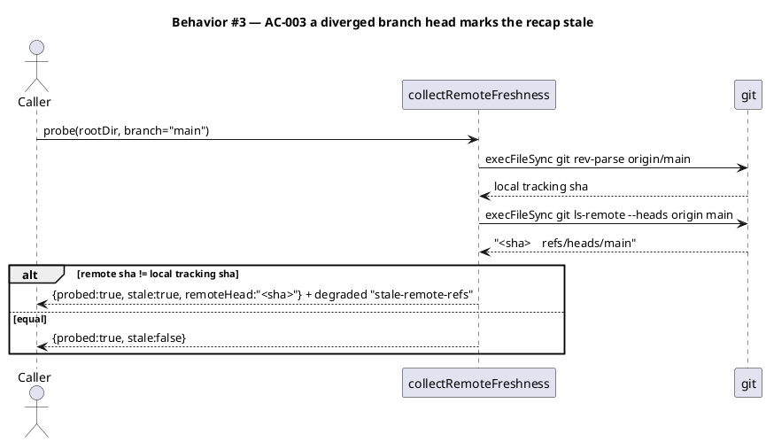

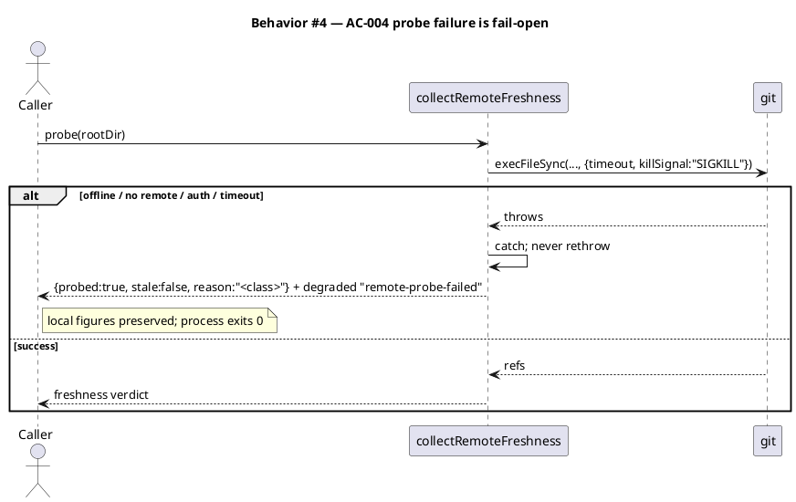

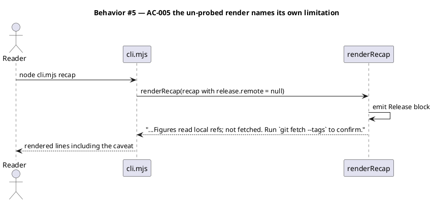

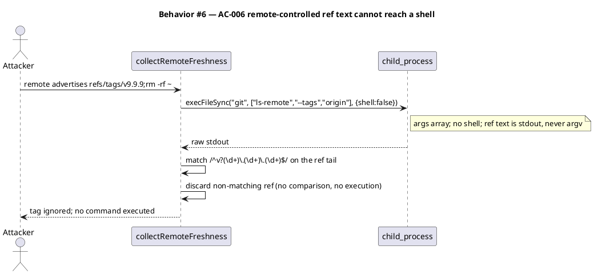

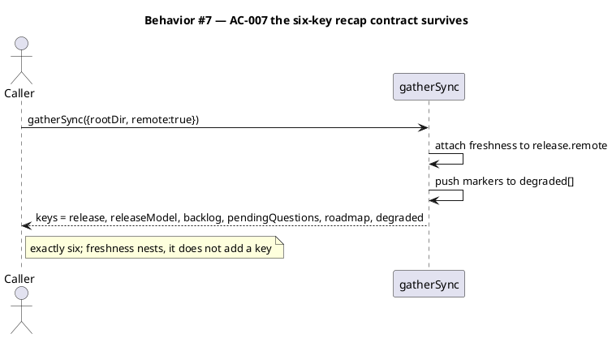

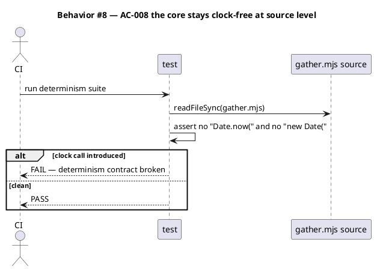

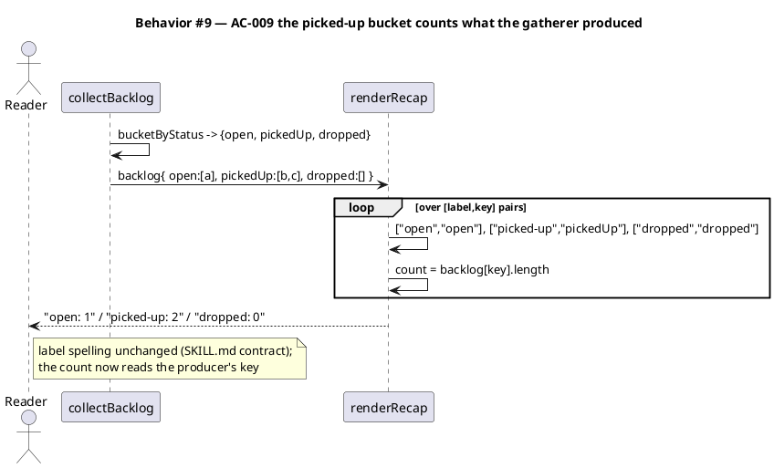

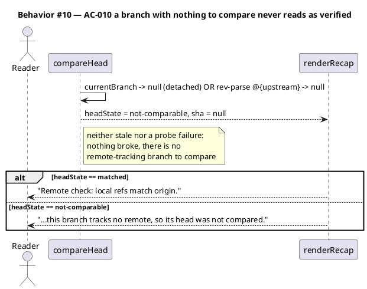

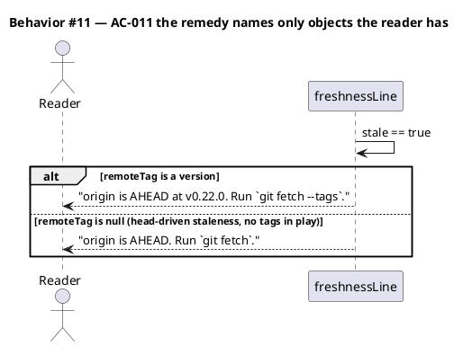

### State — core entity *(only if stateful)*

*(omitted — the recap holds no persistent state. Every call rebuilds from git and disk; `RemoteFreshness` lives only for the duration of one `gatherSync`.)*

### Dependencies — graph

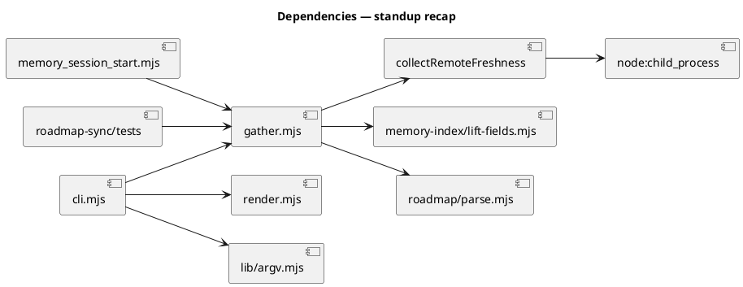

The graph is acyclic. `collectRemoteFreshness` is a new leaf under `gather.mjs`; no existing edge changes direction, and no caller of `gather.mjs` gains an edge to the network — that edge exists only when `remote: true` reaches the new leaf.

### Contracts

| Kind | Name | Input | Output | Errors | Idempotent |
|---|---|---|---|---|---|
| Function | `gatherSync({rootDir, now, remote})` | `remote?: boolean` (default `false`) | `StandupRecap` — six keys, `release.remote` populated only when `remote` is `true` | none — degrades into `degraded[]` | yes |
| Function | `collectRemoteFreshness(rootDir, degraded, localTag)` | repo root, the mutable `degraded` array, the local tag from `describe` | `RemoteFreshness \| null` | never throws; pushes `remote-probe-failed` | yes (read-only) |
| Function | `renderRecap(recap)` | `StandupRecap` | `string[]` including the caveat line when `release.remote` is `null` | `TypeError` on a non-object (unchanged) | yes |
| CLI | `node .claude/skills/standup/cli.mjs recap [--remote]` | `--remote` boolean flag | rendered lines, or raw recap with `--json` | exit 0 always, probe outcome regardless | yes |

`--remote` takes no value, so it needs **no** entry in `lib/argv.mjs → VALUE_FLAGS`; under `strict: false` a valueless flag parses as boolean `true`. `argv.mjs` is deliberately outside the write set.

### Libraries and versions

| Library@version | Purpose | Key APIs | Confirmed against current docs |
|---|---|---|---|
| `node:child_process` @ Node ≥18.17.0 (`package.json → engines`) | run the read-only probe | `execFileSync(file, args, {cwd, encoding, timeout, killSignal, maxBuffer, shell})` | yes — context7 `/nodejs/node`, 2026-08-13. Confirmed: `shell` defaults to `false`; on timeout the method throws and "waits for the process to exit even after sending a kill signal", which is why D7 pins `SIGKILL`. |
| `git` (system binary, ≥2.x) | `ls-remote`, `rev-parse` | `git ls-remote --tags <remote>`, `git ls-remote --heads <remote> <branch>`, `git rev-parse <upstream>` | yes — `git ls-remote` is documented read-only; it contacts the remote and writes nothing locally. |

No third-party npm dependency is added.

### Alternatives considered

| Alt | Summary | Rejected because |
|---|---|---|
| A | Probe by default; fail open when offline | Puts a network round-trip in `memory_session_start`, which runs on every session start. Also forces the SKILL.md determinism contract to be amended for *all* callers rather than for one opt-in path. |
| B | Caveat only; never probe | Leaves `/standup` structurally unable to answer "did this actually ship?" — the exact question the 2026-08-13 failure raised. The caveat is necessary but not sufficient. |
| C | Run `git fetch --tags` and report the true state | Mutates the repository as a side effect of a documented read-only command. A recap that moves refs can change what a later `git status` or `/commit` sees. |
| D | Compare `CHANGELOG.md` against the npm registry | Answers a different question (is the published package current) and adds a registry dependency and an auth surface. `git ls-remote` answers the ref question directly. |

## Program design

### Data access

| Reader | Source | Access path | Written by |
|---|---|---|---|
| `collectRelease` | local git refs (tags, `@{upstream}`) | `execFileSync git describe/rev-list` | nothing — read-only |
| `collectRemoteFreshness` | remote refs on `origin` | `execFileSync git ls-remote` (network) | nothing — read-only, no ref mutation |
| `collectRemoteFreshness` | local tracking ref sha | `execFileSync git rev-parse <upstream>` | nothing — read-only |
| `renderRecap` | the in-memory `StandupRecap` | in-process argument | `gatherSync` — the one writer |
| `memory_session_start` | `gatherSync({rootDir})` | in-process call, `remote` omitted | `gatherSync` |

### Call stack

Load-bearing: the probe is reached through two frames from the CLI and must be unreachable from the hook.

```
cli.mjs recap --remote
  └─ gatherSync({rootDir, remote:true})        gather.mjs
       └─ collectRelease(rootDir, degraded, remote)  gather.mjs
            ├─ gitOut describe/rev-list        gather.mjs   (always — local)
            └─ collectRemoteFreshness(...)     gather.mjs   (only when remote=true)
                 └─ execFileSync git ls-remote node:child_process  <- IO boundary

memory_session_start.mjs:249
  └─ gatherSync({rootDir})                     remote absent -> false
       └─ collectRelease(..., false)           probe branch never entered
```

### Layout

```
.claude/skills/standup/
  gather.mjs    changed   — add collectRemoteFreshness + thread `remote` through gatherSync/collectRelease
  cli.mjs       changed   — pass flags.remote === true into gatherSync
  render.mjs    changed   — caveat line when release.remote is null; freshness line when probed;
                            backlogLines iterates [label,key] pairs (AC-009)
  SKILL.md      changed   — document --remote; amend the Constraints determinism clause
tests/
  standup-remote-freshness.test.mjs  new      — one describe per AC-001..AC-009
  standup-render.test.mjs            changed  — backlog fixture rebuilt from gatherSync output (D10)
```

## Design calls

*(none)* — the write set intersects no glob in `project.json → tdd.ui_globs`.

## System delta

| Verb | Element | Anchor | Concept | Kind |
|---|---|---|---|---|
| change | standup-helper | `.claude/skills/standup/*.mjs` | planning-release | c4_component |

## Acceptance criteria

| ID | Criterion (given / when / then) | Kind | Upstream AC | Sequence |
|---|---|---|---|---|
| AC-001 | given a repo with a reachable remote, when `gatherSync({rootDir})` is called without `remote`, then no `git ls-remote` process is spawned, `release.remote` is `null`, and neither `stale-remote-refs` nor `remote-probe-failed` appears in `degraded[]` | preflight | request §DECIDED DESIGN 2 | §Behavior #1 |
| AC-002 | given the newest remote tag is `v0.22.0` and the local `describe` answer is `v0.21.0`, when the recap runs with `remote: true`, then `degraded[]` contains `stale-remote-refs` and `release.remote.remoteTag` is `v0.22.0` | behavior | request §DECIDED DESIGN 1a | §Behavior #2 |
| AC-003 | given `origin`'s head for the current branch differs from the local tracking ref, when the recap runs with `remote: true`, then `degraded[]` contains `stale-remote-refs` and `release.remote.remoteHead` holds the remote sha | behavior | request §DECIDED DESIGN 1b | §Behavior #3 |
| AC-004 | given the probe subprocess fails (no remote configured, non-zero exit, or timeout), when the recap runs with `remote: true`, then `degraded[]` contains `remote-probe-failed` and not `stale-remote-refs`, the local `lastTag`/`commitsSinceTag` are unchanged, and the CLI exits 0 | error-mapping | request §DECIDED DESIGN 4 | §Behavior #4 |
| AC-005 | given a recap whose `release.remote` is `null`, when `renderRecap` runs, then the Release block contains a caveat naming both that the figures come from unfetched local refs and `git fetch --tags` as the remedy | behavior | request §DECIDED DESIGN 3 | §Behavior #5 |
| AC-006 | given `ls-remote` output containing a ref name with shell metacharacters and a ref name that is not strict semver, when the probe parses it, then no shell is invoked (`shell` is false / unset), the non-semver ref is discarded before any comparison, and the metacharacter ref never reaches `argv` | behavior | request §SECURITY NOTE | §Behavior #6 |
| AC-007 | given any `remote` value, when `gatherSync` returns, then `Object.keys(recap)` is exactly `release, releaseModel, backlog, pendingQuestions, roadmap, degraded` | behavior | D5 | §Behavior #7 |
| AC-008 | given the amended `gather.mjs`, when its source text is read, then it contains neither `Date.now(` nor `new Date(` | preflight | request §DECIDED DESIGN 2 | §Behavior #8 |
| AC-009 | given a backlog whose `bucketByStatus` output holds N entries under `pickedUp`, when `renderRecap` runs, then the Backlog block prints the line `picked-up: N` — the label spelling unchanged and the count read from the `pickedUp` key | behavior | human-directed at gate A, 2026-08-13 | §Behavior #9 |
| AC-010 | given a branch with no upstream (or a detached HEAD), when the recap runs with `remote: true`, then `release.remote.headState` is `not-comparable`, `stale` is false, `degraded[]` contains neither `stale-remote-refs` nor `remote-probe-failed`, and the rendered line states the head was not compared rather than that local refs match origin | behavior | human-directed 2026-08-13, D11 | §Behavior #10 |
| AC-011 | given a stale verdict whose `remoteTag` is null, when `renderRecap` runs, then the remedy names `git fetch` and not `git fetch --tags`; given a stale verdict carrying a `remoteTag`, the remedy names `git fetch --tags` | behavior | human-directed 2026-08-13, D12 | §Behavior #11 |

## Test plan

| Category | Scenario | Expected | Covers |
|---|---|---|---|
| Golden path | temp repo + bare origin; origin tagged `v0.22.0`, clone stops at `v0.21.0`; recap with `remote: true` | `stale-remote-refs` in `degraded`; `release.remote.remoteTag === 'v0.22.0'` | AC-002 |
| Golden path | same fixture, `remote` omitted | `release.remote === null`; no freshness marker; identical output across two calls | AC-001, AC-007 |
| Golden path | recap with `release.remote: null` through `renderRecap` | rendered text matches `/local refs/i` and contains `git fetch --tags` | AC-005 |
| Input boundary | origin advertises `refs/tags/v0.22.0` and its peeled `refs/tags/v0.22.0^{}` | the peel suffix is stripped; the tag counts once | AC-002 |
| Input boundary | origin advertises `refs/tags/zzz`, `refs/tags/v1.2`, `refs/tags/v10.0.0` alongside `v0.21.0` | `zzz` and `v1.2` discarded; `v10.0.0` wins numerically, not lexically (`v10 > v9`) | AC-002, AC-006 |
| Contract violation | origin advertises `refs/tags/v9.9.9;touch /tmp/pwned` | no file created; probe returns without executing; ref discarded as non-semver | AC-006 |
| Contract violation | `gatherSync({rootDir, remote: true})` on a repo with no `origin` | `remote-probe-failed` present, `stale-remote-refs` absent, local figures intact | AC-004 |
| Failure mode | probe points at an unroutable remote with the timeout set low | throws internally, caught; `remote-probe-failed`; call returns within the timeout bound | AC-004 |
| Failure mode | non-git directory with `remote: true` | `no-git` as today; probe never invoked; no throw | AC-001, AC-004 |
| Concurrency / ordering | two `gatherSync` calls on one fixture, `remote` omitted, compared field-by-field | byte-identical recaps — the offline core stays deterministic | AC-001 |
| Regression trap | `Object.keys(gatherSync({rootDir: REPO_ROOT}))` | exactly the six documented keys — the existing `standup-cli-recap` assertion still passes | AC-007 |
| Regression trap | `gather.mjs` source scanned for clock calls | no `Date.now(` / `new Date(` — the existing `standup-gather` determinism assertion still passes | AC-008 |
| Regression trap | `memory_session_start` recap path exercised | no network call; session-start latency unchanged | AC-001 |
| Regression trap | `SKILL.md` read | still documents all six recap keys — the existing `standup-cli-recap` SKILL.md assertion still passes | AC-007 |
| Golden path | memory fixture with 1 `open`, 2 `picked-up`, 1 `dropped` backlog shard, piped `gatherSync` → `renderRecap` | rendered text contains `picked-up: 2`, not `picked-up: 0` | AC-009 |
| Contract violation | `renderRecap` handed a backlog object carrying ONLY the producer's keys (`open`/`pickedUp`/`dropped`) with no `'picked-up'` key present | still prints `picked-up: N` — the renderer must not depend on a key the gatherer never emits | AC-009 |
| Input boundary | backlog with an empty `pickedUp` array | prints `picked-up: 0` — a true zero stays distinguishable from the old unconditional zero | AC-009 |
| Regression trap | the fixture at `tests/standup-render.test.mjs:32` is rebuilt from `gatherSync` output rather than hand-written (D10) | the render suite fails if the renderer reverts to indexing `'picked-up'` | AC-009 |
| Regression trap | `recap.backlog.pickedUp` still readable by existing consumers | `tests/memory-readers-sharded.test.mjs:105` and `tests/standup-gather.test.mjs:167` still pass — the data key is not renamed | AC-009 |
| Golden path | tagless trunk-based clone, branch checked out with no upstream, probed | `headState` is `not-comparable`; rendered text does NOT match `/match(es)? origin/`; `stale` false | AC-010 |
| Golden path | tagless clone on a tracking branch whose origin head moved, probed | `headState` is `diverged`; `stale` true; `remoteHead` holds the remote sha; remedy names `git fetch` | AC-010, AC-011 |
| Input boundary | detached HEAD (`git checkout <sha>`), probed | `headState` is `not-comparable`, not `unreachable` — a detached HEAD is not a failed probe | AC-010 |
| Contract violation | branch tracks a remote, heads probe fails, probed | `headState` is `unreachable` and `remote-probe-failed` is present — the failure case stays distinct from `not-comparable` | AC-010 |
| Golden path | stale by tag, `remoteTag` = `v0.22.0` | remedy names `git fetch --tags` | AC-011 |
| Regression trap | tagless repo, origin ahead, rendered line scanned for the literal `--tags` | absent — the remedy names no object the reader does not have | AC-011 |

## Observability

| Signal | Name | Shape | Purpose |
|---|---|---|---|
| Marker | `stale-remote-refs` | string in `degraded[]` | the probe proved the local view is behind the remote |
| Marker | `remote-probe-failed` | string in `degraded[]` | the probe could not run; the local view is unverified |
| Field | `release.remote` | `{probed, stale, remoteTag, remoteHead, headState, reason}` or `null` | machine-readable freshness for a `--json` consumer |
| Field | `release.remote.headState` | `diverged` \| `matched` \| `unreachable` \| `not-comparable` | keeps "no branch to compare" separable from "compared and matched" (D11) |
| Line | render caveat | one line in the Release block | tells a human reader the un-probed figures are unverified |

There is no metric or alarm: `/standup` is an operator-invoked CLI, not a service. Adding a counter with no collector behind it would be scaffolding (VI.4).

## Rollout

### Prerequisites

| # | Prerequisite | enforced-by |
|---|---|---|
| 1 | The default (no-`--remote`) path performs no network call, so `memory_session_start` keeps its current latency | AC-001 |
| 2 | `gather.mjs` remains clock-free at source level, preserving the deterministic-core contract for every existing caller | AC-008 |
| 3 | A probe failure degrades into a marker and never propagates as a throw or a non-zero exit | AC-004 |

- **Feature flag**: none. The `--remote` flag *is* the opt-in; a config flag on top of an opt-in CLI flag would be a second switch for one decision.
- **Migration order**: not applicable — no data migration, no persisted state.
- **Canary**: not applicable — a developer-invoked CLI in this repo, not a deployed service.

### Contract amendment

`SKILL.md § Constraints` currently reads:

> **Deterministic core** — identical repo + memory state yields identical helper output (no clock read in the core path).

It is amended to state that the core stays deterministic *and offline*, and that `--remote` is an explicitly non-deterministic opt-in path outside that guarantee. The guarantee is narrowed in scope, not weakened: every caller that does not pass `--remote` — which is every caller on disk today — keeps exactly the property it has now.

## Rollback

- **Kill-switch**: stop passing `--remote`. The default path is byte-identical to today's behaviour except for the added caveat line, so no revert is needed to restore the current recap semantics.
- **Full revert**: `git revert` the landing commit. The change is additive to one skill directory with no persisted state and no schema, so revert carries no data consequence.
- **Signal to roll back**: any `/standup` invocation that throws, or a `memory_session_start` that blocks measurably longer than its current run. Both surface on the next session start — inside 5 minutes of use.

## Archive plan

- Defaults *(automatic)*: spec, spec-rendered/, spec approval, security report.
- Extras *(list any non-default files)*:
  - *(none)*

## Open questions

- *(none)* — the `picked-up` bucket question raised in the first draft was settled at gate A on 2026-08-13: the human directed it into this spec as **AC-009**, covered by five test-plan rows and recorded as D9 (label-to-key mapping, no rename on either side) and D10 (rebuild the render fixture from `gatherSync`, since the existing hand-written fixture is what let the defect survive).
