# Relevance filter over the declared write surface

## Context

| Input | Path |
|---|---|
| Intake | *(none — spec-entry track)* |
| BRD *(if any)* | *(none)* |
| Scout *(if any)* | *(none — spec-entry track)* |
| Research *(if any)* | *(none)* |
| Roadmap row | `docs/roadmap-execution-plan.md:121` (Epic 6 T11) |
| Backlog entry | `.claude/memory/backlog/roadmap-t11-quotes-two-counts-that-have-both-moved.md` |
| Deferral oracle | `tests/memory-scope-store-invariants.test.mjs:210` (AC-009) |

**Write set**: `.claude/hooks/lib/write-surface.mjs`, `.claude/hooks/lib/scoped-memory.mjs`, `.claude/hooks/lib/write-set-profile.mjs`, `.claude/hooks/process_lifecycle_guard.mjs`, `.claude/skills/spec/optimize.mjs`, `.claude/skills/triage/SKILL.md`, `docs/roadmap-execution-plan.md`, `tests/memory-scope-relevance-filter.test.mjs`, `tests/memory-scope-store-invariants.test.mjs`

The write set touches `.claude/hooks/**`, which is in `project.json → security.sensitive_globs`. The full C4 diagram set is therefore required, not the reduced profile.

### The problem, measured

`surfaceScopedMemory(phase)` is a straight membership test over `scope:`. A write to `docs/scout/<slug>.md` surfaces every entry carrying `scope: [scout]` — today 92 landmarks, none of which was chosen for scout. All 92 inherited it from `SCOPE_BY_CATEGORY` during the shard migration.

Epic 6 T11 defers the obvious repair because it does not work: scout writes only `docs/scout/<slug>.md`, and no landmark `governs:` that path, so stripping `scout` from the 92 removes landmark surfacing from scout entirely rather than narrowing it.

Measured on the 92 at HEAD `33953da`:

| Path signal available on the entry | Count |
|---|---|
| Path-shaped `key:` (e.g. `.claude/hooks/lib/governed-memory.mjs:51`) | 87 |
| `governs:` globs | 8 |
| Neither | 3 |

The landmark key **is** a path by convention. That is the oracle the filter needs; the missing half is something to filter it *against*.

### The circularity, and how the decision resolves it

Scout is the phase that *discovers* which paths the work touches, so "filter a scout write by the paths the workflow will touch" is circular unless a surface is declared before scout runs. The resolution is a **declared** surface with **fail-open** semantics: `workflow.json → write_surface[]` narrows when it is present, and its absence yields today's behaviour byte-for-byte. A workflow that cannot name its surface up front loses nothing.

## Goal

`surfaceScopedMemory` narrows a phase's hits to the entries whose path signal overlaps the workflow's declared write surface, and returns the full ranked set unchanged whenever no usable surface is declared.

## Non-goals

- **Rewriting the 92 landmarks' `scope:` frontmatter.** The chosen mechanism narrows at read time. Re-homing frontmatter would still strip scout of landmark surfacing, which is the defect T11 names. The 92 keep `scope: [scout]`; what changes is what a scout write *renders*.
- **Merging `scope:` and `governs:` into one field.** They stay two vocabularies over one code path, per the standing decision recorded at `landmarks/claude-hooks-lib-governed-memory-mjs-51`.
- **Filtering the path leg.** `surfaceGovernedMemory` is already path-keyed; a write surface adds nothing to it.
- **Auto-deriving a write surface from the request.** `/triage` writes what the request names. Inferring paths from prose would produce a confident wrong surface, which is worse than none.
- **Changing the `INDEX_CAP` / `VERBATIM_LIMIT` rendering thresholds.** Rendering is out of scope; this changes what reaches the renderer.

## Design

Diagrams are the contract. Prose is only for what a diagram cannot say.

### C4 — System context

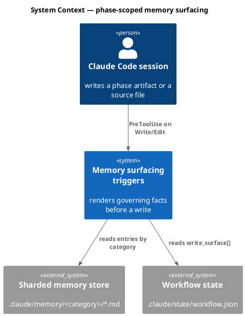

### C4 — Container

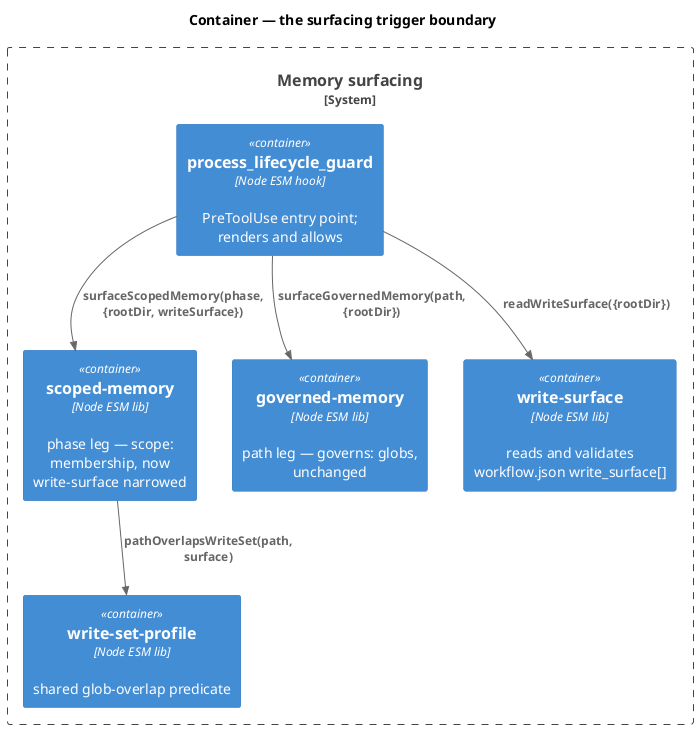

### C4 — Component (changed containers only)

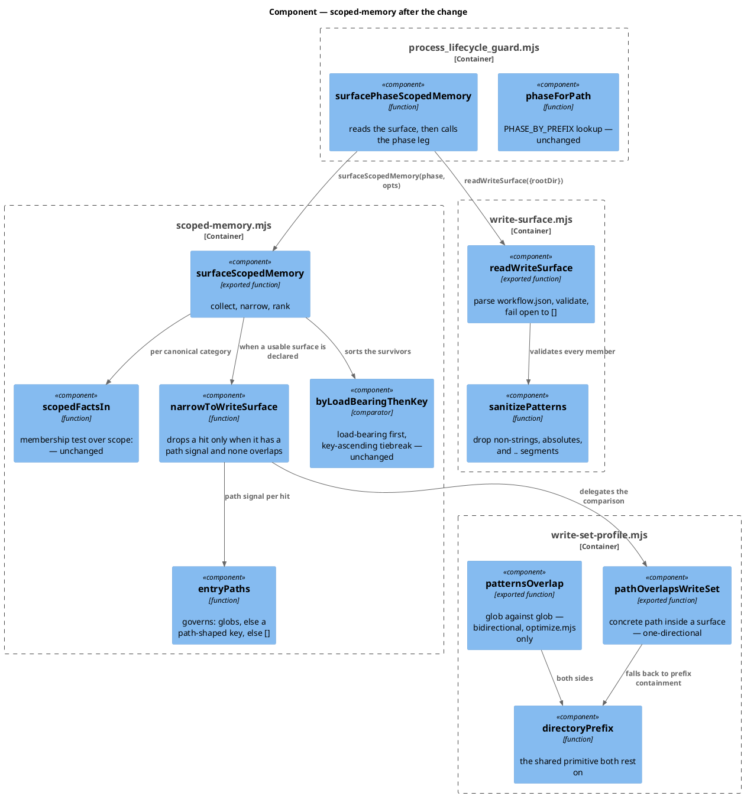

#### Why two predicates, not one

`optimize.mjs` compares a **pattern against a pattern** (an element anchor against a write-set glob) and treats either being a prefix of the other as an overlap. That bidirectionality is correct there and wrong here: under it, a surface naming the single file `.claude/hooks/lib/scoped-memory.mjs` would match every entry under `.claude/hooks/lib/`, and the filter would narrow nothing.

Run against this spec's own write set, the existing predicate reports 51 `undeclared` elements — one per element under `.claude/hooks/lib/` — because it truncates a file-level write set to its directory. That is the measured cost of the bidirectional rule, and it is why only the shared primitive `directoryPrefix` is hoisted while the two callers keep distinct predicates over it.

| Predicate | Question | Rule |
|---|---|---|
| `patternsOverlap(a, b)` | do two globs name overlapping surfaces? | bidirectional directory-prefix — today's `optimize.mjs` behaviour, unchanged |
| `pathOverlapsWriteSet(path, patterns)` | is this concrete file inside the declared surface? | glob match, else the surface's directory prefix contains the path — one-directional |

### Data model — class diagram

The shapes crossing the new boundary. No datastore is involved.

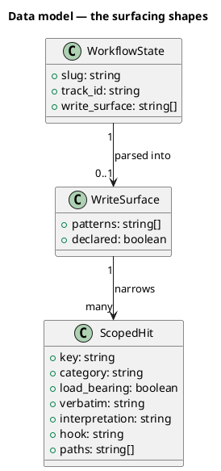

#### Migration DDL

*(none — no datastore.)* `write_surface` is an optional key on an existing JSON state file; an absent key is the pre-change state, so there is nothing to backfill and nothing to reverse. The `<<new>>` stereotype is deliberately absent from the fields above for the same reason: with no DDL to mirror, marking a field new would promise an `ALTER` that can never exist.

### Behavior — sequence per AC

#### §Behavior #1 — a declared surface narrows the phase leg

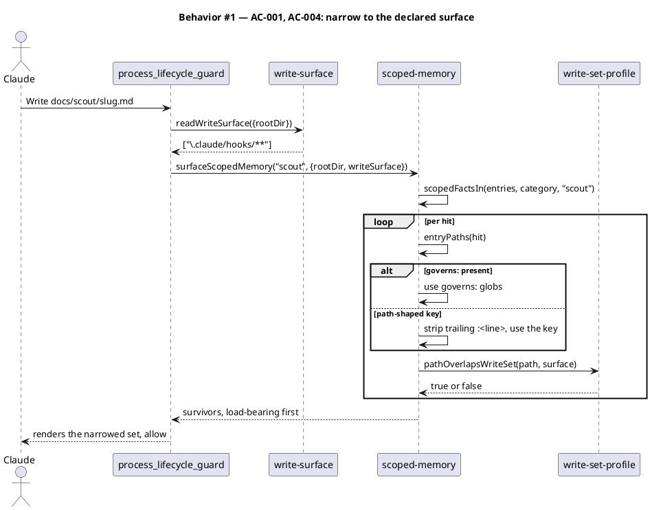

#### §Behavior #2 — no usable surface falls open

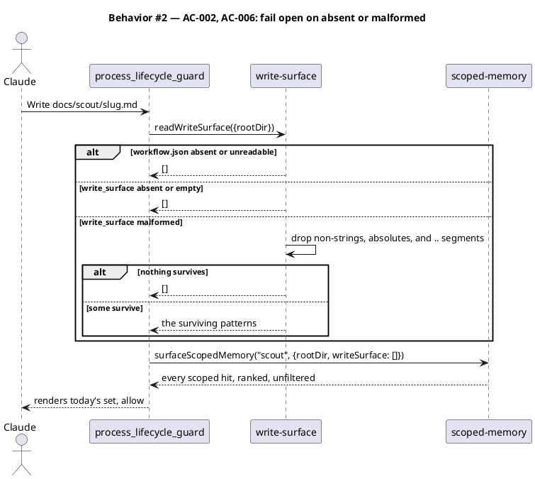

#### §Behavior #3 — an entry with no path signal always survives

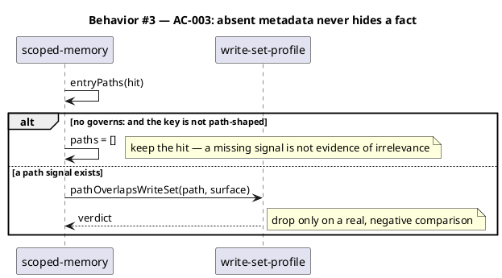

#### §Behavior #4 — one overlap predicate, two callers

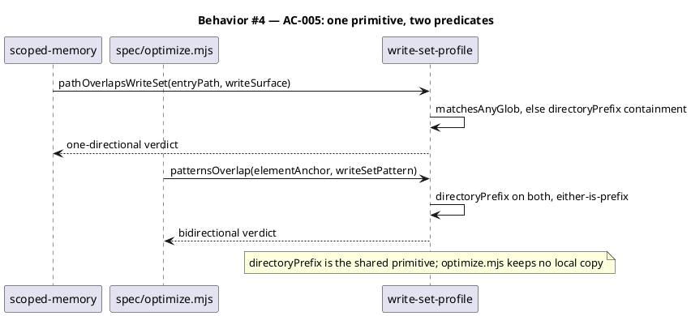

#### §Behavior #5 — /triage declares the surface

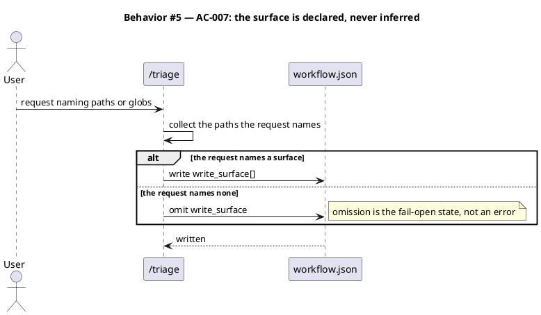

#### §Behavior #7 — a pathological glob is refused, and the matcher cannot backtrack

Added by amendment after the security review measured 133,913 ms for one match
against a 60-star pattern (`docs/security/epic6-t11-landmark-scope-rehome-2026-08-14.md`).
Two independent layers, because they cover different populations: the bound
refuses absurd input on the new path, and the matcher fix also closes the
pre-existing `project.json` callers the bound never sees.

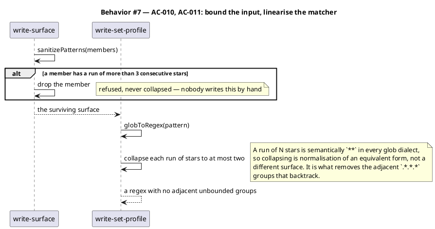

#### §Behavior #6 — the roadmap row stops quoting counts

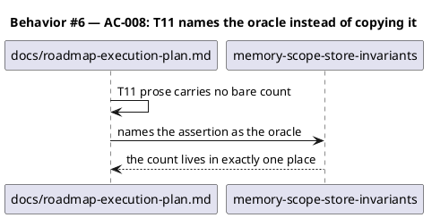

### State — core entity *(only if stateful)*

*(omitted — the filter is a pure function of its inputs and holds no state across calls. The explicit choice is recorded rather than the heading dropped.)*

### Dependencies — graph

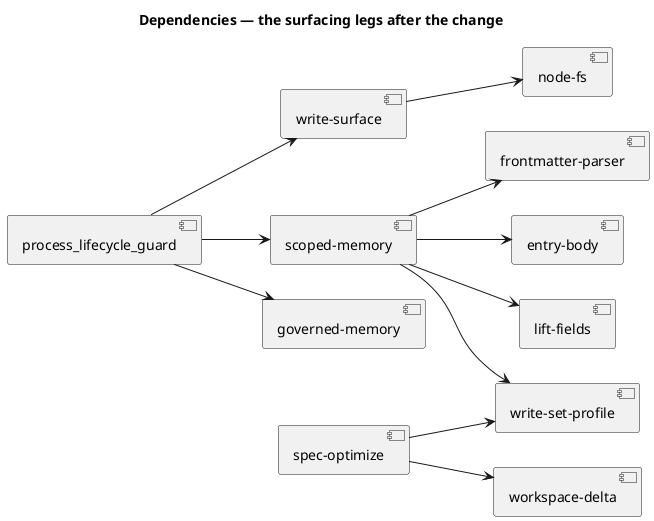

Acyclic. `write-set-profile` gains a second inbound edge and no outbound edge, so it stays a leaf of the foundation layer.

### Contracts

| Kind | Name | Input | Output | Errors | Idempotent |
|---|---|---|---|---|---|
| Function | `readWriteSurface({rootDir})` | `{rootDir: string}` | `string[]` — validated repo-relative patterns, `[]` when none | none — every failure returns `[]` | yes |
| Function | `entryPaths(entry)` | a hit's source entry (`fields`, `key`) | `string[]` — `governs:` globs, else the path-shaped key, else `[]` | none | yes |
| Function | `pathOverlapsWriteSet(path, patterns)` | `(string, string[])` | `boolean` — true when `path` is inside the surface | none — a non-array or empty `patterns` returns `false` | yes |
| Function | `patternsOverlap(a, b)` | `(string, string)` | `boolean` — bidirectional directory-prefix | none | yes |
| Function | `directoryPrefix(pattern)` | `string` | `string` — the pattern's non-wildcard directory head | none | yes |
| Function | `surfaceScopedMemory(phase, opts)` | `(string, {rootDir, writeSurface?})` | `ScopedHit[]`, load-bearing first | none — returns `[]` on a falsy `phase` or `rootDir` | yes |
| State key | `workflow.json → write_surface` | `string[]` of repo-relative globs | — | absent is legal and means "no surface declared" | — |

`surfaceScopedMemory`'s existing two-argument call sites keep working unchanged: `writeSurface` is optional and its absence is the fail-open path.

### Libraries and versions

| Library@version | Purpose | Key APIs | Confirmed against current docs |
|---|---|---|---|
| `node:fs` (Node 20 LTS, stdlib) | read `workflow.json` | `readFileSync` | yes — stdlib, no third-party API recalled |
| `node:path` (Node 20 LTS, stdlib) | join the state path | `join` | yes — stdlib |

No third-party dependency is added. The zero-runtime-dependency property both changed elements `rests_on` is preserved.

### Alternatives considered

| Alt | Summary | Rejected because |
|---|---|---|
| A | Derive `governs:` from the path-shaped key, strip `scope: [scout]` from the 87, let the path leg carry them | Scout writes only `docs/scout/<slug>.md`, so a scout run would surface zero landmarks — exactly the loss T11 names, traded for precision at a moment scout never reaches |
| B | Filter only the post-spec phase legs from the spec's `write_set` | Honest about the circularity but leaves scout's 92 untouched; closes T11 by narrowing the row rather than delivering it |
| C | Infer the write surface from the request prose at `/triage` | A confidently wrong surface hides facts silently, which is strictly worse than surfacing all of them |
| D | Widen `scope:` to accept path globs | Collapses two vocabularies into one field and forces every reader to discriminate — the shape the path leg was deliberately built to avoid |

## Program design

### Data access

| Reader | Source | Access path | Written by |
|---|---|---|---|
| `write-surface.mjs` | `.claude/state/workflow.json` | `readFileSync` + `JSON.parse`, both inside one `try` | `/triage` (creates), `/harness` + phase skills (append to `completed`) |
| `scoped-memory.mjs` | `.claude/memory/<category>/*.md` | `resolveCategory` — shape-agnostic, shard-first | `/memory-sync` only |
| `process_lifecycle_guard.mjs` | both of the above | in-process calls | nothing — read-only |
| `spec/optimize.mjs` | `docs/system/elements/*.md`, the spec draft | `readFileSync` | `/spec` (the draft), `/system-reconcile` (the corpus) |

`write_surface` has one writer (`/triage`) and one reader (`write-surface.mjs`). No second writer is introduced.

### Call stack

```
process_lifecycle_guard.mjs  (PreToolUse, Write/Edit)
  └─ surfacePhaseScopedMemory(filePath)          process_lifecycle_guard
       ├─ phaseForPath(filePath)                 process_lifecycle_guard
       ├─ readWriteSurface({rootDir})            hooks/lib/write-surface.mjs   [new]
       └─ surfaceScopedMemory(phase, opts)       hooks/lib/scoped-memory.mjs
            ├─ resolveCategory(memRoot, cat)     skills/memory-index/lift-fields.mjs
            ├─ scopedFactsIn(entries, cat, ph)   hooks/lib/scoped-memory.mjs
            ├─ narrowToWriteSurface(hits, sfc)   hooks/lib/scoped-memory.mjs   [new]
            │    ├─ entryPaths(entry)            hooks/lib/scoped-memory.mjs   [new]
            │    └─ pathOverlapsWriteSet(p, s)   hooks/lib/write-set-profile.mjs [hoisted]
            └─ sort(byLoadBearingThenKey)        hooks/lib/scoped-memory.mjs
```

The chain crosses the guard/foundation boundary twice, which is why it is drawn: `readWriteSurface` is a new hop a maintainer reading `scoped-memory.mjs` alone would not find.

### Layout

```
.claude/hooks/lib/
  write-surface.mjs            new       — read + validate workflow.json write_surface[]; fail-open to []
  scoped-memory.mjs            changed   — entryPaths + narrowToWriteSurface; surfaceScopedMemory takes writeSurface
  write-set-profile.mjs        changed   — hoist directoryPrefix; export patternsOverlap (bidirectional) + pathOverlapsWriteSet (one-directional)
.claude/hooks/
  process_lifecycle_guard.mjs  changed   — read the surface, pass it to the phase leg
.claude/skills/spec/
  optimize.mjs                 changed   — import the hoisted predicate; local copy deleted
.claude/skills/triage/
  SKILL.md                     changed   — Step 4 writes write_surface[] when the request names paths
docs/
  roadmap-execution-plan.md    changed   — T11 prose carries no bare count
tests/
  memory-scope-relevance-filter.test.mjs   new     — the filter's own suite
  memory-scope-store-invariants.test.mjs   changed — AC-009 comment re-stated as a census, not a deferral guard
```

## Design calls

The write set does not intersect `project.json → tdd.ui_globs`. No UI surface changes.

- *(none)*

## System delta

| Verb | Element | Anchor | Concept | Kind |
|---|---|---|---|---|
| add | write-surface | `.claude/hooks/lib/write-surface.mjs` | memory-model | c4_component |
| change | scoped-memory | `.claude/hooks/lib/scoped-memory.mjs` | memory-model | c4_component |
| change | surfacing-triggers | `.claude/hooks/process_lifecycle_guard.mjs` | memory-model | c4_component |
| change | write-set-profile | `.claude/hooks/lib/write-set-profile.mjs` | guard-substrate | c4_component |

## Acceptance criteria

| ID | Criterion (given / when / then) | Kind | Upstream AC | Sequence |
|---|---|---|---|---|
| AC-001 | given `workflow.json → write_surface` is `[".claude/hooks/**"]` and the store holds entries scoped to `scout`, when `surfaceScopedMemory("scout", {rootDir, writeSurface})` runs, then every returned hit has a path signal overlapping `.claude/hooks/` or no path signal at all, and at least one non-overlapping hit present in the unfiltered call is absent | behavior | roadmap T11 | §Behavior #1 |
| AC-002 | given `write_surface` is absent, `[]`, or `workflow.json` does not exist, when `surfaceScopedMemory("scout", {rootDir})` runs, then the returned array is deep-equal to the pre-change unfiltered result, in the same load-bearing-then-key order | behavior | roadmap T11 | §Behavior #2 |
| AC-003 | given an entry with no `governs:` and a non-path-shaped `key:`, when a non-empty `write_surface` is declared, then the entry is still returned | behavior | roadmap T11 | §Behavior #3 |
| AC-004 | given an entry whose `key:` is `.claude/hooks/lib/governed-memory.mjs:51` and which declares no `governs:`, when `entryPaths` runs, then it returns `[".claude/hooks/lib/governed-memory.mjs"]`; given the same entry with `governs:` present, then it returns the `governs:` globs and not the key | behavior | roadmap T11 | §Behavior #1 |
| AC-005 | given the repository at HEAD, when `.claude/skills/spec/optimize.mjs` is read, then it declares no local `overlapsWriteSet` or `directoryPrefix` function and imports `patternsOverlap` from `.claude/hooks/lib/write-set-profile.mjs`; and given a surface naming one file, when `pathOverlapsWriteSet` is asked about a sibling file in the same directory, then it returns `false` where `patternsOverlap` returns `true` | behavior | backlog `terminal-sanitizer-duplicated-across-standup-and-deferral-checker` (same class) | §Behavior #4 |
| AC-006 | given `write_surface` contains a non-string, an absolute path, or a segment equal to `..`, when `readWriteSurface` runs, then those members are dropped before any path comparison, and a surface with no surviving member returns `[]` | preflight | CWE-22 | §Behavior #2 |
| AC-007 | given `/triage` runs on a request naming one or more paths, when it writes `workflow.json`, then `write_surface[]` carries those paths; given a request naming none, then the key is omitted | behavior | roadmap T11 | §Behavior #5 |
| AC-008 | given `docs/roadmap-execution-plan.md`, when the T11 row is read, then it contains no bare landmark or surfaced-fact count and names `tests/memory-scope-store-invariants.test.mjs` as the oracle instead | behavior | backlog `roadmap-t11-quotes-two-counts-that-have-both-moved` | §Behavior #6 |
| AC-009 | given the full suite runs with no `write_surface` declared anywhere in the tree, when `node --test tests/*.test.mjs` completes, then it is green, and `PHASE_BUDGETS` in `memory-scope-store-invariants.test.mjs` is satisfied unchanged | smoke | regression | §Behavior #2 |
| AC-010 | given a `write_surface` member containing a run of more than 3 consecutive `*`, when `readWriteSurface` runs, then that member is dropped before any match; and given a legitimate `**/` or `.claude/hooks/**` member, then it survives | preflight | CWE-1333 | §Behavior #7 |
| AC-011 | given any pattern with a run of N consecutive `*`, when `globToRegex` compiles it, then the emitted regex contains no adjacent unbounded groups, and `pathOverlapsWriteSet` on a 60-star pattern against a 400-character path returns in under 100 ms; and given the existing `project.json` callers (`diagram_profiles[].when`, `security.sensitive_globs`), then their resolved profiles are unchanged | preflight | CWE-1333 | §Behavior #7 |

No AC row defers spec-committed scope, so no row carries a `deferred:` tag.

**Amendment note (post-security-review).** AC-010 and AC-011 were added after gate A, on the human's explicit direction, when the security phase measured catastrophic backtracking reachable through this change's new input path. AC-011 deliberately extends past this change's own surface to the two pre-existing `project.json` callers: the defect predates this workflow, and fixing only the path this diff opened would leave the same hang reachable by another route. The pre-existing exposure is named in the security report's *Out of scope / Noted* section, and this amendment brings it in scope rather than leaving it filed.

## Test plan

| Category | Scenario | Expected | Covers |
|---|---|---|---|
| Golden path | fixture store with three `scope: [scout]` entries — one `governs:` inside the surface, one path-keyed outside it, one path-keyed inside | the two inside survive; the outside one is dropped | AC-001 |
| Golden path | `entryPaths` on a `governs:`-bearing entry and on a path-keyed-only entry | `governs:` globs win; the key resolves with its `:<line>` suffix stripped | AC-004 |
| Input boundary | `write_surface` = `[]`, absent key, `workflow.json` missing, `workflow.json` holding invalid JSON | all four return the full unfiltered ranked set | AC-002 |
| Input boundary | entry with `key: durable-plan-state-subsystem-424f` (no slash, no `governs:`) under a declared surface | returned | AC-003 |
| Input boundary | `write_surface` = `["\.claude/**"]` vs an entry path `.claude/hooks/lib/x.mjs`; and `write_surface` = `[".claude/hooks/"]` (no glob) vs the same path | both overlap — the predicate is bidirectional on directory prefixes | AC-001 |
| Contract violation | `write_surface` = `["/etc/passwd", "../../secrets", 42, null]` | every member dropped; result `[]`; surfacing falls open | AC-006 |
| Contract violation | `write_surface` = `"a string, not an array"` | treated as no surface; result `[]` | AC-006 |
| Concurrency / ordering | narrowing applied before the sort | survivors are still load-bearing first, key-ascending — narrowing never reorders | AC-002 |
| Failure mode | `resolveCategory` throws for one category while a surface is declared | the phase leg's existing behaviour is unchanged by this spec; no new catch is introduced | AC-002 |
| Regression trap | `.claude/skills/spec/optimize.mjs` source scanned for a local `function overlapsWriteSet` / `function directoryPrefix` | absent; `patternsOverlap` imported | AC-005 |
| Contract violation | surface `[".claude/hooks/lib/scoped-memory.mjs"]` vs entry path `.claude/hooks/lib/governed-memory.mjs` | `pathOverlapsWriteSet` false; `patternsOverlap` true — the two predicates are provably distinct | AC-005 |
| Regression trap | `spec-optimize` suite run unchanged after the hoist | green — the hoisted predicate is behaviour-identical | AC-005 |
| Regression trap | T11 row scanned for a digit sequence adjacent to `landmark` or `surface` | none found | AC-008 |
| Regression trap | full suite with no `write_surface` in the tree | green; phase budgets satisfied | AC-009 |
| Contract violation | `write_surface` member `'*'.repeat(60) + 'x'` | dropped by `sanitizePatterns`; surface excludes it | AC-010 |
| Input boundary | members `**/`, `.claude/hooks/**`, `a/**/b` | all survive — the bound refuses runs above 3, not ordinary globs | AC-010 |
| Failure mode | `pathOverlapsWriteSet(400-char path, ['*'.repeat(60) + 'x'])` timed | returns in under 100 ms | AC-011 |
| Regression trap | `resolveProfile` over the live `diagram_profiles[].when` and `security.sensitive_globs` | profiles resolve exactly as before the matcher change | AC-011 |
| Input boundary | `globToRegex` on `*`, `**`, `***`, `****` | `***` and `****` compile identically to `**`; `*` and `**` unchanged | AC-011 |

## Observability

| Signal | Name | Shape | Purpose |
|---|---|---|---|
| Log | `process_lifecycle_guard` surfaced line | existing `logLine` gains `(narrowed from N)` when a surface applied | shows whether the filter fired and how hard, without a second log site |
| Rendered header | the phase-scoped stderr block | names the declared surface when one applied | the reader can tell a narrow set from an empty store |

No metric or alarm: this is a synchronous in-process hook with no service surface to page on.

## Rollout

### Prerequisites

| # | Prerequisite | enforced-by |
|---|---|---|
| 1 | A malformed or hostile `write_surface` member is rejected before any path comparison, so a traversal pattern can never reach the matcher | AC-006 |
| 2 | The suite is green with no `write_surface` declared anywhere, proving the fail-open path is the pre-change behaviour | AC-009 |

- **Feature flag**: none. The absence of `workflow.json → write_surface` **is** the off state, and it is the default for every existing workflow on disk. A flag would add a second way to express what an absent key already says.
- **Migration order**: 1 hoist the predicate → 2 add `write-surface.mjs` → 3 narrow `scoped-memory.mjs` → 4 wire the guard → 5 teach `/triage` to declare → 6 rewrite the T11 row. Steps 1–4 are inert until step 5 produces a surface.
- **Canary**: this repository. `/triage` starts declaring on the next workflow; the filter is observable in the guard's stderr block on the first phase-artifact write.

## Rollback

- **Kill-switch**: remove `write_surface` from `.claude/state/workflow.json`. Every code path falls open to the pre-change ranked set on the next write. No deploy, no revert, no restart.
- **Signal to roll back**: a phase-scoped stderr block that names a surface and renders zero hits while the store holds entries for that phase. Visible on the first write of the phase, well inside 5 minutes.

## Archive plan

- Defaults *(automatic)*: spec, spec-rendered/, spec approval, security report.
- Extras *(list any non-default files)*:
  - *(none)*

## Open questions

- *(none)* — the one load-bearing fork, which oracle supplies the write surface given scout discovers it, was settled before drafting: a declared surface with fail-open semantics. Alternatives A–D above record what was rejected and why.
