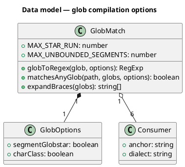
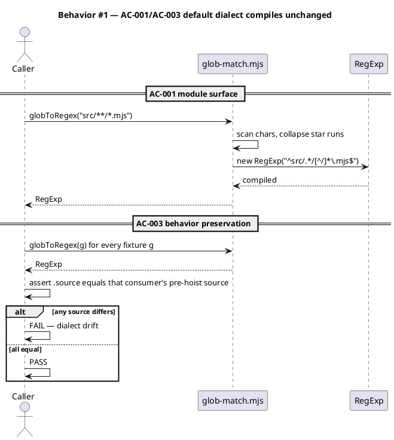
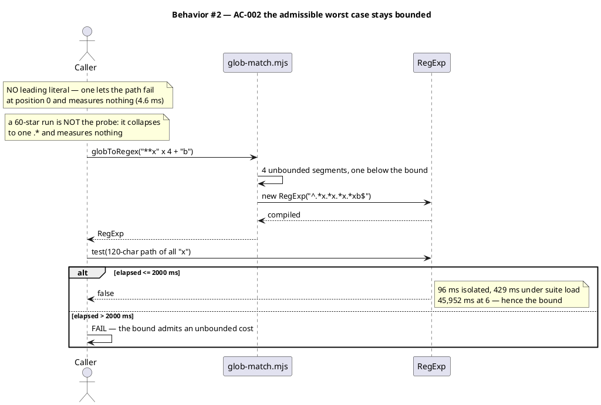
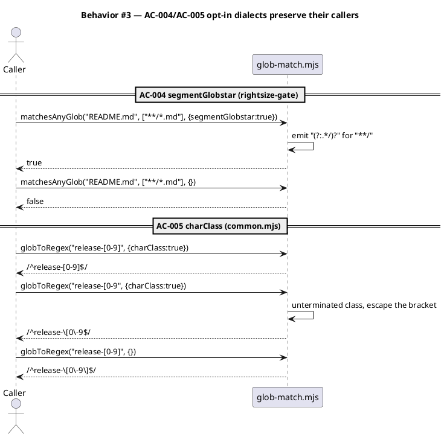
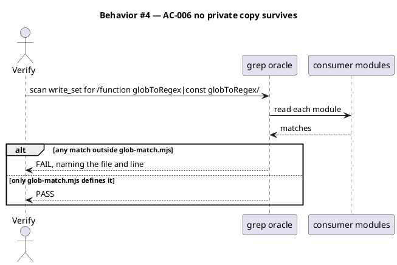
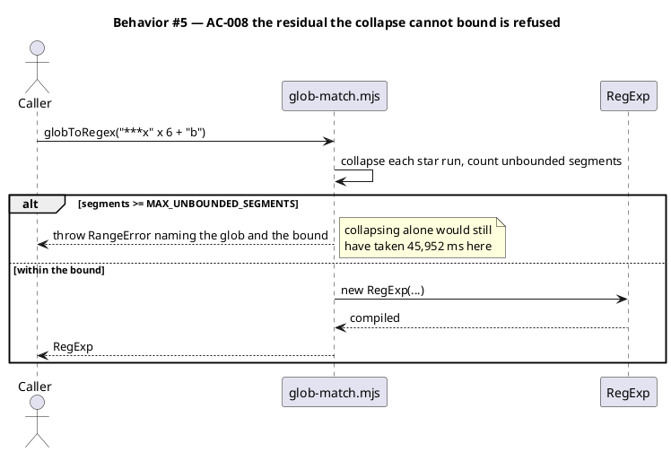
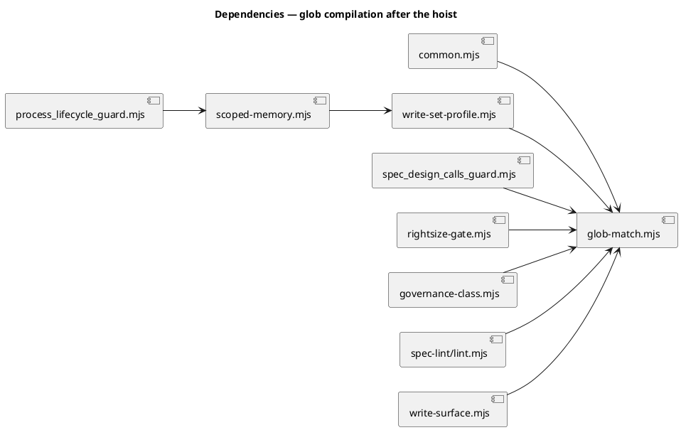

# Hoist globToRegex into one foundation module

## Context

| Input | Path |
|---|---|
| Intake | *(excepted at triage — spec-entry track)* |
| BRD *(if any)* | *(none)* |
| Scout *(if any)* | *(excepted at triage)* |
| Research *(if any)* | *(excepted at triage)* |
| Backlog | `.claude/memory/backlog/globtoregex-is-copied-nine-times-and-four-copies-backtrack-7a3e.md` |
| Prior security analysis | `docs/archive/2026-08-14/epic6-t11-landmark-scope-rehome/security.md` |

**Write set**: `.claude/hooks/lib/glob-match.mjs`, `.claude/hooks/lib/common.mjs`, `.claude/hooks/lib/write-set-profile.mjs`, `.claude/hooks/lib/write-surface.mjs`, `.claude/hooks/spec_design_calls_guard.mjs`, `.claude/skills/harness/rightsize-gate.mjs`, `.claude/skills/triage/governance-class.mjs`, `.claude/skills/spec-lint/lint.mjs`, `tests/**`

> **Amended 2026-08-15, after approval — four times.**
>
> **First amendment, during `/scenario`.** AC-002 targeted the right defect but did not pin its probe path, and a path that fails at the pattern's leading literal exits in microseconds against broken code — so the test could pass or fail on an unstated choice. Separately, the star-run collapse cures a single long run completely but leaves multiple runs separated by literals exponential, which nothing in this spec covered. AC-008 was added.
>
> **Second amendment, during `/implement`.** The first amendment left AC-002 and AC-008 contradicting each other: AC-002 probed with a 60-star run, and AC-008 refused any run of 3 or more, so the probe threw before it could be timed. The test caught it on the first run. AC-002 was repointed at the admissible worst case. *(Its reasoning — "the bound subsumes the collapse" — is superseded by the third amendment, which removed the star-run refusal it rested on.)*
>
> **Third amendment, during `/implement`.** Two things the tests caught. `MAX_STAR_RUN` as a *compile-time refusal* contradicted two already-green tests that assert 3 and 4 stars collapse to `.*`; it is now the declaration-boundary bound `write-surface.mjs` already applied, exported from the shared module so there is one definition, and the compiler enforces only `MAX_UNBOUNDED_SEGMENTS`. And AC-002's ceiling was measured in isolation (96 ms) but the test runs inside a 2,952-test parallel suite (429 ms), so the ceiling is retuned for load — the oracle is the ~100x gap to six segments, not the absolute number.
>
> **Fourth amendment, during `/implement`.** The third amendment changed the code and this note but left the AC-008 row and the §Design paragraph still asserting a compile-time star-run refusal. Both now state what ships: any star run collapses, `MAX_UNBOUNDED_SEGMENTS` is the sole compile-time refusal, and `MAX_STAR_RUN` drops a malformed member at the declaration boundary. No code changed for this amendment — the spec caught up to it. Separately, three sandbox tests stage hook libs into a temp tree file by file, so each now stages `glob-match.mjs` alongside `common.mjs`, which imports it.
>
> Every number below is measured, not reasoned. Re-approval required.

## Goal

One foundation module owns glob-to-RegExp compilation, every in-repo caller compiles through it, no caller's matching behavior changes, and a pattern whose cost the collapse cannot bound is refused at compile time instead of hanging the session.

## Non-goals

- The four vendored copies under `.claude/skills/impeccable/scripts/`. They are third-party; editing them creates a merge burden at the next vendor sync, and they are unreachable from any guard path.
- Changing what any guard matches on a **well-formed** glob. This is a refactor with a correctness fix inside it. A widened or narrowed match on real config is a defect, not an improvement. Refusing a pathological pattern is a deliberate behavior change and is specified in AC-008.
- A general-purpose glob library. Three dialects exist because three consumers need them; a fourth is not built until a fourth consumer asks.
- Brace expansion semantics. `expandBraces` moves as-is because `matchesAnyGlob` cannot be shared without it. Its behavior is unchanged.
- Making every regex this module emits linear-time. That is a rewrite to a backtracking-free matcher, not a hoist. This spec bounds the residual instead; alternative F records the upgrade path.

## Design

### Structural reference

@ref element:hooks-common-lib

### The problem is not duplication alone

Six in-repo copies of `globToRegex` exist. They are **not** interchangeable. Reading them shows three dialects:

| Dialect | Copies | Distinguishing rule |
|---|---|---|
| D1 — majority | `spec_design_calls_guard.mjs`, `governance-class.mjs`, `spec-lint/lint.mjs`, and `write-set-profile.mjs` | `**` → `.*`; `[` is escaped as a literal |
| D2 — segment globstar | `rightsize-gate.mjs` | `**/` → `(?:.*/)?`, so `**/*.md` matches a top-level `README.md` |
| D3 — character class | `common.mjs` | `[...]` passes through as a RegExp character class; an unterminated `[` is escaped |

`write-set-profile.mjs` is D1 plus the 2026-08-14 star-run collapse, so it alone compiles `***` to `.*` where its D1 siblings compile `.*[^/]*`. The fixture corpus is keyed **per consumer** for exactly this reason; a single shared expectation table would report that difference as drift.

A naive hoist onto any single dialect silently changes what two guards match. `common.mjs` compiles `git.protected_branches`, so widening it changes which branches demand consent. That is the reason this is a spec and not a quickfix.

### The defect being fixed

One correction to the backlog first: every unfixed copy consumes **two** stars per iteration, not one — the `**` branch does `i++` inside a `for` loop that also increments. A 60-star run compiles to 30 groups, not 60. The count differs; the consequence does not.

**A single long run is catastrophic, and the collapse cures it.** Measured against a 120-character non-matching path:

| Glob | Copy | Compiles to | Elapsed |
|---|---|---|---|
| 60 `*` + `b` | unfixed `governance-class.mjs` | `^.*.*.*…b$` (30 groups) | **130,804 ms** |
| 60 `*` + `b` | collapsed `write-set-profile.mjs` | `^.*b$` | **0.0 ms** |

That is the defect the backlog describes and the fix it credits, and both are real.

**The probe path is load-bearing, which is what AC-002 failed to pin.** The same unfixed pattern written as `a` + 60 `*` + `b` and tested against a path of all `x` returns in 4.6 ms — not because the regex is cheap, but because it fails at the leading `a` before exploring anything. Against a path that starts with `a`, the same call exceeds 15 s. A probe that does not engage the pattern measures nothing while looking like a timing test. AC-002 now pins a pattern with no leading literal.

**What the collapse does not cure: multiple runs separated by literals.** Collapsing rewrites `.*[^/]*x` to `.*x`, which is faster and still exponential. Measured against the already-collapsed `write-set-profile.mjs`:

| `***x` segments | Collapsed source | Elapsed |
|---|---|---|
| 3 | `^.*x.*x.*xb$` | 9 ms |
| 4 | `^.*x.*x.*x.*xb$` | 96 ms |
| 5 | `^.*x.*x.*x.*x.*xb$` | 2,351 ms |
| 6 | `^.*x.*x.*x.*x.*x.*xb$` | 45,952 ms |

Roughly 20× per added segment. The module the backlog calls fixed still hangs for 46 seconds here. Collapsing is a real cure for one shape and no defense for this one, so this spec adds a bound (AC-008) rather than claiming the collapse is enough.

**The compiler enforces one bound, and star-run length is not it.** A star run of any length collapses to a single `.*`, measured at 0.0 ms against a 120-character path, so refusing a long run buys nothing the collapse has not already bought — and two shipped tests (`memory-scope-relevance-filter`) assert that 3 and 4 stars collapse. Refusing at compile time would have contradicted them for no measured gain. `MAX_UNBOUNDED_SEGMENTS` is therefore the only compile-time refusal: it is the bound that tracks the measured cliff, since six runs separated by literals still cost 45,952 ms **after** collapsing.

That is why AC-002 probes the admissible worst case rather than a long run — a long run is cheap once collapsed, so timing one proves nothing. Multiple segments are the only cost the module can still incur.

`write-surface.mjs` already dropped declared surface members whose star runs reach `\*{4,}`, and it still does. That is a **declaration-boundary** judgement, not a performance defense: a human wrote the surface, and a member this shape is malformed rather than slow. The threshold moves into the shared module as the exported `MAX_STAR_RUN` so one definition serves every caller, and the compiler does not enforce it.

### Choosing the bounds

Measured across all 45 distinct globs the live `project.json` declares:

| Signal | Real-world maximum | Bound chosen | Headroom | Role |
|---|---|---|---|---|
| Consecutive stars in one run | 2 (`src/**`) | refuse 3 or more | 1 | refuses a typo early; also what makes the collapse performance-irrelevant |
| `.*`-producing segments in one glob | 2 (`**/auth/**`) | refuse 5 or more | 3 | **load-bearing** — the only defense against the residual above |

Four segments measure 96 ms, so the segment bound keeps the worst admissible pattern two orders of magnitude below the 46-second case. Both bounds sit above every glob the repo actually writes, so a refusal means a genuinely malformed pattern and never a working config.

### Data model — class diagram



`GlobOptions` has no persisted form and no DDL — it is a call-site argument object, not a stored entity.

#### Migration DDL

```sql
-- No relational store is involved. This change has no schema and no migration.
-- forward:  (none)
-- reverse:  (none)
```

### Behavior — sequence per AC











### Dependencies — graph



The graph is acyclic. `glob-match.mjs` is a leaf: it imports nothing from `.claude/`.

### Contracts

| Kind | Name | Input | Output | Errors | Idempotent |
|---|---|---|---|---|---|
| Function | `globToRegex(glob, options?)` | `glob: string`, `options?: {segmentGlobstar?: boolean, charClass?: boolean}` | anchored `RegExp` (`^…$`) | `TypeError` when `glob` is not a string; `RangeError` when unbounded segments reach `MAX_UNBOUNDED_SEGMENTS` | yes — same input, equal `.source` |
| Function | `matchesAnyGlob(path, globs, options?)` | `path: string`, `globs: string[]`, same options | `boolean` | a non-array `globs` returns `false`; a `RangeError` from a member **propagates** | yes |
| Function | `expandBraces(globs)` | `globs: string[]` | `string[]`, one entry per alternative | none — a malformed brace returns the input entry unchanged | yes |
| Constant | `MAX_STAR_RUN` | — | `3` — the longest run `write-surface.mjs` accepts in a declared surface member; not enforced by the compiler | — | — |
| Constant | `MAX_UNBOUNDED_SEGMENTS` | — | `5` — this many `.*` groups or more is refused | — | — |

Defaults: both options are `false`, which is dialect D1. `rightsize-gate.mjs` passes `{segmentGlobstar: true}`; `common.mjs` passes `{charClass: true}`. Every other caller passes nothing.

Escape set: `.+()|^$\{}` is escaped in every dialect. `[` and `]` are escaped only when `charClass` is `false`, which is what preserves D1 and D3 simultaneously.

The `RangeError` propagating out of `matchesAnyGlob` is deliberate. Every caller reads repo-local config, so a refusal is a loud, immediately-attributable config error naming the offending glob. Swallowing it would restore the silent hang this spec exists to remove.

### Libraries and versions

| Library@version | Purpose | Key APIs | Confirmed against current docs |
|---|---|---|---|
| *(none)* | This change adds no dependency. It uses `RegExp` and `String` only. | — | n/a |

The repo holds a `zero-runtime-dependencies` constraint (`docs/system/elements/hooks-common-lib.md → rests_on`). No third-party glob library is introduced, so the current-docs rule (CLAUDE.md VI.5) has nothing to confirm.

### Alternatives considered

| Alt | Summary | Rejected because |
|---|---|---|
| A | Leave the copies; apply the run-collapse to each. | Fixes the symptom and keeps six drift surfaces. The next copy inherits the bug, which is exactly how this reached six. |
| B | One superset function: character classes and segment-globstar always on. | Silently changes what `common.mjs` matches for `git.protected_branches` and what `spec_design_calls_guard` denies. A consent-relevant guard must not change behavior inside a refactor. |
| C | Adopt a third-party glob library (`minimatch`, `picomatch`). | Breaks the `zero-runtime-dependencies` constraint the hook substrate rests on. |
| D | Hoist into `write-set-profile.mjs`, which already exports the fixed copy. | That module is domain logic about write-set profiles. Six unrelated callers importing it inverts the layering; `common.mjs` would depend on a module that depends on nothing it needs. |
| E | Hoist and collapse only, with no input bound — the pre-amendment plan. | Measured: the collapsed form is still 45,952 ms at six segments. The collapse cures one shape and leaves this one, and nothing in the pre-amendment spec covered it. |
| F | Rewrite as a linear-time matcher (no backtracking). | Correct, and far beyond a hoist. Bounding the residual buys the same safety for this threat model, where every glob is repo-local config. Recorded as the upgrade path if a caller ever compiles untrusted input. |

## Program design

### Data access

| Reader | Source | Access path | Written by |
|---|---|---|---|
| `glob-match.mjs` | its two arguments | in-process call | nothing — pure, no IO |
| `common.mjs` | `project.json → git.protected_branches` | `projectGet`, then `matchAnyGlob` | the human, in `project.json` |
| `rightsize-gate.mjs` | `project.json → tdd.test_globs` | `matchesAnyGlob` | the human, in `project.json` |
| `spec_design_calls_guard.mjs` | `project.json → tdd.ui_globs` | `matchesAnyGlob` | the human, in `project.json` |
| `governance-class.mjs` | the workflow's write set | `matchesAny` | `/triage`, in `workflow.json` |
| `spec-lint/lint.mjs` | the spec's `write_set` line | `matchesAnyGlob` | `/spec` |
| `write-set-profile.mjs` | `project.json → artifacts.diagram_profiles` | `matchesAnyGlob` | the human, in `project.json` |
| `write-surface.mjs` | `workflow.json → write_surface` | `sanitizePatterns`, then the shared bound | `/triage`, in `workflow.json` |

Every source is repo-local config or repo-local workflow state. None is user-supplied text from outside the repository, which is what holds the CWE-1333 severity at MEDIUM: a self-inflicted stall of the developer's own session, not a remotely reachable denial of service. It is also what makes bounding the residual (alternative F rejected) the proportionate defense.

### Call stack

```
process_lifecycle_guard.mjs (PreToolUse)
  └─ surfaceScopedMemory              scoped-memory.mjs
       └─ pathOverlapsWriteSet        write-set-profile.mjs
            └─ matchesAnyGlob         write-set-profile.mjs
                 └─ globToRegex       glob-match.mjs        <- IO-free leaf

git_commit_guard.mjs (PreToolUse)
  └─ matchAnyGlob                     common.mjs
       └─ globToRegex                 glob-match.mjs        <- same leaf
```

Load-bearing: the leaf sits under two guards on the write and Bash boundaries. A stall there stalls every tool call, which is why AC-002 asserts the collapse with an engaging probe and AC-008 refuses the residual outright, rather than either being left to code review.

### Layout

```
.claude/hooks/lib/
  glob-match.mjs             new       — the one compiler; exports globToRegex, matchesAnyGlob, expandBraces, both bounds
  common.mjs                 changed   — private globToRegex deleted; imports with {charClass:true}
  write-set-profile.mjs      changed   — private globToRegex deleted; re-exports globToRegex for its existing importers
  write-surface.mjs          changed   — local MAX_STAR_RUN deleted; imports the shared bound
.claude/hooks/
  spec_design_calls_guard.mjs changed  — private globToRegex + expandBraces deleted; imports
.claude/skills/harness/
  rightsize-gate.mjs         changed   — private copies deleted; imports with {segmentGlobstar:true}
.claude/skills/triage/
  governance-class.mjs       changed   — private copies deleted; imports
.claude/skills/spec-lint/
  lint.mjs                   changed   — private copies deleted; imports
tests/
  glob-match.test.mjs        new       — per-consumer dialect corpus, collapse timing, refusal bounds, no-surviving-copy oracle
  fixtures/glob-corpus.json  new       — 53 globs x 4 consumers, sources captured from the live pre-hoist copies
```

`write-set-profile.mjs` re-exports `globToRegex` because it is already an exported name with in-repo importers. Deleting the export would be a second, unrelated breaking change.

## Design calls

The write set intersects no path in `project.json → tdd.ui_globs`. No UI surface changes.

- *(none)*

## System delta

| Verb | Element | Anchor | Concept | Kind |
|---|---|---|---|---|
| add | glob-match | `.claude/hooks/lib/glob-match.mjs` | guard-substrate | c4_component |
| change | hooks-common-lib | `.claude/hooks/lib/common.mjs` | guard-substrate | c4_component |
| change | write-set-profile | `.claude/hooks/lib/write-set-profile.mjs` | guard-substrate | c4_component |
| change | write-surface | `.claude/hooks/lib/write-surface.mjs` | memory-model | c4_component |
| change | spec-design-calls-guard | `.claude/hooks/spec_design_calls_guard.mjs` | design-routing | c4_component |

`rightsize-gate.mjs`, `governance-class.mjs`, and `spec-lint/lint.mjs` are not anchored as elements today, and this spec does not add them: their shape does not change, only where they import a helper from.

## Acceptance criteria

| ID | Criterion (given / when / then) | Kind | Upstream AC | Sequence |
|---|---|---|---|---|
| AC-001 | given `.claude/hooks/lib/glob-match.mjs`, when imported, then it exports `globToRegex`, `matchesAnyGlob`, `expandBraces`, `MAX_STAR_RUN` and `MAX_UNBOUNDED_SEGMENTS`, and imports nothing from `.claude/` | behavior | backlog `-7a3e` "hoist into one shared foundation module" | §Behavior #1 |
| AC-002 | given the admissible worst case `'**x'.repeat(4) + 'b'` — four unbounded segments, one below `MAX_UNBOUNDED_SEGMENTS`, and **no leading literal** so the probe engages rather than failing at position 0 — when compiled and tested against a 120-character path of all `x`, then the call returns `false` in ≤ 2,000 ms | behavior | measured 2026-08-15: 96 ms at 4 segments in isolation, 429 ms inside the full parallel suite, 45,952 ms at 6. The ceiling is set for suite load; the signal is the ~100x gap to 6 segments, not the absolute number. A long run is not probed here because the compiler collapses it | §Behavior #2 |
| AC-003 | given the fixture corpus of 53 globs keyed per consumer, drawn from the live `project.json` and `workflow.json` values each consumer reads, when compiled at that consumer's options, then every `RegExp.source` equals the source that consumer's pre-hoist copy produced | behavior | backlog `-7a3e` "prefer hoisting" | §Behavior #1 |
| AC-004 | given `{segmentGlobstar: true}`, when `**/*.md` is matched against `README.md`, then the result is `true`; at default options the same match is `false` | behavior | dialect D2, `rightsize-gate.mjs:37` | §Behavior #3 |
| AC-005 | given `{charClass: true}`, when `release-[0-9]` is compiled, then `[0-9]` is a character class; when `release-[0-9` is compiled, then the bracket is escaped as a literal; at default options both brackets are escaped | behavior | dialect D3, `common.mjs:482` | §Behavior #3 |
| AC-006 | given the write set, when scanned for `function globToRegex` or `const globToRegex`, then `.claude/hooks/lib/glob-match.mjs` is the only file that matches | preflight | backlog `-7a3e` "delete the copies" | §Behavior #4 |
| AC-007 | given `obj/template/.claude/manifest.json`, when the build runs, then `.claude/hooks/lib/glob-match.mjs` appears in `files` with a sha256 | preflight | `spec-shippability-review` — a consumer install must have every imported module | §Behavior #4 |
| AC-008 | given a glob whose unbounded segments reach `MAX_UNBOUNDED_SEGMENTS` (5), when compiled, then `globToRegex` throws a `RangeError` naming the glob and the bound it breached, and constructs no `RegExp`; and given a star run of any length, then it collapses to one `.*` and is never refused; and given a surface member declared to `write-surface.mjs` whose star run exceeds `MAX_STAR_RUN` (3), then that member is dropped at the declaration boundary; and given all 45 globs the live `project.json` declares, then none is refused | preflight | measured 2026-08-15: `'***x'.repeat(6)` runs 45,952 ms even after the collapse; real-world max is 2 stars / 2 segments | §Behavior #5 |

## Test plan

| Category | Scenario | Expected | Covers |
|---|---|---|---|
| Golden path | import the module, compile `src/**/*.mjs` | anchored RegExp, matches `src/a/b.mjs`, rejects `src/a/b.js` | AC-001 |
| Golden path | compile each of the 53 corpus globs at its consumer's options | `.source` equals that consumer's recorded pre-hoist source | AC-003 |
| Input boundary | `'**x'.repeat(4) + 'b'` against a 120-char all-`x` path | compiles to `^.*x.*x.*x.*xb$`, returns `false` within 2,000 ms (ceiling set for parallel-suite load) | AC-002 |
| Input boundary | `'a' + '*'.repeat(60) + 'b'` against an all-`x` path, compiled by an inlined pre-hoist reference | documented as returning in ~4 ms even uncollapsed, because it fails at the leading `a`; asserted only to keep the anti-pattern named, never used as the timing oracle | AC-002 |
| Input boundary | star runs of 2, 3 and 60 | all collapse to one `.*`, equal `.source`, no throw | AC-008 |
| Input boundary | declared surface member with a run of `MAX_STAR_RUN` and of `MAX_STAR_RUN + 1` | `sanitizePatterns` keeps the first and drops the second | AC-008 |
| Input boundary | 4 unbounded segments and exactly 5 | 4 compiles; 5 throws `RangeError` | AC-008 |
| Input boundary | empty glob `""`; single `*`; single `**` | compiles without throwing; anchored | AC-001 |
| Input boundary | unterminated `[` with and without `charClass` | escaped literal in both cases | AC-005 |
| Contract violation | `globToRegex(null)` and `globToRegex(42)` | throws `TypeError` | AC-001 |
| Contract violation | `matchesAnyGlob("p", null)` | returns `false`, does not throw | AC-001 |
| Contract violation | `matchesAnyGlob("p", ["***x***x***x***x***x***xb"])` | the `RangeError` propagates, naming the glob | AC-008 |
| Concurrency / ordering | *(not applicable — the module is pure and holds no state)* | — | — |
| Failure mode | a consumer passes an unknown option key | ignored; default dialect used | AC-001 |
| Regression trap | every glob in the live `project.json` compiles without throwing | 45/45 admitted | AC-008 |
| Regression trap | grep the write set for a surviving private `globToRegex` | only `glob-match.mjs` matches | AC-006 |
| Regression trap | `**/*.md` vs `README.md` under both option settings | `true` with `segmentGlobstar`, `false` without | AC-004 |
| Regression trap | full suite: `node .claude/skills/audit-baseline/audit.mjs && node --test tests/*.test.mjs` | green | AC-003, AC-007 |

## Observability

| Signal | Name | Shape | Purpose |
|---|---|---|---|
| Test | `glob-match dialect corpus` | pass/fail per corpus entry, naming the glob and the consumer that drifted | catches a dialect change at the point it is introduced |
| Test | `glob-match admissible worst case` | elapsed ms against a 2,000 ms ceiling at four segments, on an engaging probe | catches a bound raised without re-measuring; the engaging probe is what makes it a real oracle, and the ceiling clears suite-load jitter while staying ~20x under the six-segment cost |
| Test | `glob-match refusal bounds` | pass/fail at each bound's edge, plus 45/45 live globs admitted | catches a bound tightened onto real config, or loosened past the measured cliff |
| Test | `no surviving private copy` | pass/fail, naming file and line | catches a seventh copy being added |

There is no runtime metric or alarm. This code runs inside hooks in a developer's local session; there is no service, no deployment, and nothing to page.

## Rollout

### Prerequisites

| # | Prerequisite | enforced-by |
|---|---|---|
| 1 | Every consumer module imports from `glob-match.mjs` and defines no private copy | AC-006 |
| 2 | `glob-match.mjs` is in the shipped manifest, so a consumer install can resolve the import | AC-007 |
| 3 | No glob the live `project.json` declares is refused by either bound | AC-008 |

- **Feature flag**: none. A flag would mean keeping both code paths, which is the duplication this spec removes.
- **Migration order**: 1 add `glob-match.mjs` with tests → 2 repoint the four unfixed consumers → 3 repoint `spec-lint/lint.mjs` → 4 repoint `write-set-profile.mjs` and keep its re-export → 5 repoint `write-surface.mjs` onto the shared bound → 6 delete every private copy.
- **Canary**: none. The change lands whole in one commit behind the full suite; a partial landing would leave two dialects live at once.

## Rollback

- **Kill-switch**: `git revert <sha>`. The change is one commit with no state, no migration, and no flag.
- **Signal to roll back**: any guard denying or allowing a write it did not before, a `RangeError` on a glob a human actually wrote, or the test suite failing on `main`. The suite runs on every hook-triggered write, so a behavior change surfaces within one tool call rather than five minutes.

## Archive plan

- Defaults *(automatic)*: spec, spec approval, security report.
- Extras *(list any non-default files)*:
  - *(none)*

## Open questions

- Resolved at amendment: the pre-hoist corpus must be keyed per consumer, because `write-set-profile.mjs` already collapses star runs and `spec-lint/lint.mjs` differs from its D1 siblings on `***`. The generated fixture confirms it — 53 globs × 4 consumers, with `spec-lint` differing on 1 source, `rightsize-gate` on 17, and `common` on 2.
- Resolved at amendment: a timing AC must pin its probe path, not only its pattern. The same pattern measured 4.6 ms or > 15 s on the same broken code depending on whether the path engaged the leading literal.
- Resolved at the second amendment: a timing AC must also probe an input the spec's own bounds admit. AC-002 originally probed a 60-star run that AC-008 refuses, so the two could never both pass. Adding a refusal rule obliges a re-read of every AC that constructs an input.
- Open: `MAX_UNBOUNDED_SEGMENTS` is 5, chosen from a measurement on this machine's V8. The 96 ms at four segments is hardware- and engine-dependent, so a slower runner could exceed AC-002's ceiling without any code change. If that flakes in CI, lower the bound rather than raising the ceiling — the bound still sits three above real-world use.
