# Release readiness — the binding verdict covers the suite, and three counts stop drifting

## Context

| Input | Path |
|---|---|
| Intake | *(none — `power` track, entry at `/spec`; tickets live in `.claude/state/workflow.json` → `tickets[]`)* |
| BRD *(if any)* | *(none)* |
| Scout *(if any)* | *(none — excepted at triage)* |
| Research *(if any)* | *(none — excepted at triage)* |
| RCA | `docs/rca/2026-08-13-blind-code-review-fanout-and-census-literals.md` (AI-01, AI-03, AI-04, AI-05) |

**Write set**: `.claude/skills/workspace/delta.mjs`, `.claude/skills/workspace/cli.mjs`, `.claude/skills/memory-sync/*.mjs`, `.claude/skills/memory-sync/SKILL.md`, `.claude/skills/tdd/drift_check.mjs`, `.claude/skills/harness/checker-fanout.mjs`, `.claude/skills/harness/assemble-context.mjs`, `.claude/skills/harness/rightsize-gate.mjs`, `.claude/skills/integrate/SKILL.md`, `.claude/skills/archive/SKILL.md`, `docs/system/README.md`, `tests/**`, `.claude/project.json`

Every entry falls inside `artifacts.diagram_profiles → non-architectural`, so this spec carries the reduced diagram set (c4_component, class, sequence, dependency_graph). The set names files rather than globbing `.claude/skills/**` deliberately: the optimize pass reported 102 elements touched under the wide glob, which would have declared a delta against most of the repository's standing model to change nine files.

## Goal

The binding verify verdict runs the node suite, every assertion in that suite is green, and the three counts that went red maintain themselves at the point of write instead of by hand.

## Non-goals

- **Not repairing the comment corpus.** Eleven files exceed `comment_ratio` 0.50. Intake D-3 grandfathers them under enforce-on-touch; repairing them here multiplies the diff without improving the check.
- **Not splitting `drift_check.mjs` or `gather.mjs`.** Both exceed the 80-line guideline. Both need their own ticket with their own drift run — moving exports out of `drift_check.mjs` invalidates the Contracts evidence that validated the introducing ticket.
- **Not extracting the duplicated terminal sanitizer.** Two consumers. `code-structure`'s laziness ladder puts extraction at the third.
- **Not adding `owner: baseline` to `memory-index`.** That moves a governance count and needs its own count-surface pass.
- **Not making the Contracts check bidirectional.** Detecting an export with no Contracts row is a new ADVISORY check, not a repair.
- **Not changing `PHASE_BUDGETS` policy.** This spec re-measures censuses; it does not decide what a budget should measure. AC-002 keeps `PHASE_BUDGETS.spec` red-or-green by raising the cap with headroom, and records the open question rather than silently converting a budget into a tripwire.

## Design

Diagrams are the contract. Prose is only for things a diagram cannot say.

Three of the eight red assertions read `117 vs 116` on the workspace corpus. The human deferred that call to this spec as a measurement rather than an assumption. **Measured 2026-08-14, and both sides were wrong, in different files:**

| Site | Reads | Actual | Verdict |
|---|---|---|---|
| `tests/system-spec-relocation.test.mjs:65,66` | `assert.equal(elements, 116)`, `assert.equal(diagrams, 116)` | 117 / 117 | **stale literal** — the suite is named "the corpus is relocated to `docs/system/`"; an absolute count tests nothing relocation cares about |
| `tests/system-spec-relocation.test.mjs:90` | `assert.equal(elements.length, 116)` | 117 | **stale literal** — same |
| `docs/system/README.md:11,13` | Count column `116` | 117 | **the shipped README genuinely undercounts** — `readme-gate` is relational and correct to fail |

That split is the whole design. The two test literals get deleted in favour of the relational assertion already sitting beside them on line 67 (`assert.equal(elements, diagrams)`). The README gets corrected **and** gains a mechanism, because the root cause is upstream of all three: `verifyAndApplyDelta` writes the element record and its shard for a confirmed `add` row and leaves the README Count column untouched, so `/archive` makes its own README false on every workflow whose spec declares an `add` row. Correcting 116 to 117 without that mechanism buys exactly one workflow.

The same shape governs T2. A census that a write moves must be re-measured by that write, not by the next reader to trip over it.

### C4 — Component (changed containers only)

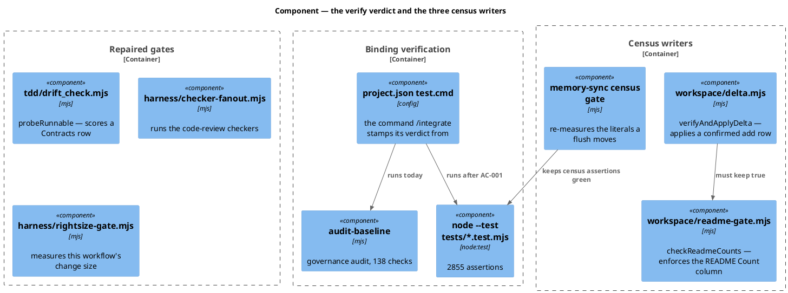

### Data model — class diagram

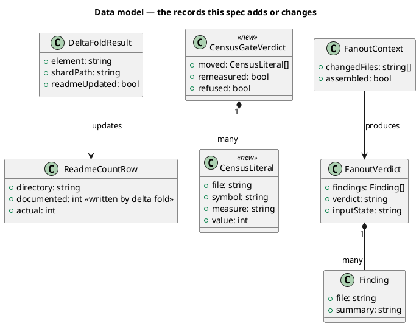

There is no SQL migration — this system has no database. The class diagram models the on-disk record shapes the change introduces.

### Behavior — sequence per AC

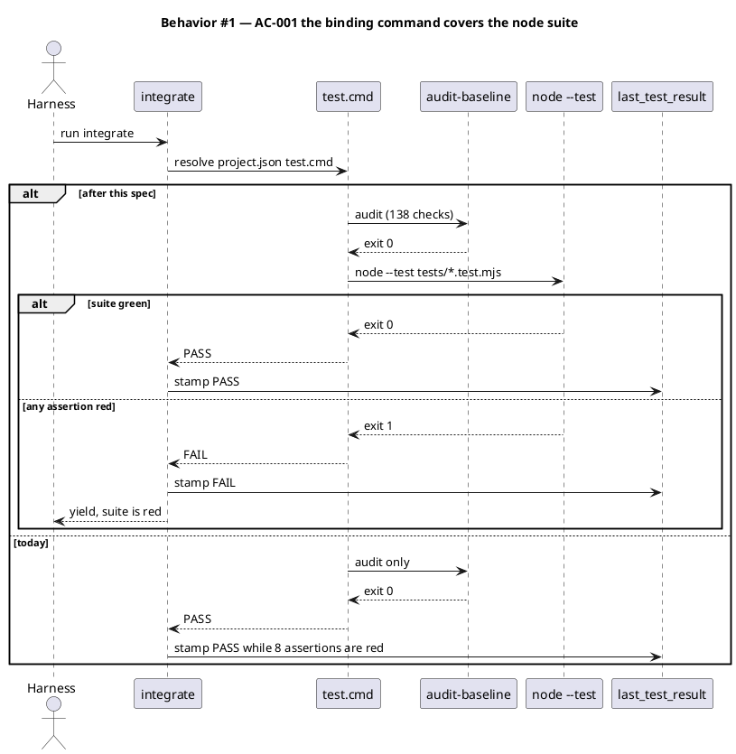

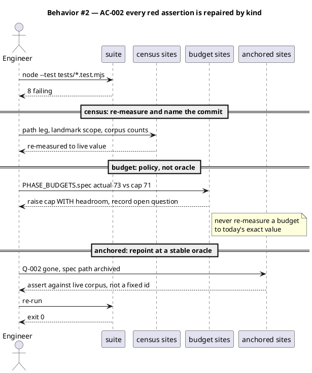

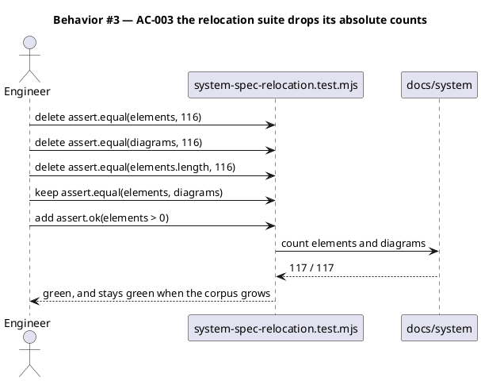

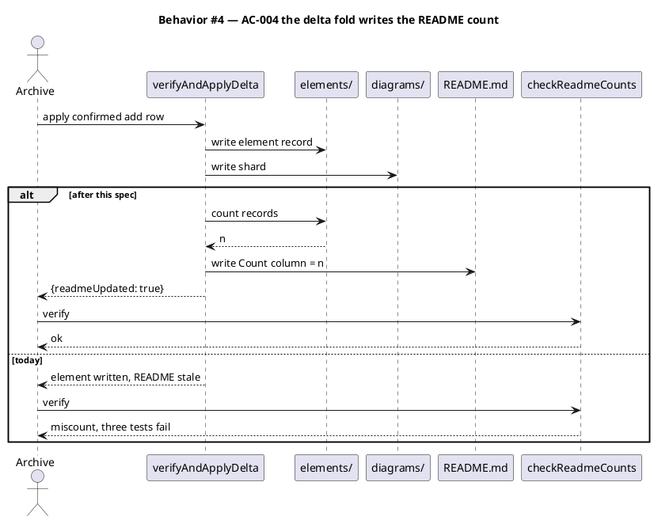

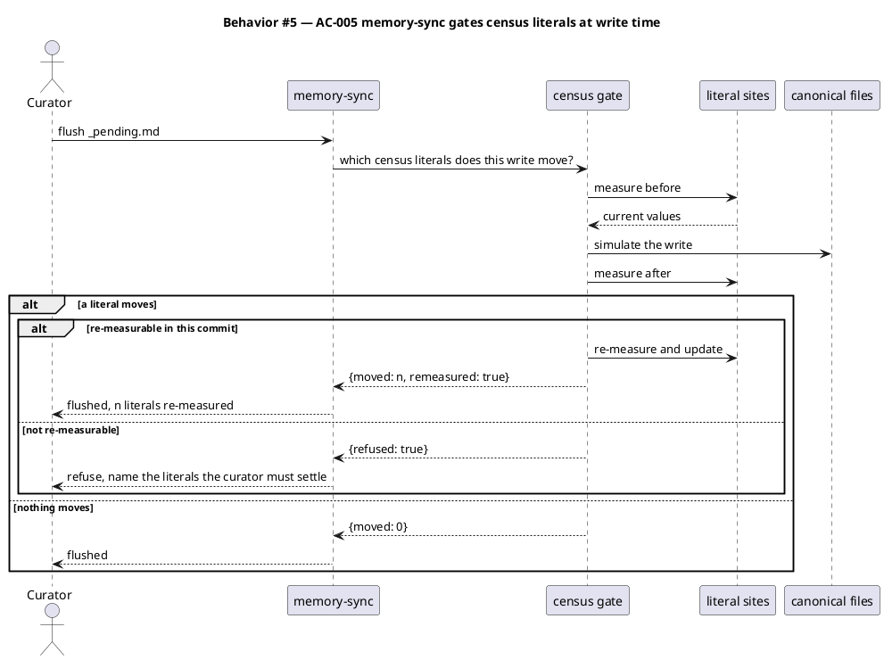

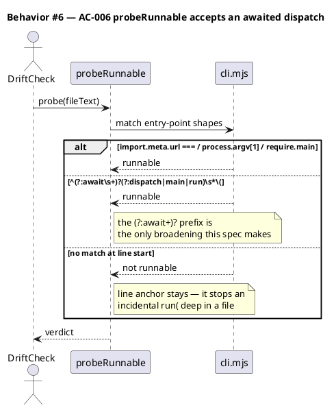

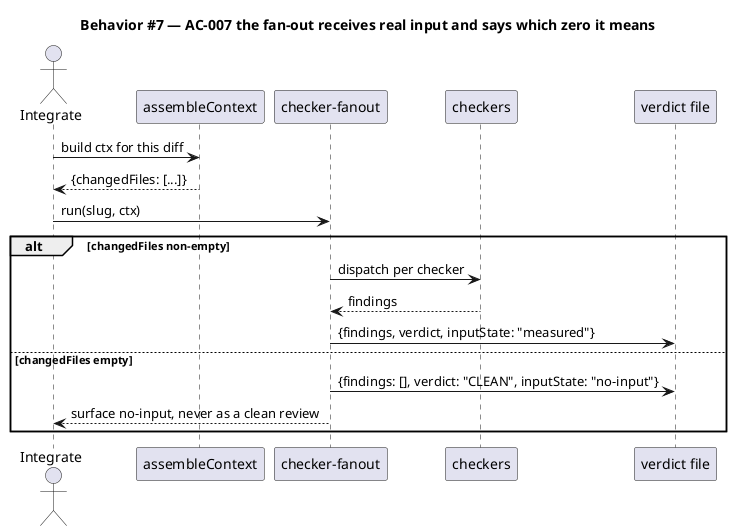

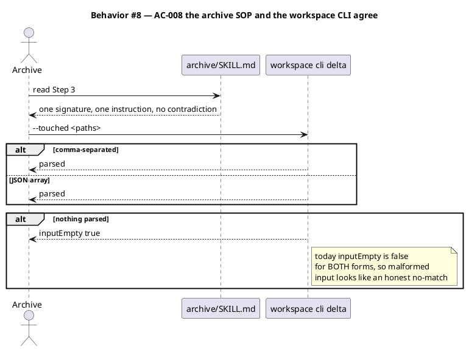

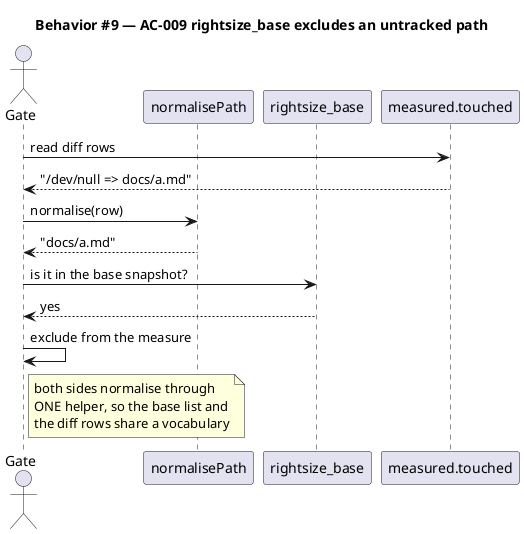

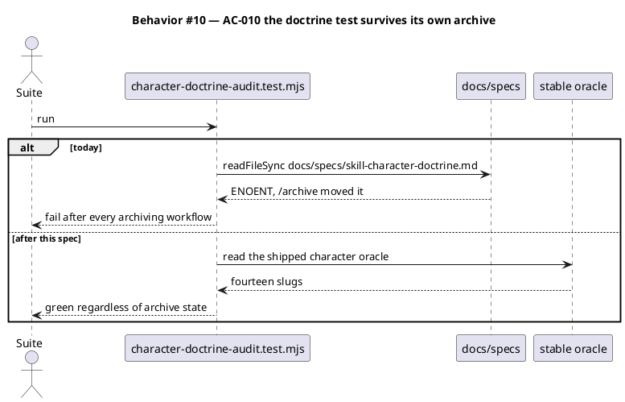

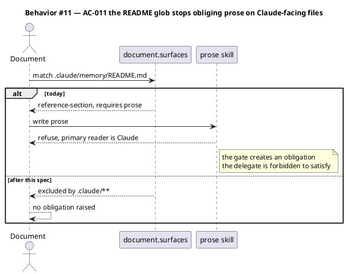

### State — core entity *(only if stateful)*

Omitted deliberately. Nothing this spec introduces carries a non-trivial state machine; the census gate is a per-write verdict, not a lifecycle.

### Dependencies — graph

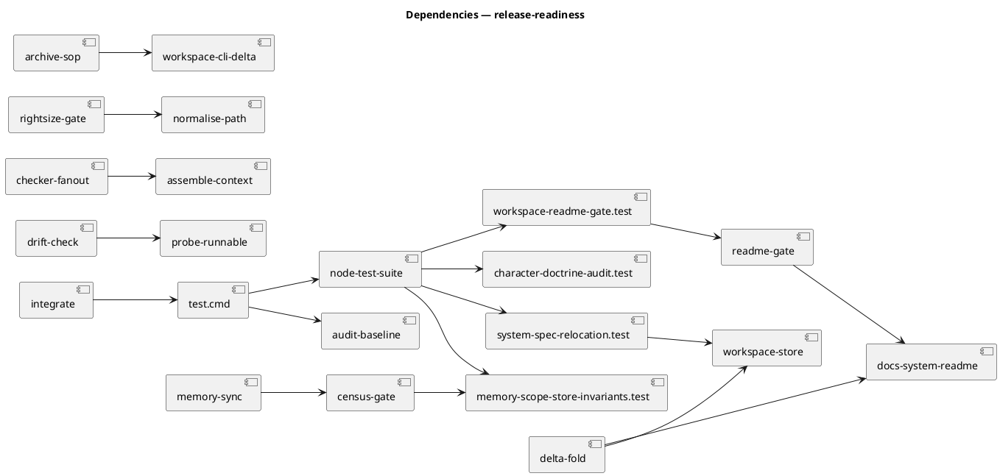

Acyclic. `docs-system-readme` has two writers in the graph — `delta-fold` writes it and `readme-gate` reads it. That is the intended shape: one writer, one enforcer.

### Contracts

| Kind | Name | Input | Output | Errors | Idempotent |
|---|---|---|---|---|---|
| Config | `project.json → test.kind` / `test.cmd` | — | binding command string | invalid command → `/integrate` FAIL | yes |
| Function | `verifyAndApplyDelta` (changed) | `{row, specDir}` | `{element, shardPath, readmeUpdated}` | unresolvable element id → throw | yes — a re-apply that changes no bytes writes nothing |
| Function | `checkReadmeCounts` (unchanged surface) | `{specDir}` | `{ok, mismatched[]}` | missing README → `{ok: true, mismatched: []}` | yes |
| Function | `measureCensusMovement` (new) | `{pendingEntries, rootDir}` | `{moved: CensusLiteral[], remeasured, refused}` | unreadable site → `refused: true` with the site named | yes |
| Function | `probeRunnable` (changed) | `fileText: string` | `boolean` | — | yes |
| Function | `assembleChangedFiles` (new) | `{rootDir, baseRef}` | `string[]` | git failure → `[]` **and** `inputState: "no-input"` | yes |
| Function | `normaliseDiffPath` (new) | `row: string` | repo-relative path | — | yes |
| CLI | `workspace cli.mjs delta --touched` (changed) | comma-separated **or** JSON array | delta verdict | neither parses → `inputEmpty: true` | yes |

### Libraries and versions

| Library@version | Purpose | Key APIs | Confirmed against current docs |
|---|---|---|---|
| `node:test` (Node 22 LTS built-in) | the suite `test.cmd` will run | `--test`, exit status 1 on any failing assertion | yes — Node docs, built-in module, no third-party API recalled |
| `node:assert` (built-in) | the assertions repaired | `assert.equal`, `assert.deepEqual`, `assert.ok` | yes — built-in |

No third-party library is added. Every API this spec touches is either a Node built-in or in-repo, so the `context7` current-docs rule is satisfied without an external lookup.

### Alternatives considered

| Alt | Summary | Rejected because |
|---|---|---|
| A | Correct the three counts to 117 and stop | Buys exactly one workflow. `verifyAndApplyDelta` re-falsifies the README on the next spec with an `add` row — measured three times already. |
| B | Delete the failing assertions | They are the only thing that noticed the store growing, and the landmark deferral count is a roadmap commitment T11 depends on. |
| C | Derive the path-leg census instead of gating at write time | The human chose the write-time gate at triage. Deriving covers only the path leg; `PHASE_BUDGETS` and the corpus counts stay hand-maintained. |
| D | Relax `readme-gate` so the README may lag | The gate is what makes the census a fact rather than a claim. Named explicitly as the wrong fix in `delta-fold-should-write-the-readme-count`. |
| E | Make `test.cmd` the node suite **only**, dropping the audit | The audit catches governance drift the node suite does not. Both must run; the binding command chains them. |
| F | Broaden `probeRunnable` to `void` / `return` / leading whitespace | Only `await` has evidence behind it. The line anchor is deliberate — it stops an incidental `run(` deep in a file reading as an entry point. |

## Program design

### Data access

| Reader | Source | Access path | Written by |
|---|---|---|---|
| `integrate` | `project.json → test.cmd` | `readFileSync` + spawn | nothing — read-only config |
| `checkReadmeCounts` | `docs/system/README.md` | `readFileSync`, parse Count column | `verifyAndApplyDelta` (single writer after AC-004) |
| `system-spec-relocation.test` | `docs/system/elements/`, `docs/system/diagrams/` | `readdirSync` count | `verifyAndApplyDelta` |
| `measureCensusMovement` | census literal sites in `tests/**` | `readFileSync`, locate symbol | `/memory-sync` (the same call that moves them) |
| `probeRunnable` | the diff's file text | in-process string match | nothing — read-only |
| `assembleChangedFiles` | git working tree | `git diff --name-only` | nothing — read-only |
| `normaliseDiffPath` | `workflow.json → rightsize_base[]`, diff rows | in-process | `rightsize-gate baseline` (first arm only) |

`docs/system/README.md` is the one store here that gains a writer. It has exactly one after AC-004 — the delta fold — and one enforcer. A second writer would reintroduce the divergence this spec closes.

### Call stack

Load-bearing for AC-001, because the chain crosses from config into two separate runners and the failure of either must reach the verdict:

```
/integrate
  └─ resolve project.json test.cmd          .claude/skills/integrate/
       ├─ audit-baseline/audit.mjs          138 governance checks
       └─ node --test tests/*.test.mjs      2855 assertions
            └─ first non-zero exit wins     .claude/state/last_test_result
```

### Layout

```
.claude/skills/workspace/
  delta.mjs                     changed   — verifyAndApplyDelta also writes the README Count column
  readme-gate.mjs               unchanged surface — the enforcer stays as-is; only its input becomes true
  cli.mjs                       changed   — delta --touched accepts a JSON array as well as comma-separated
.claude/skills/memory-sync/
  census-gate.mjs               new       — measureCensusMovement, the write-time gate
  cli.mjs                       changed   — flush calls the gate before committing canonical writes
  SKILL.md                      changed   — documents the refuse path
.claude/skills/tdd/
  drift_check.mjs               changed   — probeRunnable accepts an awaited dispatch entry point
.claude/skills/harness/
  checker-fanout.mjs            changed   — reads an assembled ctx; emits inputState
  assemble-context.mjs          new       — assembleChangedFiles, the helper the SOP paragraph used to stand in for
  rightsize-gate.mjs            changed   — normaliseDiffPath applied to both sides of the base comparison
.claude/skills/integrate/
  SKILL.md                      changed   — step 3.5 calls the assembler instead of delegating ctx to main context
.claude/skills/archive/
  SKILL.md                      changed   — Step 3 signature and instruction agree
docs/system/
  README.md                     changed   — Count column 116 -> 117
tests/
  system-spec-relocation.test.mjs      changed — three absolute literals dropped, relational assertion kept
  workspace-readme-gate.test.mjs       unchanged surface — already relational; goes green when the README is corrected
  memory-scope-store-invariants.test.mjs changed — census re-measured, budget raised with headroom
  memory-readers-sharded.test.mjs      changed — asserts a question exists, not that it is Q-002
  character-doctrine-audit.test.mjs    changed — reads a stable oracle, not docs/specs/<slug>.md
  drift-check-contracts.test.mjs       changed — live-oracle test over every shipped cli.mjs
  checker-fanout.test.mjs              changed — asserts no-input is distinguishable from measured-zero
  rightsize-gate.test.mjs              changed — an untracked path in rightsize_base is excluded
.claude/
  project.json                  changed   — test.cmd chains the suite; document.surfaces excludes .claude/**
```

## Design calls

The write set does not intersect `project.json → tdd.ui_globs`.

- *(none)*

## System delta

| Verb | Element | Anchor | Concept | Kind |
|---|---|---|---|---|
| change | workspace-corpus | `.claude/skills/workspace/*.mjs` | memory-model | c4_component |
| change | memory-sync-helpers | `.claude/skills/memory-sync/*.mjs` | memory-model | c4_component |
| change | tdd-helpers | `.claude/skills/tdd/*.mjs` | tdd-verification | c4_component |
| change | harness-helpers | `.claude/skills/harness/*.mjs` | harness-loop | c4_component |

Every new file this spec creates (`census-gate.mjs`, `assemble-context.mjs`) lands inside an existing element's anchor glob, so no `add` row is owed.

## Acceptance criteria

| ID | Criterion (given / when / then) | Kind | Upstream AC | Sequence |
|---|---|---|---|---|
| AC-001 | given `project.json → test.cmd`, when `/integrate` resolves the binding command, then it runs the governance audit **and** `node --test tests/*.test.mjs`, and stamps FAIL when either exits non-zero | preflight | T1 | §Behavior #1 |
| AC-002 | given the 8 assertions failing on 2026-08-14, when the suite runs after this spec, then all 8 are green, with census sites re-measured, `PHASE_BUDGETS.spec` raised to a cap with stated headroom above the measured 73, and no assertion deleted | behavior | T1 | §Behavior #2 |
| AC-003 | given `tests/system-spec-relocation.test.mjs`, when the corpus grows by one element, then the suite stays green without a hand edit, because the three absolute literals are gone and `assert.equal(elements, diagrams)` plus `assert.ok(elements > 0)` carry the invariant | behavior | T1 (`replace-the-corpus-census-literals-with-a-relational-assertion`) | §Behavior #3 |
| AC-004 | given a confirmed `add` row, when `verifyAndApplyDelta` applies it, then the `docs/system/README.md` Count column is written in the same call and `checkReadmeCounts` returns `ok: true` | behavior | T1 (`delta-fold-should-write-the-readme-count`) | §Behavior #4 |
| AC-005 | given a `/memory-sync` flush that would move a census literal, when the flush runs, then the gate either re-measures the literal in the same commit or refuses the flush naming the literal, and never writes canonical files leaving the literal stale | behavior | T2 | §Behavior #5 |
| AC-006 | given a shipped `.claude/skills/*/cli.mjs`, when `probeRunnable` scores it, then all 11 probe runnable — including the two whose entry point is `await dispatch({...})` — and a file whose only match is an indented `run(` still probes not-runnable | behavior | T3 | §Behavior #6 |
| AC-007 | given `/integrate` step 3.5, when the code-review fan-out runs, then `changedFiles` is built by a helper rather than by prose, and a verdict produced from empty input carries `inputState: "no-input"` distinguishable from a measured zero | behavior | T4 | §Behavior #7 |
| AC-008 | given `archive/SKILL.md` Step 3, when a reader follows it, then the signature and the instruction agree, and `workspace cli.mjs delta --touched` parses both comma-separated and JSON-array forms while reporting `inputEmpty: true` when neither parses | behavior | T5 | §Behavior #8 |
| AC-009 | given an untracked path recorded in `workflow.json → rightsize_base[]`, when the right-size gate measures the diff, then that path is excluded, because both the base list and the diff row normalise through one helper | behavior | T6 | §Behavior #9 |
| AC-010 | given a workflow that archives its own spec, when `tests/character-doctrine-audit.test.mjs` runs afterwards, then it passes, because it reads a stable oracle rather than `docs/specs/<slug>.md` | behavior | T7 | §Behavior #10 |
| AC-011 | given `.claude/memory/README.md`, when `/document` classifies the diff, then no prose obligation is raised, because `document.surfaces` excludes `.claude/**` | behavior | hitchhiker | §Behavior #11 |
| AC-012 | given the full node suite, when `/integrate` runs at Phase 9 of this workflow, then it exits 0 — this is the smoke check that the binding command from AC-001 actually gates | smoke | T1 | §Behavior #1 |

No row defers spec-committed scope, so no `deferred:` tag is owed.

## Test plan

| Category | Scenario | Expected | Covers |
|---|---|---|---|
| Golden path | `/integrate` with a green suite | PASS stamped at `last_test_result` | AC-001, AC-012 |
| Golden path | full suite after every repair | exit 0, 0 failing | AC-002 |
| Golden path | `verifyAndApplyDelta` on a confirmed `add` row | element, shard **and** README Count all written | AC-004 |
| Golden path | all 11 shipped `cli.mjs` probed | every one runnable | AC-006 |
| Contract violation | `test.cmd` where the audit passes and the suite fails | `/integrate` stamps FAIL, not PASS | AC-001 |
| Contract violation | flush that moves a census literal and cannot re-measure it | refused, literal named, canonical files untouched | AC-005 |
| Contract violation | `delta --touched` with neither form parseable | `inputEmpty: true` | AC-008 |
| Input boundary | corpus grows by one element | relocation suite still green, no hand edit | AC-003 |
| Input boundary | file whose only entry-point match is an indented `run(` | not runnable — the line anchor holds | AC-006 |
| Input boundary | `--touched` as JSON array, as comma-separated, as empty | parsed, parsed, `inputEmpty` | AC-008 |
| Input boundary | untracked path as `/dev/null => docs/a.md` in `rightsize_base` | excluded from the measure | AC-009 |
| Failure mode | `assembleChangedFiles` when git fails | `[]` **and** `inputState: "no-input"`, never a CLEAN verdict | AC-007 |
| Failure mode | `checkReadmeCounts` with no README | `{ok: true, mismatched: []}` — no claim to contradict | AC-004 |
| Concurrency / ordering | delta fold applies two `add` rows in one archive | README Count reflects both, not the first | AC-004 |
| Regression trap | archive this workflow's own spec, then run the suite | green — the doctrine test does not read `docs/specs/` | AC-010 |
| Regression trap | `/document` over a diff touching `.claude/memory/README.md` | no prose obligation raised | AC-011 |
| Regression trap | `PHASE_BUDGETS.spec` after the raise | cap has stated headroom above measured; not equal to it | AC-002 |

## Observability

| Signal | Name | Shape | Purpose |
|---|---|---|---|
| Log | `last_test_result` | `{verdict, cmd, exitCode, ranSuite: bool}` | proves which runners the binding verdict actually executed |
| Log | `checker-fanout/<slug>.json` | `{findings, verdict, inputState}` | distinguishes a measured-clean review from one that never saw input |
| Log | `memory-sync census gate` | `{moved[], remeasured, refused}` | shows which literals a flush moved and what the gate did |
| Log | `verifyAndApplyDelta` | `{element, shardPath, readmeUpdated}` | proves the README write rode the same call |

No metric or alarm — this is a developer-tooling repository with no runtime service to page on.

## Rollout

### Prerequisites

| # | Prerequisite | enforced-by |
|---|---|---|
| 1 | The binding command runs both the governance audit and the node suite, and a non-zero exit from either reaches the verdict | AC-001 |
| 2 | The full node suite exits 0 at Phase 9 before this batch may reach gate C | AC-012 |

- **Feature flag**: none. Every change repairs an existing gate or an existing count; a flag would let the broken path stay reachable, which is the failure this spec closes.
- **Migration order**: 1 repair the assertions (AC-002..AC-004, AC-010) → 2 land the write-time mechanisms (AC-004 fold, AC-005 gate) → 3 flip `test.cmd` (AC-001) last, so the binding command turns on against an already-green suite rather than a red one.
- **Canary**: none applicable. The change is verified by the suite it makes binding.

## Rollback

- **Kill-switch**: revert `project.json → test.cmd` to the audit-only command. That restores today's behaviour in one edit and does not un-repair any assertion.
- **Signal to roll back**: `/integrate` stamping FAIL on a tree where `node --test tests/*.test.mjs` exits 0 — that would mean the chained command misreports, and it is visible on the first `/integrate` after the flip.

## Archive plan

- Defaults *(automatic)*: spec, spec-rendered/, spec approval, security reports (one per ticket, concatenated).
- Extras *(list any non-default files)*:
  - *(none)*

## Open questions

- **`optimize.mjs`'s `undeclared` finding is defeated by any repo-root-adjacent config path.** Measured 2026-08-14: the pass reported **102 undeclared elements both before and after** the write_set was narrowed from `.claude/skills/**` to thirteen named files. Cause: `directoryPrefix('.claude/project.json')` returns `.claude/`, and `overlapsWriteSet` accepts a match when *either* prefix starts with the other, so `.claude/` prefix-matches every element in the repository. Any spec whose write_set touches a file directly under `.claude/` gets the same 102, which is why this spec's `System delta` was authored from the Layout section rather than from the pass. `.claude/skills/spec/optimize.mjs` is outside this write_set; repairing it here would expand an approved scope, so it is deferred to backlog. The pass is advisory and blocks nothing — `corrections` was 0 and `/spec-lint` is PASS. This does not block approval.
- **What should `PHASE_BUDGETS` actually measure?** AC-002 raises `PHASE_BUDGETS.spec` above the measured 73 with headroom, which keeps the suite green without converting a policy cap into a zero-headroom tripwire. It does not answer the underlying question — the backlog argues the budget should measure surfaced *volume* rather than entry count. Raising the cap is the repair; deciding the measure is its own ticket. This does not block approval.
