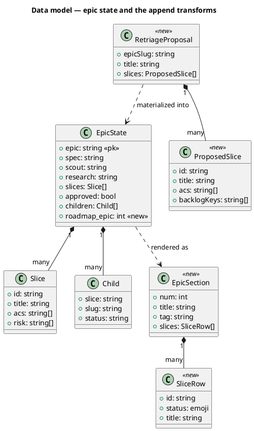
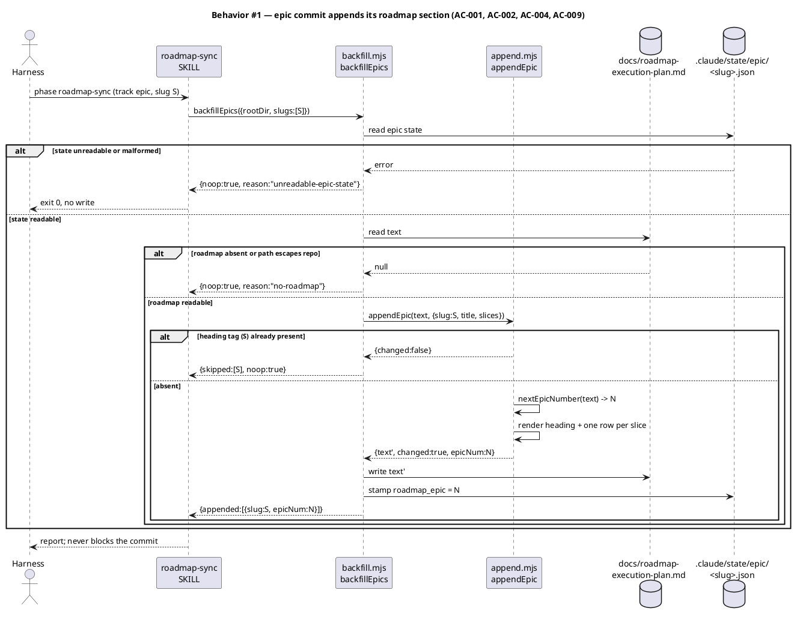
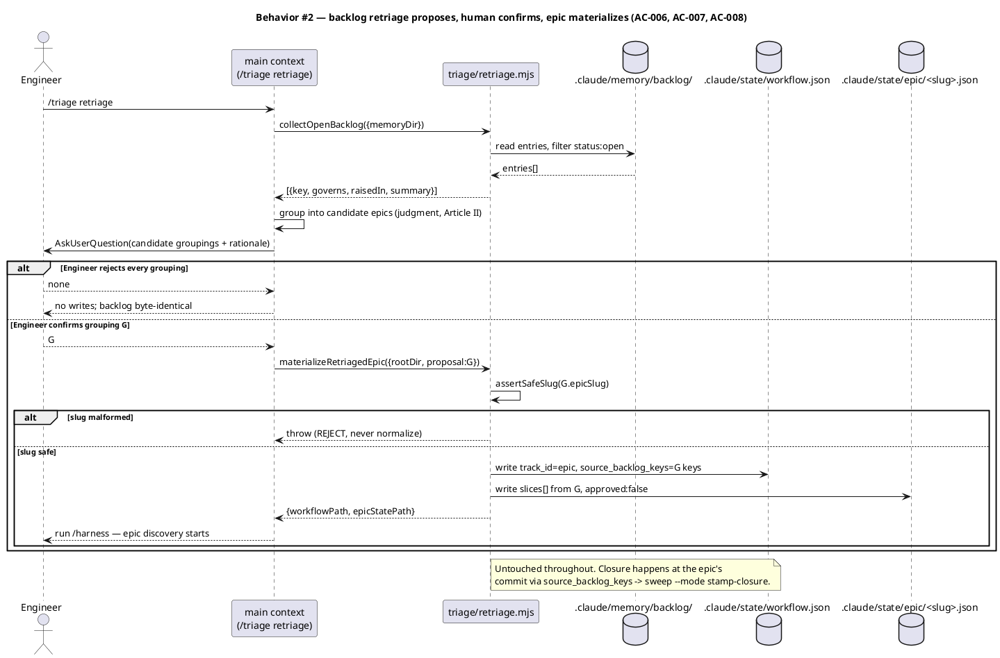
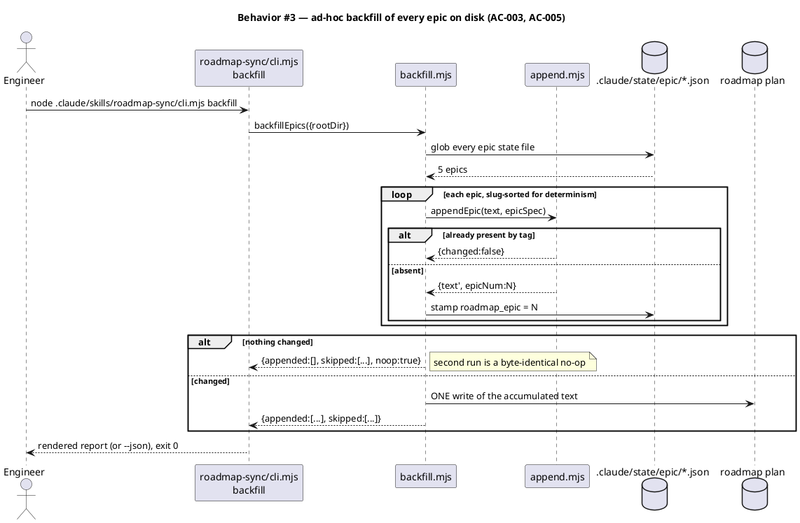
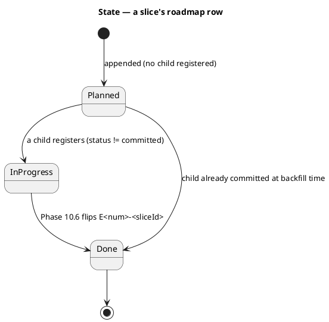
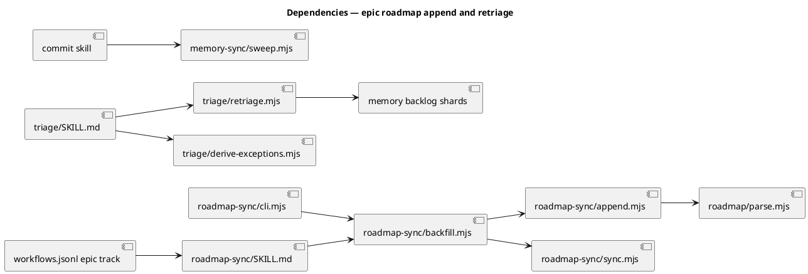

# Epic-to-roadmap append, backlog retriage, and the ad-hoc epic backfill

## Context

| Input | Path |
|---|---|
| Intake | *(none — `spec-entry` track; the request and its five answered scoping questions are recorded in `.claude/state/workflow.json → request`)* |
| BRD *(if any)* | *(none)* |
| Scout *(if any)* | *(none — excepted; evidence cited in `workflow.json → novelty_evidence`)* |
| Research *(if any)* | *(none — excepted)* |

**Write set**: `.claude/skills/roadmap-sync/**`, `.claude/skills/triage/**`, `.claude/workflows.jsonl`, `CLAUDE.md`, `src/CLAUDE.template.md`, `docs/init/seed.md`, `src/seed.template.md`, `.claude/CONSTITUTION.md`, `docs/roadmap-execution-plan.md`, `tests/**`

## Goal

An epic lands on the execution roadmap when its discovery commits, its children flip their own rows, an operator can group open backlog entries into a new epic, and the five epics already on disk get backfilled by one idempotent ad-hoc command.

## Non-goals

- **No new baseline skill.** Both new capabilities are hosted inside existing skills (`roadmap-sync`, `triage`). See Decision D1.
- **No new backlog-closure mechanism.** Absorbed entries close through the existing `source_backlog_keys` → `/commit` Step 2.7 → `sweep.mjs --mode stamp-closure` → `/memory-sync` auto-close path.
- **No change to how a task row is flipped.** `flipTaskInEpic` and `promoteEpicHeading` are reused unchanged.
- **No automatic grouping.** The retriage proposes; the human confirms. Grouping is binding judgment and stays in main context (Article II).
- **No epic renumbering, reordering, or removal.** The append is additive-only; nothing already on the roadmap is rewritten.

## Decisions

| # | Decision | Owner | Rationale |
|---|---|---|---|
| D1 | Host the retriage in `triage` (`retriage.mjs`) and the append/backfill in `roadmap-sync` (`append.mjs`, `backfill.mjs`, `cli.mjs`). Add **no** new baseline skill. | engineer | A new baseline skill is an N→N+1 count cascade across ~12 governance surfaces (`.claude/memory/landmines/baseline-skill-count-cascade.md`). Neither capability needs its own skill: retriage *is* triage applied to the backlog, and the append *is* roadmap sync. Reuse-before-create. |
| D2 | The roadmap epic heading's `(tag)` carries the **epic slug verbatim**: `## Epic 8 — Codebugger explanation trace  ⬜  (codebugger-explanation-trace)`. | engineer | The user's chosen dedupe key is the epic slug. Putting it in the tag makes the dedupe an exact scan of parsed headings rather than a prose marker, and `parseEpicHeading`'s tag field is free-form `\(([^)]*)\)`, so no parser change is needed. |
| D3 | The Article IV amendment lands in `CLAUDE.md` and the byte-equal mirror `src/CLAUDE.template.md` in the same commit, with `docs/init/seed.md` + `src/seed.template.md` and the annex `.claude/CONSTITUTION.md`. | engineer | Article XII.4 requires the mirror to stay byte-equal; `seed-template-parity.test.mjs` requires the seed mirror to match outside §16. Splitting the edit across commits leaves the tree red. |
| D4 | Amend Article IV by **deleting** the exception, not by adding a rule: `(committing tracks **except `epic`**)` → `(every committing track)`. | engineer | `CLAUDE.md` is at 27,994 of 28,000 characters — six characters of headroom (`tests/warm-context-diet.test.mjs:25`). The deletion is 13 characters **shorter**, so it fits without an offsetting trim and without touching the sha256-pinned Article VI slice. `epic` is the only committing track lacking a `roadmap-sync` node, so the new wording is exact rather than approximate. |
| D5 | The epic's assigned roadmap number is stamped back into `.claude/state/epic/<slug>.json` as `roadmap_epic`. | engineer | Phase 10.6 flips `E<num>-<taskId>` tokens. Without the stamp an `epic-child` cannot name its own row, and the append would be write-only — rows that appear and never turn green. |

## Design

Diagrams are the contract. Prose is only for what a diagram cannot say.

### C4 — structural kinds by reference

The standing structural shape of both touched components is already modelled. This spec changes their internals, not the system's container topology.

```
@ref element:roadmap-sync-helper
```

### Data model — class diagram

The epic state file gains one field; two new modules join the roadmap-sync component.



#### Migration DDL

*(none — the store is JSON on disk. `roadmap_epic` is additive and optional; every reader treats its absence as "not yet on the roadmap", which is the pre-feature state.)*

### Behavior — sequence per AC







### State — slice row status



### Dependencies — graph



### Contracts

| Kind | Name | Input | Output | Errors | Idempotent |
|---|---|---|---|---|---|
| Fn (append.mjs) | `nextEpicNumber` | `text: string` | `int` (max parsed epic num + 1; `1` when none) | — | yes (pure) |
| Fn (append.mjs) | `epicPresent` | `text, slug` | `bool` — true iff a parsed epic heading's tag equals `slug` | — | yes (pure) |
| Fn (append.mjs) | `renderEpicSection` | `{num, title, tag, summary, slices:[{id,status,title}]}` | `string` — `## Epic N — Title  <emoji>  (tag)`, blank line, summary, blank line, one `- <emoji> <id>. <title>` row per slice | throws on a slice id failing `/^[A-Za-z0-9][A-Za-z0-9-]*$/` | yes (pure) |
| Fn (append.mjs) | `appendEpic` | `text, {slug, title, summary, slices}` | `{text, changed, epicNum}`; `changed:false` when `epicPresent` | throws on malformed slice id | yes — second call is a no-op |
| Fn (backfill.mjs) | `backfillEpics` | `{rootDir, slugs?: string[], dryRun?: bool}` | `{appended:[{slug,epicNum}], skipped:[{slug,reason}], noop:bool, anomalies:[]}` | none — returns `{noop:true, reason}` on every failure | yes |
| CLI | `.claude/skills/roadmap-sync/cli.mjs backfill` | `[--json] [--dry-run] [--slug <s>] [--root <dir>]` | rendered report or raw JSON; exit 0 always | prints reason to stdout, still exit 0 | yes |
| Fn (retriage.mjs) | `collectOpenBacklog` | `{memoryDir}` | `[{key, path, governs, raisedIn, summary}]` for `status: open` only | returns `[]` when the directory is absent | yes (read-only) |
| Fn (retriage.mjs) | `materializeRetriagedEpic` | `{rootDir, proposal:{epicSlug,title,slices}}` | `{workflowPath, epicStatePath}` | throws on unsafe slug, on an empty `slices[]`, or when `workflow.json` already exists | no — refuses to overwrite a live workflow |

### Libraries and versions

| Library@version | Purpose | Key APIs | Confirmed against current docs |
|---|---|---|---|
| `node:fs` (Node 25.8.1, in-repo runtime) | read/write roadmap + state | `readFileSync`, `writeFileSync`, `readdirSync`, `existsSync` | yes — stdlib, already used by `sync.mjs` |
| `node:path` (Node 25.8.1) | within-repo path resolution | `resolve`, `join`, `sep` | yes — stdlib, already used by `sync.mjs` |
| `node:util` (Node 25.8.1) | CLI flag parsing | `parseArgs` | yes — stdlib, already used by `sweep.mjs` |

No third-party dependency is added. The baseline is zero-runtime-dep and this change keeps it there.

### Alternatives considered

| Alt | Summary | Rejected because |
|---|---|---|
| A | Ship `backlog-retriage` and `roadmap-backfill` as two new baseline skills | 58 → 60 skills triggers the count cascade across `derive-counts.mjs`, `audit.mjs` (three sites), `CLAUDE.md` + mirror, `seed.md` + mirror, `README.md`, `.claude/CONSTITUTION.md` (count line + Appendix B), `site-src/skills.njk:5`, and two governance-count tests — for zero capability the host skills do not already own. |
| B | Dedupe the append on epic **title** rather than slug | Titles are prose and get edited; the slug is the stable identity and is already the epic state file's primary key. A title edit would resurrect a duplicate row. |
| C | Write the roadmap row at `/spec` time, before gate A | A rejected or abandoned epic leaves an orphan row the operator must clean by hand. The user chose commit-time explicitly. |
| D | Remove absorbed backlog entries at retriage-confirm time | A rejected epic then loses the entries. The user chose commit-time removal, which the existing `source_backlog_keys` path already implements for free. |
| E | Add a `roadmap-backfill` node to the epic DAG *and* a separate ad-hoc command with its own logic | Two code paths for one transform. `backfillEpics({slugs})` serves both: one slug at commit, every slug ad hoc. |

## Program design

### Data access

| Reader | Source | Access path | Written by |
|---|---|---|---|
| `backfill.mjs` | `docs/roadmap-execution-plan.md` (via `roadmap.path`) | `readFileSync` after `resolveRoadmapPath` | `backfill.mjs` (append) and `sync.mjs` (flip) — two writers, never concurrently: Phase 10.6 runs one skill, one phase at a time |
| `backfill.mjs` | `.claude/state/epic/*.json` | `readdirSync` + `readFileSync`, slug-sorted | `/triage` (create), `/harness` (`approved`), `commit` (`children[]`), `backfill.mjs` (`roadmap_epic` only) |
| `append.mjs` | *(none)* | pure text→text | — |
| `retriage.mjs` | `.claude/memory/backlog/*.md` | `readdirSync` + frontmatter parse | `/memory-sync` — read-only here |
| `retriage.mjs` | `.claude/state/workflow.json` | `existsSync` guard, then `writeFileSync` | `/triage` |
| `roadmap/parse.mjs` | the roadmap plan | `parseRoadmap` | nothing — read-only |

`backfill.mjs` is the **only** writer of `roadmap_epic`. It never touches `slices`, `children`, or `approved`, so it cannot collide with `epic_approval_guard`'s gated field.

### Call stack

```
/harness loop (track epic, phase roadmap-sync)
  └─ Skill(roadmap-sync)                          .claude/skills/roadmap-sync/SKILL.md
       └─ backfillEpics({rootDir, slugs:[slug]})  backfill.mjs        [orchestration]
            ├─ resolveRoadmapPath(cfg, root)      sync.mjs            [foundation, reused]
            ├─ readEpicState(slug)                backfill.mjs        [foundation]
            ├─ appendEpic(text, spec)             append.mjs          [domain]
            │    ├─ epicPresent(text, slug)       append.mjs
            │    ├─ nextEpicNumber(text)          append.mjs -> parse.mjs
            │    └─ renderEpicSection(section)    append.mjs
            └─ writeFileSync x2                   backfill.mjs        [IO boundary]
```

### Layout

```
.claude/skills/roadmap-sync/
  append.mjs            new       — pure epic-section transforms (present / next-number / render / append)
  backfill.mjs          new       — orchestration: epic states -> roadmap append -> roadmap_epic stamp
  cli.mjs               new       — `backfill` front door (--json, --dry-run, --slug, --root)
  sync.mjs              unchanged surface — resolveRoadmapPath and promoteEpicHeading are imported, not altered
  SKILL.md              changed   — documents the epic append step and the ad-hoc backfill
  tests/append.test.mjs new       — transform-level cases
.claude/skills/triage/
  retriage.mjs          new       — collectOpenBacklog + materializeRetriagedEpic
  SKILL.md              changed   — the retriage mode, and epic-child roadmap_tasks seeding
.claude/
  workflows.jsonl       changed   — epic track gains a roadmap-sync node between approve-direction and memory-sync
  CONSTITUTION.md       changed   — annex line 304 drops the epic exception
CLAUDE.md               changed   — Article IV row 10.6
src/CLAUDE.template.md  changed   — byte-equal mirror of the above
docs/init/seed.md       changed   — §18.9 epic-track description
src/seed.template.md    changed   — identical pre-§16 edit
docs/roadmap-execution-plan.md  changed — receives the five backfilled epic sections
tests/
  epic-roadmap-append.test.mjs      new — AC-001..AC-005, AC-009
  backlog-retriage.test.mjs         new — AC-006..AC-008
  (existing governance tests)       changed only if a line-ledger shifts
```

## Design calls

*(none)* — the write set intersects no path in `project.json → tdd.ui_globs`. No UI surface changes.

## System delta

| Verb | Element | Anchor | Concept | Kind |
|---|---|---|---|---|
| change | roadmap-sync-helper | `.claude/skills/roadmap-sync/*.mjs` | planning-release | c4_component |
| change | triage-helpers | `.claude/skills/triage/*.mjs` | workflow-tracks | c4_component |

Both anchors are existing globs that already cover the new files, so no `add` row is owed.

## Acceptance criteria

| ID | Criterion (given / when / then) | Kind | Upstream AC | Sequence |
|---|---|---|---|---|
| AC-001 | Given an `epic`-track workflow whose state file carries N slices, when the `roadmap-sync` phase runs, then the roadmap gains `## Epic <num> — <title>  ⬜  (<slug>)` followed by exactly N rows `- ⬜ <sliceId>. <sliceTitle>`, and `parseRoadmap` reports that epic with `tally.planned === N`. | behavior | request (1) | §Behavior #1 |
| AC-002 | Given a roadmap already carrying an epic heading whose tag equals slug S, when `appendEpic` runs for S, then it returns `changed:false` and the roadmap text is byte-identical. | behavior | request (3) | §Behavior #1 |
| AC-003 | Given the five epic state files on disk and a roadmap carrying none of them, when `cli.mjs backfill` runs, then all five are appended in slug-sorted order in **one** write, the report names five appended and zero skipped, and a second run reports zero appended, five skipped, and leaves the file byte-identical. | behavior | request (3) | §Behavior #3 |
| AC-004 | Given an epic state whose `children[]` marks slice A `status: "committed"` and slice B unregistered, when the epic is appended, then A's row renders `✅`, B's renders `⬜`, and the heading emoji is `🟡` as computed by the reused `promoteEpicHeading`. | behavior | request (1) | §Behavior #1 |
| AC-005 | Given an epic stamped `roadmap_epic: 8`, when `/triage` materializes an `epic-child` for slice A, then that child's `workflow.json` carries `roadmap_tasks: ["E8-A"]`, and `taskTokenResolves` confirms the token names a real row. | behavior | request (1) | §Behavior #3 |
| AC-006 | Given a backlog with 55 open and 1 picked-up entry, when `collectOpenBacklog` runs, then it returns exactly the 55 open entries with key, governs, raised-in and summary, and writes nothing. | behavior | request (2) | §Behavior #2 |
| AC-007 | Given a human-confirmed grouping naming an epic slug and its slices, when `materializeRetriagedEpic` runs, then `workflow.json` is written with `track_id: "epic"` and `source_backlog_keys[]` equal to the union of the slices' absorbed keys, and `.claude/state/epic/<slug>.json` is written with those slices and `approved: false`. | behavior | request (2) | §Behavior #2 |
| AC-008 | Given a retriage proposal that the human rejects, when the flow ends, then every file under `.claude/memory/backlog/` is byte-identical and no `workflow.json` or epic state file is created. | behavior | request (2) | §Behavior #2 |
| AC-009 | Given an absent roadmap file, a `roadmap.path` resolving outside the repo, or an unparseable epic state file, when `backfillEpics` runs, then it returns `{noop:true, reason:<named>}`, writes nothing, exits 0, and never blocks a commit. | preflight | request (3) | §Behavior #1 |
| AC-010 | Given the amendment applied, when the tree is checked, then `CLAUDE.md` Article IV row 10.6 reads `(every committing track)`, `CLAUDE.md` is byte-equal to `src/CLAUDE.template.md`, `docs/init/seed.md` and `src/seed.template.md` are byte-equal outside §16, and `CLAUDE.md.length <= 28000`. | behavior | request (1) | §Behavior #1 |
| AC-011 | Given the full change set, when `node .claude/skills/audit-baseline/audit.mjs` runs, then it exits 0 — the baseline skill count is unchanged at 58 and no manifest hash has drifted without a rebuild. | smoke | D1 | §Behavior #1 |

## Test plan

| Category | Scenario | Expected | Covers |
|---|---|---|---|
| Golden path | Append a 3-slice epic to a roadmap holding 7 epics | Heading numbered 8, tag = slug, 3 planned rows; `parseRoadmap` reads it back | AC-001 |
| Golden path | `backfill` over 5 on-disk epic states, empty roadmap tail | 5 sections appended, slug-sorted, one write | AC-003 |
| Golden path | `collectOpenBacklog` over a fixture with open/picked-up/dropped entries | Only the open entries returned | AC-006 |
| Golden path | Confirmed grouping materializes workflow + epic state | Both files written with the expected fields | AC-007 |
| Idempotence | Run `backfill` twice | Second run: byte-identical file, all skipped | AC-002, AC-003 |
| Input boundary | Epic state with zero slices | Heading appended with no rows; heading stays `⬜`; no crash | AC-001 |
| Input boundary | Slice id containing a `.` or a space | `renderEpicSection` throws a named error before any write | AC-001 |
| Input boundary | Empty roadmap file (no epic headings) | `nextEpicNumber` returns 1 | AC-001 |
| Input boundary | Epic title containing an em dash or a status emoji | Heading still parses to one epic with the correct tag and status | AC-001, AC-010 |
| Contract violation | `materializeRetriagedEpic` with slug `../escape` | Throws; no path is constructed; nothing written | AC-007 |
| Contract violation | `materializeRetriagedEpic` when `workflow.json` already exists | Throws; the live workflow is not overwritten | AC-007 |
| Contract violation | Proposal with an empty `slices[]` | Throws before any write | AC-007 |
| Concurrency / ordering | `backfill` then `syncRoadmap` flip on the same run | Both succeed; the appended row is flippable via `E<num>-<id>` | AC-005 |
| Failure mode | Roadmap file absent | `{noop:true, reason:"no-roadmap"}`, exit 0 | AC-009 |
| Failure mode | `roadmap.path` set to `../outside.md` | `resolveRoadmapPath` returns null → noop, exit 0 | AC-009 |
| Failure mode | Epic state file containing invalid JSON | That epic skipped with a reason; the others still append | AC-009 |
| Failure mode | Roadmap read-only at write time | Caught; `{noop:true}`; commit unblocked | AC-009 |
| Regression trap | `flipTaskInEpic`, `promoteEpicHeading`, `auditRoadmap`, `syncRoadmap` behaviour | Unchanged — existing `sync.test.mjs` stays green | — |
| Regression trap | Baseline skill count | Still 58; `audit-baseline` exits 0 | AC-011 |
| Regression trap | `CLAUDE.md` character budget | ≤ 28000; Article VI sha256 unchanged | AC-010 |
| Regression trap | Backlog shards after a rejected proposal | Byte-identical | AC-008 |

## Observability

| Signal | Name | Shape | Purpose |
|---|---|---|---|
| Log | harness phase log line | `roadmap-sync appended=[<slug>:E<num>] skipped=[...] noop=<bool>` in `.claude/state/harness/<slug>.log` | audit which epic landed which number |
| Log | `backfill` CLI report | appended / skipped / reason lines, or `--json` for the raw result | operator-facing outcome of the ad-hoc run |
| Log | `auditRoadmap` anomalies | passed through unchanged in the result's `anomalies[]` | detect a malformed row introduced by an append |

No metric or alarm: this is a local developer tool with no runtime service surface.

## Rollout

### Prerequisites

| # | Prerequisite | enforced-by |
|---|---|---|
| 1 | An append failure — absent roadmap, escaping path, malformed epic state, unwritable file — must never block a commit. | AC-009 |
| 2 | The baseline skill count stays 58 and no manifest hash drifts, so `audit-baseline` stays green without a count cascade. | AC-011 |

- **Feature flag**: *(none)*. The epic append is inert until an `epic` track commits, and the ad-hoc backfill runs only when invoked. A flag would gate a no-op.
- **Migration order**: 1 `append.mjs` + tests → 2 `backfill.mjs` + `cli.mjs` → 3 `workflows.jsonl` epic node → 4 constitution amendment across all four surfaces → 5 `retriage.mjs` + `triage/SKILL.md` → 6 run the ad-hoc backfill against the five on-disk epics.
- **Canary**: step 6 is the canary — run `cli.mjs backfill --dry-run` first and read the report before the real run.

## Rollback

- **Kill-switch**: revert the commit. Removing the `roadmap-sync` node from the epic track in `.claude/workflows.jsonl` disables the automatic append on its own, without touching code.
- **Signal to roll back**: `node .claude/skills/audit-baseline/audit.mjs` exits non-zero, or the full suite goes red on a governance-mirror test — both observable within one `/integrate` run of the landing.
- **Data**: appended roadmap sections are plain markdown and are removed by deleting the section; `roadmap_epic` is an additive field every reader treats as optional.

## Archive plan

- Defaults *(automatic)*: intake, brd, scout, research, spec, spec-rendered/, spec approval.
- Extras *(list any non-default files)*:
  - *(none)*

## Open questions

- *(none)* — the five scoping questions were answered before triage and are recorded as D1–D5 above.
