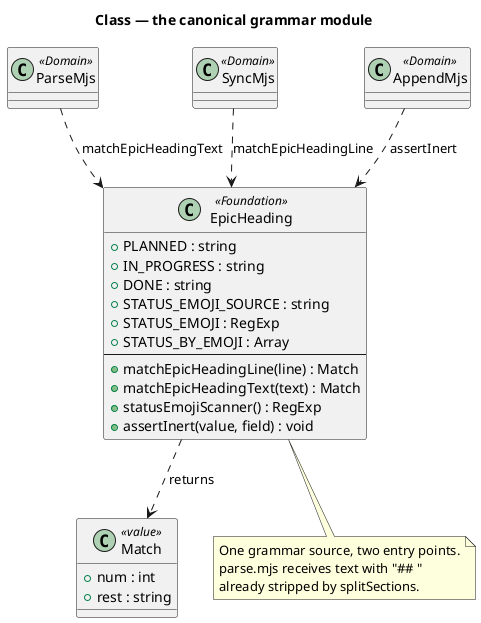
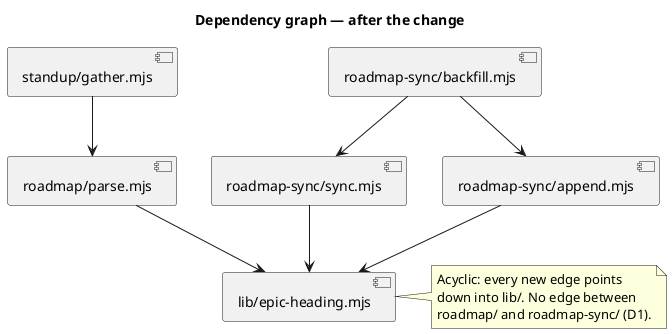
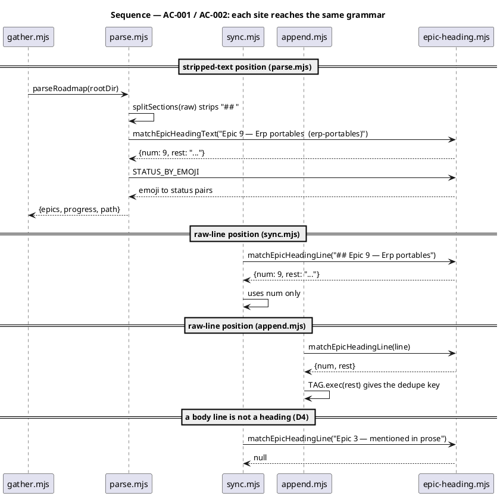
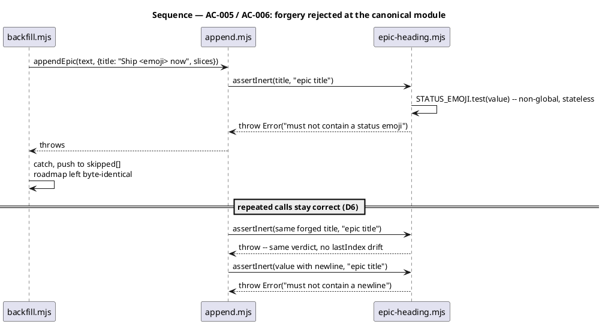
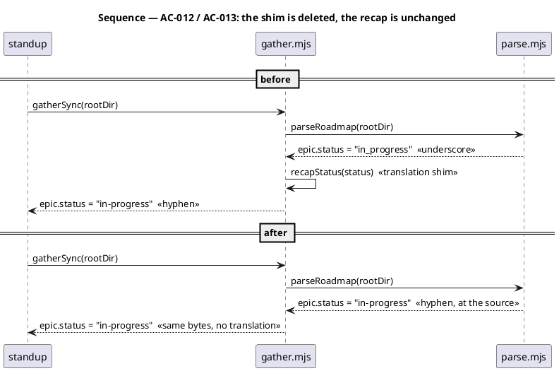

# Spec — unify-epic-heading-grammar

**Slug**: `unify-epic-heading-grammar`
**Track**: `spec-entry`

## Context

| Input | Path |
|---|---|
| Intake | *(excepted — spec-entry track)* |
| Scout | *(excepted)* |
| Research | *(excepted)* |
| Origin | `/simplify` flagged row at `1aed0ae`; "Out of scope / Noted" in `docs/archive/2026-08-15/epic-roadmap-and-backlog-retriage/security.md` |

**Write set**: `.claude/skills/lib/**`, `.claude/skills/roadmap/parse.mjs`, `.claude/skills/roadmap-sync/sync.mjs`, `.claude/skills/roadmap-sync/append.mjs`, `.claude/skills/standup/gather.mjs`, `tests/**`

The roadmap execution plan (`project.json → roadmap.path`, live at `docs/roadmap-execution-plan.md`) encodes each epic as a heading:

```
## Epic 9 — Erp portables  🟡  (erp-portables)
```

Three modules parse that line, each with its own private regex, each a different shape:

| Site | Regex | Input position | Captures |
|---|---|---|---|
| `.claude/skills/roadmap/parse.mjs:28` | `/^Epic\s+(\d+)\s+—\s+(.+)$/` | heading text, `## ` already stripped | num + rest |
| `.claude/skills/roadmap-sync/sync.mjs:14` | `/^## Epic (\d+) —/` | raw line | num only |
| `.claude/skills/roadmap-sync/append.mjs:10` | `/^## Epic (\d+) — (.*)$/` | raw line | num + rest |

The input positions differ for a real reason. `parse.mjs` receives its input from `splitSections` (`parse.mjs:142-147`), which splits on `/^##\s+/m` and therefore never sees the prefix. `sync.mjs` and `append.mjs` scan `text.split('\n')` and need the prefix to tell a heading from a body line.

The same three modules also triplicate the **status-emoji vocabulary**, in three incompatible forms:

| Site | Form | Note |
|---|---|---|
| `sync.mjs:13` | `new RegExp(…, 'gu')` | **global** — stateful `lastIndex` |
| `append.mjs:13` | `/⬜\|🟡\|✅/u` | not global |
| `parse.mjs:22` | `[['✅',DONE],…]` pair array | emoji → status mapping |

`assertInert` (`append.mjs:21`, called at `:59`, `:60`, `:65`) is the CWE-74 guard added by the previous cycle. It rejects a newline or a status emoji in an epic or slice title, because either forges roadmap structure — an emoji in a title wins the `statusFromHeadingEmoji` earliest-match and reports a planned epic as shipped. The security report for that cycle records that this fix belongs at whichever site becomes canonical.

A format change today is three edits across two skills, and the third is easy to miss because `parse.mjs` lives in a different skill from the other two.

## Goal

One canonical declaration of the epic-heading grammar and its status-emoji vocabulary, imported by all three sites, with `assertInert` guarding the canonical site — so a heading-format change is one edit and a future writer inherits the forgery guard by construction.

## Non-goals

- **No change to what the roadmap means.** Every heading any writer in this repo produces parses identically afterwards. The four edge deltas in §Behavior #4 are the complete list, each pinned by a test, and AC-011 pins the completeness of the list itself.
- **No new emoji, status, or heading field.** The vocabulary moves; it does not grow.
- **No change to `TASK_ROW_RE`** (`parse.mjs:29`) or task-row parsing. That grammar has a single declaration and is already correct.
- **No change to any public export SHAPE.** Every function keeps its signature. One exported VALUE changes deliberately: `parse.mjs → Status.IN_PROGRESS` becomes `'in-progress'` (D7). Its only non-test consumer is the shim D7 deletes, and no rendered output changes.
- **No change to `backfill.mjs` or either `cli.mjs`.** `roadmap/cli.mjs:67` prints a hardcoded `in_progress:` label, not the enum value, so it is untouched.
- **No `roadmap/` ↔ `roadmap-sync/` dependency in either direction.** See D1.

## Decisions

| # | Decision | Owner | Rationale |
|---|---|---|---|
| D1 | Canonical home is a new module `.claude/skills/lib/epic-heading.mjs` | human | `.claude/skills/lib/` is the established precedent for cross-skill shared code (`argv.mjs`, `output.mjs`, `probe.mjs`). Both skills import **downward** into `lib/`, so `roadmap/` and `roadmap-sync/` stay independent. Exporting from `parse.mjs` instead would create a `roadmap-sync/` → `roadmap/` edge that does not exist today. |
| D2 | `assertInert` moves to the canonical module in this cycle | human | The security review of `epic-roadmap-and-backlog-retriage` states the CWE-74 fix belongs at whichever site becomes canonical. Leaving it behind orphans the guard from the grammar it protects, so the next writer using the shared grammar inherits no protection — the exact failure recorded in the `security-fixes-are-per-call-site-and-new-modules-inherit-none` landmine. |
| D3 | The status-emoji vocabulary moves with the grammar | engineer | `assertInert` cannot move without it, and `statusFromHeadingEmoji` needs the same emoji→status mapping. Splitting them leaves the canonical module depending on a constant still declared three times. Bounded: the vocabulary moves, no site gains or loses an emoji. |
| D4 | Two entry points, not one normalizing entry point | engineer | A single entry point with an optional `## ` prefix would let a body line reading `Epic 3 — foo` match inside `sync.mjs`, which scans every line of the file. That silently widens what counts as an epic, so the prefix distinction is preserved in the API rather than normalized away. |
| D5 | The canonical grammar adopts `parse.mjs`'s permissive whitespace and its non-empty-rest requirement | engineer | It is the only one of the three whose output reaches a human answer (`standup` reports "what shipped?"), so where the three disagree, the reader-facing one wins. The resulting edge deltas are enumerated in §Behavior #4 and pinned. |
| D6 | The shared status-emoji regex is **non-global**; sites needing repeated scanning build a fresh global copy from the shared source | engineer | `sync.mjs:13` is `'gu'`, `append.mjs:13` is not. A shared global regex used with `.test()` alternates true/false across calls because `lastIndex` advances — which would make `assertInert` accept a forged title on every second call. The shared export is stateless. |
| D7 | The two status vocabularies are unified on `'in-progress'`, and `gather.mjs → recapStatus` is deleted | human | Found during implementation, not at spec time. `parse.mjs` exported `Status.IN_PROGRESS = 'in_progress'` while the recap emitted `'in-progress'`, bridged by a translation shim at `gather.mjs:307-309` called from `:284` and `:300`. Shipping a cycle whose goal is one declaration while leaving a shim between two spellings of one state is incoherent. The recap keeps emitting the hyphen, so **no rendered output changes**; `standup-roadmap-parity.test.mjs:116` asserts the hyphen and passes unmodified, which is the evidence. |

## Design

### C4 — structural kinds

@ref element:roadmap-sync-helper

### Class — the canonical grammar module

`.claude/skills/lib/epic-heading.mjs` is a **Foundation** module: no I/O, no config, no dependency on either skill.



### Dependencies — graph

Directed graph of runtime dependencies. Edge `A --> B` reads "A depends on B".



## Program design

The grammar is declared once as a source fragment and compiled into two anchored regexes:

```
EPIC_BODY_SOURCE = String.raw`Epic\s+(\d+)\s+—\s+(.+)`
LINE_RE          = new RegExp(`^##\\s+${EPIC_BODY_SOURCE}$`, 'u')
TEXT_RE          = new RegExp(`^${EPIC_BODY_SOURCE}$`, 'u')
```

`matchEpicHeadingLine(line)` applies `LINE_RE`; `matchEpicHeadingText(text)` applies `TEXT_RE`. Both return `{num, rest}` or `null`. `rest` is everything after the em dash and its following whitespace — each caller derives what it needs from it, exactly as today.

Layer assignment: `epic-heading.mjs` is Foundation (pure, no I/O). `parse.mjs`, `sync.mjs`, and `append.mjs` remain Domain and keep their existing derivation helpers (`statusFromHeadingEmoji`, `TAG`, `epicBodyRange`), which now consume the shared match instead of a private regex.

### Behavior #1 — one grammar, two entry points



### Behavior #2 — `assertInert` guards the canonical site



### Behavior #3 — `sync.mjs` builds its own global scanner

`sync.mjs` scans headings with `String.match` and `String.replace`, which need the `g` flag. It calls `statusEmojiScanner()` for a **fresh** global regex each time rather than sharing one, so no `lastIndex` state crosses call sites.

### Behavior #5 — the status vocabulary is unified and the shim is deleted

Before, one state had two spellings and a translation between them:



`recapStatus` (`gather.mjs:307-309`) is deleted along with both call sites (`:284` epic status, `:300` open-row status). `Status.IN_PROGRESS` becomes `'in-progress'` at the source. Every other status name (`done`, `planned`, `unknown`) was already shared verbatim, so nothing else moves.

**The recap's output does not change.** That is what makes this safe to fold into a behaviour-preserving cycle, and `standup-roadmap-parity.test.mjs:116` — which asserts the recap emits the hyphen — is the evidence, because it passes **unmodified**.

### Behavior #4 — the complete list of edge deltas

Adopting one grammar (D5) changes behavior at exactly three edges. All three involve headings `renderEpicSection` never produces; each is pinned by a test.

| # | Input | Before | After | Direction |
|---|---|---|---|---|
| E1 | `## Epic 5 —` and `## Epic 5 — ` (no title) | `sync.mjs` matched (num 5); `append.mjs` matched (rest `""`) | no match at any site | narrowing |
| E2 | `##  Epic  5  —  Title` (irregular whitespace) | `sync.mjs`/`append.mjs` did not match; `parse.mjs` did | matches at all sites | widening |
| E3 | `## Epic 5 —Title` (no space after dash) | `sync.mjs` matched (num 5) | no match | narrowing |
| E4 | `## Epic 5 —  Title` (two spaces after the dash) | `append.mjs` captured `rest = " Title"` — the literal `— ` consumed one space and `(.*)` kept the second | `rest = "Title"` — `\s+` is greedy | capture normalization |

E1 and E3 make `sync.mjs` agree with `parse.mjs`, the module whose output a human reads. E2 makes both line-scanners agree with `parse.mjs`'s existing tolerance.

**E4 is a capture-content delta, not a match delta**, which is why it does not fall out of comparing the three regexes for match/no-match. It was found by differentially executing all three originals against the canonical pair over a 16-input corpus, not by reading them. It is harmless at both consumers — `append.mjs` passes `rest` to `TAG` (`/\(([^)]*)\)\s*$/`, anchored at the end, indifferent to a leading space) and `parse.mjs` derives `title` through `.trim()` — but the completeness of this table is what the acceptance argument rests on, so it is listed rather than waved through.

**Reachability of all four:** `renderEpicSection` emits `## Epic ${num} — ${title}  ${emoji}  (${tag})` with exactly one space after the em dash, so no writer in this repo produces an E1–E4 input. Verified against the live plan: every one of the 12 headings is single-spaced with a non-empty title. These edges are reachable only by a hand-edited roadmap.

### Behavior #6 — the summary field is guarded at the writer

Added after `/security` raised a MEDIUM on the diff, at the user's direction to close it in this cycle.

`renderEpicSection` guarded `title`, `tag`, and each `slice.title` and left `summary` unguarded. `assertInert` alone is **insufficient** for `summary`, and that is the whole shape of the fix: `title` and `tag` are interpolated into the *middle* of the heading line, so a `## ` they carry can never reach a line start, whereas `summary` is pushed as a line of its own (`lines.push(summary, '')`). A newline-free, emoji-free `## Epic 99 — Injected (pwned)` therefore passes `assertInert` and still forges a real heading that every line-scanning reader honours.

`assertSummaryInert(summary)` is consequently two-part:

1. `assertInert(summary, 'epic summary')` — rejects the newline class and the status-emoji class. Every row grammar requires a status emoji, so this leg already covers row forgery.
2. `matchEpicHeadingLine(summary)` → throw — rejects the residual: a single-line heading that carries neither.

Absent, `null`, and `''` return early, so no current caller changes behavior. The only production caller (`backfill.mjs:54 → epicSpecFor`) never sets `summary`, and `tests/epic-roadmap-append.test.mjs` — which passes both a prose summary and `''` — passes unmodified.

## Design calls

*(none)* — the write set intersects no path in `project.json → tdd.ui_globs`. No UI surface changes.

## System delta

| Verb | Element | Anchor | Concept | Kind |
|---|---|---|---|---|
| change | skill-probe-lib | `.claude/skills/lib/*.mjs` | planning-release | c4_component |
| change | roadmap-sync-helper | `.claude/skills/roadmap-sync/*.mjs` | planning-release | c4_component |
| change | roadmap-cli | `.claude/skills/roadmap/*.mjs` | planning-release | c4_component |

The new module is a `change` to `skill-probe-lib`, not an `add`. That element already anchors `.claude/skills/lib/*.mjs`, so declaring a separate `epic-heading-grammar` element would model the same anchor twice — reuse-before-create applied to the model rather than the code. The optimization pass caught this; the first draft had the `add` row.

`spec-review-helpers` (`.claude/skills/spec-*/*.mjs`) also surfaced as `undeclared`, and is deliberately **not** declared here: this change writes no file under `.claude/skills/spec-*/`. A row for it would be a false delta.

## Contracts

| Kind | Name | Signature | Errors | Idempotent |
|---|---|---|---|---|
| Fn (epic-heading.mjs) | `matchEpicHeadingLine` | `(line) => {num, rest} \| null` | none; non-string coerces via `String()` | yes — pure |
| Fn (epic-heading.mjs) | `matchEpicHeadingText` | `(text) => {num, rest} \| null` | none; non-string coerces via `String()` | yes — pure |
| Fn (epic-heading.mjs) | `statusEmojiScanner` | `() => RegExp` | none | yes — fresh global regex per call |
| Fn (epic-heading.mjs) | `assertInert` | `(value, field) => void` | throws `Error` naming `field` on a newline or status emoji | yes — pure, stateless |
| Const (epic-heading.mjs) | `STATUS_EMOJI` | `RegExp`, non-global | — | yes |
| Const (epic-heading.mjs) | `STATUS_BY_EMOJI` | `Array<[string, string]>` | — | yes |

## Acceptance criteria

| ID | Criterion | Traces to |
|---|---|---|
| AC-001 | `matchEpicHeadingLine` returns `{num, rest}` for a line carrying the `## ` prefix and `null` for the same text without it | §Behavior #1 |
| AC-002 | `matchEpicHeadingText` returns `{num, rest}` for heading text without the prefix and `null` for a line that still carries it | §Behavior #1 |
| AC-003 | `parse.mjs`, `sync.mjs`, and `append.mjs` each declare no epic-heading regex of their own and each imports from `.claude/skills/lib/epic-heading.mjs` | §Behavior #1 |
| AC-004 | `parse.mjs`, `sync.mjs`, and `append.mjs` each declare no status-emoji **literal** of their own; each takes the emoji characters from the canonical module | §Behavior #3 |
| AC-005 | `assertInert` is exported from `epic-heading.mjs`, is no longer declared in `append.mjs`, and rejects a newline and each of the three status emoji | §Behavior #2 |
| AC-006 | Calling `assertInert` twice with the same forged value throws both times | §Behavior #2 |
| AC-007 | `statusEmojiScanner()` returns a regex with `lastIndex` 0, and not the same object across two calls | §Behavior #3 |
| AC-008 | Each of E1, E2, E3, E4 behaves as the "After" column states, at every site that previously disagreed | §Behavior #4 |
| AC-012 | `Status.IN_PROGRESS` is `'in-progress'`, and `gather.mjs` declares no `recapStatus` function and performs no status translation | §Behavior #5 |
| AC-013 | `gatherSync` on a roadmap with an in-flight epic still reports `epic.status` and every open row status as `'in-progress'` — byte-identical recap output | §Behavior #5 |
| AC-011 | A differential harness executes all three original regexes and the canonical pair over the §Behavior #4 corpus and reports exactly the deltas that table lists — no more | §Behavior #4 |
| AC-009 | `parseRoadmap` on the live repo still yields `epics.length` 12, `progress.length` 8, and Epic 6 at `{done: 11, inProgress: 0, planned: 0}` | §Behavior #1 |
| AC-010 | The full suite passes at 2970 or more, with 0 failures | §Behavior #1 |
| AC-014 | `renderEpicSection` throws on a `summary` that is a heading, carries a newline, or carries a status emoji, and renders an ordinary prose summary verbatim; absent/`null`/`''` render identically to no summary | §Behavior #6 |

## Test plan

| Test | Asserts | AC |
|---|---|---|
| `test_when_line_has_prefix_then_matches_and_without_prefix_returns_null` | prefix discrimination, line entry point | AC-001 |
| `test_when_text_lacks_prefix_then_matches_and_with_prefix_returns_null` | prefix discrimination, text entry point | AC-002 |
| `test_when_the_three_call_sites_are_read_then_no_local_epic_heading_regex_remains` | source scan of the three modules | AC-003 |
| `test_when_the_three_call_sites_are_read_then_no_local_status_emoji_constant_remains` | source scan for local emoji constants | AC-004 |
| `test_when_title_forges_grammar_then_assert_inert_throws_from_the_canonical_module` | newline plus each of the three emoji | AC-005 |
| `test_when_assert_inert_called_twice_with_same_forgery_then_throws_both_times` | the D6 `lastIndex` trap | AC-006 |
| `test_when_status_emoji_scanner_called_twice_then_returns_distinct_zeroed_regexes` | fresh global per call | AC-007 |
| `test_when_edge_heading_e1_through_e4_then_every_site_agrees` | the four deltas, table-driven | AC-008 |
| `test_when_old_and_new_grammars_run_differentially_then_only_declared_deltas_appear` | completeness of the delta table itself | AC-011 |
| `test_when_gather_source_read_then_no_status_translation_remains` | `recapStatus` gone, no translation in `gather.mjs` | AC-012 |
| `test_when_recap_gathered_on_in_flight_epic_then_status_is_hyphenated_without_a_shim` | recap output byte-identical | AC-013 |
| existing `tests/standup-roadmap-parity.test.mjs` | live-repo values unchanged | AC-009 |
| existing `tests/roadmap-parse.test.mjs`, `tests/epic-roadmap-append.test.mjs` | behaviour preservation | AC-010 |
| `test_when_summary_forges_a_heading_without_newline_or_emoji_then_render_throws` | the residual `assertInert` cannot catch | AC-014 |
| `test_when_summary_carries_a_newline_or_a_status_emoji_then_render_throws` | the two classes `assertInert` does catch | AC-014 |
| `test_when_summary_is_ordinary_prose_then_it_renders_verbatim` | the guard does not reject legitimate input | AC-014 |
| `test_when_summary_is_absent_or_empty_then_render_is_unchanged` | no behaviour change for any current caller | AC-014 |

The behaviour-preservation evidence is that the existing suites pass **unmodified**, with exactly one declared exception:

| Suite | Expected | Why |
|---|---|---|
| `tests/standup-roadmap-parity.test.mjs` | unmodified | asserts the recap emits `'in-progress'`; still true after D7, which is the proof the fold changed no output |
| `tests/epic-roadmap-append.test.mjs` | unmodified | — |
| `tests/roadmap-parse.test.mjs` | **one line**: `:70` fixture `'in_progress'` → `'in-progress'` | it pins the internal enum value that D7 deliberately changes |

Any edit beyond that one line signals the merge changed behaviour and must be justified in the diff, not absorbed. The rule is narrowed here rather than dropped, because its purpose is to stop a regression being quietly absorbed into a test edit.

## Observability

None. The module is pure and in-process, on a path that already runs inside `/standup` and Phase 10.6. No new logging, metric, or state file.

## Rollout

Single commit, no flag. The change is behaviour-preserving by construction and every consumer is in-repo, so a staged rollout would add risk rather than remove it. `audit-baseline` plus the full suite is the gate.

## Rollback

`git revert` of the one commit. The new module is additive with no persisted state, no migration, and no config key, so a revert restores the three private regexes with no cleanup step.

## Archive plan

Default bundle — every `unify-epic-heading-grammar.*` file in the workflow directories.

Extras: *(none)*

## Open questions

*(none)* — D1 through D6 settle the design. E1, E2, and E3 are decided and pinned rather than open.
