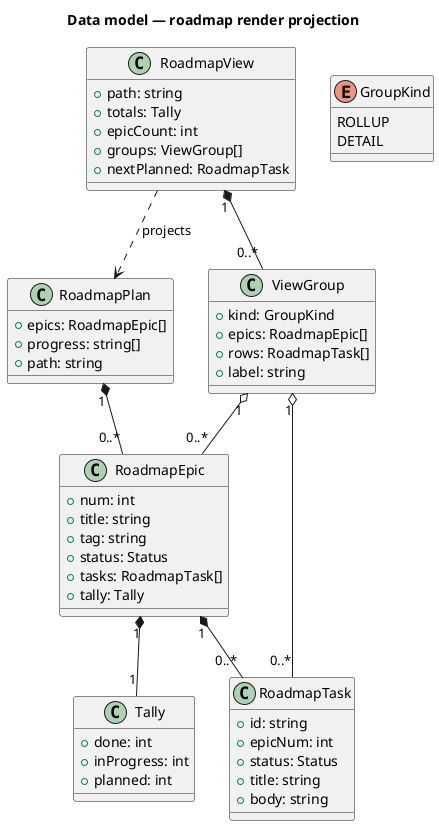
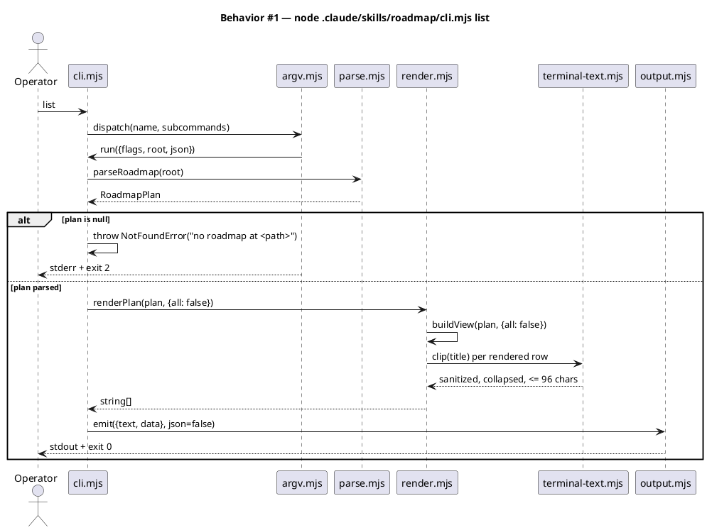
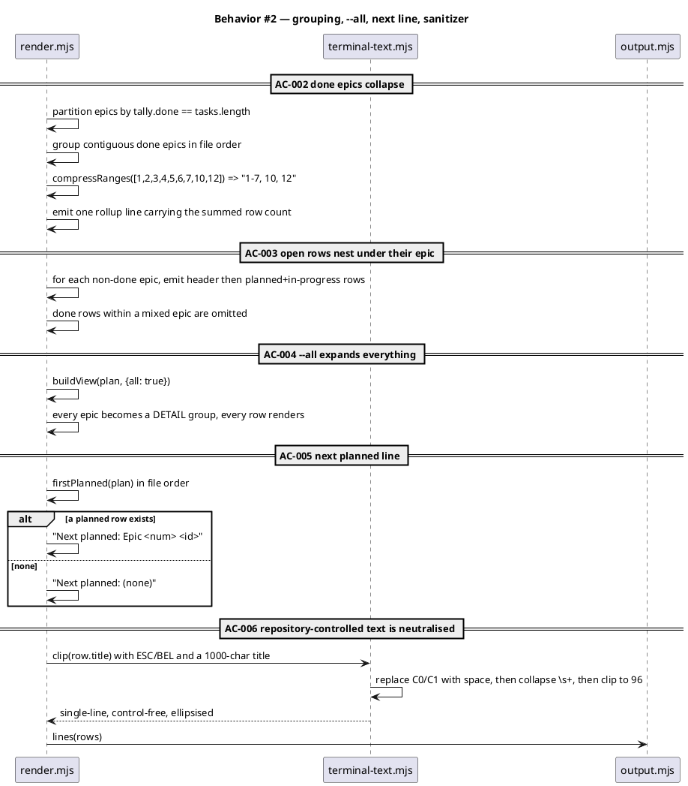
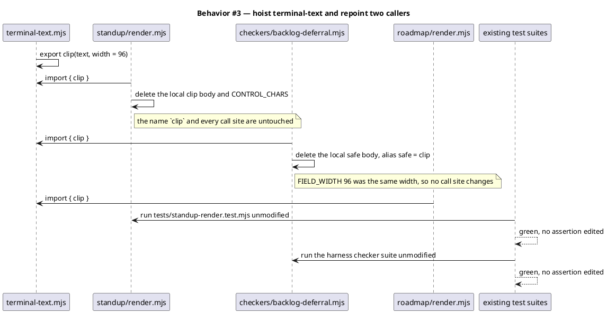
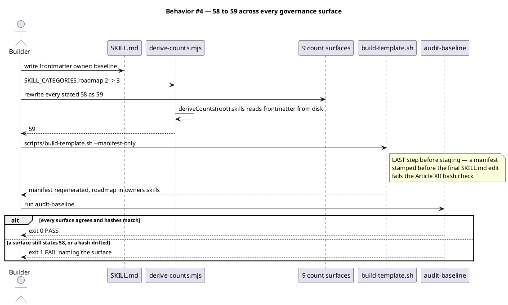
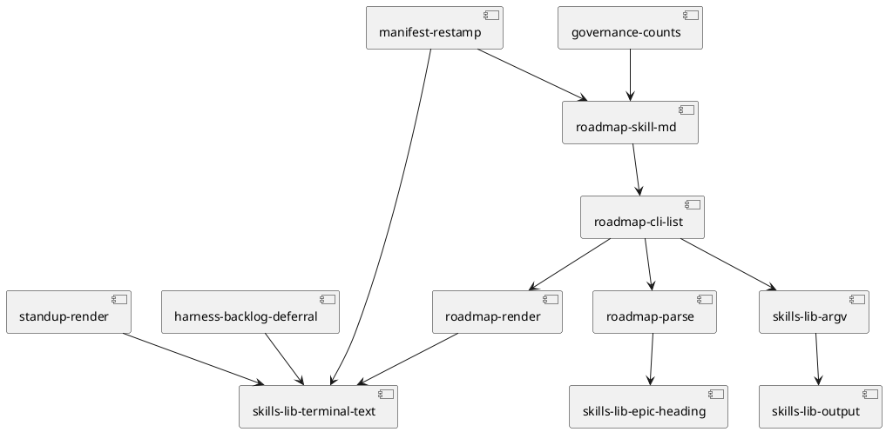

# /roadmap — a read front door onto the execution roadmap

## Context

| Input | Path |
|---|---|
| Intake | *(excepted — `spec-entry` track)* |
| BRD | *(none)* |
| Scout | *(excepted — `spec-entry` track)* |
| Research | *(excepted — `spec-entry` track)* |
| Precedent | `.claude/skills/standup/{SKILL.md,cli.mjs,render.mjs}` |
| Reader in place | `.claude/skills/roadmap/{cli.mjs,parse.mjs}` |
| Backlog absorbed | `terminal-sanitizer-duplicated-across-standup-and-deferral-checker` |

**Write set**: `.claude/skills/roadmap/**`, `.claude/skills/lib/**`, `.claude/skills/standup/render.mjs`, `.claude/skills/harness/checkers/backlog-deferral.mjs`, `tests/**`, `CLAUDE.md`, `src/CLAUDE.template.md`, `README.md`, `.claude/CONSTITUTION.md`, `docs/init/seed.md`, `src/seed.template.md`, `site-src/skills.njk`, `obj/template/.claude/manifest.json`, `docs/system/**`

## Goal

`/roadmap` prints every epic in the execution plan with its tally, lists the open rows beneath their epic, collapses fully-done epics into one rollup line, and names the next planned task.

## Non-goals

- **No narrative.** The plan's `## Progress` bullets and per-row rationale are not rendered. `standup` already surfaces the Progress bullets, and a second copy would drift from it.
- **No dependency ordering.** `next` reports the first planned row in file order. Ordering the graph is `roadmap-planner`'s job; this spec does not move that boundary.
- **No writes.** `/roadmap` never mutates the plan. `roadmap-sync` owns every write to it.
- **No new parser.** `parse.mjs` is unchanged. This spec adds a renderer and a verb over the reader that already exists.
- **No release, backlog, or question reporting.** Those are `standup`'s six recap keys. `/roadmap` answers one question.

## Design

`@ref element:roadmap-cli`

The change is confined to one component that the standing model already carries. `roadmap-cli` is anchored at `.claude/skills/roadmap/*.mjs` and sits in the `planning-release` concept beside `standup-helper`; adding a renderer and a verb extends that element rather than introducing a container, a boundary, or an external dependency.

### The layer split

`standup` proved the split and this follows it exactly, because a renderer that reads the filesystem cannot be tested against a fixture.

- **Orchestration** — `cli.mjs` owns argv, the exit contract, and nothing else. It gains one verb.
- **Domain** — `parse.mjs` turns the plan file into a typed `RoadmapPlan`. Unchanged by this spec.
- **Foundation** — `render.mjs` (new) turns a `RoadmapPlan` into display lines. It reads no file, no clock, and no git. The same plan always renders the same lines.
- **Foundation, shared** — `.claude/skills/lib/terminal-text.mjs` (new) owns the control-strip / whitespace-collapse / clip rule.

### Why the sanitizer moves rather than gets copied

The rule that neutralises C0/C1 controls, collapses whitespace and clips to 96 characters exists twice today — `clip` in `.claude/skills/standup/render.mjs` and `safe` in `.claude/skills/harness/checkers/backlog-deferral.mjs`. Backlog entry `terminal-sanitizer-duplicated-across-standup-and-deferral-checker` records the standing decision: on a third consumer, hoist the rule and repoint both existing copies, because a shared module with the old copies still in place is worse than either state alone. `render.mjs` is that third consumer, so the hoist happens here rather than being deferred again.

The entry names `.claude/hooks/lib/` as the destination. This spec sites the module at `.claude/skills/lib/terminal-text.mjs` instead: all three consumers live under `.claude/skills/`, that directory is the skills' own Foundation layer (`argv.mjs`, `output.mjs`, `epic-heading.mjs`, `probe.mjs`), and it already ships in the consumer manifest. Putting a skills-only helper under `hooks/lib/` would make every skill reach across a boundary for it. The entry's rule is honoured; only its address changes.

Both existing call sites keep their local names (`clip`, `safe`) as thin re-exports of the shared function, so no caller in either file changes.

### Rendering rules

The command exists to answer *what is left*, so open rows are never collapsed to a count. Done rows are the bulk of a finished plan and carry no pickup signal, so they render only under `--all`.

- Each epic renders a header line: status marker, number, title, and `done/total`.
- Open rows (`planned` and `in-progress`) render beneath their epic, indented.
- A run of epics whose rows are all done collapses to one rollup line naming the epic numbers as compressed ranges, with the total row count.
- The last line names the first planned row in file order, or states that none is left.
- `--all` expands every done epic and every done row. Nothing else changes.
- Every title passes through the shared sanitizer before printing.

Range compression is contiguity over the epic list in file order, not over the numbers: epics 1–7, 10 and 12 being done renders `Epics 1-7, 10, 12`. A single done epic renders as `Epic 4`, not `Epics 4-4`.

### Data model — class diagram

`RoadmapPlan`, `RoadmapEpic` and `RoadmapTask` are already produced by `parse.mjs` and are unchanged. `RoadmapView` is the render-time projection this spec adds; it exists only inside `render.mjs` and is never persisted.

`RoadmapView`, `ViewGroup` and `GroupKind` are introduced by this spec; the four classes above them are unchanged. No `<<new>>` stereotype is used and no DDL accompanies the diagram, because the projection is in-memory with no store behind it. The roadmap file is the only persistence and its format does not change, so there is nothing to migrate.

### Behavior #1 — `list` renders the default view

### Behavior #2 — grouping, expansion, and the next-planned line

Control neutralisation runs **before** the whitespace collapse. ESC and BEL are not whitespace, so collapsing first leaves them intact and every roadmap title — repository-controlled content — reaches the operator's terminal verbatim. The order is the contract, not an implementation detail.

### Behavior #3 — the sanitizer hoist leaves both existing callers unchanged

Neither existing file keeps a local copy of the rule. A shared module with the old copies still in place is the one outcome the backlog entry names as worse than either state alone, so the repoint is part of this behavior rather than a follow-up.

### Behavior #4 — the count cascade and the manifest restamp

## Program design

### Dependency graph

Acyclic. `terminal-text` is a leaf with three consumers, which is the third-use trigger that authorises hoisting it. `manifest-restamp` depends on every shipped-file change, which is why it runs last.

### Module contracts

| Module | Layer | Exports | Contract |
|---|---|---|---|
| `.claude/skills/lib/terminal-text.mjs` | Foundation | `clip(text, width = 96)` | Replaces C0/C1 with a space, collapses runs of whitespace, trims, then truncates to `width` with a trailing `…` when longer. Accepts any value; `null`/`undefined` render as the empty string. Never throws. |
| `.claude/skills/roadmap/render.mjs` | Foundation | `buildView(plan, opts)`, `renderPlan(plan, opts)` | `buildView` returns a `RoadmapView`; `renderPlan` returns `string[]`. Pure — no fs, git, clock, or env read. `renderPlan` throws `TypeError` when `plan` is not a plain object. |
| `.claude/skills/roadmap/cli.mjs` | Orchestration | `list` subcommand | `{data: RoadmapView, text: lines(renderPlan(...))}`. A missing plan throws `NotFoundError` → exit 2, matching `tasks` / `epics` / `next`. |
| `.claude/skills/roadmap/SKILL.md` | — | frontmatter `name: roadmap`, `owner: baseline`, `disable-model-invocation: true` | Makes `/roadmap` typeable and puts the directory under Article XII audit. |

### Contracts — the pinned CLI surface

| Surface | Signature | Errors |
|---|---|---|
| `roadmap list` | `node .claude/skills/roadmap/cli.mjs list [--all] [--epic N] [--json] [--root <dir>]` | exit 0 rendered; exit 1 on a non-integer `--epic`; exit 2 when the plan file is absent |
| `--all` | boolean; absent → done epics collapse and done rows are hidden | — |
| `--epic N` | integer; narrows to one epic and suppresses the rollup group | `UsageError` when `N` is not an integer, reusing `parseEpicFilter` from `tasks` |
| `--json` | boolean; emits the `RoadmapView` rather than the text | — |

`--all` is a boolean and is deliberately **not** added to `VALUE_FLAGS` in `.claude/skills/lib/argv.mjs`. `refuseBulk` rejects `--all` for write verbs; `list` is a read verb and never calls it, so the two meanings do not collide. Nothing in `argv.mjs` changes.

### Libraries

| Library | Version | API confirmed against |
|---|---|---|
| `node:fs`, `node:path`, `node:util` | Node 22 LTS (`.nvmrc`) | Already in use by `parse.mjs` and `argv.mjs`; no new API surface is introduced by this spec. |

No third-party dependency is added. The baseline is zero-runtime-dep and this spec keeps it there.

### The governance count cascade

Adding a `SKILL.md` carrying `owner: baseline` moves `deriveCounts(root).skills` from 58 to 59, because that function counts skill directories by frontmatter rather than from a list. Nine surfaces state the number and one authored map breaks it down.

| Surface | Change |
|---|---|
| `.claude/skills/audit-baseline/derive-counts.mjs` | `SKILL_CATEGORIES.roadmap` 2 → 3 |
| `CLAUDE.md`, `src/CLAUDE.template.md` | `58 skills` → `59 skills`, twice each; the two files stay byte-equal |
| `README.md` | `58 skills` → `59 skills` |
| `.claude/CONSTITUTION.md` | the count in the agnostic-mode greeting and the `.claude/skills/` row's category breakdown |
| `docs/init/seed.md`, `src/seed.template.md` | the `§4.3 Skills (58)` heading, the tree comment, and the §Step 5 breakdown prose; the two files stay byte-equal |
| `site-src/skills.njk` | `58 baseline-owned skills` in the description and `value: "58"` in the stat tile |
| `obj/template/.claude/manifest.json` | regenerated — adds `roadmap` to `owners.skills` and hashes the new files |
| `tests/system-spec-delta-shard-writer.test.mjs` | the pinned 58 assertions move to 59 |

**Collision.** `docs/specs/codebugger-explanation-trace.md` (Epic 8) already reserves the 58 → 59 move for a `/codebugger` skill. Whichever lands first takes 59; the other must be re-drafted to 60 before it builds. That spec is unapproved and unstarted, so this cycle proceeds and the collision is recorded for whoever picks Epic 8 up.

## Design calls

| Slug | Surface | Reference target | Quality criteria |
|---|---|---|---|
| skills-page-count | `site-src/skills.njk` | the rendered `obj/site/skills/index.html` captured before the edit — the page's own current stat-tile row and description sentence are the reference | the stat tile reads `59` and the description reads `59 baseline-owned skills`; no other numeral, heading, or word form on the page changes; the tile row keeps its existing alignment and spacing at 360/768/1280; text contrast stays at or above WCAG AA; no layout shift above 0.1 CLS |

The page carries no per-skill list, so the change is two numerals in the front matter. The reference target is the page as it renders today, because the correct outcome here is a page that is identical except for the count.

## System delta

| Verb | Element | Anchor | Concept | Kind |
|---|---|---|---|---|
| change | roadmap-cli | `.claude/skills/roadmap/*.mjs` | planning-release | c4_component |
| change | skill-probe-lib | `.claude/skills/lib/*.mjs` | planning-release | c4_component |
| change | standup-helper | `.claude/skills/standup/*.mjs` | planning-release | c4_component |
| change | harness-checkers | `.claude/skills/harness/checkers/*.mjs` | harness-loop | c4_component |

## Acceptance criteria

| ID | Criterion | Behavior | Kind |
|---|---|---|---|
| AC-001 | `roadmap list` on a plan with 13 epics prints a header naming the plan path, a totals line carrying epic count and the summed done / in-progress / planned tallies, then the groups, then the next-planned line. Exit 0. | §Behavior #1 | smoke |
| AC-002 | A run of epics whose every row is done renders as ONE rollup line naming the epic numbers as compressed ranges and the summed row count. A lone done epic renders `Epic 4`, never `Epics 4-4`. | §Behavior #2 | behavior |
| AC-003 | An epic with at least one open row renders its header plus one indented line per `planned` or `in-progress` row. Done rows inside that epic are omitted. Open rows are never collapsed to a count at any plan size. | §Behavior #2 | behavior |
| AC-004 | `--all` renders every epic as its own header with every row beneath it, done rows included, and emits no rollup line. | §Behavior #2 | behavior |
| AC-005 | The final line reads `Next planned: Epic <num> <id>` for the first `planned` row in file order, or `Next planned: (none)` when the plan has none. | §Behavior #2 | behavior |
| AC-006 | A row title containing ESC, BEL, a newline, or 1000 characters renders as one line, free of C0/C1 controls, at most 96 characters, ending in `…` when truncated. Controls are replaced before whitespace is collapsed. | §Behavior #2 | behavior |
| AC-007 | `roadmap list --json` emits the `RoadmapView` object and prints no rendered text. | §Behavior #1 | behavior |
| AC-008 | `roadmap list` against a root with no plan file exits 2 with `no roadmap at <path>` on stderr, matching `tasks`, `epics` and `next`. | §Behavior #1 | error-mapping |
| AC-009 | `roadmap list --epic 9` renders only epic 9 and emits no rollup line. A non-integer value exits 1 with the same message `tasks --epic` produces. | §Behavior #1 | error-mapping |
| AC-010 | `.claude/skills/lib/terminal-text.mjs` exports `clip`. `standup/render.mjs` and `harness/checkers/backlog-deferral.mjs` import it and hold no local copy of the rule. Both files' existing behavior is byte-identical on every input they handled before. | §Behavior #3 | preflight |
| AC-011 | `deriveCounts(REPO_ROOT).skills` returns 59, `SKILL_CATEGORIES` sums to 59, and every one of the six pinned surfaces states 59 and states 58 nowhere. | §Behavior #4 | preflight |
| AC-012 | `audit-baseline` exits 0 with the regenerated manifest: `owners.skills` carries 59 entries including `roadmap`, and no hash mismatches. | §Behavior #4 | smoke |
| AC-013 | `/roadmap` appears as a typeable skill: `.claude/skills/roadmap/SKILL.md` carries `name: roadmap`, `owner: baseline`, and `disable-model-invocation: true`, and its SOP names all four verbs the dispatcher exposes. | §Behavior #4 | behavior |

Nothing is deferred by this spec. Every criterion above ships in this cycle.

## Test plan

| Level | File | Covers |
|---|---|---|
| Unit | `tests/roadmap-render.test.mjs` | AC-002 through AC-006 against in-memory `RoadmapPlan` fixtures — done-run compression, lone-done epic, mixed epic, `--all`, next-planned present and absent, and the sanitizer order on an ESC + newline + 1000-char title. Pure input/output; no filesystem. |
| Unit | `tests/terminal-text.test.mjs` | AC-010 — `clip` on control characters, whitespace runs, exact-boundary width, over-width truncation, and `null` / `undefined` / non-string input. |
| Contract | `tests/roadmap-cli-list.test.mjs` | AC-001, AC-007, AC-008, AC-009 — the `list` verb end to end over a fixture root via `tests/helpers/cli-runner.mjs`, asserting stdout, stderr and exit code. |
| Regression | `tests/standup-render.test.mjs`, existing harness checker tests | AC-010's byte-identical clause — the repoint must not move any existing assertion. |
| Governance | `tests/system-spec-delta-shard-writer.test.mjs` | AC-011 — the pinned surface assertions move 58 → 59 and are the oracle for the cascade. |
| Governance | `audit-baseline` at `/integrate` | AC-012, AC-013 — manifest reconciliation and frontmatter ownership. |

Test doubles: none. Every test reads a real fixture plan file or an in-memory object. Nothing internal is mocked, per Article VI.3.

## Observability

The command is a synchronous read with no service behind it, so there is no metric to emit. Its observable surface is its exit code, which the shared dispatcher already fixes: 0 rendered, 1 usage error, 2 plan not found. `phase_timer` captures the workflow's own timing as it does for every phase.

## Rollout

### Prerequisites

| # | Prerequisite | enforced-by |
|---|---|---|
| 1 | `terminal-text.mjs` exists and both existing copies are repointed before `render.mjs` imports it | AC-010 |
| 2 | `render.mjs` and the `list` verb pass their tests before any governance surface is edited | AC-001 |
| 3 | Every count surface states 59 before the manifest is regenerated | AC-011 |
| 4 | `scripts/build-template.sh --manifest-only` runs as the LAST step before staging | AC-012 |

No feature flag. The command is additive: `tasks`, `epics` and `next` keep their behavior, and a user who never types `/roadmap` sees no change. A flag guarding a read-only verb would be scaffolding with no concrete need behind it.

Row 4 is the ordering that bites. `SKILL.md` files are baseline-owned and manifest-hashed, so a manifest stamped before the last SKILL.md edit fails the Article XII hash check at `/integrate`.

## Rollback

Delete `.claude/skills/roadmap/SKILL.md`, `.claude/skills/roadmap/render.mjs` and the `list` entry in the dispatcher, revert the nine count surfaces to 58 and `SKILL_CATEGORIES.roadmap` to 2, then re-run `scripts/build-template.sh --manifest-only`. `terminal-text.mjs` and its two repoints may stay — they are behavior-preserving and independent of the front door.

The kill switch is `git revert` of the single landing commit. Nothing here writes state, migrates data, or is consumed by another process, so a revert leaves no residue. Detection is `audit-baseline` exiting non-zero, which runs in CI on every push.

## Archive plan

Default bundle — every `roadmap-front-door.*` file across the workflow directories.

Extras: *(none)*

## Open questions

*(none)*
