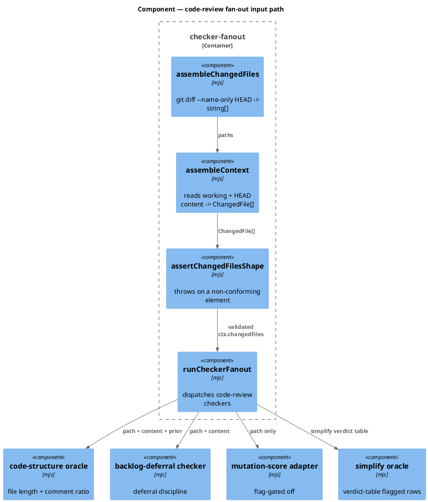
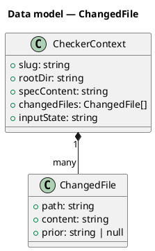
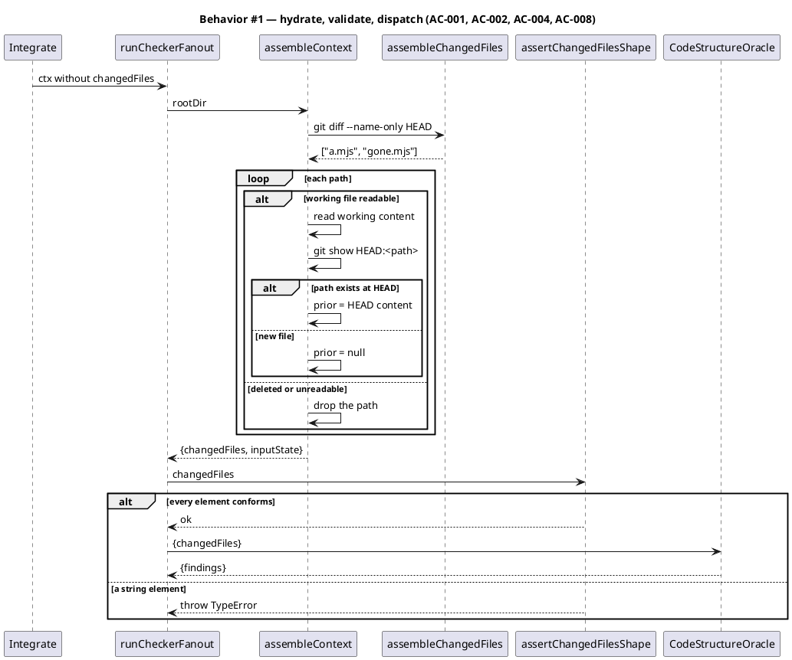
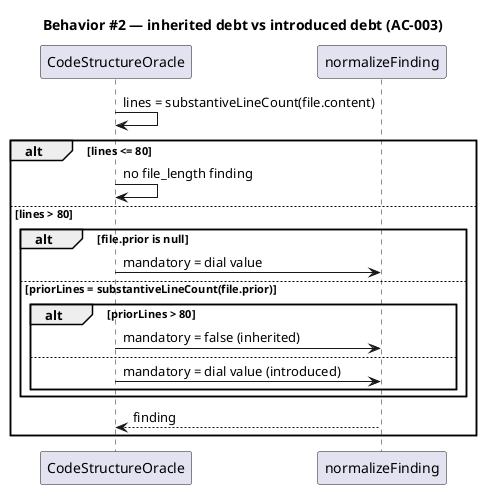
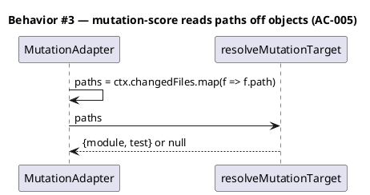
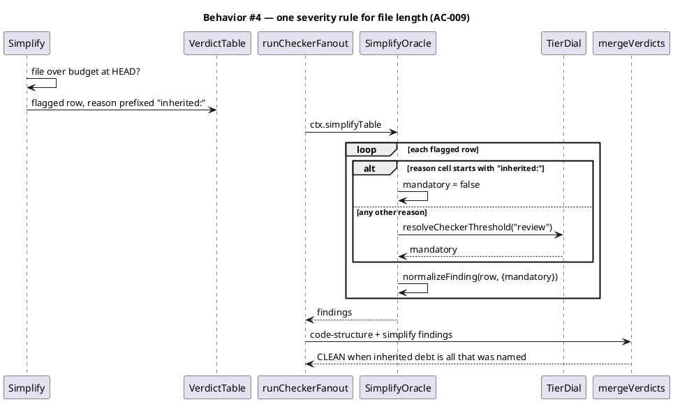
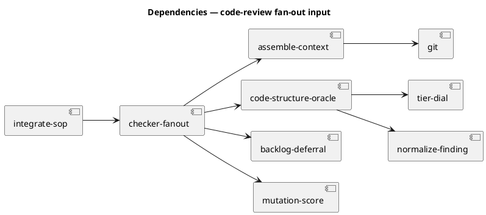

# The `ctx.changedFiles` element contract

## Context

| Input | Path |
|---|---|
| Intake | *(excepted — spec-entry track)* |
| BRD *(if any)* | *(none)* |
| Scout *(if any)* | *(excepted)* |
| Research *(if any)* | *(excepted)* |
| Backlog | `.claude/memory/backlog/1-ctx-changedfiles-has-two-readers-that-disagree-on-its-shape.md` |
| Backlog (umbrella) | `.claude/memory/backlog/code-review-fanout-defects-from-dispatcher-sweep-9444.md` |

**Write set**: `.claude/skills/harness/assemble-context.mjs`, `.claude/skills/harness/checker-fanout.mjs`, `.claude/skills/harness/checkers/mutation-score.mjs`, `.claude/skills/code-structure/oracle.mjs`, `.claude/skills/simplify/oracle.mjs`, `.claude/skills/simplify/SKILL.md`, `.claude/skills/integrate/SKILL.md`, `tests/**` — non-architectural profile.

## Goal

`ctx.changedFiles` carries one declared element type that every code-review checker reads the same way, and the code-structure oracle emits real findings against it instead of a `CLEAN` it never earned. Every oracle that grades file length applies one severity rule to it.

## Non-goals

- Repairing the 93 baseline-owned files already over the 80-line budget. This spec decides how the gate treats them; it fixes none of them.
- Changing the 80-line budget, the 0.50 comment-ratio bar, or the tier dial.
- Wiring `mutation-score` or `ac-conformance` on. Both stay flag-gated off.
- Touching the gate-A spec-review fan-out. Only the code-review phase reads `changedFiles`.

## Design

@ref element:harness-helpers

### The defect, measured

`assembleChangedFiles` returns path **strings** from `git diff --name-only HEAD`. Two of the three registered code-review checkers read `{path, content}` **objects**:

| Checker | Reads | Against a string | Result |
|---|---|---|---|
| `code-structure` | `file.content`, `file.path` | `substantiveLineCount(undefined)` → `0`; `0 > 80` is false | `{findings: []}` |
| `backlog-deferral` | `file?.path.startsWith(...)` | `undefined?.startsWith` → skip every file | `{findings: []}` |
| `mutation-score` | the element as a path string | works | correct, but flag-gated off |

Both object-readers return an empty finding list with no error and no skip marker, so the merged verdict is byte-identical to a real pass. `commentRatioFinding` returns `null` on `substantive === 0`, so the oracle's second check is dead by the same path.

The earlier `assembleContext` work gave the input an owner — before it, no producer existed at all. It did not close this: the gate moved from unfed to reliably misfed.

### C4 — Component



### Data model — class diagram

`ChangedFile` is the declared element type. `prior` is the file's content at `HEAD`, or `null` when this change created it.



No DDL — the baseline has no database. The class diagram mirrors the object literal `assembleContext` returns.

#### Decision D1 — objects, not strings

Objects win, and the direction is not symmetric. A checker holding an object derives the path with `file.path`; a checker holding a string cannot derive content without doing IO of its own, inside a checker that is required to be read-only and pure. Two of three consumers need content. One needs a path and can map for it.

`assembleChangedFiles` keeps returning `string[]`. It is the honest name for a `git diff --name-only` probe, `tests/checker-fanout.test.mjs:166` pins that shape today, and splitting the probe from the content read keeps the git call in one place. `assembleContext` is where hydration happens.

#### Decision D2 — the budget is a property of the file; the severity is a property of the change

The 80-line budget measures whole-file length, because that is what layer discipline is about. Measuring only added lines against a file-length budget compares two different quantities.

Blocking on whole-file length is the part that cannot ship as-is. **93 of 300 baseline-owned `.mjs`/`.js` files are already over budget — 31%**, including `.claude/hooks/lib/common.mjs` at 618 substantive lines, which almost every hook workflow touches. A BLOCKER on whole-file length freezes a third of the repository behind a split nobody asked for.

So severity splits on who created the debt:

| Case | `prior` | Severity |
|---|---|---|
| This change pushed the file over budget | at or under 80 substantive lines | BLOCKER (tier-dial `mandatory`) |
| The file was already over budget | over 80 substantive lines | ADVISORY |
| This change created the file | `null` | BLOCKER |

This is enforce-on-touch without the punishment: the gate names inherited debt every time the file is touched, and blocks only debt the change itself introduced. `comment_ratio` is unaffected — it is already forced advisory and stays there.

Computing this needs the `HEAD` content, which is IO. It therefore belongs in the producer, and `prior` reaches the oracle as plain content. The oracle keeps deciding; it never reads a file.

#### Decision D3 — an unreadable path is dropped, never fatal

A path in `git diff --name-only HEAD` can be absent from the working tree: the change deleted it, or a concurrent checkout moved it. Hydration reads the working-tree bytes first, so that read is the test. When it throws, `hydrateChangedFile` returns `null` and the element is filtered out.

Dropping is right because the alternative is worse in both directions. Throwing would let one deleted file fail the whole gate, and the gate is the thing this spec is trying to make trustworthy. Emitting the element with `content: null` would push the same absent-file check into every checker, which is the exact duplication D1 removes.

A deletion carries no file to measure against a file-length budget, so nothing is lost by dropping it.

#### Decision D4 — one severity rule for file length, wherever it is applied

D2 splits file-length severity on who created the debt, and taught `code-structure` that split. It is not the only oracle that grades file length.

`simplify/oracle.mjs` reads the `/simplify` verdict table and emits a BLOCKER for **every** `flagged` row, at the `review` tier dial. A `flagged` row is how `/simplify` records an out-of-scope refactor it deliberately did not perform — including a file that was already over budget before the change. So the two oracles grade the same fact and disagree:

| Oracle | Reads | A file over budget at `HEAD` |
|---|---|---|
| `code-structure` | `prior` content | ADVISORY (D2) |
| `simplify` | the verdict table row | BLOCKER |

The merge takes the stricter severity, so `code-structure`'s correct ADVISORY is overridden by `simplify`'s BLOCKER and the landing is blocked on inherited debt — the outcome D2 exists to prevent. This is live, not theoretical: it blocked `workspace-corpus-backfill` on 2026-08-06 with `simplify_flag on store.mjs (142 lines; 114 pre-existing)`, and it blocked this workflow's own `/integrate`.

D2 is therefore a rule about the fact, not about one oracle. `simplify` reads a rendered table and has no `prior` content, so it cannot recompute the split — it must be told. The `/simplify` skill already knows which debt it inherited, because that is what it wrote in the reason cell. The reason cell becomes the carrier:

| `flagged` row | Severity |
|---|---|
| reason cell declares inherited debt (`inherited:` prefix) | ADVISORY |
| every other reason | BLOCKER (tier-dial `mandatory`) |

A prefix rather than prose matching, because a severity decision reading English adverbs is a severity decision nobody can predict. `/simplify` writes `inherited:` only for a condition it measured at `HEAD`; an unprefixed row keeps today's blocking behaviour, so every existing verdict table is unchanged.

The prefix needs a producer, and the producer is prose. `.claude/skills/simplify/SKILL.md` Step 3 tells the reviewer what a `flagged` row means; it must also tell them when the row carries the prefix, or the rule is inert and `checker-fanout.mjs` blocks exactly as it does today. This is the same repair AC-007 makes to `integrate/SKILL.md`: a consumer was given a contract to read, and the SOP that produces it never named it. The failure this whole spec exists to fix is a producer and a consumer disagreeing because no document said which one was right.

Reading `prior` off `ctx.changedFiles` instead — no prefix, no producer change — was the obvious shortcut and it over-applies. A row flagged for an unrelated refactor on a file that happens to be over budget at `HEAD` would go ADVISORY on file identity alone. Only `/simplify` knows why it flagged a row, so only `/simplify` can declare the flag inherited.

### Behavior — sequence per AC









### State — core entity

*(omitted — the fan-out input has no state machine; it is built once per code-review dispatch and discarded.)*

### Dependencies — graph



Acyclic. `assemble-context` gains no dependency on any checker, so the producer stays ignorant of who reads it.

### Contracts

| Kind | Name | Input | Output | Errors | Idempotent |
|---|---|---|---|---|---|
| Function | `assembleChangedFiles({rootDir, exec})` | root dir, injectable exec | `string[]` | git failure → `[]` | yes |
| Function | `assembleContext({rootDir, exec, readFile})` | root dir, injectable IO | `{changedFiles: ChangedFile[], inputState}` | unreadable path → dropped | yes |
| Function | `assertChangedFilesShape(changedFiles)` | any value | `undefined` | `TypeError` naming the offending index and its type | yes |
| Function | `runCodeStructureOracle({changedFiles}, deps)` | `ChangedFile[]` | `{findings}` | none — non-array → `{findings: []}` | yes |
| Function | `resolveMutationTarget(paths)` | `string[]` | `{module, test}` or `null` | none | yes |

`assertChangedFilesShape` is the one new export that throws. Every other function on this path is fail-open by existing contract, which is exactly why the defect was silent — so the shape check is deliberately the loud one.

### Libraries and versions

| Library@version | Purpose | Key APIs | Confirmed against current docs |
|---|---|---|---|
| Node.js built-in `node:child_process` | run `git` | `execFileSync` | yes — already in use at `assemble-context.mjs:15` |
| Node.js built-in `node:fs` | read working-tree content | `readFileSync` | yes — already in use across hooks |
| Node.js built-in `node:test` | test runner | `describe`, `it` | yes — the project's binding test command |

No third-party library is added. No `context7` lookup is owed.

### Alternatives considered

| Alt | Summary | Rejected because |
|---|---|---|
| A | Make the two object-readers accept strings and do their own `readFileSync` | Puts IO inside checkers that are contracted read-only and pure, and repeats the read once per checker per file. |
| B | Ship the shape fix with `code-structure` forced advisory for one release | Buys a quiet release and leaves the gate unearned. D2 already separates inherited from introduced debt, so the blocking half is safe on day one. |
| C | Measure only added lines against the 80-line budget | Compares a change-size number to a file-length budget. A 40-line addition to a 600-line module would pass. |
| E | Split `checker-fanout.mjs` below 80 lines to clear the flag | Clears one verdict and leaves the collision live. The next workflow touching any of the 93 over-budget files hits the same BLOCKER, and this one already fired in August. |
| F | Have `simplify` recompute the split from `git show HEAD:<path>` | Puts IO in an oracle contracted read-only and pure — the same reason D1 moved hydration into the producer. |
| H | Have `simplify` read `prior` off `ctx.changedFiles` and skip the producer change | Over-applies. A row flagged for an unrelated refactor on a file over budget at `HEAD` would go ADVISORY on file identity alone; the oracle cannot recover why the row was flagged. |
| G | Drop `simplify` from the code-review registry | Removes a working checker to silence one wrong severity. The deferral discipline it enforces is worth keeping. |
| D | Raise the budget until the repo fits under it | Rewrites the standard to match the debt. The budget is not what is broken. |

## Program design

### Data access

| Reader | Source | Access path | Written by |
|---|---|---|---|
| `assembleChangedFiles` | git index + working tree | `execFileSync('git', ['diff','--name-only','HEAD'])` | nothing — read-only |
| `assembleContext` | working-tree file bytes | `readFileSync(join(rootDir, path), 'utf8')` | the workflow's own edits |
| `assembleContext` | `HEAD` blob | `execFileSync('git', ['show', 'HEAD:<path>'])` | nothing — read-only |
| `runCodeStructureOracle` | `ctx.changedFiles` | in-process argument | `assembleContext` |
| `mutationScoreAdapter` | `ctx.changedFiles` | in-process argument | `assembleContext` |
| `run` (backlog-deferral) | `ctx.changedFiles` | in-process argument | `assembleContext` |

One writer. Every checker reads the same object it did not build.

### Call stack

Load-bearing — the hydration crosses from the harness Foundation layer into three Domain checkers, and the silent failure lived exactly at that seam.

```
/integrate Step 3.5
  └─ runCheckerFanout                     harness/checker-fanout.mjs
       ├─ assembleContext                 harness/assemble-context.mjs
       │    ├─ assembleChangedFiles       harness/assemble-context.mjs  (git probe)
       │    └─ hydrateChangedFile         harness/assemble-context.mjs  (working + HEAD read)
       ├─ assertChangedFilesShape         harness/assemble-context.mjs  (throws)
       └─ Promise.all over the registry
            ├─ runCodeStructureOracle     code-structure/oracle.mjs
            ├─ run (backlog-deferral)     harness/checkers/backlog-deferral.mjs
            └─ mutationScoreAdapter.run   harness/checkers/mutation-score.mjs
```

### Layout

```
.claude/skills/harness/
  assemble-context.mjs        changed  — hydrate to ChangedFile[]; add hydrateChangedFile + assertChangedFilesShape
  checker-fanout.mjs          changed  — one call to assertChangedFilesShape before dispatch
  checkers/mutation-score.mjs changed  — map ctx.changedFiles to paths before resolveMutationTarget
.claude/skills/code-structure/
  oracle.mjs                  changed  — inherited-vs-introduced severity on file_length
.claude/skills/integrate/
  SKILL.md                    changed  — Step 3.5 names the element type
tests/
  changedfiles-shape-contract.test.mjs  new  — the shape contract and the vacuity regression
  checker-fanout.test.mjs     unchanged surface — pins assembleChangedFiles as string[]; still true after D1
```

## Design calls

- *(none)* — the write set intersects no path in `project.json → tdd.ui_globs`.

## System delta

| Verb | Element | Anchor | Concept | Kind |
|---|---|---|---|---|
| change | harness-helpers | `.claude/skills/harness/*.mjs` | harness-loop | c4_component |
| change | harness-checkers | `.claude/skills/harness/checkers/*.mjs` | harness-loop | c4_component |
| change | code-structure-oracle | `.claude/skills/code-structure/*.mjs` | tdd-verification | c4_component |
| change | simplify-helpers | `.claude/skills/simplify/*.mjs` | review-fanout | c4_component |

## Acceptance criteria

| ID | Criterion (given / when / then) | Kind | Upstream AC | Sequence |
|---|---|---|---|---|
| AC-001 | given a changed path readable in the working tree, when `assembleContext` runs, then every element of `changedFiles` is an object carrying `path` (string), `content` (string) and `prior` (string or `null`) | behavior | backlog `-9444` defect 1 | §Behavior #1 |
| AC-002 | given a changed file of 120 substantive lines fed through the real producer, when the code-review fan-out dispatches, then `code-structure` returns at least one `file_length` finding naming that path | behavior | backlog `-9444` defect 1 | §Behavior #1 |
| AC-003 | given a changed file over budget whose `HEAD` content was also over budget, when `runCodeStructureOracle` runs, then the `file_length` finding is ADVISORY; given one whose `HEAD` content was at or under budget, then it is BLOCKER | behavior | D2 | §Behavior #2 |
| AC-004 | given a path in the diff that no longer exists in the working tree (a deletion), when `assembleContext` runs, then that path is dropped from `changedFiles`, no exception escapes, and the remaining paths hydrate normally | behavior | D3 | §Behavior #1 |
| AC-005 | given `ctx.changedFiles` holding `ChangedFile` objects, when `mutationScoreAdapter.run` executes, then `resolveMutationTarget` receives path strings and resolves the same target it resolved from a bare string list | behavior | backlog `-9444` defect 1 | §Behavior #3 |
| AC-006 | given a changed file under `.claude/memory/backlog/` fed through the real producer, when the fan-out dispatches, then `backlog-deferral` inspects its content rather than skipping it | behavior | backlog `-9444` defect 1 | §Behavior #1 |
| AC-007 | given `.claude/skills/integrate/SKILL.md`, when a reader reaches Step 3.5, then the paragraph names `ctx.changedFiles` as `Array<{path, content, prior}>` and links the shape to `assembleContext` | behavior | backlog `-9444` "the SOP has to name it" | §Behavior #1 |
| AC-008 | given a `changedFiles` array holding a string element, when `runCheckerFanout` dispatches a code-review phase, then `assertChangedFilesShape` throws a `TypeError` naming the offending index and its actual type, before any checker runs | preflight | backlog `-9444` "a test has to hold it" | §Behavior #1 |

| AC-009 | given a `/simplify` verdict table carrying a `flagged` row whose reason cell begins `inherited:`, when `runSimplifyOracle` runs, then that finding is ADVISORY; given a `flagged` row with any other reason, then it is BLOCKER at the tier-dial severity | behavior | D4 | §Behavior #4 |

| AC-010 | given `.claude/skills/simplify/SKILL.md`, when a reviewer reaches the flagged-row rule in Step 3, then the SOP directs the `inherited:` prefix for length the file already carried at `HEAD`, and names `HEAD` as the measurement point | behavior | D4 | §Behavior #4 |

Nothing here is deferred, so no row carries a `deferred:` tag.

## Test plan

| Category | Scenario | Expected | Covers |
|---|---|---|---|
| Golden path | `assembleContext` over a temp repo with two modified files | two `ChangedFile` objects, `inputState: measured` | AC-001 |
| Golden path | 120-line fixture through the real producer into the fan-out | ≥ 1 `file_length` finding naming the fixture | AC-002 |
| Golden path | backlog `.md` fixture through the real producer | `backlog-deferral` inspects content, does not skip | AC-006 |
| Input boundary | file at exactly 80 substantive lines, and at 81 | no finding at 80; finding at 81 | AC-002 |
| Input boundary | file over budget whose `HEAD` version was over budget | finding present, `mandatory` false | AC-003 |
| Input boundary | file over budget whose `HEAD` version was under budget | finding present, `mandatory` from the dial | AC-003 |
| Input boundary | new file over budget, no `HEAD` version | `prior` is `null`, finding is BLOCKER | AC-003 |
| Contract violation | `changedFiles: ['a.mjs']` into `runCheckerFanout` | `TypeError` naming index 0 and type `string` | AC-008 |
| Contract violation | `changedFiles: [{path: 'a.mjs'}]` (no `content`) | `TypeError` naming index 0 | AC-008 |
| Failure mode | a diff path deleted from the working tree | path dropped, siblings hydrate, no throw | AC-004 |
| Failure mode | `git show HEAD:<path>` fails for a path present in the tree | `prior` is `null`, hydration continues | AC-004 |
| Failure mode | git probe throws entirely | `changedFiles: []`, `inputState: no-input` | AC-001 |
| Regression trap | `assembleChangedFiles` still returns `string[]` | unchanged — `tests/checker-fanout.test.mjs` stays green | AC-001 |
| Regression trap | `mutation-score` resolves the same target from objects as from strings | identical `{module, test}` | AC-005 |
| Regression trap | every code-review entry in `DEFAULT_CHECKER_REGISTRY` runs against a hydrated fixture without returning a vacuous `[]` for a file that should trip it | no silent empty | AC-002, AC-006 |
| Input boundary | `flagged` row, reason `inherited: 149 lines; over budget at HEAD` | finding present, `mandatory` false | AC-009 |
| Input boundary | `flagged` row, reason `extract the retry loop` | finding present, `mandatory` from the dial | AC-009 |
| Input boundary | reason cell reading `not inherited: a fresh 300-line module` | BLOCKER — the prefix anchors at the start, and this row does not carry it | AC-009 |
| Failure mode | verdict table with a `flagged` row and an empty reason cell | BLOCKER — an absent reason is not an inheritance claim | AC-009 |
| Regression trap | every existing `flagged` row without the prefix | severity byte-unchanged from today | AC-009 |
| Golden path | `simplify/SKILL.md` Step 3 read end to end | the prefix rule is stated with `HEAD` as the measurement point | AC-010 |
| Regression trap | this branch's own verdict table through the real oracle | `checker-fanout.mjs` row is ADVISORY, merged verdict is CLEAN | AC-009 |
| Regression trap | `integrate/SKILL.md` Step 3.5 contains the element-type sentence | present | AC-007 |

## Observability

| Signal | Name | Shape | Purpose |
|---|---|---|---|
| Projection | `.claude/state/checker-fanout-code/<slug>.json` | existing merged verdict + `inputState` | the record that read `CLEAN` for its whole life; after this spec a real finding appears there |
| Finding artifact | `{kind: 'file-length', file, lines}` | existing `normalizeFinding` artifact | per-file evidence in the verdict |
| Exception | `TypeError` from `assertChangedFilesShape` | message names index + actual type | a malformed ctx fails loudly instead of passing quietly |

No new log, metric, or alarm. The failure this spec fixes was invisible because it produced no signal; the remedy is a throw and a real finding, not a counter.

## Rollout

### Prerequisites

| # | Prerequisite | enforced-by |
|---|---|---|
| 1 | No code-review checker receives a `changedFiles` element that is not a conforming `ChangedFile` | AC-008 |

- **Feature flag**: none added. The path is already gated by `velocity.code_review.enabled` (fail-open when absent).
- **Migration order**: 1 hydrate the producer → 2 add the shape assertion → 3 adapt `mutation-score` → 4 split severity in the oracle → 5 name the type in the SOP.
- **Canary**: this workflow's own `/integrate` is the canary. The fan-out runs over this change's diff, and `assemble-context.mjs` and `oracle.mjs` are both under budget today, so a `file_length` BLOCKER on either means step 4 went wrong.

Steps 1 and 2 must land together. A hydrated producer with no assertion re-opens the same silent-mismatch window for the next checker added.

## Rollback

- **Kill-switch**: set `velocity.code_review.enabled` to `false` in `.claude/project.json`. Step 3.5 skips, and the fan-out's code-review phase does not run.
- **Signal to roll back**: the code-review fan-out emits a BLOCKER naming a file this change did not create — from either oracle, `code-structure` or `simplify` — on any workflow within one day of landing. That means D2's inherited-vs-introduced split is misreading `prior`, and it turns the 93 already-over-budget files into a repository freeze — the exact outcome D2 exists to prevent.

## Archive plan

- Defaults *(automatic)*: spec, spec-rendered/, spec approval, security report, workflow.json.
- Extras *(list any non-default files)*:
  - *(none)*

## Open questions

- *(none)* — D1 through D4 are decided above with the measurements behind them. The 93 files already over budget are recorded as inherited debt, not as a question this spec leaves open.
