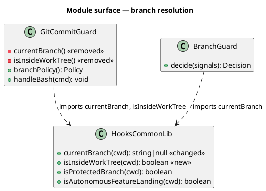
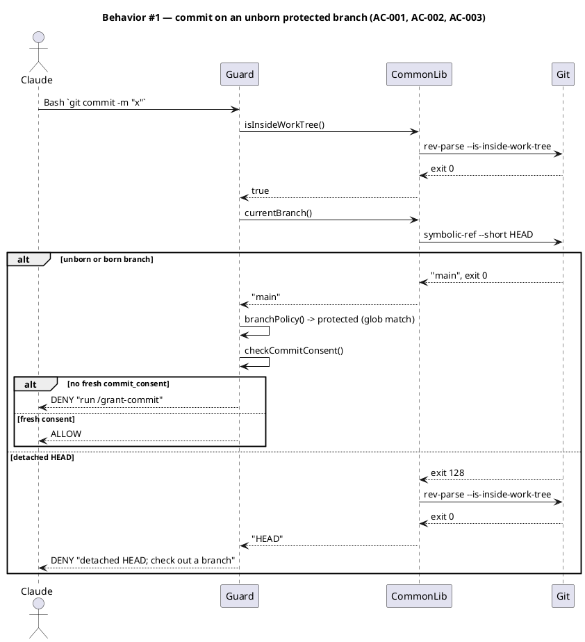
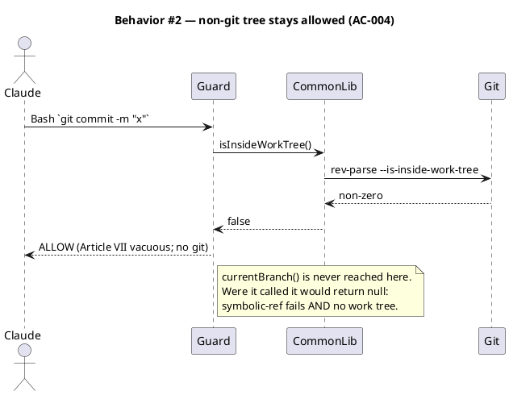
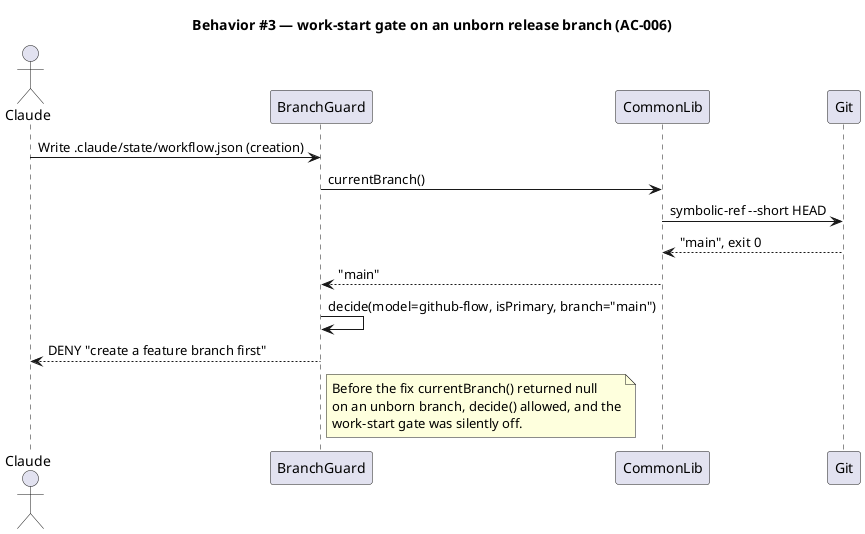
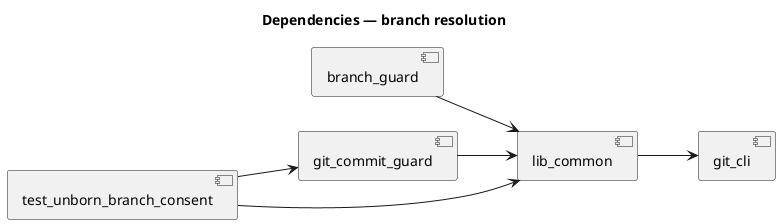

# Spec — resolve the current branch on an unborn HEAD

## Context

| Input | Path |
|---|---|
| Intake | *(none — entered at `/spec` via `/triage`; the request is the reported defect below)* |
| BRD | *(none)* |
| Scout | *(excepted)* |
| Research | *(excepted)* |

**Write set**: `.claude/hooks/git_commit_guard.mjs`, `.claude/hooks/lib/common.mjs`, `tests/**`, `docs/init/seed.md`, `src/seed.template.md`

**The defect.** `git_commit_guard.mjs:91 currentBranch()` shells `git rev-parse --abbrev-ref HEAD`. On an unborn branch — a repository initialized but with no commit yet — that command exits 128 (and writes the literal `HEAD` to stdout). The `catch` returns `null`, `branchPolicy()` maps `null` to `notGit: true`, and `handleBash` falls through to `ALLOWED unprotected-branch`. The detached deny, the topology check, and the consent check are all skipped. `.claude/hooks/lib/common.mjs:900` carries the identical body, so `branch_guard` and `isAutonomousFeatureLanding()` degrade the same way.

**Reproduced at `d23c06b`.** One scratch repo, `git.protected_branches: ["main"]`. Fed `git commit -m test`, the guard emits nothing and exits 0. After a single `--allow-empty` commit in that same repo, the same input emits `deny: no consent granted`. The only variable is whether HEAD is born.

**Why it is not cosmetic.** The first commit is where branch policy is least recoverable: it establishes the branch, and `FORBIDDEN_RE` blocks every rewrite of it (`--amend`, `reset --hard`). A fresh `/init-project` repository sits in exactly this state.

## Goal

`currentBranch()` resolves the branch name on an unborn HEAD, so `git_commit_guard` evaluates its full branch policy on a repository's first commit exactly as it does on every later one.

## Non-goals

- **Changing the not-a-git-repo path.** A tree that is not a work tree still resolves to `null` and still allows the operation. Project-agnostic mode is sanctioned (CLAUDE.md Art. III), and Article VII is vacuous there.
- **Closing the transient-git-failure allow.** If `git` itself is unavailable or the refs are corrupt, both probes fail and the guard allows — the accepted risk already recorded at `docs/archive/2026-05-15/branch-aware-git-policy/security.md`. This spec does not widen it and does not close it.
- **Changing the `'HEAD'` sentinel contract.** Detached HEAD keeps returning the literal `'HEAD'`; every consumer that already special-cases it is untouched.
- **Repairing the archived scout report.** `docs/archive/**` is an immutable landed bundle.

## Design

@ref element:git-commit-guard

The structural kinds are the standing shape of the guard substrate, which the corpus already models. What changes here is one predicate's resolution strategy and where it lives.

### Resolution strategy

`git symbolic-ref --short HEAD` reads `.git/HEAD` and prints the branch it points at. It does not need the branch to have a commit, so it exits 0 and prints `main` on an unborn branch where `rev-parse --abbrev-ref` exits 128. On a detached HEAD it exits 128, which is the signal that distinguishes the two failures `rev-parse` conflates.

That leaves one ambiguity: `symbolic-ref` also fails outside a git repository. A second probe separates them.

| `symbolic-ref --short HEAD` | `rev-parse --is-inside-work-tree` | Return | Guard outcome |
|---|---|---|---|
| exit 0, non-empty | *(not run)* | the branch name | full policy evaluates |
| non-zero | exit 0 | `'HEAD'` | detached deny |
| non-zero | non-zero | `null` | not a git repo — allow (Art. VII vacuous) |

The invariant this establishes: **inside a work tree, `currentBranch()` never returns `null`.** The `notGit` arm of `branchPolicy()` becomes reachable only when there is no work tree, which `handleBash` already guards ahead of it. There is no remaining path from "in a repo" to "no policy".

### Single-sourcing

`git_commit_guard.mjs` defines its own `currentBranch()` and `isInsideWorkTree()` rather than importing the ones in `lib/common.mjs` — which is how one copy could be fixed and the other left blind. Both local definitions are deleted; the guard imports both from `lib/common.mjs`, which already exports `currentBranch` and gains an exported `isInsideWorkTree`. The comment block at `git_commit_guard.mjs:10` naming `rev-parse --abbrev-ref` is corrected with it.

The guard's local copies default to `CLAUDE_PROJECT_ROOT`, which is the same constant `lib/common.mjs` uses as its `cwd` default and which the guard already imports — so the call sites need no argument change.

### Data model — module surface

No persistent data model and no DDL: this change has no store, so no `ALTER` accompanies the stereotypes below. The class diagram models the module surface the change alters. `HooksCommonLib` is `.claude/hooks/lib/common.mjs`, `GitCommitGuard` is `.claude/hooks/git_commit_guard.mjs`, `BranchGuard` is `.claude/hooks/branch_guard.mjs`.



### Behavior — sequence per AC







### Dependencies — graph



### Contracts

| Kind | Name | Input | Output | Errors | Idempotent |
|---|---|---|---|---|---|
| Function | `currentBranch(cwd = CLAUDE_PROJECT_ROOT)` | working directory | branch name, `'HEAD'` when detached, `null` when not a work tree | none — total fn, never throws | yes (read-only) |
| Function | `isInsideWorkTree(cwd = CLAUDE_PROJECT_ROOT)` | working directory | `true` / `false` | none — total fn, never throws | yes (read-only) |

### Libraries and versions

| Library@version | Purpose | Key APIs | Confirmed against current docs |
|---|---|---|---|
| `git@>=2.30` (CLI) | branch identity | `git symbolic-ref --short HEAD`, `git rev-parse --is-inside-work-tree` | yes — behavior verified by direct execution at `d23c06b` (unborn: `symbolic-ref` exit 0, `rev-parse --abbrev-ref` exit 128) |
| `node:child_process` | shelling out | `execFileSync` | yes — already the module's idiom |

### Alternatives considered

| Alt | Summary | Rejected because |
|---|---|---|
| A | Keep `rev-parse --abbrev-ref` and read its stdout without checking the exit code | It prints the literal `HEAD` on an unborn branch, which is the detached sentinel. The guard would deny every first commit instead of evaluating policy — a different bug, not a fix. |
| B | Patch only `git_commit_guard.mjs`, leave `lib/common.mjs` | Leaves `branch_guard` and `isAutonomousFeatureLanding()` blind, and leaves the duplicate that let the two drift in the first place. |
| C | Fail safe to protected whenever the branch is unresolvable, including outside a repo | Denies commits in project-agnostic mode, which CLAUDE.md Art. III sanctions. The work-tree probe gives the same safety without that cost. |

## Program design

### Data access

| Reader | Source | Access path | Written by |
|---|---|---|---|
| `lib/common.mjs → currentBranch` | `.git/HEAD` | `execFileSync('git', ['symbolic-ref','--short','HEAD'])` | git — read-only here |
| `lib/common.mjs → isInsideWorkTree` | git repository discovery | `execFileSync('git', ['rev-parse','--is-inside-work-tree'])` | git — read-only here |
| `git_commit_guard → branchPolicy` | `project.json → git.protected_branches`, `git.branch_pattern` | `projectGet` | the human, by hand |

### Call stack

```
handleBash(cmd)                                  git_commit_guard.mjs
  ├─ isInsideWorkTree()                          lib/common.mjs   (imported, was local)
  └─ branchPolicy()                              git_commit_guard.mjs
       └─ currentBranch()                        lib/common.mjs   (imported, was local)
            ├─ git symbolic-ref --short HEAD     IO boundary
            └─ isInsideWorkTree()                lib/common.mjs   (only on non-zero exit)
```

### Layout

```
.claude/hooks/
  lib/common.mjs            changed  — currentBranch() resolves via symbolic-ref; isInsideWorkTree() added and exported
  git_commit_guard.mjs      changed  — local currentBranch() + isInsideWorkTree() deleted, both imported; header comment corrected
  branch_guard.mjs          unchanged surface — already imports currentBranch; inherits the fix with no edit
tests/
  unborn-branch-consent.test.mjs   new  — unborn/born parity, detached regression, non-git allow, single-source assertion
docs/init/seed.md           changed  — §18.4 branch-aware consent policy names symbolic-ref and the unborn case
src/seed.template.md        changed  — same amendment, mirrored
```

## Design calls

*(none)* — the write set intersects no `tdd.ui_globs` path.

## System delta

| Verb | Element | Anchor | Concept | Kind |
|---|---|---|---|---|
| change | hooks-common-lib | `.claude/hooks/lib/common.mjs` | git-policy | c4_component |
| change | git-commit-guard | `.claude/hooks/git_commit_guard.mjs` | git-policy | c4_component |

## Acceptance criteria

| ID | Criterion (given / when / then) | Kind | Upstream AC | Sequence |
|---|---|---|---|---|
| AC-001 | given a work tree on an unborn branch `main` with `git.protected_branches: ["main"]` and no fresh `commit_consent`, when the guard receives Bash `git commit -m "x"`, then it emits `permissionDecision: "deny"` naming `/grant-commit` | behavior | reported defect | §Behavior #1 |
| AC-002 | given one repository, when the guard is fed the same `git commit` payload before its first commit and again after an `--allow-empty` commit, then both decisions are byte-identical | behavior | reported defect | §Behavior #1 |
| AC-003 | given a work tree with a detached HEAD, when the guard receives Bash `git commit -m "x"`, then it denies with the detached-HEAD message — unchanged from today | behavior | regression trap | §Behavior #1 |
| AC-004 | given a directory that is not a git work tree, when the guard receives Bash `git commit -m "x"`, then it allows, and `currentBranch()` in that directory returns `null` | behavior | Art. VII vacuity | §Behavior #2 |
| AC-005 | given the repository at HEAD, when `git_commit_guard.mjs` is parsed, then it declares no local `currentBranch` or `isInsideWorkTree` function and imports both from `./lib/common.mjs` | preflight | single-source decision | §Behavior #1 |
| AC-006 | given `git.workflow_model: "github-flow"` on a primary work tree at an unborn release branch `main`, when `branch_guard` sees creation of `.claude/state/workflow.json`, then it denies with the feature-branch message | behavior | inherited-fix scope | §Behavior #3 |
| AC-007 | given the landed tree, when the branch-aware consent paragraph of `docs/init/seed.md` and of `src/seed.template.md` is read, then each names `git symbolic-ref --short HEAD` as the branch read and states the unborn-branch case | preflight | genesis amendment (Art. I.4) | §Behavior #1 |

## Test plan

| Category | Scenario | Expected | Covers |
|---|---|---|---|
| Golden path | unborn `main`, protected, no consent, `git commit` | deny naming `/grant-commit` | AC-001 |
| Golden path | unborn `main`, protected, fresh `commit_consent` on disk | allow | AC-001 |
| Regression trap | same sandbox, same payload, before and after the first commit | identical stdout | AC-002 |
| Regression trap | detached HEAD, `git commit` | deny with the detached-HEAD message | AC-003 |
| Regression trap | born branch matching no protected glob | allow, unchanged | AC-002 |
| Failure mode | directory outside any repository | allow; `currentBranch()` returns `null` | AC-004 |
| Contract violation | `currentBranch()` unit: unborn → name, detached → `'HEAD'`, non-repo → `null` | all three | AC-001, AC-003, AC-004 |
| Input boundary | unborn branch named with a slash, via `git init -b feat/x` | resolves to `feat/x`, not truncated | AC-001 |
| Contract violation | source assertion: no local `currentBranch` / `isInsideWorkTree` declaration in `git_commit_guard.mjs`; both named in its import list | passes | AC-005 |
| Golden path | `branch_guard.decide` driven live on an unborn github-flow release branch | deny | AC-006 |
| Contract violation | both seed files contain `symbolic-ref --short HEAD` in the branch-aware consent paragraph | passes | AC-007 |

## Observability

| Signal | Name | Shape | Purpose |
|---|---|---|---|
| Log | `git_commit_guard BLOCKED` | existing `logLine` rows, now carrying a real `branch=` on an unborn branch | audit — an unborn-branch commit is now visible in `.claude/state/logs/` instead of absent |
| Log | `branch_guard BLOCK` | existing row, `branch=<name>` instead of `branch=null` | audit |

No metric and no alarm: this is a local hook with no service surface.

## Rollout

### Prerequisites

| # | Prerequisite | enforced-by |
|---|---|---|
| 1 | `git_commit_guard.mjs` holds no second copy of the branch predicates when the change lands | AC-005 |
| 2 | The genesis text and its mirror describe the shipped command before the change is committed | AC-007 |

- **Feature flag**: none. A guard that fails open on the repository's first commit has no configuration worth preserving, and a flag would be a switch for keeping the defect.
- **Migration order**: single commit — `lib/common.mjs`, then the guard, then the tests, then the two seed files. No data migration.
- **Canary**: none. The full test suite plus `audit-baseline` is the signal; the blast radius is one process invoked per tool call.

## Rollback

- **Kill-switch**: `git revert <sha>` of the single landing commit. The change adds no state and no config key, so revert is total.
- **Signal to roll back**: any `git commit` or `git push` denied that was previously allowed on a **born** branch — visible immediately in `.claude/state/logs/git_commit_guard.log` on the first commit after landing. AC-002 and the born-branch regression row are what make that a real signal rather than a hope.

## Archive plan

- Defaults *(automatic)*: spec, spec-rendered/, spec approval, security report.
- Extras *(list any non-default files)*:
  - *(none)*

## Open questions

- *(none)* — the three decisions triage confirmed (symbolic-ref, single-source, work-tree fail-safe) are recorded above under Design.
