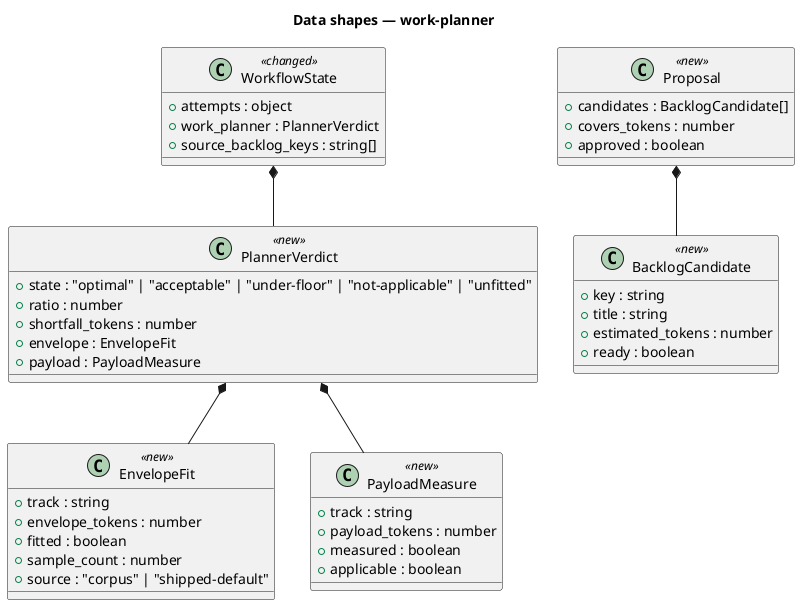
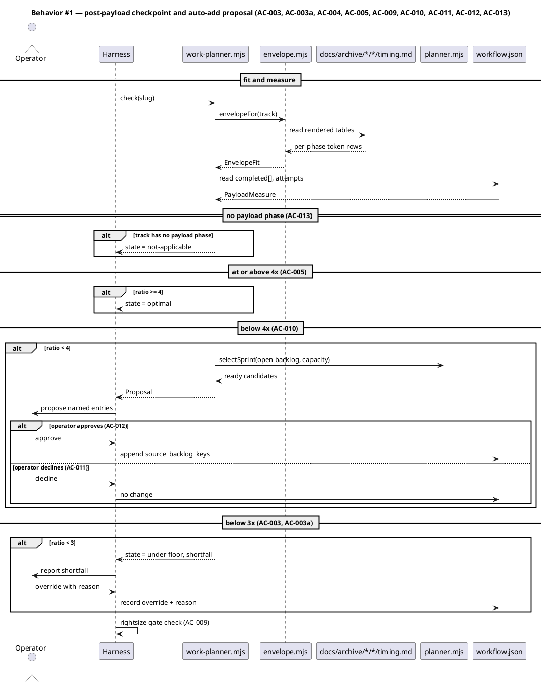
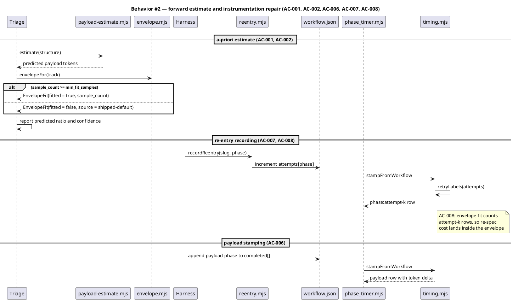
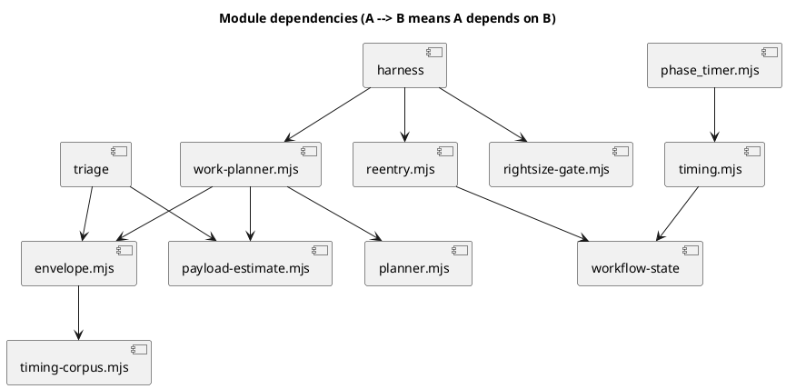

# Spec — work-planner-envelope

Slug: `work-planner-envelope` · Track: `intake-full` · Intake: `docs/intake/work-planner-envelope.md`

## Context

Every workflow pays a fixed cost independent of the work it carries. Measured by
`timing-corpus.mjs` over the 90 archived bundles that instrument both sides, the
median workflow spends **1.18x** its envelope on payload; the target is 3x (floor)
and 4x (optimal). The burden is concentrated: `intake-full` and `spec-entry` sit
near 1x while `tdd-quickfix` and `epic-child` already clear the bars.

The 1.30x over 92 bundles quoted at intake came from an ad-hoc probe that summed
worker-tick sub-rows alongside their parent. Sub-ticks anchor at the parent's start
and sum to its rollup (`timing.mjs:246`), so counting both double-counts payload.
The module excludes them and counts only re-entry retries, which anchor at the
parent's completion and are cost the parent row does not contain.

Nothing measures this today. `rightsize-gate` trims `{simplify, document}` by diff
size and never looks at cost. The timing ledger records per-phase token deltas but
no consumer computes a ratio from them.

## Goal

A workflow is sized before its tail runs, so the fixed overhead is a known fraction
of what the workflow spends rather than an unmeasured accident.

## Non-goals

- Commit boundaries and diff reviewability — `commit-planner` owns those.
- Work-type classification, track selection, or sequencing — `/triage` and
  `sprint-planner` own those.
- Replacing `rightsize-gate`. It answers which tail phases a payload warrants; this
  answers whether the payload is large enough to warrant a tail at all.
- Re-scoring or reporting on historical workflows.

## Decisions

Recorded in main context per CLAUDE.md XI.12. `codesign_mode` is off, so these are
Claude's calls against the research memo's open questions, reviewable here rather
than raised as gate questions.

| # | Decision | Owner | Rationale |
|---|---|---|---|
| D1 | Fit the envelope from the **rendered `timing.md`** in archived bundles, not from `.claude/state/timing/<slug>.jsonl`. | claude | The JSONL does not survive archival; the rendered table is the only durable corpus. D1 accepts the table's lossiness and mitigates it in D2. |
| D2 | A payload or envelope token cell that is **not a decimal integer** marks the bundle **unmeasured** and excludes it from the fit. Never coerced to zero. | claude | `n/a` means the transcript was unavailable, which is different from "cost nothing". Six archived bundles carry `n/a`; coercing them to zero would drag every fitted envelope down and silently. Same distinction `timing.mjs` already draws at its baseline row. |
| D3 | Fit **per track**, not globally. | claude | Measured per-track medians span 0.66x to 4.05x. One global envelope misprices most tracks in both directions. |
| D4 | The local fit replaces the shipped default at **>= 5 measured bundles for that track**. Below that, the shipped default is returned and reported `fitted: false`. | claude | Small enough that an operator reaches it within a normal working period; large enough that one outlier cannot own the median. The number is a config knob (`velocity.work_planner.min_fit_samples`), so an operator who disagrees is not forced to fork. |
| D5 | The `attempts` counter is written by a **single helper with one call site**, not by hand-editing `workflow.json` from SKILL.md prose. | claude | The archived timing research chose the hook over a model-appended log because a prose-driven record "is written by the model following SKILL.md prose; a missed/misordered append silently corrupts the table." `attempts` is the one field still written that way and the one field never recorded in 117 bundles. A helper does not make it oracle-bound — see Open questions — but it converts a multi-step hand edit into one named call, which is the failure mode that actually bit. |
| D6 | `swarm-dispatch` counts as **payload**. | claude | A swarm worker runs `Skill(scenario)` then `Skill(implement)`; the phase is the same work under a different execution shape. Flagged at intake as inference, not instruction. |

## Design

@ref element:harness-helpers

The change lives inside the harness's helper surface, which the referenced element
already models. The behavioural kinds below describe what this change adds.

### Class — the four data shapes

There is no database and no migration. State is JSON on disk, so this diagram
mirrors the file schemas rather than DDL.



### Sequence — the a-posteriori checkpoint and the auto-add proposal

Covers AC-003, AC-003a, AC-004, AC-005, AC-010, AC-011, AC-012, AC-013.



### Sequence — the forward estimate and the instrumentation repair

Covers AC-001, AC-002, AC-006, AC-007, AC-008.



### Dependency graph



## Program design

### Data access

| Reader | Source | Access path | Written by |
|---|---|---|---|
| `timing-corpus.mjs` | `docs/archive/*/*/timing.md` | `readFileSync` per bundle | `/archive` Step 2 (`timing.mjs render`) |
| `timing-corpus.mjs` | `docs/archive/*/*/workflow.json` | `readFileSync`, for `track_id` | `/commit` Step 1 |
| `envelope.mjs` | `velocity.work_planner` in `project.json` | `readFileSync` | nothing — read-only |
| `envelope.mjs` | shipped defaults table | in-module constant | nothing — read-only |
| `work-planner.mjs` | `.claude/state/workflow.json` | `readFileSync` | `/triage`, harness, `reentry.mjs` |
| `work-planner.mjs` | `.claude/memory/backlog/*.md` | `collectOpenBacklog` | `/memory-sync`, `sweep.mjs` |
| `reentry.mjs` | `.claude/state/workflow.json` | read-modify-write of `attempts` only | **sole writer of `attempts`** |
| `timing.mjs` | `workflow.json → attempts` | `retryLabels` | `reentry.mjs` |

`reentry.mjs` is the single writer of `attempts`. Nothing else may touch that field;
that is what D5 buys and what the test in the plan below pins.

### Call stack

```
Skill(harness) post-tdd-finalize
  └─ work-planner.mjs check --slug           work-planner.mjs
       ├─ envelopeFor(track)                 envelope.mjs
       │    └─ fitFromCorpus()               timing-corpus.mjs
       ├─ measurePayload(slug)               work-planner.mjs
       ├─ classify({envelope, payload})      work-planner.mjs   (pure)
       └─ proposeWork(shortfall)             planner.mjs -> selectSprint
  └─ rightsize-gate.mjs check --slug         rightsize-gate.mjs
```

### Layout

```
.claude/skills/harness/
  work-planner.mjs      new       — composition + CLI front door (Pattern B)
  verdict.mjs           new       — classify(); the only home of FLOOR and TARGET
  proposal.mjs          new       — candidate work; the one path that writes it
  envelope.mjs          new       — per-track fit + shipped defaults
  timing-corpus.mjs     new       — parse rendered timing.md into token rows
  payload-estimate.mjs  new       — a-priori structural estimator
  reentry.mjs           new       — sole writer of workflow.json -> attempts
  rightsize-gate.mjs    unchanged surface — composition order only (AC-009)
  SKILL.md              changed   — checkpoint wiring, reentry.mjs call site
.claude/skills/triage/
  SKILL.md              changed   — a-priori estimate step
tests/
  work-planner.test.mjs        new — classify, thresholds, not-applicable
  envelope-fit.test.mjs        new — fit, unmeasured exclusion, cold start
  payload-estimate.test.mjs    new — back-test against archived bundles
  reentry.test.mjs             new — single-writer + label round-trip
```

## Design calls

*(none)* — the write set contains no path under `project.json → tdd.ui_globs`.

## System delta

| Verb | Element | Anchor | Concept | Kind |
|---|---|---|---|---|
| change | harness-helpers | `.claude/skills/harness/*.mjs` | harness-loop | c4_component |

The draft also declared a `change` row for `timing-lib`. It was removed at `/archive`:
this workflow *reads* `.claude/hooks/lib/timing.mjs` and relies on its existing
`retryLabels` handling, but never modifies it, and `git status` confirms the file is
unmodified. A declared row the diff cannot confirm applies nothing, so leaving it
would have been a claim the evidence does not carry.

The seven-module split (rather than the five the draft named) came out of `/simplify`:
`work-planner.mjs` measured 155 substantive lines against the 80-line budget, so the
pure verdict and the proposal machinery moved to their own Domain modules. The public
surface is unchanged — `work-planner.mjs` re-exports both.

## Acceptance criteria

| ID | Upstream | Criterion | §Behavior | Kind |
|---|---|---|---|---|
| AC-001 | intake AC 1 | Envelope fitted from the corpus names its sample count. | §Behavior #2 | behavior |
| AC-002 | intake AC 2 | Zero-history repo returns the shipped default with `fitted: false`. | §Behavior #2 | preflight |
| AC-003 | intake AC 3 | Payload below 3x reports `under-floor` with shortfall, before any tail phase. | §Behavior #1 | behavior |
| AC-003a | intake AC 3a | An override and its reason are recorded in `workflow.json` and survive archival. | §Behavior #1 | behavior |
| AC-004 | intake AC 4 | Payload between 3x and 4x reports `acceptable` without a prompt. | §Behavior #1 | behavior |
| AC-005 | intake AC 5 | Payload at or above 4x reports `optimal`. | §Behavior #1 | behavior |
| AC-006 | intake AC 6 | A payload phase that produced output tokens stamps a non-zero row. | §Behavior #2 | behavior |
| AC-007 | intake AC 7 | A re-entered phase records `attempts` and stamps `phase:attempt-k`. | §Behavior #2 | preflight |
| AC-008 | intake AC 8 | Envelope fit includes `attempt-k` rows. | §Behavior #2 | behavior |
| AC-009 | intake AC 9 | Planner runs before `rightsize-gate` at the shared seam. | §Behavior #1 | behavior |
| AC-010 | intake AC 10 | Below 4x, propose named backlog entries; add nothing unapproved. | §Behavior #1 | behavior |
| AC-011 | intake AC 11 | A declined proposal adds nothing. | §Behavior #1 | smoke |
| AC-012 | intake AC 12 | An approved proposal writes keys to `source_backlog_keys`. | §Behavior #1 | behavior |
| AC-013 | intake AC 13 | A payload-less track reports `not-applicable`. | §Behavior #1 | preflight |

## Test plan

| AC | Test | Kind |
|---|---|---|
| AC-001, AC-002, D2, D3, D4 | `envelope-fit.test.mjs` — fit over a fixture corpus in a temp dir; assert sample count, per-track separation, `n/a` bundles excluded rather than zeroed, cold-start default. | unit, real files |
| AC-003 … AC-005, AC-013 | `work-planner.test.mjs` — `classify` is pure; table-drive every threshold boundary including exactly 3.0 and exactly 4.0. | unit |
| AC-003a, AC-010 … AC-012 | `work-planner.test.mjs` — proposal shape, decline path writes nothing, approve path writes keys. | unit, real files |
| AC-006, AC-007, AC-008 | `reentry.test.mjs` — `recordReentry` increments; `stampFromWorkflow` then emits `attempt-k`; grep the harness SOP for the single call site. | integration, real files |
| AC-009 | intake AC 9 | `work-planner.test.mjs` — assert the harness SOP orders planner before rightsize at the seam. | doc-contract | behavior |
| estimator quality | `payload-estimate.test.mjs` — back-test predicted vs actual over the 92 measured bundles; assert median absolute error under a recorded ceiling. | oracle |

No mocks. Corpora are real files in temp dirs, per Article VI.3.

## Observability

- `work-planner.mjs check` prints one JSON verdict; the harness surfaces `state`,
  `ratio` and `shortfall_tokens`.
- The verdict is persisted to `workflow.json → work_planner` and rides into the
  archived bundle, so the achieved ratio is auditable per landing.
- `envelope.mjs` reports `fitted` and `sample_count` on every call, so a borrowed
  default is never mistaken for a local measurement.

## Rollout

### Prerequisites

| # | Prerequisite | enforced-by |
|---|---|---|
| 1 | `velocity.work_planner.enabled` defaults false; an absent key resolves false, so an un-upgraded config gets a no-op verdict | AC-002 |
| 2 | `reentry.mjs` lands and the harness SOP names it before any envelope is fitted | AC-007 |
| 3 | The planner reports only; no phase is skipped or added by it | AC-011 |
| 4 | A track with no payload phase is reported rather than scored | AC-013 |

- **Feature flag**: `velocity.work_planner.enabled`, default false.
- **Migration order**: 1 `reentry.mjs` + harness call site → 2 `timing-corpus.mjs`
  + `envelope.mjs` → 3 `work-planner.mjs` verdict → 4 the auto-add proposal →
  5 `payload-estimate.mjs` at triage.
- **Canary**: this repo, where five tracks already exceed `min_fit_samples`. An
  operator install starts un-fitted by construction and exercises AC-002 first.

Step 1 must land before step 2. An envelope fitted over a corpus that has never
recorded a re-entry understates itself, and the understatement is invisible.

## Rollback

Set `velocity.work_planner.enabled` to `false`. Every consumer is fail-open and the
seam reverts to `rightsize-gate` alone. `attempts` recording is left on — it is
additive instrumentation that corrupts nothing when unread, and turning it off would
re-open the hole this spec exists to close.

## Archive plan

Default bundle. Extras: *(none)*.

## Open questions

1. **`attempts` is not oracle-bound even after D5, and cannot be with today's
   signals.** `phase_timer` observes `workflow.json → completed[]`, and a re-entry
   does not change that array — the integrate auto-loop re-invokes both skills in
   place. A helper with one call site reduces the failure surface but does not
   eliminate it. Making it oracle-bound needs a signal the hook can see, which is
   out of this spec's write set. Named here so the residual risk is on the record
   rather than implied to be solved.
2. **`power` sits at a 1.02x median**, the track built to amortize. Whether that is
   under-use or a defect in the track is not answered here and is not in scope.
