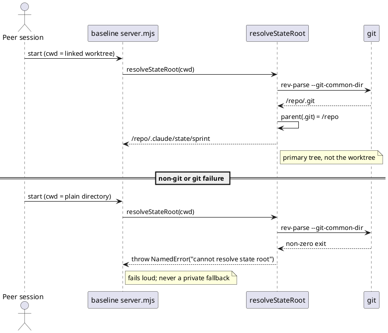
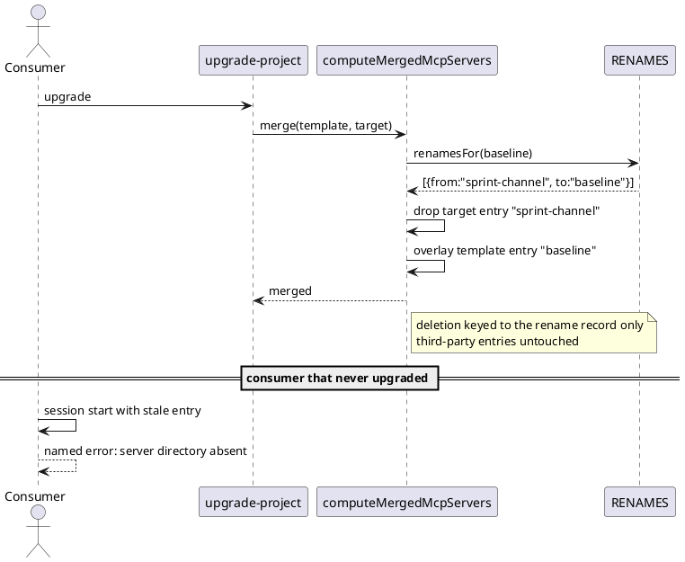
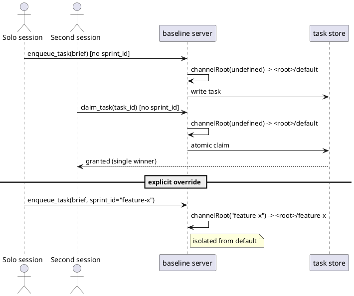
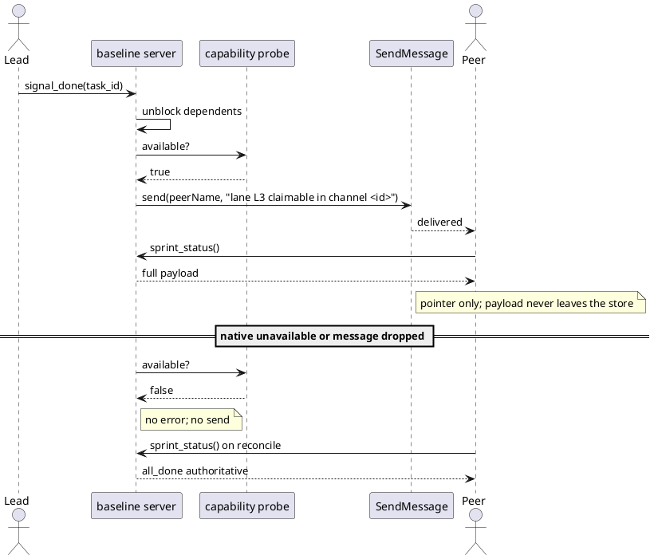
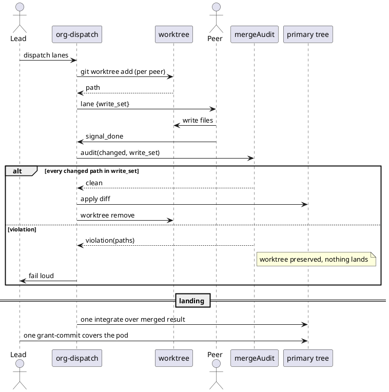
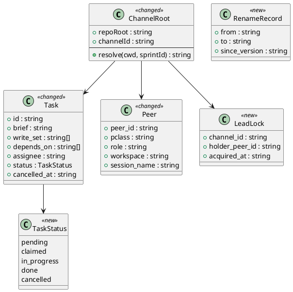
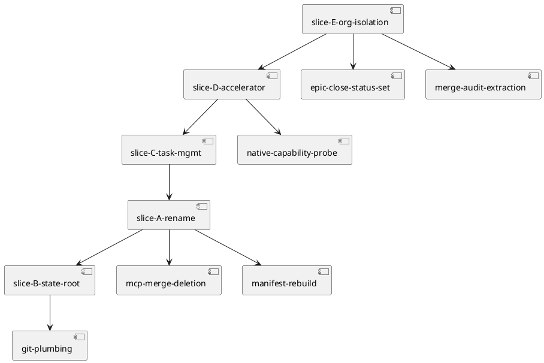

# baseline-mcp — one first-party MCP server for cross-session task state, and real worktree isolation for org mode

Epic spec. Five slices, one gate A. Supersedes Epic 11 slice D.

Upstream: `docs/intake/baseline-mcp.md`, `docs/scout/baseline-mcp.md`, `docs/research/baseline-mcp.md`.

## Context

`sprint-channel` is a file-locked coordination channel that already implements a dependency-aware, single-winner task store — `enqueueTask` takes `assignee` and `depends_on`, `claimTask` is race-safe, `sprintStatus` is the never-dropped reconcile. It is reachable only under `velocity.org_mode.enabled`, which is off, and it is named for a workflow rather than for what it does.

Three defects share one root. The store anchors on `CLAUDE_PROJECT_DIR || process.cwd()` (`server.mjs:15`, and identically at `sprint-pool/server.mjs:35`), so a peer in a linked worktree silently gets a private store. Org mode claims worktree isolation in three places and implements it in none. And Epic 11 slice D was written against `sprint-dispatch`, which is off disk.

The 2026-06-23 transport decision already hit this: *"separate clones never shared `tasks.json`"*. It moved the transport out of the tree and left the file store behind. This spec finishes that.

## Goal

One first-party MCP server named `baseline` holds cross-session task state usable on every track, and org-mode peers work isolated worktrees whose output is write-set-audited before it lands, integrated once, and committed under one consent gate.

## Non-goals

- Restoring Claude Code's native session task panel. MCP returns content to the model and cannot paint host UI. That is `CLAUDE_CODE_ENABLE_TODO_TOOLS=1` at session start, and orthogonal.
- Replacing the closed message schema with native free-text. Article X and annex §5.6 bind the closed type set.
- Making native cross-session messaging a hard dependency. The file store is the availability floor.
- Building capability beyond the five slices. Article VI.4.
- Amending Article II. This is the inter-session axis; the subagent count stays 1.
- Hand-editing `CHANGELOG.md`.
- Changing the broker socket rendezvous contract while the broker still exists.

## Decisions

Recorded per Article XI.12 — decided in main context, reviewed at gate A rather than asked. `owner: engineer` unless marked.

| # | Decision | Rationale | Owner |
|---|---|---|---|
| D1 | State root resolves from `git rev-parse --git-common-dir`, not `cwd` | A linked worktree returns the primary `.git`, so one repository yields one root. The idiom already exists at `org-mode.mjs:78` (`spawnSync` on `git -C … rev-parse`). Rejected: requiring peers to export `CLAUDE_PROJECT_DIR`, which contradicts `companion/SKILL.md`'s "no launcher and no special flags" and fails silently when forgotten. | engineer |
| D2 | Hard break on the rename, with a rename-keyed deletion taught to the `.mcp.json` merge | `src/cli/mcp.js:46-49` only ever adds, so an upgrade would leave a stale `sprint-channel` entry pointing at a removed directory. Deletion is keyed to an explicit rename record, never to template absence, so a consumer's own third-party servers survive. | **user** (confirmed 2026-08-19) |
| D3 | Default channel is per repository, with an explicit `sprint_id` still overriding on every tool | Composes with D1 — the repo root is being made worktree-stable, so "per repository" becomes well-defined for free. Keeps every current org-mode call site working unchanged. Rejected: per-session default, which reproduces the session-scoped semantics the intake says are inadequate. | engineer |
| D4 | Native messaging carries a pointer to the channel record, never a payload | Keeps the closed schema structurally intact rather than by instruction: judgment cannot travel a free-text path that never carries a payload. | engineer |
| D5 | `sprint_status` stays the authoritative completion check; native delivery is latency only | Delivery is delivered / held / refused, and a held message in a `bypassPermissions` session drops after `dialogExpiry`. Annex §5.6 pins `all_done` after a real regression. | engineer |
| D6 | Retiring the broker retires the socket-hijack surface rather than losing the guarantee; the underlying two-leads risk moves to a lead-lock in the channel store | With no socket there is nothing to hijack, so `tests/org-broker-hijack.test.mjs`'s property becomes vacuous rather than unenforced. The risk it guarded — two leads splitting one pod — is real without a socket, so it is re-established in the store where the pod's state actually lives. | engineer |
| D7 | `register_peer` gains an optional session name; the lead resolves it via `ListAgents` | D4 needs the lead to address peers by the name `ListAgents` reports, and `peer_id` is caller-chosen. Optional keeps the tool backward-compatible; absent name degrades to reconcile-only for that peer. | engineer |
| D8 | Slice E's criteria are exercised by flipping `velocity.org_mode.enabled` in a test fixture, never in `.claude/project.json` | Keeps the shipped default off (Article X.4) while letting E be verified. Slices A–D are exercisable with the flag off as it stands. | engineer |
| D9 | The stale ownership-boundary memory entry is corrected in this epic's Phase 10.7, not separately | `.claude/memory/decisions/sprint-pool-broker-transport-2026-06-23.md` records `sprint-pool`/`sprint-broker` as unshipped; all fourteen MCP files are in `obj/template/.claude/manifest.json`. Slice D depends on the corrected fact, so the correction rides the epic. | engineer |

## Design

The standing structure is already modelled. Referencing it rather than redrawing it:

@ref element:sprint-channel-server
@ref element:sprint-channel-handlers
@ref element:sprint-channel-lib
@ref element:sprint-broker
@ref element:sprint-pool
@ref element:org-dispatch-helpers

### Behavior #1 — state root resolution (slice B)

### Behavior #2 — rename migration (slice A)

### Behavior #3 — default channel (slice C)

### Behavior #4 — native pointer accelerator (slice D)

### Behavior #5 — worktree isolation, merge audit, single landing (slice E)

### Data shapes

State is JSON on disk, not SQL, so there is no DDL. The `<<new>>` and `<<changed>>` members above map to these on-disk changes, one per class:

- `tasks.json` — each entry gains `status` widened to the five-value set and an optional `cancelled_at`.
- `peers.json` — each entry gains an optional `session_name`.
- `lead.json` — new file per channel, holding the lead lock.
- `.claude/state/sprint/` — the directory now resolves under the primary tree.
- `src/cli/renames.js` — new module exporting the rename record list.

### Dependency graph

Acyclic. Slice B lands before A so the rename moves an already-correct file rather than a broken one.

## Program design

| Module | Layer | Responsibility | New or changed |
|---|---|---|---|
| `.claude/mcp/baseline/lib/root.mjs` | Foundation | Resolve the channel state root from the git common dir; throw named on failure | new |
| `.claude/mcp/baseline/lib/tasks.mjs` | Domain | Task status transitions, cancel, default-channel resolution | new |
| `.claude/mcp/baseline/lib/lead-lock.mjs` | Domain | Single-lead acquisition per channel, replacing the socket-hijack guarantee | new |
| `.claude/mcp/baseline/server.mjs` | Orchestration | Tool registry; injects resolved channel root; probes native capability once | changed (moved) |
| `.claude/mcp/baseline/handlers.mjs` | Domain | The thirteen handlers plus cancel/update | changed (moved) |
| `.claude/mcp/baseline/notify.mjs` | Foundation | Pointer-message composition and capability probe | new |
| `src/cli/renames.js` | Foundation | The rename record list the merge consults | new |
| `src/cli/mcp.js` | Domain | `computeMergedMcpServers` gains rename-keyed deletion | changed |
| `.claude/skills/org-dispatch/worktree.mjs` | Domain | Per-peer worktree creation and teardown | new |
| `.claude/skills/swarm-dispatch/swarm_merge.mjs` | Domain | Extract `auditChangedPaths` as an export; CLI becomes its wrapper | changed |
| `.claude/skills/commit/epic_close.mjs` | Domain | `CLOSED_STATUSES` set drives both `openChildren` and `committedSliceIds` | changed |

### Contracts

| Surface | Signature | Errors | Idempotent |
|---|---|---|---|
| `resolveStateRoot` | `(cwd: string) => string` | throws `StateRootError` when git absent, non-zero, or the resolved path escapes the repo | yes |
| `renamesFor` | `(pkg: string) => Array<{from,to,since_version}>` | none; empty array when no rename applies | yes |
| `computeMergedMcpServers` | `(templatePath, targetPath) => {merged, existing}` | throws on unparseable JSON | yes |
| `resolveChannelId` | `(sprintId?: string) => string` | none; `undefined` yields the literal `default` | yes |
| `cancelTask` | `({channelRoot, task_id}) => {cancelled: boolean}` | returns `{cancelled:false}` for an unknown or already-done task | yes |
| `acquireLead` | `({channelRoot, peer_id}) => {granted: boolean, holder: string}` | none; a second caller gets `granted:false` and the holder id | yes |
| `probeNativeMessaging` | `() => {available: boolean, reason?: string}` | never throws; unknown signal resolves `false` | yes |
| `composePointer` | `({channel_id, task_id}) => string` | throws if called with a payload field | yes |
| `auditChangedPaths` | `(changed: string[], writeSet: string[]) => {clean: boolean, violations: string[]}` | none | yes |
| `addPeerWorktree` | `({repoRoot, peer_id}) => {path: string}` | throws when git absent or the path exists | no |
| `CLOSED_STATUSES` | `Set<'committed'\|'superseded'>` | n/a | n/a |

### Libraries

| Library | Version | API used | Source |
|---|---|---|---|
| `@modelcontextprotocol/sdk` | 1.29.0 (pinned exact, devDependency) | `McpServer#registerTool(name, config, cb): RegisteredTool`; throws on duplicate name; `RegisteredTool#update/enable/disable/remove`; `server.sendToolListChanged()` | context7 `/modelcontextprotocol/typescript-sdk/v1.29.0`, verified 2026-08-19 |
| `zod` | bundled via esbuild | input schema shapes on `registerTool` | same |
| Claude Code cross-session messaging | requires v2.1.224+ | `ListAgents` discovery, `SendMessage` delivery; delivered/held/refused; `crossSessionInbound`, `dialogExpiry`; macOS and Linux only | https://code.claude.com/docs/en/cross-session-messaging, fetched 2026-08-19 |
| `git` | system | `rev-parse --git-common-dir`, `worktree add`, `worktree remove`, `diff --name-only`, `apply` | plumbing already used at `org-mode.mjs:78` and `swarm_merge.mjs` |

## Design calls

The rename touches three docs-site surfaces inside `project.json → tdd.ui_globs`. These are content changes on existing pages, not new layouts, so each row's reference target is the page as it renders today.

| Slug | Intent | Target files | Write set | Register | Reference target | Quality criteria |
|---|---|---|---|---|---|---|
| mcp-page-rename | rename the server on the MCP page without disturbing the page's existing structure | `site-src/mcp.njk` | `site-src/mcp.njk`, `site-src/_data/mcpnotes.json` | inherit | the page as rendered at HEAD, captured to `docs/design/mcp-page-before.png` | server-name string updated in every occurrence; heading hierarchy byte-identical to the reference; text contrast ≥ WCAG AA; no layout shift versus reference at 360/768/1280; server count word unchanged at "four" |
| org-setup-rename | update the org setup walkthrough for the renamed server and the retired pool | `site-src/org/setup.njk` | `site-src/org/setup.njk` | inherit | the page as rendered at HEAD, captured to `docs/design/org-setup-before.png` | every `sprint-channel` occurrence replaced; the `sprint-pool` setup step removed with no orphaned heading or dangling list marker; contrast ≥ WCAG AA; no layout shift versus reference at 360/768/1280 |

## System delta

| Verb | Element | Anchor | Concept | Kind |
|---|---|---|---|---|
| change | sprint-channel-server | `.claude/mcp/baseline/server.mjs` | parallel-execution | c4_component |
| change | sprint-channel-handlers | `.claude/mcp/baseline/handlers.mjs` | parallel-execution | c4_component |
| change | sprint-channel-lib | `.claude/mcp/baseline/lib/` | parallel-execution | c4_component |
| remove | sprint-broker | `.claude/mcp/sprint-broker/` | parallel-execution | c4_component |
| remove | sprint-pool | `.claude/mcp/sprint-pool/` | parallel-execution | c4_component |
| change | org-dispatch-helpers | `.claude/skills/org-dispatch/` | parallel-execution | c4_component |
| change | swarm-dispatch-helpers | `.claude/skills/swarm-dispatch/swarm_merge.mjs` | parallel-execution | c4_component |
| change | commit-helpers | `.claude/skills/commit/epic_close.mjs` | planning-release | c4_component |
| change | audit-baseline-checks | `.claude/skills/audit-baseline/checks/mcp-servers.mjs` | build-distribution | c4_component |

## Acceptance criteria

| AC | Criterion | Kind | Slice | Traces to | Behavior |
|---|---|---|---|---|---|
| AC-001 | given a linked worktree, when the server resolves its state root, then it returns the primary tree's `.claude/state/sprint` | behavior | B | intake AC-1 | §Behavior #1 |
| AC-002 | given a resolved root that escapes the repository or a non-zero `git rev-parse`, when resolution runs, then it throws a named error and no private store is created | error-mapping | B | intake AC-1 | §Behavior #1 |
| AC-003 | given an ordinary non-worktree checkout, when resolution runs, then the path equals today's path | preflight | B | intake AC-2 | §Behavior #1 |
| AC-004 | given `sprint-pool`'s root derivation, when slice B lands, then it resolves through the same helper as the server | behavior | B | intake AC-1 | §Behavior #1 |
| AC-005 | given a consumer `.mcp.json` carrying `sprint-channel`, when `upgrade-project` merges, then the old entry is removed and `baseline` is present | behavior | A | intake AC-4 | §Behavior #2 |
| AC-006 | given a consumer `.mcp.json` carrying an unrelated third-party server, when the merge runs, then that entry survives untouched | behavior | A | intake AC-4 | §Behavior #2 |
| AC-007 | given a byte-identical merge result, when `threeWayMerge` classifies it, then it is still NOOP and the file is not rewritten | behavior | A | intake AC-4 | §Behavior #2 |
| AC-008 | given the renamed tree, when `audit-baseline` runs, then it passes with `baseline` in `EXPECTED_MCP_SERVERS` and no non-archive file naming `sprint-channel` except the rename record | preflight | A | intake AC-3 | §Behavior #2 |
| AC-009 | given the amendment, when it lands, then `seed.md` changed before `CLAUDE.md`, and each `src/*.template.md` mirror is byte-equal to its shipped counterpart | preflight | A | intake AC-3 | §Behavior #2 |
| AC-010 | given a session passing no `sprint_id`, when it enqueues, lists, claims, updates or cancels, then the operation succeeds against the per-repository default channel | behavior | C | intake AC-5 | §Behavior #3 |
| AC-011 | given an explicit `sprint_id`, when any tool is called, then it resolves that channel and stays isolated from the default | behavior | C | intake AC-5 | §Behavior #3 |
| AC-012 | given a claimed task, when its status is read, then `claimed`, `in_progress` and `done` are distinguishable | behavior | C | intake AC-6 | §Behavior #3 |
| AC-013 | given a cancelled task, when a peer attempts to claim it or a dependent checks its blockers, then it is unclaimable, non-blocking, and distinguishable from done | behavior | C | intake AC-6 | §Behavior #3 |
| AC-014 | given org-mode task state written before the widening, when it is read after, then it parses unchanged and `claim_task` still yields exactly one winner under concurrent claims | behavior | C | intake AC-7 | §Behavior #3 |
| AC-015 | given native messaging available and a task becoming claimable, when the transition commits, then the target session receives a `SendMessage` naming the channel and task id | behavior | D | intake AC-8 | §Behavior #4 |
| AC-016 | given any pointer message, when it is composed, then it contains no task payload, and `composePointer` throws if handed one | error-mapping | D | intake AC-8 | §Behavior #4 |
| AC-017 | given an unsupported platform, provider, or a flag disabling feature-flag evaluation, when the probe runs, then it resolves unavailable and the transition completes with no error | preflight | D | intake AC-9 | §Behavior #4 |
| AC-018 | given every native message dropped, when the pod runs, then it still completes via `sprint_status.all_done` | behavior | D | intake AC-10 | §Behavior #4 |
| AC-019 | given the pool and broker retire, when the tree is inspected, then `sprint-pool` and `sprint-broker` are absent from disk, the manifest, and the bundler list, and the `seed.md` research-preview paragraph is gone | preflight | D | intake AC-9 | §Behavior #4 |
| AC-020 | given a second session attempting to lead an occupied channel, when it calls `acquireLead`, then it is refused with the current holder's id | behavior | D | intake AC-9 | §Behavior #4 |
| AC-021 | given org mode dispatching lanes, when peers start, then each works its own git worktree, and the gate refuses with a named reason when isolation cannot be established | behavior | E | intake AC-11 | §Behavior #5 |
| AC-022 | given a peer changing a file outside its lane's `write_set`, when the merge audit runs, then it reports the violation, preserves the worktree, and lands nothing | behavior | E | intake AC-12 | §Behavior #5 |
| AC-023 | given a clean audit, when the merge applies, then the diff lands on the primary tree and the worktree is removed | behavior | E | intake AC-12 | §Behavior #5 |
| AC-024 | given the org track DAG, when it is inspected, then it carries exactly one `integrate` node and one `grant-commit` node after `org-dispatch` | preflight | E | intake AC-13 | §Behavior #5 |
| AC-025 | given an epic with one child `superseded` and the rest `committed`, when `epic_close.mjs` runs, then the epic closes; given any genuinely open child, then it does not | preflight | E | intake AC-14 | §Behavior #5 |
| AC-026 | given this epic lands, when `/standup` runs, then Epic 11 row D reads superseded by `baseline-mcp` with its reason, and Epic 11 has no open rows | smoke | E | intake AC-15 | §Behavior #5 |
| AC-027 | given any slice of this epic has landed, when `.claude/project.json` is read, then `velocity.org_mode.enabled` is `false`, and every fixture that flips it restores it on teardown | preflight | E | intake constraint (D8) | §Behavior #5 |

## Slice A — Rename sprint-channel to baseline

**Behavior**: the server directory, its `.mcp.json` entry, its manifest paths and every governance reference move from `sprint-channel` to `baseline`, amended in Article I.4 order. `src/cli/renames.js` records the rename, and `computeMergedMcpServers` consults it to drop the old entry on upgrade rather than leaving it stranded. The count is 4→4, so `derive-counts.mjs`'s SPELLED map and the site's count literals are untouched.

**ACs**: AC-005, AC-006, AC-007, AC-008, AC-009.

**Write surface**: `.claude/mcp/baseline/**`, `.mcp.json`, `src/.mcp.template.json`, `src/cli/renames.js`, `src/cli/mcp.js`, `docs/init/seed.md`, `src/seed.template.md`, `CLAUDE.md`, `src/CLAUDE.template.md`, `.claude/CONSTITUTION.md`, `.claude/skills/audit-baseline/expected-baseline.mjs`, `docs/system/elements/*.md`, `docs/system/diagrams/*.puml`, `site-src/mcp.njk`, `site-src/org/setup.njk`, `site-src/_data/mcpnotes.json`, `scripts/bundle-mcp-servers.mjs`, `README.md`, `PRODUCT.md`.

## Slice B — Channel state root is worktree-safe

**Behavior**: `lib/root.mjs` resolves the state root from `git rev-parse --git-common-dir`, so a linked worktree anchors on the primary tree. Failure — git absent, non-zero exit, or a resolved path outside the repository — throws a named error rather than falling back. The server and `sprint-pool` both consume it, so the defect is not half-repaired. The broker socket contract is untouched; `sock-path.mjs` already resolves outside any clone.

**ACs**: AC-001, AC-002, AC-003, AC-004.

**Write surface**: `.claude/mcp/baseline/lib/root.mjs`, `.claude/mcp/baseline/server.mjs`, `.claude/mcp/sprint-pool/server.mjs`, `tests/**`.

**Ordering note**: Slice A lands first and renames `.claude/mcp/sprint-channel/` to `.claude/mcp/baseline/`, so this slice's write surface names the post-rename paths. `.claude/mcp/sprint-pool/server.mjs` is still correct here — sprint-pool does not retire until Slice D.

## Slice C — General task management on the baseline server

**Behavior**: `resolveChannelId` maps an absent `sprint_id` to the literal `default` under the resolved repository root, so task tools work with org mode off. `TaskStatus` widens to `pending | claimed | in_progress | done | cancelled`; a cancelled task is unclaimable and does not block dependents. Existing state parses unchanged, and `claim_task` keeps its single-winner guarantee.

**ACs**: AC-010, AC-011, AC-012, AC-013, AC-014.

**Write surface**: `.claude/mcp/baseline/lib/tasks.mjs`, `.claude/mcp/baseline/handlers.mjs`, `.claude/mcp/baseline/server.mjs`, `tests/**`.

## Slice D — Native cross-session messaging as a push accelerator

**Behavior**: on a state transition that makes a lane claimable or reports it done, the server composes a pointer naming the channel and task id and sends it via `SendMessage` to the peer's session name. `composePointer` throws if handed a payload, so the closed schema cannot be bypassed. `probeNativeMessaging` resolves once at startup and any unknown signal resolves unavailable, degrading to reconcile-only. `sprint-pool` and `sprint-broker` retire from disk, manifest and bundler, and `acquireLead` re-establishes single-lead-per-channel in the store.

**ACs**: AC-015, AC-016, AC-017, AC-018, AC-019, AC-020.

**Write surface**: `.claude/mcp/baseline/notify.mjs`, `.claude/mcp/baseline/lib/lead-lock.mjs`, `.claude/mcp/baseline/handlers.mjs`, `.claude/mcp/sprint-pool/**`, `.claude/mcp/sprint-broker/**`, `scripts/bundle-mcp-servers.mjs`, `obj/template/.claude/manifest.json`, `docs/init/seed.md`, `src/seed.template.md`, `.claude/CONSTITUTION.md`, `tests/**`.

## Slice E — Org worktree isolation, merge audit, and the single landing

**Behavior**: `org-dispatch` creates one git worktree per peer and refuses with a named reason when it cannot. On `signal_done` the lead audits the worktree diff against the lane's `write_set` via `auditChangedPaths`, extracted as an export from `swarm_merge.mjs`; a violation preserves the worktree and lands nothing. A clean audit applies the diff to the primary tree. Exactly one integrate runs over the merged result under one `grant-commit`. `epic_close.mjs` drives open and closed from `CLOSED_STATUSES`, letting Epic 11 row D be recorded `superseded` honestly.

**ACs**: AC-021, AC-022, AC-023, AC-024, AC-025, AC-026, AC-027.

**Write surface**: `.claude/skills/org-dispatch/worktree.mjs`, `.claude/skills/org-dispatch/org-mode.mjs`, `.claude/skills/org-dispatch/SKILL.md`, `.claude/skills/companion/SKILL.md`, `.claude/skills/swarm-dispatch/swarm_merge.mjs`, `.claude/skills/commit/epic_close.mjs`, `.claude/workflows.jsonl`, `.claude/state/epic/mvp-sprint-parallel-cycles.json`, `docs/roadmap-execution-plan.md`, `tests/**`.

## Test plan

| AC | Test kind | Fixture | Real dependency |
|---|---|---|---|
| AC-001..004 | integration | two linked worktrees of a temp repo | real `git` |
| AC-005..007 | unit + integration | temp `.mcp.json` with old, new and third-party entries | real filesystem |
| AC-008, AC-009 | preflight | the working tree | `audit-baseline` |
| AC-010..014 | integration | temp repo, concurrent claim from two processes | real file locks |
| AC-015..018, AC-020 | integration | stub `SendMessage` boundary; delivery suppressed wholesale for AC-018 | real store |
| AC-019 | preflight | the working tree, manifest and bundler list | — |
| AC-021..023 | integration | temp repo, peer worktree writing outside its `write_set` | real `git worktree` |
| AC-024 | unit | `.claude/workflows.jsonl` org track | — |
| AC-025 | unit | epic state fixtures | — |
| AC-026 | smoke | `/standup` against the landed tree | — |

Mocks: only the `SendMessage` host boundary, which is a third-party API that cannot run locally. Every mock carries `# MOCK: <reason>`. No internal module, no filesystem and no `git` is mocked.

## Observability

- `resolveStateRoot` failures surface as a named startup error on stderr with the attempted cwd and the git exit status.
- `probeNativeMessaging` logs its verdict and reason once at startup, so "no pings arrived" is distinguishable from "native is off here".
- Merge-audit violations print each offending path plus the lane's declared `write_set`, and name the preserved worktree path.
- `acquireLead` refusals name the current holder.

## Rollout

### Prerequisites

| # | Prerequisite | enforced-by |
|---|---|---|
| 1 | State root resolves identically on a non-worktree checkout before anything is renamed | AC-003 |
| 2 | `audit-baseline` green on the renamed tree before slice C builds on it | AC-008 |
| 3 | The amendment order is verified before the rename is committed | AC-009 |
| 4 | Native messaging degrades cleanly before the broker is deleted | AC-017 |
| 5 | Pool and broker fully absent before slice E depends on the accelerator | AC-019 |
| 6 | Epic-close status set repaired before row D is recorded | AC-025 |
| 7 | `velocity.org_mode.enabled` remains `false` in `.claude/project.json` on every landed slice; slice E flips it only inside test fixtures | AC-027 |

Slice order is B, A, C, D, E — the dependency graph above is the authority, and every ordering constraint that gates a landing is a row in the table, not prose.

## Rollback

- Slices B, C: revert the commit. Both are additive to a server that ships today, and state written under the new root is readable at the old path because the resolved path is identical on a non-worktree checkout (AC-003).
- Slice A: revert plus a reverse rename record, since a consumer that already upgraded has `baseline` in `.mcp.json`. This is the least reversible slice and the reason it lands early rather than last.
- Slice D: revert restores `sprint-pool` and `sprint-broker` from git history; the manifest rebuilds from the restored tree. The accelerator is additive, so reverting it costs latency, not correctness.
- Slice E: revert the commit. Worktrees are created and removed per dispatch, so no durable artifact survives a revert. Epic 11 reopens because `epic_close.mjs` reverts with it.

## Archive plan

Default bundle — every `baseline-mcp.*` file across `docs/intake/`, `docs/scout/`, `docs/research/`, `docs/specs/`. The epic's discovery bundle archives when `epic_close.mjs` fires on the last slice, per `commit/SKILL.md` Step 2.8.

Extras:

- `docs/design/mcp-page-before.png`, `docs/design/org-setup-before.png` — the design-call reference captures, kept with the bundle so a later reviewer can see what the rename was scored against.

## Open questions

- Does the `baseline` server keep the thirteen existing tool names unchanged, or do the coordination tools gain a prefix now that the server is general? Keeping them is backward-compatible and is what this spec assumes; renaming them would be a second breaking change riding slice A, and `registerTool` throws on a duplicate name so the two sets cannot coexist inside one server.
- Should `crossSessionInbound: accept` ship in `src/project.template.json`? Slice D needs it for org mode under `bypassPermissions`, but shipping it changes inbound message behaviour for every consumer taking the new template, including those who never use org mode. This spec documents the requirement rather than shipping the setting; flipping that is a one-line change to slice D's write surface.
