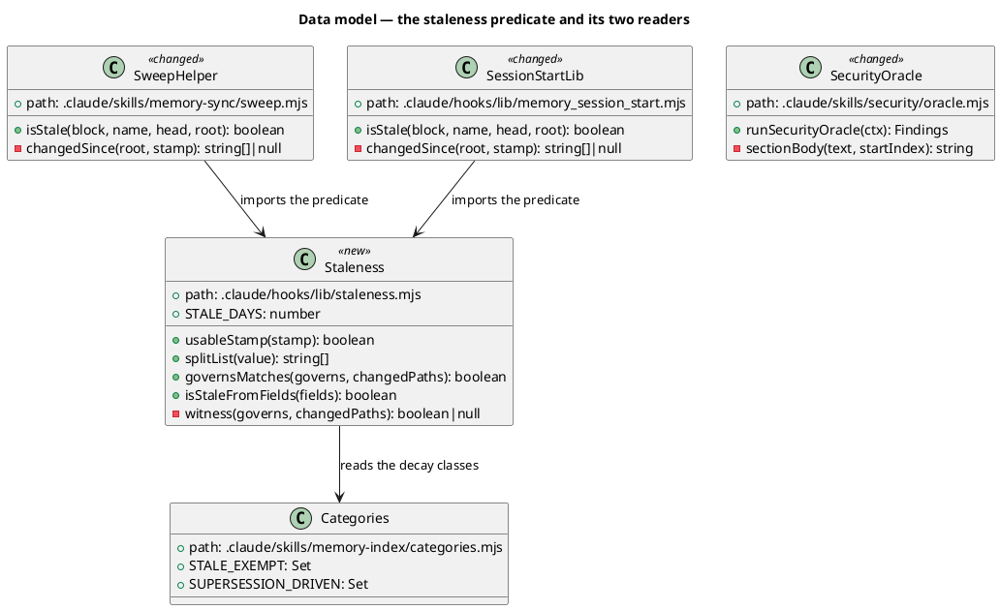
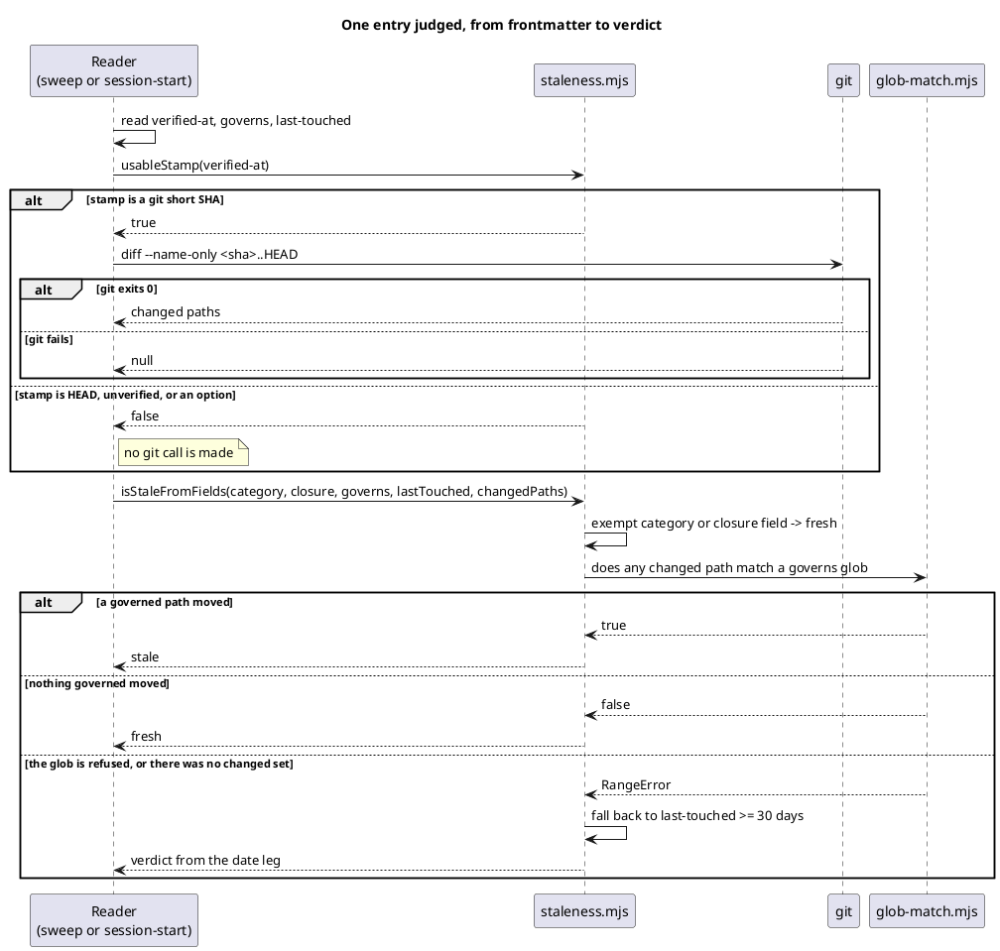
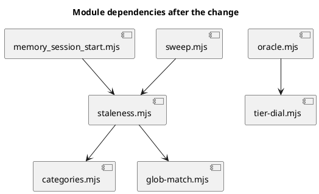

# Spec — staleness-witness

> **Written after the fact.** This spec was authored once the work had landed, to declare the
> `## System delta` the `tdd-quickfix` track has no node to carry. Every claim below describes code
> that exists and is checkable against the diff, rather than work that is planned. The gap it closes
> is recorded in `## Open questions`.

## Goal

A memory entry goes stale when the code it describes moves, not when the clock runs.

The predicate previously expired an entry after 30 commits or 30 days, whichever came first. On this
repository those are not two ways of saying "about a month": measured 2026-08-23, 132 commits landed
in 30 days, so the commit leg expired an entry after **four days**. 259 of 291 non-exempt entries read
stale while only 33 were genuinely a month old. The queue was uncleatable by construction, and nobody
ever cleared it.

Replacing the commit leg with a witness over each entry's `governs:` paths leaves 63 stale, every one
of them backed by a path that actually changed.

## Design

Diagrams are the contract. Prose only for what a diagram cannot say.

### Structural kinds — referenced, not redrawn

The standing shape of the memory surface is already modelled in the corpus. One resolvable reference
satisfies C4 Context, Container, and Component:

```
@ref element:memory-hook-libs
```

### Data model — class diagram

`<<new>>` marks a module this change creates; `<<changed>>` marks one whose exported surface moves.



### Behaviour — sequence



### Dependency graph



## Program design

**Data access.** The predicate reads nothing. Each caller parses its own entry frontmatter and makes
its own `git diff --name-only <sha>..HEAD` call, then passes the results in. This is the
`hooks/lib/design-calls.mjs` shape the shared-rule convention prescribes: split at the IO boundary,
not the logic, so the rule stays pure and testable without git.

**Call stack.** `isStale(block, name, head, root)` in either reader → field extraction and the git
call in that reader → `isStaleFromFields(...)` → `witness(...)` → `matchesAnyGlob`. The exempt-class
and closure short-circuits run before any glob work.

**Layout.** `.claude/hooks/lib/staleness.mjs` is Foundation: stdlib plus two sibling imports, no IO.
Both readers are Domain and keep their own IO. The threshold was previously declared in both readers;
after this change it exists once.

## Design calls

*(none)*

## System delta

| Verb | Element | Anchor | Concept | Kind |
|---|---|---|---|---|
| add | staleness-predicate | `.claude/hooks/lib/staleness.mjs` | memory-model | c4_component |

`memory-hook-libs` anchors `.claude/hooks/lib/memory_*.mjs`, which the new filename does not match, so
the module needs an element of its own rather than an extension of that glob.

## Acceptance criteria

| # | Criterion | Kind | Sequence |
|---|---|---|---|
| AC-001 | An entry whose `governs:` path changed since its `verified-at` reads stale. | behavior | "a governed path moved" |
| AC-002 | An entry whose governed paths did not change reads fresh, however many commits passed. | behavior | "nothing governed moved" |
| AC-003 | An entry with no `governs:` falls back to `last-touched >= 30` days. | behavior | "fall back to the date leg" |
| AC-004 | An unresolvable changed set falls back to the date leg rather than reading as fresh. | behavior | "git fails" |
| AC-005 | `backlog` and `decisions` stay exempt under both legs. | behavior | "exempt category -> fresh" |
| AC-006 | A `verified-at` that is not a git short SHA never reaches a git argv. | preflight | "no git call is made" |
| AC-007 | A glob `glob-match` refuses falls back to the date leg instead of throwing. | error-mapping | "the glob is refused" |
| AC-008 | Exactly one module in the tree declares the staleness threshold. | preflight | n/a — tree scan |
| AC-009 | A security finding marked `- **Resolved**:` in its own section emits no BLOCKER; an unmarked one still does. | behavior | n/a — oracle unit |
| AC-010 | The legacy `### [HIGH — RESOLVED]` spelling stays suppressed, so archived reports read unchanged. | behavior | n/a — oracle unit |

## Test plan

`tests/memory-staleness-witness.test.mjs` covers AC-001 through AC-008: the witness leg, the date
fallback, both exempt classes, the closure short-circuit, stamp validation against a live
`--output=` payload, glob refusal, and a tree scan asserting a single threshold declaration.

`tests/eof-review-oracles.test.mjs` covers AC-009 and AC-010, including the section-scoping case where
one resolved finding must not silence an open sibling.

`tests/sweep-staleness-parity.test.mjs` continues to pin the two readers equal over the live corpus.
With one predicate behind both, the parity holds by construction rather than by coincidence.

## Rollout

### Prerequisites

| Prerequisite | enforced-by |
|---|---|
| The stamp validator rejects every non-SHA before any git call. | AC-006 |
| The refused-glob path cannot throw out of the predicate. | AC-007 |

## Rollback

Revert the three module changes together. The predicate has no state and no migration: the entries
themselves are untouched, so reverting restores the previous verdicts on the next read. The security
oracle change is independent and can be reverted on its own, at the cost of re-blocking any workflow
that resolves its own finding.

## Open questions

- **The two lean tracks cannot declare a delta at all.** `tdd-quickfix` and `chore` have no `spec`
  node, so a workflow on either that adds a governed file has no sanctioned way to anchor it. This
  spec exists only because it was written by hand after the work landed. Five other governed files
  are unanchored for the same reason, and the delta step cannot reach them because it only writes
  rows the landing diff confirms. Closing this is the next cycle.

  This is already recorded as `backlog/spec-less-tracks-leave-new-modules-unwitnessed-c5d1`, raised
  2026-08-21 off the `unsanitised-path-pair` run, which measured the same failure on two new modules
  and names three candidate fixes. That entry is the ticket; this bullet is its second witness.

- **The delta fold degrades the shard it writes for a new element.** Recorded as
  `backlog/delta-fold-writes-a-degraded-shard-for-every-new-element-7f3a`. It surfaced on this
  workflow: the fold wrote `docs/system/diagrams/staleness-predicate.puml` in the three-argument
  form that `tests/corpus-shard-preservation.test.mjs` AC-007 forbids, and the shard in this diff is
  hand-corrected. Both entries live on the delta path and should be fixed together.
