# Spec — consumer-defects-2026-08-24

Slug: `consumer-defects-2026-08-24`
Track: `power` (seven tickets, one cycle, commit-split at landing)
Status: Draft

## Context

A consumer install reported nine defects on 2026-08-24. Triage verified each against this tree rather than accepting the report.

- **#3 is already fixed** by `05d8fec` (unreleased); the shipped `obj/template/` copy carries it. Out of scope.
- **#8 is not this repository.** `roadmap-issues` exists neither on disk nor in git history. Out of scope — and worth returning to the reporter, because #5's observed damage (seven GitHub issues opened under a wrong epic identity) was done *by* that skill.
- **Seven are live in both the dev tree and the shipped payload.** Releasing changes nothing for them.

Two were reproduced during triage rather than read: `\b(shutdown|halt|poweroff|reboot)\b` hard-blocked a `grep` and a `node -e` whose only offence was containing the word, and `assert-writable` emitted byte-identical text for a valid entry and an unreachable one.

The reporter's theme holds. Several of these are mechanisms that exist to catch a problem and either misreport the cause or never run. A guard that blames the wrong thing is worse than an absent guard, because its stated remedy sends the operator to edit something already correct.

## Goal

Repair the seven live defects so a consumer install stops being blocked by its own guards, stops being misdirected by its own diagnostics, and gains the two checks specified in prose but never implemented.

## Non-goals

- Re-fixing #3, or anything about `roadmap-issues` (#8).
- Widening `destructive_cmd_guard`'s coverage. This makes matching precise; it adds no destructive verbs.
- Subagent guards beyond `.claude/state/**`. The Article II exposure is specifically that a subagent can widen what `track_guard` authorizes next.
- Raising `MAX_CLAUDE_MD_CHARS`. The engineer declined that once; this spec compresses instead.

## Design

### C4 — System context, Container, Component

@ref element:destructive-cmd-guard
@ref element:harness-continuation
@ref element:memory-index-resolve
@ref element:roadmap-sync-helper

The standing model holds every container this spec touches. One element is new (`state-write-guard`) and is declared in **System delta**.

### Data model — class diagram

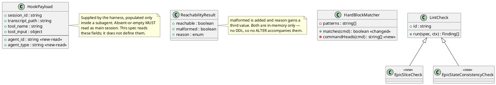

DDL: none. This project persists no relational data; the members above map to acceptance criteria, not migrations.

### Behavior — sequence per AC

#### AC-001 — an innocent command mentioning a destructive verb is allowed

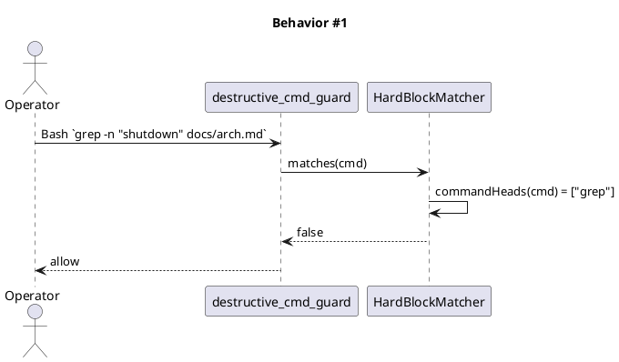

#### AC-002 — a destructive command is still hard-blocked at every command head

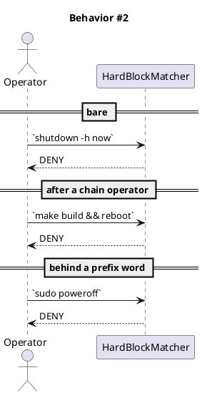

#### AC-003 — the mkfs pattern behaves identically

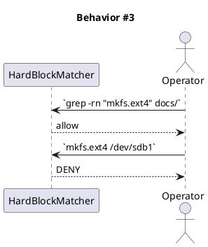

#### AC-004 — the pattern list stays identical across both maintained copies

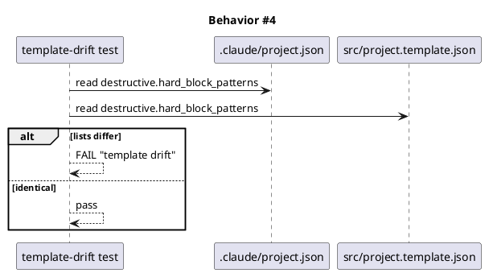

#### AC-005 — assert-writable names malformed input as malformed

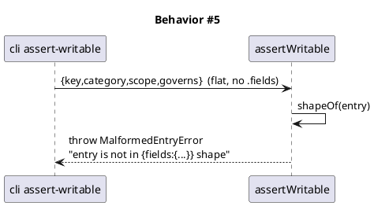

#### AC-006 — a genuinely unreachable entry still reports unreachable

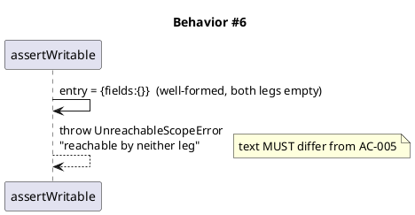

#### AC-007 — a subagent is denied a write to .claude/state/**

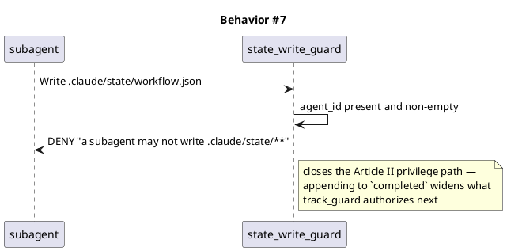

#### AC-008 — the main session is unaffected; an absent marker reads as main session

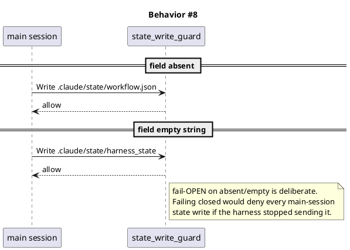

#### AC-009 — swarm-worker keeps the writes Article II sanctions

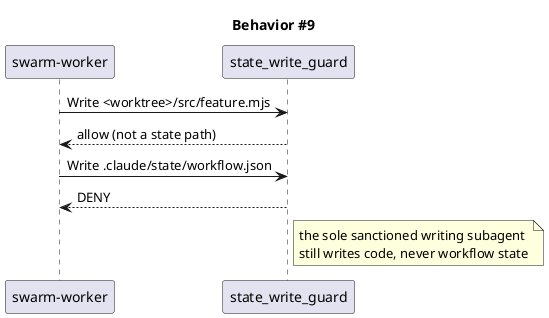

#### AC-010 — roadmap-sync binds a workflow to an existing epic by number

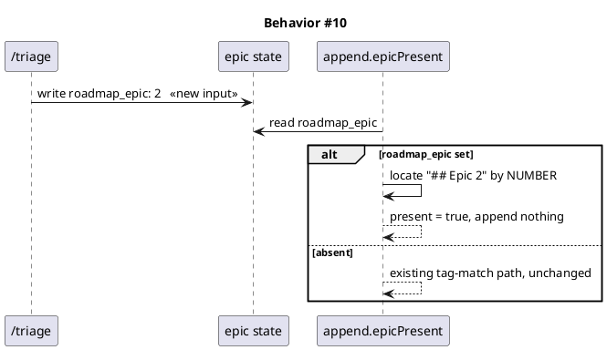

#### AC-011 — a category-tagged epic is no longer duplicated

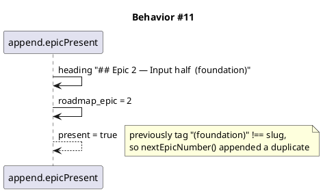

#### AC-012 — spec-lint fails an AC assigned to zero or many slices

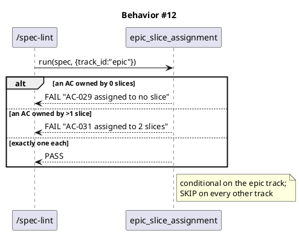

#### AC-013 — spec-lint catches a spec disagreeing with its epic state

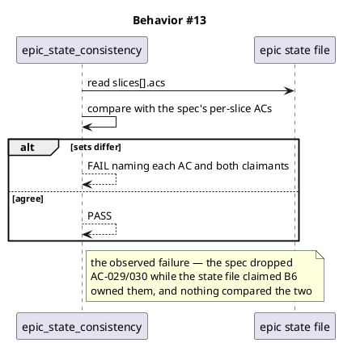

#### AC-014 — a parked harness emits no continuation prompt

Superseded the background-work registry after review. A detector has to be right about a condition it cannot observe, and every version fails in the wrong direction: a registry left behind by a crashed wave silences the Stop hook permanently with no signal. `parked` is a fourth value of the existing state machine — declared by the caller that owns the session, cleared by the same caller, and recovered by typing `/harness`.

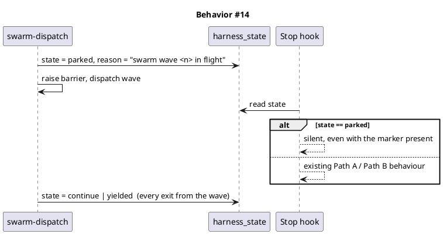

#### AC-021 — a reference token in prose is not read as a reference

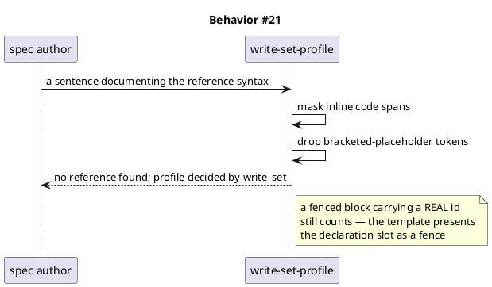

#### AC-022 — the verify gate stops measuring machine load

Found at verify in this cycle, not in the consumer report. `check-files-diff.mjs` runs `npm pack --dry-run` over the whole package — 2s standalone, measured three times — under a 30s cap. Under full-suite load it was killed, `spawnSync` reports a kill as `status: null`, and the binding verdict read FAIL. It failed, passed, then failed across three runs the same day.

Scoped to that one spawn. Fourteen other caps in the file sit below the same floor; raising them on the strength of a measurement of a different script would be guessing, and a short cap is correct for a test asserting a fast failure path.

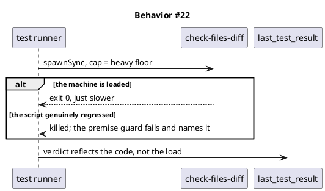

#### AC-023 / AC-024 / AC-025 — one answer to "what does this command run"

AC-023 and AC-024 were found by `/security` on this branch, against changes this branch made. AC-025 was found by the fixed guard refusing the very edit that documents it.

**AC-023 (HIGH).** Anchoring the verb patterns fixed the false positives and opened five bypasses: `effectiveCommands` was built on segment splitting, which reads an executor-wrapped command as one command whose head is the executor. Measured against `HEAD`, five wrapper forms that were hard-blocked started passing. The AC-002 safety test stayed green because it covered the prefix forms and no wrapper form.

**AC-024 (MEDIUM).** `state_write_guard` was wired on the editing tools only, so a shell redirect still reached `completed` — the privilege path T1 set out to close.

**AC-025.** Recursing into executors also made backticks inside a **quoted-delimiter heredoc** read as command substitution. Such a body is data: the shell performs no expansion and no substitution in it. Markdown prose uses backticks constantly, so this is the T4 false-positive class arriving through the new door, and it blocked a real edit before it was written down.

Every fix reuses machinery that already exists rather than adding a parser. `executedFragments` already peels executors and distinguishes executed text from quoted data; `writesPathFamily` already carries variable expansion and target anchoring for the consent family.

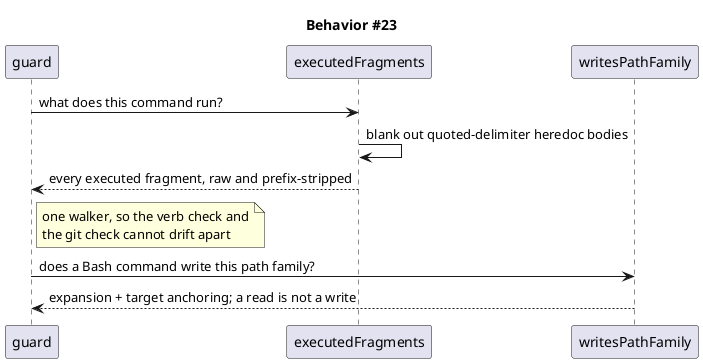

#### Module split — found by the code-review fan-out at integrate

Not a new acceptance criterion; a structural consequence of the changes above, recorded so the delta and the contracts match what shipped.

The fan-out blocked twice on the module budget. `write-set-profile.mjs` had crossed it carrying two concerns, so the `@ref` grammar moved to **`corpus-reference.mjs`**. The convention that had placed the parse in the resolver forbids DUPLICATING the rule, not housing it — there is still exactly one `REF_WELL_FORMED`, and both callers now import it from the module that owns it.

That split pushed `spec_diagram_presence_guard.mjs` three lines over, and looking for a real extraction rather than shaving three lines turned up genuine duplication: the guard and `/spec-lint` each carried their own plantuml fence regex AND their own marker/`any_of` matcher — the same rule implemented twice, in exactly the guard-and-its-preflight shape that convention exists to prevent. **`plantuml-blocks.mjs`** now owns both.

#### AC-015 — the commit SOP states the move is a plain mv

#### AC-015 — the commit SOP states the move is a plain mv

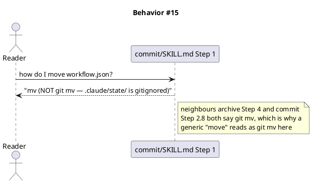

#### AC-016 — CLAUDE.md stays under its advisory cap with Article VI untouched

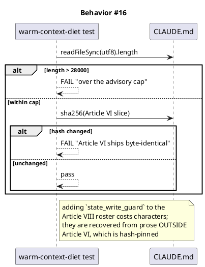

#### AC-017 — the hook count agrees across every surface that states it

```plantuml
@startuml
title Behavior #17
participant "audit-baseline" as A
participant "CLAUDE.md" as C
participant "src/CLAUDE.template.md" as M
participant "docs/init/seed.md" as S
participant "docs site" as D
A -> C : hook count
A -> M : hook count (byte-equal mirror)
A -> S : §4.1 roster
A -> D : hooks/index.html listing
A -> A : all equal 27 and each names state_write_guard
alt any disagrees
  A --> A : FAIL governance-count-drift
end
@enduml
```

### Dependencies — graph

```plantuml
@startuml
' @kind dependency-graph
title Dependencies — consumer-defects-2026-08-24
left to right direction
[destructive_cmd_guard] --> [hard_block_patterns]
[src_project_template] --> [hard_block_patterns]
[state_write_guard] --> [hook_payload_agent_id]
[state_write_guard] --> [settings_json_wiring]
[claude_md_article_viii] --> [state_write_guard]
[seed_md_4_1] --> [state_write_guard]
[audit_baseline] --> [claude_md_article_viii]
[audit_baseline] --> [seed_md_4_1]
[roadmap_sync_append] --> [epic_store_roadmap_epic]
[spec_lint] --> [epic_state_file]
[harness_continuation] --> [background_registry]
[commit_skill_md] --> [archive_bundle_path]
@enduml
```

No cycles.

### Contracts

Canonical header per `spec/template.md` — `drift_check` reads the **Name** column, so a `Surface | Shape` header hides every identifier from it. Reconciled against what shipped: two rows named functions that were never written.

| Kind | Name | Input | Output | Errors | Idempotent |
|---|---|---|---|---|---|
| function | `cmdMatchesAny(cmd, patterns)` | command string, regex-string array | boolean | never throws; an uncompilable pattern is skipped, as today | yes |
| function | `effectiveCommands(cmd)` | command string | every executed fragment, raw and prefix-stripped | never throws; `[]` on unparseable input, and `[]` denies nothing | yes |
| function | `writesWorkflowStatePath(cmd)` | Bash command string | boolean | never throws; a read is not a write | yes |
| function | `referenceTokens(content)` | spec text | reference tokens | never throws; masks inline code, drops bracketed placeholders | yes |
| function | `malformedReferences(content)` | spec text | offending tokens | never throws | yes |
| function | `elementReferences(content)` | spec text | well-formed element ids | never throws | yes |
| function | `plantumlBlocks(content)` | spec text | fence bodies, document order | never throws | yes |
| function | `missingKinds(blocks, required)` | fence bodies, required-kind config | uncovered kinds with counts | never throws; an uncompilable pattern matches nothing | yes |
| function | `assertWritable(entry)` | memory entry | the entry | throws `MalformedEntryError` (new) or `UnreachableScopeError` (existing); messages MUST differ | yes |
| function | `decideStateWrite(payload)` | hook payload | `{allow, reason?}` | never throws; a degenerate payload allows | yes |
| hook | `state_write_guard` | PreToolUse on `Write\|Edit\|MultiEdit\|NotebookEdit` | allow or deny | deny only when `agent_id` is present and non-empty | yes |
| function | `epicPresent(text, slug, roadmapEpic)` | roadmap text, slug, epic number or null | boolean | never throws; `null` preserves today's tag-match | yes |
| function | `checkEpicSliceAssignment(spec, workflow)` | spec text, workflow context | `[status, detail]` | never throws; `SKIP` off the epic track | yes |
| function | `checkEpicStateConsistency(spec, workflow)` | spec text, workflow context | `[status, detail]` | never throws; missing state file is `SKIP`, not `FAIL` | yes |
| function | `referenceTokens(content)` | spec text | array of reference tokens | never throws; masks inline code, drops bracketed placeholders | yes |
| function | `malformedReferences(content)` | spec text | array of offending tokens | never throws | yes |
| function | `resolveProfile(content, projectGet)` | spec text, config reader | `{id, required_diagrams, reason?}` | never throws; any error yields the full set | yes |

### Libraries and versions

None added — the project holds a `zero-runtime-dependencies` constraint. Tests use `node:test` / `node:assert` on Node 25.8.1, already in use.

### Alternatives considered

**T4 — how to make matching position-aware.**

1. *Copy the `rm` shape* (`^\s*(verb)\b`). One line, no new code. Rejected: it catches position zero only, so `sudo poweroff` and `make && reboot` stop being blocked. That trades a false-positive problem for a false-negative one on a hard-block guard — the wrong direction.
2. *Reuse the tokenizer `git_commit_guard` carries*, covered by `tests/git-commit-guard-tokenize.test.mjs`. **Chosen.** Splits on chain operators and skips prefix words, so the verb is matched at every command head.
3. *Demote the verbs to the ask tier.* Rejected: these are genuinely catastrophic. The defect is precision, not severity.

**T1 — where the state-write check lives.**

1. *A new hook, the 27th.* **Chosen, engineer-directed.** Cleanest separation, and the guard reads a payload field nothing else reads. Costs a `seed.md` §4.1 amendment, an Article VIII roster entry, and the count surfaces in AC-017.
2. *Extend an existing PreToolUse guard.* Rejected on the engineer's instruction. It would have avoided the cap pressure at the price of mixing concerns.
3. *Use `SubagentStart` to refuse subagents outright.* Rejected: too broad. Read-only advisory subagents are explicitly sanctioned by Article II §4.2-A.

**T1 — paying for the Article VIII roster entry.** `CLAUDE.md` measures 27,986 of 28,000 characters. Raising the cap was declined by the engineer previously (*"Cut into binding rules to hit 28,000"*, canonical under Article IX.6) and is declined again here; the characters come from compressing prose outside Article VI, whose slice is sha256-pinned byte-identical.

## Program design

### Data access

No datastore. State is files under `.claude/state/**` and `docs/system/**`, read and written through existing helpers.

### Call stack

`PreToolUse payload -> guard -> predicate -> allow|deny`. `state_write_guard` reads `agent_id`, then the path family, then decides. `HardBlockMatcher` gains one tokenizing step ahead of its existing pattern loop.

### Layout

One new file, `.claude/hooks/state_write_guard.mjs`, plus its `settings.json` wiring. Every other change lands in a file that exists today. A shared command-head tokenizer is extracted only if `git_commit_guard`'s cannot be imported as-is.

## Design calls

*(none)* — the write surface intersects no glob in `project.json → tdd.ui_globs`.

## System delta

| Verb | Element | Anchor | Concept | Kind |
|---|---|---|---|---|
| add | state-write-guard | `.claude/hooks/state_write_guard.mjs` | guard-substrate | c4_component |
| add | spec-lint-checks | `.claude/skills/spec-lint/lint.mjs` | review-fanout | c4_component |
| change | destructive-cmd-guard | `.claude/hooks/destructive_cmd_guard.mjs` | guard-substrate | c4_component |
| change | harness-continuation | `.claude/hooks/harness_continuation.mjs` | harness-loop | c4_component |
| change | memory-index-resolve | `.claude/skills/memory-index/resolve.mjs` | memory-model | c4_component |
| change | roadmap-sync-helper | `.claude/skills/roadmap-sync/*.mjs` | planning-release | c4_component |
| change | write-set-profile | `.claude/hooks/lib/write-set-profile.mjs` | review-fanout | c4_component |
| change | hooks-common-lib | `.claude/hooks/lib/common.mjs` | guard-substrate | c4_component |
| add | state-write | `.claude/hooks/lib/state-write.mjs` | guard-substrate | c4_component |
| add | corpus-reference | `.claude/hooks/lib/corpus-reference.mjs` | review-fanout | c4_component |
| add | plantuml-blocks | `.claude/hooks/lib/plantuml-blocks.mjs` | review-fanout | c4_component |

`spec-lint/lint.mjs` sits inside the governed surface with no element anchoring it today, so T6 lands on an unclaimed path; the `add` row closes that gap.

## Acceptance criteria

| ID | Criterion (given / when / then) | Kind | Upstream AC | Sequence |
|---|---|---|---|---|
| AC-001 | Given a read-only command whose text contains a destructive verb as an argument or inside quotes, when the guard evaluates it, then it is allowed | behavior | T4 / report #4 | §Behavior #1 |
| AC-002 | Given a destructive verb at any command head — bare, after a chain or pipe operator, or behind a prefix word — when the guard evaluates it, then it is hard-blocked | smoke | T4 / report #4 | §Behavior #2 |
| AC-003 | Given a command mentioning `mkfs` as an argument, when the guard evaluates it, then it is allowed; given `mkfs` at a command head, then it is blocked | behavior | T4 / report #4 | §Behavior #3 |
| AC-004 | Given the two maintained pattern lists, when the parity test runs, then `.claude/project.json` and `src/project.template.json` are identical | preflight | T4 / report #4 | §Behavior #4 |
| AC-005 | Given an entry lacking the `{fields:{}}` wrapper, when `assertWritable` runs, then it throws naming the shape problem | error-mapping | T2 / report #2 | §Behavior #5 |
| AC-006 | Given a well-formed entry with both legs empty, when `assertWritable` runs, then it throws unreachable, with text distinct from AC-005 | error-mapping | T2 / report #2 | §Behavior #6 |
| AC-007 | Given `agent_id` present and non-empty, when a Write/Edit/MultiEdit targets `.claude/state/**`, then it is denied | behavior | T1 / report #1 | §Behavior #7 |
| AC-008 | Given `agent_id` absent or empty, when the same write runs, then it is allowed | smoke | T1 / report #1 | §Behavior #8 |
| AC-009 | Given `swarm-worker`, when it writes worktree source then the write is allowed, and when it writes `.claude/state/**` then it is denied | smoke | T1 / report #1 | §Behavior #9 |
| AC-010 | Given `roadmap_epic` set on the epic state, when append runs, then the workflow binds to that epic by number | behavior | T5 / report #5 | §Behavior #10 |
| AC-011 | Given a category-tagged epic heading, when append runs, then it is recognised and no duplicate is appended | behavior | T5 / report #5 | §Behavior #11 |
| AC-012 | Given an epic spec with an AC assigned to zero or more than one slice, when `/spec-lint` runs, then it fails naming the AC | behavior | T6 / report #6 | §Behavior #12 |
| AC-013 | Given a spec whose per-slice ACs disagree with the epic state file, when `/spec-lint` runs, then it fails naming both claimants | behavior | T6 / report #6 | §Behavior #13 |
| AC-014 | Given `harness_state.state` is `parked`, when the Stop hook evaluates, then no continuation prompt is emitted, marker present or not | behavior | T7 / report #7 | §Behavior #14 |
| AC-015 | Given a reader at commit Step 1, when they read the move instruction, then it states `mv` not `git mv`, and why | behavior | T9 / report #9 | §Behavior #15 |
| AC-016 | Given the roster entry added, when the warm-context test runs, then `CLAUDE.md` is at or under 28,000 characters and its Article VI slice hash is unchanged | preflight | T1 / report #1 | §Behavior #16 |
| AC-017 | Given the new hook, when `audit-baseline` runs, then every surface stating the hook count reads 27 and names `state_write_guard` | preflight | T1 / report #1 | §Behavior #17 |
| AC-018 | Given `swarm-dispatch`, when it raises a wave barrier, then it parks the harness first and clears the park on every exit from that wave | behavior | T7 / report #7 | §Behavior #14 |
| AC-019 | Given a reference token inside an inline code span or carrying a bracketed placeholder, when the profile resolves, then it is neither counted as a reference nor reported as malformed | behavior | T10 / report #10 | §Behavior #21 |
| AC-020 | Given the shipped `spec/template.md`, when it is scanned, then it does not trip its own reference check | behavior | T10 / report #10 | §Behavior #21 |
| AC-021 | Given a genuinely malformed reference, when the full set is forced, then the verdict names and quotes the offending token | behavior | T10 / report #10 | §Behavior #21 |
| AC-022 | Given the npm-pack spawn in the publish suite, when its cap is read, then it clears the heavy floor the file already uses for its other heavyweight spawns | behavior | T11 / found at verify | §Behavior #22 |

| AC-023 | Given a destructive verb reached through an executor wrapper, a subshell or a substitution, when the guard matches, then it is still hard-blocked | behavior | T4 / security HIGH | §Behavior #23 |
| AC-024 | Given a subagent Bash command that writes under `.claude/state/**`, when the guard evaluates, then it is denied; a read passes and the main session is unaffected | behavior | T1 / security MEDIUM | §Behavior #23 |
| AC-025 | Given a quoted-delimiter heredoc body, when the guard walks the command, then its contents are data — no fragment inside it is treated as executed | behavior | T4 / found by the guard blocking this spec edit | §Behavior #23 |

No row defers committed scope, so no `deferred:` tag applies.

## Test plan

Every AC gets a failing test before its implementation. Four need particular care.

**AC-002 is the safety direction of AC-001 and is written first.** A suite proving only that `grep` now passes would rate green on a guard that blocks nothing. The pair is authored together, and AC-002 covers bare, chained and prefixed forms.

**AC-009 protects a sanctioned path.** `swarm-worker` is the one subagent Article II lets write. The test asserts both halves: a worktree source write allowed, a `.claude/state/**` write denied.

**AC-008's fail-open is asserted, not assumed.** If the harness stops sending `agent_id`, failing closed would deny every main-session state write and brick the workflow. Absent and empty-string are both pinned as main session.

**AC-016 is a real risk of this batch, not bookkeeping.** The compression that pays for the roster entry can silently alter Article VI, whose slice is hash-pinned. The test asserts the cap and the hash together so one cannot be satisfied by breaking the other.

Fixtures reuse `tests/helpers/`. Tests run under the existing `test.cmd` chain.

## Observability

These are synchronous guards with no runtime service, so the observable surface is the hook decision logs under `.claude/state/logs/`. Each changed guard keeps its current line format, and a denial names the predicate that fired, so a future false positive is diagnosable from the log rather than by reproducing it.

## Rollout

### Prerequisites

| # | Prerequisite | enforced-by |
|---|---|---|
| P1 | Pattern lists identical across both maintained copies | AC-004 |
| P2 | Destructive verbs still blocked at every command head | AC-002 |
| P3 | Main-session state writes unaffected | AC-008 |
| P4 | `swarm-worker`'s sanctioned writes unaffected | AC-009 |
| P5 | `seed.md` §4.1 amended before `CLAUDE.md`, per Article I.4 precedence | AC-017 |
| P6 | `CLAUDE.md` within cap and Article VI byte-identical | AC-016 |

No feature flag. These are bug fixes to guards whose current behaviour is wrong; shipping them behind a flag would leave the defective path as the default.

## Rollback

`git revert` of the batch, or of any single commit — the commit-split puts each ticket in its own Conventional Commit precisely so one fix reverts without the others. No migration and no persisted state, so revert is complete and immediate.

Two asymmetries. Reverting T4 restores a guard that blocks read-only commands: annoying, not dangerous. Reverting T1 restores the Article II privilege path and must also revert the governance-count surfaces together, or `audit-baseline` fails on a count naming a hook that no longer exists. T1 is therefore the commit to revert last, and never partially.

## Archive plan

Default bundle — every `consumer-defects-2026-08-24.*` file in the workflow directories.

Extras: *(none)*

## Open questions

1. **`agent_id` is documented, not observed here.** No hook on this machine logs raw payloads, so the field's presence rests on current Claude Code documentation rather than a capture from this tree. The first implementation step for T1 is to confirm it empirically. If the field does not arrive, AC-007/008/009 become a documented limitation and T1 drops from the batch rather than shipping a guard that cannot fire — and AC-016/017 drop with it, since the roster entry would no longer be earned.
2. **Which prose pays for the roster entry.** The compression target is chosen at implementation from prose outside Article VI. Candidates are surfaced to the engineer before the edit, since compressing a binding rule changes what is warm in session.
3. **Whether `git_commit_guard`'s tokenizer is importable as-is** or needs extracting into a shared helper. Affects layout only, not behaviour.
