# Release safety — the checks that exist but do not cover what they claim

## Context

| Input | Path |
|---|---|
| Intake | *(none — `intake` is in `exceptions`; the request is the release-safety review at HEAD `290a41b`)* |
| BRD *(if any)* | *(none)* |
| Scout *(if any)* | *(none — `scout` is in `exceptions`)* |
| Research *(if any)* | *(none — `research` is in `exceptions`)* |

**Write set**: `.claude/skills/workspace/delta.mjs`, `.claude/skills/harness/checker-fanout.mjs`, `docs/system/diagrams/*.puml`, `.github/workflows/release.yml`, `docs/runbooks/npm-publish.md`, `.releaserc.json`, `tests/**`

The write set reaches `.github/workflows/**` and `.releaserc.json`, neither of which the `non-architectural` profile's `when` list covers, so the **full six-kind diagram set applies**. No `security.sensitive_globs` path is touched; the full set comes from the profile miss, not the security carve-out.

## Goal

Five checks that exist in this repository stop reporting a state they did not verify: the corpus shard writer stops emitting a shape its own guard forbids, the release stops publishing without running the suite, the publish runbook stops contradicting the release config, and a spec-review verdict stops reading CLEAN when a checker never ran.

And the documentation provider becomes a name in a pointer file rather than a vendor written into the constitution, the genesis spec and eight skills — so replacing it is a config edit instead of an amendment.

## Non-goals

- **Branch protection on `main`.** Deferred by the engineer at triage and filed as backlog at Phase 10.7. It is a GitHub repo-settings change, not a file in this repository, and finding 2's gate does not depend on it.
- **Making `spec-shippability-review` ship.** Its pruning is deliberate and its fail-open is correct (security review 2026-08-09, F-3). This spec makes the silence audible; it does not change what ships.
- **Re-running the full suite as a new workflow phase.** See §Behavior #3 — the verify gap is closed at the writer, not by adding a phase.
- **Amending `7fb7391`.** Article VII forbids it. T5's repair is structural.
- **Widening the corpus shard writer's defaults.** `mergedFields` keeps preserving what exists; only the fold's call site changes.

## Design

### C4 — System context, Container, Component

@ref element:workspace-corpus
@ref element:harness-helpers
@ref element:release-workflow

Three resolvable elements already model every code surface this spec touches. The corpus engine owns the shard writer and the delta fold, the harness helpers own the checker fan-out, and the release workflow element anchors the CI file directly — which is why its `anchor_digest` moves and the delta table below declares it.

The two remaining surfaces, `docs/runbooks/npm-publish.md` and `.releaserc.json`, sit outside `memory.architecture_map.governed_surface` (its roots do not include `docs/` or the repository root), so no element anchors them and none should.

### Data model — class diagram

The two record shapes this change alters. `ShardFields` is what the fold hands the writer; `Verdict` is what the fan-out returns.

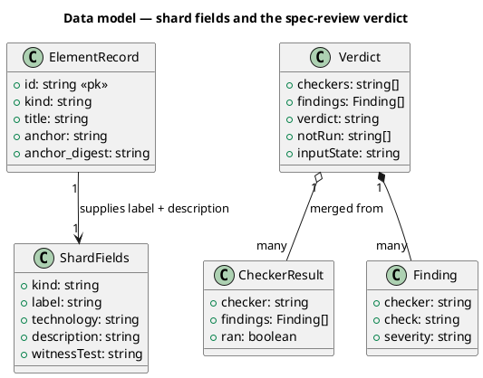

**No field carries a `<<new>>` or `<<changed>>` stereotype, and that is deliberate.** Those stereotypes bind to the Migration DDL — the template's rule is that every marked field has a matching `ALTER` — and there is no DDL here because none of these shapes is persisted in a store. Marking them would claim a migration that does not exist. What moves is recorded below instead.

`ShardFields.label` and `.description` already exist on the writer's signature; what changes is that the fold supplies them rather than letting them default.

`CheckerResult.ran` and `Verdict.notRun` are the two genuinely new fields. `ran` is optional on the adapter contract and absence reads as `true`, so every adapter that does not speak it keeps working unchanged.

#### Migration DDL

*(none — no persistent store. The corpus is files on disk and the verdict is computed per run. The five degraded shards are rewritten in place by §Behavior #2, which is the whole of the data migration.)*

### Behavior — sequence per AC

#### §Behavior #1 — the fold supplies what the writer would otherwise default

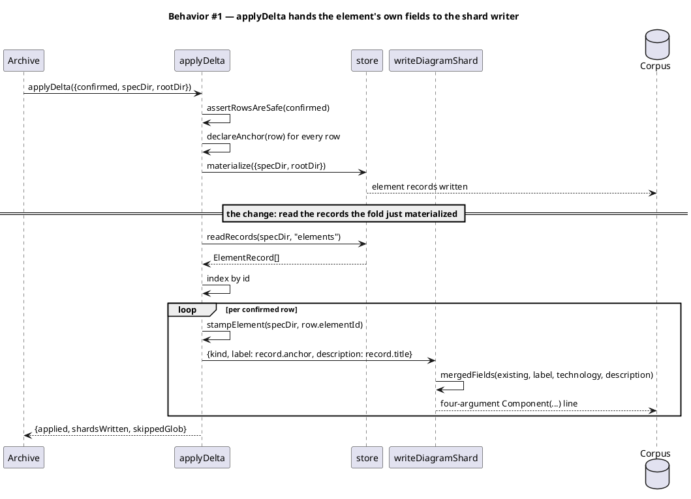

`materialize` already runs before the loop, so the records exist by the time they are read. Reading them once outside the loop rather than per row keeps the fold's single-pass shape.

**There is deliberately no "record absent" fallback**, and an earlier draft of this spec was wrong to describe one. `declareAnchor` runs before the loop and `materialize` creates the element record *from* that declaration, so a confirmed row can never reach `writeDiagramShard` without a record. A fallback branch would be dead code, and the scenario tick refused to write two tests for it. What defends the invariant instead is AC-001's third scenario, which asserts that materialize has written the record the loop is about to read.

#### §Behavior #2 — the five shards already on disk are corrected

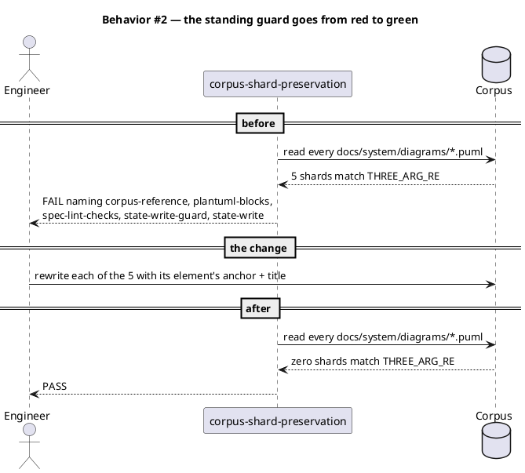

The five are rewritten to exactly what §Behavior #1 would now produce for them, so the fix and the backfill agree by construction rather than by hand.

#### §Behavior #3 — why no re-verify phase is added

The gap that let this reach `main` is real: `/integrate` ran green, `/archive` then wrote the shards, and no phase after `/archive` runs the suite again. The obvious repair is a second verify. This spec deliberately does not add one.

A re-verify catches the failure after it is written. §Behavior #1 makes the failing shape unreachable at the writer, which is the same class of fix as the anti-drift tests in §Behavior #5 and #6: stop the two things being able to disagree, rather than checking whether they did. A verify phase added here would also run the whole suite for a second time on every workflow, which is minutes of wall clock to re-prove something the writer now cannot break.

What that leaves open is the wider category, and §Behavior #10 closes it — by a different means, which is the distinction that matters. The argument above is against re-running the **suite**: it costs minutes on every workflow to re-prove something the writer can no longer break. It is not an argument against checking `/archive`'s output at all. §Behavior #10 makes a report that already runs start blocking, which costs nothing and covers the categories the writer fix does not touch.

Read together: shape is fixed at the writer, and everything else `/archive` writes is gated by the report it was already producing.

#### §Behavior #4 — a red suite cannot publish

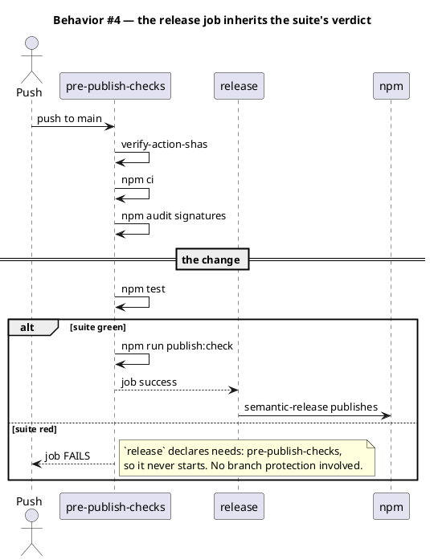

The suite runs **before** `publish:check` in the same job. Ordering it first means a red suite fails the job in roughly the suite's own runtime rather than after a pack, an install and a smoke test have also been paid for.

A sibling job was considered and rejected under **Alternatives**.

#### §Behavior #5 — the runbook and the release config cannot disagree about a breaking change

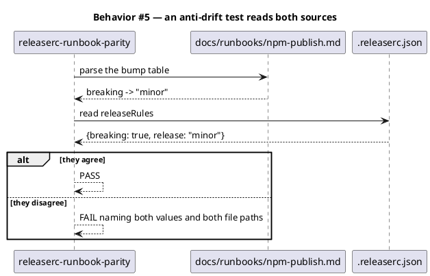

Correcting the runbook's line is the visible half. The test is the half that matters: `0682a28` changed the config and nothing noticed the doc had gone stale for the eight months since.

#### §Behavior #6 — every demoted scope appears in the runbook's contract, and vice versa

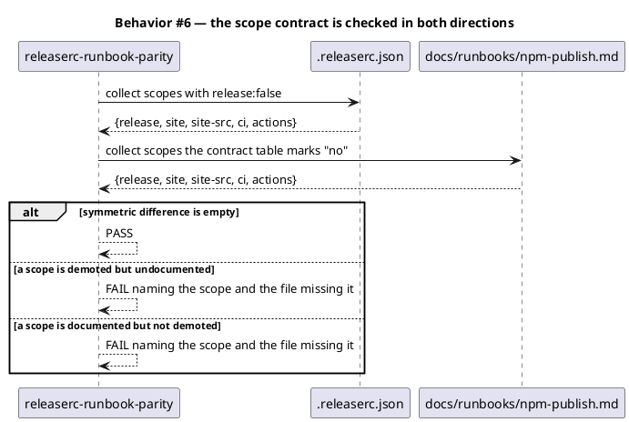

Both directions are checked because both failed here. `site-src` was demoted nowhere and documented nowhere, and the only reason anyone noticed is that a commit used it.

#### §Behavior #7 — a checker that could not run says so

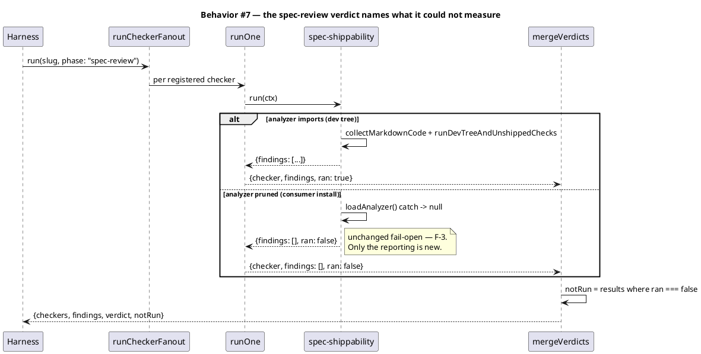

`ran` is absent on every adapter that does not opt in, and absence reads as `true`. That keeps the five existing adapters untouched and makes the new field additive.

The verdict still reads `CLEAN` in the consumer case, because it is clean as far as anything could see. What changes is that `notRun: ["spec-shippability"]` sits beside it, so a reader can tell the difference between nothing found and nothing looked.

#### §Behavior #8 — the documentation provider is named once, in a pointer, and nowhere else

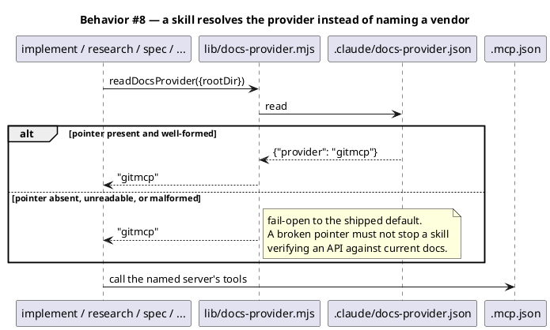

Three consumer moves fall out of this, and each touches exactly one file:

- **Self-host gitmcp** — change the `url` in `.mcp.json`. The server name does not change, so the pointer does not either.
- **Switch to a different provider** — replace the entry in `.mcp.json` and put its name in the pointer.
- **Go tool-free** — remove the entry. Article VI.5 is an outcome mandate; official docs, an `llms.txt` or a pinned local cache still satisfy it.

The point of the pointer is that none of those is an amendment. Today, changing the provider means editing the constitution, the genesis spec and eight skills, which is why it has never been done.

#### §Behavior #9 — an upgrade sheds the retired server instead of carrying both

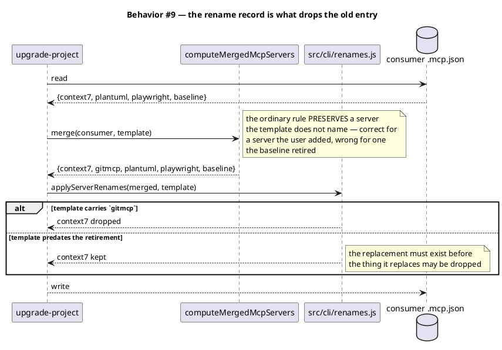

This is the mechanism `6eebd07` already used for `sprint-channel` → `baseline`. T7 adds one frozen record and no new logic.

#### §Behavior #10 — the corpus report stops being advice

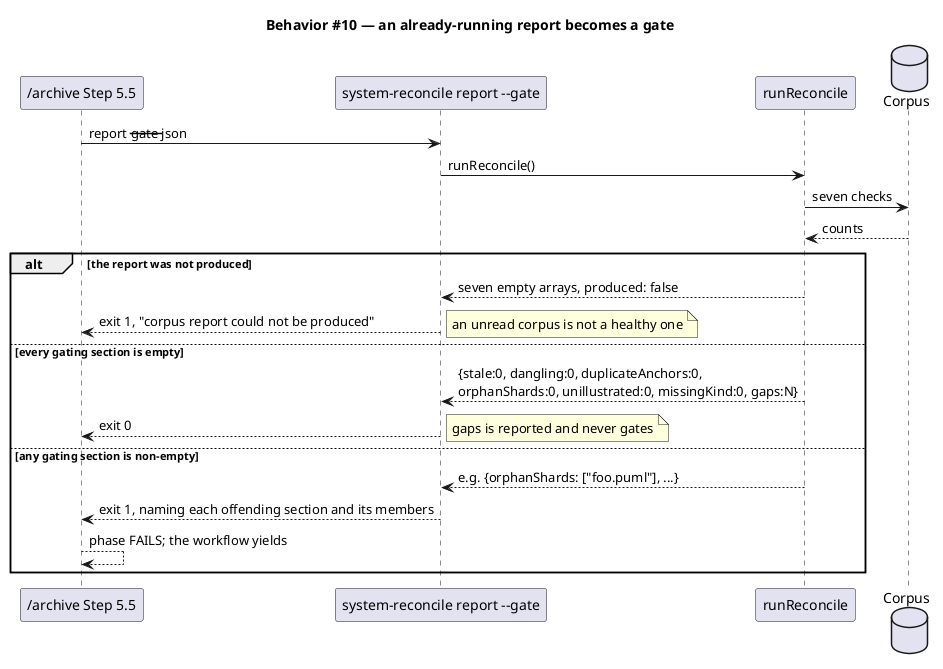

**An all-empty report is three different states, and only one is safe.** `runReconcile` returns seven empty arrays for a clean corpus, for a corpus behind a disabled flag, and for a corpus it crashed trying to read — its own header comment says so, and names the stderr line as the only discriminator. A gate that reads "all empty" as "healthy" therefore passes a corpus it never managed to read.

That is the same defect this batch exists to end, reproduced inside the fix for it, which is why `gatingFailures` takes a produced signal rather than inferring health from emptiness. The scenario tick found this; it was not in the ticket.

**The gate is an exit code, not a sentence in the SOP.** Step 5.5 already told a reader to surface the report, and a wrong write still reached a commit — because a rule that depends on the model reading a JSON and choosing to stop is advice wearing a gate's clothes. That is the exact defect this whole batch is about, so fixing it with more prose would be self-defeating.

**`gaps` is reported and never gates**, and the reason is arithmetic rather than principle: two gaps pre-exist (`.claude/skills/commit/cli.mjs` and `closure-precommit-check.mjs`, both unanchored). Gating on `gaps` would fail every workflow until two modules unrelated to this batch are anchored, which turns a new gate into a chore nobody asked for. The other six sections read zero today, so making them blocking costs nothing now and catches the next bad write.

### State — core entity

*(omitted — no entity in this change has a non-trivial state machine. The shard writer is a pure function of its arguments, the parity tests are stateless, and the verdict is computed per run and never transitions.)*

### Dependencies — graph

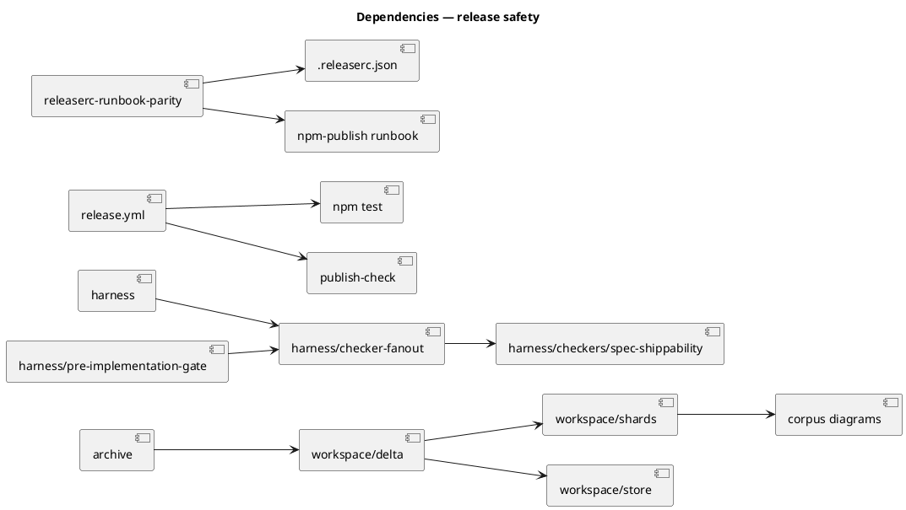

Acyclic. The one edge worth reading twice is `pre-implementation-gate --> checker-fanout`: the gate reads the fan-out's persisted verdict, so adding `notRun` to that verdict changes a shape the gate consumes. §Behavior #7 keeps the field additive for exactly this reason.

### Contracts

| Kind | Name | Input | Output | Errors | Idempotent |
|---|---|---|---|---|---|
| Function | `applyDelta({confirmed, specDir, rootDir})` | confirmed delta rows | `{applied, skippedGlob, shardsWritten}` | throws on unsafe row, unresolvable concept | yes — re-running rewrites identical bytes |
| Function | `writeDiagramShard(specDir, elementId, {kind, label, technology, description, witnessTest, rootDir})` | element id + fields | `{path, written}` | throws `REJECT, never normalize` on a quote or newline in any field | yes — output is a pure function of the arguments |
| Function | `readRecords(specDir, kind)` | corpus dir, record kind | record array | returns `[]` on an absent collection | yes — read-only |
| Function | `mergeVerdicts(verdicts)` | `CheckerResult[]` | `{checkers, findings, verdict, notRun}` | none — total over its input | yes — pure |
| Adapter | checker `run(ctx)` | fan-out ctx, optionally carrying `loadAnalyzer` | `{findings}` or `{findings, ran}` | an adapter throw fails that checker only | yes — read-only oracles |
| Function | `gatingFailures(report, {produced})` | a corpus report + whether it was produced | `[{section, members}]`, empty when the gate passes | none — total over its input | yes — pure |
| CI job | `pre-publish-checks` | a push to `main` or `next` | job success or failure | non-zero from any step fails the job | no — each run is a fresh checkout |

### Libraries and versions

| Library@version | Purpose | Key APIs | Confirmed against current docs |
|---|---|---|---|
| `node:test` (Node 22 built-in) | the suite the CI job runs and the two new parity tests use | `describe`, `it`, `assert` | yes — Node 22 is pinned in `release.yml` `setup-node` and `engines` declares `>=18.17.0` |
| `semantic-release` (devDependency, config only) | reads `releaseRules`; not called by this change | `releaseRules[].scope`, `.release` | yes — `{scope, release: false}` demotion is the documented override shape and is already in use for four scopes |
| GitMCP `1.1.0` (remote MCP, Apache-2.0) | the documentation provider replacing context7 | `match_common_libs_owner_repo_mapping`, `fetch_generic_documentation`, `search_generic_documentation`, `search_generic_code`, `fetch_generic_url_content` | yes — read off a live `tools/list` against `https://gitmcp.io/docs`, not the README, which names `fetch_url_content` where the wire says `fetch_generic_url_content` |
| Claude Code MCP config | the `.mcp.json` entry shape for a remote server | `type` (`http` / `sse` / `ws` / `streamable-http`), `url`, `headers` | yes — current docs; a `url` with no `type` is a named configuration error, and SSE is documented as deprecated |

No new npm dependency is added. GitMCP is a remote endpoint, not a package: nothing is installed, and `npx` is no longer needed for this server, which shortens the cold-start path the genesis spec's prerequisites describe.

`match_common_libs_owner_repo_mapping` is the entry point that makes the swap viable. context7 is library-id-centric — resolve a library, fetch its versioned docs — and a purely repo-centric provider would have been a downgrade for Article VI.5's actual use, which starts from a library name. That tool takes a library name and returns owner/repo, so the library-name entry point survives the swap.

### Alternatives considered

| Alt | Summary | Rejected because |
|---|---|---|
| A | Correct the five shards by hand and leave the fold alone | This is what the previous cycle did with its one shard, and the defect returned five-fold one cycle later. The backlog entry that recorded it says the fold already holds what it needs. |
| B | Make `writeDiagramShard` refuse a null description instead of fixing the caller | Moves the break to a throw during `/archive`, which is later and louder but no earlier. The caller has the data; the writer does not. |
| C | Add a re-verify phase after `/archive` | Catches the shape after it is written and costs a full suite run on every workflow. §Behavior #3. |
| D | Run the suite in a sibling job that `release` also needs | Parallelises with `publish:check` but pays a second `npm ci` and a second checkout for a repository whose suite is the long pole anyway. One extra step in the existing job is smaller and orders the cheap failure first. |
| E | Delete the runbook's bump table rather than fix it | The table is the reason anyone can predict a version without reading `.releaserc.json`. Removing it trades a wrong answer for no answer. |
| F | Reuse `describeInputState` for the spec-review phase | It answers "was there a diff to score", which is the code-review question. Spec-review's question is "did each checker actually run", and no changed-file list answers it. |
| G | Put the provider name in `project.json` instead of its own file | Engineer-directed: a dedicated pointer, asked for three times across two messages. It is also more discoverable — a consumer changing their docs provider should not have to learn `project.json`'s schema to find one string. |
| H | Declare the new server with `"type": "sse"`, matching gitmcp's README | Measured against the live endpoint: a POST `initialize` returns 200 with an `mcp-session-id` header and an MCP result (`GitMCP 1.1.0`, protocol `2025-03-26`), which is streamable HTTP. Claude Code deprecates SSE — *"Use HTTP servers instead, where available"* — and it is available. |
| I | Omit `type` and let the `url` imply the transport | A configuration error, not a shortcut. Claude Code reads a `type`-less entry as stdio, skips the server, and reports it — the failure is silent from the workflow's point of view. AC-016 pins this. |
| J | Keep both providers, defaulting to the new one | Contradicts the instruction to retire. It also leaves two servers to maintain and two names the audit reports, which is the coupling the pointer exists to remove. |
| K | Rewrite Article VI.5 to describe repo-and-URL-centric lookup | Bakes one vendor's shape into the constitution, so the next swap is another amendment — the opposite of the isolation asked for. VI.5 is rewritten to name no vendor *and* no shape, which satisfies both the instruction to rewrite it and the instruction to isolate. |

## Program design

### Data access

| Reader | Source | Access path | Written by |
|---|---|---|---|
| `applyDelta` | `docs/system/elements/*.md` | `readRecords(specDir, 'elements')` | `materialize`, called by `applyDelta` itself immediately before the read |
| `writeDiagramShard` | `docs/system/diagrams/<id>.puml` | `readSourceText` for the preserve-existing merge | `writeDiagramShard` — the single writer |
| `releaserc-runbook-parity` test | `.releaserc.json` | `readFileSync` + `JSON.parse` | nothing — read-only in this change |
| `releaserc-runbook-parity` test | `docs/runbooks/npm-publish.md` | `readFileSync` + markdown table parse | nothing — read-only in this change |
| `release-workflow-runs-suite` test | `.github/workflows/release.yml` | `readFileSync` + YAML line scan | nothing — read-only |
| `mergeVerdicts` | in-memory `CheckerResult[]` | in-process call | `runOne`, per checker |
| `pre-implementation-gate` | `.claude/state/checker-fanout/<slug>.json` | `readFileSync` | `persistVerdict` in `checker-fanout.mjs` — the single writer, canonical projection |
| `readDocsProvider` | `.claude/docs-provider.json` | `readFileSync` + `JSON.parse`, both inside a catch | the consumer, by hand or by asking Claude — the baseline ships it once and never rewrites it |
| every skill needing current docs | the provider name | `readDocsProvider({rootDir})` — in-process call | nothing — read-only |
| `audit-baseline` `mcp-servers` check | the provider name | `readDocsProvider({rootDir})` | nothing — read-only |
| `applyServerRenames` | `MCP_SERVER_RENAMES` | frozen module constant | nothing — a compile-time record, not state |

The pointer has no writer inside the baseline after install, and that is the design. A file the baseline rewrites is a file that fights the consumer's edit on every upgrade.

The last row is the one to watch. The gate reads a file the fan-out writes, so `notRun` lands in a consumed shape. It is additive and the gate reads only `verdict`, which is why §Behavior #7 adds a field rather than changing one.

### Call stack

Load-bearing for T1 — the fold crosses from the archive phase into the corpus store and back out to the shard writer, and the ordering of `materialize` against the record read is the whole fix.

```
/archive Step 3
  └─ verifyAndApplyDelta                 workspace/delta.mjs
       └─ applyDelta                     workspace/delta.mjs
            ├─ assertRowsAreSafe         workspace/delta.mjs
            ├─ declareAnchor (per row)   workspace/delta.mjs
            │    └─ writeConcept         workspace/store.mjs
            ├─ materialize               workspace/materialize.mjs   <- writes element records
            ├─ readRecords('elements')   workspace/store.mjs         <- NEW: reads them back
            └─ per row:
                 ├─ stampElement         workspace/digest.mjs
                 └─ writeDiagramShard    workspace/shards.mjs        <- IO boundary
                      └─ mergedFields    workspace/shards.mjs
```

T2, T4, T5 and T6 are single-frame or config-only and have no call stack worth drawing.

### Layout

```
.claude/skills/workspace/
  delta.mjs                             changed   — applyDelta reads element records and passes label + description
  shards.mjs                            unchanged surface — listed because mergedFields is the merge this change feeds; it is not edited

.claude/skills/harness/
  checker-fanout.mjs                    changed   — mergeVerdicts collects notRun; runOne passes ran through
  checkers/spec-shippability.mjs        changed   — the loadAnalyzer catch reports ran: false

docs/system/diagrams/
  corpus-reference.puml                 changed   — four-argument form
  plantuml-blocks.puml                  changed   — four-argument form
  spec-lint-checks.puml                 changed   — four-argument form
  state-write-guard.puml                changed   — four-argument form
  state-write.puml                      changed   — four-argument form

.github/workflows/
  release.yml                           changed   — npm test step in pre-publish-checks, before publish:check

docs/runbooks/
  npm-publish.md                        changed   — breaking-change row reads minor; scope contract gains site-src

.releaserc.json                         changed   — site-src demoted to release:false

.claude/
  docs-provider.json                    new       — {"provider": "gitmcp"}; the pointer, and the only place a vendor is named
  skills/lib/docs-provider.mjs          new       — readDocsProvider({rootDir}); fail-open to the shipped default

src/
  docs-provider.template.json           new       — the shipped mirror of the pointer
  cli/renames.js                        changed   — one frozen record: context7 -> gitmcp, since 0.26.0

.mcp.json                               changed   — context7 (stdio npx) removed; gitmcp added as {"type":"http","url":"https://gitmcp.io/docs"}

CLAUDE.md                               changed   — VI.5 rewritten vendor-free; breaks ARTICLE_VI_SHA256 by design
src/CLAUDE.template.md                  changed   — byte-equal mirror
docs/init/seed.md                       changed   — §2.5 and nine other mentions go vendor-neutral
src/seed.template.md                    changed   — byte-equal mirror
.claude/CONSTITUTION.md                 changed   — annex mentions
README.md                               changed   — one mention
PRODUCT.md                              changed   — one mention

.claude/skills/
  research/SKILL.md                     changed   — 9 mentions, the heaviest consumer
  implement/SKILL.md                    changed   — 5 mentions
  claude-automation-recommender/…       changed   — 6 mentions + references/mcp-servers.md
  spec/SKILL.md, security/SKILL.md      changed   — 2 each
  audit-baseline/SKILL.md               changed   — 2
  memory-sync/SKILL.md                  changed   — 1
  technical-writer/SKILL.md             changed   — 1
  spec/template.md                      changed   — the Libraries table's confirmation column
  audit-baseline/expected-baseline.mjs  changed   — DEFAULT_MCP_SERVERS derived from the pointer
  audit-baseline/checks/mcp-servers.mjs changed   — reports the pointer's provider, still never requires it
  upgrade-project/SKILL.md              changed   — how to change the provider (ungoverned .md; no delta row)
  system-reconcile/cli.mjs              changed   — --gate flag on the report verb; exit 1 on a gating section
  archive/SKILL.md                      changed   — Step 5.5 invokes the gating form and fails the phase on non-zero

.claude/commands/
  init-project.md                       changed   — how to choose the provider at setup

tests/
  delta-fold-shard-fields.test.mjs      new       — AC-001, AC-002, AC-004
  release-workflow-runs-suite.test.mjs  new       — AC-005, AC-006
  releaserc-runbook-parity.test.mjs     new       — AC-008, AC-010
  checker-fanout-not-run.test.mjs       new       — AC-011, AC-012, AC-013
  docs-provider-pointer.test.mjs        new       — AC-014, AC-015, AC-016, AC-020
  no-vendor-in-governance.test.mjs      new       — AC-017, the scan that keeps the vendor out
  mcp.test.mjs                          changed   — 6 mentions
  mcp-rename-merge.test.mjs             changed   — 8 mentions; AC-018, AC-019
  upgrade-mcp-noop.test.mjs             changed   — 8 mentions
  warm-context-diet.test.mjs            changed   — ARTICLE_VI_SHA256 re-pinned; AC-021
  corpus-shard-preservation.test.mjs    unchanged surface — AC-003 is its existing standing guard, currently red; this change turns it green without editing it
```

The last row is deliberate. AC-003 is satisfied by not touching the test that already asserts it — editing the guard to accommodate the fix would defeat the guard.

**Three standing guards are amended, and each amendment is named here so a reviewer never sees a test edit with no spec basis.**

| Guard | Why it must change | What still holds |
|---|---|---|
| `warm-context-diet.test.mjs`, `state-write-guard.test.mjs` — the two `ARTICLE_VI_SHA256` pins | T7 rewrites VI.5 to cite the pointer instead of a vendor, so the pinned slice changes by construction | Both pins move in the SAME commit as the rewrite. Split across two, the suite is red in between for a reason indistinguishable from the accidental edit the pins exist to catch |
| `system-spec-delta-archive-verify.test.mjs` — Step 5.5 asserted `report-only` | AC-025 makes Step 5.5 gate on a non-zero exit; the literal no longer describes it | The assertion moves to what the guard was actually defending — Step 5.5 repairs nothing — and gains a check that it invokes the gating form |
| `system-spec-delta-shard-writer.test.mjs` — D9 asserted `reconcile-report.mjs` exports only `runReconcile` | AC-023/AC-024 add `reconcileForGate` and `gatingFailures`, both read-only | D9 forbids an *apply path*, not an export. The writer-name scan over the module source is the real teeth and is untouched |

None of the three widens scope. Each rewrites an assertion whose literal was overtaken while keeping the invariant it defended.

## Design calls

The write set intersects none of `project.json → tdd.ui_globs`. No UI surface changes.

- *(none)*

## System delta

| Verb | Element | Anchor | Concept | Kind |
|---|---|---|---|---|
| change | workspace-corpus | `.claude/skills/workspace/*.mjs` | memory-model | c4_component |
| change | harness-helpers | `.claude/skills/harness/*.mjs` | harness-loop | c4_component |
| change | harness-checkers | `.claude/skills/harness/checkers/*.mjs` | review-fanout | c4_component |
| change | release-workflow | `.github/workflows/release.yml` | build-distribution | c4_component |
| add | docs-provider | `.claude/skills/lib/docs-provider.mjs` | project-config | c4_component |
| change | cli-core | `src/cli/*.js` | build-distribution | c4_component |
| change | system-reconcile-report | `.claude/skills/system-reconcile/*.mjs` | memory-model | c4_component |
| change | consent-commands | `.claude/commands/*.md` | consent-gates | c4_component |

Five of the six rows are `change` against elements that already resolve; only `docs-provider` is an `add`, and its anchor `.claude/skills/lib/docs-provider.mjs` falls inside the governed surface as required.

**`/init-project` is a command, not a skill**, so the procedure AC-022 adds lands in `.claude/commands/init-project.md`, anchored by `consent-commands` as `.claude/commands/*.md`. That path is governed because `.claude/commands/` is in `governed_surface.alwaysIncluded` — the one place a `.md` file is governed. Its sibling half, the same procedure written into `.claude/skills/upgrade-project/SKILL.md`, is *not* governed and earns no row: under `.claude/skills/` only the code extensions count.

**Several files this spec touches earn no row, and that is correct rather than an omission.** `docs/runbooks/npm-publish.md`, `.releaserc.json` and `.mcp.json` all sit outside `memory.architecture_map.governed_surface` — its roots are `.claude/hooks/`, `.claude/skills/`, `.claude/commands/`, `.claude/schemas/`, `.claude/mcp/`, `.github/workflows/` and `src/`, and none of the three is under one. `.claude/docs-provider.json` is the near miss worth stating plainly: `.claude/` is not itself a root, so a file directly inside it is ungoverned even though its siblings under `.claude/skills/` are not. `CLAUDE.md` and `src/CLAUDE.template.md` are ungoverned for a different reason — `.md` is not one of `governed_surface.codeExtensions`.

`release-workflow` is the only one of the four with a file anchor rather than a glob, so it is the only one that carries an `anchor_digest` and the only one whose digest this change moves.

**`spec optimize` reports five undeclared elements and none of them earns a row.** Four are the known `patternsOverlap` trap — landmine `patternsOverlap widens a single-file write_set entry to its whole directory`, verified at `45b9b22` and still live. The predicate reduces both sides to a directory prefix, so naming `.claude/skills/workspace/delta.mjs` matches every element under `.claude/skills/workspace/`, and naming `.claude/skills/harness/checker-fanout.mjs` matches every element under `.claude/skills/harness/`. That is how `workspace-flags`, `design-judge` and `workflow-migrator` appear. `spec-review-helpers` (`.claude/skills/spec-*/*.mjs`) is the same trap reaching a sibling directory this spec does not touch at all.

The fifth, `ci-automation`, is a real overlap and still wrong to declare: it anchors the family `.github/workflows/*.yml`, and `release-workflow` anchors the exact file this change edits. Declaring both would record one edit against two elements, and the specific anchor is the one that carries the digest.

Per the landmine's own reading rule, the counts are the tell: five undeclared against a corpus of roughly 119 is the ordinary version of this trap, not the near-total one that signals a broken comparison.

## Acceptance criteria

| ID | Criterion (given / when / then) | Kind | Upstream AC | Sequence |
|---|---|---|---|---|
| AC-001 | given a confirmed delta row for an element with no existing shard, when `applyDelta` runs, then the written shard carries four arguments with label = the element record's `anchor` and description = its `title` | behavior | T1 | §Behavior #1 |
| AC-002 | given an element whose shard already exists with a real label and description, when `applyDelta` runs again, then those values survive unchanged | behavior | T1 | §Behavior #1 |
| AC-003 | given the live corpus, when every `docs/system/diagrams/*.puml` is scanned, then none matches the three-argument form | preflight | T1 | §Behavior #2 |
| AC-004 | given the five shards degraded on 2026-08-24, when they are read after this change, then each carries its own element's anchor as label and title as description | behavior | T1 | §Behavior #2 |
| AC-005 | given `release.yml`, when parsed, then a job that `release` declares in `needs` runs the full test suite, and that step carries no `continue-on-error` | preflight | T2 | §Behavior #4 |
| AC-006 | given the suite step in `pre-publish-checks`, when the step order is read, then it precedes `npm run publish:check` | smoke | T2 | §Behavior #4 |
| AC-007 | given the runbook's bump table, when the breaking-change row is read, then it states a minor bump and names `.releaserc.json` as the override's home | behavior | T4 | §Behavior #5 |
| AC-008 | given the runbook's stated breaking-change bump and `.releaserc.json`'s `releaseRules`, when compared, then they agree; when they disagree the failure names both values and both paths | preflight | T4 | §Behavior #5 |
| AC-009 | given `.releaserc.json`, when `releaseRules` is read, then `site-src` carries `release: false` alongside `site` | behavior | T5 | §Behavior #6 |
| AC-010 | given the set of scopes demoted in `.releaserc.json` and the set the runbook's scope contract marks as non-bumping, when compared in both directions, then the symmetric difference is empty | preflight | T5 | §Behavior #6 |
| AC-011 | given a checker whose adapter returns `ran: false`, when the fan-out merges, then the verdict's `notRun` names that checker | behavior | T6 | §Behavior #7 |
| AC-012 | given every adapter returning findings without a `ran` field, when the fan-out merges, then `notRun` is empty and the verdict is unchanged from today | behavior | T6 | §Behavior #7 |
| AC-013 | given `spec-shippability` whose analyzer cannot be imported, when it runs, then it returns `ran: false` rather than a bare empty findings list, and still throws nothing; the loader is injectable on `ctx` so the catch is reachable from a test | error-mapping | T6 | §Behavior #7 |
| AC-014 | given `.claude/docs-provider.json` naming a provider, when `readDocsProvider` runs, then it returns that name | behavior | T7 | §Behavior #8 |
| AC-015 | given the pointer absent, unreadable, or malformed, when `readDocsProvider` runs, then it returns `gitmcp` and throws nothing | error-mapping | T7 | §Behavior #8 |
| AC-016 | given `.mcp.json`, when the documentation provider's entry is read, then it declares `"type": "http"` alongside its `url` | preflight | T7 | §Behavior #8 |
| AC-017 | given every shipped `SKILL.md`, `CLAUDE.md`, `src/CLAUDE.template.md`, `docs/init/seed.md` and `src/seed.template.md`, when scanned, then none names a documentation-provider vendor; `src/cli/renames.js` is the sole exception | preflight | T7 | §Behavior #8 |
| AC-018 | given a consumer `.mcp.json` carrying the retired server, when an upgrade merges a template that carries its replacement, then the retired entry is dropped and the replacement is present | smoke | T7 | §Behavior #9 |
| AC-019 | given a consumer `.mcp.json` carrying the retired server, when an upgrade merges a template that does NOT carry the replacement, then the retired entry is kept | behavior | T7 | §Behavior #9 |
| AC-020 | given `audit-baseline`, when it reports the default current-docs satisfier, then the name it checks comes from the pointer rather than a hard-coded literal | preflight | T7 | §Behavior #8 |
| AC-021 | given `CLAUDE.md` after the VI.5 rewrite, when measured, then it is at or under 28,000 characters and the re-pinned `ARTICLE_VI_SHA256` matches the new Article VI slice | preflight | T7 | §Behavior #8 |
| AC-022 | given `/init-project` and `/upgrade-project`, when their SKILL.md is read, then each states how to change the documentation provider: edit the `.mcp.json` entry, then put its server name in the pointer | behavior | T7 | §Behavior #8 |
| AC-023 | given a corpus with any of `stale`, `dangling`, `duplicateAnchors`, `orphanShards`, `unillustrated` or `missingKind` non-empty, when `report --gate` runs, then it exits non-zero naming each offending section and its members | error-mapping | T8 | §Behavior #10 |
| AC-024 | given a corpus whose only non-empty section is `gaps`, when `report --gate` runs, then it exits 0 and still reports the gap count | behavior | T8 | §Behavior #10 |
| AC-025 | given `/archive` Step 5.5, when its SOP is read, then it invokes the gating form and treats a non-zero exit as a phase failure rather than a note to surface | preflight | T8 | §Behavior #10 |
| AC-026 | given the runbook's bump table, when all four rows are compared to `.releaserc.json`, then each agrees; a mismatch names the row, both values and both paths | preflight | T4 | §Behavior #5 |
| AC-027 | given the runbook's channels table, when its branch-to-dist-tag rows are compared to `.releaserc.json` `branches[]`, then they agree on which branch is a prerelease | preflight | T4 | §Behavior #5 |
| AC-028 | given a corpus report that could not be produced, when `gatingFailures` evaluates it, then the gate fails rather than reading seven empty arrays as a healthy corpus | error-mapping | T8 | §Behavior #10 |

## Test plan

| Category | Scenario | Expected | Covers |
|---|---|---|---|
| Golden path | a delta row for a new element with a record carrying anchor and title | shard renders `Component(id, "<anchor>", "component", "<title>")` | AC-001 |
| Golden path | `release.yml` parsed; walk `release.needs` to the job running the suite | the suite step is found and is not `continue-on-error` | AC-005 |
| Golden path | an adapter returns `{findings: [], ran: false}` | merged verdict carries `notRun: ["<name>"]` | AC-011 |
| Input boundary | an element record whose `title` contains a double quote | `writeDiagramShard` throws `REJECT, never normalize` — the preservation guard still covers the new path | AC-001 |
| Input boundary | a delta row whose element record `materialize` did not write | falls back to `{kind}` only; today's defaults apply; no throw | AC-001 |
| Contract violation | an adapter returns `{findings: [...]}` with no `ran` key | treated as `ran: true`; `notRun` stays empty | AC-012 |
| Contract violation | the runbook says major while the config says minor | parity test fails naming `minor`, `major`, and both file paths | AC-008 |
| Contract violation | a scope demoted in `.releaserc.json` but absent from the runbook table | parity test fails naming the scope and the file that omits it | AC-010 |
| Contract violation | a scope in the runbook table but not demoted in the config | parity test fails naming the scope and the file that omits it | AC-010 |
| Concurrency / ordering | `readRecords` called before `materialize` | would return a stale or empty index — pinned by asserting the call order in `applyDelta` | AC-001 |
| Failure mode | `spec-shippability`'s dynamic import rejects | adapter returns `{findings: [], ran: false}`; the fan-out completes; nothing throws | AC-013 |
| Failure mode | the corpus directory is absent when `readRecords` runs | returns `[]`; the fold falls back to `{kind}` per row rather than throwing | AC-001 |
| Regression trap | an existing shard with a real label, technology and description | all three unchanged after a re-run | AC-002 |
| Regression trap | the standing corpus scan over the live tree | zero degraded shards; the existing test is not edited | AC-003 |
| Regression trap | `pre-implementation-gate` reading a verdict that now carries `notRun` | gate decision unchanged — it reads `verdict`, not the new field | AC-012 |
| Golden path | pointer reads `{"provider": "gitmcp"}` | `readDocsProvider` returns `gitmcp` | AC-014 |
| Input boundary | pointer is `{}`, `{"provider": ""}`, or not an object | falls back to `gitmcp`; no throw | AC-015 |
| Contract violation | pointer file contains invalid JSON | falls back to `gitmcp`; no throw | AC-015 |
| Contract violation | a `.mcp.json` remote entry carrying `url` but no `type` | preflight fails — Claude Code would skip the server silently | AC-016 |
| Contract violation | a vendor name reintroduced into a SKILL.md or the constitution | scan fails naming the file and the line; `src/cli/renames.js` is exempt | AC-017 |
| Failure mode | the pointer names a server absent from `.mcp.json` | resolver still returns the name — it is a pointer, not a validator; the absent server surfaces at call time | AC-014 |
| Concurrency / ordering | upgrade merges a template predating the replacement | retired entry kept; the replacement must exist before the retired one may be dropped | AC-019 |
| Regression trap | a consumer server the template never named | preserved by the ordinary merge, untouched by the rename record | AC-018 |
| Regression trap | `CLAUDE.md` character count and the Article VI slice hash | at or under 28,000; hash matches the re-pinned value | AC-021 |
| Golden path | a corpus with all six gating sections empty | `report --gate` exits 0 | AC-024 |
| Contract violation | a corpus with one orphan shard | exit non-zero naming `orphanShards` and the shard | AC-023 |
| Contract violation | a corpus with two gating sections non-empty | exit non-zero naming both, not just the first | AC-023 |
| Input boundary | a corpus with `gaps` non-empty and every gating section empty | exit 0; the gap count still appears in the report | AC-024 |
| Failure mode | the corpus is absent or unreadable when `report --gate` runs | the existing report path's behaviour is unchanged; the gate adds no new throw | AC-024 |
| Contract violation | an all-empty report carrying `produced: false` | the gate FAILS — clean, flag-off and crashed all render as seven empty arrays, and only the first is safe | AC-028 |
| Contract violation | the bump table's `feat` row rewritten to say patch | parity fails naming the row, both values, both paths | AC-026 |
| Contract violation | the channels table claiming `main` is a prerelease | parity fails against `.releaserc.json` `branches[]` | AC-027 |
| Regression trap | `/init-project` and `/upgrade-project` prose | both still name the two-step provider change | AC-022 |

### Drift-check exceptions — the one AC no diff can evidence

`drift_check.mjs` resolves an AC by finding its id in an **added** line of the branch diff. AC-003 cannot be resolved that way, and the reason is the point of the AC rather than a defect in it:

> AC-003 is satisfied by the standing guard `tests/corpus-shard-preservation.test.mjs` going green **without being edited**. An unedited file contributes no added lines, so no added line can carry the id.

Editing the guard to add the reference would defeat the guard — the test would then be written by the same change it is meant to police. So AC-003 is declared **evidenced-by-unedited-guard**, and its evidence is the guard's own verdict: 8 pass / 0 fail against the live corpus. Drift-check reports it `unresolved` on every run of this workflow, and that row is expected, not a finding.

`drift_check.mjs` has no declared-exception mechanism, so this cannot be expressed to the tool. Adding one is out of scope here and is recorded as backlog rather than smuggled into this ticket.

**Every other AC carries its id in the code or the test that implements it.** A comment naming only the ticket (`T7`, `T8`) leaves the AC unresolved even when the work landed, so the id belongs in the same comment that explains the work. That convention is what AC-021 and AC-028 are traced by.

## Observability

| Signal | Name | Shape | Purpose |
|---|---|---|---|
| Log | `shardsWritten` | array of shard paths on the `applyDelta` result, already surfaced by `/archive` Step 3 | shows which shards a landing rewrote, so a wrong one is attributable to its workflow |
| Log | `notRun` | array of checker names on the merged spec-review verdict | tells a reader which checkers contributed nothing because they could not run |
| Metric | CI job conclusion for `pre-publish-checks` | GitHub Actions job status | a red suite is visible as a failed job on the commit rather than as a published version |
| Alarm | *(none)* | — | this repository has no alerting surface; a failed Actions job on `main` is the page target |

## Rollout

### Prerequisites

| # | Prerequisite | enforced-by |
|---|---|---|
| 1 | No shard in the live corpus carries the three-argument form when this lands | AC-003 |
| 2 | The suite step is wired into a job `release` transitively needs, so a red suite cannot publish | AC-005 |
| 3 | The suite runs before `publish:check`, so the cheap failure comes first | AC-006 |
| 4 | The runbook and `.releaserc.json` agree on the breaking-change bump | AC-008 |
| 5 | The demoted-scope sets in the runbook and the config are identical | AC-010 |
| 6 | A checker that cannot run reports it rather than returning a bare empty result | AC-013 |
| 7 | The documentation provider's `.mcp.json` entry declares a `type`, so Claude Code does not skip it as a malformed stdio entry | AC-016 |
| 8 | No shipped governance file or skill names a documentation-provider vendor; `src/cli/renames.js` is the sole exception | AC-017 |
| 9 | `CLAUDE.md` stays at or under 28,000 characters and the Article VI hash is re-pinned in the same commit as the rewrite | AC-021 |
| 10 | An upgrade past this release sheds the retired server rather than carrying both | AC-018 |
| 11 | A corpus write that breaks any of the six gating sections fails `/archive` rather than being surfaced as a note | AC-023 |
| 12 | `/archive` Step 5.5 invokes the gating form, so the gate is an exit code and not a sentence | AC-025 |
| 13 | Every row of the runbook's bump table, and its channels table, agree with the release config | AC-026 |

- **Feature flag**: *(none)*. Four of the six changes are corrections to things that are already wrong; gating a correction behind a flag would leave the wrong behaviour reachable. T6's `notRun` is additive and needs no flag because an absent `ran` field already means "ran". T7 needs none either — the pointer *is* the switch, and a flag on top of it would be a second way to say the same thing.
- **Migration order**: 1 fix the fold → 2 rewrite the five shards → 3 wire the CI step → 4 correct the runbook and config together → 5 add `notRun` → 6 land the pointer, then the vendor swap, then the governance rewrite.

  Three orderings inside that are load-bearing. Steps 1 and 2 must share a commit or the guard stays red between them. Step 4's two files must land together or the parity test fails on the intermediate state. And inside step 6 the pointer and its resolver must exist **before** any skill is rewritten to consult them, or the rewritten skill points at nothing.

  The Article VI rewrite and the `ARTICLE_VI_SHA256` re-pin must also share a commit. They are two deliberate acts but one atomic state: the hash exists to make an accidental edit fail, and splitting them across commits means the suite is red in between for a reason that looks exactly like the accident the pin guards against.
- **Canary**: *(none)* — there is no staged rollout surface. The first push to `main` after this lands is the canary, and its `pre-publish-checks` job is the success signal.

## Rollback

- **Kill-switch**: `git revert` of the individual commit. The power-track commit split is what makes this a real option: the CI step, the fold fix, the runbook and config pair, and the `notRun` field land as separate commits, so any one can be reverted without the others.
- **Signal to roll back**: `pre-publish-checks` fails on a commit whose suite passes locally — that would mean the CI step itself is misconfigured rather than catching a real failure. Visible on the Actions run within the suite's own runtime, which is roughly nine minutes. A shard regression is the standing guard going red on the next `/archive`, which surfaces in the same suite.

## Archive plan

- Defaults *(automatic)*: spec, spec approval, security reports (concatenated, one per ticket), timing table.
- Extras *(list any non-default files)*:
  - `docs/handoff/consumer-defect-report-2026-08-24-response.md` — written during the review that produced this spec, and untracked at this workflow's first arm, so it is in `rightsize_base` and excluded from the change measure. It belongs with the previous cycle's bundle, not this one. Listed so the reviewer sees the decision rather than wondering why it is loose in the tree.

## Open questions

All four questions this spec opened were settled by the owner at gate-A review, before approval. They are recorded here rather than deleted, because the reasoning is what a later reader needs.

- **Where the provider-replacement procedure lives — settled.** It goes in `/init-project` (choosing a provider at setup) and `/upgrade-project` (changing one later), not in the constitution. AC-022 pins both. This is what keeps the constitution vendor-free: the rule stays an outcome, and the how-to sits with the two commands a consumer actually runs.
- **Pointer validation against `.mcp.json` — settled: not built.** `readDocsProvider` returns whatever name it finds, and an undeclared server surfaces when a skill calls it. The pointer's value is that it can name a server the baseline has never heard of, so a read-time validator would have to allow anything anyway — a spelling check, not a safety one.
- **Shipping a default — settled: gitmcp ships out of the box.** Already the design; recorded so the "outcome mandate, not tool mandate" wording is not misread as shipping nothing. A consumer gets a working provider on install and changes it only if they want to.
- **`/archive`'s wider output — settled: the existing report becomes a gate.** T8 and §Behavior #10. Six sections block, `gaps` stays advisory because two pre-exist. This is the answer to "the one phase whose output nothing re-checks", and it is deliberately not a second suite run — see §Behavior #3 for why those are different arguments.
- **Runbook parity coverage — settled: all four bump rows plus the channels table.** AC-026 and AC-027. The parser and the config read already exist for the one row that drifted, so the marginal cost is a few assertions.

What remains genuinely open:

- **Nothing blocks approval.** The two `gaps` in the corpus (`.claude/skills/commit/cli.mjs`, `closure-precommit-check.mjs`, both unanchored) pre-date this batch and stay unanchored. They are why `gaps` does not gate. Anchoring them is a separate piece of work and this spec does not claim it.
