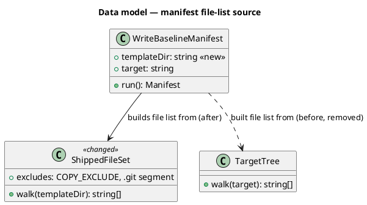
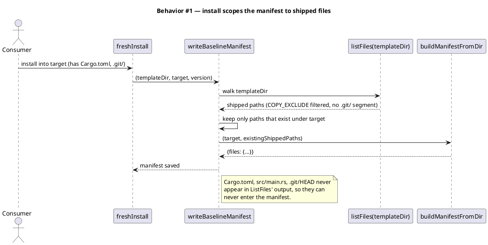
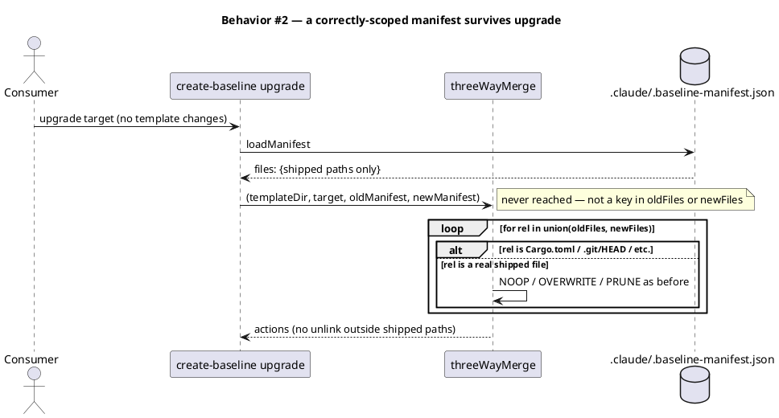
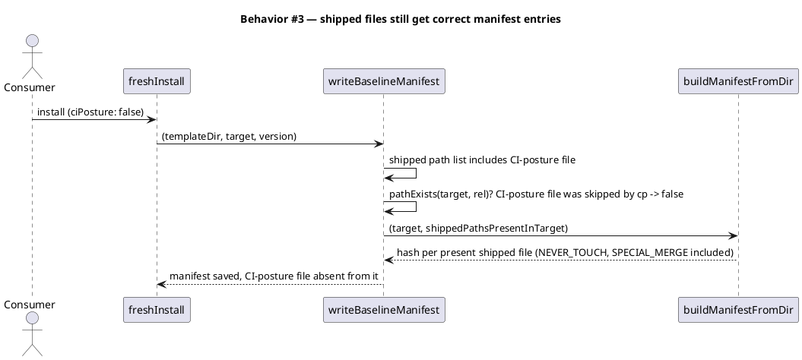
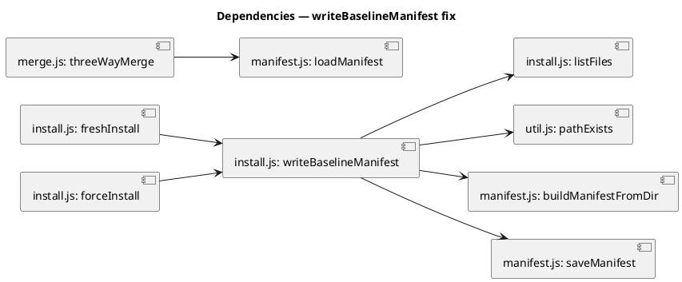

# Scope the installed baseline manifest to shipped template files only

## Context

| Input | Path |
|---|---|
| Intake | `docs/intake/manifest-scope-fix.md` |
| Scout | `docs/scout/manifest-scope-fix.md` |

**Write set**: `src/cli/install.js`, `tests/install.test.mjs`.

## Goal

`writeBaselineManifest` records only paths the baseline template actually ships, so `.claude/.baseline-manifest.json` can never contain a consumer-owned file or anything under `.git/`, and a later upgrade can never prune one.

## Non-goals

- Repairing `.git` corruption after the fact (recovery tooling, disaster-recovery docs).
- Changing prune semantics for files the baseline legitimately retires from a later template version (`merge.js:161-174` stays as-is).
- Migrating or auditing manifests already written to disk by installs that predate this fix.

## Design

@ref element:cli-core

### Data model — class diagram

No persisted schema changes. The diagram below is the conceptual shape of the fix: what `writeBaselineManifest` builds its file list from, before vs. after.



### Behavior — sequence per AC







### Dependencies — graph



### Contracts

| Kind | Name | Input | Output | Errors | Idempotent |
|---|---|---|---|---|---|
| Function | `writeBaselineManifest(templateDir, target, baseline_version)` | shipped template dir, install target dir, version string | writes `.claude/.baseline-manifest.json` | none thrown (fs errors propagate) | yes — same inputs re-derive the same manifest |

### Libraries and versions

No third-party library involved — `node:fs/promises` (`readdir`, `mkdir`) only, already in use in this file.

### Alternatives considered

| Alt | Summary | Rejected because |
|---|---|---|
| A | Keep walking `target`, add a denylist for `.git/`, `node_modules/`, common consumer markers (`Cargo.toml`, `package.json`, etc.) | A denylist is a losing enumeration — any consumer stack not on the list reproduces the exact bug. Walking the actual shipped set has no such gap. |
| B | Diff `target`'s walk against the shipped manifest already built for `newManifest` elsewhere (`bin/cli.js`'s `listShippedFiles`), keep the intersection | Equivalent result to the chosen design but couples `install.js` to a helper duplicated in `bin/cli.js` and `tui/upgrade.js`; walking `templateDir` directly inside `install.js` keeps the fix self-contained in the file that owns the bug. |

## Program design

### Data access

| Reader | Source | Access path | Written by |
|---|---|---|---|
| `threeWayMerge` (`merge.js:75-79`) | `.claude/.baseline-manifest.json` | `loadManifest(manifestPath)` | `writeBaselineManifest` (`install.js`) — the only writer |

### Call stack

```
freshInstall(templateDir, target, opts)  install.js:180
  └─ writeBaselineManifest(templateDir, target, baseline_version)   install.js:64 (signature changes)
       ├─ listFiles(templateDir)                                    install.js:42 (now walks templateDir, skips .git, filters COPY_EXCLUDE)
       ├─ pathExists(join(target, rel)) per shipped path            util.js
       ├─ buildManifestFromDir(target, existingShippedPaths, opts)  manifest.js:27 (unchanged)
       └─ saveManifest(...)                                         manifest.js:23 (unchanged)
forceInstall(templateDir, target, opts)  install.js:197
  └─ writeBaselineManifest(templateDir, target, baseline_version)   (same call, same fix)
```

### Layout

```
src/cli/
  install.js    changed   — listFiles() walks templateDir + skips .git entries; writeBaselineManifest() takes templateDir, filters to shipped paths present in target
tests/
  install.test.mjs   changed   — new case: install into a target with a foreign file and a .git/ dir, then upgrade, assert both survive
```

## Design calls

*(none)*

## System delta

| Verb | Element | Anchor | Concept | Kind |
|---|---|---|---|---|
| change | cli-core | `src/cli/install.js` | build-distribution | class |

## Acceptance criteria

| ID | Criterion (given / when / then) | Kind | Upstream AC | Sequence |
|---|---|---|---|---|
| AC-001 | given a target with a foreign file (`Cargo.toml`) and a `.git/` dir, when `freshInstall` or `forceInstall` runs, then `.claude/.baseline-manifest.json` has no entry for the foreign file and none for any `.git/*` path | behavior | intake AC 1 | §Behavior #1 |
| AC-002 | given the manifest from AC-001, when `create-baseline upgrade` runs with no template changes, then the foreign file and everything under `.git/` are untouched on disk | behavior | intake AC 2 | §Behavior #2 |
| AC-003 | given a target where every shipped file installed correctly (including a CI-posture-skipped file), when install runs, then the manifest contains a correct sha256 entry for every shipped file present in target, and no entry for a shipped file that was skipped (e.g. CI-posture opt-out) | behavior | intake AC 3 | §Behavior #3 |

## Test plan

| Category | Scenario | Expected | Covers |
|---|---|---|---|
| Golden path | Install into an empty target, no foreign files | Manifest contains exactly the shipped file set with correct hashes | AC-003 |
| Input boundary | Target pre-populated with `Cargo.toml`, `Cargo.lock`, `README.md`, `src/main.rs`, `src/types.rs`, and a `.git/` dir before install | None of those paths appear as keys in the saved manifest | AC-001 |
| Contract violation | `freshInstall` with `ciPosture: false` (a shipped file intentionally not copied) | That file's path is absent from the manifest, matching pre-fix behavior | AC-003 |
| Failure mode | Install (with foreign file + `.git/`) followed immediately by `create-baseline upgrade` against the same target, template unchanged | `threeWayMerge` reports no `PRUNE` action for the foreign file or any `.git/*` path; both remain on disk byte-identical | AC-002 |
| Regression trap | `NEVER_TOUCH` and `SPECIAL_MERGE` paths (`.claude/workflows.jsonl`, `.mcp.json`, `.claude/project.json`) | Still present in the manifest with correct hashes after install, unchanged from current behavior | AC-003 |

## Observability

No new logs, metrics, or alarms — this is a CLI installer bug fix, no running service.

## Rollout

### Prerequisites

- *(none)*

- **Feature flag**: none — this corrects existing default behavior, no flag.
- **Migration order**: n/a — no data migration.
- **Canary**: n/a — CLI tool, ships via normal npm release; the new test suite is the gate.

## Rollback

- **Kill-switch**: revert the npm release to the prior published version.
- **Signal to roll back**: `tests/install.test.mjs` failing in CI on the release branch — blocks the release before it ships, so no post-publish rollback path is expected to be exercised.

## Archive plan

- Defaults *(automatic)*: intake, scout, spec, spec approval.
- Extras *(list any non-default files)*:
  - *(none)*

## Open questions

- *(none)*
