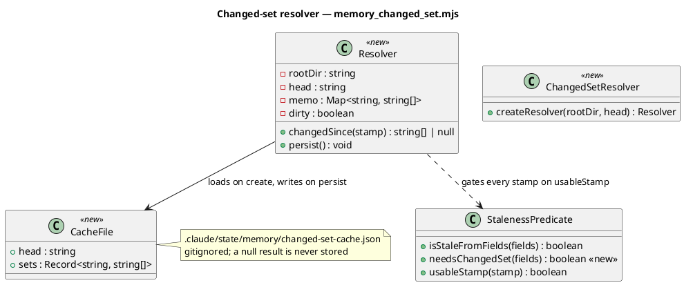
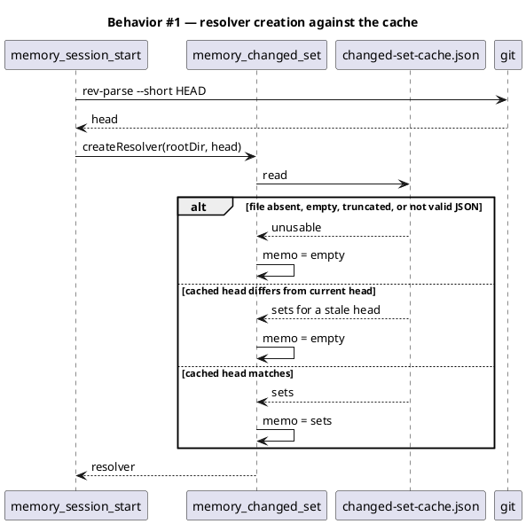
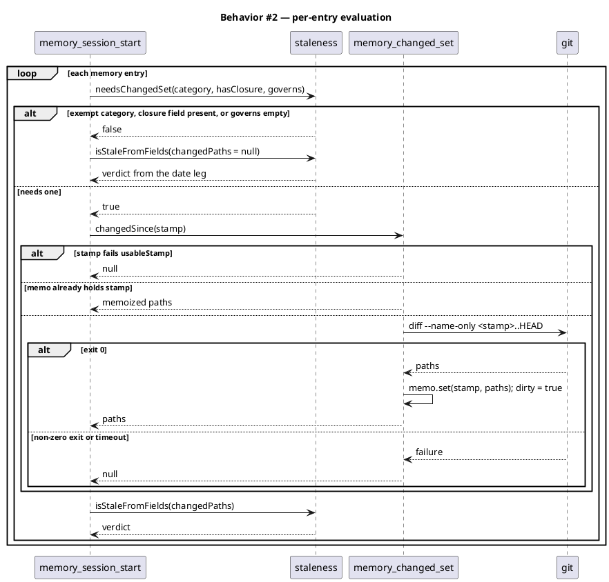
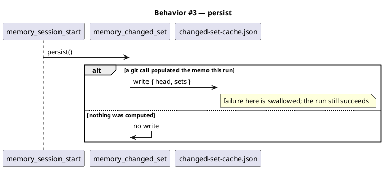
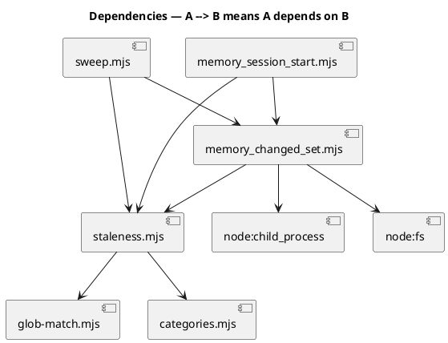

# Ask the staleness predicate what it needs before paying git for it

## Context

| Input | Path |
|---|---|
| Intake | `docs/intake/session-start-stale-cache.md` |
| BRD *(if any)* | *(none)* |
| Scout | `docs/scout/session-start-stale-cache.md` |
| Research *(if any)* | *(excepted at triage)* |

**Write set**: `.claude/hooks/lib/memory_changed_set.mjs`, `.claude/hooks/lib/memory_session_start.mjs`, `.claude/hooks/lib/staleness.mjs`, `.claude/skills/memory-sync/sweep.mjs`, `tests/**`

## Goal

`memory_session_start.mjs` computes a changed-set only for the entries whose verdict actually depends on one, computes each distinct one once, and reuses the previous run's answers while HEAD has not moved.

## Non-goals

- **Changing the predicate.** `isStaleFromFields` keeps its body. Every change here is upstream of it, deciding whether to compute its `changedPaths` argument, never what it does with one.
- **The `git log --name-only` superset prefilter proposed in the intake.** Measured and dropped — see Decision D4.
- **Re-verifying the currently-stale entries.** That is `/memory-sync` Step 0c.
- **Making `buildIndex` asynchronous.** Parallel git calls would also work and reach past this hook into every synchronous caller.
- **Caching the stale verdict.** Only changed-sets are cached. See Decision D6.

## Decisions

**D1 — Ask the predicate whether it needs a changed-set before computing one.**

`isStaleFromFields` returns before ever reading `changedPaths` in four cases: the category is `STALE_EXEMPT`, the category is `SUPERSESSION_DRIVEN`, the entry carries a closure field, or `governs` is empty (`witness()` returns `null` on an empty `governs` before touching its second argument). In all four the git call is computed and thrown away.

Measured on the live store at `7fd51c0`, of the 433 stamped entries:

| Reason the changed-set is never read | Entries |
|---|---|
| `STALE_EXEMPT` or `SUPERSESSION_DRIVEN` category | 129 |
| carries a closure field | 0 |
| no `governs:` — takes the date leg | 185 |
| **actually needs a changed-set** | **119** |

Those 119 carry **8 distinct stamps**. The other 314 calls compute an answer the predicate discards.

This is exact rather than approximate, and the proof is short: the four conditions are literally the early returns in `isStaleFromFields`, so an entry meeting one produces the same verdict whether `changedPaths` holds the computed array or `null`.

**D2 — Memoize the changed-set by stamp, within a run.** `git diff A..HEAD` is a pure function of `(A, HEAD)` and HEAD is fixed for a run. 119 calls collapse to 8.

**D3 — Persist the memo across runs, keyed on HEAD.** Same purity argument, one step further: while HEAD is unchanged the previous run's answers are still correct. The cache lives at `.claude/state/memory/changed-set-cache.json`, which is gitignored and therefore disposable by construction.

**D4 — Drop the superset prefilter.** The intake proposed clearing entries cheaply with the union of `git log --name-only <oldest>..HEAD`. Measured before building it: the oldest ancestor stamp in the store is 286 commits back, its union covers 2,724 files against 3,018 tracked, and it clears **2** of the 203 candidate entries. It also needs an ancestry precondition to stay sound, because a stamp that is not an ancestor of HEAD breaks the superset property, and 26 of the 74 distinct stamps are not ancestors. Complexity for two entries. Dropped.

**D5 — One module, two callers.** The changed-set resolver lives at `.claude/hooks/lib/memory_changed_set.mjs`, and both `memory_session_start.mjs` and `sweep.mjs` import it. Today each keeps a private `changedSince` with an identical body (`memory_session_start.mjs:168`, `sweep.mjs:221`), so fixing one leaves the other slow and re-opens the drift that `tests/sweep-staleness-parity.test.mjs` exists to catch. `decisions/staleness-is-witnessed-not-counted-2026-08-24` already records the rule: a predicate shared by two readers lives in one module.

The resolver goes in `memory_changed_set.mjs` rather than `staleness.mjs` because `staleness.mjs` is pure and imports no `child_process`; the predicate answers a question, the resolver fetches an input for it. The filename matches the existing `memory-hook-libs` anchor glob `.claude/hooks/lib/memory_*.mjs`, so the corpus needs no new element (`conventions/new-governed-files-are-anchored-at-the-concept`: prefer an existing glob anchor).

**D6 — Cache changed-sets, never verdicts.** A changed-set depends on `(stamp, HEAD)` and nothing else, so editing a memory file cannot invalidate it. A cached verdict would depend on entry frontmatter too, and would need invalidation every time `/memory-sync` writes. Caching the narrower thing removes the invalidation problem rather than solving it.

**D7 — Never cache a failure.** `changedSince` returns `null` for "could not answer", which the predicate treats as unknown and falls through to the date leg. A `null` is usually transient (a git call that timed out, a stamp git could not resolve). Only successful arrays are written to the cache; a `null` is returned to the caller and forgotten.

**D8 — The cache is never a source of git arguments.** `landmines/a-frontmatter-value-in-a-git-argv-is-an-option-injection-sink` records that a `verified-at` of `--output=<path>` once made git write an arbitrary file and exit 0 on every session. Cache keys are stamps that came off disk, so they are the same class of untrusted data. The resolver looks up by a stamp the caller has already passed through `usableStamp`, and never iterates cache keys into a git argv.

## Design

The structural kinds are satisfied by reference to the standing model rather than redrawn:

```
@ref element:memory-hook-libs
```

### Data model — class diagram



#### Migration DDL

No database. The one persisted structure is the cache file, created on first write:

```
-- .claude/state/memory/changed-set-cache.json
-- { "head": "<short sha>", "sets": { "<stamp>": ["<path>", ...] } }
-- Discarded wholesale when "head" does not equal the current HEAD.
```

### Behavior — sequence per AC

#### §Behavior #1 — the resolver decides at construction whether the cache is usable



An unusable cache and a stale cache land on the same state as no cache at all: an empty memo. There is no repair path and no partial trust.

#### §Behavior #2 — an entry pays for a changed-set only when its verdict reads one



A rejected stamp and a failed git call both return `null`, which the predicate reads as "could not tell" and answers from the date leg. Neither writes a memo row, so neither is cached.

#### §Behavior #3 — the cache is written once, and only if something was computed



A warm run computes nothing, so it writes nothing. The file's mtime therefore tracks the last cold run rather than the last session.

### Dependencies — graph



Acyclic. `staleness.mjs` gains no new dependency — `needsChangedSet` reads the same fields `isStaleFromFields` already reads, and the resolver depends on the predicate rather than the reverse.

### Contracts

| Kind | Name | Input | Output | Errors | Idempotent |
|---|---|---|---|---|---|
| Function | `needsChangedSet` | `{category, hasClosure, governs}` | `boolean` | none; an unknown category returns `true` (fail-open: compute rather than assume) | yes, pure |
| Factory | `createResolver` | `{rootDir, head, cachePath?, spawn?}` | `Resolver` | never throws; an unreadable cache yields an empty memo | yes |
| Method | `changedSince` | `stamp` | `string[]` or `null` | never throws; `null` on a rejected stamp, a non-zero git exit, or a timeout | yes for a fixed `(stamp, head)` |
| Method | `persist` | — | — | never throws; a failed write is swallowed and the run still succeeds | yes |
| Adapter | `asResolver` | `rootOrResolver, head` | `Resolver` | never throws | yes |

### Libraries and versions

No third-party libraries. `node:child_process`, `node:fs`, and `node:path` only, on the Node version the repo already targets. The `zero-runtime-dependencies` constraint holds.

### Alternatives considered

| Alternative | Why not |
|---|---|
| Superset prefilter via `git log --name-only` | Measured: clears 2 of 203 entries, needs an ancestry precondition, 26 of 74 stamps are not ancestors. D4. |
| Parallel git calls with concurrency | Would work, but `buildIndex` and its callers are synchronous; making them async reaches well past this hook. Also unnecessary at 8 calls. |
| Cache the finished stale verdict | Needs invalidation on every memory write. D6. |
| Widen the memo to `sweep.mjs` only | Leaves the session-start path, which is the one that runs every session, unfixed. |
| Leave `sweep.mjs` alone | Re-opens the duplicate-predicate drift the parity test exists to catch. D5. |

## Program design

### Data access

The resolver reads one JSON file at construction and writes it at most once per run, only when a git call actually populated the memo. No other persistence.

### Call stack

`memory_session_start.mjs` → `buildIndex` → `readShardedCategory` → `isStale` → `needsChangedSet` (short-circuit) → `resolver.changedSince` → `isStaleFromFields`.

`isStale` gains the resolver as a parameter in place of the `root` string it threads today. `buildIndex` creates the resolver once, after `gitHead`, and calls `persist()` before returning.

### Layout

| File | Change |
|---|---|
| `.claude/hooks/lib/memory_changed_set.mjs` | new — `createResolver`, the memo, the cache read/write, the git call |
| `.claude/hooks/lib/staleness.mjs` | add `needsChangedSet`; body of `isStaleFromFields` untouched |
| `.claude/hooks/lib/memory_session_start.mjs` | delete the private `changedSince`; thread the resolver; gate on `needsChangedSet` |
| `.claude/skills/memory-sync/sweep.mjs` | delete the private `changedSince`; use the resolver; gate on `needsChangedSet` |
| `tests/memory-changed-set.test.mjs` | new — resolver behavior |
| `tests/memory-staleness-witness.test.mjs` | extend — `needsChangedSet` cases |

## Design calls

- *(none)*

## System delta

| Verb | Element | Anchor | Concept | Kind |
|---|---|---|---|---|
| change | memory-hook-libs | `.claude/hooks/lib/memory_*.mjs` | memory-model | c4_component |
| change | staleness-predicate | `.claude/hooks/lib/staleness.mjs` | memory-model | c4_component |
| change | memory-sync-helpers | `.claude/skills/memory-sync/*.mjs` | memory-model | c4_component |

## Acceptance criteria

| ID | Criterion (given / when / then) | Kind | Upstream AC | Sequence |
|---|---|---|---|---|
| AC-001 | given an entry whose category is `STALE_EXEMPT` or `SUPERSESSION_DRIVEN`, or which carries a closure field, or whose `governs` is empty, when the index is built, then no git process is spawned for that entry and its verdict equals the verdict the pre-change code produced | behavior | intake AC 1 | §Behavior #2 |
| AC-002 | given N entries needing a changed-set and carrying M distinct usable stamps, when the index is built with a cold cache, then git is spawned exactly M times for changed-sets | behavior | intake AC 1 | §Behavior #2 |
| AC-003 | given a cache file whose `head` equals the current HEAD, when the index is built, then no git process is spawned for any changed-set, and the stale set matches an uncached run over the same store | behavior | intake AC 2 | §Behavior #1 |
| AC-004 | given a cache file whose `head` differs from the current HEAD, when the index is built, then the cached sets are not consulted, and the stale set is identical entry-for-entry to an uncached run | behavior | intake AC 3 | §Behavior #1 |
| AC-005 | given a cache file that is absent, empty, truncated, or not valid JSON, when the index is built, then it completes without throwing and reports the same stale set as an uncached run | error-mapping | intake AC 4 | §Behavior #1 |
| AC-006 | given any store, when the stale set is computed with the cache enabled and with it bypassed, then the two sets have identical membership | preflight | intake AC 5 | §Behavior #2 |
| AC-007 | given a `verified-at` value that `usableStamp` rejects, when the entry is evaluated, then no git argv is constructed from it, no cache entry is created for it, and the entry falls through to the date leg | error-mapping | intake AC 7 | §Behavior #2 |
| AC-008 | given a git call that exits non-zero or times out, when the resolver handles it, then it returns `null`, writes no cache entry for that stamp, and the predicate falls through to the date leg | error-mapping | intake AC 4 | §Behavior #2 |
| AC-009 | given the live store, when `sweep.mjs` and `memory_session_start.mjs` each compute staleness, then they report the same set, as `tests/sweep-staleness-parity.test.mjs` already asserts | preflight | intake AC 8 | §Behavior #2 |
| AC-010 | given the live store at a fixed HEAD, when the post-change hook runs, then the stale count and the stale keys it prints match those the pre-change hook printed at that HEAD | smoke | intake AC 8 | §Behavior #2 |

Intake AC-006 — the superset prefilter — is withdrawn rather than deferred. D4 records the measurement that withdrew it; nothing is left to build later.

## Test plan

| Category | Scenario | Expected | Covers |
|---|---|---|---|
| Unit | `needsChangedSet` over each of the four short-circuit conditions | `false` for each | AC-001 |
| Unit | `needsChangedSet` with a non-exempt category, no closure, non-empty governs | `true` | AC-001 |
| Unit | `needsChangedSet` with an unrecognised category | `true` (fail-open) | AC-001 |
| Unit | Resolver called twice with the same stamp | one git spawn, equal results | AC-002 |
| Unit | Resolver constructed against a cache whose head matches | zero git spawns | AC-003 |
| Unit | Resolver constructed against a cache whose head differs | cache ignored, memo starts empty | AC-004 |
| Unit | Cache file truncated mid-JSON / empty / absent | no throw, memo empty | AC-005 |
| Unit | Stamp `--output=/tmp/x` | `null`, no spawn, no cache row | AC-007 |
| Unit | Git exits non-zero | `null`, no cache row | AC-008 |
| Unit | `persist()` with an untouched memo | no file write | AC-003 |
| Integration | `buildIndex` over a fixture store in a real git repo, cache cold then warm | identical stale sets, spawn counts M then 0 | AC-002, AC-003, AC-006 |
| Integration | `buildIndex` after a commit moves HEAD | identical stale set to an uncached run | AC-004 |
| Regression | `tests/sweep-staleness-parity.test.mjs` unchanged | passes | AC-009 |
| Regression | `tests/memory-staleness-witness.test.mjs` twelve existing cases | pass unchanged | AC-001 |
| Smoke | Live store, stale keys before and after at one HEAD | identical | AC-010 |

Spawn counts are asserted by injecting a counting `spawn` into `createResolver`, not by timing. Wall-clock varies by machine; call count does not.

## Observability

The hook prints the index; it has no metrics channel and this spec adds none. The observable signals are the ones already on the page:

- The stale count and stale rows in the session-start index. A change in either after this ships is a defect, not an improvement.
- Wall-clock at the terminal, which is the symptom that started this.
- `.claude/state/memory/changed-set-cache.json` — its presence and its `head` field say whether the warm path is live.

## Rollout

### Prerequisites

| # | Prerequisite | enforced-by |
|---|---|---|
| P1 | The stale set is proven identical with and without the cache before the cache is trusted | AC-006 |
| P2 | A rejected stamp still never reaches a git argv, and never creates a cache row | AC-007 |
| P3 | Every failure path returns `null` rather than an empty array | AC-008 |
| P4 | The live store reports the same stale keys before and after | AC-010 |

No feature flag. The change is exact by construction rather than by opt-in, and a flag would leave the slow path alive to rot. `landmines/an-optimizations-skip-condition-can-never-fire` is the standing warning about optimization paths nothing exercises.

### Steps

1. Land the resolver plus the tests.
2. Run `node scripts/manifest-refresh.mjs` — all four touched files are baseline-owned and their sha256 lives in the shipped manifest.
3. Compare the stale keys against the pre-change run at the same HEAD (AC-010).

## Rollback

Delete `.claude/state/memory/changed-set-cache.json` and revert the commit. The cache is gitignored, holds nothing derivable only from itself, and its absence costs one cold run. There is no migration to undo and no persisted state outside that file.

## Archive plan

Default bundle — every `session-start-stale-cache.*` file across the workflow directories.

Extras:

- *(none)*

## Open questions

- *(none)* — the intake's three questions are settled by D4 (prefilter withdrawn on measurement), D6 (changed-sets are cached, verdicts are not), and D5 (`sweep.mjs` takes the same resolver).
