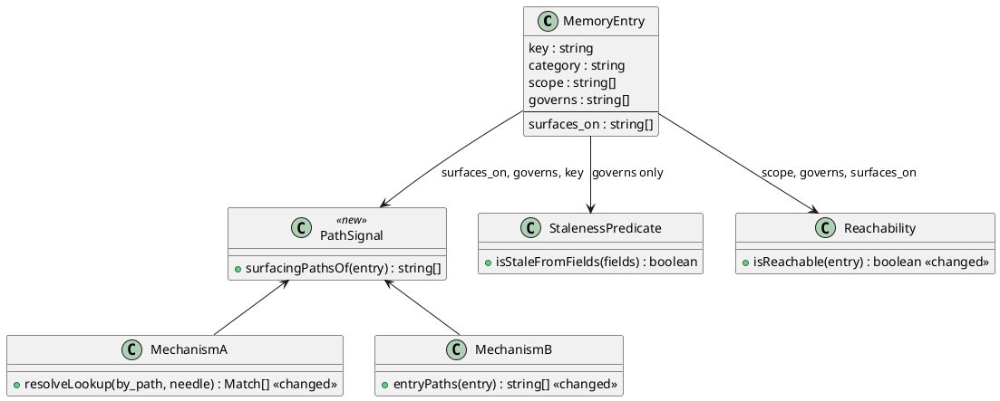
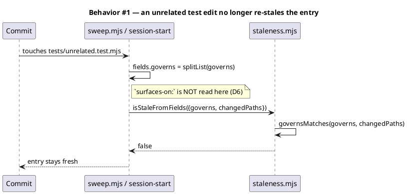
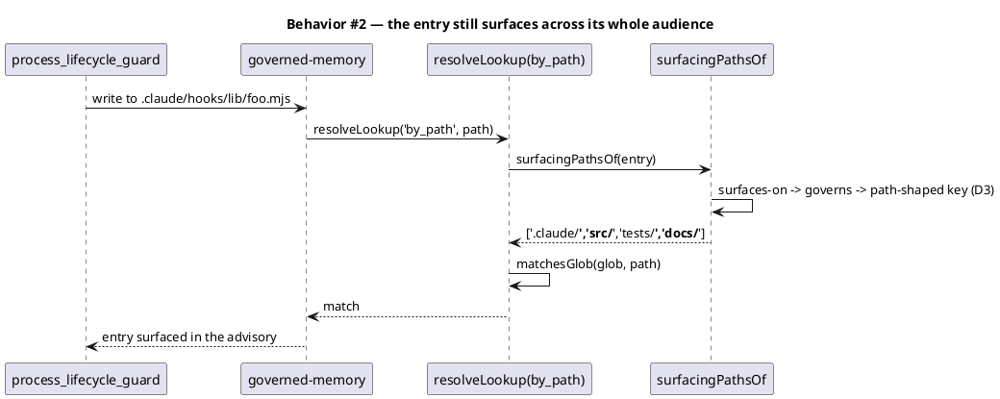
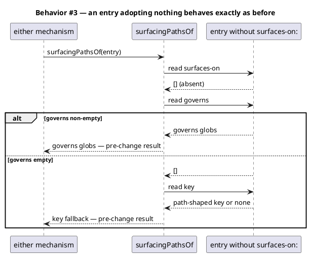
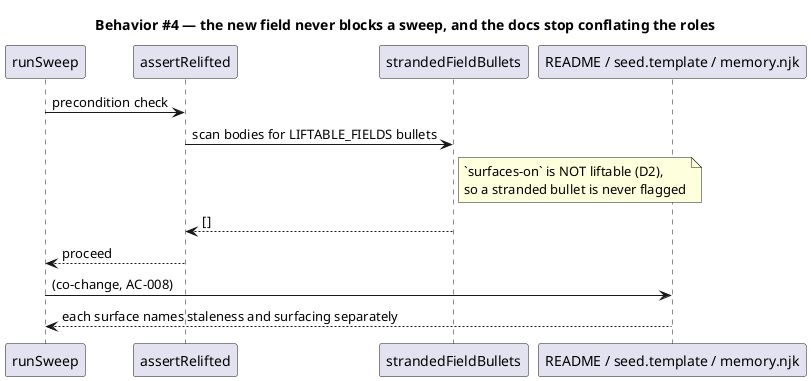
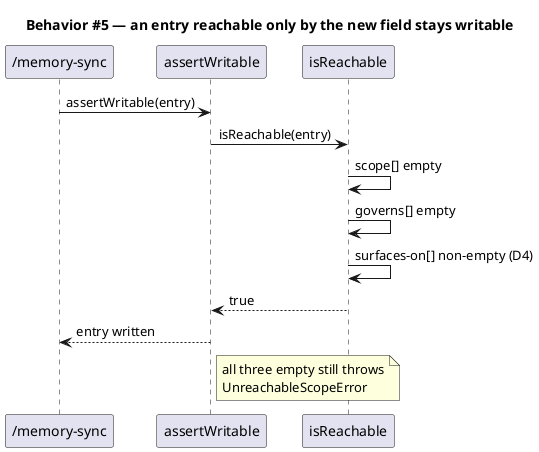
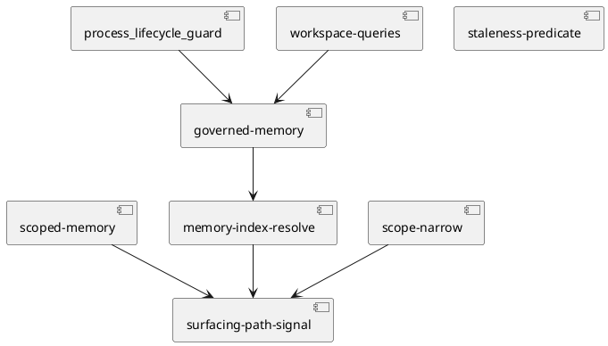

# Separate what re-verifies a memory entry from where that entry surfaces

## Context

`governs:` is read by two subsystems that want opposite things from it. Staleness treats a change under a `governs:` glob as evidence the entry's subject moved — narrow is better. Surfacing uses the same globs to decide who sees the entry — wide is better. An entry whose evidence and audience differ has no correct value.

Measured: after the narrowings already applied this cycle, 4 of the original 9 entries still re-stale on an unrelated test edit, and all four are blocked by this conflict. The full evidence, both directions it has failed in, and the reader inventory are in `docs/intake/stale-keying-and-glob-scope.md` and `docs/scout/stale-keying-and-glob-scope.md`.

**Already landed under this workflow's prior `tdd-quickfix` track, and NOT re-specified here:** the `memory-entries.mjs` splitter extraction, the `splitBlocks` whole-heading keying fix, and four `governs:` narrowings. That work is context. Writing acceptance criteria to describe code already written is rubber-stamping.

## Goal

A memory entry can be re-verified on the narrow set of files that would actually invalidate it, while still surfacing to everyone who works in the broad area it warns about.

## Non-goals

- Changing which entries exist or what any entry says. No curation.
- Changing the staleness predicate's rules — decay classes, the 30-day threshold, `STALE_EXEMPT`, `SUPERSESSION_DRIVEN`. This changes what the predicate is pointed at, never how it decides.
- Re-litigating the four narrowings already applied.
- The flat-store sub-heading limitation. A flat store has no external key list; recorded, deliberately unaddressed.
- Migrating existing entries beyond the four named in the acceptance criteria.

## Decisions

| # | Decision | Rationale | Owner |
|---|---|---|---|
| D1 | The new field is `surfaces-on:`, carrying path globs, same list syntax as `governs:` (`asList`, comma-split). | Names the question it answers — where this entry shows up. `governs:` keeps its name and its staleness meaning, so no existing entry reads differently. | engineer |
| D2 | `surfaces-on:` does **not** join `LIFTABLE_FIELDS`. | `governs:` is not in it either and works, because `toEntry` copies any `- name: value` body bullet into `entry.fields`. Adding it would make a stranded `- surfaces-on:` bullet refuse **every** sweep mode through `assertRelifted` — a new hard failure for a field whose whole contract is that absence is inert. Symmetry with `governs:` beats symmetry with README `:79`'s extension rule; the rule's tension with `governs:` predates this spec and is recorded in Open questions. | engineer |
| D3 | Precedence in `entryPaths`: `surfaces-on:` → `governs:` → path-shaped `key:`. First non-empty wins. | Most specific declaration wins. The `key:` fallback stays last and untouched — `scoped-memory.mjs:36-37` records that only 8 of 92 category-default landmarks declare `governs:`, so the other 84 are filterable through that fallback alone. | engineer |
| D4 | `isReachable` learns the new field: reachable iff `scope:` non-empty **OR** `governs:` non-empty **OR** `surfaces-on:` non-empty. | Without it, an entry whose reach lives only in `surfaces-on:` fails `assertWritable` and `/memory-sync` writes nothing — a silent data-loss path. Fail-safe: adding a disjunct can only make more entries writable, never fewer. | engineer |
| D5 | Both surfacing mechanisms resolve their path signal through **one shared helper** applying D3, rather than each reading fields itself. | Two surfacing sites reading the precedence independently is how they drift, which is the defect class this whole workflow exists to close. One definition, two callers. | engineer |
| D7 | The shared helper carries the path-shaped-`key:` fallback into **mechanism A**, which never had it. This is a deliberate widening, recorded rather than reversed. | Mechanism A fires when a governed file is edited, and a landmark keyed `<path>` is a fact *about that path* — surfacing it there is what landmarks are for. Only 8 of 92 category-default landmarks declare a path field, so the other 84 never surfaced on an edit to the file they describe. Keeping D5's single definition and closing that gap costs one census row; splitting the precedence to avoid it would re-create the two-definitions drift this workflow exists to remove. Additive: entries surface where they did not, and none stops surfacing. | engineer |
| D6 | Staleness reads `governs:` only, and never `surfaces-on:`. | This is the separation. A staleness predicate that also read the surfacing field would re-create the overload under a new name. | engineer |

## Design

@ref element:governed-memory

### Data model — class diagram

`surfaces_on` is the field this spec adds. It carries no `<<new>>` stereotype because that stereotype promises a matching DDL row, and there is no database: `MemoryEntry` is YAML frontmatter in a per-entry Markdown file. The key is optional, has no default, and is never written to disk by this change except on the four entries named in the acceptance criteria. An entry that omits it is byte-identical to today.

### Behavior — sequence per AC

### Dependencies — graph

Acyclic. `staleness-predicate` is deliberately an isolated node — it depends on nothing in this change, which is the separation D6 states.

### Contracts

| Surface | Signature | Errors | Idempotent |
|---|---|---|---|
| `surfacingPathsOf(entry)` — new, in `.claude/hooks/lib/memory-entries.mjs` | `(entry: {key, fields}) => string[]` | none — total over any entry shape; returns `[]` when no signal resolves | yes (pure) |
| `entryPaths(entry)` — changed, `scoped-memory.mjs` | unchanged signature; delegates to `surfacingPathsOf` | none | yes (pure) |
| `resolveLookup('by_path', needle, {rootDir})` — changed, `resolve.mjs` | unchanged signature; matches against `surfacingPathsOf` instead of `e.governs` | returns `[]` on unknown kind or missing input | yes |
| `isReachable(entry)` — changed, `resolve.mjs` | unchanged signature; adds the `surfaces-on:` disjunct | none | yes (pure) |
| `proposeNarrowing(entry)` — changed, `scope-narrow.mjs` | unchanged signature; proposes `governs:` only, never `surfaces-on:` | none | yes (pure) |

### Libraries and versions

None. Node stdlib only; the repo enforces empty `dependencies`.

### Alternatives considered

| # | Alternative | Rejected because |
|---|---|---|
| A | Invert — `governs:` becomes the surfacing scope, new field carries staleness | Every existing entry's `governs:` would silently change meaning for the staleness reader. Not additive. |
| B | Derive the surfacing scope from `scope:` plus the category default | `scope:` is a phase leg, not a path leg. It cannot express "any file under `.claude/**`". |
| C | Widen the stale threshold, or exempt a category | Hides genuinely rotten entries along with the churn. The source backlog entry records this trap explicitly. |
| D | Let each surfacing site read the fields itself | Two sites reading one precedence independently is the drift class this workflow exists to close (D5). |

## Program design

### Data access

Frontmatter only, through the existing readers. `resolveCategory` → `toEntry` already copies any `- name: value` bullet into `entry.fields`, so `surfaces-on:` is readable with no parser change (D2).

### Call stack

`surfacingPathsOf` is Foundation, in `.claude/hooks/lib/memory-entries.mjs` — the module this workflow already created, which both `.claude/hooks/lib/**` and `.claude/skills/**` already import from. Two Domain callers (`scoped-memory.entryPaths`, `resolve.resolveLookup`) compose it. No caller reads `entry.fields.surfaces_on` directly.

### Layout

| File | Change |
|---|---|
| `.claude/hooks/lib/memory-entries.mjs` | add `surfacingPathsOf` |
| `.claude/hooks/lib/scoped-memory.mjs` | `entryPaths` delegates |
| `.claude/skills/memory-index/resolve.mjs` | `resolveLookup` by_path matches on the signal; `indexEntries` carries `surfaces_on`; `isReachable` adds the disjunct; `assertWritable` message names the third leg |
| `.claude/skills/memory-index/scope-narrow.mjs` | `proposeNarrowing` never proposes into `surfaces-on:`; `applyNarrowing` preserves an existing `surfaces-on:` line |
| `.claude/memory/README.md` | document `surfaces-on:`, the three-leg reachability, and the precedence |
| `src/seed.template.md` | update the shipped path-governed trigger description |
| four memory entries | add `surfaces-on:`, narrow `governs:` |

## Design calls

*(none)* — the write_set does not intersect `tdd.ui_globs`. The `site-src/memory.njk` copy correction is documentation, routed through `/document` (Phase 10) and bound by AC-008.

## System delta

| Verb | Element | Anchor | Concept | Kind |
|---|---|---|---|---|
| add | surfacing-path-signal | .claude/hooks/lib/memory-entries.mjs | memory-model | c4_component |
| change | scoped-memory | .claude/hooks/lib/scoped-memory.mjs | memory-model | c4_component |
| change | memory-index-resolve | .claude/skills/memory-index/resolve.mjs | memory-model | c4_component |
| change | memory-index-helpers | .claude/skills/memory-index/*.mjs | memory-model | c4_component |

## Acceptance criteria

| ID | Criterion | Kind | Traces to | Anchor |
|---|---|---|---|---|
| AC-001 | given `landmines/grep-reports-no-match-on-utf8-files-it-calls-binary`, when a commit touches an unrelated repo-root test file, then `isStaleFromFields` returns false | behavior | intake AC-1 | §Behavior #1 |
| AC-002 | given that same entry, when a write under `.claude/**`, `src/**` or `docs/**` triggers either surfacing mechanism, then it is returned, and its four `PATH_LEG_BASELINE` contributions do not fall | behavior | intake AC-2 | §Behavior #2 |
| AC-003 | given each of the three `conventions/` entries named in the intake, when a commit touches an unrelated repo-root test file, then `isStaleFromFields` returns false and each still surfaces at every phase it reaches today | behavior | intake AC-3 | §Behavior #1 |
| AC-004 | given an entry declaring no `surfaces-on:`, when its surfacing paths are resolved and when staleness reads it, then both results are identical to the pre-change result | behavior | intake AC-4 | §Behavior #3 |
| AC-005 | given the live store, when the suite runs, then `memory-scope-store-invariants` passes with each `PATH_LEG_BASELINE` count unchanged or re-measured upward with the moving commit named beside it | behavior | intake AC-5 | §Behavior #2 |
| AC-006 | given an entry with empty `scope:` and empty `governs:` but a non-empty `surfaces-on:`, when `assertWritable` runs, then it does not throw | error-mapping | D4 | §Behavior #5 |
| AC-007 | given an entry carrying `surfaces-on:` in its frontmatter, when any sweep mode runs, then `assertRelifted` does not refuse | error-mapping | intake AC-6 | §Behavior #4 |
| AC-008 | given the shipped docs, when `.claude/memory/README.md`, `src/seed.template.md` and `site-src/memory.njk` are read, then each describes the two roles separately and none claims `governs:` decides surfacing | preflight | intake AC-6 | §Behavior #4 |
| AC-009 | given the four entries in AC-001 and AC-003, when the source backlog entry is evaluated for closure, then 0 of the original 9 re-stale on an unrelated test edit | behavior | intake AC-7 | §Behavior #1 |
| AC-010 | given a landmark whose `key:` is a repo path and which declares neither path field, when a write to that path triggers mechanism A, then the landmark surfaces — and `PATH_LEG_BASELINE` records the resulting census rise with this landing named beside it | behavior | D3/D5 | §Behavior #2 |

## Test plan

| AC | Test | Level | Fixture |
|---|---|---|---|
| AC-001, AC-003, AC-009 | `governsMatches`/`isStaleFromFields` over each entry's live `governs:` with an unrelated test path as the changed set | unit + live-store | live `.claude/memory` |
| AC-002 | `surfaceGovernedMemory` returns each entry for the paths it must reach; `PATH_LEG_BASELINE` unchanged | live-store | live store, `REPO_ROOT` |
| AC-004 | table-driven: entries with no `surfaces-on:`, asserted equal across both mechanisms and staleness before/after | unit | synthetic entries |
| AC-005 | existing `tests/memory-scope-store-invariants.test.mjs` | live-store | live store |
| AC-006 | `assertWritable` on `{scope: [], governs: [], surfaces-on: ['.claude/**']}` does not throw; empty-empty-empty still throws | unit | synthetic entry |
| AC-007 | seed a shard carrying `surfaces-on:`, run `assertRelifted` | integration | tmp store |
| AC-008 | grep the three doc surfaces for the conflated claim; assert each names both roles | static | repo files |

Mutation check for AC-004: invert the precedence in `surfacingPathsOf` and confirm the AC-004 table goes red. A back-compat assertion that cannot fail is the `a-check-that-measured-nothing-reports-success` trap.

## Observability

No runtime service. The observable signal is the test suite plus `PATH_LEG_BASELINE`, which counts mechanism-A hits per module and is re-measured by hand — the census gate's `literalPattern` matches `SYMBOL = <digits>`, never an object property.

## Rollout

### Prerequisites

| # | Prerequisite | enforced-by |
|---|---|---|
| P1 | The three documentation surfaces describe the two roles separately | AC-008 |
| P2 | The template manifest is rebuilt so the new export ships | AC-007 |

No feature flag. The change is additive at the field level: absence of `surfaces-on:` is the pre-change behaviour by construction (AC-004), which is a stronger guarantee than a flag default because it cannot be misconfigured.

## Rollback

Revert the commit. No migration runs, no state is written, and no entry's existing fields are rewritten except the four that gain a `surfaces-on:` line — those revert with the same commit. A consumer install that never adopted the field is unaffected either way.

## Archive plan

Default bundle: every `stale-keying-and-glob-scope.*` under the workflow directories. Extras: *(none)*.

## Open questions

- **README `:79`'s extension rule now has two exceptions, not one.** It states a field is liftable iff a named mechanical consumer reads it. `governs:` has such consumers and is not liftable; D2 makes `surfaces-on:` the second. Either the rule wants rewording to describe what it actually governs, or both fields want lifting — a separate decision, out of scope here, and not blocking.
- **`matchesGlob` fails closed above 12 wildcards and on a regex compile failure.** A `surfaces-on:` glob that trips either cap stops surfacing with no signal. No entry in this change comes near the cap, so nothing here is at risk, but the silent-failure mode is untested and unowned.
