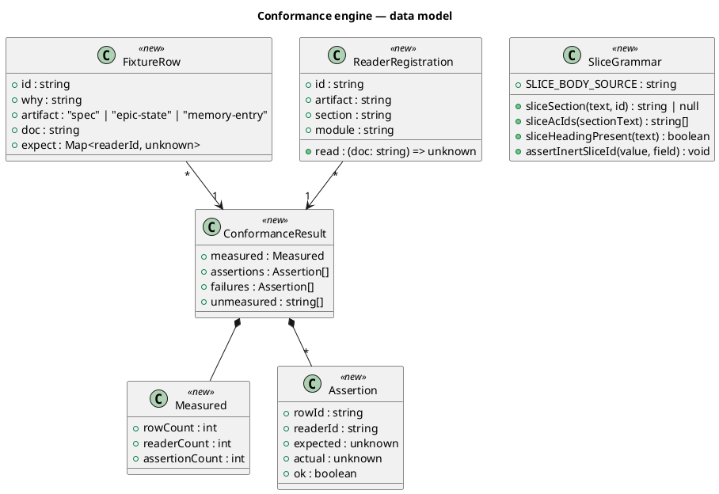
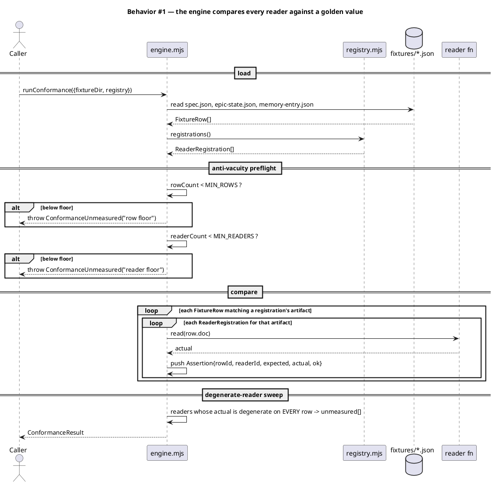
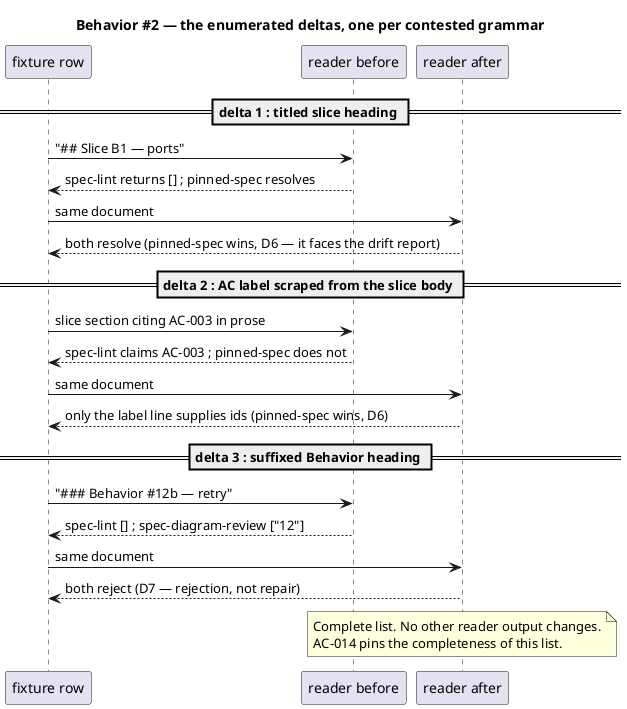
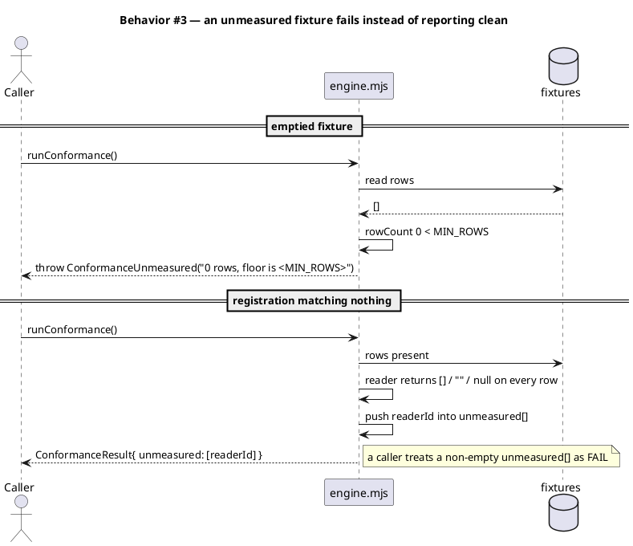
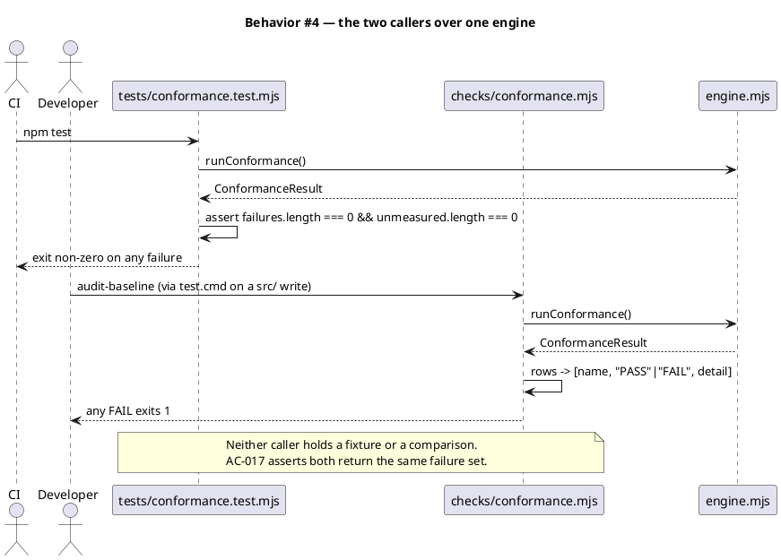
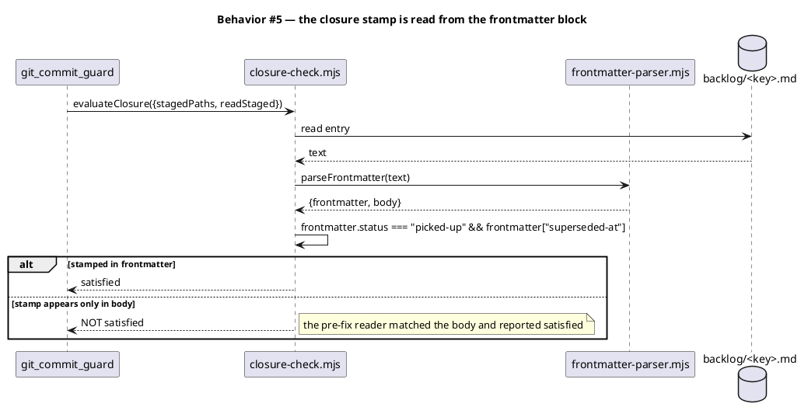
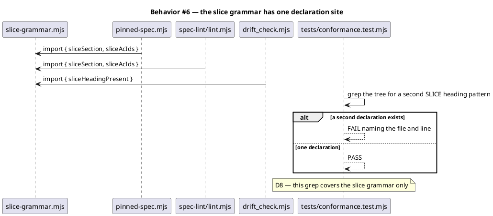
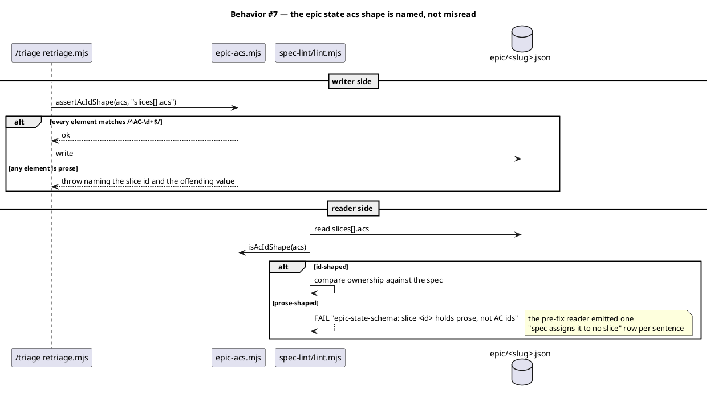
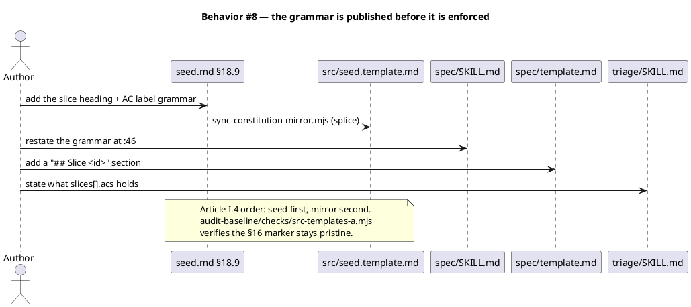
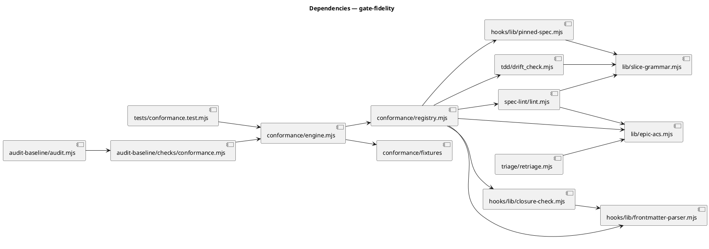

# Pin every machine gate's reader to the format its writer emits

## Context

Nine reader divergences were executed at `02f3c68` and recorded in `docs/scout/gate-fidelity.md` — six in the planning spec, three in memory-entry frontmatter — plus one schema divergence in `.claude/state/epic/*.json → slices[].acs`. Two of them ship consequences today: `spec-lint`'s two epic checks have never passed on a real epic in this repository, and `closure-check.mjs` gates a commit on a stamp it will find in an entry's prose.

`docs/research/gate-fidelity.md` recommends Candidate B — a golden-value engine with readers registered as exported function references — and rejects Candidate C, a table of patterns held inside the engine, because that table is a second declaration of every grammar it describes and would go green while the real reader drifted.

The precedent is `docs/archive/2026-08-17/unify-epic-heading-grammar/spec.md`: one grammar declared once, its D5 resolution rule (where readers disagree, the reader-facing one wins, and every resulting delta is enumerated and pinned), and its D6 non-global-regex discipline. That work removed divergence by migration and built no detector. Three consumers, zero divergences since, and nothing guarding it.

## Goal

A reader that stops agreeing with the format its writer emits fails in this repository, in CI and in the developer's write loop, instead of in a consumer's epic.

## Non-goals

- **No fix for the nine harvested backlog entries.** They are read, harvested into fixture rows, and left `status: open`. A new backlog entry parks the fix set (D1).
- **No SOP-prose-versus-code-surface check.** Rejected with reasoning in the scout report (D3).
- **No migration of the four prose-shaped epic state files.** Two of those epics are open (D4).
- **No markdown parser or AST migration.** The unit of work is one declared grammar per contested section, not a parsing framework.
- **No new hook.** The count stays 27.
- **No narrowing of any reader.** Every change widens or reports. AC-014 pins it.
- **No change to what any spec on disk means.** The three enumerated deltas in §Behavior #2 are the complete list.

## Decisions

| # | Decision | Owner | Rationale |
|---|---|---|---|
| D1 | Boundary is option (d): read the nine backlog entries, harvest a fixture row from each, build the mechanism, park the fixes | human | Verbatim: *"we can do 1st for now, read, harvest, build test, and ensure the solution is workable. Then part the fix for next cycle in backlog"*. The harvest is not optional work this cycle may drop — the fixture cannot be written without reading those entries. What moves to the next cycle is the fix and the closure stamp. |
| D2 | All three artifact types are covered: planning spec, epic state file, memory entry | human | Verbatim: *"I am thinking of adding the memory notes as well. My reasoning is that this need to ship, and if we can ship a feature complete solution in one cycle that will be good otherwise we will delay the release"*. Scout then measured that memory has a shared parser already, so the cost was smaller than the decision assumed. |
| D3 | The SOP-prose-versus-code-surface check is OUT | human | Verbatim: *"very well then let us keep it out for now"*. There is no cheap honest implementation — prose has no computed left-hand side to compare, the approximate version reproduces the defect this work closes, and the honest version needs a declared-claims format in ~59 SKILL.md files. Full reasoning in `docs/scout/gate-fidelity.md`. |
| D4 | `slices[].acs`: publish the shape, check it at the writer, cover both shapes as fixture rows. Do NOT migrate the four prose-shaped state files | human | `erp-portables` and `mvp-sprint-parallel-cycles` are open epics with unbuilt slices. Rewriting state that in-flight work reads is a risk this cycle does not need to take for an end state the writer-side check already secures going forward. |
| D5 | `closure-check.mjs` is fixed in this cycle, not deferred | human | It gates a commit and is satisfiable by an entry's body prose. The mechanism must not ship with a known-broken reader behind it. `/security` still reviews it. |
| D6 | Where readers disagree, the reader-facing one wins, and every resulting delta is enumerated and pinned individually | engineer | Adopted verbatim from `unify-epic-heading-grammar` D5. The alternative — averaging the grammars or taking the strictest — produces a rule nobody can apply to the next case. §Behavior #2 carries the enumeration. |
| D7 | `### Behavior #12b` is REJECTED by both readers, not accepted as `12` | engineer | D6 gives no answer here: both readers feed machine checks, so neither is reader-facing. Rejection is chosen because acceptance lets two headings collapse onto one id — `#12` and `#12b` both resolving to `12` means an AC row pointing at `§Behavior #12` resolves against a heading its author called something else. This matches the reject-never-repair discipline already in `plan-store`'s `assertSafeSlug`. Verified additive: all 35 `### Behavior #` headings on disk are unsuffixed, so nothing is invalidated. |
| D8 | The one-declaration-site grep covers the newly extracted slice grammar ONLY | engineer | The broad version — asserting every contested grammar has one declaration — is satisfied by no reader today, so it would ship red and reproduce `spec-lint-fixture-omits-system-delta-3f7a`, a red test nobody reads. The narrow version is enforceable on the day it lands and widens as each further grammar is extracted. |
| D9 | The grammar module goes in `.claude/skills/lib/`; the engine goes in a new `.claude/skills/conformance/` | engineer | Deviates from the research memo, which put both under `.claude/skills/lib/conformance/`. `.claude/skills/lib/` is today a clean leaf — its five modules import only node builtins and each other. The engine must import `spec-lint`, `drift_check`, `pinned-spec` and `closure-check`, which would turn that leaf into a hub. The grammar module is pure and belongs in the leaf; the harness that imports readers belongs beside them. Both paths satisfy the two binding constraints: inside `audit.mjs:109-117`'s `.claude/` allow-list, and shipped (a directory under `.claude/skills/` with no `SKILL.md` ships today — `.claude/skills/lib/` proves it). |
| D11 | The check stays strict: `erp-portables`'s AC-011 and AC-012 are reported unassigned, and intake AC-1 is amended to say so rather than the check being taught to ignore them | engineer | Found while running the regression bar. With the grammar fixed, `erp-portables` goes from 16 ACs reported unassigned to 2, and those 2 are a **true** finding — both are cross-cutting enforcement criteria ("given any epic-child commit, when `audit-baseline` runs…") that no slice section claims. `seed.md` §18.9 says every AC in an epic spec is assigned to exactly one slice, so the spec violates the published rule. Teaching the check to exempt `Kind: preflight`/`smoke` rows would make the criterion pass by weakening a check that is right — the non-goal this spec already declares. The erp-portables gap is filed as a backlog entry; its children all committed with those traps enforced in fact, so nothing shipped broken, only unrecorded. |
| D10 | The fixture is JSON, parsed by `JSON.parse` | engineer | The fixture must not be read by anything under test. Storing expected values in a document's own frontmatter would have the frontmatter readers under test parsing the fixture that tests them. `JSON.parse` is not a reader this work touches. |

## Design

@ref element:spec-lint-checks

### Data model — class diagram



No DDL: this work adds no database and no persisted schema. `slices[].acs` is an existing JSON field whose accepted shape is documented and checked at the writer, not migrated (D4).

### Behavior — sequence per AC

















### Dependencies — graph



Acyclic. `lib/slice-grammar.mjs`, `lib/epic-acs.mjs` and `hooks/lib/frontmatter-parser.mjs` are leaves importing only node builtins, which is what keeps `.claude/skills/lib/` a leaf directory (D9).

### Contracts

| Kind | Name | Input | Output | Errors | Idempotent |
|---|---|---|---|---|---|
| Function | `runConformance({fixtureDir, registry})` | `{fixtureDir: string, registry?: ReaderRegistration[]}` | `ConformanceResult` | throws `ConformanceUnmeasured` below either floor; throws on unreadable fixture dir | yes — pure over its inputs |
| Function | `registrations()` | — | `ReaderRegistration[]` | — | yes |
| Function | `loadFixture(fixtureDir)` | `string` | `FixtureRow[]` | throws on malformed JSON, on a row missing `id`/`artifact`/`doc`/`expect`, on a duplicate `id` | yes |
| Function | `sliceSection(specText, sliceId)` | `(string, string)` | `string \| null` | returns `null` on a falsy `sliceId` | yes |
| Function | `sliceAcIds(sectionText)` | `string` | `string[]` (deduped, source order) | `[]` when no label line | yes |
| Function | `sliceHeadingPresent(specText)` | `string` | `boolean` | — | yes |
| Function | `assertInertSliceId(value, field)` | `(unknown, string)` | `void` | throws on a newline or a `#` in the value | yes |
| Function | `isAcIdShape(acs)` | `unknown` | `boolean` | `false` for a non-array | yes |
| Function | `assertAcIdShape(acs, field)` | `(unknown, string)` | `void` | throws naming `field` and the first offending element | yes |
| Function | `hasClosureStamp(entryText)` | `string` | `boolean` | `false` on unparseable frontmatter | yes |
| Function | `run(ctx)` — the audit-baseline conformance check module | audit context | `[name, status, detail][]` | never throws; an engine throw becomes one `FAIL` row | yes |
| CLI | `node .claude/skills/conformance/cli.mjs` | `--json` optional | result table, or JSON | exit 1 on any failure or any unmeasured reader | yes |

### Libraries and versions

| Library@version | Purpose | Key APIs | Confirmed against current docs |
|---|---|---|---|
| *(none)* | This work adds no third-party dependency — `node:fs`, `node:path`, `node:test` only, all already in use | — | n/a |

The current-docs rule (CLAUDE.md VI.5) is an outcome mandate. No third-party API is used, so there is no API to verify; manufacturing a dependency to satisfy the rule would be the wrong outcome (seed.md §2.5).

### Alternatives considered

| Alt | Summary | Rejected because |
|---|---|---|
| A | Reader-agreement only: run every reader over each row, fail when any two disagree, write no expected value | Scout row 9 — the closure stamp read from the whole file — has exactly one reader, so agreement reports clean on the most serious finding. Scout also measured all four Acceptance-criteria readers agreeing on every real spec while both live bugs went undetected. Agreement is silent whenever readers are wrong together. |
| C | Golden-value engine holding each reader's pattern in a table instead of importing the reader | The table is a second declaration of every grammar it describes, kept in step by nothing. The engine would go green while the real regex drifted — the defect this work exists to close, rebuilt inside the mechanism meant to close it. |
| D | Fixture built from the real specs in `docs/specs/` | Measured: all readers agree on those documents while both bugs are live. A representative fixture would have passed throughout. The fixture must be adversarial. |
| E | Migrate the four prose-shaped epic state files | Two of those epics are open with unbuilt slices; rewriting state that in-flight work reads is risk the writer-side check makes unnecessary (D4). |

## Program design

### Data access

`loadFixture` reads `<fixtureDir>/{spec,epic-state,memory-entry}.json` with `readFileSync` + `JSON.parse`, validates each row's required keys, and rejects a duplicate `id` across all three files. No reader under test participates in reading the fixture (D10). Nothing is written at any point: the engine is pure over `(fixtureDir, registry)`.

### Call stack

Orchestration — `tests/conformance.test.mjs` and `checks/conformance.mjs`. Each obtains a `ConformanceResult` and renders it for its own audience; neither interprets grammar.

Domain — `conformance/engine.mjs` (floors, comparison, degenerate-reader sweep) and `conformance/registry.mjs` (which exported function reads which section of which artifact).

Foundation — `lib/slice-grammar.mjs`, `lib/epic-acs.mjs`, `hooks/lib/frontmatter-parser.mjs`, and the reader modules the registry imports.

### Layout

```
.claude/skills/lib/slice-grammar.mjs          new — one grammar, two anchors (epic-heading shape)
.claude/skills/lib/epic-acs.mjs               new — slices[].acs shape predicate + assert
.claude/skills/conformance/engine.mjs         new — runConformance, floors, sweep
.claude/skills/conformance/registry.mjs       new — reader registrations
.claude/skills/conformance/cli.mjs            new — front door
.claude/skills/conformance/fixtures/spec.json           new — adversarial rows
.claude/skills/conformance/fixtures/epic-state.json     new
.claude/skills/conformance/fixtures/memory-entry.json   new
.claude/skills/audit-baseline/checks/conformance.mjs    new — shipped caller
.claude/skills/audit-baseline/audit.mjs                 changed — import + register the check
.claude/hooks/lib/pinned-spec.mjs             changed — import the shared slice grammar
.claude/hooks/lib/closure-check.mjs           changed — read the frontmatter block (D5)
.claude/skills/spec-lint/lint.mjs             changed — shared slice grammar; anchor two section regexes; epic-state schema row; export the readers the registry needs
.claude/skills/tdd/drift_check.mjs            changed — shared slice grammar; export AC_ROW_RE
.claude/skills/spec-diagram-review/oracle.mjs changed — reject a suffixed Behavior heading (D7)
.claude/skills/triage/retriage.mjs            changed — assertAcIdShape at the write
docs/init/seed.md                             changed — §18.9 publishes the grammar
src/seed.template.md                          changed — mirror (splice)
.claude/skills/spec/SKILL.md                  changed — :46 restates the grammar
.claude/skills/spec/template.md               changed — ships a "## Slice <id>" section
.claude/skills/triage/SKILL.md                changed — says what slices[].acs holds
tests/conformance.test.mjs                    new — repo-root, ungated
tests/slice-grammar.test.mjs                  new — grammar + one-declaration grep (D8)
tests/closure-check-frontmatter.test.mjs      new — regression for D5
tests/spec-lint-slice-ownership.test.mjs      new — pins the AC-claim change scout warned about
```

## Design calls

- *(none)*

This work touches no file under `project.json → tdd.ui_globs`.

## System delta

| Verb | Element | Anchor | Concept | Kind |
|---|---|---|---|---|
| add | conformance-engine | `.claude/skills/conformance/*.mjs` | review-fanout | c4_component |
| add | slice-grammar-lib | `.claude/skills/lib/slice-grammar.mjs` | workflow-tracks | c4_component |
| add | epic-acs-lib | `.claude/skills/lib/epic-acs.mjs` | workflow-tracks | c4_component |
| change | audit-baseline-checks | `.claude/skills/audit-baseline/checks/*.mjs` | review-fanout | c4_component |
| change | spec-lint-checks | `.claude/skills/spec-lint/lint.mjs` | review-fanout | c4_component |
| change | pinned-spec-lib | `.claude/hooks/lib/pinned-spec.mjs` | workflow-tracks | c4_component |
| change | closure-check-lib | `.claude/hooks/lib/closure-check.mjs` | memory-model | c4_component |

## Acceptance criteria

| ID | Criterion (given / when / then) | Kind | Upstream AC | Sequence |
|---|---|---|---|---|
| AC-001 | given the three epic specs in `docs/specs/`, whose slice headings carry titles, when `spec-lint` runs `epic_slice_assignment` with `track_id: epic`, then no AC is reported unassigned because its slice heading failed to resolve; two of `erp-portables`'s 16 ACs remain reported, and that report is true (D11) | behavior | intake AC-1 | §Behavior #2 |
| AC-002 | given each of the three epic specs in `docs/specs/` with its state file present, when `epic_state_consistency` runs, then it reports PASS or a named schema failure, never a per-AC list claiming the spec assigns the AC to no slice | behavior | intake AC-2 | §Behavior #7 |
| AC-003 | given any epic spec on disk, when the slice reader in `spec-lint` and the slice reader in `pinned-spec.mjs` are both applied, then they return the same slice ids and the same AC id set per slice | behavior | intake AC-3 | §Behavior #6 |
| AC-004 | given `## Slice B1` and `## Slice B1 — ports and the server composition root`, when either reader resolves the section, then both forms yield the same body | behavior | intake AC-4 | §Behavior #2 |
| AC-005 | given `- **ACs**: AC-001, AC-002` and `**Acceptance criteria**: AC-001, AC-002`, when either reader parses it, then both yield the same id set | behavior | intake AC-5 | §Behavior #2 |
| AC-006 | given a spec containing `## Slice B10`, when either reader resolves `B1`, then it returns only the `B1` section | behavior | intake AC-6 | §Behavior #6 |
| AC-007 | given an epic state file whose `slices[].acs` holds criterion prose, when `epic_state_consistency` runs, then it names the schema violation and the offending slice id | behavior | intake AC-7 | §Behavior #7 |
| AC-008 | given the grammar published in `seed.md` §18.9 and `spec/SKILL.md`, and the slice section shipped in `spec/template.md`, when a test parses that template section with both readers, then both resolve it and agree on its AC ids | behavior | intake AC-8 | §Behavior #8 |
| AC-009 | given a spec whose Non-goals section contains the literal `` `## Acceptance criteria` ``, when a section extractor reads the Acceptance-criteria section, then it returns the real table's rows | behavior | intake AC-9 | §Behavior #2 |
| AC-010 | given the fixture, when two registered readers of one section return different results for a row, then the check fails naming both readers, the row, and how they differ | behavior | intake AC-10 | §Behavior #1 |
| AC-011 | given the tree at `02f3c68`, when the conformance check runs against it, then it fails naming `spec-lint/lint.mjs` and `pinned-spec.mjs` as disagreeing readers | behavior | intake AC-11 | §Behavior #1 |
| AC-012 | given an emptied fixture, or a registration returning a degenerate value on every row, when the check runs, then it fails with an unmeasured error rather than reporting clean | preflight | intake AC-12 | §Behavior #3 |
| AC-013 | given a reader narrowed so it no longer parses the fixture, when `audit-baseline` runs, then it exits non-zero naming that reader | preflight | intake AC-13 | §Behavior #4 |
| AC-014 | given a consumer install, when it contains an epic spec in any form this repository's specs already use, then no check changed here reports a failure `02f3c68` did not already report; the deltas in §Behavior #2 are the complete list of output changes | behavior | intake AC-14 | §Behavior #2 |
| AC-015 | given a registered reader that no longer agrees with the fixture, when `npm test` runs, then it fails naming that reader, so CI blocks the release | smoke | intake AC-15 | §Behavior #4 |
| AC-016 | given a consumer install, when `audit-baseline` runs, then the check executes from the shipped engine with no dependency on any path under `tests/`, `src/`, `scripts/` or `obj/` | behavior | intake AC-16 | §Behavior #4 |
| AC-017 | given both callers over the same fixture, when each runs, then they report the same set of disagreements, and neither carries its own fixture or comparison | behavior | intake AC-17 | §Behavior #4 |
| AC-018 | given a backlog entry whose frontmatter reads `status: open` and whose body quotes `status: picked-up` and `superseded-at:`, when the closure check evaluates it, then it reports the obligation unsatisfied | behavior | human decision 2026-09-03 (D5) — not an intake AC | §Behavior #5 |
| AC-019 | given a `slices[].acs` array containing a non-`AC-NNN` element, when `retriage.mjs` writes the epic state, then it throws naming the field and the offending value | behavior | human decision 2026-09-03 (D4) — not an intake AC | §Behavior #7 |
| AC-020 | given the shipped `.claude/skills/lib/slice-grammar.mjs`, when a second declaration of the slice heading pattern exists anywhere in the tree, then a repo-root test fails naming its file and line | behavior | D8 (engineer) | §Behavior #6 |

## Test plan

| Category | Scenario | Expected | Covers |
|---|---|---|---|
| Conformance | Nine harvested fixture rows, each read by every registered reader for its artifact | every reader matches its golden value | AC-004, AC-005, AC-006, AC-009, AC-010 |
| Conformance | Emptied fixture file | `ConformanceUnmeasured` thrown, naming the floor | AC-012 |
| Conformance | Registration whose reader returns `[]` on every row | reader appears in `unmeasured[]`; caller reports FAIL | AC-012 |
| Conformance | Both callers over the same fixture | identical failure sets; neither module contains a fixture path or a comparison | AC-017 |
| Conformance | Registry pointed at readers as they stood at `02f3c68` | fails, naming `spec-lint/lint.mjs` and `pinned-spec.mjs` | AC-011 |
| Grammar | Titled, bare, and `B1`-against-`B10` slice headings through `sliceSection` | identical bodies; no cross-match | AC-004, AC-006 |
| Grammar | Both AC-label forms through `sliceAcIds` | identical id sets | AC-005 |
| Grammar | Tree-wide grep for a second slice heading declaration | one declaration site | AC-020 |
| Grammar | `assertInertSliceId` called six consecutive times with a forged value | rejects 6 of 6 (D6 non-global discipline) | AC-020 |
| Live check | `spec-lint` `epic_slice_assignment` + `epic_state_consistency` against all three specs in `docs/specs/` | PASS, or a named schema failure for a prose-shaped state file | AC-001, AC-002, AC-007 |
| Live check | `spec-lint` slice ownership before and after the shared grammar | the AC-claim change scout warned about is pinned, not incidental | AC-003, AC-014 |
| Section anchor | Spec whose Non-goals bullet quotes `` `## Acceptance criteria` `` | the real table's ids from every reader | AC-009 |
| Behavior heading | `### Behavior #12b` through both readers | both reject (D7) | AC-014 |
| Regression | Every spec in `docs/specs/` and `docs/archive/` through every changed reader, before and after | output identical except the three §Behavior #2 deltas | AC-014 |
| Closure | Entry with the stamp in the body only | unsatisfied | AC-018 |
| Closure | Entry with the stamp in the frontmatter | satisfied | AC-018 |
| Schema | `retriage.mjs` writing prose-shaped `acs` | throws naming the field | AC-019 |
| Docs | The slice section shipped in `spec/template.md` parsed by both readers | resolves; ids agree | AC-008 |
| Wiring | `audit.mjs` imports the check; `tests/conformance.test.mjs` exists and carries no env gate | both assertions pass | AC-013, AC-015, AC-016 |

## Observability

The engine is a check, not a service. Its observable surface is its three outputs: `npm test`, `audit-baseline`'s row table, and `node .claude/skills/conformance/cli.mjs`. A failure names the row id, the reader id, the expected value and the actual one — enough to act without opening the engine.

`audit-baseline`'s full-run time is the one number worth watching: 0.31s at `02f3c68`, because the check joins a run that fires on every write under `src/**`, `scripts/**` and `bin/**`.

## Rollout

### Prerequisites

| # | Prerequisite | enforced-by |
|---|---|---|
| 1 | The fixture is non-empty and every registration reads something, so the check cannot report clean while measuring nothing | AC-012 |
| 2 | `audit-baseline` executes the check and exits non-zero on a narrowed reader, in this repo and in a consumer install | AC-013 |
| 3 | `npm test` fails on a disagreeing reader, so CI blocks the release before publish | AC-015 |

- **Feature flag**: none. A check that ships behind a flag defaulted off is a check nobody runs, which is the failure `claude-skills-lib-tests-is-executed-by-nothing` records.
- **Migration order**: 1 publish the grammar in `seed.md` §18.9 and sync the mirror → 2 extract `slice-grammar.mjs` and repoint its three readers → 3 anchor the two section regexes and fix `closure-check.mjs` → 4 add the engine, fixture and registry → 5 wire both callers → 6 update `spec/SKILL.md`, `spec/template.md`, `triage/SKILL.md`. Article I.4 requires step 1 first; steps 2-3 must precede step 4 or the check ships red.
- **Canary**: none applicable — this ships as part of the baseline, not as a running service.

## Rollback

- **Kill-switch**: revert the commit. The engine holds no state, writes nothing, and no other module's behavior depends on it existing. Reverting restores `02f3c68` reader behavior exactly.
- **Signal to roll back**: `audit-baseline` reporting FAIL on a tree where `npm test` passes, or a consumer reporting a check failure on a spec that `02f3c68` accepted. Either contradicts AC-014 and trips on the first run after install, well inside five minutes.

## Archive plan

- Defaults *(automatic)*: intake, scout, research, spec, spec-rendered/, spec approval, security report.
- Extras *(list any non-default files)*:
  - *(none)* — the fixture and engine are production files under `.claude/`, not workflow artifacts.

## Open questions

- *(none)*. The three intake questions were resolved before gate A; the two forks research surfaced were put to the human on 2026-09-03 and are recorded as D4 and D5; the two engineer-owned calls are D7 and D8.
