# Spec — codebugger: a witnessed explanation trace and the debug track

## Context

| Input | Path |
|---|---|
| Intake | `docs/intake/codebugger-explanation-trace.md` |
| BRD *(if any)* | *(none)* |
| Scout *(if any)* | `docs/scout/codebugger-explanation-trace.md` |
| Research *(if any)* | `docs/research/codebugger-explanation-trace.md` |
| Epic state | `.claude/state/epic/codebugger-explanation-trace.json` |

**Write set**: `docs/init/seed.md`, `src/seed.template.md`, `.mcp.json`, `src/.mcp.template.json`, `.claude/skills/codebugger/**`, `.claude/skills/audit-baseline/*.mjs`, `.claude/skills/triage/**`, `.claude/skills/tdd/drift_check.mjs`, `.claude/skills/archive/archive.sh`, `.claude/hooks/lib/memory_stop.mjs`, `.claude/hooks/process_lifecycle_guard.mjs`, `.claude/workflows.jsonl`, `src/.claude/workflows.template.jsonl`, `.claude/project.json`, `src/project.template.json`, `site-src/mcp.njk`, `site-src/skills.njk`, `site-src/workflows.njk`, `site-src/_data/mcpnotes.json`, `README.md`, `CLAUDE.md`, `src/CLAUDE.template.md`, `.claude/CONSTITUTION.md`, `tests/**`.

The set reaches `site-src/**`, `.mcp.json`, and the repo-root governance files, all outside `artifacts.diagram_profiles → non-architectural`, so the **full** C4 set applies. It also intersects `tdd.ui_globs` (`site-src/**`, `**/*.njk`), so `## Design calls` carries rows.

## Goal

A maintainer accepts or rejects a diagnosis by reading its causal chain, because every causal claim in that chain cites a value observed in the running program.

## Non-goals

- Not an autonomous fixer. The session diagnoses and stops; `/tdd` writes the fix and `/integrate` proves it.
- Not a replacement for `/rca` (postmortem on a past incident) or `tdd-quickfix` (known cause, known failing test).
- No new consent gate, no new command. Commands stay at 6.
- No new hook, no new subagent. Hooks stay at 26, subagents at 1.
- No debugger UI. The reviewable object is a markdown file.
- No new Article in `CLAUDE.md`. See Decision D1.
- Not a commitment to every language `mcp-debugger` supports.

## Decisions

Recorded per CLAUDE.md XI.12 — decided in main context, reviewed at gate A rather than asked.

**D1 — The runtime-witness rule lives in `seed.md` §2.7 only. `CLAUDE.md` gains no Article.**
`owner: engineer`. Measured: `CLAUDE.md` is 27,994 characters against the 28,000 advisory target pinned at `tests/warm-context-diet.test.mjs:25,222` — six characters of headroom — and `:30,252-257` pins the Article VI slice to sha256 `f0db0f6aa06360eb4b9914ef8f6f62955d2b8d02360b05222e8caff9b0b06a02` with the message "Article VI changed — the non-negotiable engineering rules ship byte-identical". Raising the target was offered and declined: `.claude/memory/decisions/claude-md-headroom-target-28000-chars-5a04.md` carries `source: user-instruction` and the engineer's verbatim, which is canonical under Article IX.6:

> Cut into binding rules to hit 28,000

Precedent for the placement: the context7 decision landed `read-before-overwrite` in `conventions.md` rather than a `CLAUDE.md` clause under the same size pressure. Accepted cost, stated plainly: a rule outside `CLAUDE.md` is not warm in session, so `evidence.mjs` and the SKILL.md carry the enforcement rather than Claude's loaded context. Consequence: `CLAUDE.md` Article IV also does not name the `debug` track — track routing lives in `triage/SKILL.md`, `workflows.jsonl`, and `seed.md` §18.

**D2 — An observed value is recorded as a bounded typed rendering, never a raw dump.**
`owner: engineer`. The `mcp-debugger` README asserts secrets are masked before reaching the agent. That could not be verified: the only redaction in reachable documentation is `docs/logging-format-specification.md`, which describes the log path (values truncated to 200 chars, at most 10 variables per entry, environment values replaced with a count summary, sensitive keys scrubbed by pattern). Rather than commit raw program memory to git history in an overlay that installs into other people's repositories, the `Observed` cell records type, length, boundary comparison, or an explicit redaction marker — `undefined`, `array, length 0`, `string, 44 chars, starts 'sk-'`. This is also the better evidence: the claim a root cause turns on is a type, a boundary, or an absence, and a raw dump buries it.

**D3 — `evidence.mjs` ships beside the skill and imports `isCitable`; the predicate is widened, the registry is not.**
`owner: claude`. The repo already has a witness rule (`.claude/skills/workspace/witness.mjs`, gate-A approved 2026-08-06) binding a durable diagram to what falsifies it — `anchor-digest | test | none` — with `isCitable:44` returning true for the first two, and a companion decision establishing that an unwitnessed artifact is permitted but non-citable. Restating that predicate would give the baseline two definitions of evidence.

The import was executed rather than assumed, and the result changed the decision. `witness.mjs` exports exactly `bindingFor` and `isCitable`; importing it standalone works and costs nothing — but `isCitable('runtime-read')` returns **false**, because the predicate enumerates the two diagram witnesses and nothing else. So importing it unchanged does not give the trace a citability rule; it gives the trace a rule that refuses every row.

The resolution splits the module in two, along the seam Alternative A actually failed on. **The registry stays untouched** — `readWitnesses` reads `memory.architecture_map.witnesses`, so extending *that* is what would make root-cause citability depend on whether the architecture map is enabled. **The predicate is widened** by one string: `isCitable` also returns true for `runtime-read`. That is safe by construction — both existing callers (`workspace/graph.mjs:40`, `workspace/reconcile.mjs:142`) pass a value produced by `bindingFor`, which can only return a registry value or `none`, so it can never produce `runtime-read` and no diagram's citability changes.

Wire values are hyphenated to match the existing vocabulary: `runtime-read`, `instrumentation`, `none`. `instrumentation` is deliberately **not** citable — it is the labeled lower-confidence tier of AC-011, which is exactly the "permitted but non-citable" treatment the 2026-08-06 narrowing established.

**D4 — `autoApprove` is not adopted.** `owner: claude`. The upstream config examples list `autoApprove: ["create_debug_session","set_breakpoint","get_variables"]`. No baseline MCP server carries a client-side pre-approval key, and pre-approving tool calls sits badly beside a constitution built on typed consent.

## Design

Diagrams are the contract. Prose is only for things a diagram cannot say.

### C4 — System context

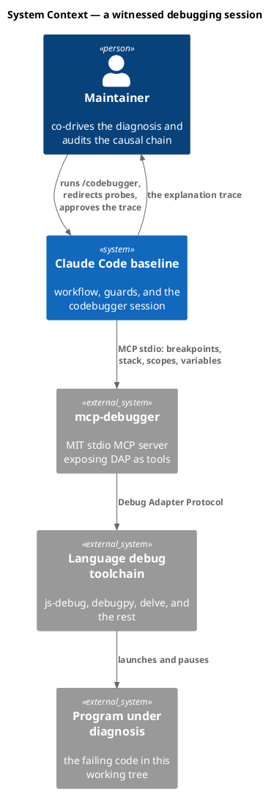

### C4 — Container

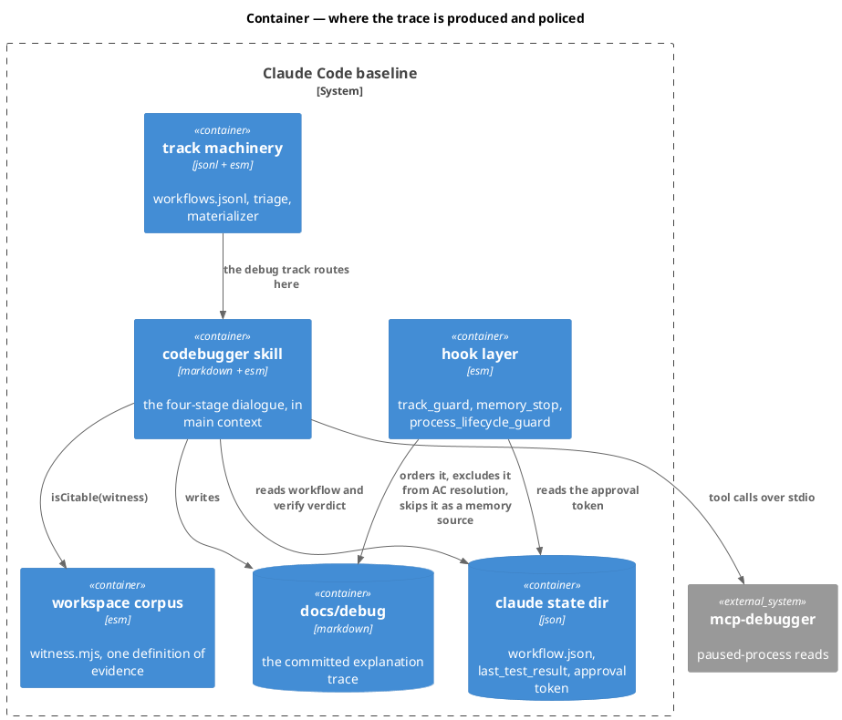

### C4 — Component (the codebugger session)

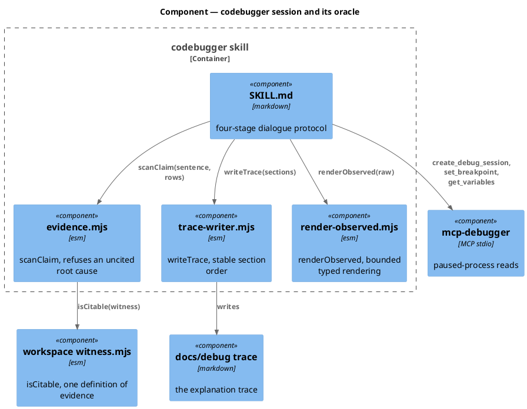

### Data model — class diagram

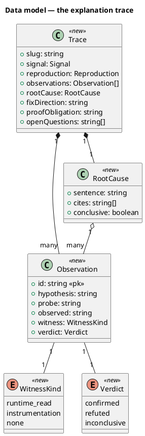

#### Migration DDL

*(none — the trace is a markdown file. No database, no schema, no migration.)*

### Behavior — sequence per AC

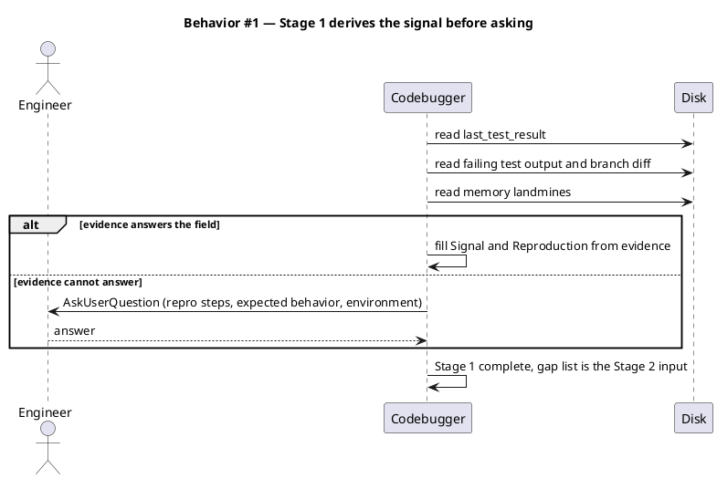

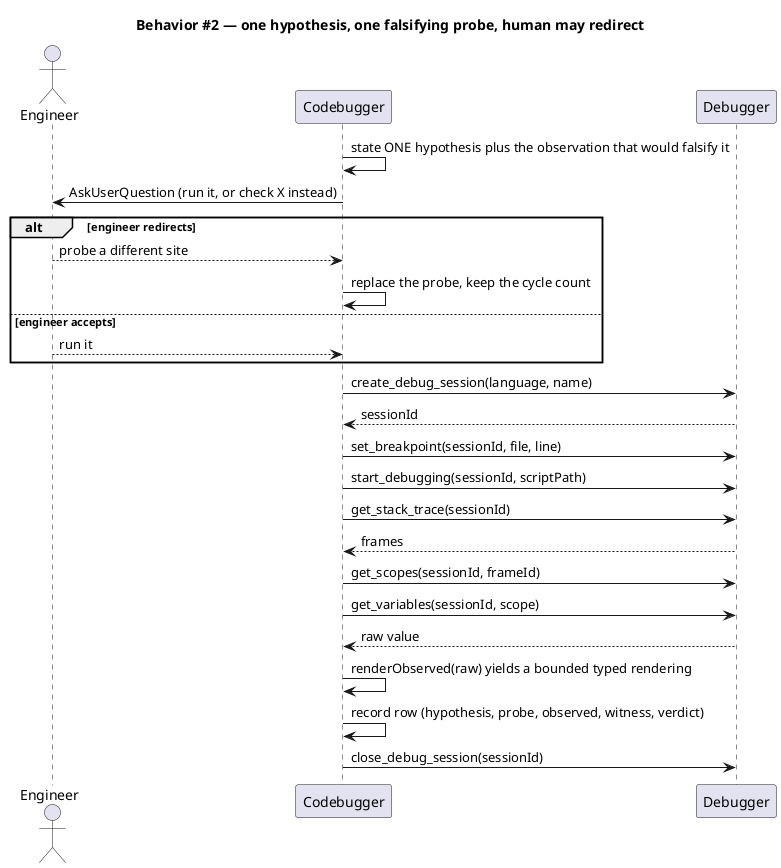

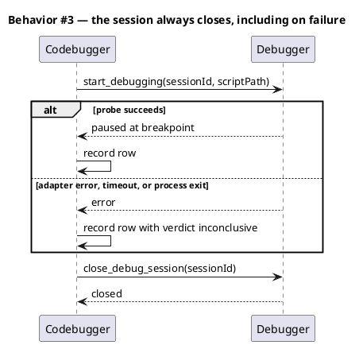

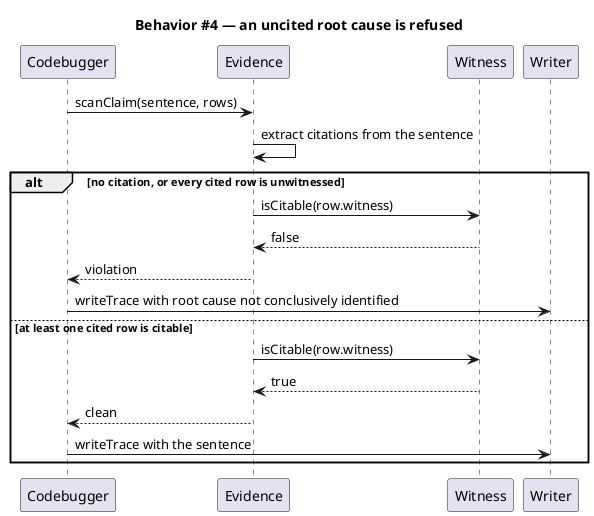

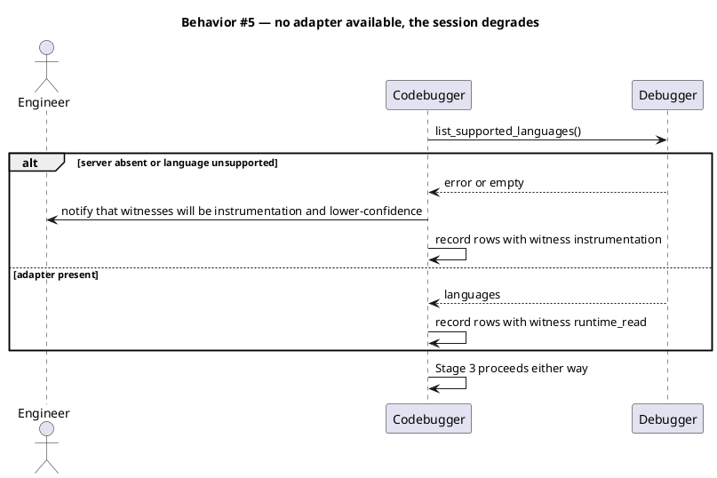

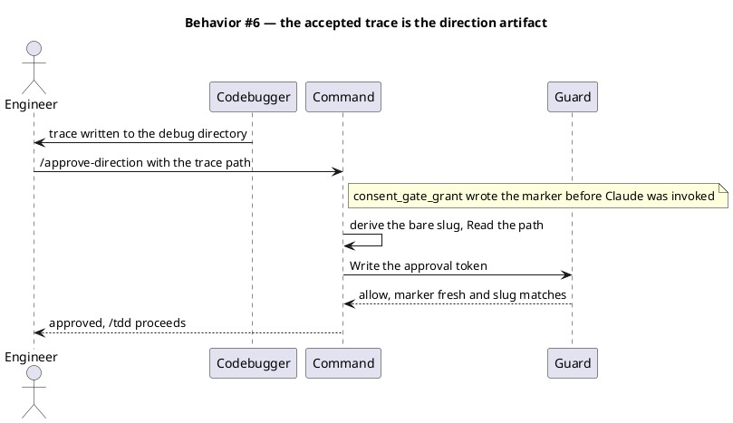

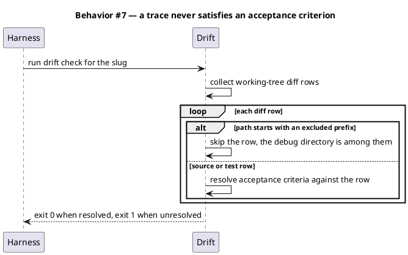

### State — core entity

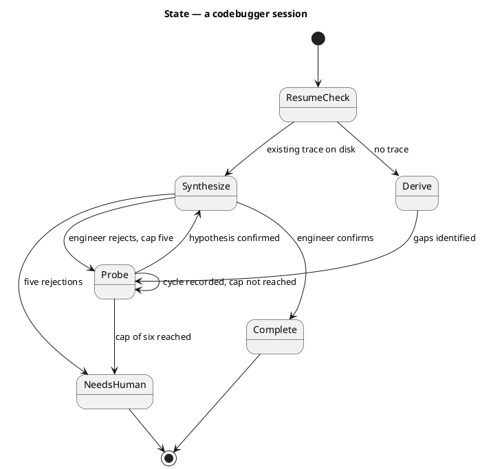

### Dependencies — graph

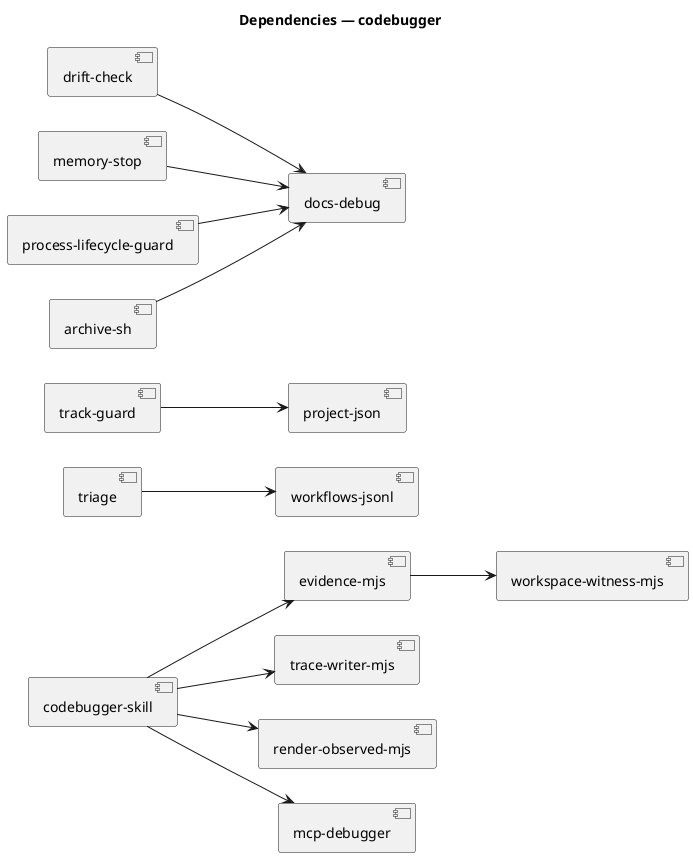

The graph is acyclic. `evidence-mjs → workspace-witness-mjs` is the only cross-skill edge and it is one-way: `workspace/` does not know `codebugger/` exists.

### Contracts

| Kind | Name | Input | Output | Errors | Idempotent |
|---|---|---|---|---|---|
| ESM | `evidence.mjs → scanClaim` | `(sentence: string, rows: Observation[])` | `{violations: string[], citable: string[]}` | none — pure | yes |
| ESM | `trace-writer.mjs → writeTrace` | `({outPath, slug, sections})` | `Promise<string>` — the path written | rejects on unwritable path | yes — same input, same bytes |
| ESM | `render-observed.mjs → renderObserved` | `(raw: unknown, {maxChars = 64})` | `string` — bounded typed rendering | none — never throws; an unknown shape renders `unrenderable` | yes |
| ESM | `workspace/witness.mjs → isCitable` | `(witness: string)` | `boolean` — true for `anchor-digest`, `test`, and (new) `runtime-read`; false for `instrumentation` and `none` | none — pure | yes |
| MCP | `create_debug_session` | `language`, `name` | `sessionId` | adapter absent, language unsupported | no |
| MCP | `set_breakpoint` | `sessionId`, `file`, `line` | breakpoint; verification may be late | bad session, unresolvable path | yes |
| MCP | `start_debugging` | `sessionId`, `scriptPath` | paused state | script missing, toolchain absent | no |
| MCP | `get_stack_trace` | `sessionId` | frames | not paused | yes |
| MCP | `get_scopes` | `sessionId`, `frameId` | scopes | stale frameId | yes |
| MCP | `get_variables` | `sessionId`, `scope` | variables | stale scope reference | yes |
| MCP | `evaluate_expression` | `sessionId`, expression context | value | not paused, bad expression | no |
| MCP | `get_output` | `sessionId` | captured stdout and stderr | bad session | yes |
| MCP | `list_supported_languages` | none | languages | server absent | yes |
| MCP | `close_debug_session` | `sessionId` | closed | already closed | yes |

### Libraries and versions

| Library@version | Purpose | Key APIs | Confirmed against current docs |
|---|---|---|---|
| `@debugmcp/mcp-debugger@0.23.0` | paused-process reads that witness a hypothesis | `create_debug_session`, `set_breakpoint`, `start_debugging`, `get_stack_trace`, `get_scopes`, `get_variables`, `evaluate_expression`, `get_output`, `list_supported_languages`, `close_debug_session` | yes — registry.npmjs.org for name, version, `engines`, `bin`, `dependencies`; context7 `/debugmcp/mcp-debugger` for the stdio invocation form |

Registry facts as read: `license: MIT`, `engines: {"node":">=22.0.0"}`, `bin: {"mcp-debugger":"dist/cli"}`, `dependencies: {}`. The `stdio` positional is required — "to prevent console corruption of JSON-RPC protocol".

### Alternatives considered

| Alt | Summary | Rejected because |
|---|---|---|
| A | Extend `workspace/witness.mjs`'s **registry** with a runtime-read kind | `readWitnesses` reads `memory.architecture_map.witnesses`, so root-cause citability would depend on whether the architecture map is enabled. D3 widens the **predicate** instead, which carries no config gate |
| B | A fully independent scanner restating the witness names | Two definitions of evidence in one baseline; the day one is amended and the other is not, the repo says two different things |
| C | A read-only checker in the `spec-rollout-enforceability-review` mould | Enforces after writing rather than at composition time, and attaches to a fan-out that only runs on tracks with a spec |
| P1 | Commit raw observed values like intake and scout | Agent-path redaction is unverified; commits program memory to permanent history in an overlay shipped to other repositories |
| P2 | Gitignored rows, committed summary | A reviewer on another machine cannot see the rows the root cause cites — it breaks the property the feature exists to create |
| VI.8 | A new `CLAUDE.md` Article | Six characters of headroom and a sha256-pinned Article VI; the engineer's recorded instruction forbids raising the target |

## Program design

### Data access

| Reader | Source | Access path | Written by |
|---|---|---|---|
| `codebugger/SKILL.md` | `.claude/state/last_test_result` | `readFileSync` | `/integrate`, `/verify` |
| `codebugger/SKILL.md` | `.claude/state/workflow.json` | `readFileSync` | `/triage`, `/harness` |
| `codebugger/evidence.mjs` | in-memory rows | in-process call | the session |
| `codebugger/trace-writer.mjs` | — | `writeFile` | the one writer of `docs/debug/<slug>.md` |
| `track_guard.mjs` | `project.json → workflow.artifacts` | `projectGet` | maintainer, by hand |
| `drift_check.mjs` | working-tree diff | `git diff` | — read-only |
| `archive.sh` | `docs/debug/$SLUG.md` | `mv` into the bundle | `trace-writer.mjs` |

`docs/debug/<slug>.md` has exactly one writer: `trace-writer.mjs`. `/archive` moves it; nothing else edits it.

### Call stack

```
Skill(codebugger)
  ├─ Stage 0  skip-check                     codebugger/SKILL.md
  ├─ Stage 1  derive signal from disk        .claude/state/last_test_result, git diff
  ├─ Stage 2  probe loop (cap 6)
  │    ├─ AskUserQuestion                    main context
  │    ├─ mcp-debugger tool calls            MCP stdio boundary
  │    └─ renderObserved(raw)                codebugger/render-observed.mjs
  ├─ Stage 3  scanClaim(sentence, rows)      codebugger/evidence.mjs
  │    └─ isCitable(witness)                 workspace/witness.mjs
  └─ writeTrace(sections)                    codebugger/trace-writer.mjs → docs/debug/<slug>.md
```

### Layout

```
.claude/skills/codebugger/
  SKILL.md                  new  — owner: baseline, Character block, four stages
  template.md               new  — the seven trace headings
  evidence.mjs              new  — scanClaim
  trace-writer.mjs          new  — writeTrace
  render-observed.mjs       new  — renderObserved
  references/
    probe-protocol.md       new  — Stage 2 discipline, per-language notes
.claude/hooks/lib/memory_stop.mjs          changed  — SKIP_PREFIXES gains the debug directory
.claude/hooks/process_lifecycle_guard.mjs  changed  — PHASE_BY_PREFIX maps it to codebugger
.claude/skills/tdd/drift_check.mjs         changed  — EXCLUDED_DIFF_PREFIXES gains it
.claude/skills/archive/archive.sh          changed  — PAIRS gains a debug.md row
.claude/workflows.jsonl                    changed  — the debug track record
src/.claude/workflows.template.jsonl       changed  — the same record, pristine source
.claude/project.json                       changed  — workflow.phases and workflow.artifacts
.mcp.json                                  changed  — the mcp-debugger declaration
docs/init/seed.md                          changed  — 2.7 new, 4.1 amended, 4.5 4 to 5, 4.3 58 to 59, 18 9 to 10
CLAUDE.md                                  changed  — count digits only; Article VI byte-identical
```

## Design calls

The write set touches `site-src/mcp.njk`, `site-src/skills.njk`, and `site-src/workflows.njk`, which fall inside `tdd.ui_globs`. These are **count-string edits on three existing reference pages**, not new surfaces, so each design call is a no-regression bar against the page as it renders today.

| Slug | Intent | Target files | Write set | Register | Reference target | Quality criteria |
|---|---|---|---|---|---|---|
| mcp-page-count | move the MCP reference page from four servers to five without changing its design | `site-src/mcp.njk` | `site-src/mcp.njk`, `site-src/_data/mcpnotes.json` | inherit | the rendered `obj/site/mcp/index.html`, captured before the edit | server-card grid renders 5 cards at 360/768/1280 with no horizontal overflow; heading and lead read as one sentence with the new number; text contrast at or above WCAG AA; no CLS above 0.1; the new card body length is within 30% of the four existing cards |
| skills-page-count | move the skills reference page from 58 to 59 | `site-src/skills.njk` | `site-src/skills.njk` | inherit | the rendered `obj/site/skills/index.html`, captured before the edit | the altTracks category count and its listed entries agree exactly; the heading word form matches the numeral fact; renders at 360/768/1280; text contrast at or above WCAG AA; no CLS above 0.1 |
| workflows-page-count | move the tracks reference page from nine selectable to ten | `site-src/workflows.njk` | `site-src/workflows.njk` | inherit | the rendered `obj/site/workflows/index.html`, captured before the edit | the debug track id appears in the rendered page, which `checks/docsite-drift.mjs` asserts; title, heading, lead and the selectable fact all read ten; renders at 360/768/1280; text contrast at or above WCAG AA |

## System delta

| Verb | Element | Anchor | Concept | Kind |
|---|---|---|---|---|
| add | codebugger-helpers | `.claude/skills/codebugger/*.mjs` | workflow-tracks | c4_component |
| change | memory-hook-libs | `.claude/hooks/lib/memory_*.mjs` | memory-model | c4_component |
| change | surfacing-triggers | `.claude/hooks/process_lifecycle_guard.mjs` | memory-model | c4_component |
| change | tdd-helpers | `.claude/skills/tdd/*.mjs` | tdd-verification | c4_component |
| change | triage-helpers | `.claude/skills/triage/*.mjs` | workflow-tracks | c4_component |
| change | audit-baseline-helpers | `.claude/skills/audit-baseline/*.mjs` | constitution-chain | c4_component |
| change | workspace-corpus | `.claude/skills/workspace/*.mjs` | memory-model | c4_component |

`.claude/skills/archive/archive.sh` carries no row: `.sh` is not among `governed_surface.codeExtensions`. `.claude/workflows.jsonl`, `.mcp.json`, and `.claude/project.json` carry no row: `.jsonl` is not a governed extension, and neither `.mcp.json` nor `.claude/project.json` sits under a `governed_surface.roots` entry. `docs/init/seed.md`, `CLAUDE.md`, `README.md`, and `site-src/**` carry no row: `docs/`, the repo root, and `site-src/` are ungoverned. `tests/` is excluded by `excludedSegments`.

## Acceptance criteria

| ID | Criterion (given / when / then) | Kind | Upstream AC | Sequence |
|---|---|---|---|---|
| AC-001 | Given a causal claim about program behavior at runtime, when it cites no value observed from the running process, then `seed.md` §2.7 classifies it as a hypothesis and not a witnessed claim. | behavior | intake AC 1 | §Behavior #4 |
| AC-002 | Given a project that removes `mcp-debugger` from `.mcp.json` and satisfies the rule another way, when `audit-baseline` runs, then it exits 0. | preflight | intake AC 2 | §Behavior #5 |
| AC-003 | Given the two hook table edits in Slice C, when `audit-baseline` reconciles hooks against `seed.md` §4.1, then the amendment covers them and the hook count reads 26. | preflight | intake AC 3 | §Behavior #7 |
| AC-004 | Given the MCP server count moves 4 to 5, when `audit-baseline` and the eleventy site build run, then each exits 0 and every count-bearing surface agrees. | preflight | intake AC 4 | §Behavior #5 |
| AC-005 | Given `src/seed.template.md`, when the mirror check runs, then it carries the same 2.7, 4.1 and 4.5 text as `docs/init/seed.md`. | preflight | intake AC 5 | §Behavior #7 |
| AC-006 | Given this epic lands, when `CLAUDE.md` is measured, then it is at most 28,000 characters and the Article VI slice hash is unchanged. | preflight | D1 | §Behavior #7 |
| AC-007 | Given a `/codebugger` invocation, when the session runs, then every hypothesis is chosen in main context and no subagent is spawned. | behavior | intake AC 6 | §Behavior #2 |
| AC-008 | Given failure evidence on disk, when Stage 1 runs, then Signal and Reproduction are derived from it and the engineer is asked only what that evidence cannot answer. | behavior | intake AC 7 | §Behavior #1 |
| AC-009 | Given a Stage 2 cycle, when the probe is proposed, then it states exactly one hypothesis with the single observation that would falsify it, and the engineer can redirect it before it runs. | behavior | intake AC 8 | §Behavior #2 |
| AC-010 | Given a probe that reads a value from a paused process, when its row is recorded, then Observed holds a bounded typed rendering and never a raw dump. | behavior | intake AC 9 plus D2 | §Behavior #2 |
| AC-011 | Given a probe whose only evidence is recorded instrumentation output, when its row is recorded, then the row is labeled lower-confidence. | behavior | intake AC 10 | §Behavior #5 |
| AC-012 | Given a proposed root-cause sentence citing no citable Observations row, when the trace is written, then the sentence is refused and the section reads not conclusively identified. | behavior | intake AC 11 | §Behavior #4 |
| AC-013 | Given a debug session that fails or errors mid-probe, when the cycle ends, then `close_debug_session` is called. | error-mapping | intake AC 12 | §Behavior #3 |
| AC-014 | Given a project where no debug adapter is available, when `/codebugger` runs, then it completes with instrumentation witnesses rather than failing. | error-mapping | intake AC 13 | §Behavior #5 |
| AC-015 | Given the skill count moves 58 to 59, when `audit-baseline` and `npm test` run, then both exit 0. | preflight | intake AC 14 | §Behavior #7 |
| AC-016 | Given a request whose cause is unknown and needs runtime observation, when `/triage` classifies it, then debug is among the candidates, a known cause with a failing test still routes to tdd-quickfix, and a past incident still routes to `/rca`. | behavior | intake AC 15 | §Behavior #6 |
| AC-017 | Given an accepted trace, when the engineer runs `/approve-direction` with the trace path, then the approval token is written with no new command and no new consent gate. | behavior | intake AC 16 | §Behavior #6 |
| AC-018 | Given a trace file in the working-tree diff, when `drift_check.mjs` resolves acceptance criteria, then the trace cannot satisfy any criterion. | behavior | intake AC 17 | §Behavior #7 |
| AC-019 | Given a trace file, when the Stop hook extracts memory candidates, then trace prose is not mined. | behavior | intake AC 18 | §Behavior #7 |
| AC-020 | Given a completed debug workflow, when `/archive` runs, then the trace is archived as `debug.md` in the bundle. | behavior | intake AC 19 | §Behavior #7 |
| AC-021 | Given the new track record, when `seed-tasklist.mjs --validate-only` runs, then I1 through I11 pass and the selectable-track count reads 10 on every surface stating it. | preflight | intake AC 20 | §Behavior #6 |
| AC-022 | Given the trace glob registered in `project.json → workflow.artifacts`, when a trace is written out of phase order, then `track_guard` denies the write instead of failing open. | preflight | scout risk | §Behavior #7 |

## Slice A — Runtime-witness rule and the mcp-debugger declaration

The rule, and the shipped default that satisfies it. Merged at the engineer's direction: 2.7 and 4.5 describe the same server, so splitting them would land a rule naming a default that does not yet exist.

**Behavior.** `seed.md` gains 2.7, drafted on 2.5's template — capability requirement, shipped default, replaceable, U6 rationale. 4.1 records the two hook table edits Slice C makes, so Article VIII's amendment requirement is satisfied before the edit lands. 4.5 moves 4 to 5 and gains the `mcp-debugger` bullet, written on the `playwright` bullet's pattern: skills check `.mcp.json` for presence before invoking, and a project that drops the declaration silently disables those steps. `.mcp.json` gains `"mcp-debugger": {"command": "npx", "args": ["-y", "@debugmcp/mcp-debugger", "stdio"]}`. `expected-baseline.mjs` adds it to `DEFAULT_MCP_SERVERS`, not `EXPECTED_MCP_SERVERS` — the audit must pass with it removed. `CLAUDE.md` changes one digit, which is character-neutral and leaves the Article VI slice untouched.

**ACs**: AC-001, AC-002, AC-003, AC-004, AC-005, AC-006.

**Write surface**: `docs/init/seed.md`, `src/seed.template.md`, `.mcp.json`, `src/.mcp.template.json`, `.claude/skills/audit-baseline/expected-baseline.mjs`, `site-src/mcp.njk`, `site-src/_data/mcpnotes.json`, `README.md`, `CLAUDE.md`, `src/CLAUDE.template.md`, `.claude/CONSTITUTION.md`, `tests/**`.

## Slice B — The codebugger session and the explanation trace

The session and its artifact. Structural sibling of `brainstorm`: same stage skeleton, same scanner-before-emit discipline, same caps-then-needs-human exit.

**Behavior.** Four stages per Behavior #1, #2, #3 and #5. Stage 2 caps at 6 cycles; Stage 3 caps at 5 confirmations. `evidence.mjs → scanClaim` refuses an uncited root cause and imports `isCitable` from `workspace/witness.mjs` per D3. `render-observed.mjs → renderObserved` produces the bounded typed rendering per D2 and never throws — an unknown shape renders `unrenderable`, which is itself an honest observation. `trace-writer.mjs → writeTrace` writes the seven sections in stable order. Skill count 58 to 59, category `altTracks` 2 to 3; the category count stays 15, so no category word bump.

**ACs**: AC-007, AC-008, AC-009, AC-010, AC-011, AC-012, AC-013, AC-014, AC-015.

**Write surface**: `.claude/skills/codebugger/**`, `.claude/skills/workspace/witness.mjs`, `.claude/skills/audit-baseline/derive-counts.mjs`, `.claude/skills/audit-baseline/checks/counts.mjs`, `docs/init/seed.md`, `src/seed.template.md`, `CLAUDE.md`, `src/CLAUDE.template.md`, `README.md`, `.claude/CONSTITUTION.md`, `site-src/skills.njk`, `tests/**`.

## Slice C — The debug track and the trace-directory registration

The track that routes to the session, and the four rosters that must learn the new directory.

**Behavior.** A `debug` record is appended to `.claude/workflows.jsonl` and to `src/.claude/workflows.template.jsonl` — the live file is excluded from the template rsync and is `NEVER_TOUCH`, so existing consumer installs pick the track up only via `/init-project doctor`. `EXPECTED_TRACKS.canonical` moves 9 to 10. `project.json → workflow.phases` gains `codebugger` before `tdd`, and `workflow.artifacts.codebugger` becomes the trace glob, so `track_guard` orders the trace instead of failing open per AC-022. The four rosters gain the trace directory: `drift_check.mjs → EXCLUDED_DIFF_PREFIXES`, `memory_stop.mjs → SKIP_PREFIXES`, `process_lifecycle_guard.mjs → PHASE_BY_PREFIX`, `archive.sh → PAIRS`. `track_guard.mjs → TRACK_ID_TO_ENTRY_PHASE` is deliberately not edited — `power`, `freeform` and `org` are already absent from it and `deriveExceptions` covers the unreachable phases; the reason is recorded as a landmine rather than a code change.

Track DAG:

```
codebugger -> approve-direction -> implementation (selector: swarm-implementation | tdd-worker-chain)
  -> simplify -> security -> integrate -> document -> archive -> roadmap-sync
  -> memory-sync -> cli-copy-review -> grant-commit -> commit
```

`invariants: ["commits"]`. `selector_hints`: "a bug whose cause is not yet known", "reproduces but the reason is unclear", "needs runtime state to diagnose".

**ACs**: AC-016, AC-017, AC-018, AC-019, AC-020, AC-021, AC-022.

**Write surface**: `.claude/workflows.jsonl`, `src/.claude/workflows.template.jsonl`, `.claude/project.json`, `src/project.template.json`, `.claude/skills/audit-baseline/expected-baseline.mjs`, `.claude/skills/triage/SKILL.md`, `.claude/skills/tdd/drift_check.mjs`, `.claude/skills/archive/archive.sh`, `.claude/hooks/lib/memory_stop.mjs`, `.claude/hooks/process_lifecycle_guard.mjs`, `README.md`, `site-src/workflows.njk`, `tests/**`.

## Test plan

| Category | Scenario | Expected | Covers |
|---|---|---|---|
| Golden path | root-cause sentence cites a runtime-read row | `scanClaim` returns no violation and the sentence is written | AC-012 |
| Golden path | Stage 1 with `last_test_result` present and a failing test | Signal and Reproduction derived, no question asked about them | AC-008 |
| Golden path | full probe cycle against this Node tree via the js-debug adapter | a row with a runtime-read witness and a real observed rendering | AC-007, AC-009, AC-010 |
| Input boundary | `renderObserved` on undefined, null, empty string, a 10k-char string, a circular object, a Symbol | bounded rendering under 64 chars in every case, never throws | AC-010 |
| Input boundary | root-cause sentence citing a row id that does not exist | violation, root cause reads not conclusively identified | AC-012 |
| Contract violation | root-cause sentence with no citation at all | violation, root cause reads not conclusively identified | AC-012 |
| Contract violation | every cited row has witness none | `isCitable` false for all, violation | AC-012, AC-001 |
| Contract violation | every cited row has witness instrumentation | `isCitable` false for all, violation — the lower-confidence tier is permitted but non-citable | AC-011, AC-012 |
| Regression trap | `bindingFor` over every registered diagram kind | never returns `runtime-read`, so widening `isCitable` changes no diagram's citability | AC-012 |
| Regression trap | `workspace/graph.mjs` and `workspace/reconcile.mjs` citability results before and after the widening | unchanged | AC-012 |
| Contract violation | trace written before its workflow phase is due | `track_guard` denies the write | AC-022 |
| Concurrency / ordering | `/codebugger` re-invoked on a slug whose trace exists | Stage 0 resumes, the dialogue does not restart | AC-007 |
| Failure mode | `start_debugging` errors mid-probe | row verdict inconclusive, `close_debug_session` still called | AC-013 |
| Failure mode | `list_supported_languages` errors or returns empty | session completes with instrumentation witnesses, labeled lower-confidence | AC-011, AC-014 |
| Failure mode | `.mcp.json` with mcp-debugger removed | `audit-baseline` exits 0 | AC-002 |
| Regression trap | `CLAUDE.md` character count and Article VI hash | at most 28,000 and the hash unchanged | AC-006 |
| Regression trap | a trace discussing an AC at length with no code change | drift check reports that AC unresolved, exit 1 | AC-018 |
| Regression trap | trace prose at the Stop boundary | not mined as a memory candidate | AC-019 |
| Regression trap | `seed-tasklist.mjs --validate-only` on 12 tracks | exit 0, I1 through I11 pass | AC-021 |
| Regression trap | `archive.sh` on a debug-track slug | `debug.md` present in the bundle | AC-020 |
| Regression trap | governance counts after all three slices | `audit-baseline` exit 0, site build exit 0 | AC-004, AC-015 |
| Regression trap | the trace directory present in the tests' report-dir roster | the generated case exists and passes | AC-018 |

## Observability

| Signal | Name | Shape | Purpose |
|---|---|---|---|
| Log | harness phase log | `.claude/state/harness/<slug>.log` with entered and completed rows | phase timing and resume |
| Log | the trace itself | the Observations table | the audit record; the artifact is the log |
| Metric | witnessed-root-cause share | traces whose root cause cites a citable row, over traces reaching a root cause | the intake's headline metric, read off the files |
| Metric | refuted rows per trace | count of rows with verdict refuted | evidence that probes are chosen to falsify, not to confirm |
| Alarm | *(none)* | — | no runtime service, so there is nothing to page on |

## Rollout

### Prerequisites

| # | Prerequisite | enforced-by |
|---|---|---|
| 1 | `seed.md` 4.1 records the two hook table edits before Slice C lands them | AC-003 |
| 2 | The audit passes with mcp-debugger absent from `.mcp.json` | AC-002 |
| 3 | `CLAUDE.md` stays at or under 28,000 chars with Article VI byte-identical | AC-006 |
| 4 | Every count-bearing surface agrees after each slice and the site build does not throw | AC-004 |
| 5 | The trace glob is registered in `project.json → workflow.artifacts` before the first trace is written | AC-022 |
| 6 | The track record validates against I1 through I11 before dispatch | AC-021 |

- **Feature flag**: none. The debug track is opt-in by selection at `/triage`, and an unselected track costs nothing. `mcp-debugger` is a declaration, not a running service.
- **Migration order**: Slice A (rule and declaration), then Slice B (skill), then Slice C (track and registration). A is first because Article I.4 puts the genesis amendment ahead of the implementation, and because C's hook edits are only sanctioned once A's 4.1 records them.
- **Canary**: the dogfood run. Drive one real bug in this repo end to end on the debug track before the epic closes.

## Rollback

- **Kill-switch**: remove the `debug` record from `.claude/workflows.jsonl`. The track becomes unselectable and every other track is unaffected, because `deriveExceptions` computes the phase universe from that file. Remove `mcp-debugger` from `.mcp.json` to drop the oracle; the skill degrades to instrumentation witnesses per AC-014.
- **Signal to roll back**: `node .claude/skills/audit-baseline/audit.mjs` exits non-zero, or `npm test` regresses, on the slice's own verify tick — inside one phase, well under 5 minutes.

## Archive plan

- Defaults *(automatic)*: intake, brd, scout, research, spec, spec-rendered/, spec approval.
- Extras *(list any non-default files)*:
  - *(none)*

## Open questions

- **Adapter scope for Slice B's acceptance evidence.** This tree is Node and ESM, so js-debug is the only adapter exercisable end to end here. The test plan's golden-path row assumes one witnessed language plus the instrumentation fallback is sufficient. If a second adapter is required for acceptance, Slice B grows a toolchain prerequisite the CI runner does not have today.
- **Widening `isCitable` edits a module this spec does not otherwise own.** D3 resolves the import question — it was executed, and the widening is safe by construction because `bindingFor` cannot produce `runtime-read`. What remains is a judgement, not a fact: `witness.mjs` belongs to the `workspace` corpus skill, and Slice B now edits it. The alternative is a local constant list in `codebugger/evidence.mjs` plus a test asserting the two lists agree — which keeps the modules independent at the cost of two places defining evidence. The spec takes the widening; say so if you would rather have the agreement test.
