# Spec — erp-portables: port ten erp governance/harness improvements into the baseline

<!--
Technical spec. Produced by the `spec` skill. Epic track — one ## Slice section per child.
Approval: token via /approve-spec only.
-->

## Context

| Input | Path |
|---|---|
| Intake | `docs/intake/erp-portables.md` |
| Brief | `docs/brief/erp-portables.md` |
| Scout | `docs/scout/erp-portables.md` |
| Research | `docs/research/erp-portables.md` (Candidate C — hybrid) |

**Write set**: `docs/init/seed.md`, `src/seed.template.md`, `CLAUDE.md`, `src/CLAUDE.template.md`, `.claude/CONSTITUTION.md`, `.claude/hooks/branch_guard.mjs`, `.claude/hooks/lint_runner.mjs`, `.claude/hooks/test_runner.mjs`, `.claude/hooks/lib/common.mjs`, `.claude/settings.json`, `src/settings.template.json`, `.claude/schemas/workflow-track.v1.json`, `.claude/workflows.jsonl`, `.claude/skills/triage/**`, `.claude/skills/brainstorm/**`, `.claude/skills/harness/SKILL.md`, `.claude/skills/commit/SKILL.md`, `.claude/skills/scout/SKILL.md`, `.claude/skills/research/SKILL.md`, `.claude/skills/spec-traceability-review/**`, `.claude/skills/audit-baseline/**`, `.claude/skills/commit-planner/**`, `.claude/skills/retrospective/**`, `src/cli/track-tasklist-materializer.js`, `.githooks/**`, `scripts/ci/**`, `.github/branch-protection/**`, `.github/workflows/auto-merge.yml`, `scripts/build-template.sh`, `src/cli/**`, `src/project.template.json`, `.claude/skills/memory-flush/SKILL.md`, `tests/**`, `README.md`, `site-src/**`, `obj/template/**`

**Porting modes** (research Candidate C): **PORT** = adapt erp file + tests near-verbatim; **REAUTHOR** = write fresh from the extraction reports in baseline voice; **GREENFIELD** = build new against this repo's surfaces, erp as shape reference only.

## Goal

The baseline carries all ten portable erp improvements — constitution (seed → CLAUDE.md + mirror → annex) and implementation — landing as ten separately-committed epic children, with erp defaults where policies flip.

## Non-goals

- ERP-specific content (guardians, `governance-review` phase, `.claude/governance/`, U1–U12, boundary guards, record-review/verification tokens, communicator register, Golden Rule, where-things-live).
- erp's org-track deferral (baseline keeps its live `org` track).
- Changes to the consent handshake (markers, TTLs, `consent_gate_grant`) beyond the conditional grant-commit node; gate C stays binding on protected branches.
- New subagents (writing-subagent count stays 1); `swarm.min_tasks_worth_swarming` stays 3 (erp's 3→2 is out of scope).
- Flipping the brainstorm read-time default (maintainer decision 2026-07-03: absent `skip_brainstorm` keeps meaning RUN; only the explicit flag skips).
- Forcing the CI posture on consumers — J2 ships it default-on WITH a CLI opt-out; projects using their own solution opt out cleanly.

## Design

### C4 — System context

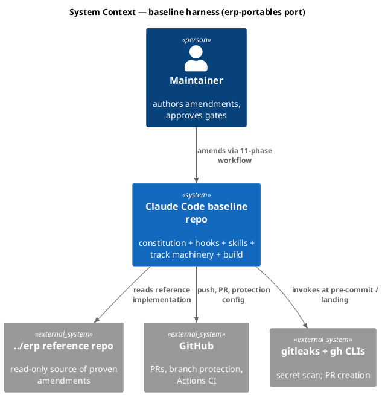

### C4 — Container

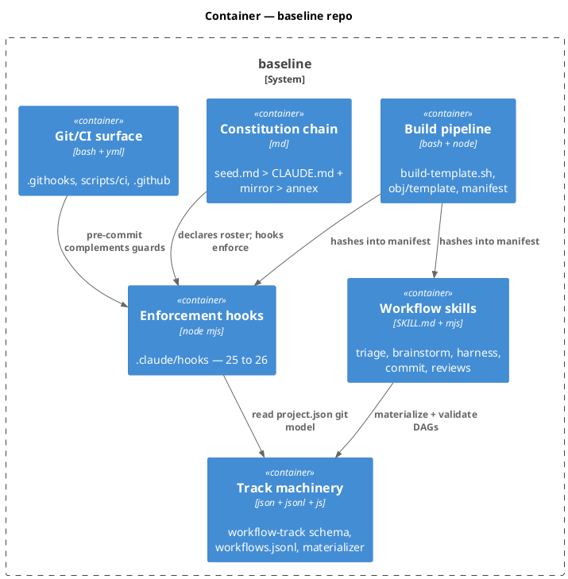

### C4 — Component (changed containers)

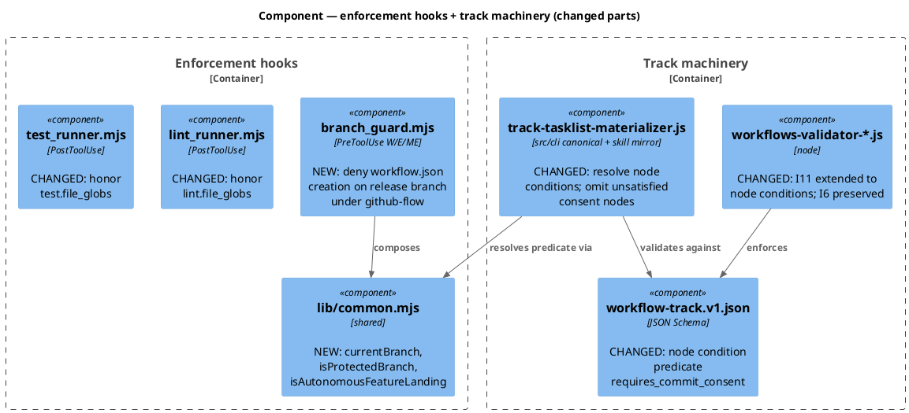

### Data model — class diagram

State objects only (no database in this system).

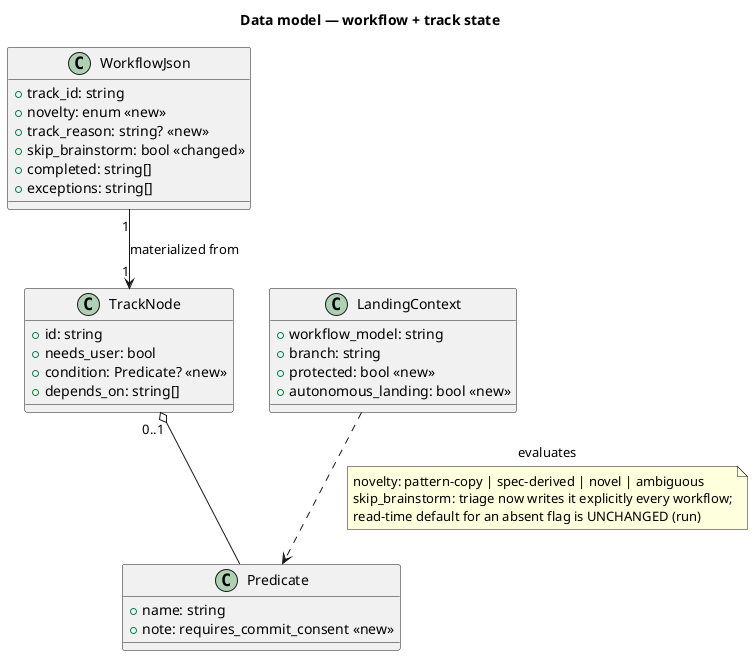

#### Migration DDL

```sql
-- No database in this system. State migrations are JSON-shape changes:
-- workflow.json gains optional `novelty`, `track_reason` (absent = pre-port file, valid);
-- workflows.jsonl nodes gain optional `condition` (absent = unconditional, valid).
-- Both additive; no reverse migration needed.
```

### Behavior — sequence per AC

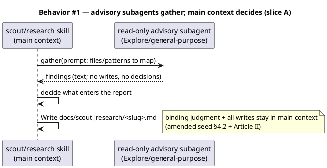

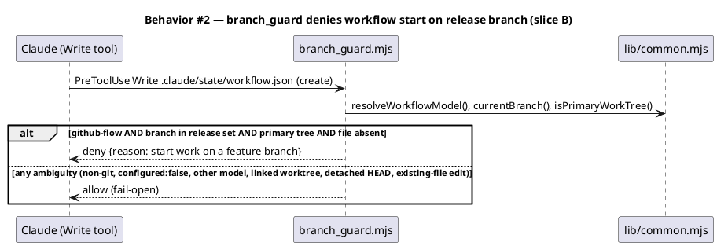

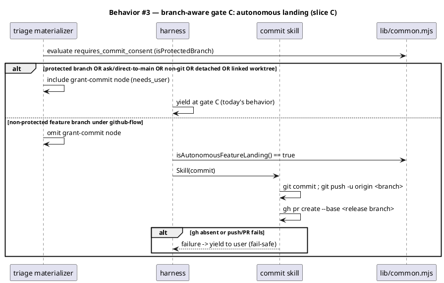

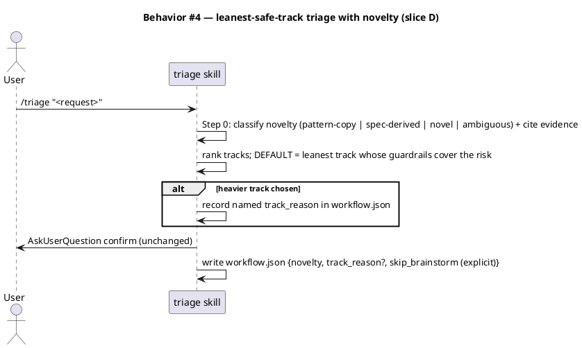

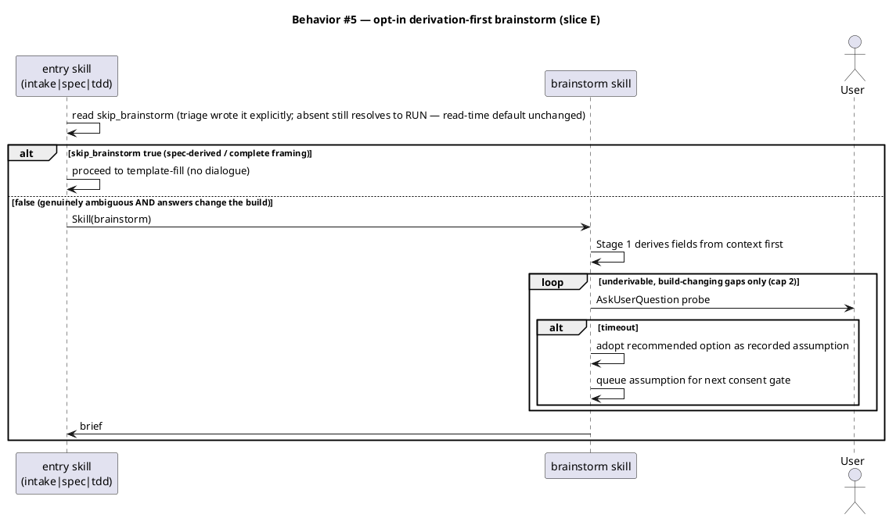

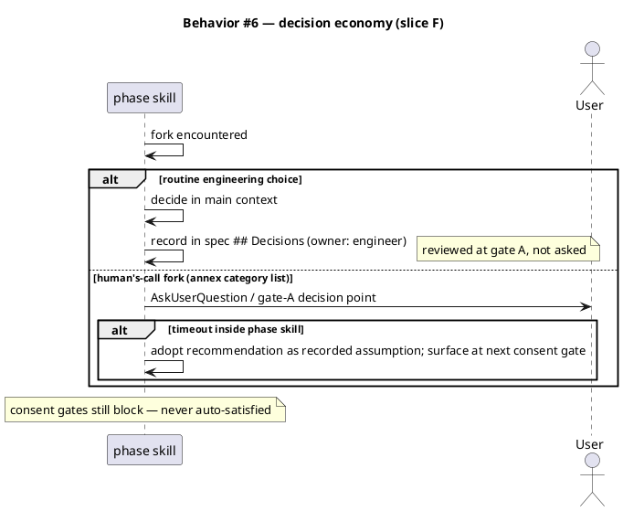

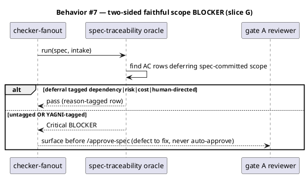

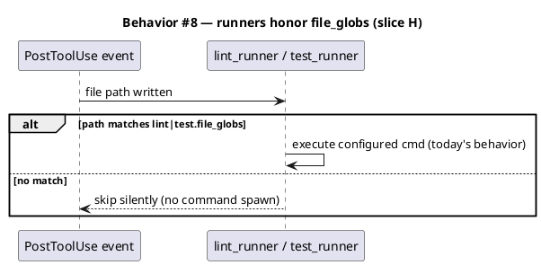

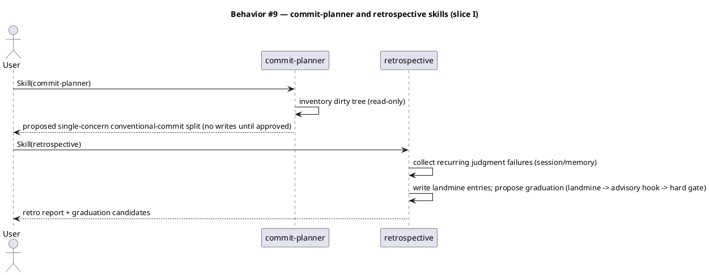

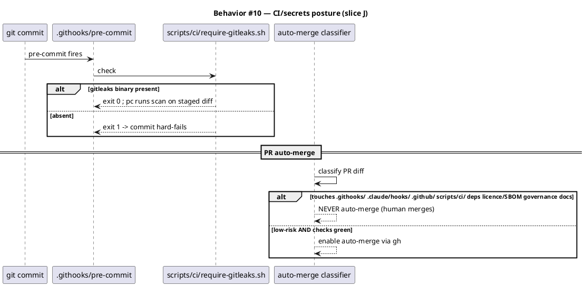

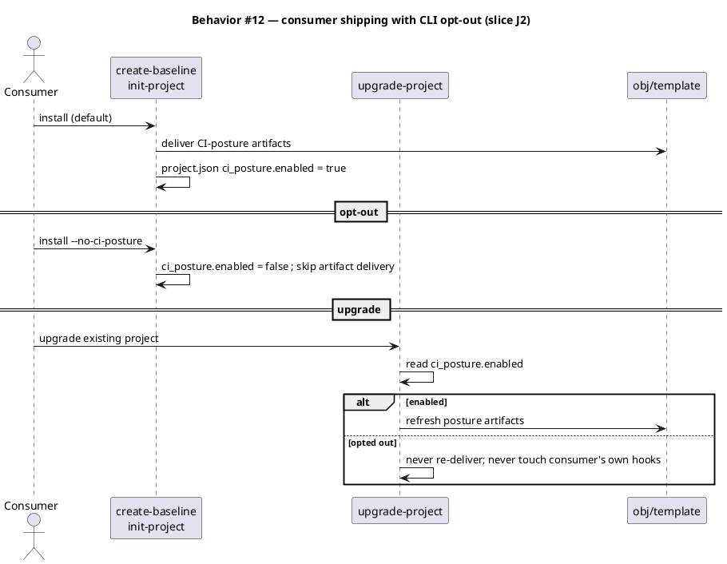

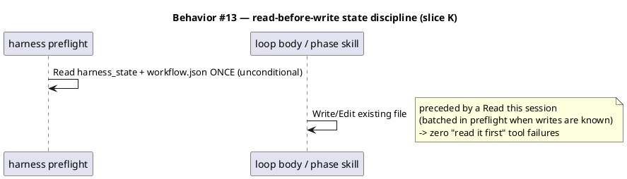

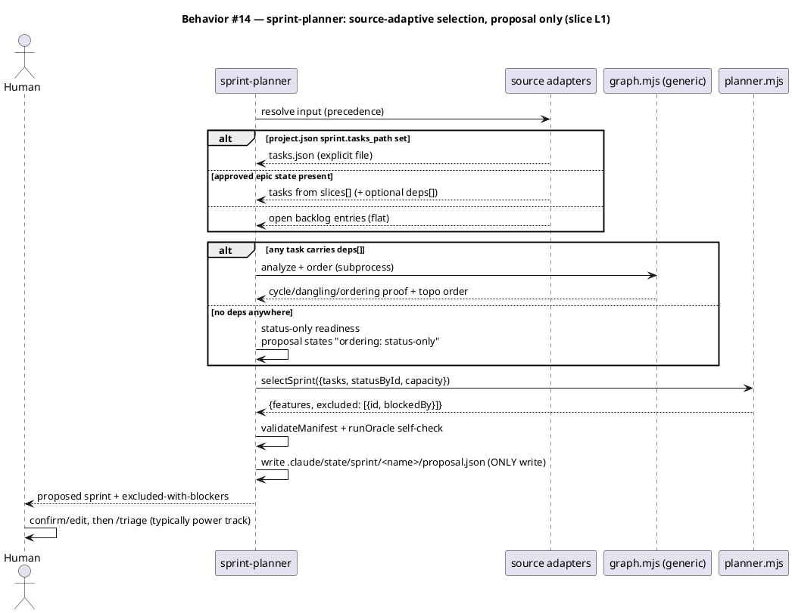

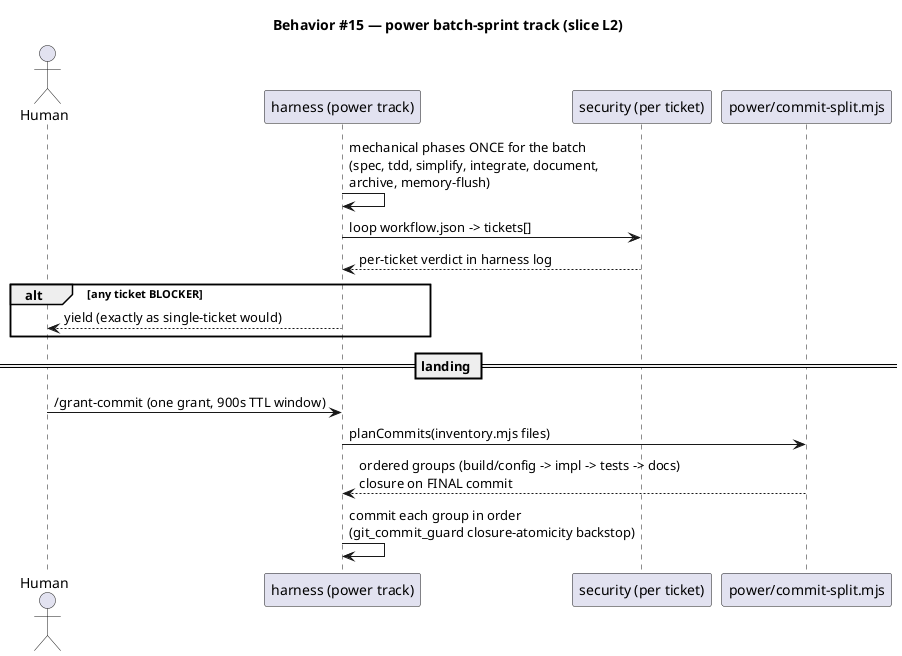

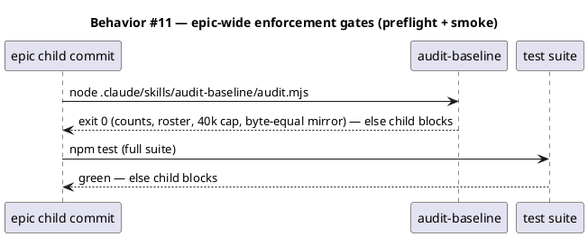

### State — core entity *(only if stateful)*

No new state machine; landing-state transitions are covered in Behavior #3. *(omitted deliberately)*

### Dependencies — graph

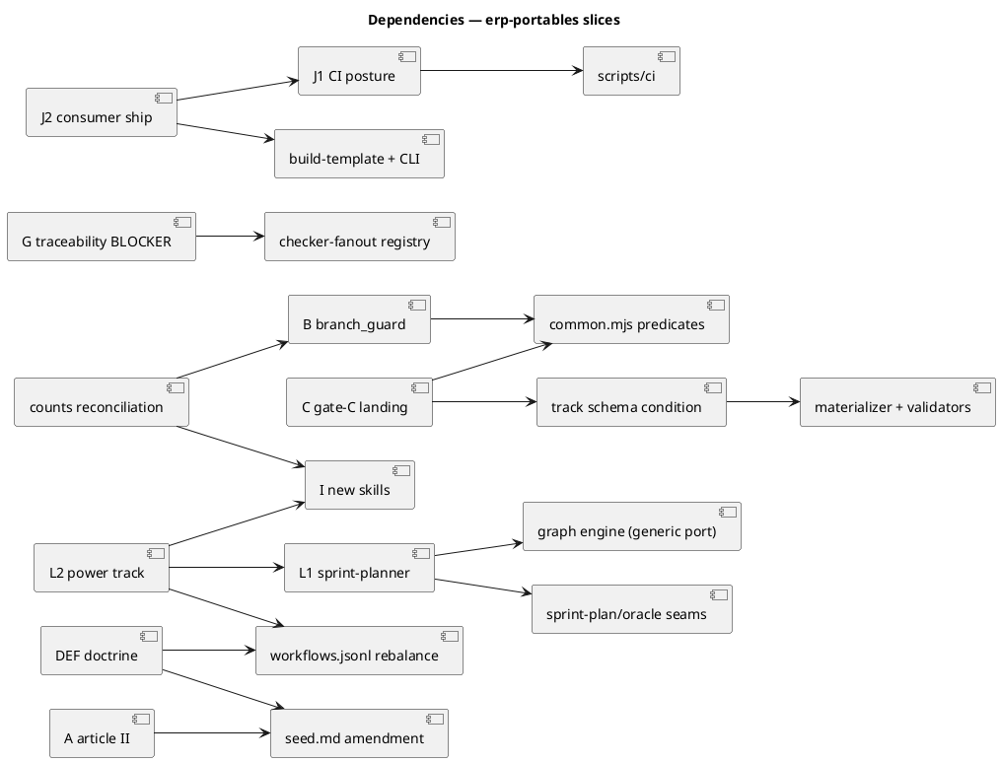

### Contracts

| Kind | Name | Input | Output | Errors | Idempotent |
|---|---|---|---|---|---|
| Hook | `branch_guard.decide(input)` | `{tool_input, projectJson, git ctx}` | `{decision: "allow"\|"deny", reason?}` | never throws; fail-open allow | yes (pure) |
| Fn | `currentBranch(cwd?)` | cwd | branch name string \| `"HEAD"` (detached) \| `null` (non-git) | never throws | yes |
| Fn | `isProtectedBranch(projectGit, branch)` | `git.protected_branches` globs (+`null`=all), branch | bool | never throws | yes |
| Fn | `isAutonomousFeatureLanding({projectJson, cwd?})` | project git config + repo state | bool — true ONLY for non-protected feature branch under `github-flow` on primary tree, named branch | never throws; false on any doubt | yes |
| Schema | `TrackNode.condition` | optional `{predicate: "requires_commit_consent"}` | materializer includes node iff predicate true or ctx missing (fail-safe include) | validator I11 rejects unknown predicate | — |
| CLI | `seed-tasklist.mjs <track> <slug>` | unchanged args | tasklist JSON, consent node omitted per condition | non-zero + named error | yes |
| Fn | `runProbeLoop({gaps, askFn, cap=2})` | gap list | `{closed, open_questions}` | cap-capped | yes |
| Fn | `withDefaults(workflowJson)` | raw workflow.json | UNCHANGED — `skip_brainstorm` absent → `false` (run); opt-in comes from triage writing the flag | never throws | yes |
| Config | `project.json → ci_posture.enabled` | bool, template default `true` | init-project honors `--no-ci-posture`; upgrade-project respects existing value | absent → treated `true` on fresh install only | yes |
| SOP | harness preflight read-before-write | — | Read `harness_state` + `workflow.json` once before first state write | — | yes |
| Oracle | `runTraceabilityOracle({spec,intake})` | artifact text | findings incl. `deferral_untagged` Critical BLOCKER | never throws | yes |
| Hook | `lint_runner`/`test_runner` glob gate | written file path | run cmd iff path matches `lint\|test.file_globs` (absent globs → run, today's behavior) | fail-open run | yes |
| Skill | `commit-planner` | dirty tree | proposed commit split (read-only) | — | yes |
| CLI | `sprint-planner/graph.mjs <analyze\|order\|compact> <tasks.json>` | `{buckets?, tasks:[{id, epic, bucket?, category?, title, deps[], order?}]}` — buckets from input; absent → single implicit bucket | analyze: cycles + dangling + producer-after-consumer (exit 0/2/3); order: deterministic topo (bucket→epic→id tie-break); compact: chain/parallel merge candidates | dangling deps exit 1 with named task | yes (pure read) |
| Fn | `selectSprint({tasks, statusById, capacity=3})` | task graph + status map + capacity | `{features:[{id, done_record, edge_tests, wiring_test}], excluded:[{id, blockedBy}]}` — ready iff every dep done; no deps → status-only (declared in proposal) | never throws; empty input → empty features | yes |
| Fn | `planCommits(files)` | `commit-planner/inventory.mjs` file groups | ordered commit groups (build/config → impl → tests → docs), Conventional subjects, closure group LAST | never reorders closure off the final group | yes |
| Config | `project.json → sprint.tasks_path` | optional path to an explicit tasks.json | sprint-planner source precedence rung 1 | absent → epic-state/backlog adapters | yes |
| Config | `project.json → velocity.power_mode.enabled` | bool, default `false` | `power` track selectable + power skill active iff true | absent → false (off-flag byte-unchanged) | yes |
| Schema | `workflow.json → tickets[]` (power track) | one entry per ticket: `{id, acs[], done_record}` (epic sliced-spec shape) | per-ticket security iteration + commit-split grouping input | validator I-set unchanged (static DAG; in-skill loop) | — |
| Schema | epic `slices[].deps` (optional) | array of sibling slice ids, written at epic decomposition from the spec dependency diagram | feeds graph.mjs edges for sprint-planner readiness | absent → status-only readiness | — |
| Skill | `retrospective` | session + memory | landmine entries + graduation candidates | — | re-runnable |
| CLI | `scripts/ci/require-gitleaks.sh` | none | exit 0 present / exit 1 absent (message names install cmd) | — | yes |
| CLI | `scripts/ci/low-risk-classifier.mjs` | PR diff paths | `{low_risk: bool, reason}` — NEVER-list always false | — | yes |
| CLI | `scripts/ci/apply-branch-protection.mjs` | `.github/branch-protection/main.json` | applies via `gh api`; subset-asserts against green main | non-zero on drift | yes |

### Libraries and versions

No third-party library APIs are used by any slice (node stdlib + existing repo helpers). `gitleaks` and `gh` are external CLI binaries exercised via exit codes; runtime dep `@clack/prompts@1.4.0` untouched. Context7: nothing to confirm (research memo, Library note).

| Library@version | Purpose | Key APIs | Confirmed via context7 |
|---|---|---|---|
| *(none — stdlib only)* | — | — | n/a |

### Alternatives considered

| Alt | Summary | Rejected because |
|---|---|---|
| A | Faithful file port from erp | leaks ERP citations/counts/gradle contexts into constitution + CI |
| B | Clean-room re-derivation | discards erp's tested edge-case coverage; slowest |
| C (chosen) | Hybrid: PORT mechanics, REAUTHOR doctrine, GREENFIELD J | requires per-slice mode labels (declared per slice below) |

## Design calls

Write set intersects `tdd.ui_globs` only via `site-src/**` count-text sync (docs site pages carrying "25 hooks"/"46 skills" counts).

| Slug | Intent | Target files | Write set | Register | References |
|---|---|---|---|---|---|
| docsite-count-sync | text-only count sync (25→26 hooks, 46→48 skills) in existing docs pages; no layout/visual change | count-bearing pages under `site-src/` | `site-src/**` | inherit | `audit-baseline-docsite-drift.test.mjs` |

## Slice A — Article II §4.2-A: read-only advisory subagents

Mode: **REAUTHOR** (constitution) + **PORT** (skill prose diffs). Re-scope Article II's ban from "conversational judgment" to **binding judgment** (a written decision or production change). Read-only advisory subagents (Explore, Plan, research gathering, oracle-bound checkers — already §II.A) are permitted: they review and advise; main context decides and writes. Amend `seed.md §4.2` FIRST, then CLAUDE.md Article II + `src/CLAUDE.template.md`, annex amendment-history entry. Amend `scout`/`research` SKILL.md: gathering MAY be delegated to read-only advisory subagents; report content decisions stay in main context (scout's "Project source is read-only" constraint unchanged).
**ACs**: AC-001. **Write surface**: `docs/init/seed.md`, `src/seed.template.md`, `CLAUDE.md`, `src/CLAUDE.template.md`, `.claude/CONSTITUTION.md`, `.claude/skills/scout/SKILL.md`, `.claude/skills/research/SKILL.md`, tests (`article-ii` structural test), `obj/template/**`.

## Slice B — branch_guard hook (25→26)

Mode: **PORT** (hook + test from erp; erp file is generic) + **REAUTHOR** (counts/prose — re-derive, do NOT copy erp's "27 hooks" sentence). New `.claude/hooks/branch_guard.mjs`: PreToolUse Write|Edit|MultiEdit; denies only CREATION of `.claude/state/workflow.json` when `git.workflow_model` resolves `github-flow` AND `currentBranch()` matches `git.release_branches` (default `["main"]`) AND primary worktree AND `configured: true`; fail-open otherwise (per Behavior #2). Pure exported `decide()`; add `currentBranch()` to `lib/common.mjs`. Wire in `.claude/settings.json` (+ `src/settings.template.json`) after `track_guard`. Reconcile: seed §4.1 (25→26 + hook row), CLAUDE.md preamble + Art. III greeting + Art. VIII table, annex, `expected-baseline.mjs` EXPECTED_HOOKS, README + `site-src` counts, manifest re-hash.
**ACs**: AC-002. **Write surface**: `.claude/hooks/branch_guard.mjs`, `.claude/hooks/lib/common.mjs`, `.claude/settings.json`, `src/settings.template.json`, constitution chain, `.claude/skills/audit-baseline/expected-baseline.mjs`, `README.md`, `site-src/**`, `tests/branch-guard*.test.mjs`, `obj/template/**`.

## Slice C — branch-aware gate C: autonomous commit→push→PR

Mode: **PORT** (predicates + materializer predicate + tests) + **REAUTHOR** (harness/commit SKILL.md prose, seed §11/§18 + Art. IV/VII notes). Add `isProtectedBranch()` + `isAutonomousFeatureLanding()` to `common.mjs` (fail-safe false per Behavior #3 alt). Schema: optional `TrackNode.condition` with predicate enum `requires_commit_consent` (reuse the existing §18 Predicate vocabulary — no new namespace; I6 static declaration preserved: grant-commit stays DECLARED on every commits-track; I11 extended to resolve conditions; missing ctx → include node, fail-safe). Materializer change lands in `src/cli/track-tasklist-materializer.js` first, Stage 0b syncs the skill mirror. Annotate `grant-commit` nodes in `workflows.jsonl`. Harness: no-yield carve-out at grant-commit when predicate omitted the node; commit skill Step 7: `git push -u` + `gh pr create --base <release>`; any push/PR/`gh`-absent failure → yield to user. Gate C byte-unchanged on protected branches; `git_commit_guard` untouched (commit-time backstop).
**ACs**: AC-003. **Write surface**: `.claude/hooks/lib/common.mjs`, `.claude/schemas/workflow-track.v1.json`, `src/cli/track-tasklist-materializer.js`, `.claude/skills/triage/track-tasklist-materializer.js` + `workflows-validator-*.js`, `.claude/workflows.jsonl`, `.claude/skills/harness/SKILL.md`, `.claude/skills/commit/SKILL.md`, constitution chain, tests, `obj/template/**`.

## Slice DEF — build-to-spec doctrine (leanest-track triage + opt-in brainstorm + decision economy)

One doctrine, one commit (mirrors erp `03697dd`; merged at gate-A review 2026-07-03 — the three parts are coupled: triage writes brainstorm's flag; brainstorm's probes exercise decision economy's timeout rule; all three amend the same constitution sections).

**D — leanest-safe-track triage.** Mode: **REAUTHOR** (SKILL.md prose + Article IV entry points) + **PORT** (flag-parser field handling). `/triage` Step 0 classifies novelty FIRST — `pattern-copy` / `spec-derived` / `novel` / `ambiguous` — with cited evidence, recorded as `workflow.json → novelty`; picks the LEANEST track whose guardrails cover the risk; a heavier track requires named `track_reason` (recorded). Entry-point rebalance: intake-full narrowed to genuinely novel surface; spec-entry broadened to spec-derived/pattern work (workflows.jsonl `description`/`selector_hints` text only — DAGs unchanged). AskUserQuestion confirm step unchanged.

**E — opt-in derivation-first brainstorm (NO read-time default flip).** Mode: **PORT** (probe-loop cap) + **REAUTHOR** (XI.3 + annex §5.3). Maintainer decision 2026-07-03: `workflow-defaults.mjs` is UNCHANGED — absent `skip_brainstorm` keeps resolving to `false` (brainstorm runs). Opt-in arrives solely via `/triage` Step 0 writing the flag EXPLICITLY on every workflow: `true` when the request derives from a spec chapter/roadmap/backlog/approved epic or carries complete framing; `false` only when genuinely ambiguous AND answers would change the build. `probe-loop.mjs` cap 5→2; Stage 1 becomes derivation-first (derive each canonical field from context; only underivable, build-changing gaps probe). Entry-skill Step 0.5 wording updated in `intake`/`spec`/`tdd` SKILL.md.

**F — XI.12 decision economy.** Mode: **REAUTHOR**. New CLAUDE.md XI.12 + annex §5.x: only load-bearing, human's-call forks may surface as questions or gate-A decision points (annex enumerates the categories: consent-adjacent scope, irreversible/destructive ops, policy flips, contradictory requirements). Routine engineering choices are decided in main context and RECORDED in the spec's `## Decisions` section with rationale (`owner: engineer`) — reviewed at gate A, not asked. AskUserQuestion timeout inside a phase skill adopts the recommended option as a recorded assumption surfaced at the next consent gate; questions never block an unattended run; consent gates still do. seed.md gains the corresponding §5/§6 note FIRST.

**ACs**: AC-004, AC-005, AC-006. **Write surface**: `.claude/skills/triage/SKILL.md` + `flag-parser.mjs`, `.claude/workflows.jsonl`, `.claude/skills/brainstorm/**` (probe-loop, SKILL.md; NOT workflow-defaults), `.claude/skills/intake/SKILL.md`, `.claude/skills/spec/SKILL.md`, `.claude/skills/tdd/SKILL.md`, constitution chain (Art. IV, XI.3, XI.12, annex §5.3/§5.x), `tests/brainstorm-*.test.mjs` + triage tests, `obj/template/**`.

## Slice G — two-sided faithful scope + VI.4 YAGNI note

Mode: **REAUTHOR** (constitution) + **PORT** (oracle check shape from erp's spec-traceability-review). VI.4 gains: "YAGNI gates speculation beyond the approved spec; it never authorizes deferring spec-committed scope." (seed §2.4 first). `spec-traceability-review` oracle + SKILL.md: an AC-table row that defers spec-committed scope MUST carry a reason tag from the closed list `dependency|risk|cost|human-directed` (row convention: `deferred: <reason>` in the Criterion cell); untagged or YAGNI-tagged deferral → Critical BLOCKER finding (reaches gate A via existing checker-fanout wiring — Behavior #7). Annex documents the closed list + row convention.
**ACs**: AC-007. **Write surface**: `.claude/skills/spec-traceability-review/oracle.mjs` + `SKILL.md`, `.claude/skills/spec/SKILL.md` (row convention), constitution chain, `tests/checker-oracle-traceability.test.mjs`, `obj/template/**`.

## Slice H — lint_runner/test_runner honor file_globs

Mode: **PORT** (erp's +9/+11 line fix). Both runners gate on `project.json → lint|test.file_globs` before spawning the configured command: written path matches → run (today's behavior); no match → skip silently. Absent/empty `file_globs` → run (back-compat, fail-open). Uses existing `matchAnyGlob` from `common.mjs`.
**ACs**: AC-008. **Write surface**: `.claude/hooks/lint_runner.mjs`, `.claude/hooks/test_runner.mjs`, `tests/runner-file-globs*.test.mjs`, `obj/template/**`.

## Slice I — commit-planner + retrospective skills

Mode: **REAUTHOR** (generalize from erp; drop erp roadmap/standup-format references). `commit-planner`: split a dirty working tree into single-concern Conventional Commits; deterministic `inventory.mjs` helper; read-only until the user approves the plan; frontmatter cross-references the `commit` skill (Phase 11 executor — disjoint jobs). `retrospective`: cycle-end retro converting recurring judgment failures into landmine entries and proposing graduation up the enforcement funnel (landmine → advisory hook → hard gate); pairs with `standup`; writes only memory entries + a report. Both `owner: baseline`. Counts 46→48: seed §4.3, CLAUDE.md Art. III greeting + Appendix quick-orientation, annex Appendix B, manifest `owners.skills` + hashes.
**ACs**: AC-009. **Write surface**: `.claude/skills/commit-planner/**`, `.claude/skills/retrospective/**`, constitution chain (counts), `.claude/skills/audit-baseline/**` (if roster lists skills), manifest, `README.md`, `site-src/**` (counts), tests, `obj/template/**`.

## Slice J1 — CI/secrets posture working in this repo

Mode: **GREENFIELD** (erp = shape reference; re-derive check contexts from this repo's `release.yml`). Three pieces: (1) `.githooks/pre-commit` + `scripts/ci/require-gitleaks.sh` — hard-fail commit when the gitleaks binary is absent (Behavior #10); staged-diff scan when present; `core.hooksPath` set via documented one-liner, NOT via `git config` automation (Art. VII hard-blocks `git config` — the hook path activation is a documented manual step for the maintainer). (2) `.github/branch-protection/main.json` config-as-code + `scripts/ci/apply-branch-protection.mjs` (gh-api applier, subset-asserts against green main; check contexts pinned to this repo's live release.yml checks, re-derived at implementation). The repo is PUBLIC (verified 2026-07-03: `friedbotstudio/baseline`), so the required-status ruleset is fully LIVE — no free-tier inert split. (3) `scripts/ci/low-risk-classifier.mjs` + auto-merge workflow — NEVER-list (enforcement hooks `.githooks/**` `.claude/hooks/**`, control plane `.github/**` `scripts/ci/**`, dependency manifests, licence/SBOM files, governance docs `CLAUDE.md` `docs/init/**` `.claude/CONSTITUTION.md`) always classifies not-low-risk. Everything authored template-ready (no repo-hardcoded paths beyond the check-context pins J2 parameterizes) so J2 can ship it without rework.
**ACs**: AC-010. **Write surface**: `.githooks/**`, `scripts/ci/**`, `.github/branch-protection/**`, `.github/workflows/auto-merge.yml`, `docs/**` (activation runbook), tests.

## Slice J2 — ship the CI posture to consumers behind an opt-out (depends on J1)

Mode: **GREENFIELD** (CLI + template shipping; no erp precedent — erp kept it repo-local). Maintainer decision 2026-07-03: ship default-on WITH a CLI opt-out ("the solution will be complete for real-world use-case plus end-users can opt-out if they're using different solution"). Pieces: (1) J1's artifacts land in `obj/template/` (`.githooks/pre-commit`, `scripts/ci/require-gitleaks.sh` + classifier + applier, branch-protection config as a fill-in template with THIS repo's contexts replaced by placeholders) via `scripts/build-template.sh`; manifest re-hash. (2) New `project.json → ci_posture.enabled` knob (template default `true`). (3) `init-project` gains the opt-out seam: prompt/flag (e.g. `--no-ci-posture`) sets the knob `false` and skips delivering the artifacts; `upgrade-project` respects the existing knob on upgrade (never re-delivers into an opted-out project, never deletes a consumer's own hooks). (4) Consumer docs: activation one-liner (`core.hooksPath`), opt-out path, and what each artifact does. Constitution: seed §16-adjacent config note + annex row; no new hook (git hooks are not Claude Code hooks — roster stays 26).
**ACs**: AC-013. **Write surface**: `scripts/build-template.sh`, `obj/template/**`, `src/cli/**` (init-project/upgrade-project seams), `src/project.template.json`, `.claude/skills/init-project*/**` (if the skill mirrors the seam), constitution chain (config note), docs, tests.

## Slice K — read-before-write state discipline

Mode: **REAUTHOR** (no erp precedent; maintainer request 2026-07-03). Failure mode: Write/Edit on an existing file not yet Read this session fails with "File has not been read yet", costing a failed tool call + retry — observed twice in this epic's own discovery (harness_state, workflow.json). A hook CANNOT fix this (hooks deny; they cannot perform the Read), so the fix is SOP-level: (1) harness SKILL.md preflight step — Read `.claude/state/harness_state` AND `.claude/state/workflow.json` once, unconditionally, before the first state write (covers every later marker/state refresh in the loop). (2) The state-write discipline (annex §2 + harness SKILL.md binding note) gains: "Read-before-write: any Write/Edit to an EXISTING file SHALL be preceded by a Read of that file in the same session; batch the Reads into preflight where the writes are known in advance (workflow state, memory files, constitution mirrors)." (3) Phase skills with known recurring writes (`commit` — workflow.json/backlog; `memory-flush` — canonical files it will edit) get a one-line read-first note at their write steps. No hook, no schema change, roster unchanged.
**ACs**: AC-014. **Write surface**: `.claude/skills/harness/SKILL.md`, `.claude/CONSTITUTION.md` (§2 state-write discipline), `.claude/skills/commit/SKILL.md`, `.claude/skills/memory-flush/SKILL.md`, structural test (SOP text present), `obj/template/**`.

## Slice L1 — sprint-planner skill + generic graph engine

Mode: **REAUTHOR** (erp = shape reference at `../erp/.claude/skills/sprint-planner/` + `roadmap-deriver/scripts/graph.mjs`; erp's roadmap-file input model does not exist here and MUST NOT be assumed — maintainer directive 2026-07-05: this is the baseline *product*; a consumer repo with a real roadmap needs the full engine, so it ships generic). Pieces: (1) `graph.mjs` ported near-verbatim to `.claude/skills/sprint-planner/graph.mjs` — same three commands (`analyze` cycles/dangling/producer-after-consumer, `order` deterministic topo with bucket→epic→id tie-break, `compact` chain/parallel merge candidates), erp's default buckets `['platform','solution','web','app']` dropped (buckets come from the input file; absent → single implicit bucket); the `tasks.json` contract ships as an adapted `references/graph-schema.md`. (2) `planner.mjs → selectSprint({tasks, statusById, capacity=3})` — ready iff every dep `done`; cohesive same-epic-preferred subset up to capacity; excluded tasks name their unmet prerequisites. (3) **Source-adaptive input**, precedence: `project.json → sprint.tasks_path` (explicit tasks file — erp-equivalent behavior) → approved epic state `slices[]` (gaining an OPTIONAL `deps[]` field written at epic decomposition from the spec's dependency diagram — this repo dogfoods its own edges) → open `backlog.md` entries via standup's `gatherSync` (flat). **Graceful, declared degradation**: no deps anywhere → the engine still runs (trivially acyclic), readiness collapses to status-based, and the proposal artifact states `ordering: status-only` — never a silent claim of proven ordering. (4) Output: proposal-only manifest at `.claude/state/sprint/<name>/proposal.json`, validated by `sprint-plan → validateManifest`, self-checked by `sprint-oracle → runOracle`; the human confirms/edits before `/triage` routes it (typically to `power`). Read-only otherwise — no source writes, no git, no autonomous selection into a build (Article II).
**ACs**: AC-015. **Write surface**: `.claude/skills/sprint-planner/**` (SKILL.md, graph.mjs, planner.mjs, references/), `.claude/skills/epic`-adjacent slice-schema note + triage §18.9 `deps[]` write, `src/project.template.json` + `.claude/project.json` (`sprint.tasks_path`), constitution chain (counts 48→50 with L2), manifest, `README.md`/`site-src/**` (counts), tests, `obj/template/**`.

## Slice L2 — power batch-sprint track + skill (depends on L1)

Mode: **PORT + ADAPT** (erp ADR-0034 track + `power` skill; two deliberate divergences). Pieces: (1) `workflows.jsonl` gains the selectable `power` track — batch pipeline over `workflow.json → tickets[]` (epic sliced-spec shape): mechanical phases (`spec`, `tdd`, `simplify`, `integrate`, `document`, `archive`, `memory-flush`) run once for the batch; `security` runs once PER TICKET via in-skill iteration over `tickets[]` (static DAG, no runtime node fan-out; per-ticket verdicts recorded in the harness log); `grant-commit` keeps the `requires_commit_consent` condition (slice C landing behavior composes unchanged). **Divergence 1 — no `governance-review` node**: erp's per-ticket governance-review skill does not exist here; this repo's spec-boundary judgment is the checker fan-out (diagram/traceability/rollout) + `spec-shippability-review`, which already evaluate per-AC rows — `security` is the sole `per_ticket` node. (2) `power` skill hosts the two track behaviors: the per-ticket security loop (a silent per-ticket skip is forbidden; any ticket BLOCKER yields exactly as a single-ticket workflow would) and the commit split — new `power/commit-split.mjs → planCommits(files)` over the existing `commit-planner/inventory.mjs` (slice I), producing ordered Conventional Commits (build/config → implementation → tests → docs) with the closing workflow state + backlog stamp on the FINAL commit. **Divergence 2 — no consent-model change**: erp's ADR-0033 workflow-scoped grant maps onto this repo's existing TTL consent (`git_commit_guard` validates age, never consumes the token), so one `/grant-commit` already authorizes the batch's ordered commits within the 900s window; the closure-atomicity check remains the structural backstop. (3) Opt-in `velocity.power_mode.enabled` (default `false`, `org_mode` precedent); off-flag the track is not selectable and behavior is byte-unchanged. Requires git. Ripple: skills 48→50, selectable tracks 8→9, triage decision rules + selector hints, constitution chain, docsite.
**ACs**: AC-016. **Write surface**: `.claude/skills/power/**`, `.claude/workflows.jsonl` + `src/.claude/workflows.template.jsonl`, `.claude/skills/triage/SKILL.md`, `.claude/skills/harness/SKILL.md` (power-track note), `src/project.template.json` + `.claude/project.json` (knob), constitution chain (seed §4.3/§18, CLAUDE.md counts + Art. IV track list, annex Appendix A/B), manifest, `README.md`/`site-src/**`, tests, `obj/template/**`.

## Acceptance criteria

| ID | Criterion (given / when / then) | Kind | Upstream AC | Sequence |
|---|---|---|---|---|
| AC-001 | given the amended Article II + seed §4.2, when a phase needs read-only gathering/advice, then read-only advisory subagents are permitted while every binding decision and write stays in main context; scout/research SKILL.md carry the gathering-delegation clause | behavior | intake AC 1 | §Behavior #1 |
| AC-002 | given `github-flow` + current branch in `git.release_branches` + primary tree + `configured: true`, when Write would CREATE `.claude/state/workflow.json`, then `branch_guard.decide()` denies with a named reason; given non-git / `configured: false` / other model / linked worktree / detached HEAD / existing-file edit it allows; roster count 26 reconciled everywhere audit-baseline checks | behavior | intake AC 2 | §Behavior #2 |
| AC-003 | given a non-protected feature branch under `github-flow`, when the tasklist is materialized and the harness lands, then the grant-commit node is omitted per `requires_commit_consent`, `isAutonomousFeatureLanding()` is true, and commit pushes + opens a PR (any failure → yield); given a protected branch / `ask` / `direct-to-main` / non-git / detached HEAD / linked worktree the predicate is false and gate C yields as today | behavior | intake AC 3 | §Behavior #3 |
| AC-004 | given any `/triage` run, when classification completes, then `workflow.json → novelty` carries one of `pattern-copy\|spec-derived\|novel\|ambiguous` with cited evidence, the leanest safe track is default, and a heavier pick carries a named `track_reason` | behavior | intake AC 4 | §Behavior #4 |
| AC-005 | given a spec-derived/complete-framing request, when an entry phase runs, then `skip_brainstorm: true` was written explicitly and no dialogue fires; given a genuinely ambiguous build-changing request, brainstorm runs derivation-first with probe cap 2; given an AskUserQuestion timeout, the recommended option is adopted as a recorded assumption surfaced at the next consent gate; an absent flag keeps today's read-time default (run) | behavior | intake AC 5 | §Behavior #5 |
| AC-006 | given a routine engineering fork inside a phase, when the phase would otherwise ask, then the choice is decided in main context and recorded in the spec `## Decisions` (`owner: engineer`) for gate-A review; only annex-listed human's-call categories may surface as questions; consent gates still block | behavior | intake AC 6 | §Behavior #6 |
| AC-007 | given an AC row deferring spec-committed scope, when `spec-traceability-review` runs, then a `deferred: dependency\|risk\|cost\|human-directed` tag passes and an untagged or YAGNI-tagged deferral yields a Critical BLOCKER at gate A; VI.4 carries the floor/ceiling note | behavior | intake AC 7 | §Behavior #7 |
| AC-008 | given a write to a path outside `lint.file_globs`/`test.file_globs`, when the runner fires, then no command is spawned; given a matching path or absent globs, the command runs as today | behavior | intake AC 8 | §Behavior #8 |
| AC-009 | given the landed port, when skills are audited, then `commit-planner` and `retrospective` exist with `owner: baseline`, generalized content (no erp references), manifest hashes, and 46→48 reconciled counts | behavior | intake AC 9 | §Behavior #9 |
| AC-010 | given a commit with the gitleaks binary absent, when `.githooks/pre-commit` runs, then it hard-fails via `require-gitleaks.sh` (exit 1, message names the install command); branch protection is config-as-code with a subset-asserting applier; the classifier returns `low_risk: false` for every NEVER-list path | behavior | intake AC 10 | §Behavior #10 |
| AC-011 | given any epic-child commit, when `audit-baseline` runs, then it exits 0 (roster, counts, 40k cap, Article XII citations) and `CLAUDE.md` ≡ `src/CLAUDE.template.md` byte-equal | preflight | intake AC 11 | §Behavior #11 |
| AC-012 | given any epic-child commit, when the full test suite runs, then it is green (217+ tests incl. the new/adapted ones) | smoke | intake AC 11 | §Behavior #11 |
| AC-013 | given a consumer install (default), when `init-project` runs, then CI-posture artifacts are delivered and `ci_posture.enabled: true`; given `--no-ci-posture` (or the prompt opt-out), none are delivered and the knob is `false`; given an upgrade of an opted-out project, `upgrade-project` never re-delivers and never touches the consumer's own hooks | behavior | intake AC 12 | §Behavior #12 |
| AC-014 | given the harness preflight, when it arms the loop, then `harness_state` and `workflow.json` are Read once before any state write; given any phase-skill Write/Edit to an existing file, a Read of that file happened this session — zero "File has not been read yet" tool failures across a full workflow | behavior | intake AC 13 | §Behavior #13 |
| AC-015 | given a tasks file (via `sprint.tasks_path`), approved epic slices, or open backlog entries, when `sprint-planner` runs, then it selects a ready cohesive subset up to capacity (default 3) with per-task readiness (dep-complete when edges exist — graph.mjs proves acyclicity/ordering; status-only when none do, declared as `ordering: status-only` in the proposal), excludes unready tasks naming their unmet prerequisites, and writes ONLY the proposal artifact validated by `validateManifest` + `runOracle` — the human confirms before `/triage`; graph.mjs carries no erp-specific bucket defaults | behavior | intake AC 14 | §Behavior #14 |
| AC-016 | given `velocity.power_mode.enabled: true` on a git project and a triaged batch with `tickets[]`, when the `power` track runs, then mechanical phases execute once for the batch, `security` iterates per ticket (any ticket BLOCKER yields; a silent per-ticket skip is impossible), and commit lands ordered Conventional Commits via `planCommits` with closure on the final commit under one TTL-window grant; given the flag absent/false the track is unselectable and behavior is byte-unchanged | behavior | intake AC 15 | §Behavior #15 |

## Test plan

| Category | Scenario | Expected | Covers |
|---|---|---|---|
| Golden path | `branch_guard.decide()` on github-flow + main + create workflow.json | deny with reason | AC-002 |
| Golden path | materializer on feature branch omits grant-commit; harness lands; commit pushes + PRs | autonomous landing | AC-003 |
| Golden path | triage records novelty + leanest track; heavier pick requires track_reason | fields present | AC-004 |
| Golden path | runners skip non-matching path; run matching path | spawn iff match | AC-008 |
| Input boundary | detached HEAD / linked worktree / non-git / `configured:false` for branch_guard + landing predicate | allow / false (fail-safe) | AC-002, AC-003 |
| Input boundary | probe loop with 3 gaps | stops at cap 2 | AC-005 |
| Input boundary | `withDefaults({})` | `skip_brainstorm: true` | AC-005 |
| Contract violation | unknown `condition.predicate` in workflows.jsonl | validator rejects with named error | AC-003 |
| Contract violation | AC row `deferred: YAGNI` / untagged deferral | Critical BLOCKER finding | AC-007 |
| Contract violation | classifier on `.claude/hooks/**` diff | `low_risk: false` | AC-010 |
| Failure mode | `gh` absent / push rejected at autonomous landing | commit skill yields to user | AC-003 |
| Failure mode | gitleaks binary absent at pre-commit | exit 1, install-cmd message | AC-010 |
| Regression trap | protected-branch landing still yields at gate C; `git_commit_guard` byte-unchanged | unchanged | AC-003 |
| Regression trap | audit-baseline + mirror tests green after every child | exit 0 | AC-011, AC-012 |
| Regression trap | absent `file_globs` → runners run (back-compat) | unchanged | AC-008 |
| Regression trap | Article II structural test: swarm-worker remains sole writing subagent | unchanged | AC-001 |
| Golden path | init-project default delivers posture + knob true; `--no-ci-posture` skips + knob false | per flag | AC-013 |
| Regression trap | upgrade-project on opted-out project re-delivers nothing, leaves consumer hooks alone | untouched | AC-013 |
| Golden path | harness preflight reads both state files before first write; full workflow produces zero read-first tool failures | zero failures | AC-014 |
| Golden path | graph.mjs analyze/order on a tasks.json with deps | cycle-free proof + deterministic topo order | AC-015 |
| Golden path | selectSprint over epic slices with deps[] + statusById | ready subset ≤ capacity; excluded name blockers | AC-015 |
| Input boundary | tasks with no deps anywhere (backlog-only source) | status-only readiness; proposal declares `ordering: status-only` | AC-015 |
| Input boundary | tasks.json without buckets | single implicit bucket; no erp bucket names anywhere | AC-015 |
| Contract violation | tasks.json with a cycle / dangling dep | analyze exits 2 / 1 naming the cycle/task | AC-015 |
| Regression trap | sprint-planner writes nothing but the proposal artifact | no source/git writes | AC-015 |
| Golden path | power track with 3 tickets: security loop count == ticket count; commit split ordered, closure last | per-ticket verdicts + ordered commits | AC-016 |
| Contract violation | planCommits with closure files present | closure group is final; never split | AC-016 |
| Failure mode | one ticket's security review raises BLOCKER | batch yields; no silent skip | AC-016 |
| Regression trap | `velocity.power_mode.enabled` absent/false | power track unselectable; workflows.jsonl validation green; existing tracks byte-unchanged | AC-016 |

## Observability

| Signal | Name | Shape | Purpose |
|---|---|---|---|
| Log | `branch_guard` deny reason | hook stderr JSON `{decision, reason}` | explain blocked workflow start |
| Log | `harness/<slug>.log` `autonomous landing` line | timestamped transition | audit no-yield landings |
| Log | `workflow.json → novelty/track_reason` | durable fields | audit triage leanness |
| Log | checker-fanout merged verdict | `BLOCKED` findings incl. `deferral_untagged` | gate-A surface |
| Metric | test suite + audit-baseline exit codes | CI check | AC-011/012 enforcement |

## Rollout

### Prerequisites

| # | Prerequisite | enforced-by |
|---|---|---|
| 1 | audit-baseline green (counts/roster/cap/mirror reconciled) before any child merges | AC-011 |
| 2 | full test suite green per child commit | AC-012 |

- **Feature flag**: `ci_posture.enabled` (J2, template default `true`, CLI opt-out) and `velocity.power_mode.enabled` (L2, default `false` — off-flag byte-unchanged, `org_mode` precedent); other behavior changes ride constitution + config defaults; slice C activates only under `git.workflow_model: "github-flow"` (this repo runs `direct-to-main`, so gate C behavior here is unchanged until the model is switched).
- **Migration order**: per-slice child commits in dependency order (B → C share `common.mjs`; J1 → J2; L1 → L2; A, DEF, G, H, I, K independent). Additive JSON shapes (`slices[].deps`, `tickets[]`, the two new knobs) need no data migration.
- **Canary**: the first post-port workflow in this repo exercises D/E/F live (introduction-workflow pattern — this epic itself predates the new defaults).

## Rollback

- **Kill-switch**: revert the child commit (each slice is one commit; no cross-slice data). Slice E flip reverts by restoring `workflow-defaults.mjs` + XI.3 in one commit.
- **Signal to roll back**: audit-baseline FAIL, suite red, or a hook misfire (e.g. branch_guard denying on a non-github-flow repo) observed in the next workflow — all visible within one write/commit cycle.

## Archive plan

- Defaults *(automatic)*: intake, brief, scout, research, spec, spec approval, security reports.
- Extras *(list any non-default files)*:
  - *(none)*

## Decisions (gate-A review, maintainer, 2026-07-03)

| # | Question | Decision | Owner |
|---|---|---|---|
| 1 | Track + slices | epic confirmed; D+E+F merged into one doctrine slice; J split J1/J2; K added → **10 slices: A B C DEF G H I J1 J2 K** | maintainer |
| 2 | Brainstorm read-time default | **NO flip** — absent `skip_brainstorm` keeps meaning run; opt-in only via triage's explicit flag | maintainer — verbatim: "no flag = run" |
| 3 | New skills | both land, `owner: baseline`, counts 46→48 | maintainer |
| 4 | Repo visibility | PUBLIC (verified) → J1 ruleset fully live | fact |
| 5 | CI posture shipping | ship to consumers default-on with CLI opt-out; init/upgrade-project own the tailoring | maintainer — verbatim: "ship with a flag to skip in cli … the init-project and upgrade-project commands can handle this ship logic" |
| 6 | `gh`-absent fail-safe | yield to gate C as today | maintainer |

## Decisions (gate-A review, Slice L amendment, 2026-07-05)

| # | Question | Decision | Owner |
|---|---|---|---|
| 7 | Scope increase | add Slice L (L1 sprint-planner + generic graph engine, L2 power track) → **12 slices: A B C DEF G H I J1 J2 K L1 L2** | maintainer — verbatim: "let us increase the scope of epic and add 1 more task to the system" |
| 8 | Graph engine ships | port generic, do NOT skip — the baseline is a product; consumer repos with roadmaps need the engine. Buckets from input (erp defaults dropped); source-adaptive input with declared status-only degradation | maintainer — verbatim: "this is baseline product … we can make it a bit generic but it will work 100%" |
| 9 | governance-review node | dropped — no such skill here; checker fan-out + spec-shippability-review are this repo's spec-boundary judgment; `security` is the sole per_ticket node | engineer |
| 10 | Consent model for commit split | reuse existing TTL consent (900s window, token not consumed per commit); no ADR-0033 port, no guard change; closure-atomicity check is the backstop | engineer |
| 11 | sprint-planner capacity default | 3 (aligns `swarm.min_tasks_worth_swarming`) | engineer |
| 12 | power-track tdd mode | solo batch tdd first; swarm routing inside power is out of scope this epic | engineer |

## Open questions

- *(none — all six gate-A review questions resolved above)*
