# Spec — sprint mode: a baseline-owned MCP coordination channel for parallel bounded workers

## Context

| Input | Path |
|---|---|
| Intake | `docs/intake/mvp-sprint-parallel-cycles.md` |
| Scout | `docs/scout/mvp-sprint-parallel-cycles.md` |
| Research | `docs/research/mvp-sprint-parallel-cycles.md` (read the POST-REVIEW PIVOT banner first) |
| Brief | `docs/brief/mvp-sprint-parallel-cycles.md` |
| Epic state | `.claude/state/epic/mvp-sprint-parallel-cycles.json` (`architecture_note` + reshaped slices) |

**Write set**: `.claude/mcp/sprint-channel/**`, `.mcp.json`, `package.json`, `.claude/skills/sprint-plan/**`, `.claude/skills/sprint-dispatch/**`, `.claude/skills/sprint-oracle/**`, `.claude/agents/swarm-worker.template.md`, `.claude/agents/swarm-worker.md`, `.claude/skills/harness/**`, `.claude/skills/commit/**`, `docs/init/seed.md`, `CLAUDE.md`, `src/CLAUDE.template.md`, `src/seed.template.md`, `.claude/skills/audit-baseline/**`, `tests/**` — architectural, so the full C4 diagram set applies.

## Goal

The baseline gains an opt-in **sprint mode**: a lead (main context) decomposes a sprint and dispatches it to **channel peers** that coordinate mid-flight over a baseline-owned **MCP channel** (task-claim, done-unblock, write-set conflict, yield-fork-to-lead) so wall-clock approaches the slowest single slice — while the channel carries only mechanical coordination and the lead remains the sole decision locus. A peer is one of two classes: a **human-launched** independent Claude Code session (preferred when present) or, as fallback when none are connected, a **lead-spawned bounded `swarm-worker`** subagent in a git worktree.

## Non-goals

- **Native Agent Teams.** Rejected as the substrate: experimental, env-flag-gated, harder to sandbox. The channel is baseline-owned and ships via `.mcp.json`.
- **A founding-axiom rewrite.** seed §4.2 ("one subagent / decisions in main context") is **preserved**; sprint mode is a fenced opt-in exception under a new bounded charter (§II.B), the §II.A pattern.
- **Peer decision-making over the channel.** Regardless of peer class (human-launched session or lead-spawned worker), the channel transports no free-form design directive; design/scope/abstraction forks route to the lead via `yield_fork`. A human-launched session is a full session the human may drive directly, but *as a sprint peer* it is bound to its claimed-task recipe + the channel's mechanical-only coordination + lead arbitration, and to its own in-process 25 hooks.
- **Cross-machine coordination.** Single-machine only this epic; cross-machine (issue #28300) is future work.
- **Token optimization.** Trading tokens for wall-clock is the explicit stance.

## Design

Diagrams are the contract. Prose is only for what a diagram cannot say.

### C4 — System context

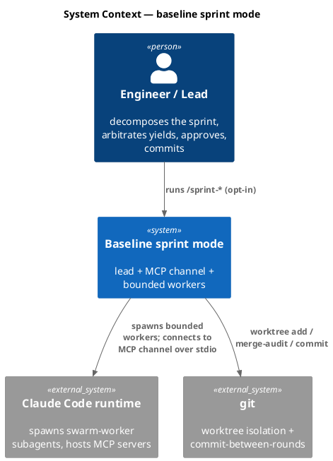

### C4 — Container

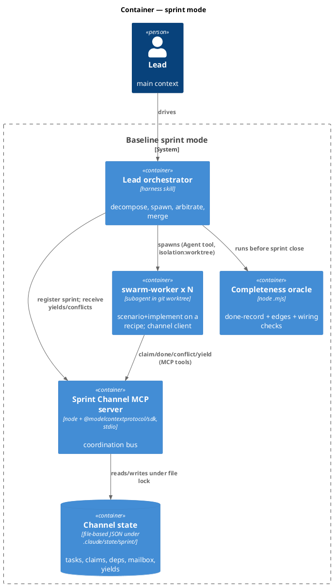

### C4 — Component (changed container: Sprint Channel MCP server)

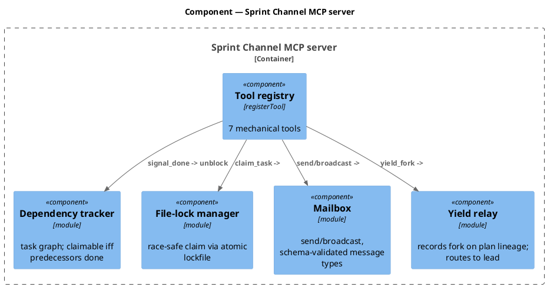

### Data model — class diagram

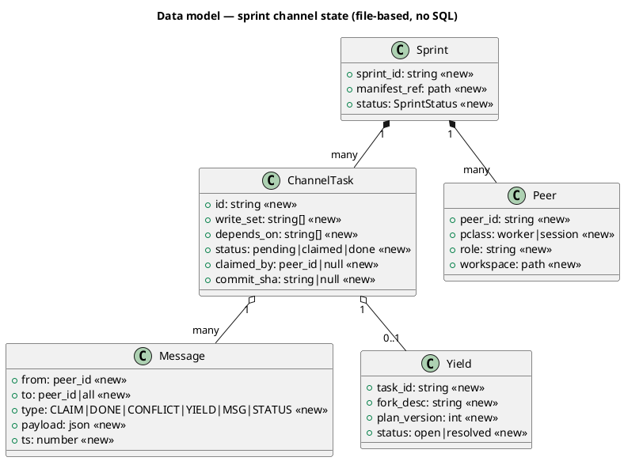

#### Migration DDL

No SQL — channel state is file-based JSON (consistent with the existing `.claude/state/swarm/` and `.claude/state/plan/` stores).

```sql
-- forward: create the runtime state dir (gitignored), no schema migration
--   mkdir -p .claude/state/sprint/<sprint_id>/  { sprint.json, tasks.json, mailbox.jsonl, yields.json }
-- reverse: rm -rf .claude/state/sprint/<sprint_id>/   (pure runtime state; nothing committed)
```

### Behavior — sequence per AC

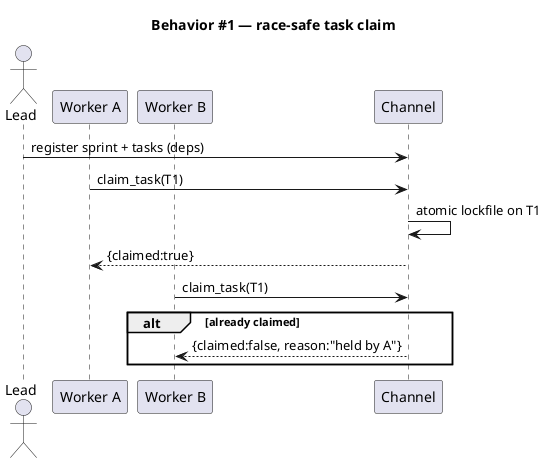

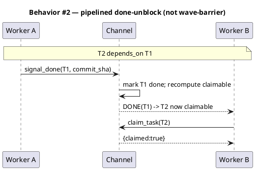

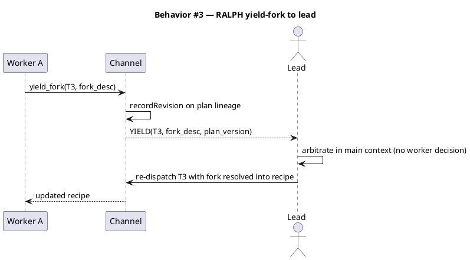

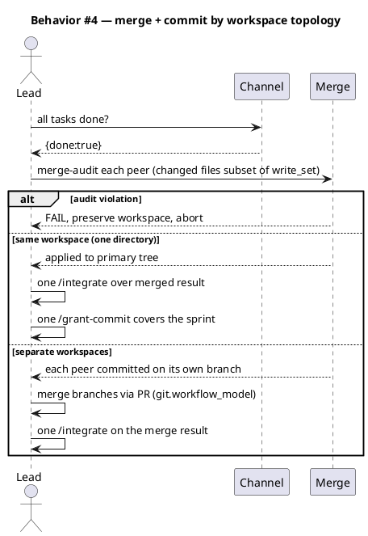

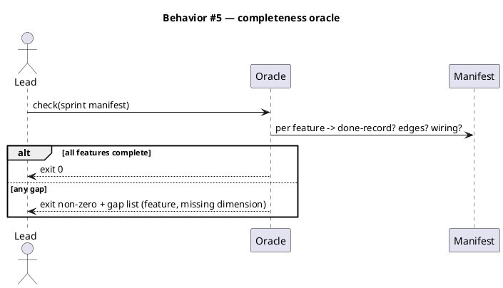

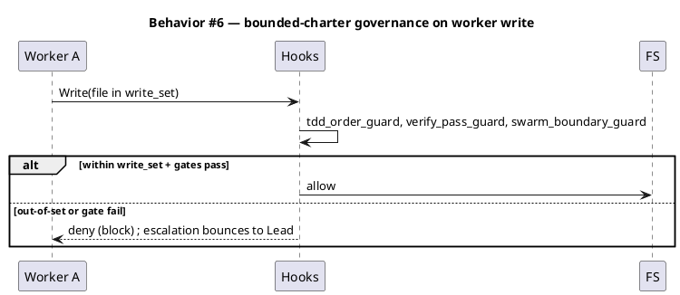

### State — sprint lifecycle

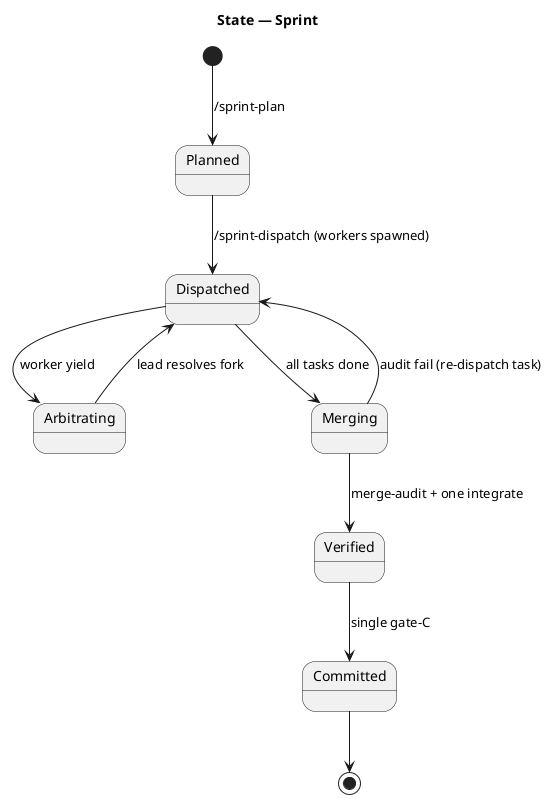

### Dependencies — graph

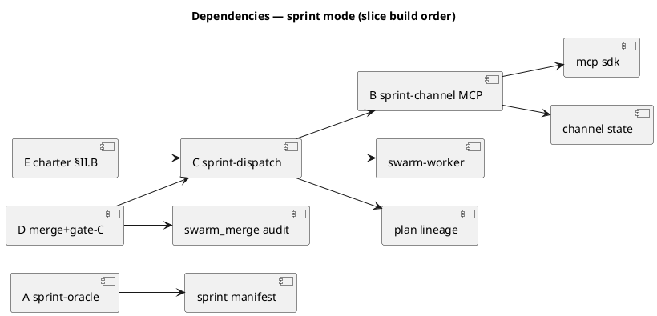

The graph is acyclic: A is independent; B founds the channel; C consumes B; D consumes C; E consumes C (after prototype).

### Contracts

The 7 channel tools (the pinned MCP API surface — `swarm-plan`/`sprint-dispatch` decompose from these, so they are fixed here).

| Kind | Name | Input | Output | Errors | Idempotent |
|---|---|---|---|---|---|
| MCP tool | `register_peer` | `{sprint_id, peer_id, pclass:"worker"\|"session", role, workspace}` | `{ok, registered}` | bad sprint_id | yes (re-register no-op) |
| MCP tool | `send_message` | `{sprint_id, from, to, type, payload}` | `{delivered}` | unknown peer, bad type | no |
| MCP tool | `broadcast` | `{sprint_id, from, type, payload}` | `{delivered_count}` | bad type | no |
| MCP tool | `claim_task` | `{sprint_id, peer_id, task_id}` | `{claimed:bool, reason}` | unknown task, deps unmet | yes (claimer re-claim no-op) |
| MCP tool | `signal_done` | `{sprint_id, peer_id, task_id, commit_sha?}` | `{unblocked:[task_id]}` | not claimer | yes |
| MCP tool | `raise_conflict` | `{sprint_id, peer_id, task_id, path}` | `{ack, arbiter:"lead"}` | — | yes |
| MCP tool | `yield_fork` | `{sprint_id, peer_id, task_id, fork_desc}` | `{recorded, plan_version}` | — | no (each yield a revision) |

Message `type` is a closed enum `CLAIM|DONE|CONFLICT|YIELD|MSG|STATUS` — zod-validated; a payload carrying a design directive is rejected at the schema boundary (mechanical-only invariant).

### Libraries and versions

| Library@version | Purpose | Key APIs | Confirmed via context7 |
|---|---|---|---|
| `@modelcontextprotocol/sdk@1.29.0` (HARD pin, exact — no caret) | build the baseline-owned channel server | `McpServer` from `@modelcontextprotocol/sdk/server/mcp.js`; `StdioServerTransport` from `@modelcontextprotocol/sdk/server/stdio.js`; `server.registerTool(name,{description,inputSchema:{…zod shape}},handler)`; `server.connect(transport)` | yes — context7 `/modelcontextprotocol/typescript-sdk/v1.29.0`: confirmed `registerTool` + stdio present in 1.29 |
| `zod@^3` | tool input/output schemas + the closed message-type enum | `z.object`, `z.enum`, `z.string`, `z.array` | yes (SDK pairs with zod for `inputSchema`) |

Note (per maintainer Q5 — "pin it hard"): the version is pinned **exact** to `1.29.0`, not a caret range — the channel feature set (`registerTool`, stdio transport) is confirmed present in 1.29 via context7. The v2 line (`@modelcontextprotocol/server`, currently alpha) is NOT adopted. `package.json` records `"@modelcontextprotocol/sdk": "1.29.0"` and a lockfile pin.

### Alternatives considered

| Alt | Summary | Rejected because |
|---|---|---|
| Native Agent Teams | first-party peer sessions + mailbox + task list | experimental, env-flag-gated, hard to sandbox; breaks §4.2 harder |
| Worktree subagent waves (research 1A) | independent-slices-only single worktree wave | no mid-flight coordination; wave-barrier not pipeline; superseded by channel |
| Custom MCP as full orchestrator | MCP also spawns sessions | an MCP server cannot spawn sessions — lead must spawn; channel is transport only |

## Design calls

*(none)* — the write_set has no UI surface (`.claude/**`, `.mcp.json`, `docs/**`, `tests/**`).

## Acceptance criteria

| ID | Criterion (given / when / then) | Kind | Upstream AC | Sequence |
|---|---|---|---|---|
| AC-001 | given a vision, when the lead plans a sprint, then a manifest lists prioritized features each with done-criteria | behavior | intake AC-1 | §Behavior #5 |
| AC-002 | given a sprint manifest, when the oracle runs, then it checks done-record + edge coverage + end-to-end wiring per feature | smoke | intake AC-1 | §Behavior #5 |
| AC-003 | given an incomplete feature, when the oracle runs, then it exits non-zero and lists the missing dimension | error-mapping | intake AC-1 | §Behavior #5 |
| AC-004 | given the channel server, when a peer calls a tool, then exactly the 7 contracted tools are available with the pinned IO | behavior | intake AC-2 | §Behavior #1 |
| AC-005 | given a baseline install, when Claude Code starts, then the channel server is declared in `.mcp.json` and loads | preflight | intake AC-2 | §Behavior #1 |
| AC-006 | given a message with a design-directive payload, when sent, then the schema rejects it (mechanical-only) | error-mapping | intake AC-7 | §Behavior #6 |
| AC-007 | given task deps, when a predecessor is not done, then `claim_task` returns `{claimed:false, deps unmet}` | behavior | intake AC-2 | §Behavior #2 |
| AC-008 | given default config, when no opt-in, then sprint mode is off (sandbox) | preflight | intake AC-7 | §Behavior #6 |
| AC-009 | given sprint dispatch, when peers start, then human-launched sessions are used if connected, else the lead spawns bounded `swarm-worker` subagents (one subagent type) — both register via `register_peer` with their `pclass` | behavior | intake AC-3 | §Behavior #1 |
| AC-010 | given a worker finishing T1, when it signals done, then a dependent T2 becomes claimable without a wave barrier | behavior | intake AC-6 | §Behavior #2 |
| AC-011 | given a worker at an un-decidable fork, when it yields, then it makes no design decision and routes the fork to the lead | behavior | intake AC-3 | §Behavior #3 |
| AC-012 | given a yield, when the lead arbitrates, then the resolution is recorded as a plan revision and re-dispatched | behavior | intake AC-3 | §Behavior #3 |
| AC-013 | given finished worktrees, when merging, then each changed file is audited ⊆ its write_set before landing | smoke | intake AC-4 | §Behavior #4 |
| AC-014 | given a dependency across rounds, when round 1 commits, then round 2 worktrees fork from fresh HEAD | behavior | intake AC-4 | §Behavior #4 |
| AC-015 | given a merged sprint, when verifying, then exactly one integrate pass runs over the merged result | behavior | intake AC-4 | §Behavior #4 |
| AC-016 | given a merged+verified sprint, when committing, then if peers shared one workspace a single grant-commit covers it, else each peer commits on its own branch merged via PR (git.workflow_model) | smoke | intake AC-4 | §Behavior #4 |
| AC-017 | given sprint mode, when a worker writes, then live hooks govern it and out-of-set writes are blocked | behavior | intake AC-7 | §Behavior #6 |
| AC-018 | given the charter, when amended, then seed.md changes before CLAUDE.md and §4.2 axiom text is preserved verbatim | preflight | intake AC-5 | §Behavior #6 |
| AC-019 | given the charter, when ratified, then Slice C's prototype evidence exists first (after-prototype) | preflight | intake AC-5 | §Behavior #3 |
| AC-020 | given the amendment, when audit-baseline runs, then it passes with updated charter + `.mcp.json` server count | smoke | intake AC-5 | §Behavior #6 |

## Slice A — Sprint completeness oracle

**Behavior**: a `/sprint-plan` produces a manifest decomposing the MVP into prioritized features each with explicit done-criteria; a mechanical `sprint-oracle` `.mjs` checks every feature for done-record + edge/error/empty coverage + end-to-end wiring and fails loud with a gap list. Independent of the channel (no Agent-Teams/MCP equivalent).
**ACs**: AC-001, AC-002, AC-003.
**Write surface**: `.claude/skills/sprint-plan/**`, `.claude/skills/sprint-oracle/**`.

## Slice B — Baseline-owned MCP coordination channel server

**Behavior**: a baseline-owned MCP server (`@modelcontextprotocol/sdk`, stdio) exposes the 7 contracted tools, persists channel state as file-based JSON under `.claude/state/sprint/`, enforces race-safe `claim_task` via atomic lockfile, tracks task dependencies (claimable iff predecessors done), and validates every message against the closed type enum (mechanical-only). Declared in `.mcp.json` so it travels into consumer installs.
**ACs**: AC-004, AC-005, AC-006, AC-007.
**Write surface**: `.claude/mcp/sprint-channel/**`, `.mcp.json`, `package.json`.

## Slice C — Sandboxed sprint mode: channel peers (sessions-or-workers) + RALPH yield

**Behavior**: opt-in `/sprint-dispatch` (off by default via `velocity.sprint_mode.enabled`) has the lead decompose the sprint, then select the **peer class** by availability (Q1): if human-launched Claude Code sessions are connected to the channel they are used as peers; otherwise the lead spawns bounded `swarm-worker` subagents (channel-connected via the worker template) into worktrees. Both classes register via `register_peer` and coordinate mid-flight (claim, done-unblock, conflict). A peer at an un-decidable fork calls `yield_fork` — making no design decision — and the lead arbitrates in main context, records the resolution on the plan lineage, and re-dispatches. **This is the throwaway-able prototype gating Slice E.**
**ACs**: AC-008, AC-009, AC-010, AC-011, AC-012.
**Write surface**: `.claude/skills/sprint-dispatch/**`, `.claude/agents/swarm-worker.template.md`, `.claude/agents/swarm-worker.md`, `.claude/skills/harness/**`.

## Slice D — Merge + integrate + topology-aware commit on the sprint result

**Behavior**: collect peer workspaces, merge-audit each (changed files ⊆ write_set, lifting `swarm_merge`), then commit by **workspace topology** (Q2): if peers shared a single workspace (one directory), apply to the primary tree, run exactly one `/integrate`, and take **one** `/grant-commit` for the sprint; if peers occupied separate workspaces, each peer **commits on its own branch** and the branches are **merged via PR** using the baseline's existing git-model logic (`git.workflow_model`, `git.release_branches`, branch-aware consent in `git_commit_guard`), then one `/integrate` runs on the merge result. The separate-workspace path also resolves the multi-wave-worktree constraint (each workspace commits independently rather than relying on the Agent-tool worktree base). Reconcile with the per-child commit model in `commit/SKILL.md` Step 2.8 + `epic_close.mjs`.
**ACs**: AC-013, AC-014, AC-015, AC-016.
**Write surface**: `.claude/skills/sprint-dispatch/merge*.mjs`, `.claude/skills/commit/**`.

## Slice E — Bounded charter (§II.B) sanctioning the sprint sandbox

**Behavior**: a new bounded charter (the §II.A pattern) fences sprint mode — workers stay bounded, the channel carries only coordination, the lead arbitrates all forks, live hooks govern every write. `seed.md` is amended first, then `CLAUDE.md`, then `src/*.template.md` mirrors; the §4.2 "one subagent / decisions in main context" axiom text is preserved verbatim. Lands only after Slice C's prototype evidence. `audit-baseline` passes with the updated charter and `.mcp.json` server count.
**ACs**: AC-017, AC-018, AC-019, AC-020.
**Write surface**: `docs/init/seed.md`, `CLAUDE.md`, `src/CLAUDE.template.md`, `src/seed.template.md`, `.claude/skills/audit-baseline/**`.

## Test plan

| Category | Scenario | Expected | Covers |
|---|---|---|---|
| Golden path | plan → dispatch 2 independent tasks → both done → merge → one gate-C | sprint commits once | AC-010, AC-015, AC-016 |
| Golden path | oracle on a fully-complete manifest | exit 0 | AC-002 |
| Input boundary | `claim_task` on a task with unmet deps | `{claimed:false}` | AC-007 |
| Contract violation | `send_message` with a design-directive payload | schema reject | AC-006 |
| Contract violation | worker writes outside its write_set | hook blocks | AC-017 |
| Concurrency / ordering | two workers `claim_task` the same task simultaneously | exactly one wins (lockfile) | AC-004 |
| Failure mode | merge-audit finds an out-of-set changed file | FAIL, worktree preserved, abort | AC-013 |
| Failure mode | worker yields an un-decidable fork | no worker decision; lead arbitrates; plan revision recorded | AC-011, AC-012 |
| Regression trap | sprint mode flag default | off (sandbox) | AC-008 |
| Regression trap | `.mcp.json` server count + audit-baseline | green | AC-005, AC-020 |
| Regression trap | seed §4.2 axiom text | unchanged verbatim | AC-018 |

## Observability

| Signal | Name | Shape | Purpose |
|---|---|---|---|
| Log | `sprint.channel.event` | fields: `sprint_id, type, peer_id, task_id` | audit coordination |
| Log | `sprint.yield` | fields: `task_id, fork_desc, plan_version` | arbitration trail |
| Metric | `sprint.wallclock_vs_serial` | histogram, labels: `sprint_id` | AC-6 speed check (bounded-by-slowest-slice) |
| Metric | `sprint.oracle.gaps` | counter, labels: `dimension` | completeness tracking |

## Rollout

### Prerequisites

| # | Prerequisite | enforced-by |
|---|---|---|
| 1 | Sprint mode is opt-in and off by default | AC-008 |
| 2 | Channel server declared in `.mcp.json` and loads at startup | AC-005 |
| 3 | Merged sprint passes exactly one integrate before gate-C | AC-016 |
| 4 | `audit-baseline` green after the §II.B charter lands | AC-020 |
| 5 | Oracle fails loud on any incomplete feature | AC-003 |
| 6 | §II.B charter ratified only after Slice C prototype evidence | AC-019 |

- **Feature flag**: `velocity.sprint_mode.enabled` — default **off** (the sandbox).
- **Build order**: A (oracle) → B (channel) → C (prototype) → D (merge/gate-C) → E (charter). E gated on C.
- **Canary**: first real sprint is a 2-independent-slice sprint on this baseline repo; success signal = single clean commit + oracle exit 0 + `sprint.wallclock_vs_serial` < 1.0.

## Rollback

- **Kill-switch**: `velocity.sprint_mode.enabled = false` — disables dispatch; the channel server is inert when no sprint registers. Removing the `.mcp.json` entry fully reverts.
- **Signal to roll back**: any worker write that escapes its write_set undetected, OR a yield that the channel transports as a design directive — either trips within the first sprint; revert the flag.

## Archive plan

- Defaults *(automatic)*: intake, scout, research, brief, spec, spec-rendered/, spec approval, epic state, security reports.
- Extras *(list any non-default files)*:
  - *(none)*

## Decisions (resolved at gate-A review, 2026-06-23)

> **Q1 — Spawning model:** dual-class peers, by availability. Use **human-launched** Claude Code sessions as peers when connected; otherwise the lead spawns bounded **`swarm-worker`** subagents. Encoded in AC-009, Slice C, `register_peer.pclass`, and the Peer class.
>
> **Q2 — Commit model by workspace topology:** if peers share **one workspace** → a **single commit** (one gate-C). If peers occupy **separate workspaces** → each commits on **its own branch**, merged via **PR** through the baseline's existing git-model (`git.workflow_model` / branch-aware consent). Encoded in AC-016, Slice D, Behavior #4.
>
> **Q5 — MCP SDK version:** **hard-pinned** exact to `@modelcontextprotocol/sdk@1.29.0` (channel features confirmed present via context7); v2 alpha not adopted. Encoded in the Libraries table.
>
> **Research Q2 — Amendment scope:** resolved by the pivot — the **§II.B bounded charter** (keep axiom, sandbox), not a subagent-count lift.

## Open questions

Remaining items are honest implement-time details owned by their slices — not discovery blockers (the maintainer accepted deferring them):

1. **Completeness-oracle convention (Slice A):** the exact tag/structure marking "edge coverage" and "wiring" in a test file so the oracle is mechanical, not heuristic. *(Deferred to Slice A by maintainer.)*
2. **Speed instrumentation (Slice C/D, AC-6):** does the existing `phase_timer` bundle capture parallel wall-clock, or does `sprint.wallclock_vs_serial` need a new timing surface? (Interactive-wait blind spot from backlog DP5 may apply.) *(Measurable once the prototype runs.)*
