# Release workflow — manual-trigger GitHub Action: bump, publish-to-npm, deploy-pages

## Context

| Input | Path |
|---|---|
| Intake | `docs/intake/release-workflow.md` |
| BRD *(if any)* | *(none)* |
| Scout *(if any)* | `docs/scout/release-workflow.md` |
| Research *(if any)* | `docs/research/release-workflow.md` |

## Goal

After this spec ships, the maintainer triggers a release of `@friedbotstudio/create-baseline` from the GitHub Actions UI (or `gh workflow run`), choosing `major | minor | patch`; the workflow runs four jobs that bump the version, gate on `npm run publish:check`, publish to npm with SLSA L3 provenance via OIDC trusted publishing, deploy the eleventy docs site to GitHub Pages, and push the version-bump commit + `vX.Y.Z` tag back to `main` — or fails fast and irreversibly-empty if any pre-publish gate trips.

**Extension (added 2026-05-13)**: the same workflow accepts a `mode` input with two values — `release` (the original four-job pipeline) and `docs-only` (an ad-hoc Pages refresh that skips bump / publish / push-bump / install-smoke and runs only the build steps + the deploy-pages job). The `mode` input defaults to `release`, preserving the original behavior when the operator omits it. `bump_type` is no longer `required: true`; it is ignored when `mode=docs-only`.

**Correction (added 2026-05-14)**: AC-006, AC-011, and AC-013 corrected to match the action's actual behavior and the artifact dependency the original spec missed. Three production-revealed defects on the first `docs-only` dispatch (Release run 25821931162): (a) `cache: false` on `actions/setup-node@v4.x` is a runtime-fatal "Caching for 'false' is not supported" — AC-006 now requires the `cache:` key to be ABSENT; (b) `deploy-pages` depends on `build-verify` (artifact producer) as well as `publish-npm` (sequencer) — AC-011 + the C4 component now declare `needs: [build-verify, publish-npm]`; (c) `deploy-pages` `if:` predicate now gates on `needs.build-verify.result == 'success'` so a build-verify failure cannot let deploy-pages attempt an artifact-less deploy — AC-013 predicate updated. Companion: pending-questions Q-002 (silent-failure prerequisites need enforcement ACs).

## Non-goals

- Pre-release / beta / rc tag handling. `bump_type` is the three-value semver choice only; the runbook's `npm publish --tag beta` path stays manual.
- Automated changelog or release-notes generation. The `docs/release-notes/<version>.md` convention stays an operator concern.
- Conventional-commit-driven version selection. The operator chooses the bump type, every time.
- CI for pull requests. This workflow is release-only.
- Replacement of the local `npm run publish:check` workflow. The same script runs in CI; operators may still run it locally before merging release-bound work.
- `step-security/harden-runner` block-mode enforcement. v1 uses `egress-policy: audit` (logs traffic, blocks nothing); a follow-up will pilot block mode once we have a vetted allowlist.

## Design

### C4 — System context

Who triggers a release, and which external systems the workflow touches.

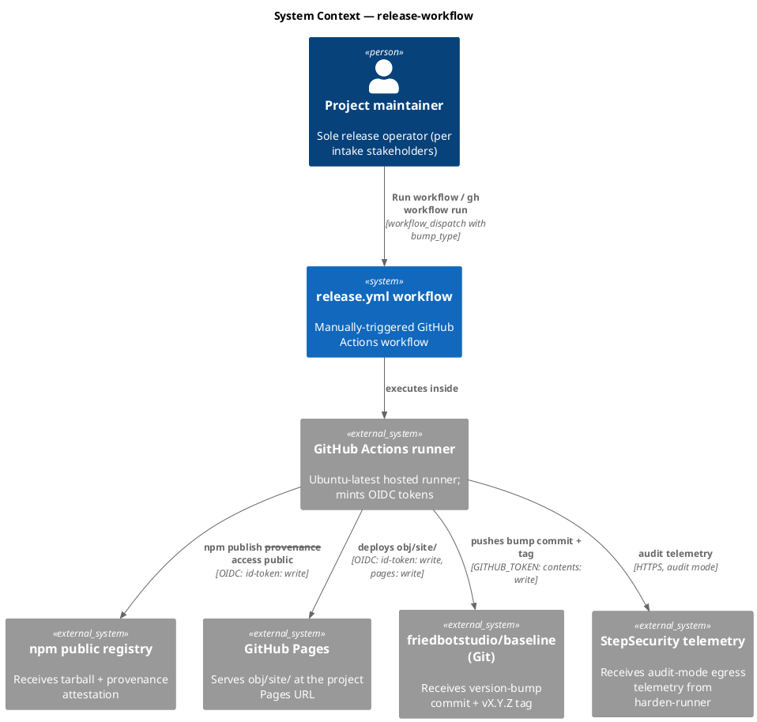

### C4 — Container

Deployable units inside the workflow boundary.

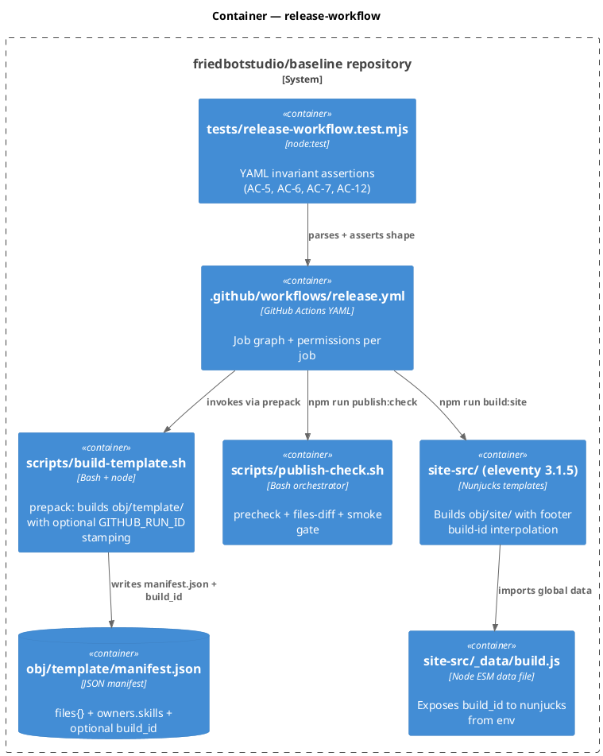

### C4 — Component (the release.yml workflow)

The job graph inside the workflow YAML — four jobs, three permission scopes.

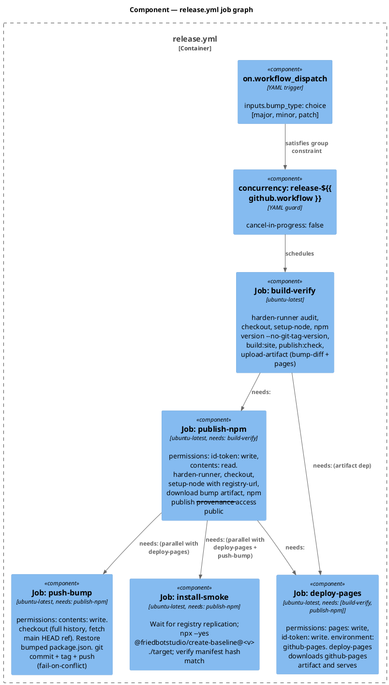

### Data model — class diagram

Inputs/outputs of the bump step + the manifest schema change.

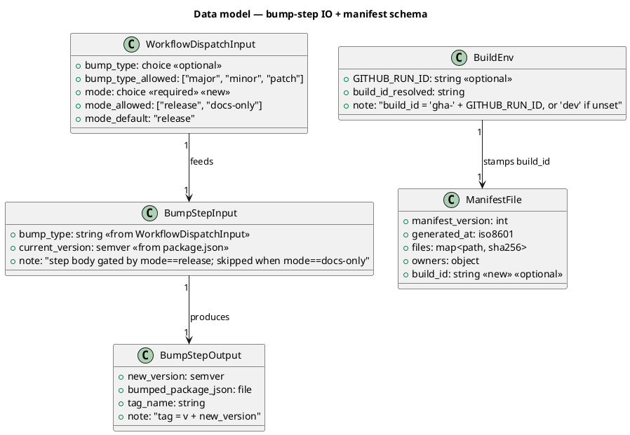

#### Migration "DDL" (JSON schema delta)

The `manifest.json` schema gains one optional top-level field. No backfill needed (existing manifests without the field remain valid).

```sql
-- forward (conceptual; obj/template/manifest.json is JSON, not SQL)
-- manifest.json: ADD top-level OPTIONAL field `build_id: string`.
-- Writer: scripts/build-template.sh — if $GITHUB_RUN_ID is set, stamp
--   "build_id": "gha-${GITHUB_RUN_ID}". Otherwise omit the key entirely
--   (do not write "build_id": "dev" — keep dev manifests byte-identical
--   to the pre-change shape so template-payload.test.mjs stays green).

-- reverse
-- Remove the build_id field from manifest writes; existing manifests
-- with the field already present remain readable by any consumer that
-- ignores unknown keys (default node JSON parsing behavior).
```

### Behavior — sequence per AC

The sequences below are the contract. Each sequence's `==` dividers mark which AC its segment satisfies.

#### §Behavior #1 — Trigger, bump, build-verify job (AC-1, AC-2 bump portion, AC-3 precheck gate, AC-9 build-id, AC-11 failure fence)

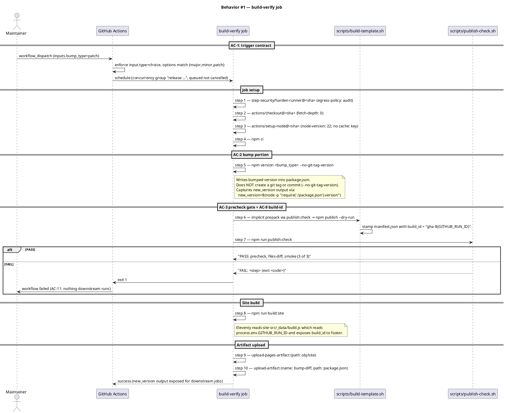

#### §Behavior #2 — publish-npm job (AC-4 provenance)

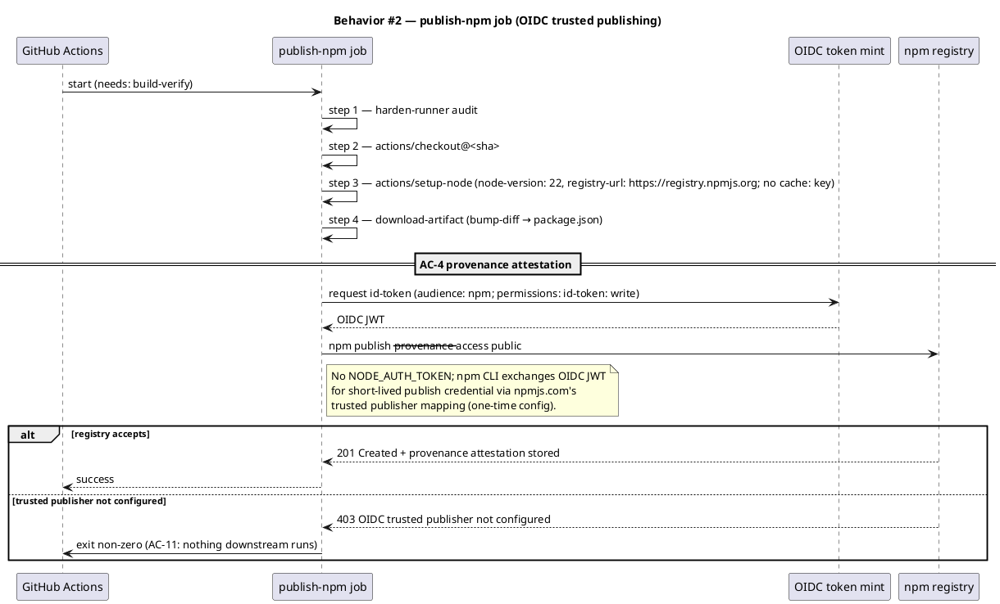

#### §Behavior #3 — deploy-pages job (AC-8 Pages deploy)

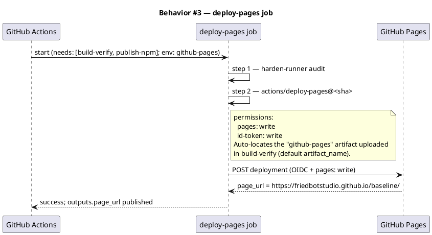

#### §Behavior #4 — push-bump job (AC-2 push portion)

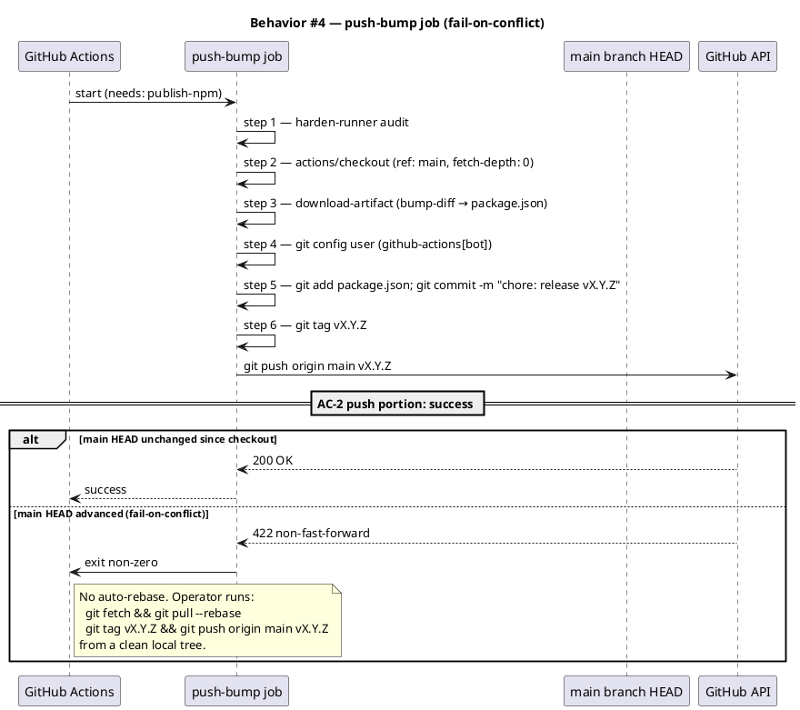

#### §Behavior #5 — install-smoke job (AC-10 post-publish smoke)

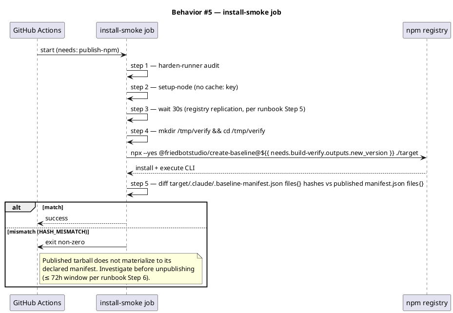

#### §Behavior #6 — Static invariants on the YAML (AC-5, AC-6, AC-7, AC-12)

These are not behaviors of a running workflow — they are invariants on the source YAML, enforced by `tests/release-workflow.test.mjs` at `npm test` time. Modeled as one "sequence" of test interactions so the AC table can point to a real diagram.

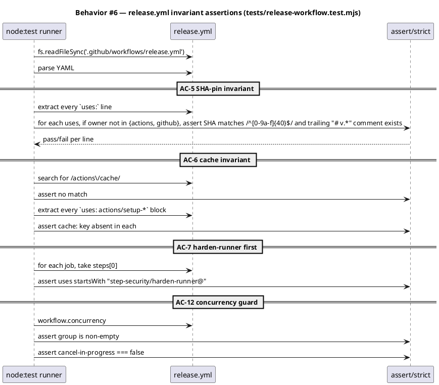

### State — core entity

This workflow has no persistent state machine of its own. Each run is stateless: bump-then-publish-then-deploy completes or fails on a fresh runner, leaving its effects on npm + Pages + Git. The intentional choice is documented here so reviewers see we considered it.

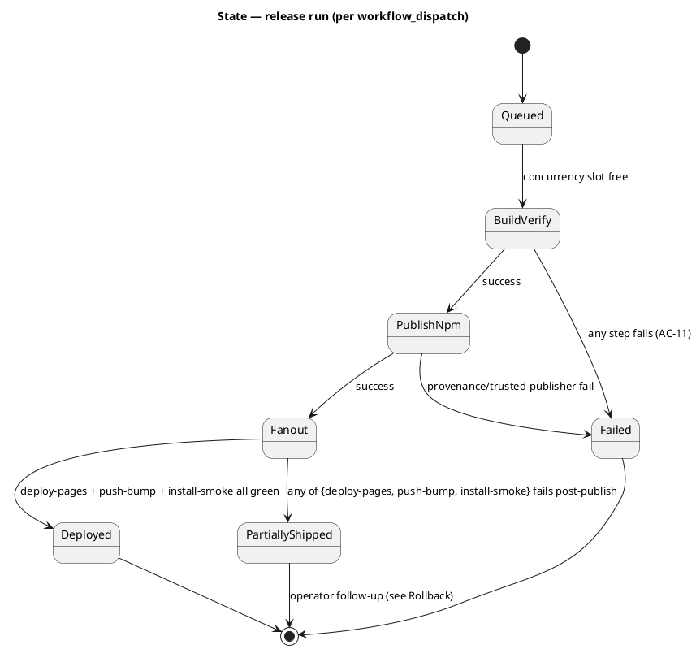

### Dependencies — graph

Directed graph of build/runtime dependencies. Edge `A --> B` reads "A depends on B".

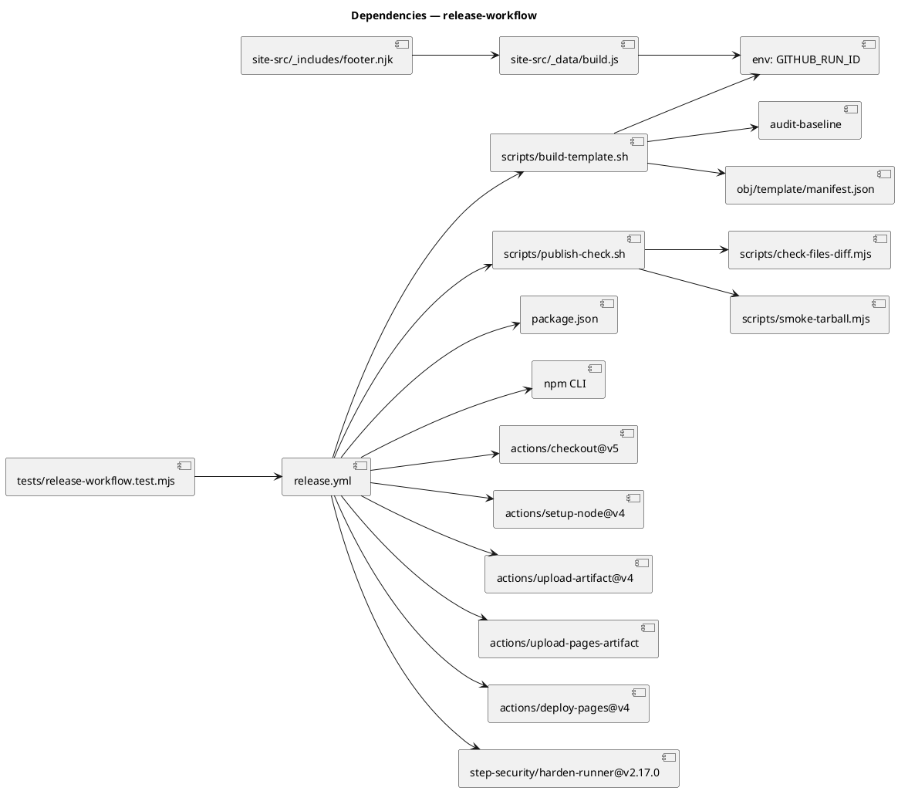

### Contracts

| Kind | Name | Input | Output | Errors | Idempotent |
|---|---|---|---|---|---|
| Workflow trigger | `workflow_dispatch` on `release.yml` | `bump_type ∈ {major, minor, patch}` | a workflow run | `bump_type` outside the choice list — GitHub rejects at submission | no (each run produces a new published version) |
| CLI | `npm version <bump_type> --no-git-tag-version` | `bump_type` | bumped `package.json`; stdout = new version with `v` prefix | non-semver current version — exit non-zero | yes for a given input + tree state |
| Shell | `bash scripts/publish-check.sh` | env (incl. `PUBLISH_CHECK_SIMULATE_FAIL`) | exit 0 + `PASS: precheck, files-diff, smoke (3 of 3)` on stdout; exit non-zero + `FAIL: <step> (exit <code>)` on stderr | per sub-check (DECLARED-NOT-PACKED, HASH_MISMATCH, …) | yes for a given tree |
| CLI | `npm publish --provenance --access public` (called from publish-npm job) | OIDC JWT (audience npm), `package.json` + `obj/template/` | 201 + provenance attestation on registry | 403 trusted publisher not configured; 409 version exists; 5xx registry | no (version is single-use) |
| GitHub API | `actions/deploy-pages@v4` | uploaded artifact "github-pages" | `outputs.page_url` | non-zero on Pages config missing | yes (re-deploy is harmless) |
| Git | `git push origin main vX.Y.Z` (push-bump job) | bumped commit + tag | 200 OK on fast-forward | 422 non-fast-forward (fail-on-conflict) | no (commit + tag are unique) |
| File | `obj/template/manifest.json` | `scripts/build-template.sh` runs | JSON file with `manifest_version, generated_at, files, owners, build_id?` | n/a (writer is deterministic) | yes per source tree + env |
| File | `site-src/_data/build.js` (new) | `process.env.GITHUB_RUN_ID` | nunjucks global `build_id` | falls back to `"dev"` when env unset | yes |
| Test | `tests/release-workflow.test.mjs` (new) | `.github/workflows/release.yml` parsed via `yaml` parser | pass/fail per assertion | per AC (SHA pin, cache, harden-runner, concurrency) | yes |

### Libraries and versions

Every API confirmed via the `context7` MCP or — for `step-security/harden-runner`, `actions/deploy-pages`, and `actions/upload-pages-artifact` (which context7 does not cover) — via the action's own README on github.com. Recorded library versions reflect what the docs example pins at this writing; the actual `.github/workflows/release.yml` MUST pin every third-party action to a 40-character commit SHA with the tag in a trailing comment (AC-5).

| Library@version | Purpose | Key APIs | Confirmed via |
|---|---|---|---|
| `actions/checkout@v5` | check out the repo on the runner | `fetch-depth`, `ref`, default `persist-credentials: true` | context7 `/actions/checkout` (Versions: v5) |
| `actions/setup-node@v4` | install Node + configure npm registry | `node-version`, `registry-url` (no `cache:` key — the action rejects `cache: false` with "Caching for 'false' is not supported"; omit the key to disable caching) | context7 `/websites/npmjs` example: setup-node@v4 with registry-url |
| `actions/upload-artifact@v4` | inter-job transfer of bumped `package.json` | `name`, `path` | context7 `/actions/upload-artifact` (current major) |
| `actions/upload-pages-artifact` *(pin SHA at implement-time)* | bundle `obj/site/` for the Pages deploy | `path: obj/site` (default artifact name `github-pages`) | WebFetch `github.com/actions/deploy-pages` README pair-action note |
| `actions/deploy-pages@v4` | deploy GitHub Pages from the named artifact | `environment: name: github-pages, url: outputs.page_url`; permissions `pages: write, id-token: write`; default `artifact_name: github-pages` | WebFetch `github.com/actions/deploy-pages` |
| `step-security/harden-runner@v2.17.0` (SHA `f808768d1510423e83855289c910610ca9b43176`) | egress monitoring, audit mode | `egress-policy: audit`; first step in every job | WebFetch `github.com/step-security/harden-runner` (current major v2.19.1; the action's README ships v2.17.0 as the pre-pinned getting-started example) |
| `npm@bundled with Node 22` | `npm version`, `npm publish --provenance --access public`, `npm run *` | `npm version <bump> --no-git-tag-version`; `npm publish --provenance --access public` | context7 `/websites/npmjs` (Trusted Publishing + Provenance) |
| `eleventy@3.1.5` | site build (existing) | `addPassthroughCopy`, `dir.{input, output}`, `_data/*.js` global data | `.eleventy.js` (already in tree); no API change beyond a new `_data/build.js` |

### Alternatives considered

| Alt | Summary | Rejected because |
|---|---|---|
| Monolithic single-job (Research Candidate A) | One job runs every step; `id-token: write` + `pages: write` + `contents: write` at job level | Violates least-privilege per GitHub's npm/PyPI OIDC examples; a pre-publish step would inherit OIDC for the npm audience |
| Two-job split (Research Candidate B) | `build-verify` then a combined `release` job | Still bundles npm OIDC + Pages OIDC + bump push under one permission set; permits a Pages-deploy step to read the npm-audience OIDC token |
| `NPM_TOKEN` secret + automation token | Long-lived token in a repo secret | Inconsistent with runbook's `auth-and-writes` 2FA mandate; cannot produce SLSA L3 provenance attestation |
| Auto-rebase on push conflict | `git pull --rebase` then push | Rebasing inside a release workflow is a recipe for surprise merges; `fail-on-conflict` is operator-recoverable in seconds |
| Run Pages deploy before npm publish | Deploy site first, then publish | Pages would be live for a version that never reached npm if publish fails after deploy; npm is the harder-to-roll-back artifact, so it lands last (here: in the gating publish-npm job before fanout) |

## Design calls

Two surfaces under `site-src/**` change: a new global data file feeds the footer, and the footer renders a build-id line.

| Slug | Intent | Target files | Write set | Register | References |
|---|---|---|---|---|---|
| footer-build-id | render a small, unobtrusive build-id line in the site footer that identifies which workflow run produced the deployed site (operational, not marketing) | `site-src/_includes/footer.njk`, `site-src/_data/build.js` | `site-src/_includes/footer.njk`, `site-src/_data/build.js` | inherit (matches existing footer voice — terse, structural, no marketing) | `site-src/_includes/footer.njk` current shape; eleventy 3.x global data docs |

Notes for the design-ui invocation `/tdd` Step 6 will make:

- The build-id renders as a *single line* under the existing footer-grid, in the existing `.footer-tagline` register or a smaller `.footer-meta` class — not a new card or a new section.
- Falls back gracefully to "dev" when `GITHUB_RUN_ID` is unset (local development should not show a misleading build id).
- No links, no badges, no shields.io — the build-id is plain text the operator can copy-paste into an issue.
- The classification at Stage 0 is **development** (existing footer + a small new data-binding), not a new design — `design-ui` may report `final_state: "not_a_design_task"` and route the change directly to the implement step. If that classification holds, `/tdd` Step 6 records the design-ui invocation result and proceeds; no `impeccable` recipe runs.

## Acceptance criteria

| ID | Criterion (given / when / then) | Upstream AC | Sequence |
|---|---|---|---|
| AC-001 | Given a maintainer with workflow-dispatch permission, when they submit `workflow_dispatch` with `bump_type ∈ {major, minor, patch}`, then the workflow accepts the input and runs without further user input | intake AC 1 | §Behavior #1 |
| AC-002 | Given `bump_type=patch` and current `package.json → version = X.Y.Z` on `main`, when the workflow completes successfully, then `package.json → version` on `main` is `X.Y.(Z+1)` and an annotated tag `vX.Y.(Z+1)` exists; bumps for `minor` and `major` follow semver | intake AC 2 | §Behavior #1 (bump) + §Behavior #4 (push) |
| AC-003 | Given the workflow has reached the precheck step, when `npm run publish:check` returns non-zero, then `npm publish` is NOT executed, no Pages deploy occurs, no commit is pushed, and the workflow exits non-zero with the failed sub-step named in the run log | intake AC 3 | §Behavior #1 (precheck alt-FAIL branch) |
| AC-004 | Given precheck passed and the publish-npm job runs, when `npm publish` invokes, then the registry record for `<new-version>` includes `dist.attestations.provenance` and the publish command was `npm publish --access public --provenance` (no `NODE_AUTH_TOKEN` on the publish step) | intake AC 4 | §Behavior #2 |
| AC-005 | Given the release workflow YAML, when every `uses:` line is inspected, then every reference outside `actions/*` and `github/*` namespaces is pinned to a 40-character SHA with the tag in a trailing `# vX.Y.Z` comment | intake AC 5 | §Behavior #6 (AC-5 segment) |
| AC-006 | Given the release workflow YAML, when grep'd, then `actions/cache` does not appear, and every `setup-*` action that supports caching MUST NOT declare a `cache:` key (omitting the key is the canonical way to disable caching; `cache: false` is rejected at runtime by `actions/setup-node@v4.x` with the fatal error "Caching for 'false' is not supported") | intake AC 6 | §Behavior #6 (AC-6 segment) |
| AC-007 | Given any job in this workflow, when the job starts, then `step-security/harden-runner` (audit mode) is the first step | intake AC 7 | §Behavior #6 (AC-7 segment) |
| AC-008 | Given precheck and publish both passed and the deploy-pages job runs, when `actions/deploy-pages` executes, then GitHub Pages serves the new build within the deploy step's window and `outputs.page_url` is non-empty | intake AC 8 | §Behavior #3 |
| AC-009 | Given a successful workflow run with run id `R`, when the published tarball's `obj/template/manifest.json` is inspected and the deployed Pages site's footer is inspected, then both carry `build_id = "gha-<R>"` | intake AC 9 | §Behavior #1 (manifest stamping) + §Behavior #3 (Pages deploy consumes the same artifact tree) |
| AC-010 | Given the publish-npm job has succeeded, when the install-smoke job runs, then `npx --yes @friedbotstudio/create-baseline@<new-version> ./target` exits zero from a fresh tmpdir and the materialized `target/.claude/.baseline-manifest.json` files{} hashes match the published `obj/template/manifest.json` files{} hashes | intake AC 10 | §Behavior #5 |
| AC-011 | Given any step in build-verify or publish-npm fails, when the step exits non-zero, then no downstream job runs (no Pages deploy, no bump push, no install-smoke) | intake AC 11 | §Behavior #1 (alt-FAIL) + §Behavior #2 (alt-FAIL) — `needs:` chain |
| AC-012 | Given a release workflow run is in progress, when a second `workflow_dispatch` is submitted, then the second run queues (does NOT cancel the first, does NOT run in parallel) | intake AC 12 | §Behavior #6 (AC-12 segment) |
| AC-013 | Given the operator submits `workflow_dispatch` with `mode=docs-only`, when the workflow runs, then (a) the bump step in build-verify is a no-op (package.json version unchanged), (b) jobs `publish-npm`, `push-bump`, and `install-smoke` are skipped via `if: inputs.mode == 'release'`, (c) `deploy-pages` runs (gated by `if: always() && needs.build-verify.result == 'success' && (needs.publish-npm.result == 'success' \|\| needs.publish-npm.result == 'skipped')` — the `build-verify.result == 'success'` clause prevents an artifact-less deploy attempt when `build-verify` itself fails, the exact failure mode of Release run 25821931162), and (d) the rendered site reflects the current package.json version, not a new one | extension 2026-05-13 | §Behavior #1 (mode-gating segment) + §Behavior #3 (deploy-pages run-when-skipped predicate) |

## Test plan

| Category | Scenario | Expected | Covers |
|---|---|---|---|
| Golden path | `tests/release-workflow.test.mjs` parses `.github/workflows/release.yml` and asserts `on.workflow_dispatch.inputs.bump_type` is `{type: 'choice', options: ['major','minor','patch'], required: true}` | pass | AC-001 |
| Golden path | Smoke: dry-run the bump step locally via `npm version patch --no-git-tag-version` against a fresh fixture `package.json`, assert version increments and no `.git` mutation | pass | AC-002 (bump portion) |
| Input boundary | YAML test asserts `bump_type` choice list has exactly 3 entries; `prerelease` is NOT in the list | pass | AC-001, non-goal Q-4 |
| Input boundary | YAML test asserts every job has `runs-on: ubuntu-latest` | pass | implementation invariant |
| Contract violation | Run `bash scripts/publish-check.sh` with `PUBLISH_CHECK_SIMULATE_FAIL=files-diff`, assert exit non-zero and stderr matches `FAIL: files-diff` | pass | AC-003 |
| Contract violation | YAML test asserts the publish-npm job's permissions block is `{id-token: write, contents: read}` (no `pages: write`, no `contents: write`) | pass | AC-004 (OIDC scope) |
| Contract violation | YAML test asserts every `uses:` outside `actions/*` / `github/*` matches `/^.+@[0-9a-f]{40}\s*#\s*v[0-9.]+/` | pass | AC-005 |
| Contract violation | YAML test asserts `release.yml` does NOT contain the substring `actions/cache`, and every `actions/setup-*` block has NO `cache:` key (the action rejects `cache: false`; omitting the key disables caching) | pass | AC-006 |
| Contract violation | YAML test asserts `jobs.<each>.steps[0].uses` startsWith `step-security/harden-runner@` for every job | pass | AC-007 |
| Concurrency / ordering | YAML test asserts top-level `concurrency.group` is a non-empty string and `concurrency.cancel-in-progress === false` | pass | AC-012 |
| Concurrency / ordering | YAML test asserts `jobs.publish-npm.needs == 'build-verify'`, `jobs.deploy-pages.needs == ['build-verify', 'publish-npm']`, `jobs.push-bump.needs == 'publish-npm'`, `jobs.install-smoke.needs == 'publish-npm'` | pass | AC-011 |
| Failure mode | Build-template fixture test: run `GITHUB_RUN_ID=12345 bash scripts/build-template.sh` against a temp fixture, assert resulting `manifest.json` contains `"build_id": "gha-12345"`; run without `GITHUB_RUN_ID`, assert the key is absent | pass | AC-009 |
| Failure mode | Eleventy build test: rebuild `obj/site/` with `GITHUB_RUN_ID=12345`, assert rendered `obj/site/index.html` contains the literal `gha-12345` in the footer region; rebuild without the env, assert the literal `dev` appears | pass | AC-009 |
| Regression trap | `tests/runbook-text.test.mjs` — pre-existing — still passes after `docs/runbooks/npm-publish.md` is updated additively | pass | scout landmine |
| Regression trap | `tests/template-payload.test.mjs`, `tests/template-drift.test.mjs`, `tests/manifest.test.mjs` — pre-existing — still pass after the `build_id` field becomes optionally present (dev manifests must remain byte-identical when `GITHUB_RUN_ID` is unset) | pass | scout co-change |
| Regression trap | `tests/publish-check.test.mjs` — pre-existing — still passes after no changes to `scripts/publish-check.sh` | pass | scout |
| Regression trap | `bash .claude/skills/audit-baseline/audit.sh` exits 0 (no audit drift introduced by the new `.github/workflows/release.yml`, `tests/release-workflow.test.mjs`, `site-src/_data/build.js`, footer edit, or build-template extension) | pass | CLAUDE.md Article XI |

## Observability

CI surface, not application runtime — "observability" here means what the operator and downstream auditors can see post-run.

| Signal | Name | Shape | Purpose |
|---|---|---|---|
| Log | GitHub Actions run log per job | structured per `step.name` and `step.outcome` | operator debug |
| Log | `npm publish` stdout | tarball name + version + provenance subject digest | post-mortem on a bad release |
| Metric | `outputs.page_url` from `deploy-pages` | URL string | operator confirms Pages live at the expected URL |
| Metric | `outputs.new_version` from `build-verify` | semver string | propagates to publish-npm, push-bump, install-smoke |
| Metric (external) | `npm view @friedbotstudio/create-baseline --json` → `dist.attestations.provenance` | object (subject + predicate) | auditor confirms SLSA L3 provenance landed |
| Telemetry | harden-runner audit-mode egress log (StepSecurity portal) | per-run; HTTP/DNS calls observed | follow-up data for v2 block-mode allowlist |
| Alarm | (none) | n/a | this is a manual workflow; the operator is the on-call |

## Rollout

- **Feature flag**: none. The workflow is gated behind `workflow_dispatch` — until the operator runs it, it has no effect.
- **One-time prerequisites the operator MUST complete before the first run** (else first run will fail with diagnostic messages):
  1. **npm trusted publisher**: on `npmjs.com → packages → @friedbotstudio/create-baseline → Settings → Trusted Publishers`, add `friedbotstudio/baseline` + workflow filename `release.yml` + environment (none / `github-pages` is fine — the publish-npm job does NOT use the github-pages environment).
  2. **GitHub Pages source**: Repo Settings → Pages → Source = "GitHub Actions" (not "Deploy from a branch").
  3. **2FA**: `npm profile get tfa` returns `auth-and-writes` (runbook mandate; OIDC trusted publishing is unaffected by `auth-and-writes`).
  4. **Branch protection on `main`** *(soft recommendation, not blocking)*: allow `github-actions[bot]` to push directly so the push-bump job's fast-forward succeeds.
- **Order of landing**:
  1. Land `.github/workflows/release.yml`, `tests/release-workflow.test.mjs`, the `scripts/build-template.sh` extension, `site-src/_data/build.js`, the footer change, and the runbook addendum — all in one commit (the workflow is non-functional without the supporting changes, and the supporting changes are no-ops without the workflow).
  2. Operator completes the three one-time prerequisites above.
  3. First real release: run `workflow_dispatch` with `bump_type=patch` against a known-clean tree. The first 72h carries an `npm unpublish` window if the first publish reveals a misconfiguration.

## Rollback

- **Workflow-level kill-switch**: disable the workflow via Actions UI ("Disable workflow" on `release.yml`). No further dispatch can run.
- **Per-release rollback** (when a specific version is broken post-publish):
  - **Within 72h**: `npm unpublish @friedbotstudio/create-baseline@<broken-version>` (operator-run, runbook Step 6).
  - **After 72h**: `npm deprecate @friedbotstudio/create-baseline@<broken-version> "<message naming the fix>"`.
  - **Pages**: re-run only the `deploy-pages` job from a prior good run (Actions UI → "Re-run jobs" → select `deploy-pages`).
  - **Git**: the bump commit + tag are visible in history. To revert, `git revert <bump-commit>` from a clean tree, push, then dispatch the workflow again with the appropriate `bump_type` (you cannot "un-tag" cleanly in shared history; the deprecated version's tag remains).
- **Signal to roll back**: the install-smoke job is the in-CI canary — a HASH_MISMATCH there means the published tarball does not materialize to its declared manifest, and rollback should be immediate. Time-to-trip: ~3 minutes from `npm publish` to install-smoke verdict (registry replication wait + install + verify). Within the 72h `unpublish` window if caught here.

## Archive plan

- Defaults *(automatic)*: `docs/intake/release-workflow.md`, `docs/scout/release-workflow.md`, `docs/research/release-workflow.md`, `docs/specs/release-workflow.md`, `docs/specs/release-workflow.rendered/` (after `/spec-render`), spec approval token, security report (after Phase 8).
- Extras *(non-default files)*:
  - *(none)*

## Open questions

These are the unresolved items from research after the three resolved intake questions (OIDC, push-bump with fail-on-conflict, publish-before-deploy) are locked in. Each blocks approval until the reviewer signs off — they are intentionally small.

- **Q-A (resolved at spec time): Node major version on the runner.** **22** (matches runbook example; `tests/runbook-text.test.mjs` asserts the runbook). The `node-version: '22'` literal goes in every `setup-node` step.
- **Q-B (resolved at spec time): harden-runner egress mode.** **audit** for v1, matching runbook §"Future-CI invariants" Rule 3 framing as "evaluation candidate". Block mode is tracked as a follow-up after the first ~10 runs produce an allowlist.
- **Q-C (resolved at spec time): bump step implementation.** **`npm version <bump_type> --no-git-tag-version`** in the build-verify job. The push-bump job creates the commit + tag separately under the `github-actions[bot]` identity.
- **Q-D (resolved at spec time): build-id source.** **`gha-<GITHUB_RUN_ID>`** stamped into `manifest.json` by `scripts/build-template.sh` (omit key when env unset) and exposed to nunjucks via `site-src/_data/build.js` (falls back to `"dev"` when unset).
- **Q-E (open): first-publish prerequisites.** The Rollout section names the three one-time human steps (npm trusted publisher, Pages source, 2FA mode). Reviewer to confirm: are any additional prerequisites needed for the `friedbotstudio/baseline` repository specifically (e.g., an org-level Pages allowlist that requires a separate approval)?
- **Q-F (open): commit message format for the bump.** Spec uses `chore: release vX.Y.Z` (conventional-commit-flavored). Reviewer to confirm or supply a project-specific commit-message convention.
- **Q-G (open): tag annotation.** Spec uses an annotated tag (`git tag -a vX.Y.Z -m "..."`) by default. Reviewer to confirm vs. lightweight tag.
