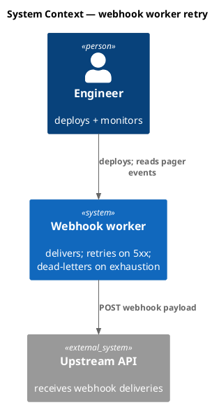
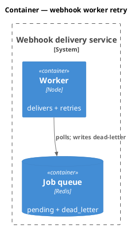
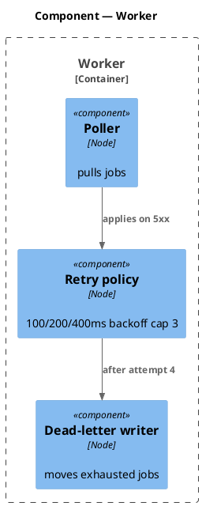
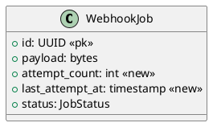
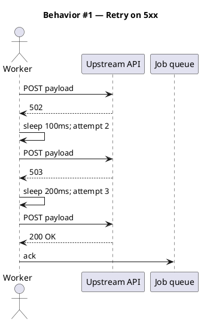
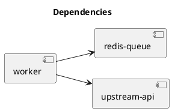

# Spec — webhook worker retry

<!--
Pre-feature spec snapshot fixture for brainstorm-and-codesign regression test.

This file represents the canonical output of the PRE-FEATURE /spec skill
(before /spec gained codesign_mode). It is the baseline against which
spec-codesign-off-regression.test.mjs asserts byte-identity when
workflow.json -> codesign_mode is false (the absence of the ## Decisions
section is the regression invariant).

Synthesized fixture — not a real production spec. Shortened to one minimal
sequence diagram so the fixture remains diffable; in real specs the full
diagram set per spec/template.md applies.
-->

## Context

| Input | Path |
|---|---|
| Intake | `docs/intake/webhook-worker-retry.md` |

## Goal

The webhook worker retries 5xx upstream responses with exponential backoff before dead-lettering.

## Non-goals

- Changing the webhook payload shape.

## Design

### C4 — System context



### C4 — Container



### C4 — Component



### Data model — class diagram



#### Migration DDL

```sql
-- forward
ALTER TABLE webhook_jobs ADD COLUMN attempt_count int NOT NULL DEFAULT 0;
ALTER TABLE webhook_jobs ADD COLUMN last_attempt_at timestamp;
-- reverse
ALTER TABLE webhook_jobs DROP COLUMN attempt_count;
ALTER TABLE webhook_jobs DROP COLUMN last_attempt_at;
```

### Behavior — sequence per AC

#### §Behavior #1 — Retry on 5xx with backoff (AC-001)



### Dependencies — graph



### Libraries and versions

| Library@version | Purpose | Key APIs | Confirmed via context7 |
|---|---|---|---|
| *(stdlib only)* | — | — | N/A |

### Alternatives considered

| Alt | Summary | Rejected because |
|---|---|---|
| A | infinite retry with cap on wall-clock | dead-letter signal would be lost |

## Design calls

- *(none)*

## Acceptance criteria

| ID | Criterion | Upstream AC | Sequence |
|---|---|---|---|
| AC-001 | given 502/503/504, when worker receives response, then retry 100/200/400ms cap 3 then dead-letter | intake AC 1 | §Behavior #1 |

## Test plan

| Category | Scenario | Expected | Covers |
|---|---|---|---|
| Golden path | 5xx then 200 on retry 2 | ack | AC-001 |

## Observability

| Signal | Name | Shape | Purpose |
|---|---|---|---|
| Log | `webhook.retry` | fields: job_id, attempt | debug |

## Rollout

- **Feature flag**: `webhook.retry_v2` — default off.
- **Migration order**: 1 DDL → 2 deploy worker → 3 flip flag.
- **Canary**: 5% traffic, 30 min.

## Rollback

- **Kill-switch**: flip `webhook.retry_v2` off.
- **Signal to roll back**: `webhook.dead_letter_rate` > baseline+50% / 5min window.

## Archive plan

- Defaults *(automatic)*.
- Extras: *(none)*.

## Open questions

- *(none)*
